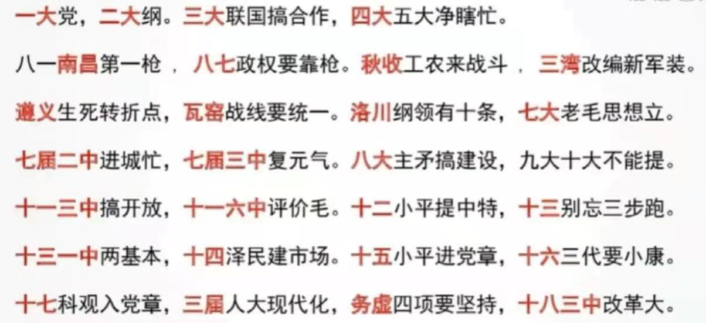

# 中国特色社会主义进入新时代

*   

1.  [开拓中国特色社会主义更为广阔的发展前景](#开拓中国特色社会主义更为广阔的发展前景)
2.  [夺取新时代中国特色社会主义伟大胜利](#夺取新时代中国特色社会主义伟大胜利)
3.  [不断谱写实现中华民族伟大复兴的新篇章](#不断谱写实现中华民族伟大复兴的新篇章)

## 开拓中国特色社会主义更为广阔的发展前景

全面建设小康社会目标和实现民族复兴中国梦：

*   中共十八大：
    *   科学发展观成为党的指导思想。
    *   中国特色社会主义的总依据是社会主义初级阶段，总布局是经济、政治、文化、社会、生态文明建设五位一体，总任务是实现社会主义现代化和中华民族伟大复兴。
    *   目标：2020年全面建成小康社会。（十六大是全面建设小康社会）。
    *   意义：开启了中国特色社会主义新时代。
*   中国梦：习近平参观“复兴之路”展览时，明确提出实现中华民族伟大复兴就是中华民族近代以来最伟大的梦想。
*   十二届人大一次会议上提出中国梦的内涵：
    *   实现中国梦就是要实现国家富强、民族振兴、人民幸福。
    *   实现中国梦必须走中国道路，即中国特色社会主义道路。
    *   实现中国梦必须弘扬中国精神。
    *   实现中国梦必须凝聚中国力量。

统筹推进“五位一体”总布局：

*   政治：发展社会主义民主政治。
*   经济（经济发展新常态）：从高速增长转为中高速增长；经济结构不断优化升级；从要素驱动、投资驱动转向为创新驱动。在新常态下要做到去产能、去库存、去杠杆、降成本、补短板（三去一降一补）。
*   文化：《中华人民共和国国歌法》。
*   社会：在发展中保障和改善民生。
*   生态：倡导“牢记使命、艰苦创业、绿色发展”的塞罕坝精神。

协调推进“四个全面”战略布局：

*   全面深化改革：总目标是“完善和发展中国特色社会主义制度，推进国家治理体系和治理能力现代化”。
*   全面依法治国：总目标是建设中国特色社会主义法治体系，建设社会主义法治国家。
*   全面建成小康社会。
*   全面从严治党：2016年，中共十八界六中全会通过《关于新形势下党内政治生活的若干准则》。

党和国家事业的历史性成就和历史性变革。

## 夺取新时代中国特色社会主义伟大胜利

在新时代坚持和发展中国特色社会主义：

*   中共十九大。
*   党的行动指南：习近平新时代中特色社会主义思想被确定为党的行动指南。
*   新时代中国特色社会主义思想的核心：坚持发展中国特色社会主义。
*   我国社会主要矛盾：已经转化为“人民日益增长的美好生活需要和不平衡不充分的发展之间的矛盾”。
*   目标：决胜全面建成小康社会、开启全面建设社会主义现代化国家新征程的目标。
*   两个阶段：第一阶段从2020年到2035年，基本实现现代化；第二阶段从2035年到21世纪中叶，把我国建设成为富强民主文明和谐美丽的社会主义现代化国家。

宪法修改及深化党和国家机构改革：十三届全国人大一次会议审议通过《中华人民共和国宪法修正案》。

## 不断谱写实现中华民族伟大复兴的新篇章

改革开放40年的巨大成就：十届全国人大三次会议高票通过《反分裂国家法》。

齐心协力走向中华民族伟大复兴的光明前景：

*   中国特色社会主义是改革开放以来党的全部理论和实践的主题。
*   途径：中国特色社会主义道路。
*   行动指南：中国特色社会主义理论体系。
*   根本保障：中国特色社会主义制度。
*   精神力量：中国特色社会主义文化。
