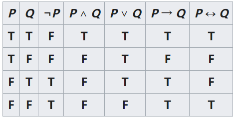
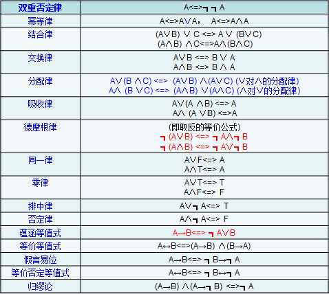
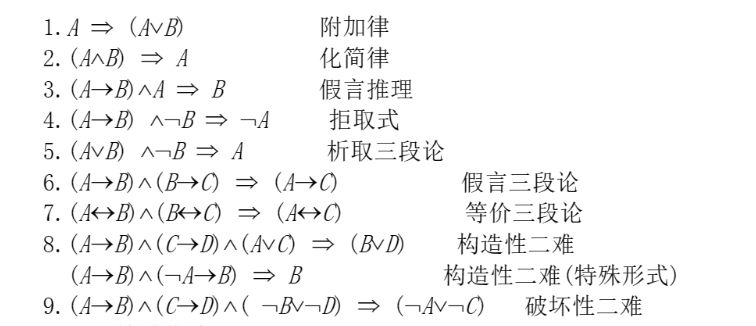
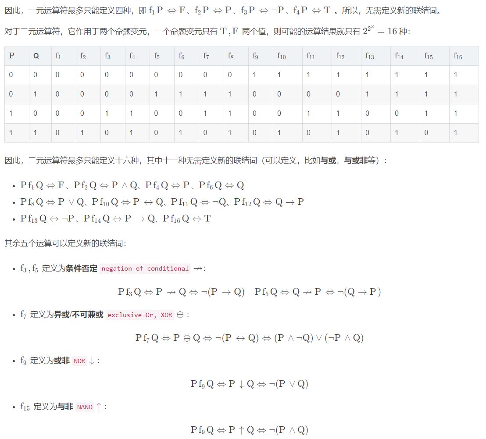

# 命题与命题公式

*   数理逻辑（Mathematical Logics），是用数学方法研究逻辑或形式逻辑的学科，属形式逻辑形式上符号化、数学化的逻辑，本质上仍属于知性逻辑的范畴。

1.  [命题与命题联结词](#命题与命题联结词)
2.  [命题公式的等值演算](#命题公式的等值演算)
3.  [联结词完备集](#联结词完备集)

## 命题与命题联结词

命题的基本概念：

*   在数理逻辑（符号逻辑）中把能判断真假的陈述句称为命题。
*   命题的概念包含了以下两个要素（缺一不可）：陈述句，能判断真假。

原子命题和复合命题：

*   如果一个命题不能再分解成更简单的命题，则称该命题为原子命题。
*   如果一个命题可分解为多个原子命题，则称该命题为复合命题。复合命题中的原子命题是用联结词来连接的。

逆否命题：

*   原命题：若A，则B。
*   逆命题：若B，则A。
*   否命题：若非A，则非B。
*   逆否命题：若非B，则非A。

充分必要条件：

*   有A就一定有B，则A是B的充分条件。
*   无A就一定无B，则A是B的必要条件。
*   有A就一定有B，无A就一定无B，则A是B的充要条件。

命题联结词：

*   否定联结词：设p为一个命题，复合命题`非p`称为`p的否定式`，记作`¬p`；`¬`称为否定联结词。
*   合取联结词：设p，q为两个命题，复合命题`p而且q`称为`p，q的合取式`，记作`p∧q`；`∧`称为合取联结词。
*   析取联结词：设p，q为两个命题，复合命题`p或者q`称为`p，q的析取式`，记作`p∨q`；`∨`称为析取联结词。
*   条件联结词：设p，q为两个命题，复合命题`如果p，则q`称为`p对q的蕴涵式`，记作`p→q`；`→`称为条件联结词（蕴涵联结词）。
*   双条件联结词：设p，q为两个命题，复合命题`p当且仅当q`称为`p，q的等价式`，记作`p↔q`；`↔`称为双条件联结词（等价联结词）。

命题的符号化：

*   通常用符号（英文字母，大小写皆可，也称之为命题标识符）来表示一个命题，这个过程称为命题的符号化。
*   对于命题的符号化可分为原子命题的符号化和联结词的符号化。
*   命题的符号化可按如下步骤进行：
    *   找出复合命题中的原子命题。
    *   用英文字母（推荐p，q，r...）表示这些原子命题。
    *   使用命题联结词将这些英文字母连接起来。

## 命题公式的等值演算

按下列规则构成的符号串称为命题演算的合式公式，也称为命题公式，简称公式。

1.  单个命题变元和常元是合式公式。
2.  如果A是合式公式，那么`¬A`也是合式公式。
3.  如果A和B是合式公式，那么`A∧B`，`A∨B`，`A→B`，`A↔B`也是合式公式。
4.  当且仅当有限次地应用了(1)、(2)、(3)所得到的符号串是合式公式。

命题公式一般用大写的英文字母（A，B，C...）表示。

为方便起见，对命题公式做如下约定：

*   最外层括号可以省略。
*   规定联结词的优先级由高到低依次为`¬`，`∧和∨`，`→和↔`。按此优先级别，如果去掉括号，不改变原公式运算次序，也可以省略这些括号。
*   命题公式中的命题变元（p，q，r...），也叫做命题公式的分量。

设A为一命题公式，P1、P2、...、Pn为出现在A中的所有命题变元，对P1、P2、...、Pn各指定一个真值，称为对A的一种指派或赋值。

*   若指定的一种指派使A的值为真，则称这组值为A的成真指派。
*   若指定的一种指派使A的值为假，则称这组值为A的成假指派。

在命题公式A中，对A的每一个赋值，就确定了A的一个真值，把它们汇列成表，称该表为命题公式A的真值表。

设A和B是两个命题公式，设P1、P2、...、Pn为所有出现于A和B中的原子变元，若给定P1、P2、...、Pn任一组真值指派，A和B的真值都相同，则称A和B是等值的或等价的，记为`A⇔B`。

证明两个命题公式等价的方法：

*   真值表法。
*   等价演算法：
    *   先用真值表法证明一组基本等价式，以它们为基础进行公式之间的演算。
    *   基本等价式常叫命题定律：

        

    *   定理：设Φ(A)是含有子公式A的命题公式，若`A⇔B`，如果将Φ(A)中A用B来置换，得到的公式记为Φ(B)，则`Φ(A)⇔Φ(B)`。满足此定理的置换叫做等价置换。

设A是任一命题公式：

*   若对A的任意赋值，其真值永为真，则称命题公式A为`重言式`或`永真式`。
*   若对A的任意赋值，其真值永为假，则称命题公式A为`矛盾式`或`永假式`。
*   若A不是矛盾式，则命题公式A为`可满足的`（由定义可以看出，任何重言式都是可满足的）。

设A、B为两个命题公式，`A⇔B`当且仅当`A↔B是重言式`。

设A、B为两个命题公式，`A⇔B`的充分必要条件是`A⇒B且B⇒A`。

设A、B为两个命题公式，若`A→B是重言式`，则称`A蕴涵B`，记为`A⇒B`。

证明`A蕴涵B`的时候可以用以下几种方法：

*   真值表法，等价演算法：将证明`A⇒B`转换为证明`A→B是重言式`（`¬A∨B的真值为T`）。
*   对A指定真值T，若由此推导出B的真值为T，则`A→B是重言式`，即`A⇒B`。或者证明其逆否命题，对B指定真值为F，由此推出A的真值为F。

蕴涵式是逻辑推理的重要工具，下面是一些重要的蕴涵式（其中`假言推理`、`拒取式`、`析取三段论`和`假言三段论`特别重要），也称为推理定律：

设A、B、C为合式公式，根据一些蕴涵关系能推导出一些蕴涵关系（类似于集合中的包含关系）：

*   A⇒A。
*   若A⇒B且A为重言式，则B必为重言式。
*   若A⇒B且B⇒C，则A⇒C。
*   若A⇒B且A⇒C，则A⇒B∧C。
*   若A⇒B且C⇒B，则A∨C⇒B。
*   若A⇒B，C为任意公式，在A∧C⇒B∧C。

## 联结词完备集

Q：两个变元总共有多少个不同的命题公式？
A：24=16

设S是一个联结词集合，如果任何n个变元组成的公式，都可以由S中的联结词来表示，则称S为联结词完备集。以下是一些常见的联结词完备集：

*   S1 = {`¬`，`∧`，`∨`，`→`，`↔`}
*   S2 = {`¬`，`∧`，`∨`，`→`}
*   S3 = {`¬`，`∧`，`∨`}
*   S4 = {`¬`，`→`}
*   S5 = {`¬`，`∧`}
*   S6 = {`¬`，`∨`}

设S是全功能联结词集，如果去掉其中的任何联结词后，就不是全功能联结词集，则称S是最小联结词完备集。`S5`、`S6`、`与非↑`、`或非↓`都是最小联结词完备集。
