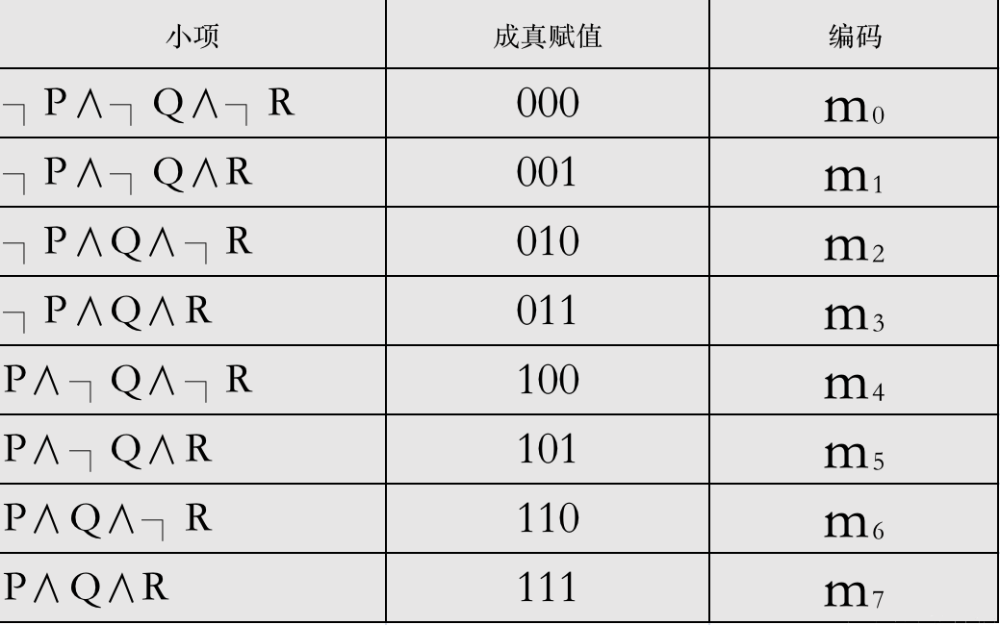
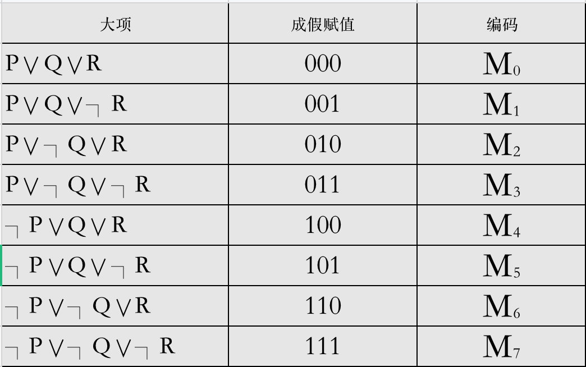

# 命题逻辑的推理理论

## 范式

析取范式和合取范式：

*   由一些命题变元或其否定构成的析取式称为简单析取式（约定单个变元或其否定是简单析取式）。
*   由一些命题变元或其否定构成的合取式称为简单合取式（约定单个变元或其否定是简单合取式）。
*   由简单析取式的合取构成的公式叫做合取范式（约定单个简单析取式是合取范式）。即：一个命题公式成为合取范式，当且仅当它具有型式：<code>A1∧A2∧...∧An</code>，其中A1、A2、...An都是由命题变元或其否定组成的析取式。
*   由简单合取式的析取构成的公式叫做析取范式（约定单个简单合取式是析取范式）。即：一个命题公式成为析取范式，当且仅当它具有型式：<code>A1∨A2∨...∨An</code>，其中A1、A2、...An都是由命题变元或其否定组成的合取式。

任何命题公式都可以化成与其等价的析取范式或合取范式（析取范式、合取范式并不唯一）。

求析取范式或合取范式的步骤如下：

*   消去联结词`→`和`↔`。
*   利用双重否定律消去否定联结词`¬`或利用德摩根律将否定联结词`¬`移到各命题变元前。
*   利用分配律、结合律将公式归约为合取范式或析取范式。

## 主范式

小项：

*   在简单合取式中，每个变元及其否定不同时存在，但两者之一必须出现且仅出现一次，这样的简单合取式叫做布尔合取（也叫做小项或极小项）。
*   一般来说，n个命题变元共有2n个小项。
*   两个命题变元p、q所构成的所有小项为：`p∧q`，`p∧¬q`，`¬p∧q`，`¬p∧¬q`。
*   三个命题变元所有的小项及其编码（肯定形式用1表示，否定形式用0表示）：

    

*   小项的性质：
    *   每个小项当其真值指派与编码相同时，其真值为T，在其余情况下均为F。
    *   任意两个不同的小项的合取式永假。
    *   全体小项的析取式永真。

主析取范式：

*   对于给定的命题公式，如果有一个它的等价公式，仅由小项的析取组成，称该公式为原公式的主析取范式。
*   任何命题公式都存在与之等价的主析取范式（唯一）。
*   构造命题公式的主析取范式有如下两种方法：
    *   真值表法：在真值表中，一个公式的成真指派所对应的小项的析取，即为该公式的主析取范式。
    *   等价演算法：
        1.  化归为析取范式。
        2.  除去析取范式中所有永假的简单合取式。
        3.  在简单合取式中，将重复出现的合取项和相同变元合并。
        4.  在简单合取式中补入没有出现的命题变元，即添加`∧(p∨¬p)`，再用分配律展开，最后合并相同的小项。
*   矛盾式无成真指派，因而主析取范式不含任何小项，将矛盾式的主析取范式记为0。而重言式无成假指派，因而主析取范式含2n个小项。至于可满足式，它的主析取范式中小项的个数一定小于等于2n。

大项：

*   在简单析取式中，每个变元及其否定不同时存在，但两者之一必须出现且仅出现一次，这样的简单析取式叫做布尔析取（也叫做大项或极大项）。
*   一般来说，n个命题变元共有2n个大项。
*   两个命题变元p、q所构成的所有大项为：`p∨q`，`p∨¬q`，`¬p∨q`，`¬p∨¬q`。
*   三个命题变元所有的大项及其编码（肯定形式用0表示，否定形式用1表示）：

    

*   大项的性质：
    *   每个大项当其真值指派与编码相同时，其真值为F，在其余情况下均为T。
    *   任意两个不同的大项的析取式永真。
    *   全体大项的合取式永假。

主合取范式：

*   对于给定的命题公式，如果有一个它的等价公式，仅由大项的合取组成，称该公式为原公式的主合取范式。
*   任何命题公式都存在与之等价的主合取范式（唯一）。
*   构造命题公式的主合取范式有如下两种方法：
    *   真值表法：在真值表中，一个公式的成假指派所对应的大项的合取，即为该公式的主合取范式。
    *   等价演算法：
        1.  化归为合取范式。
        2.  除去合取范式中所有永真的简单析取式。
        3.  在简单析取式中，将重复出现的析取项和相同变元合并。
        4.  在简单析取式中补入没有出现的命题变元，即添加`∨(p∧¬p)`，再用分配律展开，最后合并相同的大项。
*   矛盾式无成真指派，因而矛盾式的主合取范式含2n个大项。而重言式无成假指派，因而主合取范式不含任何大项，将重言式的主合取范式记为1。至于可满足式，它的主合取范式中大项的个数一定小于2n。

同一公式的主析取范式中m的下标和主合取范式中M的下标是互补的。因此，知道了主析（合）取范式就可以写出主合（析）取范式。

## 自然推理系统

`数理逻辑`的主要任务是用逻辑的方法研究数学中的`推理`。

*   所谓推理是指从`前提`出发，应用推理规则推出`结论`的思维过程。
*   任何一个推理都是由前提和结论两部分组成。前提就是推理所根据的已知命题，结论则是从前提出发通过推理而得到的新命题。
*   `数理逻辑是从形式结构上来研究推理的有效性`。

设H1，H2，...，Hn和C是n+1个命题公式，若<code>H1∧H2∧...∧Hn⇒C</code>，则称C为一组前提H1，H2，...，Hn的有效结论或逻辑结论。也称由前提H1，H2，...，Hn推出结论C的推理是有效的或正确的。

<code>H1∧H2∧...∧Hn⇒C</code>，亦可记为<code>H1∧H2∧...∧Hn⊦C</code>。

要证明C为一组前提H1，H2，...，Hn的有效结论，只需证明<code>H1∧H2∧...∧Hn→C是重言式</code>。证明一个公式是重言式，可使用的方法包括：

*   真值表法。
*   等价演算法。
*   主析（合）取范式。
*   `推理法`：根据已知的`等值公式和蕴涵式`，利用`推理规则`证明。

推理法分为直接推理和间接推理：

*   直接推理：
    *   直接推理的基本思想：由一组前提出发，利用一些公认的规则，根据已知的等价式或蕴涵式，推演得到有效结论。
    *   推理规则：
        *   P规则（前提引入规则）：前提在推导过程中的任何时候都可以引入使用。
        *   T规则（结论引入规则）：推理中，如果一个或多个公式，蕴涵了公式S，则公式S可以引入到以后的推理之中。
        *   转换规则：在推导过程的任何步骤上，命题公式中的子公式都可以用与之等价的公式置换（此规则也可以记为T规则）。

    *   推理定律（也称为等值的蕴涵式，在第一章中出现过）：

        

*   间接推理：
    *   归谬法（反证法）
    *   CP规则
