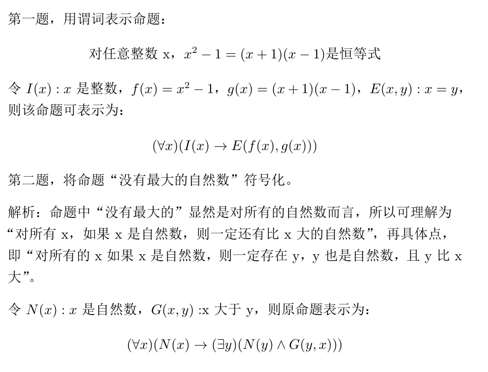
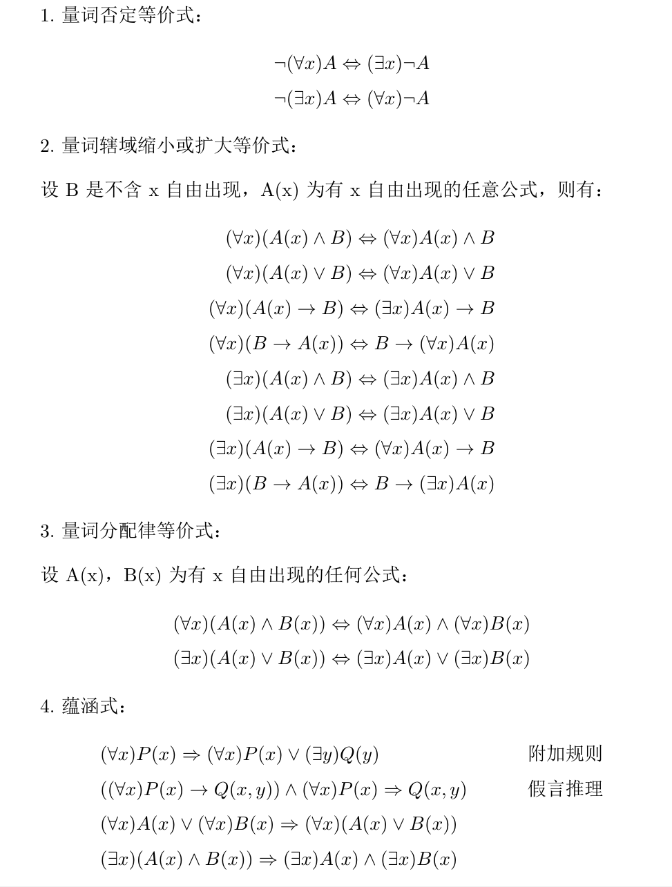

# 谓词逻辑

1.  [谓词的概念与表示](#谓词的概念与表示)
2.  [合式公式](#合式公式)
3.  [谓词演算的等价式与蕴涵式](#谓词演算的等价式与蕴涵式)
4.  [前束范式](#前束范式)
5.  [谓词演算的推理理论](#谓词演算的推理理论)

## 谓词的概念与表示

在谓词逻辑中：

*   命题是具有真假意义的陈述句，命题的真假与`个体`、`谓词`、`论域`和`量词`相关。
*   从语法上分析，一个陈述句可简单分为主语和谓语两部分。通过对这两部分的分析，可以揭示命题内部结构及其不同命题的内部结构关系，并且把主语称为`个体或客体`，把谓语称为`谓词`。

个体和谓词：

*   在原子命题中，所描述的对象称为`个体`；用以描述个体的性质或个体间关系的部分，称为`谓词`。
*   谓词，当与一个个体相联系时，它刻画了个体性质；当与两个或两个以上个体相联系时，它刻画了个体之间的关系。
*   个体的表示：用a，b，c...表示个体常元；用x，y，z...表示个体变元。
*   谓词的表示：谓词常元或谓词变元都用P，Q，R...表示。

命题的谓词表示：

*   一个原子命题用一个谓词（如P）和n个有次序的个体常元（如a1，a2，...，an）表示成<code>P(a1, a2, ...,an)</code>，称它为该命题的`谓词形式`。
*   注意：命题的谓词形式中的个体出现的次序影响命题的真值，不能随意变动，否则真值会有变化。
*   由一个谓词（如P）和n个个体变元（如x1，x2，...，xn）组成的<code>P(x1, x2, ...,xn)</code>，称它为`n元原子谓词`或n元命题函数，简称`n元谓词`。而个体变元的论述范围，称为`个体域或论域`。

通常，把一个n元谓词中的每个个体的论域综合在一起作为它的论域，称为n元谓词的`全总论域`。定义了全总论域，为深入研究命题提供了方便。当一个命题没有指明论域时，一般都将全总论域作为其论域。而这时又常常要采用一个谓词如P(x)来限制个体变元x的取值范围，并把P(x)称为`特性谓词`。

量词：

*   符号`∀`称为全称量词符，用来表达“对所有的”、“每一个”、“对任何一个”、“一切”等词语；`∀x`称为全称量词，x称为指导变元。
*   符号`∃`称为存在量词符，用来表达“存在一些”、“至少有一个”、“对于一些”、“某个”等词语；`∃x`称为存在量词，x称为指导变元。

量词与特性谓词的搭配：

*   如果使用特性谓词来表示论域：
    *   全称量词后跟一个条件式，特性谓词作为其前件出现，如`(∀x)(P(x)→Q(x))`。
    *   存在量词后跟一个合取式，特性谓词作为一个合取项出现，如`(∃x)(P(x)∧Q(x))`。
*   如果命题已经指明论域，那么就不用特性谓词：
    *   对于全称量词，可简化为`(∀x)Q(x)`。
    *   对于存在量词，可简化为`(∃x)Q(x)`。

## 合式公式

项由下列规则形成：

1.  个体常元和个体变元都是项。
2.  若f是n元函数，且t1，t2，...，tn是项，则<code>f(t1, t2, ..., tn)</code>是项。
3.  所有项都由(1)和(2)生成。

若P(x1, x2, ..., xn)是n元谓词，且t1，t2，...，tn是项，则称<code>P(t1, t2, ..., tn)</code>为`原子谓词公式`，简称原子公式。

`合式谓词公式`当且仅当由下列规则形成的符号串：

1.  原子公式是合式谓词公式。
2.  如果A是合式谓词公式，那么`¬A`也是合式谓词公式。
3.  如果A和B是合式谓词公式，那么`A∧B`，`A∨B`，`A→B`，`A↔B`也是合式谓词公式。
4.  如果A是合式谓词公式，x是个体变元，则`(∀x)A`、`(∃x)A`都是合式谓词公式。
5.  当且仅当有限次地应用了(1)、(2)、(3)、(4)所得到的符号串是合式谓词公式。

谓词逻辑的翻译：

*   把一个文字叙述的命题，用谓词公式表示出来，称为谓词逻辑的翻译或符号化。
*   一般来说，符号化的步骤如下：
    1.  正确理解给定命题：必要时把命题改叙，使其中每个原子命题、原子命题之间的关系能明显表达出来。
    2.  分解、给出特性谓词：把每个原子命题分解成个体、谓词、量词；在全总论域讨论时，要给出特性谓词。
    3.  找出恰当量词：应注意全称量词后跟条件式，存在量词后跟合取式。
    4.  表示：用恰当的联结词把给定命题表示出来。

使用谓词表示命题的例题：

约束变元与自由变元：

*   给定一个谓词公式A，其中有一部分公式形如`(∀x)B(x)`或`(∃x)B(x)`，则称它为A的x约束部分，称B(x)为相应量词的`作用域或辖域`。
*   在辖域中，x的所有出现称为约束出现，x称为`约束变元`。
*   B中不是约束出现的其他个体变元的出现称为自由出现，这些个体变元称为`自由变元`。

约束变元和自由变元相关的规则：

*   约束变元改名规则：将量词辖域中某个约束出现的个体变元及相应指导变元，改成本辖域中未曾出想过的个体变元，其余不变。
*   自由变元代入规则：对某自由出现的个体变元可用个体常元或用与原子公式中所有个体变元不同的个体变元去代入，且处处代入。

## 谓词演算的等价式与蕴涵式

谓词公式赋值：

*   若指定谓词公式的论域为有限集<code>{a1, a2, ..., an}</code>，可通过下列公式将量词消去：
    *   <code>∀xA(x)⇔A(a1)∧A(a2)∧...∨A(a1)</code>
    *   <code>∃xA(x)⇔A(a1)∨A(a2)∨...∨A(a1)</code>
*   消去量词和个体变元后，就变成普通的命题公式进行赋值运算，得到给定的谓词公式的真值。

等价式：

*   设A、B为任意两个谓词公式，E是它们的公有个体域，若：
    *   对于公式A和B中的谓词变元，指派以任一在E上有定义的确定的谓词。
    *   对于谓词公式中的个体变元，指派以E中任一确定的个体。所得到的命题具有同样的真值，则称A与B在E上是等价的，记为`A⇔B`，称`A⇔B为等价式`。
*   命题逻辑中的基本定律（基本等价式）都是谓词演算的等价式。

蕴涵式：命题逻辑中蕴涵式（或永真条件式）在谓词逻辑中都是逻辑有效的，而且使用代入规则得到蕴涵式也都是谓词逻辑中逻辑有效的。

等价式和蕴涵式：

## 前束范式

一个合式公式称为前束范式，如果它有如下形式：<code>(Q1x1)(Q2x2)...(Qkxk)B</code>。

*   其中Qi（1≤i≤k）为∀或∃，B为不含有量词的公式。称<code>(Q1x1)(Q2x2)...(Qkxk)</code>为公式的首标。
*   特别的，若某合式公式中无量词，那么它也可看作前束范式。
*   前束范式的特点是，所有量词均非否定地出现在公式最前面，且它的辖域一直延伸到公式之末。

前束范式存在定理：谓词逻辑中任意公式A都有与之等价的前束范式。

## 谓词演算的推理理论

量词消去规则：

1.  全称量词消去规则（简称UI或US规则），简记`∀-`：
    1.  <code>(∀x)A(x)⇒A(c)</code>，其中c为任意个体常元。
    2.  <code>(∀x)A(x)⇒A(y)</code>，其中y在A(x)中式自由出现的。
2.  存在量词消去规则（简称EI或ES规则），简记`∃-`：
    1.  <code>(∃x)A(x)⇒A(c)</code>，其中c为特定个体常元。
    2.  <code>(∃x)A(x)⇒A(y)</code>，不推荐使用，容易出错。
    *   上述两种规则成立的充分条件是：
        1.  c或y不得在前提中或者居先推导公式中出现或自由出现。
        2.  若A(x)中有其他自由变元时，不能应用本规则。

量词产生（引入）规则：

1.  存在量词产生规则（简称EG规则），简记`∃+`：
    1.  <code>A(c)⇒(∃y)A(y)</code>，其中c为特定个体常元。
    2.  <code>A(x)⇒(∃y)A(y)</code>。
    *   上述两种规则成立的充分条件是：
        1.  取代c的个体变元y不在A(c)中出现。
        2.  y在A(x)中是自由出现的。
2.  全称量词产生规则（简称UG规则），简记`∀+`：
    1.  <code>A(x)⇒(∀y)A(y)</code>，不推荐使用，容易出错。
    *   上述规则成立的充分条件是：
        1.  前提A(x)对于x的任意取值都成立。
        2.  y在A(x)中式自由出现的。
        3.  对于由于使用EI规则所得到的公式中原约束变元及与其在同一个原子公式的自由变元，都不能使用本规则而称为指导变元，否则将产生错误推导。

量词消去规则和产生规则使用总结：先消存在量词、后消全称量词；不使用全称量词产生规则。

谓词演算中的推理：

*   谓词演算的推理方法是命题逻辑推理方法的扩展，因此在命题逻辑中利用的推理规则（T规则、P规则和CP规则），还有已知的等价式、蕴涵式以及有关量词的消去和产生规则都可以使用。
*   使用的推理方法是直接证法和间接证法。
