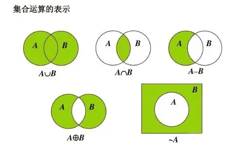
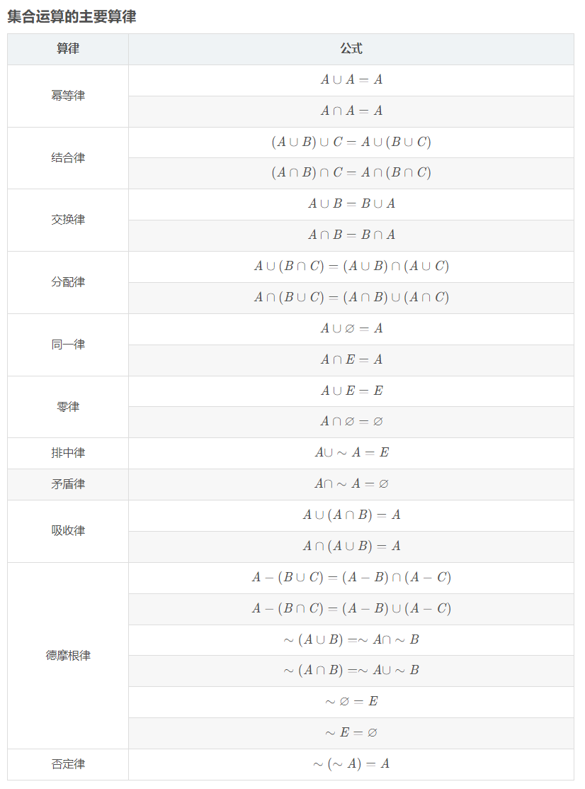

# 集合

1.  [集合的基本概念](#集合的基本概念)
2.  [集合的运算](#集合的运算)
3.  [有序对与笛卡尔积](#有序对与笛卡尔积)

## 集合的基本概念

集合：一些离散个体组成的全体；组成集合的个体称为它的元素或成员。

集合的表示：

*   列元素法：A={a, b, c, d}。
*   谓词表示法：B={x | P(x)}，B由使得P(x)为真的x构成。

常用数集：N、Z、Q、R、C分别表示自然数、整数、有理数、实数、复数集合。

元素与集合的关系：隶属关系。

*   属于：`∈`。
*   不属于：`∉`。

对于任何集合A和元素x（可以是集合），x∈A和x∉A两者成立其一，且仅成立其一。

集合中元素不能重复出现，但出现次序无关紧要。

集合之间的关系：包含（`⊆`），不包含（`⊈`），相等（`=`），不相等（`≠`），真包含（`⊂`），不真包含（`⊄`）。

| Relationship | Definition            |
| ------------ | --------------------- |
| 包含（子集） | `A⊆B ⇔ ∀x(x∈A → x∈B)` |
| 不包含       | `A⊈B ⇔ ∃x(x∈A ∧ x∉B)` |
| 相等         | `A=B ⇔ A⊆B ∧ B⊆A`     |
| 不相等       | `A≠B`                 |
| 真包含       | `A⊂B ⇔ A⊆B ∧ A≠B`     |
| 不真包含     | `A⊄B`                 |

空集：`Ø`，不含任何元素的集合。

*   空集是任何集合的子集。
*   空集是唯一的。

全集：E，全集包含任何集合。

幂集：定义为由该集合全部子集（包括空集）为元素构成的集合，称为集合A的幂集。

*   `P(A)={x|x⊆A}`。
*   如果集合A的元素个数是n，那么P(A)的元素个数为2n。

## 集合的运算

集合基本运算：并（`∪`），交（`∩`），差（`-`），对称差（`⊕`），绝对补（`~`）。

| Relationship | Definition                        |
| ------------ | --------------------------------- |
| 并           | `A∪B = {x \| x∈A ∨ x∈B}`          |
| 交           | `A∩B = {x \| x∈A ∧ x∈B}`          |
| 差（相对补） | `A-B = {x \| x∈A ∧ x∉B}`          |
| 对称差       | `A⊕B = (A-B)∪(B-A) = (A∪B)-(A∩B)` |
| 绝对补       | `~A = E-A`                        |

集合运算的文氏图表示：

集合运算的算律：

集合相等的证明方法：

1.  互为子集法：先证明`A⊆B`，再证明`B⊆A`，那么就相等。
2.  集合运算法。
3.  反证法（通常用于证明某集合等于空集时使用）。

集合的计数：

*   若A和B均为有限集，则：`|A∪B| = |A| + |B| - |A∩B|`。
*   若A，B，C均为有限集，则：`|A∪B∪C| = |A| + |B| + |C| - |A∩B| - |B∩C| - |A∩C| + |A∩B∩C|`。

## 有序对与笛卡尔积

有序对：

*   由两个客体x和y，按照一定的顺序组成的二元组称为有序对，记作`<x, y>`。
*   有序对的性质：
    *   有序性：`<x, y> ≠ <y, x>`（当x≠y时）。
    *   `<x, y> = <u, v> ⇔ x=u ∧ y=v`。
*   一个有序n（n≥3）元组<code><x1, x2, ..., xn></code>是一个有序对，其中第一个元素是一个有序n-1元组，即<code><x1, x2, ..., xn> = <<x1, x2, ..., xn-1>, xn></code>。当n=1时，`<x>`形式上可以看成有序1元组。

笛卡尔积：

*   设A，B为集合，A与B的笛卡尔积记作`A×B`，即`A×B = {<x, y> | x∈A ∧ y∈B}`。
*   如果A的元素个数为m，B的元素个数为n，则`|A×B| = m×n`。
