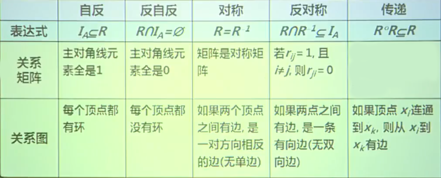
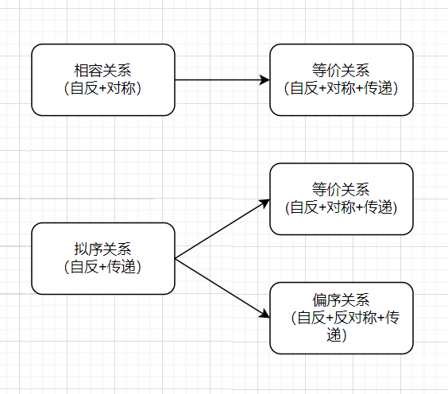
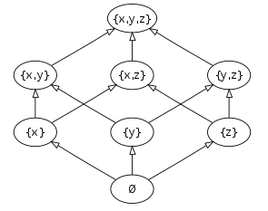

# 关系与函数

1.  [关系及其性质](#关系及其性质)
2.  [关系的运算](#关系的运算)
3.  [等价关系与序关系](#等价关系与序关系)
4.  [函数](#函数)

## 关系及其性质

关系及其表示：

*   设A，B为集合，A×B的任何子集叫做`从A到B的二元关系`，当A=B时则叫做`A上的二元关系`，简称为`关系`，记作`R`（从此开始，如果没有明确说明，R表示某种关系，而不是实数集）。
*   关系是一种集合，是笛卡尔乘积的子集（集合中元素是有序对）。

设A为任意集合：

*   Ø是A上的关系，称为`空关系`。
*   EA称为`全域关系`，定义是：<code>EA = {<x, y> | x∈A ∧ y∈A} = A×A</code>。
*   IA称为`恒等关系`，定义是：<code>IA = {<x, x> | x∈A}</code>。

其他的一些关系：

*   小于等于关系：<code>LA = {<x, y> | x,y∈A ∧ x≤y}</code>，A⊆R，R为实数集合。
*   整除关系：<code>DA = {<x, y> | x,y∈B ∧ x整除y}</code>，B⊆Z*，Z*为非0整数集（6÷2=3，其中2整除6，6能被2整除）。
*   包含关系：<code>R⊆ = {<x, y> | x,y∈A ∧ x⊆y}</code>，A是集合族。
*   类似的还可以定义大于等于关系、小于关系、大于关系、真包含关系等等。

定义域、值域和域：

*   定义域：`domR = {x | ∃y(<x, y>∈R)}`。
*   值域：`ranR = {y | ∃x(<x, y>∈R)}`。
*   域：`fldR = domR ∪ ranR`。

关系的表示方式：

*   集合方式：序偶的集合。
*   代数方式：关系矩阵（适合计算）。
*   几何方式：关系图（更加直观）。

关系矩阵：若<code>A={x1, x2, ..., xm}</code>，<code>B={y1, y2, ..., yn}</code>，R是从A到B的关系（R⊆A×B），R的关系矩阵是布尔矩阵<code>MR=[rij]m×n</code>，其中<code>rij=1 ⇔ <xi, yj>∈R</code>。

关系图：若<code>A={x1, x2, ..., xm}</code>，<code>B={y1, y2, ..., yn}</code>，R是从A到B的关系（R⊆A×B）：

*   集合中的元素x1，x2，...，xm和y1，y2，...，yn分别作为图中的结点，用`○`表示。
*   如果<xi, yj>∈R，则从xi到yj用一条有向边相连。

关系的性质：

*   自反性与反自反性：
    *   设R为A上的关系：
        *   若`∀x(x∈A → <x, x>∈R)`，则称R在A上`自反`的。
        *   若`∀x(x∈A → <x, x>∉R)`，则称R在A上`反自反`的。
    *   关系R在A上，要么是`自反`，要么是`反自反`，要么`既不是自反也不是反自反`。
*   对称性与反对称性：
    *   设R为A上的关系：
        *   若`(∀<x, y>)(<x, y>∈R → <y, x>∈R)`，则称R为A上的`对称`关系。
        *   若`(∀<x, y>)(<x, y>∈R∧<y, x>∈R → x=y)`，则称R为A上的`反对称`关系。
    *   关系R在A上，可以同时有对称性和反对称性，可以同时没有，也可以只有一个另一个没有。
*   传递性：
    *   设R为A上的关系：
        *   若`(∀<x, y>)(∀<y, z>)(<x, y>∈R∧<y, z>∈R → <x, z>∈R)`，则称R为A上的`传递`关系。

## 关系的运算

关系是一个集合，因此，所有集合的运算及规律均适用于关系，除此以外还有如下运算。

布尔运算：

*   若矩阵A中每个元素要么是1要么是0，那么A称为布尔矩阵（Boolean Matrix）。
*   设A=[aij]，B=[bij]均为m×n的布尔矩阵，定义<code>A∨B=C=[cij]</code>，称之为A和B的`并`：
    *   如果aij=1或bij=1，则cij=1。
    *   如果aij=0且bij=0，则cij=0。
*   设A=[aij]，B=[bij]均为m×n的布尔矩阵，定义<code>A∧B=C=[cij]</code>，称之为A和B的`交`：
    *   如果aij=1且bij=1，则cij=1。
    *   如果aij=0或bij=0，则cij=0。
*   设A=[aij]为m×p的布尔矩阵，B=[bij]为p×n的布尔矩阵，定义<code>A⊙B=C=[cij]</code>，称之为A和B的`布尔积`：
    *   如果∃k，1≤k≤n，使得aik=1且bkj=1，则cij=1。
    *   否则cij=0。

逆运算：

*   设R是集合A到B的二元关系，称`R-1={<y, x> | <x, y>∈R}为R的逆`。
*   设R和S是集合A到B的二元关系，则：
    1.  MR∩S = MR ∧ MS。
    2.  MR∪S = MR ∨ MS。
    3.  MR-1 = (MR)T。
*   设R和S是集合A到B的二元关系，则（Rc表示R的补）：
    1.  若R⊆S，则R-1⊆S-1。
    2.  若R⊆S，则Sc⊆Rc。
    3.  (R∩S)-1=R-1∩S-1，(R∪S)-1=R-1∪S-1。
    4.  (R∩S)c=Rc∪Sc，(R∪S)c=Rc∩Sc。

复合运算：设R是从A到B的二元关系，S是从B到C的二元关系，定义`R○S={<x, z> | ∃y(<x, y>∈R∧<y, z>∈S)}`，称`R○S为R和S的复合关系`。

*   重要提示：
    *   上述定义的关系复合属于右复合，本课程如无特殊说明，均指右复合。
    *   可以类似的定义左复合。
    *   本课程中，函数的复合也定义为右复合。
*   设F、G、H是任意的关系，则：
    *   <code>(F○G)○H = F○(G○H)</code>。
    *   <code>(F○G)-1 = G-1○F-1</code>。
*   设集合A，B，C均为有限集，<code>A={a1, a2, ..., am}</code>，<code>B={b1, b2, ..., bn}</code>，<code>C={c1, c2, ..., cp}</code>，R是A到B的二元关系，S是B到C的二元关系，则<code>MR○S=MR⊙MS</code>。
*   设R是A上的关系，n为自然数，则R的`n次幂`定义为：
    *   <code>R0={<x, x> | x∈A}=IA</code>。
    *   <code>Rn+1=Rn○R</code>。
    *   注意：
        *   对于A上的任何关系R1和R2都有R10=R20=IA。
        *   对于A上的任何关系R都有R1=R。
        *   对于集合表示的关系R，计算Rn就是n个R右复合。
*   设A为n元集（|A|=n），R是A上的关系，则存在自然数s和t（s≠t），使得<code>Rs=Rt</code>。
    *   证明Rs=Rt：R为A上的关系，由于|A|=n，A上的不同关系只有2n2个，所以一定存在s和t使得Rs=Rt（抽屉原理）。
*   设R是A上的关系，<code>m, n∈N</code>，则：
    *   <code>Rm○Rn=Rm+n</code>。
    *   <code>(Rm)n=Rmn</code>。

关系闭包：

*   设R是非空集合A上的关系，R的`自反`（`对称`或`传递`）闭包是A上的关系R'，使得R'满足以下条件：
    *   R'是自反的（对称的或传递的）。
    *   R⊆R'（R'比R只大不小）。
    *   对A上任何包含R的自反（对称或传递）关系R''有R'⊆R''（R'要添加最少的元素以满足自反、对称或传递性质）。
*   简述上面的三个条件：自反（对称、传递）闭包就是包含R的最小的自反（对称、传递）闭包
*   一般将R的自反闭包记作r(R)，对称闭包记作s(R)，传递闭包记作t(R)。
*   求闭包：设R为有穷集合A（|A|=n）上的关系，则有：
    1.  <code>r(R) = R∪IA</code>。
    2.  <code>s(R) = R∪R-1</code>。
    3.  <code>t(R) = R∪R2∪R3∪...∪Rn</code>。
    *   如果A为无穷集合，<code>t(R) = R∪R2∪R3∪...∪Rn∪...</code>。

关系性质与关系运算的总结：

1.  判断关系性质的充要条件（设R为A上的关系）：
    1.  R在A上`自反`当且仅当<code>IA⊆R</code>。
    2.  R在A上`反自反`当且仅当<code>R∩IA=Ø</code>。
    3.  R在A上`对称`当且仅当<code>R=R-1</code>。
    4.  R在A上`反对称`当且仅当<code>R∩R-1⊆IA</code>。
    5.  R在A上`传递`当且仅当<code>R○R⊆R</code>。
2.  运算与性质的关系：
3.  闭包运算：
    1.  设R1和R2为A上的关系，且R1⊆R2，则：
        1.  <code>r(R1)⊆r(R2)</code>。
        2.  <code>s(R1)⊆s(R2)</code>。
        3.  <code>t(R1)⊆t(R2)</code>。
    2.  设R和S都是A上的关系，则：
        1.  <code>r(R∪S)=r(R)∪r(S)</code>。
        2.  <code>s(R∪S)=r(R)∪r(S)</code>。
        3.  <code>t(R)∪t(S)⊆t(R∪S)</code>。
    3.  设R是集合A上的关系，则：
        1.  如果R是自反的，那么s(R)和t(R)也是自反的。
        2.  如果R是对称的，那么r(R)和t(R)也是对称的。
        3.  如果R是传递的，那么r(R)也是传递的。
    4.  设R是集合上的关系：则：
        1.  <code>rs(R)=sr(R)</code>。
        2.  <code>rt(R)=tr(R)</code>。
        3.  <code>st(R)⊆ts(R)</code>。

## 等价关系与序关系

特殊的二元关系：

划分：

*   设A为非空集合，<code>π={S1, S2, ..., Sm}, Si≠Ø, i=1, ..., m</code>，且满足：
    1.  <code>∀Si∈π，Si⊆A</code>。
    2.  <code>S1∪S2∪...∪Sm=A</code>。
    3.  <code>Si∩Sj=Ø，i≠j</code>。
*   则称π是A的一个`划分`。称<code>Si, i=1, ..., m</code>，是A的`划分块`。
*   定义中<code>Si∩Sj=Ø，i≠j</code>是指π中元素两两互不相交。

等价关系：

*   设R为非空集合A上的关系。如果R是自反的、对称的和传递的，则称R为A上的`等价关系`。设R是一个等价关系，若`<x, y>∈R`，则记作`x~y`，读作x等价于y。
*   实例：设A={1, 2, ..., 8}，如下定义A上的关系R：<code>R={<x, y> | x,y∈A ∧ x≡y(mod 3)}</code>，其中x≡y(mod 3)叫做x与y模3相等，即x除以3的余数与y除以3的余数相等。
*   设R为非空集合A上的关系，`∀x∈A`，令<code>[x]R={y | y∈A ∧ xRy}</code>，称<code>[x]R</code>为x关于R的`等价类`（也是一种划分块），简称为x的等价类，简记为`[x]`。
*   上述实例中的等价类：
    1.  [1] = [4] = [7] = {1, 4, 7}。
    2.  [2] = [5] = [8] = {2, 5, 8}。
    3.  [3] = [6] = {3, 6}。
*   设R为非空集合A上的等价关系，则：
    1.  ∀x∈A，[x]是A的非空子集。
    2.  ∀x,y∈A，如果xRy，则[x]=[y]。
    3.  ∀x,y∈A，如果x$R\mkern-10.5mu/$y，则[x]与[y]不交。
    4.  ∪{[x] | x∈A}=A，即所有等价类的并集就是A。
*   设R为非空集合A上的等价关系，以R的所有等价类作为元素的集合称为A关于R的商集，记作`A/R`，<code>A/R={[x]R|x∈A}</code>。
*   上述实例中的商集：A/R={[1], [2], [3]}。
*   等价关系与集合划分的一一对应：
    *   商集A/R就是A的一个划分。
    *   任给A的一个划分π，如下定义A上的关系R：`R={<x, y> | x,y∈A ∧ x与y在π的同一划分块中}`，则R为A上的等价关系，且该等价关系确定的商集就是π。

序关系：

*   非空集合A上的自反、反对称和传递的关系，称为A上的`偏序关系`，记作`≤`。设≤为偏序关系，若`<x, y>∈≤`，则记作x≤y，读作x“小于或等于”y。
*   集合A和A上的偏序关系≤一起叫做偏序集，记作<A, ≤>。
*   典型的偏序关系：整除关系、包含关系。
*   `x与y可比`：设R为非空集合A上的偏序关系，<code>x,y∈A，x与y可比 ⇔ x≤y ∨ y≤x</code>。
*   R为非空集合A上的偏序，`∀x,y∈A`，x与y都是可比的，则称R为`全序`（或`线序`）。
*   典型的全序关系：数集上的小于或等于关系。
*   覆盖关系：
    *   设R为非空集合A上的偏序关系，x,y∈A，如果x < y，且不存在z∈A使得x < z < y，则称y`覆盖`x。
    *   <code>COV A = {<a, b> | a∈A ∧ b∈A ∧ b覆盖a}</code>。
*   哈斯图：
    *   利用偏序自反、反对称、传递性简化的关系图。
    *   特点：每个结点没有环，两个连通的结点之间的序关系通过结点位置的高低表示，位置低的元素的顺序在前，具有覆盖关系的两个结点之间连边。
    *   <P({a, b, c}), R⊆>的哈斯图：

        

*   偏序集中的特殊元素：
    *   设<A, ≤>为偏序集，B⊆A，`y∈B`：
        1.  若∀x(x∈B→y≤x)成立，则称y为B的`最小元`。
        2.  若∀x(x∈B→x≤y)成立，则称y为B的`最大元`。
        3.  若¬∃x(x∈B∧x < y)成立，则称y为B的`极小元`。
        4.  若¬∃x(x∈B∧y < x)成立，则称y为B的`极大元`。
    *   最大元、最小元、极大元、极小元都是在子集B的范围内定义。都不一定存在；如果存在，最大（小）元是唯一的，极大（小）元不唯一。
    *   设<A, ≤>为偏序集，B⊆A，`y∈A`：
        1.  若∀x(x∈B→x≤y)成立，则称y为B的`上界`。
        2.  若∀x(x∈B→y≤x)成立，则称y为B的`下界`。
        3.  令C={y | y为B的上界}，则称C的最小元为B的`最小上界`（或`上确界`）。
        4.  令D={y | y为B的下界}，则称D的最大元为B的`最大下界`（或`下确界`）。

## 函数

函数的概念：

*   设F为二元关系，若`∀x∈domF`都存在`唯一的y∈ranF`使`xFy成立`，则称F为`函数`。
*   对于函数F，如果有xFy，则记作y=F(x)，并称y为F在x的值。
*   设A，B为集合，如果f为函数，domf=A，ranf⊆B，则称f为`从A到B的函数`，记作`f: A→B`。
*   设F、G为函数，则：
    *   `F=G ⇔ F⊆G∧G⊆F`。
    *   如果两个函数F和G相等，一定满足下面两个条件：
        1.  `domF = domG`。
        2.  `∀x∈domF=domG都有F(x)=G(x)`。
*   所有从A到B的函数的集合记作BA，读作“B上A”，符号化表示为：<code>BA={f | f:A→B}</code>。如果|A|=m，|B|=n，且m>0，n>0，|BA|=nm。
*   设函数f是A到B的关系，如果A1⊆A，A1在f下的`像`：<code>f(A1)={f(x) | x∈A1}</code>。
*   设`f: A→B`：
    1.  若ranf=B，则称f是`满射`的。
    2.  若∀y∈ranf都存在唯一的x∈A使得f(x)=y，则称f是`单射`的。
    3.  如果f即是满射又是单射，则称f是`双射`的。
*   设F，G是函数，则`F○G也是函数`，且满足：
    1.  `dom(F○G)={x | x∈domF ∧ F(x)∈domG}`。
    2.  `∀x∈dom(F○G)有F○G(x)=G(F(x))`。
*   反函数：对于双射函数`f: A→B`，称<code>f-1: B→A</code>是它的`反函数`。
