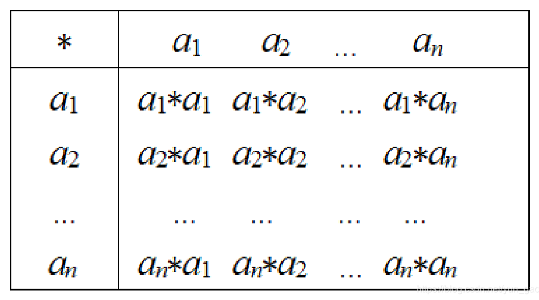
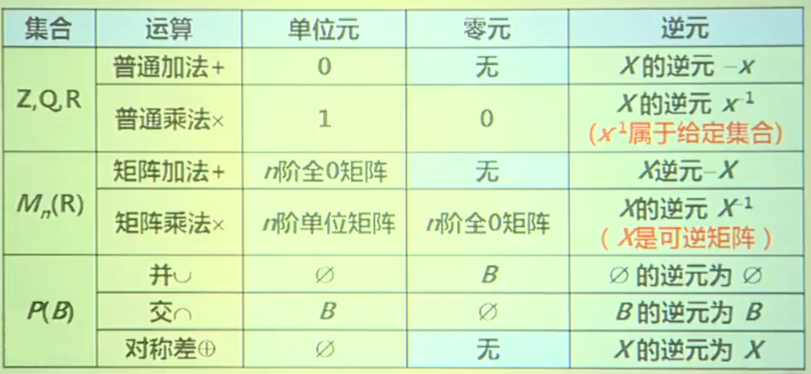
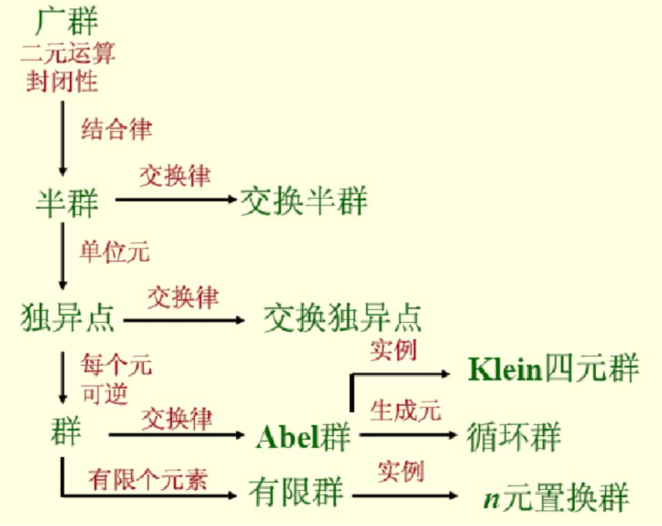

# 代数系统的一般概念

1.  [代数系统](#代数系统)
2.  [群与半群](#群与半群)
3.  [环与域](#环与域)

## 代数系统

二元运算及其性质：

*   设S为集合，函数`f: S×S→S`称为S上的二元运算，简称为`二元运算`。也称S对f`封闭`。
*   设S为集合，函数`f: S→S`称为S上的一元运算，简称为`一元运算`。
*   一个非空集合A，连同若干个定义在该集合上的运算f1，f2，...，fn所组成的系统，称为一个`代数系统`，简称为代数，记为：<code><A, f1, f2, ..., fn></code>。
*   二元与一元运算的表示：
    *   算符：○，*，⊕，⊗等符号。
    *   表示二元或一元运算的方法：公式或运算表。

        

    *   注意：在同一问题中不同的运算使用不同的算符。
*   设○为S上的二元运算：
    1.  如果对于任意的`x,y∈S`，有`x○y=y○x`，则称运算在S上满足`交换律`。
    2.  如果对于任意的`x,y,z∈S`，有`(x○y)○z=x○(y○z)`，则称运算在S上满足`结合律`。
    3.  如果对于任意的`x∈S`，有`x○x=x`，则称运算在S上满足`幂等律`。
*   设○和*为S上两个不同的二元运算：
    1.  如果对于任意的`x,y,z∈S`，有`(x*y)○z=(x○z)*(y○z)`或`z○(x*y)=(z○x)*(z○y)`，则称`○运算对*运算满足分配律`。
    2.  如果○和*都可交换，并且对于任意的`x,y∈S`，有`x○(x*y)=x`或`x*(x○y)=x`，则称`○运算和*运算满足吸收律`。

二元运算的特殊元素：

*   幺元（单位元）：
    *   设○为S上的二元运算，如果存在el（或er）∈S，使得对于任意的x∈S都有el○x=x（或x○er=x），则称el（或er）是S中关于○运算的`左（或右）单位元`。
    *   若e∈S关于○运算既是左单位元又是右单位元，即`e○x=x○e=x`，则称e为S上关于○运算的`单位元`，也叫做`幺元`。
*   零元：
    *   设○为S上的二元运算，如果存在θl（或θr）∈S，使得对于任意的x∈S都有θl○x=θl（或x○θr=θr），则称θl（或θr）是S中关于○运算的`左（或右）零元`。
    *   若θ∈S关于○运算既是左零元又是右零元，即`θ○x=x○θ=θ`，则称θ为S上关于○运算的`零元`。
*   可逆元素及其逆元：
    *   设○为S上的二元运算，令e为S中关于○运算的单位元，如果存在yl（或yr）∈S，使得对于任意的x∈S都有yl○x=e（或x○yr=e），则称yl（或yr）是x的`左（或右）逆元`。
    *   关于○运算，若y∈S既是x的左逆元又是x的右逆元，即`y○x=x○y=e`，则称y为x的`逆元`。
    *   如果x的逆元存在，就称x是`可逆的`。
*   
*   唯一性定理：如果一个代数系统中对于某种运算同时存在左幺元（零元、逆元）和右幺元（零元、逆元），则：
    1.  左右幺元（零元、逆元）相等且均等于幺元（零元、逆元）。
    2.  该代数系统对于此运算的幺元（零元、逆元）唯一。
*   设○为S上的二元运算，如果对于任意的`x,y,z∈S`，有`x○y=x○z`或`y○x=z○x`，且x不是零元，则`y=z`，则称运算在S上满足`消去律`。

## 群与半群

半群：

*   设`V=<S, ○>`是代数系统，○为二元运算，如果○运算是封闭的（运算结果依旧在S范围内）、可结合的（满足结合律），则称V为`半群`。
*   元素的幂运算定义：设`V=<S, ○>为半群`，对于任意x∈S，规定：
    1.  <code>x1=x</code>。
    2.  <code>xn+1=xn○x，n∈Z+</code>。
    3.  <code>xn○xm=xn+m</code>。
    4.  <code>(xn)m=xnm，n∈Z+，m∈Z+</code>。
*   设`V=<S, ○>为半群`：
    1.  若○运算是可交换的（满足交换律），则称V为`交换半群`。
    2.  若e∈S是关于○运算的单位元，则称V是`含幺半群`，也叫做`独异点`。独异点V记作`V=<S, ○, e>`。
*   独异点实例：<code><Zn, ⊕, 0></code>为交换半群与独异点，其中<code>Zn={0, 1, ..., n-1}</code>，⊕为`模n加法`（两数相加模n取余）。

群及其性质：

*   设`<G, ○>`是代数系统，○为二元运算，如果○运算是封闭的、可结合的，存在单位元e∈G，并且对G中的任何元素x都有x-1∈G，则称G为`群`。
*   验证代数系统是否为群，只需要逐一验证以下四个条件：
    1.  封闭性：`∀a, b∈G, a○b∈G`。
    2.  结合律：`(a○b)○c=a○(b○c)`。
    3.  有幺元：`e○x=x○e=x`。
    4.  每个元素都有逆元。
*   群实例：<code><Zn, ⊕></code>是群。其中<code>Zn={0, 1, ..., n-1}</code>，⊕为`模n加法`（两数相加模n取余）。
*   若群G是有穷集，则称G是`有限集`，否则称为`无线集`。
*   群G的基数称为群G的`阶`（基数就是群包含的元素个数：|G|=n）。
*   有限群G的阶记作|G|。
*   若群G中二元运算是可交换的，则称G为`交换群`或`阿贝尔（Abel）群`。
*   设G是群，x∈G，n∈Z，则`x的n次幂`xn定义为：
    1.  当n=0时，xn=e。
    2.  当n>0时，xn=xn-1○x。
    3.  当n<0，m=-n时，xn=(x-1)m，即m个逆元做○运算。
*   设G是群，x∈G，使得等式xk=e（k个x做○运算）成立的最小正整数k称为x的`阶（或周期）`，记作|x|=k，称x为`k阶元`。若不存在这样的正整数k，则称x为`无限阶元`。
*   元素的幂运算定义：设G为群，对于任意x∈G，y∈G，规定：
    1.  <code>(x-1)-1=x</code>。
    2.  <code>(xy)-1=y-1○x-1</code>。
    3.  <code>xn○xm=xn+m，n∈Z，m∈Z</code>。
    4.  <code>(xn)m=xnm，n∈Z，m∈Z</code>。
*   G为群，`∀a, b∈G`，方程ax=b和ya=b在G中有解且仅有唯一解。a-1b是ax=b的解，ba-1是ya=b的唯一解。
*   G为群，则G适合消去律，即`∀a, b, c∈G`有：
    1.  若ab=ac，则b=c（左消去律）。
    2.  若ba=ca，则b=c（右消去律）。
*   设G为群，H是G的非空子集，如果H关于G中的运算构成群，则称H是G的`子群`，记作H≤G。若H是G的子群，且H⊂G，则称H是G的`真子群`，记作H < G。
*   子群判定定理：设<G, *>是群，H是G的非空子集。H是G的子群当且仅当：
    1.  `∀a, b∈H`有`a*b∈H`。
    2.  `∀a∈H`有<code>a-1∈H</code>。
*   设G为群，a∈G，令<code>H={ak | k∈Z}</code>，则H是G的子群，称为`由a生成的子群，记作<a>`。
*   群G的中心C：设G为群，令C={a | a∈G ∧ ∀x∈G(ax=xa)}，则C是G的子群，称为G的`中心`。
*   设G为群，若存在a∈G使得G={ak | k∈Z}（即G中所有元素都可用某个元素的k次幂表示），则称G是`循环群`，记作`G=<a>`，称a为G的`生成元`。
*   循环群示例：`G={0°, 90°, 180°, 270°}`，其中<code>(90°)1=90°</code>，<code>(90°)2=180°</code>，<code>(90°)3=270°</code>，<code>(90°)4=0°</code>。

群之间的关系：

## 环与域

设`<R, +, ×>`是代数系统，+和×是二元运算，如果满足以下条件则称该代数系统是一个`环`：

1.  `<R, +>`构成交换群。
2.  `<R, x>`构成半群。
3.  ×运算关于+运算适合分配律。

设`<F, +, ×>`是代数系统，+和×是二元运算，如果满足以下条件则称该代数系统是一个`域`：

1.  `<F, +>`构成交换群。
2.  `<F, x>`构成交换群。
3.  ×运算关于+运算适合分配律。
