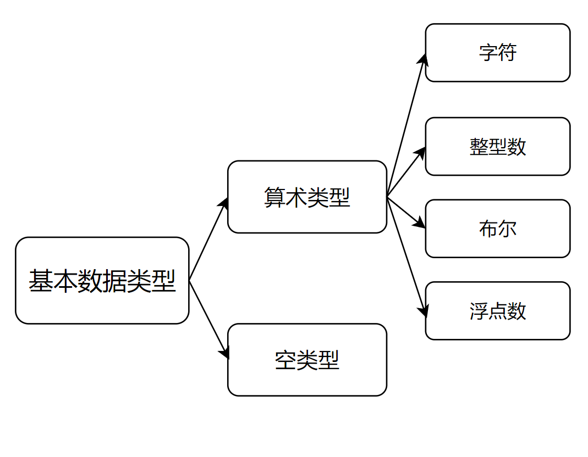
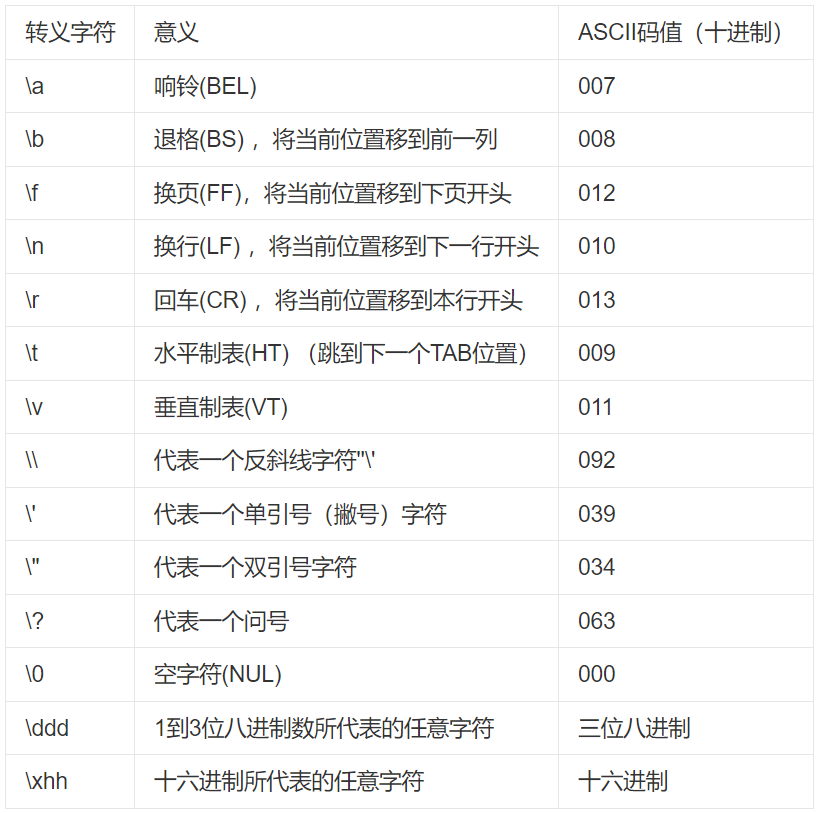

# 变量和基本类型

1.  [基本内置类型](#基本内置类型)
2.  [变量](#变量)
3.  [复合类型](#复合类型)
4.  [const限定符](#const限定符)
5.  [处理类型](#处理类型)
6.  [自定义数据结构](#自定义数据结构)

## 基本内置类型

C++定义了一套包括算术类型和空类型在内的基本数据类型：



|    类型     |      含义      |   最小尺寸   |                             介绍                              |
| :---------: | :------------: | :----------: | :-----------------------------------------------------------: |
|    bool     |    布尔类型    |    未定义    |                       取值为true或false                       |
|    char     |      字符      |     8位      |    char空间应确保存放机器基本字符集中任意字符对应的数字值     |
|   wchar_t   |     宽字符     |     16位     | wchar_t类型用于确保可以存放机器最大扩展字符集中的任意一个字符 |
|  char16_t   |  Unicode字符   |     16位     |                      为Unicode字符集服务                      |
|  char32_t   |  Unicode字符   |     32位     |                      为Unicode字符集服务                      |
|    short    |     短整型     |     16位     |                                                               |
|     int     |      整型      |     16位     |                 一个int至少和一个short一样大                  |
|    long     |     长整型     |     32位     |                  一个long至少和一个int一样大                  |
|  long long  |     长整型     |     64位     |        一个long long至少和一个long一样大，C++ 11中定义        |
|    float    |  单精度浮点数  | 6位有效数字  |                    以1个字（32比特）来表示                    |
|   double    |  双精度浮点数  | 10位有效数字 |                    以2个字（64比特）来表示                    |
| long doulbe | 扩展精度浮点数 | 10位有效数字 |               以3个或4个字（96或128比特）来表示               |

无符号类型和有符号类型：

*   int、short、long和long long都是带符号的，通常在这些类型名前添加unsigned就可以得到无符号类型，例如unsigned long。
*   类型unsigned int可以缩写为unsigned。
*   字符型分为三种：char、signed char和unsigned char。类型char实际上会表现为上述两种形式中的一种，具体是哪种由编译器决定。

如何选择类型？和C语言一样，C++的设计准则之一也是尽可能地接近硬件：

*   当明确知晓数值不可能为负时，选择无符号类型。
*   使用int执行整数运算。在实际应用中，short常常显得太小而long一般和int有一样的尺寸。如果你的数值超过了int的表示范围，选择long long。
*   在算术表达式中不要使用char或bool，只有在存放字符或布尔值时才使用它们。
*   执行浮点数运算选用double，这是因为float通常精度不够而且双精度浮点数和单精度浮点数的计算代价相差无几。long double提供的精度在一般情况下是没有必要的，况且它带来的运行时消耗也不容忽视。

类型转换（google style guide不推荐C风格类型转换）：

*   当我们把一个非布尔类型的算术值赋给布尔类型时，初始值为0则结果为false，否则结果为true。
*   当我们把一个布尔值赋给非布尔类型时，初始值为false则结果为0，初始值为true则结果为1。
*   当我们把一个浮点数赋给整数类型时，进行了近似处理。结果值将仅保留浮点数中小数点之前的部分。
*   当我们把一个整数值赋给浮点类型时，小数部分记为0。如果该整数所占的空间超过了浮点类型的容量，精度可能会损失。
*   当我们赋给无符号类型一个超出它表示范围的值时，结果是初始值对无符号类型表示数值总数取模后的余数。如把-1赋给8比特大小的unsigned char所得的结果是255。
*   当我们赋给带符号类型一个超出它表示范围的值时，结果是未定义的。此时，程序可能继续工作、可能崩溃，也可能生成垃圾数据。
*   src: type_conversion.cc

避免无法预知和依赖于实现环境的行为：

*   无法预知的行为源于编译器无须（有时是不能）检测的错误。即使代码编译通过了，如果程序执行了一条未定义的表达式，仍有可能产生错误。不幸的是，在某些情况或某些编译器下，含有无法预知行为的程序也能正确执行。但是我们却无法保证同样一个程序在别的编译器下能正常工作，甚至已经编译通过的代码再次执行也可能会出错。此外，也不能认为这样的程序对一组输入有效，对另一组输入就一定有效。
*   程序也应该尽量避免依赖于实现环境的行为。如果我们把int的尺寸看成是一个确定不变的已知值，那么这样的程序就称作不可移植的。当程序移植到别的机器上后，依赖于实现环境的程序就可能发生错误。要从过去的代码中定位这类错误可不是一件轻松愉快的工作。

字面值常量：

|     类型     |          示例          |
| :----------: | :--------------------: |
|  整型字面值  |     20, 024, 0x14      |
| 浮点型字面值 | 3.14, 3.14E0, 0., .001 |
|  字符字面值  |          'a'           |
| 字符串字面值 |     "Hello World"      |
|  布尔字面值  |      true, false       |
|  指针字面值  |        nullptr         |

关于NULL和nullptr：NULL是一个宏定义，而nullptr是C++11引入的关键字。

```c++
#ifdef __cplusplus
  #define NULL 0
#else
  #define NULL ((void *)0)
#endif
```

两类特殊的字符：

*   不可打印（nonprintable）的字符，如退格或其它控制字符。
*   转义序列（escape sequence），均以反斜线作为开始。

    

## 变量

变量定义的基本形式：首先是类型说明符，随后紧跟由一个或多个变量名组成的列表，其中变量名以逗号分隔，最后以分号结束。

当对象在创建时获得一个特定的值，我们说这个对象被初始化（initialized）了。

*   初始化不是赋值，初始化的含义是创建变量时赋予其一个初始值，而赋值的含义是把对象的当前值擦除，而以一个新值来代替。
*   如果定义变量时没有指定初值，则变量被默认初始化。
    *   如果是内置类型且定义于任何函数体之外，那么变量被初始化为0。如果在函数体内，变量的值是未定义的。
    *   每个类各自决定初始化对象的方式，有些类无需显式初始化就可以定义对象，有些必须显式初始化否则就报错。
*   未初始化的变量很有可能引发运行时故障。

变量声明和定义的关系：

*   为了允许把程序拆分成多个逻辑部分来编写，C++语言支持分离式编译（separate compilation）机制，该机制允许将程序分割成若干个文件，每个文件可被单独编译。
*   声明（declaration）：使得名字为程序所知，一个文件如果想要使用别处定义的名字则必须包含对那个名字的声明。
*   定义（definition）：负责创建与名字关联的实体。

```c++
extern int i;  // declaration
int j;         // definition
extern double pi = 3.1416;  // definition, because the PI variable is explicitly initialized
```

标识符（identifier）：由字母、数字和下划线组成，其中必须以字母或下划线开头。

*   C++中保留了一些名字，如关键字和操作符替代名，这些名字不能用作标识符。
*   C++标准库保留了一些名字。
*   用户自定义的标识符不能连续出现两个下划线，也不能以下划线紧连大写字母开头。

何为对象？

*   C++程序员们在很多场合都会使用对象（object）这个名词。通常情况下，对象是指一块能存储数据并具有某种类型的内存空间。
*   一些人仅在与类有关的场景下才使用“对象”这个词。另一些人则已把命名的对象和未命名的对象区分开来，他们把命名了的对象叫做变量。还有一些人把对象和值区分开来，其中对象指能被程序修改的数据，而值（value）指只读的数据。本书遵循大多数人的习惯用法，即认为对象是具有某种数据类型的内存空间。我们在使用对象这个词时，并不严格区分是类还是内置类型，也不区分是否命名或是否只读。

名字的作用域：

*   作用域（scope）是程序的一部分，同一个名字在不同的作用域中可能指向不同的实体。
*   C++语言中大多数作用域都以花括号分隔。
*   名字的有效区域始于名字的声明语句，以声明语句所在的作用域末端为结束。
*   全局作用域（global scope）内的名字在整个程序的范围内都可使用；块作用域（block scope）内的名字只能在块中使用。
*   作用域能彼此包含，被包含（或者说被嵌套）的作用域称为内层作用域（inner scope），包含着别的作用域的作用域称为外层作用域（outer scope）。
*   src: scope.cc

## 复合类型

复合类型（compound type）：引用和指针。

引用（reference）：是为一个已经存在的对象起的另外一个名字。

*   引用并非对象。
*   引用必须在定义时初始化，因为无法令引用重新绑定另外一个对象。
*   和引用绑定在一起的必须是一个已经存在的对象，而不能是字面值。

指针（pointer）：存放一个已经存在的对象的地址。

*   指针是一个对象，允许对指针的赋值和拷贝。
*   指针无须在定义时赋初值。若没有赋初值，指针将拥有一个不确定的值。
*   空指针：在C++11中最好使用nullptr来定义空指针，同时尽量避免使用NULL。
*   void类指针：可用于存放任意对象的地址，但是不能直接操作该类型所指的对象，因为我们并不知道这个对象到底是什么类型。
*   指向指针的指针：指针是内存中的对象，像其他对象一样也有自己的地址，因此允许把指针的地址再存放到另一个指针当中。

注意：

*   因为引用不是对象，没有实际地址，所以不能定义指向引用的指针。
*   无论是引用还是指针，它们的类型都要和它们所指向的对象严格匹配。
*   试图拷贝或以其它方式访问无效指针的值都将引发错误，并且编译器不会检测此类错误，后果无法预计，因此程序员必须清楚任意给定的指针是否有效。

```c++
// 变量的定义包括一个数据类型（type）和一组声明符
// 类型修饰符（* 和 &）只是声明符的一部分
int i = 1024, *p = &i, &r = i;
```

## const限定符

const类型定义的对象：

*   值不能被改变。
*   必须初始化。
*   如果在编译期已知该对象的值，那么编译器将在编译过程中把用到该变量的地方都替换成对应的值。
*   const对象被设定为仅在文件内有效，如果多个文件出现了同名的const对象时，其实相当于在不同文件中分别定义了独立的变量。如果想让编译器不为每个文件分别生成独立的变量，那么对于const变量不管是声明还是定义都添加extern关键字。

对const的引用（reference to const）：可以引用非const对象、const对象或常量，但是不能允许对const的引用去修改原本的值。

```c++
double dval = 3.14;

// If you assigning double to const int&
const int& ri = dval;

// In fact, it is equivalent to having assigning a temporary to const int&
const int temp = dval;
const int& ri = temp;
```

指向const的指针（pointer to const）：可以指向非const指针或const指针，但是不能允许指向const的指针去修改原本的值。

const指针（const pointer）：把指针定义为常量，必须初始化，初始化过后就不能修改该指针的值。

```c++
int i = 0;
int* const cp = &i;
```

顶层const和底层const：

*   指针本身是一个对象，它又可以指向另外一个对象。因此指针本身是不是常量和指针所指的是不是一个常量就是两个相互独立的问题。
*   顶层const（top-level const）：
    *   表示指针本身是个常量。
    *   如果对象是一个常量，而不是一个指向const的指针，那么此时顶层const指的就是常量的const，且没有底层const。
*   底层const（low-level const）：表示指针所指的对象是一个常量。

```c++
const int ci = 42;
const int* pci = &ci;

const int* const cpci = pci;  // The const on the right is a top-level const, and the const on the left is a low-level const
```

constexpr和常量表达式：

*   常量表达式（const expression）：是指值不会改变并且在编译过程就能得到计算结果的表达式。显然，字面值属于常量表达式，用常量表达式初始化的const对象也是常量表达式。
*   constexpr：C++11新标准规定，允许将变量声明为constexpr类型以便由编译器来验证变量的值是否是一个常量表达式。

```c++
// define a constexpr function
constexpr int Func(const int a) {
  return a;
}

const int a = 1;

// define a constexpr variable
constexpr int cei = Func(a);
```

指针和constexpr：

*   尽管指针和引用都能定义成constexpr，但它们的初始值却受到严格限制。一个constexpr指针的初始值必须是nullptr或0，或者是存储于某个固定地址的对象。然而函数体内定义的变量一般来说并非存放在固定地址中，因此constexpr指针不能指向这样的变量。相反的，定义于所有函数体之外的对象其地址固定不变，能用来初始化constexpr指针。
*   必须明确一点，在constexpr声明中如果定义了一个指针，限定符constexpr仅对指针有效，与指针所指的对象无关，其中的关键在于constexpr把它所定义的对象置为了顶层const。

```c++
const int* p = nullptr;      // A pointer to an integer constant
constexpr int* q = nullptr;  // A constant pointer to an integer
```

## 处理类型

类型别名：

*   传统的方法是使用关键字typedef：

    ```c++
    // use typedef
    typedef int* Pi;
    ```

*   新标准规定了一种新的方法，使用别名声明（alias declaration）来定义类型的别名：

    ```c++
    // use alias declaration
    using Pi = int *;
    ```

*   如果某个类型别名指代的是复合类型或常量，那么把它用到声明语句里就会产生错误的理解：

    ```c++
    typedef char* Pc;

    const Pc cstr = 0;     // A const pointer to a character
    const char* cstr = 0;  // A pointer to a character constant
    ```

auto类型说明符：

*   在C++03中，auto是一个存储类说明符，static、register和extern也是一样的。你只能在声明中使用这四种中的一种。
*   在C++11新标准中，引入了auto类型说明符，用它就能让编译器替我们去分析表达式所属的类型。
*   复合类型、常量和auto：
    *   编译器推断出来的auto类型有时候和初始值的类型并不完全一样，编译器会适当地改变结果类型使其更符合初始化规则。
    *   编译器推断一个引用类型时，auto会忽略引用：

        ```c++
        int i = 0, &ri = i;
        auto a = ri;  // A integer
        ```

    *   编译器推断一个常量时，auto一般会忽略掉顶层const，同时底层const则会保留下来：

        ```c++
        int i = 0;
        const int ci = i, &rci = ci;
        auto a = ci;   // A integer
        auto b = rci;  // A integer
        auto c = &ci;  // A pointer to an integer constant
        ```

    *   编译器推断一个常量时，auto用符号&或*修饰，则不会忽略掉顶层const：

        ```c++
        int i = 0;
        const int ci = i;
        auto& m = ci;   // A reference to an integer constant
        auto* p = &ci;  // A pointer to an integer constant
        ```

decltype类型指示符：

*   C++11新标准引入了第二种类型说明符decltype，它的作用是选择并返回操作数的数据类型。在此过程中，编译器分析表达式并得到它的类型，却不实际计算表达式的值。
*   decltype处理顶层const和引用的方式与auto有些许不同，它会保留顶层const和引用：

    ```c++
    const int ci = 0, &rci = ci;
    decltype(ci) x = 0;  // An integer constant
    decltype(rci) y = x;  // A reference to an interger constant
    ```

*   复合类型、括号和decltype：
    *   编译器推断一个表达式时，引用作为右值的计算可能会导致decltype忽略引用：

        ```c++
        int i = 42, &r = i;
        decltype(r + 0) b;   // An integer
        ```

    *   编译器推断一个表达式时，因为解引用指针可以得到指针所指的对象，而且还能给这个对象赋值，导致decltype的结果是引用类型：

        ```c++
        int i = 42, *p = &i;
        decltype(*p) c = i;  // A reference to integer
        ```

    *   编译器推断一个表达式时，如果给变量外加上一层或多层括号，变量将作为一种赋值语句左值的特殊表达式，导致decltype的结果是引用类型：

        ```c++
        int i = 42;
        decltype(i) d;        // An integer
        decltype((i)) e = i;  // A reference to integer
        ```

## 自定义数据结构

数据结构是把一组相关的数据元素组织起来然后使用它们的策略和方法。

src: sales_item/main.cc
