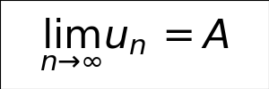
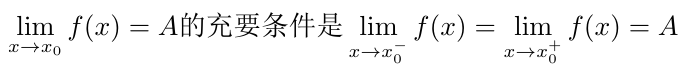
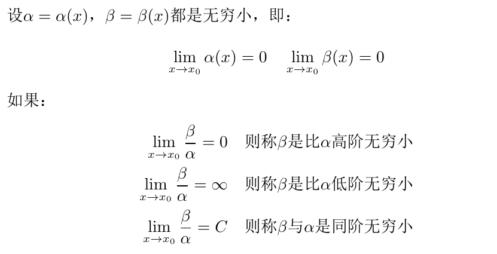
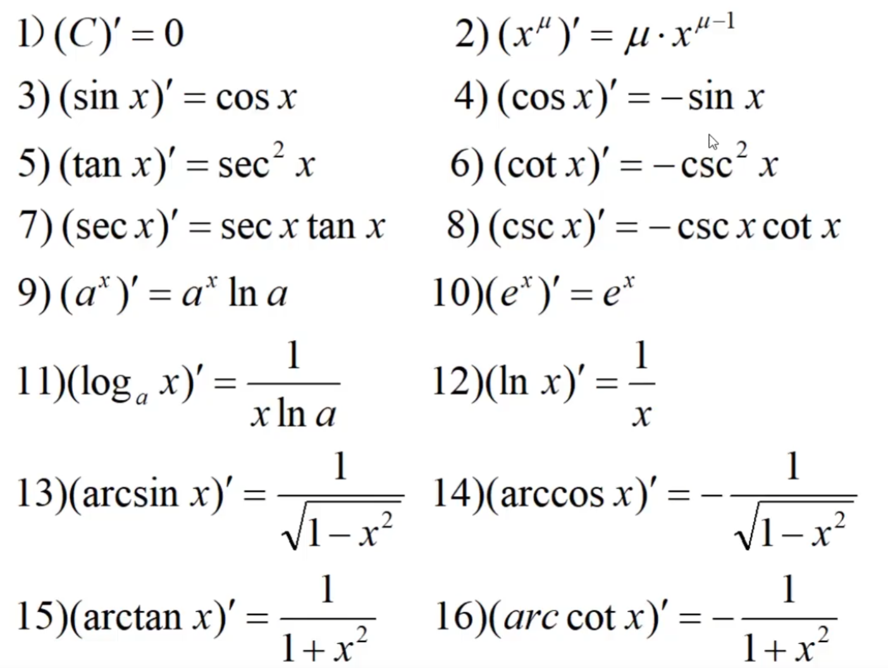
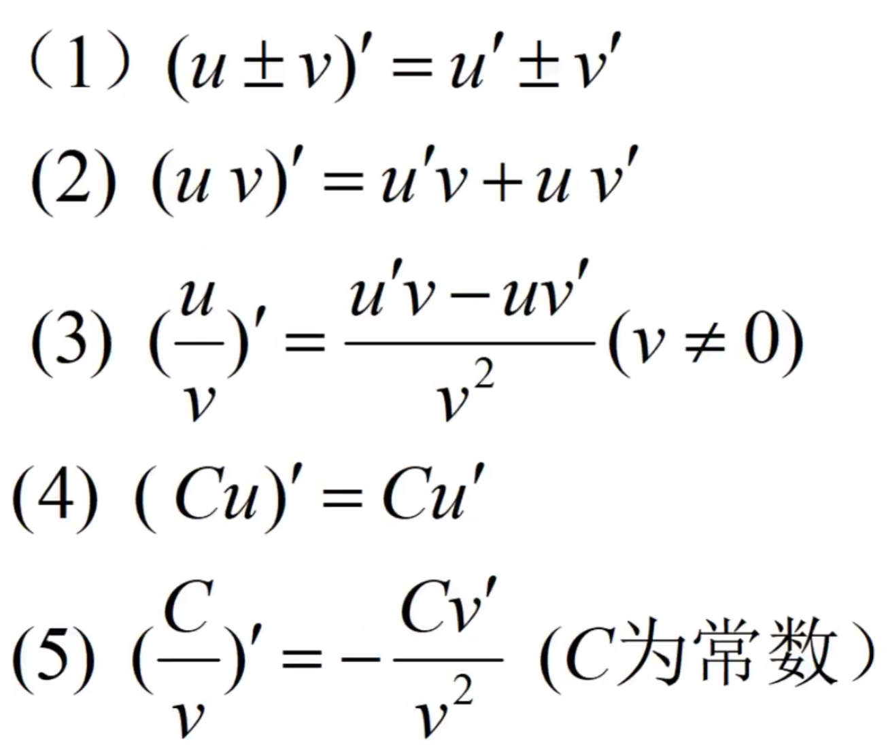

# 数学基础

## 函数

函数的定义：

*   量和量之间的关系如：f(x) = x2。
*   y = f(x)其中x是自变量，y是因变量，f(x)是函数。
*   函数在x0处取得的函数值y0=y|x=x0=f(x0)。
*   符号只是一种表示，也可以是y=g(x)、y=φ(x)、y=δ(x)等等。

函数的分类：分段函数、反函数、显函数和隐函数。

函数特性：

*   奇偶性：奇函数f(x)=-f(-x)，偶函数f(x)=f(-x)。
*   周期性：周期函数f(x+n*T)=f(x)，其中T是周期，n是整数。
*   单调性：单调递增函数f(x) < f(y)当且仅当x < y，单调递减函数f(x)>f(y)当且仅当x>y。

## 极限

数列：

*   按照一定次数排序的一列数：u1，u2，...，un，...，其中un叫做通项。
*   对于数列{un}，如果当n无限增大时，其通项无限接近于一个常数A，则称该数列以A为极限或称数列收敛于A，否则称数列为发散。

    

注意：x→∞表示`当|x|无限增大时`，即满足x→+∞和x→-∞。x→x0表示<code>当x从x0的左右无限接近于x0时</code>，即满足x→x0+和x→x0-。

函数：

*   函数在x0的邻域内由定义，并且满足下式，则称函数f(x)在x0处取得极限：

    =A$.png)

*   极限存在性：

    

*   无穷小量：当x→x0时，f(x)的极限为0，称为函数f(x)的无穷小量。
    *   基本性质：
        *   有限个无穷小的代数和仍然是无穷小。
        *   有限个无穷小的积仍然是无穷小。
        *   有界变量与无穷小的积仍然是无穷小。
        *   无限个无穷小之和不一定是无穷小。
        *   无穷小的商不一定是无穷小。
    *   无穷小的比较：

        

*   无穷大量：当x→x0时，f(x)的极限为无穷大，称为函数f(x)的无穷大量。
*   无穷小和无穷大的关系：在自变量的变换的同一过程中，如果f(x)为无穷大，则$\frac{1}{f(x)}$为无穷小。
*   函数的连续性：
    *   设函数f(x)在点x的某邻域内有定义，如果当自变量x的改变量Δx趋近于0时，相应函数的改变量Δf(x)也趋近于0，则称f(x)在点x0处连续。即满足下式：

        -f(x_0)]=0$.png)

    *   函数f(x)在点x0处连续，需要满足：
        *   函数在该点有定义。
        *   函数在该点处极限存在。
        *   极限值等于函数值。
    *   函数f(x)在点x0处不连续，则称其为函数的间断点。

## 导数

如果函数f(x)的变化率的极限是存在的，即满足下式，则称此极限为函数y=f(x)在点x0处的导数。记作$f'(x_0)$、$y'|_{x=x_0}$、$\frac{dy}{dx}|_{x=x_0}$或$\frac{df(x)}{dx}|_{x=x_0}$。

-f(x_0)}{Deltax}$.png)

常用导数公式：

导数运算法则：

## 偏导数

设二元函数z=f(x, y)在点(x0, y0)的某个邻域内有定义。令y=y0，一元函数f(x, y0)在点x=x0可导，即极限满足下式，则称A为函数z=f(x, y)在点(x0, y0)处关于自变量x的偏导数，记作$f_x(x_0, y_0)$、$z_x|_{x=x_0, y=y_0}$、$\frac{\partial z}{\partial x}|_{x=x_0, y=y_0}$或$\frac{\partial f}{\partial x}|_{x=x_0, y=y_0}$。

-f(x_0,y_0)}{Deltax}=A$.png)
