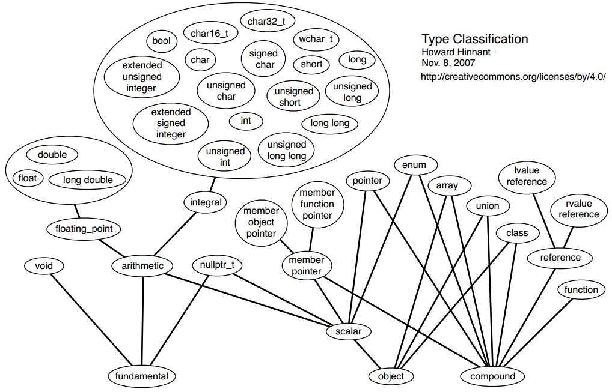
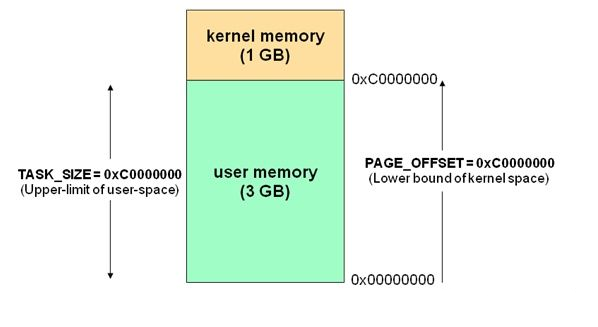
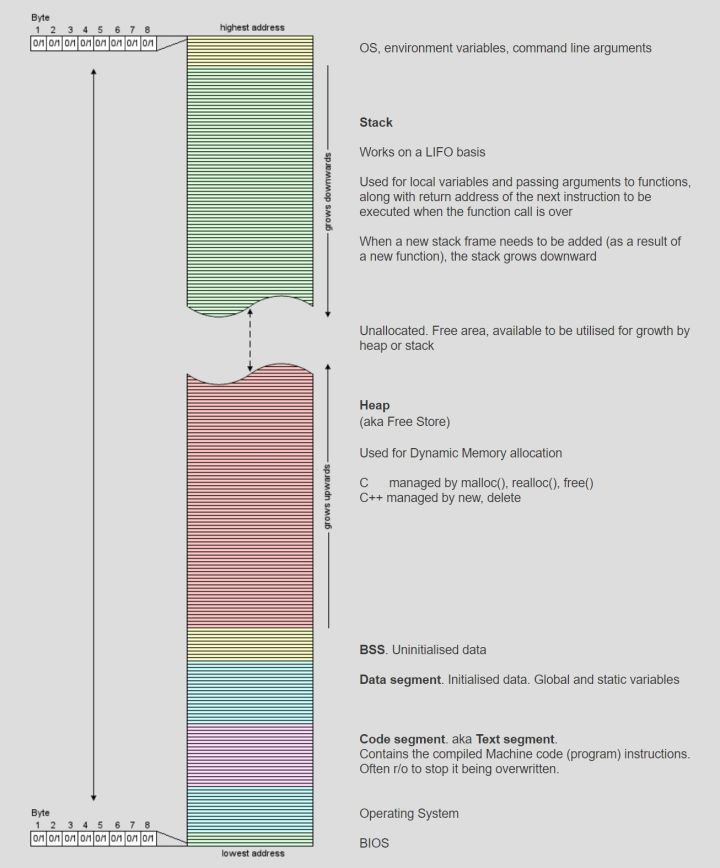

# C++中常见问题

1.  [类型分类](#类型分类)
2.  [内存管理](#内存管理)
3.  [初始化规则](#初始化规则)
4.  [聚合](#聚合)
5.  [POD类型](#pod类型)
6.  [typename的起源与用法](#typename的起源与用法)
7.  [C++ Traits Classes](#c-traits-classes)
8.  [C++11中的值类别和移动语义](#c11中的值类别和移动语义)

## 类型分类

类型：

*   fundamental type（基本类型）。
*   object（对象）：这里指的并不是类类型的实例，而是具有存储空间并能存储值的对象。
*   compound type（复合类型）：
    *   引用只是一个对象的别名，存储空间与其引用的对象相同，所以不是对象。
    *   对于函数而言，它包含了做某事的指令。在执行指令时，函数可以临时存储或使用一些数据，并可能返回一些数据。但这些指令本身不被视为对象，所以函数不是对象。



## 内存管理

内存管理是C++最令人切齿痛恨的问题，也是C++最有争议的问题，C++高手从中获得了更好的性能，更大的自由，C++菜鸟的收获则是一遍一遍的检查代码和对C++的痛恨，但内存管理在C++中无处不在，内存泄漏几乎在每个C++程序中都会发生，因此要想成为C++高手，内存管理一关是必须要过的，除非放弃C++，转到Java或者.NET，他们的内存管理基本是自动的，当然你也放弃了自由和对内存的支配权，还放弃了C++超绝的性能。

Linux内存管理机制：

*   Linux中可以借助brk或mmap函数从用户空间中申请连续内存。
*   通过调用sbrk(0)可以获取指向用户空间某一地址的指针，随后调用brk(len)可以在原指针地址的基础上移动该指针以达到申请或释放内存的目的。

    ```c
    /* sbrk，brk 示例 */
    #include <stdio.h>
    #include <sys/types.h>
    #include <unistd.h>

    int main() {
      void *curr_brk, *tmp_brk = NULL;
      
      printf("Welcome to sbrk example::PID: %d\n", getpid());

      /* sbrk(0) 获取当前 program break 位置 */
      tmp_brk = curr_brk = sbrk(0);
      printf("Program Break Location1: %p", curr_brk);
      getchar();

      /* 使用 brk 增加 program break 位置 */
      brk(curr_brk + 4096);

      curr_brk = sbrk(0);
      printf("Program Break Location2: %p", curr_brk);
      getchar();

      /* 使用 brk 减小 program break 位置 */
      brk(tmp_brk);

      curr_brk = sbrk(0);
      printf("Program Break Location3: %p", curr_brk);
      getchar();

      return 0;
    }
    ```

*   mmap则是直接在用户空间中申请一块连续的空闲内存。

    ```c
    /* 使用 mmap 系统调用做私有匿名映射的示例 */
    #include <stdio.h>
    #include <stdlib.h>
    #include <fcntl.h>
    #include <sys/mman.h>
    #include <sys/stat.h>
    #include <sys/types.h>
    #include <unistd.h>

    void static inline ErrExit(const char *msg) {
      printf("%s failed, Exiting the process.", msg);
      exit(-1);
    }

    int main() {
      printf("Welcome to private anonymous mapping example::PID: %d\n", getpid());
      printf("Before mmap");
      getchar();
      char *addr = NULL;
      addr = mmap(NULL, (size_t)132*1024, PROT_READ | PROT_WRITE, MAP_PRIVATE | MAP_ANONYMOUS, -1, 0);
      if (addr == MAP_FAILED)
        ErrExit("mmap");
      printf("After mmap");
      getchar();

      /* 取消映射区域 */
      int ret = munmap(addr, (size_t)132*1024);
      if(ret == -1)
        ErrExit("munmap");
      printf("After munmap");
      getchar();
      return 0;
    }
    ```



C/C++程序的内存布局如下：

*   Code Segment中存放着程序的机器码和只读数据，可执行指令就是从这里取得的。如果可能，系统会安排相同程序的多个运行实体共享这些实例代码。这个段在内存中一般被标记为只读，任何对该区的写操作都会导致段错误（Segmentation Fault）。
*   Data Segment中存放着已初始化的全局或静态变量。
*   BSS中存放未初始化的全局或静态变量。
*   Heap（堆），堆的大小并不固定，可动态扩张或缩减。其分配由malloc()、new()等这类实时内存分配函数来实现（brk函数也是从这里分配内存）。
*   Stack（栈），用来存储函数调用时的临时信息，如函数调用所传递的参数、函数的返回地址、函数的局部变量等。在程序运行时由编译器在需要的时候分配，在不需要的时候自动清除。栈内存的申请和释放遵循LIFO（先进后出）。



三种内存分配方式：

*   从静态存储区分配（Data Segment和BSS）：内存在程序编译的时候已经分配好，这块内存在程序的整个运行期间都存在。例如全局变量、static变量。
*   从栈上分配：在执行函数时，函数内局部变量的存储单元可以在栈上分配，函数执行结束时，这些内存单元会自动被释放。栈内存分配运算内置于处理器的指令集，效率高，但是分配的内存容量有限。
*   从堆上分配：也称为动态内存分配。程序在运行的时候使用malloc或者new申请任意大小的内存，程序员自己负责在何时用free或者delete释放内存。动态内存的生命周期由程序员决定，使用非常灵活，但如果在堆上分配了空间，就有责任负责回收它，否则运行的程序会频繁出现内存泄漏，频繁的分配和释放不同大小的堆空间将会产生内存碎片。

堆和栈有哪些不同？

*   分配和管理方式不同：
    *   堆是动态分配的，其空间的分配和释放都由程序员控制。
    *   栈由编译器自动管理。栈有两种分配方式：静态分配和动态分配。静态分配由编译器完成，比如局部变量的分配。动态分配由_alloca函数进行分配，但是栈的动态分配和堆是不同的，它的动态分配是由编译器进行释放，无需手工控制。
*   产生的碎片不同：
    *   对堆来说，频繁的new/delete或者malloc/free可能会造成内存空间的不连续，造成大量的碎片，使程序效率降低。
    *   对栈来说，则不存在碎片问题，因为栈是先进后出的队列，永远不可能有一个内存块从栈中间弹出。
*   增长方向不同：
    *   堆由低地址向高地址增长。
    *   栈由高地址向低地址增长。
*   分配效率不同：
    *   堆是由库函数提供的，机制很负责，库函数会按照一定的算法进行搜索内存，因此比较慢。
    *   栈的效率比堆高很多。栈式机器系统提供的数据结构，计算机在底层提供栈的支持，分配了专门的寄存器来存放栈的地址，压栈出栈都有相应的指令。

## 初始化规则

初始化（Initialization）与赋值（Assignment）的区别：

*   初始化：创建变量时赋予其一个初始值。
*   赋值：把对象当前值擦去，并用一个新值代替它。

对象的初始值可以由声明符或new表达式的初始化器部分提供。发生函数调用时，函数形参和函数返回值也会被初始化。

对于每个声明符，初始化器必须是下列之一：

```c++
( expression-list )   // 小括号括起来的，逗号分隔的表达式列表
= expression          // 等号后面跟着表达式
{ initializer-list }  // 大括号括起来的、逗号分割的表达式列表
```

根据上下文的不同，可能会使用如下9种方式之一进行对象的初始化：

1.  Value Initialization
2.  Zero Initialization
3.  Default Initialization
4.  Direct Initialization
5.  Copy Initialization
6.  List Initialization
7.  Aggregate Initialization
8.  Reference Initialization
9.  Constant Initialization

表面上看这里有9种初始化方式，但有些初始化本质上是由其他的初始化方式来完成的，有些又和其他有些交集。比如：value-initialization的初始化要么是zero-initialization，要么是aggregate-initialization，要么是default-initialization。因此最本质的初始化方式有8种（即去掉value-initialization）。

使用哪种初始化方式和以下语法密切相关：

*   对象的类型，比如：class、scalar、aggregate、引用。
*   对象的存储周期，比如：static、thread_local、automatic、dynamic storage duration。
*   Initializer的形式，比如：小括号、大括号、是否为空。
*   初始化的方式，比如：是否使用等号、是否为函数传参、是否为函数返回值。

值初始化（Value Initialization）：进行初始化时以空初始化器构造对象。满足以下情况的初始化就是值初始化：

*   当创建一个无名临时对象，且使用空的小括号/大括号来构建Initializer：

    ```c++
    T();
    T{};      // c++11
    new T();
    new T{};  // c++11
    ```

*   当创建一个有名称的对象，且使用空的大括号来构建Initializer：

    ```c++
    // 注意，这里小括号缺席了，是因为会导致分不清楚是函数调用、还是对象初始化
    T object{};  // c++11
    ```

*   使用空的小括号/大括号来构建member initializer用来初始化class的非静态成员或者基类：

    ```c++
    Class::Class(...) : member() { ... }
    Class::Class(...) : member{} { ... }  // c++11
    ```

*   例外情况：
    *   当空的{}用来初始化T，且T是aggregate type时，使用的是aggregate-initialization，而并非是这里的value-initialization。
    *   如果T是个Class类型，且没有defaul constructor，但是具有一个形参为std::initializer_list的构造函数，那么初始化将使用list-initialization，而非这里的value-initialization。

值初始化的具体情况：

*   value-initialization会变成以下两者之一：default-initialization或者zero-initialization。
*   具体情况详解：
    *   当T是class类型，拥有的是用户提供的default constructor，那么对象初始化将使用default initialization。
    *   当T是class类型，且拥有非用户提供的default constructor（不管是编译器合成的，还是defaulted default constructor（也就是使用了`= default`语法）），那么对象初始化方式将是zero-initialization。然后这个时候还要对default-initialization的语义约束进行检查，如果发现T有一个non-trivial default constructor（也就是T还要再满足：有虚函数或虚基类，或其非static成员是class类型且有虚函数，或其直接基类也有non-trivial default constructor），那么对象将再次使用default-initialized方式进行初始化。
    *   如果T是数组类型，那么每个元素将是value-initialized。
    *   否则，对象的初始化就是zero-initialized。

```c++
#include <iostream>
#include <string>
#include <vector>

// 隐式默认构造函数
struct T1 {
  int m1;
  std::string m2;
};

// 用户提供的拷贝构造函数，没有默认构造函数
struct T2 {
  int m1;
  std::string m2;
  T2(const T2&) {}
};

// 用户提供的默认构造函数
struct T3 {
  int m1;
  std::string m2;
  T3() {}
};

std::string s{};  // class => default-initialization，值为 ""

int main() {
  int n{};                 // scalar => zero-initialization，值为 0
  double f = double();     // scalar => zero-initialization，值为 0.0
  int* a = new int[10]();  // array => 每个元素进行value-initialization，每个元素为 0
  T1 t1{};                 // t1.m1 为 zero-initialized，值为 0；t1.m2 default-initialized，值为 ""
  // T2 t2{};              // error，没有默认构造函数
  T3 t3{};                 // t3.m1 default-initialized 为不确定的值；t3.m2 default-initialized 为 ""
  std::vector<int> v(3);   // value-initialization 每个元素，值为 0

  std::cout << s.size() << ' ' << n << ' ' << f << ' ' << a[9] << ' ' << v[2] << '\n';
  std::cout << t1.m1 << ' ' << t3.m1 << '\n';

  delete[] a;

  return 0;
}
```

零初始化（Zero Initialization）：将一个对象的初始值设为零。除了上述value-initialization导致的zero-initialization，还有如下情况也是zero-initialized：

*   对于有名称的变量，如果其storage duration是static或者thread-local的，且没有被constant-initialization（编译器被初始化为某个常量），那么执行zero-initialized初始化：

    ```c++
    static T object;
    ```

*   character type数组使用了较短的字符串常量进行初始化，数组剩余部分的初始化使用zero-initialized方式：

    ```c++
    CharT array[n] = "short-sequence";
    ```

零初始化的具体情况：

```c++
#include <iostream>
#include <string>

struct A {
  int a, b, c;
};

double f[3];    // 执行 zero-initialized，每个元素为 0.0
int* p;         // zero-initialized 为 null pointer value
std::string s;  // zero-initialized 成不确定的值，再通过 string 类的默认构造函数 default-initialized 成 ""

int main(int argc, char* argv[]) {
  delete p;

  static int n = argc;  // zero-initialized 为 0，然后 copy-initialized 为 argc
  std::cout << "n = " << n << '\n';

  A a = A();  // 效果等同于 A a{}; 或 A a = {};
  std::cout << "a = {" << a.a << ' ' << a.b << ' ' << a.c << "}\n";

  return 0;
}
```

默认初始化（Default Initialization）：这是在不使用初始化器构造变量时执行的初始化。除了上述value-initialization导致的default-initialization，还有如下情况也是default-initialization：

*   automatic、static、thread-local storage duration的变量声明的时候没有initializer：

    ```c++
    T object;
    ```

*   dynamic storage duration的对象使用new表达式进行创建，且没有initializer：

    ```c++
    new T;
    ```

*   类的构造函数初始化列表中没有提到基类或者非静态数据成员，当该构造函数被调用的时候。

默认初始化的具体情况：

*   如果T是一个class类型，那么就会选择一个默认构造函数（且参数为空）。
*   如果T是非class类型，且是automatic或dynamic storage duration，那么就会default-initialization为不确定的值；如果是static或thread-local storage duration，那么就是zero-initialized。
*   如果T是数组，数组的每个元素被default-initialized。
*   注意：引用类型和const标量对象不能被default-initialized。

```c++
#include <string>

struct T1 { int m; };

struct T2 {
  int m;
  T2() {}  // m 不在 initializer list 中
};

int n;  // 静态非类，进行两阶段初始化：
        // 1. zero-initialized，值为 0
        // 2. default-initialized，不做任何事，令 n 保留为零

int main() {
  int n;             // non-class，值不确定
  std::string s;     // class，调用默认构造函数，值为 ""
  std::string a[2];  // array，默认初始化其各元素，值为 {"", ""}
  // int& r;         // error，引用
  // const int n;    // error，const 的非类
  // const T1 t1;    // error，const 的带隐式默认构造函数的类
  T1 t1;             // class，调用隐式默认构造函数
  const T2 t2;       // const 类，调用用户提供的默认构造函数，t2.m 被默认初始化（为不确定值）
}
```

直接初始化（Direct Initialization）：从明确的构造函数实参的集合初始化对象。满足以下情况的初始化就是直接初始化：

*   使用非空的parenthesized list of expressions进行初始化：

    ```c++
    T object(arg);
    T object(arg1, arg2, ...);
    ```

*   使用单个的brace-enclosed initializer来初始化非class类型（注意：如果是class类型，则为list-initialization）：

    ```c++
    non_class_T object{arg};  // c++11
    ```

*   通过function style cast或者static_cast来初始化一个prvalue的结果对象（C++ 17之前：prvalue临时对象）：

    ```c++
    T(other_object);
    static_cast<T>(other_object);
    ```

*   通过parenthesized expression list初始化prvalue的结果对象（C++17之前：prvalue临时对象）：

    ```c++
    T(arg1, arg2, ...);
    ```

*   使用非空的initializer通过new表达式来初始化一个dynamic storage duration对象：

    ```c++
    new T(args, ...);
    ```

*   使用构造函数初始化列表来初始化类的基类，或者类的非静态数据成员：

    ```c++
    Class::Class() : member(args, ...) { ... }
    ```

*   lambda表达式中，使用通过copy捕获的变量来初始化闭包对象成员：

    ```c++
    [arg]() { ... }  // c++11
    ```

直接初始化的具体情况：

*   如果T是个数组类型，那么在C++20之前都是非法的；C++20之后虽然合法了，但是本文并不阐述。
*   如果T是个class类型，initializer是prvalue表达式、且类型也为T（忽略cv限定符），那么initializer表达式自己将用来初始化目标对象（而不是其产生的临时对象）。
*   如果T是个class类型，将使用重载规则匹配最佳的构造函数，然后执行构造函数。
*   如果上述步骤没有匹配到构造函数，并且如果T是aggregate class，将使用aggregate initialization。当然也有诸多限制，比如narrowing conversions、designated initializers、temporary bound to reference相关的限制，如下所示：

    ```c++
    struct B {
      int a;
      int&& r;
    };

    int f();
    int n = 10;

    // 注意下方，大括号是aggregate initialization
    B b1{1, f()};             // 正确，aggregate initialization，f() 临时对象的生命周期获得延长
    B b2(1, f());             // C++20 之前语法错误，没有匹配到构造函数
    B b3{1.0, 1};             // 错误，aggregate initialization，但是遇到 narrowing conversion
    B b4(1.0, 1);             // C++20 之前语法错误，没有匹配到构造函数
    B b5(1.0, std::move(n));  // 正确
    ```

*   否则，如果T是个非class类型，source type是class类型，那么source type的conversion function将被检查，通过函数重载规则匹配最佳的转换函数，用来将initializer表达式转换为目标对象的类型。
*   否则，如果T是bool类型，source type是std::nullptr_t，目标对象将被初始化为false。
*   否则，standard conversion将会被使用。

```c++
#include <iostream>
#include <memory>
#include <string>

struct Foo {
  int m;
  explicit Foo(int n): m(n) {}
};

int main() {
  std::string s1("test");  // constructor from const char*
  std::string s2(10, 'a');

  std::unique_ptr<int> p(new int(1));      // 正确
  // std::unique_ptr<int> p = new int(1);  // 错误，构造函数为 explicit

  Foo f(2);       // 执行 direct initialization
  // Foo f2 = 2;  // 错误，构造函数 explicit

  std::cout << s1 << ' ' << s2 << ' ' << *p << ' ' << f.m << '\n';
}
```

复制初始化（Copy Initialization）：从另一个对象初始化对象。满足以下情况的初始化就是复制初始化：

*   使用等号来初始化非引用类型的named variable：

    ```c++
    T object = other;
    ```

*   函数调用的时候，按值传参，或者返回值是值（不是地址、引用传参）：

    ```c++
    f(other)

    return other;
    ```

*   throw或catch异常时，用的是值：

    ```c++
    throw object;

    catch(T object);
    ```

*   aggregate initialization的一种（下面章节会讲）：

    ```c++
    T array[N] = {other-sequence};
    ```

复制初始化的具体情况：

*   如果T是个class类型，且initializer是个prvalue表达式，类型也是T，那么prvalue表达式将直接初始化目标对象，而不需要先构造出临时对象：

    ```c++
    // 只有一次构造，没有拷贝构造
    // 因为使用 prvalue，所以直接在 v 的内存处直接构造对象
    T v = T();
    ```

*   如果T是个class类型，other的类型也是T或T的子类，那么重载规则将选择最匹配的non-explicit 的构造函数，调用它来初始化目标对象（注意：也就是拷贝初始化不会考虑explicit constructor）：

    ```c++
    struct T1 {
      T1() { std::cout << "constructed at " << this << '\n'; }
      explicit T1(const T1&) { std::cout << "copy constructed\n"; }
      ~T1() { std::cout << "destructed at " << this << '\n'; }
    };

    int main() {
      T1 t1;
      // T1 t2 = t1;  // 会报错，去掉 explicit 即可，因为复制初始化只匹配 non-explicit 构造函数

      return 0;
    }
    ```

*   如果T是class类型而other的类型不是T，或者T是非class类型而other是class类型，那么用户定义的转换构造函数（必须是non-explicit）就会起作用，转换的结果是一个prvalue表达式，该表达式将被直接用来初始化目标对象：

    ```c++
    struct T1 {
        T1(int i) { std::cout << "constructed at " << this << '\n'; }
        T1(const T1&) { std::cout << "copy-constructed\n"; }
        T1(T1&&) { std::cout << "move-constructed\n"; }
        ~T1() { std::cout << "destructed at " << this << '\n'; }
    };
    
    int main() {
      T1 t1 = 7030;  // 可见并没有生成临时对象再去使用拷贝构造函数，而是直接在 t1 的内存处构造了该对象
      return 0;
    }
    ```

复制初始化的特殊情况：可能会发生拷贝省略。

*   拷贝省略（copy elision）指的是编译器在一些情况下可以避免进行复制操作，直接将对象构造在目标位置上，从而避免不必要的复制开销。这个优化是在C++11标准中引入的，有时候也被称为NRVO（Named Return Value Optimization）。
*   例如，在函数返回值时，编译器可能会避免复制构造函数的调用，直接在调用栈上构造返回值，从而避免复制构造函数的开销。这个优化只适用于满足一定条件的场景，例如返回一个本地变量或一个已经构造好的对象等。这些条件被统称为返回值优化（RVO，Return Value Optimization）。
*   拷贝省略的引入，使得代码的性能得到了很大的提升。但是，也带来了一些风险和限制。例如，一些依赖于副作用的代码（如拷贝构造函数、析构函数、自定义new和delete操作等）可能会受到影响。此外，在一些情况下，我们可能需要强制禁止拷贝省略，以便确保代码行为的正确性。

列表初始化（List Initialization）：从C++11起，使用花括号初始化器列表（braced-init-list）列表初始化对象。满足以下情况的初始化就是列表初始化：

*   直接列表初始化或者复制列表初始化，初始化一个命名变量：

    ```c++
    T object{arg1, arg2, ...};  // direct-list-initialization
    T object = {arg1, arg2, ...};  // copy-list-initialization
    ```

*   直接列表初始化，初始化一个未命名临时对象：

    ```c++
    T{arg1, arg2, ...}
    ```

*   直接列表初始化，初始化一个new表达式创建的具有dynamic storage duration的对象：

    ```c++
    new T{arg1, arg2, ...}
    ```

*   直接列表初始化或者复制列表初始化，初始化class的非静态数据成员（使用或不使用等号）：

    ```c++
    Class {
      T member{arg1, arg2, ...};  // direct-list-initialization
    };

    Class {
      T member = {arg1, arg2, ...};  // copy-list-initialization
    }
    ```

*   直接列表初始化，构造函数初始化列表：

    ```c++
    Class::Class() : member{arg1, arg2, ...} {}
    ```

*   函数调用传参，或者初始化函数返回值：

    ```c++
    function({arg1, arg2, ...})

    return {arg1, arg2, ...};
    ```

*   在用户定义的operator[]的下标表达式中，使用list-initialization初始化其参数：

    ```c++
    object[{arg1, arg2, ...}]
    ```

*   特别注意：列表初始化使用非空的braced-init-list来初始化对象。如果是空的braced-init-list，那就是value-initialization；如果是非空，且对象类型不是class类型，那么就是direct-initialization。

    ```c++
    T object{};  // value initialization

    non_class_T object{arg};  // direct initialization
    ```

列表初始化的具体情况：

*   如果T是一个aggregate class，并且braced-init-list中的元素类型和T中的成员一致，那么将会使用braced list中的各个元素去copy-initialization类型T中的元素（copy-list-initialization），或者direct-initialization类型T中的各个元素（direct-list-initialization）：

    ```c++
    struct A {
      int x;
      struct B {
        int i;
        int j;
      } b;
    };

    A a = {1, {2, 3}};
    ```

*   否则，如果T是一个字符数组，而braced-init-list中是个字符串常量，那么初始化的方式就如同使用常规的字符串常量：

    ```c++
    unsigned char b[5]{"love"};  // 相当于 unsigned char b[5] = {'l', 'o', 'v', 'e', '\0'};
    ```

*   否则，如果T是一个aggregate class，那么将执行aggregate initialization：

    ```c++
    int date[4] = [0, 1, 0, 1];
    ```

*   否则，如果T是个具备default constructor的class类型，而braced-init-list是空大括号，那么将执行value-initialization：

    ```c++
    struct T1 {
      T1() {
        i = 7030;
      }
      int i;
      int j;
    };

    T1 t1 = {};  // 对 class 执行 value initialization
    ```

*   否则，如果T是std::initializer_list的特化，则根据上下文，目标对象将被直接初始化或者拷贝初始化。
*   否则，在如下的两种情况下，T的构造函数将被考虑：
    *   当T是构造函数仅接收一个std::initializer_list参数，或者构造函数的第一个参数是std::initializer_list类型，而剩余参数具有默认值。
    *   如果第一种情况没有满足，那么braced-init-list中的参数将被单拎出来（仿佛大括号不存在），然后所有的构造函数将参与重载匹配。

    ```c++
    struct T1 {};  // aggregate
    struct T2 {  // non-aggregate
      T2() = default;
      T2(const T2&) = default;
      T2(std::initializer_list<T2>) {}
    };

    T1 t11;
    T1 t12 = T1{t11};  // copy-constructor（不是 aggregate initialization）

    T2 t21;
    T2 t22 = T2{t21};  // initializer-list constructor（不是 copy constructor）
    ```

*   否则，如果T是非class类型（如果是引用，需要引用的类型和被引用类型一致），且braced-init-list只有一个元素，目标对象将被direct-initialized或者copy-initialized。
    *   注意：list initialization中不允许narrowing conversion。即禁止一些类型默认转换：float到int；long double到double/float、double到float；int到float；指针类型到bool。

    ```c++
    // direct-list-initialization
    int x{123};  // 正确
    int y{12.3};  // 错误，发生 narrowing conversion

    // copy-list-initialization
    int x = {123};
    ```

*   否则，如果T是个引用类型，且类型不一致，那么会生成prvalue。prvalue通过copy-list-initialization来初始化其结果对象，然后直接初始化引用（如果引用是non-const lvalue reference，那么初始化会失败）：

    ```c++
    int&& r1 = {7030};  // 正确，将 temporary int 绑定到 rvalue reference 
    int& r2 = {7030};  // 错误，不能将 rvalue 绑定到 non-const lvalue ref
    const int& r2 = {7030};  // 正确，将 rvalue 绑定到 const lvalue ref
    ```

聚合初始化（Aggregate Initialization）：使用花括号初始化器列表（braced-init-list）初始化聚合体（从C++11起，将聚合初始化归类为列表初始化的一种形式）。满足以下情况的初始化就是聚合初始化：

```c++
T object = {arg1, arg2, ...};
T object{arg1, arg2, ...};  // c++11
T object = {.des1 = arg1, .des2{arg2} ...};  // c++20, designated initializers
T object{.des1 = arg1, .des2{arg2} ...};  // c++20, designated initializers
```

聚合初始化的具体情况：

*   首先进行合法性检查：
    *   initializer list中的元素数量不能超过aggregate中元素的数量。
    *   不能使用空的initializer list去初始化未知大小的数组。
    *   如果initializer list是designated initializer list（aggregate必须是class类型），那么其中每个designator的名字必须和class中的非static成员的名字一样，顺序一致。
*   经过合法检查后，按照下面的优先级进行初始化：
    *   如果类型T中有个元素类型是匿名联合，initializer list是个designated initializer list，那么designator的名字直接写union中的成员的名字：

        ```c++
        struct C {
          union {
            int a;
            const char* p;
          };

          int x;
        } c = {.a = 1, .x = 3};
        ```

    *   initializer中的元素拷贝初始化到目标对象的成员上。如果initializer语句是个表达式，那么允许隐式类型转换，但禁止narrowing conversion；如果initializer语句是嵌套braced-init-list，那么将递归的初始化对应的元素：

        ```c++
        struct A {
          int x;

          struct B {
            int i;
            int j;
          } b;
        } a = {1, {2, 3}};  // initializes a.x with 1, a.b.i with 2, a.b.j with 3
        
        struct base1 { int b1, b2 = 42; };
        
        struct base2 {
          base2() { b3 = 42; }

          int b3;
        };
        
        struct derived : base1, base2 {
          int d;
        };
        
        derived d1{{1, 2}, {}, 4};  // initializes d1.b1 with 1, d1.b2 with 2, d1.b3 with 42, d1.d with 4
        derived d2{{}, {}, 4};  // initializes d2.b1 with 0, d2.b2 with 42,d2.b3 with 42, d2.d with 4
        ```

    *   对于non-union aggregate，如果成员没有被initializer list中的元素显式初始化，那么如果目标对象的元素具备default member initializer，就由default member initializer初始化；否则，如果aggregate中元素不是引用，那么该元素会被empty initializer list进行copy-initialized；否则，程序非法：

        ```c++
        struct S {
          int a;
          const char* b;
          int c;
          int d = b[a];
        };
        
        // ss.a 是 1
        // ss.b 是 "asdf"
        // ss.c 是 int{} （也就是 0）
        // ss.d 是 ss.b[ss.a] （也就是 's'）
        S ss = {1, "asdf"};
        ```

    *   如果aggregate是个union并且initializer list为空，且如果该union的任何一个variant member具有default member initializer，那么那个成员会被该default member initializer初始化；否则，union的第一个成员会被空的initializer list进行copy-initialized。
*   最后再说下designated initializers和字符数组：
    *   designated initializers：

        ```c++
        struct A { int x; int y; int z; };
        
        A a{.y = 70, .x = 30};  // 错误，顺序不一致
        A b{.x = 70, .z = 30};  // 正确
        ```

    *   字符数组：

        ```c++
        char a[] = "abc";  // 相当于 char a[4] = {'a', 'b', 'c', '\0'};
        unsigned char b[3] = "abc";  // 错误，长度不够
        unsigned char b[5]{"abc"};  // 相当于 unsigned char b[5] = {'g', 'e', 'm', '\0', '\0'};
        ```

引用初始化（Reference initialization）：将一个引用绑定到一个对象。满足以下情况的初始化就是引用初始化：

*   有命名的左值引用：

    ```c++
    T& ref = target;
    T& ref = {arg1, arg2, ...};
    T& ref(target);
    T& ref{arg1, arg2, ...};
    ```

*   有命名的右值引用：

    ```c++
    T&& ref = target;
    T&& ref = {arg1, arg2, ...};  // c++11
    T&& ref(target);
    T&& ref{arg1, arg2, ...};
    ```

*   函数参数是引用类型：

    ```c++
    // 函数声明
    R fn(T& arg);
    R fn(T&& arg);  // c++11

    // 函数调用
    fn(target)
    fn({arg1, arg2, ...})
    ```

*   函数返回值是引用类型：

    ```c++
    // 函数声明
    T& fn()
    T&& fn()  // c++11

    // 返回语句
    return target;
    ```

*   class的非static数据成员是引用类型：

    ```c++
    Class::Class(...) : ref(target) { ... }
    ```

引用初始化的具体情况：

*   如果initializer是个braced-init-list（比如：{arg1, arg2, ...}），那么将适用list initialization。
*   否则，如果reference是左值引用，target是左值表达式，且两者类型一致（要么一样的class，要么target是子类）：

    ```c++
    double d = 2.0;
    double& rd = d;  // rd refers to d
    const double& rcd = d;  // rcd refers to d

    struct A {};
    struct B : A {} b;

    A& ra = b;  // ra refers to A subobject in b
    const A& rca = b;  // rca refers to A subobject in b
    ```

*   否则，如果reference是左值引用，target的类型不是T，但定义了转换函数可以转换到T（返回值是lvalue）：

    ```c++
    struct A {};
    struct B : A { operator int&(); };

    int& ir = B(); // ir refers to the result of B::operator int&
    ```

*   否则，如果reference是绑定到non-volatile const-qualified type的左值引用，或者是rvalue reference：
    *   第一种情况：如果target是rvalue或者function lvalue，且类型和reference一致，那么reference会绑定到initializer表达式的值上，或者其base subobject上：

        ```c++
        struct A {};
        struct B : A {};
        extern B f();

        const A& rca2 = f();  // bound to the A subobject of the B rvalue
        A&& rra = f();  // same as above

        int i2 = 42;
        int&& rri = static_cast<int&&>(i2);  // bound directly to i2
        ```

    *   第二种情况：如果target类型与reference不一致，但是定义有转换函数（转换为rvalue或者function lvalue），那么结果会绑定到转换函数的返回值上（或者其base class subobject）：

        ```c++
        struct A {};
        struct B : A {};
        struct X { operator B(); } x;
        
        const A& r = x;  // bound to the A subobject of the result of the conversion
        B&& rrb = x;  // bound directly to the result of the conversion
        ```

    *   第三种情况：target可以隐式的转换为T，那么reference会绑定到转换的结果上。如果reference是rvalue reference，那么转换结果不能是lvalue：

        ```c++
        const std::string& rs = "abc";  // rs refers to temporary copy-initialized from char array

        // 因为等号右边从 int 转换出了一个临时的 double
        const double& rcd2 = 7030;  // rcd2 refers to temporary with value 7030.0
        int i3 = 7030;
        double&& rrd3 = i3;  // rrd3 refers to temporary with value 7030.0

        // 关键点来了
        double d4 = 7030.0;
        double&& rrd5 = d4;  // 错误，cannot bind rvalue reference of type 'double&&' to lvalue of type 'double'
        ```

常量初始化（Constant initialization）：使用常量表达式进行的初始化，是程序最早阶段的一种初始化，成果将会写入程序的镜像——也就是在程序运行前，初始化已经有了事实上的成果了。constant initialization在某些场景中发挥作用，比如non-type template arguments、数组的size，举个例子：

```c++
int n = 1;
std::array<int, n> a1;  // 错误，n 不是 constant expression
const int cn = 2;
std::array<int, cn> a2;  // OK, cn is a constant expression
```

实践中，constant initialization是在编译期进行的：

```c++
struct S {
  static const int c;
};
 
const int d = 10 * S::c;  // 不是常量表达式，S::c has no preceding initializer，this initialization happens after const
const int S::c = 5;  // constant initialization，这个将最先被初始化
// const int d = 10 * S::c;  // d 如果放在这个位置的话，就是常量表达式了。注意：S::c 必须是常量表达式

// int x = 5;
// const int d = 10 * x;  // 这种情况下，d 依然不是常量表达式
 
int main() {
  std::cout << "d = " << d << '\n';
  std::array<int, S::c> a1;  // 正确，S::c 是常量表达式
  std::array<int, d> a2;  // 错误，d 不是常量表达式
}
```

在constant initialization中，RVO（return value optimization）会得到保证，但是，NRVO会被禁止（named return value optimization）：

```c++
struct A {
  void* p;
  constexpr A(): p(this) {}
};
 
constexpr A g() {
  A a;
  return a;
}
 
constexpr A a;  // a.p 指向 a
constexpr A b = g();  // 错误，b.p would be dangling and would point to a temporary with automatic storage duration
 
void h() {
  A c = g();  // c.p 可能指向 c 或者一个 ephemeral temporary
}
```

## 聚合

聚合（aggregate）是一个数组或一个类：

*   数组：一个数组是一个聚合，即使它是一个非聚合类类型的数组。
*   聚合类：没有用户声明的构造函数，没有私有或受保护的非静态数据成员，没有基类，也没有虚函数。
    *   这并不意味着聚合类不能具有构造函数，实际上它可以具有默认构造函数或拷贝构造函数，只要它们由编译器隐式声明，而不是由用户显式声明。
    *   没有私有或受保护的非静态数据成员。您可以拥有尽可能多的私有和受保护的成员函数（但不是构造函数）以及尽可能多的私有或受保护的静态数据成员和静态成员函数。
    *   聚合类可以具有用户定义的复制赋值运算符和析构函数。

    ```c++
    class AggregateClass {
    public:
      NotAggregateClass member_;  // ok, public member
      AggregateClass& operator=(const AggregateClass& rhs) { /* */ }  // ok, copy-assignment
    private:
      void f() {}  // ok, just a private function
    };
    ```

聚合与非聚合不同，它们可以用花括号进行初始化。

*   以数组为例：

    ```c++
    /**
    * Type array_name[n] = {a1, a2, …, am};
    *
    * 如果 m == n
    * 数组的第 i 个元素用 ai 初始化
    *
    * 如果 m < n
    * 数组的前 m 个元素用 a1、a2、...、am 初始化，其他 n - m 个元素如果可能的话，用值初始化
    *
    * 如果 m > n
    * 编译器会报错
    *
    * 如果没有指定 n，如 int a[] = {1, 2, 3};
    * 那么数组的大小 n 将等于 m 的大小，相当于 int a[3] = {1, 2, 3};
    */

    class A {
    public:
      A(int) {}  // no default constructor
    };

    class B {
    public:
      B() {}  // default constructor available
    };

    int main() {
      A a1[3] = {A(2), A(1), A(14)};  // OK n == m
      A a2[3] = {A(2)};  // ERROR A has no default constructor. Unable to value-initialize a2[1] and a2[2]
      B b1[3] = {B()};  // OK b1[1] and b1[2] are value initialized, in this case with the default-ctor
      int Array1[1000] = {0};  // All elements are initialized with 0;
      int Array2[1000] = {1};  // Attention: only the first element is 1, the rest are 0;
      bool Array3[1000] = {};  // the braces can be empty too. All elements initialized with false
      int Array4[1000];  // no initializer. This is different from an empty {} initializer in that
      // the elements in this case are not value-initialized, but have indeterminate values 
      // (unless, of course, Array4 is a global array)
      int array[2] = {1, 2, 3, 4};  // ERROR, too many initializers
    }
    ```

*   以结构体为例：

    ```c++
    struct X {
      int i1;
      int i2;
    };

    struct Y {
      char c;
      X x;
      int i[2];
      float f; 
    protected:
      static double d;
    private:
      void g(){}
    };

    Y y = {'a', {10, 20}, {20, 30}};
    ```

总结：现在我们知道了聚合的特殊之处，让我们尝试了解聚合类的限制。我们应该理解，使用大括号进行成员初始化意味着类只不过是其成员的总和。如果存在用户定义的构造函数，则意味着用户需要做一些额外的工作来初始化成员，因此大括号初始化是不正确的。如果存在虚函数，则意味着此类的对象（在大多数实现中）具有指向该类的所谓vtable的指针，该指针在构造函数中设置，因此大括号初始化是不足的。

## POD类型

概述：

*   在计算机科学和面向对象编程中，被动数据结构（Passive data structure，PDS，也称为plain old data，POD）是一个记录（record）术语，用于与（object）比较。它是一种数据结构，仅表示为字段值（实例变量）的被动集合，不使用面向对象的功能。
*   很久很久以前，C语言统一了江湖。几乎所有的系统底层都是用C写的，当时定义的基本数据类型有整数类型、浮点类型、枚举、void、指针、数组、结构等等。那么到了C++诞生之后，出现了继承、派生这些新的概念，也就诞生了一些新的数据结构。但是C语言并没有面向对象的概念，遇到这种数据结构调用C语言标准库的memcpy()等函数没有办法进行操作。可是计算机世界里，主要的系统还是用C写的，为了和旧的C数据结构相兼容，C++就提出了POD数据结构概念。
*   POD是Plain Old Data的缩写，是C++定义的一类数据结构概念，比如int、float等都是POD类型的。Plain代表它是一个普通类型，Old代表它是旧的，与几十年前的C语言兼容，那么就意味着可以使用memcpy()这种最原始的函数进行操作。两个系统进行交换数据，如果没有办法对数据进行语义检查和解释，那就只能以非常底层的数据形式进行交互，而拥有POD特征的类或者结构体通过二进制拷贝后依然能保持数据结构不变。也就是说，能用C的memcpy()等函数进行操作的类、结构体就是POD类型的数据。
*   基本上谈到这个概念，一般都是说某某class、struct、union是不是POD类型的。

POD的定义：如果聚合类（这里类代指所有class、struct和union）没有用户定义的复制赋值运算符和析构函数，并且其非静态成员都不是非POD类、非POD数组或引用，则该聚合类称为POD。

POD类型（POD-types）：POD类、POD结构体、POD联合、标量类型和这些类型的数组统称为POD类型。

POD的特征：

*   POD类型必须具有如下特征：
    *   POD类型必须很trival（平凡、普通）。
        *   不显式定义构造/析构函数、拷贝/移动构造函数、拷贝/移动运算符，而是使用编译器缺省生成的构造/析构等函数。一个例外就是使用C++11提供的default关键字来创建构造函数。
        *   不能有虚函数或虚基类。
        *   可以使用is_trivial来判断类型是否trival。

            ```c++
            #include <iostream>
            #include <type_traits>

            class A {
              A() {}
            };

            class B {
            };

            class C {
              C() = default;
            };

            int main() {
              std::cout << std::boolalpha;
              std::cout << std::is_trivial<A>::value << std::endl;  // false
              std::cout << std::is_trivial<B>::value << std::endl;  // true
              std::cout << std::is_trivial<C>::value << std::endl;  // true

              return 0;
            }
            ```

    *   POD类型必须布局有序。
        *   非静态成员具有相同的访问权限（推荐非静态成员访问权限为public）。
        *   类中的第一个非静态成员的类型不能与其基类相同。
        *   可以有基类，但是派生类中不能有非静态成员。
*   可以使用is_pod来判断类型是否为POD类型。

    ```c++
    #include <iostream>
    #include <type_traits>

    struct A {
      int m;
    };

    int main() {
      std::cout << std::boolalpha;
      std::cout << std::is_pod<A>::value << std::endl;  // true

      return 0;
    }
    ```

使用POD类型的数据：

```c++
#include <cstring>
#include <iostream>

struct A {
  int a;
  int b;
};

int main() {
  A a1;
  a1.a = 10;
  a1.b = 20;

  char* p = new char[sizeof(A)];
  memcpy(p, &a1, sizeof(A));

  A* a2 = reinterpret_cast<A*>(p);
  std::cout << a2 -> a << " " << a2 -> b << std::endl;

  delete[] p;
  a2 = nullptr, p = nullptr;

  return 0;
}
```

## typename的起源与用法

一些关键概念：

*   限定名（qualified name）：即限定了命名空间的标识符。非限定名（unqualified name）：即没有限定了命名空间的标识符。

    ```c++
    // 此时 cout 和 endl 都是限定名
    std::cout << "Hello World!" << std::endl;

    // 此时 cout 和 endl 都是非限定名
    using std::cout;
    using std::endl;
    cout << "Hello World!" << endl;
    ```

*   依赖名（dependent name）：依赖于模板参数的标识符。非依赖名（non-dependent name）：不依赖于模板参数的标识符。

    ```c++
    template <typename T>
    class MyClass {
      // 下面三个成员变量都是非依赖名
      int i_;
      std::vector<int> vi_;
      std::vector<int>::iterator viiter_;

      // 下面三个成员变量都是依赖名
      T t_;
      std::vector<T> vt_;
      std::vector<T>::iterator vtiter_;
    }
    ```

*   在类外部访问类中成员时，可以使用类作用域操作符，形如MyClass::name。通常支持三种成员：静态成员变量、静态成员函数和成员类型。

    ```c++
    struct MyClass {
      static int a;   // 静态成员变量
      static int B();  // 静态成员函数
      typedef int C;   // 嵌套类型
    }
    ```

typename的常见用法：

```c++
template <typename T>
int Compare(const T& v1, const T& v2) {
  if (v1 < v2) return -1;
  if (v2 < v1) return 1;
  return 0;
}
```

typename的来源：

*   在C++标准还未统一时，很多旧的编译器只支持class，因为那时C++并没有typename关键字。
*   对于class关键字，可以替换上面示例中的typename，并完全正确。但是由于class即可以定义用户自定义类型（即类类型），也支持在模版声明的过程中指出某标识符为类型（如`<class T>`），C++标准迫切需要提供新的关键字，代替class在模板中的作用，引入了typename。但是为了兼容旧的编译器，class依旧支持上述两种功能。当然typenane的引入，还有下面的更重要的作用。

引入typename的真实原因：

*   在下面的示例中，<code>T::iterator \* iter</code>可以被解释为两种结果：定义一个名为iter的指向T::iterator类型的指针变量，此时编译器正常执行；静态成员变量iterator和一个未声明的iter相乘，此时编译器会报错。这样<code>T::iterator * iter</code>一行代码能以两种完全不同的方式解释，而且在模板实例化之前，完全没有办法来区分它们，这绝对是滋生各种bug的温床。C++标准委员会决定引入typename关键字。

    ```c++
    // ContainsAType
    struct ContainsAType {
      struct iterator { /*...*/ };
      // ...
    };

    // ContainsAnotherType
    struct ContainsAnotherType {
      static int iterator;
      // ...
    };

    // foo
    template <class T>
    void Foo() {
      T::iterator * iter;  // 此处 * 号存在二义性
      // ...
    }

    // 使用 foo 函数分别使用 ContainsAType 和 ContainsAnotherType 类型
    Foo<ContainsAType>();        // fine
    Foo<ContainsAnotherType>();  // error
    ```

*   使用typename关键字后的foo函数如下面这个示例，这样强制声明T::iterator为一个类型，消除了前面提到的歧义。

    ```c++
    // 更改后的 foo
    template <class T>
    void Foo() {
      typename T::iterator * iter;  // 此处 * 号不存在二义性
      // ...
    }
    ```

使用typename的规则：

*   typename在下面情况下禁止使用：
    *   模板定义之外（即typename只能用于模板的定义中）。
    *   非限定类型。
    *   基类列表中（比如`template <class T> class C1: T::InnerType`不能在`T::InnerType`前面加typename）。
    *   构造函数的初始化列表中。
*   如果类型是依赖于模板参数的限定名，那么在它之前必须加typename（除非是基类列表或构造函数的初始化列表中）。

    ```c++
    template <class T>
    void Foo() {
      typename T::iterator iter;  // 此处 iter 不存在二义性，但是必须加 typename 修饰
      // ...
    }
    ```

*   其它情况下typename是可选的。

## C++ Traits Classes

C++模板的偏特化（partial specialization）与全特化（full specialization）：

*   特化（specialization）必须在同一命名空间下进行，可以特化类模板也可以特化函数模板，但类模板可以偏特化和全特化，而函数模板只能全特化。
*   模板实例化时会优先匹配“模板参数”最相符的那个特化版本。

```c++
// 类模板
template <typename T1, typename T2>
class A {
  T1 data1_;
  T2 data2_;
};

// 函数模板
template <typename T>
T Max(const T& lhs, const T& rhs) {
  return lhs > rhs ? lhs : rhs;
}

// 全特化类模板
template <>
class A<int, double> {
  int data1_;
  double data2_;
};

// 全特化函数模板
template <>
int Max<int>(const int& lhs, const int& rhs) {
  return lhs > rhs ? lhs : rhs;
}

// 偏特化类模板
template <typename T2>
class A<int, T2> {
  int data1_;
  T2 data2_;
};

// 函数模板不支持偏特化，但是函数模板可以重载
template <typename T>
T Max(const T& t1, const T& t2, const T& t3) {
  if (t1 > t2 && t1 > t3) {
    return t1;
  } else {
    return t2 > t3 ? t2 : t3;
  }
}
```

在C++中，traits习惯上总是被实现为struct，但它们往往被称为traits classes。Traits classes的作用主要是用来为使用者提供类型信息。所以当我们希望取得类型的相关信息时候，通过构造一个traits classes来获取类型的信息。

```c++
// define traits classes
template <typename IterT>
struct MyIteratorTraits {
  typedef typename IterT::value_type value_type;
};

template <typename IterT>
struct MyIteratorTraits<IterT*> {
  typedef IterT value_type;
};

// define test function
void func(int a) {
  std::cout << "func(int) is called" << std::endl;
}

void func(double a) {
  std::cout << "func(double) is called" << std::endl;
}

void func(char a) {
  std::cout << "func(char) is called" << std::endl;
}

int main() {
  MyIteratorTraits<std::vector<int>::iterator>::value_type a;
  func(a);  // func(int) is called
  MyIteratorTraits<std::vector<double>::iterator>::value_type b;
  func(b);  // func(double) is called
  MyIteratorTraits<char*>::value_type c;
  func(c);  // func(char) is called

  return 0;
}
```

## C++11中的值类别和移动语义

前言：

*   C++11之前value categories只有两类：lvalue和rvalue。
*   C++11之后出现了新的value categories：prvalue、glvalue和xvalue。

移动语义（Move Semantics）：

*   在传统的C++中，对象的拷贝通常是通过拷贝构造函数或拷贝赋值运算符来完成的，这种方式会对原始对象进行一次深度复制，将原始对象的所有数据成员都拷贝到新的对象中。如果对象的数据成员很多或者数据成员很大，那么进行一次深度复制就会比较耗时，从而影响程序的性能。
*   移动语义是C++11引入的一个重要特性，它允许对象在拷贝时避免进行昂贵的深度复制，从而提高程序的性能。
    *   移动语义通过引入右值引用（Rvalue Reference）和移动构造函数（Move Constructor）和移动赋值运算符（Move Assignment Operator）等机制来实现。右值引用是一种新的引用类型，它用来表示临时对象或者将要销毁的对象。移动构造函数和移动赋值运算符则是在对象拷贝时使用右值引用来实现对象的移动而不是深度复制。
    *   移动构造函数的实现通常是将被移动对象的内部资源指针指向新对象，同时将被移动对象的内部资源指针置为空，这样就完成了对内部资源的所有权转移，避免了数据的复制。移动赋值运算符的实现方式与移动构造函数类似。
    *   移动语义在处理动态内存分配时特别有用，例如在使用std::vector等动态容器时，通过使用移动语义可以避免进行深度拷贝，提高程序的性能。移动语义还可以在实现自定义类时使用，例如在自定义实现一个字符串类时，可以使用移动语义来实现字符串的移动而不是复制，提高程序的性能。

理解值类别（Value Category）：

*   C++中的每个表达式（包括单独的对象）都有两种属性：一个是类型（type），另一个就是值类别。每个表达式的值类别一定属于且仅属于prvalue（pure rvalue），xvalue，lvalue三种中的一种。prvalue和xvalue统称为rvalue，xvalue和lvalue统称为glvalue (generalized lvalue)，如下图所示：

    

*   所有表达式都有两种属性：
    *   是否有identity：用于与另一个表达式或对象进行比较，判断是否是同一个实体。比如，如果有地址，可以比较它们的地址是否相同。
    *   是否可以移动：如果出现在赋值，初始化等语句中，是否会使语句呈现移动语义。
*   基于上述两种属性，表达式即可分为四种情况：
    *   有identity，也可以移动的表达式为xvalue表达式。
    *   有identity，但不能移动的表达式为lvalue表达式。
    *   没有identity，但是可以移动的表达式为prvalue表达式。
    *   至于没有identity，也不可以移动的表达式（不存在这样的表达式，也没必要有这样的表达式）。
*   基于存在的xvalue、lvalue和prvalue，又可分为：
    *   有identity的表达式，值类别为glvalue。
    *   可以移动的表达式，值类别为rvalue。
*   五种值类别常见应用场景：
    *   lvalue（左值）：lvalue表示可以被取址的表达式，即表达式具有内存地址。一般来说，变量、数组、解引用操作、成员访问操作以及返回引用类型的函数调用等都是lvalue。
    *   rvalue（右值）：rvalue表示不可以被取址的表达式，即表达式没有内存地址。一般来说，字面量、临时对象、返回非引用类型的函数调用、类型转换等都是rvalue。
    *   xvalue（可移动的右值引用）：xvalue是C++11中新增的一种值类别，表示一个将要被移动的对象，它是右值，但具有可取地址的特点。xvalue主要出现在转移构造函数、转移赋值运算符和std::move函数中。
    *   prvalue（纯右值）：prvalue是指不具有任何引用类型的rvalue。通常，对纯右值进行的操作都不会对原有对象产生影响。
    *   glvalue（广义右值）：它可以用来统称lvalue和xvalue，即可以取址的表达式。
