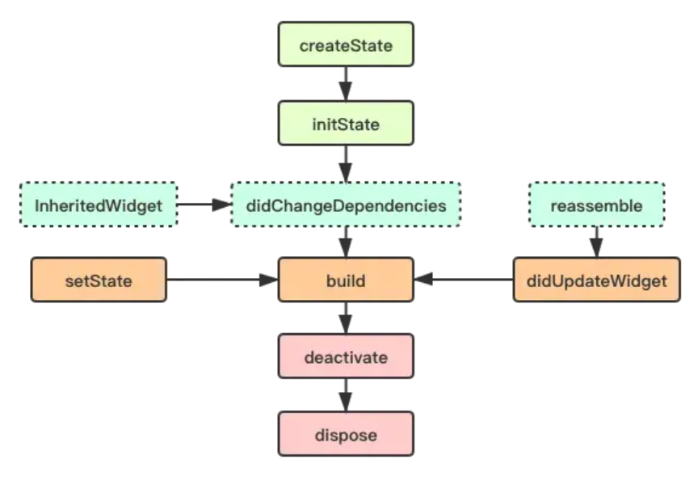

# Flutter中常见问题

1.  [Widget简介](#widget简介)
2.  [Flutter生命周期](#flutter生命周期)
3.  [Flutter中的贝塞尔曲线](#flutter中的贝塞尔曲线)

## Widget简介

在Flutter中，一切皆是Widget（组件），Widget的功能是“描述一个UI元素的配置数据”，它就是说，Widget其实并不是表示最终绘制在设备屏幕上的显示元素，而它只是描述显示元素的一个配置数据。

实际上，Flutter中真正代表屏幕上显示元素的类是Element，也就是说Widget只是描述Element的配置数据。并且一个Widget可以对应多个Element，因为同一个Widget对象可以被添加到UI树的不同部分，而真正渲染时，UI树的每一个Element节点都会对应一个Widget对象。

其中组件又分为无状态组件和有状态组件：

*   无状态组件（StatelessWidget）：通过外部传入的数据绘制界面，只会渲染一次，没有状态（State）。

    ```dart
    abstract class StatelessWidget extends Widget {
      const StatelessWidget({ super.key });

      // 重写 Widget 的 createElement 方法
      // StatelessElement 间接继承自 Element 类，与 StatelessWidget 相对应（作为其配置数据）
      @override
      StatelessElement createElement() => StatelessElement(this);

      @protected
      Widget build(BuildContext context);
    }
    ```

*   有状态组件（StatefulWidget）：通过外部传入的数据绘制界面，可以定义状态（State）实现交互逻辑，根据数据的变化进行多次渲染。

    ```dart
    abstract class StatefulWidget extends Widget {
      const StatefulWidget({ super.key });

      // 重写 Widget 的 createElement 方法
      // StatefulElement 间接继承自 Element 类，与 StatefulWidget 相对应（作为其配置数据）
      // StatefulElement 中可能多次调用 createState() 来创建 State 对象
      @override
      StatefulElement createElement() => StatefulElement(this);

      // createState() 用于创建和 StatefulWidget 相关的状态，它在 StatefulWidget 的生命周期中可能会被多次调用
      @protected
      @factory
      State createState();
    }
    ```

状态（State）：一个StatefulWidget类会对应一个State类，State表示与其对应的StatefulWidget要维护的状态，State中的保存的状态信息可以：

*   在widget构建时可以被同步读取。
*   在widget生命周期中可以被改变，当State被改变时，可以手动调用其setState()方法通知Flutter framework状态发生改变，Flutter framework在收到消息后，会重新调用其build方法重新构建widget树，从而达到更新UI的目的。

## Flutter生命周期

Flutter中说的生命周期（Lifecycle），是独指有状态组件（StatefulWidget）的生命周期，对于无状态组件（StatelessWidget）生命周期只有一次build这个过程，也只会渲染一次。



StatefulWidget的生命周期，包含以下几个步骤：

*   `createState`：该函数为StatefulWidget中创建State的方法，当StatefulWidget被调用时会立即执行createState。
*   `initState`：该函数为State初始化调用，因此可以在此期间执行State各变量的初始赋值，同时也可以在此期间与服务端交互，获取服务端数据后调用setState来设置State。
*   `didChangeDependencies`：当State对象的依赖发生变化时会被调用。例如，在之前build()中包含了一个InheritedWidget，然后在之后的build()中InheritedWidget发生了变化，那么此时InheritedWidget的子widget的didChangeDependencies()回调都会被调用。典型的场景是当系统语言Locale或应用主题改变时，Flutter framework会通知widget调用此回调。
*   `build`：主要是返回需要渲染的Widget，由于build会被调用多次，因此在该函数中只能做返回Widget相关逻辑，避免因为执行多次导致状态异常。
*   `reassemble`：在debug模式下，每次热重载都会调用该函数，因此在debug阶段可以在此期间增加一些debug代码，来检查代码问题。
*   `didUpdateWidget`：在widget重新构建时，Flutter framework会调用Widget.canUpdate来检测Widget树中同一位置的新旧节点，然后决定是否需要更新，如果Widget.canUpdate返回true则会调用此回调。正如之前所述，Widget.canUpdate会在新旧widget的key和runtimeType同时相等时会返回true，也就是说在在新旧widget的key和runtimeType同时相等时didUpdateWidget()就会被调用。父组件发生build的情况下，子组件该方法才会被调用，其次该方法调用之后一定会再调用本组件中的build方法。
*   `deactivate`：在组件被移除节点后会被调用，如果该组件被移除节点，然后未被插入到其他节点时，则会继续调用dispose永久移除。
*   `dispose`：永久移除组件，并释放组件资源。

其中上述几个步骤可以总结为四个阶段：

*   初始化阶段：`createState`和`initState`。
*   组件创建阶段：`didChangeDependencies`和`build`。
*   触发组件创建阶段：`didChangeDependencies`、`setState`和`didUpdateWidget`。
*   组件销毁阶段：`deactivate`和`dispose`。

StatefulWidget生命周期的代码示例：

```dart
import 'package:flutter/cupertino.dart';
import 'package:flutter/material.dart';

class TestStatefulWidget extends StatefulWidget {
  @override
  State<StatefulWidget> createState() {
    print('create state');
    return TestState();
  }
}

class TestState extends State<TestStatefulWidget> {
  int count = 1;
  String name = 'test';

  @override
  void initState() {
    super.initState();
    print('init state');
  }

  @override
  void didChangeDependencies() {
    super.didChangeDependencies();
    print('did change dependencies');
  }

  @override
  void didUpdateWidget(TestStatefulWidget oldWidget) {
    count++;
    print('did update widget');
    super.didUpdateWidget(oldWidget);
  }

  @override
  void deactivate() {
    print('deactivate');
    super.deactivate();
  }

  @override
  void dispose() {
    print('dispose');
    super.dispose();
  }

  @override
  void reassemble() {
    print('reassemble');
    super.reassemble();
  }

  void changeName() {
    setState(() {
      print('set state');
      this.name = 'Flutter';
    });
  }

  @override
  Widget build(BuildContext context) {
    print('build');
    return Column(
      children: <Widget>[
        FlatButton(
            child: Text('$name $count'), onPressed: () => this.changeName())
      ],
    );
  }
}
```

App生命周期监听：

*   在Flutter中，可以利用WidgetsBindingObserver类来监听App生命周期。

    ```dart
    abstract class WidgetsBindingObserver {
      // 页面 pop
      Future<bool> didPopRoute() => Future<bool>.value(false);
      // 页面 push
      Future<bool> didPushRoute(String route) => Future<bool>.value(false);
      // 系统窗口相关改变回调，如旋转
      void didChangeMetrics() { }
      // 文本缩放系数变化
      void didChangeTextScaleFactor() { }
      // 系统亮度变化
      void didChangePlatformBrightness() { }
      // 本地化语言变化
      void didChangeLocales(List<Locale> locale) { }
      //App 生命周期变化
      void didChangeAppLifecycleState(AppLifecycleState state) { }
      // 内存警告回调
      void didHaveMemoryPressure() { }
      //Accessibility 相关特性回调
      void didChangeAccessibilityFeatures() {}
    }
    ```

*   其中`didChangeAppLifecycleState(AppLifecycleState state)`就是用来监听App生命周期。其参数类型`AppLifecycleState`是一个枚举类，包含`resumed`（可见的，并能响应用户的输入）、`inactive`（处在不活动状态，无法处理用户响应）和`paused`（不可见并不能响应用户的输入，但是在后台继续活动中）这三个常量。
*   当切换前、后台时，App状态如下：
    *   从后台切入前台：`AppLifecycleState.paused -> AppLifecycleState.inactive -> AppLifecycleState.resumed`。
    *   从前台退回后台：`AppLifecycleState.resumed -> AppLifecycleState.inactive -> AppLifecycleState.paused`。

App生命周期的代码示例：

```dart
class TestState extends State<TestStatefulWidget> with WidgetsBindingObserver {
  @override
  void initState(){
    super.initState();
    WidgetsBinding.instance.addObserver(this);
  }

  @override
  void dispose() {
    WidgetsBinding.instance.removeObserver(this);
    super.dispose();
  }

  @override
  void didChangeAppLifecycleState(AppLifecycleState state) {
    super.didChangeAppLifecycleState(state);
    if (state == AppLifecycleState.paused) {
      // went to Background
    }
    if (state == AppLifecycleState.resumed) {
      // came back to Foreground
    }
  }
}
```

## Flutter中的贝塞尔曲线

贝塞尔曲线（Bezier Curve）是计算机图形学中相当重要的参数曲线，它通过一个方程来描述一条曲线，根据方程的最高阶数，又分为线性贝赛尔曲线，二次贝塞尔曲线、三次贝塞尔曲线和更高阶的贝塞尔曲线。

二次贝塞尔曲线：


Flutter中实现的二次贝塞尔曲线：

```dart
class MyClipper extends CustomClipper<Path> {
  @override
  Path getClip(Size size) {
    final path = Path();

    // P0 = (0.0, size.height)
    // P1 = (size.width / 2, 0.0)
    // P2 = (size.width, size.height)
    path.moveTo(0.0, size.height);
    path.quadraticBezierTo(size.width / 2, 0.0, size.width, size.height);
    
    path.close();
    return path;
  }

  @override
  bool shouldReclip(CustomClipper<Path> oldClipper) => false;
}

class Test extends StatelessWidget {
  @override
  Widget build(BuildContext context) {
    return ClipPath(
      clipper: MyClipper(),
      child: Container(
        width: 200,
        height: 80,
        color: Colors.black,
      );
    );
  }
}
```
