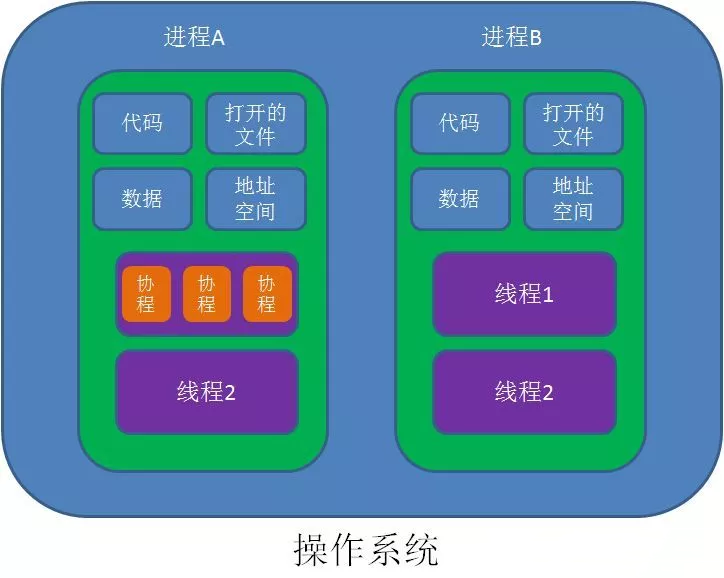
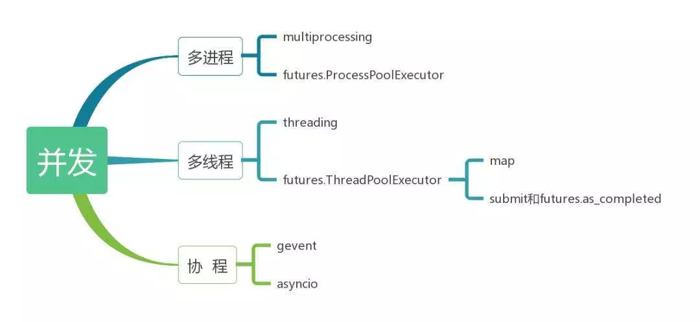

# Python中常见问题

1.  [Python中下划线的五种含义](#python中下划线的五种含义)
2.  [Python面向对象编程](#python面向对象编程)
3.  [推导式和生成器](#推导式和生成器)
4.  [装饰器](#装饰器)
5.  [类型注解](#类型注解)
6.  [并发编程](#并发编程)
7.  [Python中加密的方法](#python中加密的方法)

## Python中下划线的五种含义

单下划线和双下划线在Python变量和方法名称中都各有其含义，有一些含义仅仅是按照约定，被视作是对程序员的提示，而有一些含义是由Python解释器严格执行的。

无下划线：var

*   前后无下划线表示该变量、函数、成员或方法是公有的，可以以任何形式访问。

前置单下划线：_var

*   前置单下划线表示该内容受保护，仅供内部使用。
*   PEP 8中的约定，并不被Python解释器严格执行：
    *   以前置单下划线命名的变量或者函数，通过from some_module import *这种方式，是不会被导入的，但是通过import some_module导入，然后使用some_module._var的形式调用是可以的。
    *   以前置单下划线命名的成员或者方法，应该仅允许在类的内部被使用，但是类外依旧可以通过object._var的形式访问。

后置单下划线：var_

*   后置单下划线，用于避免和Python关键字冲突，无特殊含义，例如int_。
*   PEP 8中的约定，并不被Python解释器严格执行。

前置双下划线：__var

*   前置双下划线表示该变量、函数、成员或方法私有，无法以任何方式被外部直接使用。
*   Python解释器严格执行：
    *   以前置双下划线命名的变量或者函数，通过from some_module import *这种方式，是不会被导入的，但是通过import some_module导入，然后使用some_module.__var的形式调用是可以的。
    *   以前置双下划线命名的成员或者方法，在类外不能以object.__var的形式访问，但是可以通过object._ClassName__var的形式访问。

前后双下划线：__var__

*   前后双下划线的命名方式用于Python里的特殊方法，如__init__。
*   最好避免在自己的程序中使用前后双下划线命名的变量。
*   PEP 8中的约定，并不被Python解释器严格执行。

单下划线：_

*   按照习惯，有时候单下划线被用作一个名字并赋值，用来表示该值是临时的或者无关紧要的。
*   除了用作临时变量之外，单下划线是大多数Python REPL中的一个特殊变量，它用来保存上一个被执行的表达式的结果。

```python
>>> 20 + 3
23
>>> _
23
>>> print(_)
23

>>> list()
[]
>>> _.append(1)
>>> _.append(2)
>>> _.append(3)
>>> _
[1, 2, 3]
```

## Python面向对象编程

类（Class）：用来描述具有相同属性（Attribute）和方法（Method）对象的集合。

对象（Object）：类（Class）的具体实例。

类变量（Class Variables）与实例变量（Instance Variables）的区别很大，访问方式也不一样。

*   类变量：类变量在整个实例化的对象中是公用的。类变量定义在类中且在函数体之外。访问或调用类变量的正确方式是`类名.变量名`或者`self.__class__.变量名`。
*   实例变量：定义在方法中的变量，属于某个具体的对象。访问或调用实例变量的正确方式是`对象名.变量名`或者`self.变量名`。

类方法（Class Method）：属于类的方法，而不具体属于某个对象。属于类的方法不使用`self`参数，而使用参数`cls`，代表类本身。另外习惯上对类方法加上`@classmethod`的修饰符做说明。

私有属性（Private Attribute）和私有方法（Private Method）：以双下划线开头，不能被类的外部使用或直接使用。

`@property`：该装饰器把函数伪装成属性。

静态变量（Static Variable）和静态方法（Static Method）：通常用于在类的上下文中执行一些操作，但不需要访问类或实例的属性。另外习惯上对静态方法加上`@staticmethod`的修饰符做说明。

```python
# Student 类
class Student:
  number = 0 # 类变量

  # 初始化方法，name 和 score 是实例变量，其中 score 属于私有变量
  def __init__(self, name, score):
    self.name = name
    self.__score = score
    Student.number = Student.number + 1

  def __str__(self):
    return 'Name: {}: Score: {}'.format(self.name, self.__score)

  # 利用 property
  @property
  def score(self):
    return self.__score

  # 定义类方法
  @classmethod
  def total(cls):
    return cls.number

  # 定义静态方法
  @staticmethod
  def func():
    return 'This is Static Function!'

student = Student('John', 100) # 实例化，创建 Student 对象
print(student)
print(student.score)
print('Total: {}'.format(Student.total()))
print(Student.func())
```

类的继承（Inheritance）：定义一个基类（Base Class）或父类（Parent Class），再按通过`class child_class(parent_class)`来创建子类（Child Class）。

*   在创建子类的过程中，需要手动调用父类的构造函数`__init__`来完成子类的构造。
*   在子类中调用父类的方法时，需要加上父类的类名前缀，且需要带上self参数变量。可以通过`super`关键字简化代码。

```python
class SchoolMember:
  def __init__(self, name, age):
    self.name = name
    self.age = age

  def tell(self):
    print('Name: {} Age: {}'.format(self.name, self.age), end='')

class Teacher(SchoolMember):
  def __init__(self, name, age, salary):
    SchoolMember.__init__(self, name, age)
    self.salary = salary

  def tell(self):
    SchoolMember.tell(self)
    print('Salary: {}'.format(self.salary))

class Student(SchoolMember):
  def __init__(self, name, age, score):
    super().__init__(name, age) # SchoolMember.__init__(self, name, age)
    self.score = score

  def tell(self):
    super().tell() # SchoolMember.tell(self)
    print('Score: {}'.format(self.score))

teacher = Teacher('John', 44, '$6000')
student = Student('Mary', 12, 99)

teacher.tell()
student.tell()
```

## 推导式和生成器

推导式：

*   一种可从一个序列构建另外一个新序列的数据处理方式。
*   Python中有三种推导式：列表推导式、字典推导式和集合推导式。

```python
"""列表推导式"""
numbers = [i for i in range(100) if i%2==0]

"""字典推导式"""
num_map = {1: 'one', 2: 'two', 3: 'three'}
num_rev = {v:k for k,v in num_map.items()}

"""集合推导式"""
s = 'aaabbbccc'
ch = {x for x in s}
```

生成器：一边循环一边计算的机制。

```python
"""生成器表达式"""
gen = (x**2 for x in range(5))
print(tuple(gen))

"""函数生成器"""
def gen_num(count=10):
  for n in range(count):
    yield n

num = gen_num(5)
for i in num:
  print(i)


"""使用 send"""
def gen_num(count=10):
  i = 0
  while i < count:
    v = (yield i)
    if v:
      i = v
    else:
      i += 1

num = gen_num()
print(next(num))    # 0
print(num.send(3))  # 跳过 1、2，返回 3
for i in num:       # 从 4 开始
    print(i)
```

可迭代对象：

*   能够逐一迭代返回元素的对象即为可迭代对象。
*   包括：
    *   所有序列类型：str，list，tuple，range。
    *   非序列类型：set，dict，文件对象。
    *   实现了__iter__()方法的任意对象。
    *   实现了__getitem__()方法的任意对象。

```python
class GenNumbers:
  def __init__(self, count):
    self.count = count

  def __iter__(self):
    self.n = 1
    return self

  def __next__(self):
    if self.n <= self.count:
      x = self.n
      self.n += 1
      return x
    else:
      raise StopIteration

gen = GenNumbers(10)
for i in gen:
  print(i)
```

## 装饰器

装饰器是一个函数，该函数是用来为其他函数添加额外的功能的，也就是扩展原来函数功能的一种函数。

开放封闭原则：开放是指允许对代码功能进行扩展，封闭是指对原来的代码不进行修改。

装饰器就是在不修改被装饰器对象源代码以及调用方式的前提下为被装饰对象添加新功能。

```python
import time

"""原函数"""
def index(x: int, y: int) -> None:
  time.sleep(3)
  print(f'index {x} {y}')

"""需求：调用 index 函数的同时统计运行时间"""
def index(x: int, y: int) -> None:
  start = time.time()
  time.sleep(3)
  print(f'index {x} {y}')
  stop = time.time()
  print(stop - start)

"""修改：不仅仅实现上述需求还不能修改 index 函数以及调用方式"""
def index(x: int, y: int) -> None:
  time.sleep(3)
  print(f'index {x} {y}')

def outer(func):
  def wrapper(*args, **kwargs):
    start = time.time()
    func(*args, **kwargs)
    stop = time.time()
    print(stop - start)
  return wrapper

index = outer(index)

"""使用语法糖"""
def timer(func):
  def wrapper(*args, **kwargs):
    start = time.time()
    res = func(*args, **kwargs)
    stop = time.time()
    print(stop - start)
    return res
  
  return wrapper

# 使用装饰器
@timer  # 等价于 index = timer(index)
def index(x: int, y: int) -> None:
  time.sleep(3)
  print(f'index {x} {y}')
```

<kbd>classmethod</kbd>和<kbd>staticmethod</kbd>分别是类方法和静态方法，可以实现在实例化某个类之前提供某些功能。

```python
"""使用 @classmethod 和 @staticmethod"""
class DateCls:
  def __init__(self, year=0, month=0, day=0):
    self.day = day
    self.month = month
    self.year = year

  @staticmethod
  def print_info(info):
    print(info)

  @classmethod
  def parse_data(cls, string_data):
    year, month, day = map(int, string_data.split('-'))
    cls.print_info('Execute static construction method')
    date = cls(year, month, day)
    return date

  def print_date(self):
    print(f'Year: {self.year}, Month: {self.month}, Day:{self.day}')

date = DateCls.parse_data('2022-11-11')
date.print_date()
```

## 类型注解

typing的作用：

*   Python类型注解是用来对变量和函数的参数返回值类型做注解，帮助开发者写出更加严谨的代码，让调用方减少类型方面的错误。
*   类型注解语法传入的类型表述能力有限，不能说明复杂的类型组成情况，因此引入了typing模块，来实现复杂的类型表述。

基础用法：

```python
from typing import Dict, List, Tuple

names: List[str] = ['lily', 'tom']
version: Tuple[int, int, int] = (6, 6, 6)
operations: Dict[str, bool] = {'sad': False, 'happy': True}
```

安装pytype库运行脚本，会强制按类型检测，不符合类型注解要求的会报错：

```bash
pytype program.py
```

类型：

| Type              | Description                                             |
| ----------------- | ------------------------------------------------------- |
| int               | 整型                                                    |
| float             | 浮点数                                                  |
| bool              | 布尔                                                    |
| str               | 字符                                                    |
| bytes             | 字节串                                                  |
| object            | 任意对象（公共基类）                                    |
| List[str]         | 字符组成的列表                                          |
| Tuple[int, int]   | 两个int对象的元组                                       |
| Tuple[int, ...]   | 任意数量的int对象的元组                                 |
| Dict[str, int]    | 键是str值是int的字典                                    |
| Iterable[int]     | 包含int的可迭代对象                                     |
| Sequence[bool]    | 布尔值序列（只读）                                      |
| Mapping[str, int] | 从str键到int值的映射（只读）                            |
| Any               | 具有任意类型的动态类型值                                |
| Union             | 联合类型                                                |
| Optional          | 参数可以为空或已经声明的类型                            |
| Mapping           | 映射，是collections.abc.Mapping的泛型                   |
| MutableMapping    | Mapping对象的子类，可变                                 |
| Generator         | 生成器类型                                              |
| NoReturn          | 函数没有返回结果                                        |
| Set               | 集合set的泛型，推荐用来注解返回类型                     |
| AbstractSet       | collections.abc.Set的泛型，推荐用来注解参数             |
| Sequence          | collections.abc.Sequence的泛型，list、tuple等的泛化类型 |
| TypeVar           | 自定义兼容特定类型的变量                                |
| Generic           | 自定义泛型类型                                          |
| NewType           | 声明一些具有特殊含义的类型                              |
| Callable          | 可调用类型，Callable[[参数类型], 返回类型]              |

Python 3.6在PEP 526中引入了用来注解变量的语法，推荐在代码中使用注解。

变量使用注解：

```python
# 声明变量类型的类型的方式，python 3.6 +
age: int = 1
# 在 Python 3.5 及更低版本中，您可以改用类型注释
# 同上效果
age = 1  # type: int
# 无需初始化变量即可对其进行注释
a: int  # ok（但不能调用，name 'a' is not defined，直到被赋值）
# 在条件分支中很有用
child: bool
if age < 18:
  child = True
else:
  child = False
```

使用typing注解内置类型：

```python
from typing import Dict, List, Optional, Set, Tuple

# 对于简单的 Python 内置类型，只需使用类型的名称
x: int = 1
x: float = 1.0
x: bool = True
x: str = 'test'
x: bytes = b'test'
# 对于 collections，类型名称用大写字母表示，并且
# collections 内类型的名称在方括号中
x: List[int] = [1]
x: Set[int] = {6, 7}
# 与上述相同，但具有类型注释语法
x = [1]  # type: List[int]
# 对于映射，需要键和值的类型
x: Dict[str, float] = {'field': 2.0}
# 对于元素类型不同的元组，指定所有元素的类型
x: Tuple[int, str, float] = (3, 'yes', 7.5)
# 对于元素类型相同的元组，使用一种类型和省略号
x: Tuple[int, ...] = (1, 2, 3)
# 使用 Optional[] 表示可能为 None 的值
x: Optional[str] = some_function()
```

使用typing注解函数：

```python
from typing import Callable, Iterator, List, Optional, Union

# 注释函数定义的方式
def stringify(num: int) -> str:
  return str(num)

# 指定多个参数的方式
def plus(num1: int, num2: int) -> int:
  return num1 + num2

# 在类型注释后为参数添加默认值
def f(num1: int, my_float: float = 3.5) -> float:
  return num1 + my_float

# 注释可调用（函数）值的方式，lambda 可以使用此方法
x: Callable[[int, float], float] = f

# 产生整数的生成器函数安全地返回只是一个
# 整数迭代器的函数，因此这就是我们对其进行注解的方式
def g(n: int) -> Iterator[int]:
  i = 0
  while i < n:
    yield i
    i += 1

# 可以将功能注解分成多行
def send_email(address: Union[str, List[str]],
               sender: str,
               cc: Optional[List[str]],
               bcc: Optional[List[str]],
               subject: str = '',
               body: Optional[List[str]] = None
               ) -> bool:
  pass
```

混杂结构：

```python
from typing import Any, List, Optional, Union, cast

# Union 表示可能是以下几种类型
x: List[Union[int, str]] = [3, 5, 'test', 'fun']

# 不知道类型或它太动态而无法为它编写类型，请使用 Any
x: Any = mystery_function()

# 如果使用空容器或“无”初始化变量
x: List[str] = []
x: Optional[str] = None

# 每个位置 arg 和每个关键字 arg 均为 str
def call(self, *args: str, **kwargs: str) -> str:
  request = make_request(*args, **kwargs)
  return self.do_api_query(request)

# cast 可以转换类型
a = [4]
b = cast(List[int], a)  # 正常通过
c = cast(List[str], a)  # 正常通过（运行是不做检查，无影响）

# 如果要在类上使用动态属性，请使其覆盖 “__setattr__” 或 “ __getattr__”
# “__setattr__” 允许动态分配名称
# “__getattr__” 允许动态访问名称
class A:
  # 假定 name 所指定的类属性为 x
  # 如果 x 与 value 属于同一类型，则这将允许分配给任何 A.x
  # （使用 value: Any 以允许任意类型）
  def __setattr__(self, name: str, value: int) -> None:
    pass

  # 如果 x 与返回类型兼容，则将允许访问任何 A.x
  def __getattr__(self, name: str) -> int:
    pass
```

使用typing注解泛型：

```python
from typing import TypeVar, Generic

T = TypeVar('T')

class MyClass(Generic[T]):
  def __init__(self, value: T) -> None:
    self.value = value
```

使用typing注解lambda：

```python
from typing import Callable

# is_even 传入 int 返回 bool
is_even: Callable[[int], bool] = lambda x: (x % 2 == 0)
# func 传入两个字符串，返回 int
func: Callable[[str, str], int] = lambda var1, var2: var1.index(var2)
```

使用typing注解鸭子类型（duck typing）：

在典型的Python代码中，许多可以将list或dict作为参数的函数只需要将其参数设为“类似于列表”（list-like）或“类似于dict”（dict-like）即可。“类似列表”或“类似字典”（或类似其他的东西）的特定含义被称为`鸭子类型`，并且标准化了在惯用Python中常见的几种鸭子类型。

```python
from typing import Iterable, List, Mapping, MutableMapping, Sequence, Set

# 将 Iterable 用于一般可迭代对象（for 中可用的任何东西）
# 以及需要序列（支持 len 和 __getitem__ 的序列）
def f(ints: Iterable[int]) -> List[str]:
    return [str(x) for x in ints]

f(range(1, 3))

# Mapping 映射描述了一个我们不会经常变化的
# 类似 dict 的对象（带有 __getitem__ ）
# 而 MutableMapping 则描述了一个对象（带有 __setitem__ ）
def f(my_mapping: Mapping[int, str]) -> List[int]:
    my_mapping[5] = 'maybe'  # pytype 会引发错误
    return list(my_mapping.keys())

f({3: 'yes', 4: 'no'})

def f(my_mapping: MutableMapping[int, str]) -> Set[str]:
    my_mapping[5] = 'maybe'  # pytype 正常执行
    return set(my_mapping.values())

f({3: 'yes', 4: 'no'})
```

类使用注解：

```python
class MyClass:
  # 在类主体中声明实例变量
  attr: int
  # 具有默认值的实例变量
  charge_percent: int = 100

  # __init__ 方法不返回任何内容，因此返回 None
  def __init__(self) -> None:
    pass

  # 对于实例方法，省略 self 的类型
  def my_method(self, num: int, str1: str) -> str:
    return num * str1

# 用户定义的类作为注释中的类型有效
x: MyClass = MyClass()

# 可以使用 ClassVar 批注来声明类变量
class Car:
  seats: ClassVar[int] = 4
  passengers: ClassVar[List[str]]

# 可以在 __init__ 中声明属性的类型
class Box:
  def __init__(self) -> None:
    self.items: List[str] = []
```

协程中使用注解：

```python
import asyncio

# 类似于正常函数
async def countdown35(tag: str, count: int) -> str:
  while count > 0:
    print(f'T-minus {count} ({tag})')
    await asyncio.sleep(0.1)
    count -= 1
  return 'Blastoff!'
```

其他：

```python
import re
import sys
from typing import AnyStr, IO, Match

# Match 是正则匹配对象类型
x: Match[str] = re.match(r'[0-9]+', '15')

# 使用 IO[] 来接受或返回来自 open() 调用的任何对象的函数
# （IO[] 不区分读取，写入或其他方式）
def get_sys_IO(mode: str = 'w') -> IO[str]:
  if mode == 'w':
    return sys.stdout
  elif mode == 'r':
    return sys.stdin
  else:
    return sys.stdout

# 要先定义再引用，以下会报错
def f(foo: A) -> int:  # This will fail
  pass

class A:
  pass

# 可以使用字符串文字 'A' 解决，只要文件中稍后有该名称的类
def f(foo: 'A') -> int:  # Ok
  pass
```

装饰器：

```python
from typing import Any, Callable, TypeVar

F = TypeVar('F', bound=Callable[..., Any])

def bare_decorator(func: F) -> F:
  pass

def decorator_args(url: str) -> Callable[[F], F]:
  pass
```

无返回值：

```python
from typing import NoReturn

def fun() -> NoReturn:
  print('Hi!')
```

## 并发编程

基本概念：

*   进程、线程和协程：
    *   进程（Process）：是CPU对程序的一次执行过程、一次执行任务。各个进程有自己的内存空间、数据栈等。是操作系统分配内存的基本单位。
    *   线程（Thread）：是进程中执行运算的最小单位，是进程中的一个实体。一个程序至少有一个进程，一个进程至少有一个线程。是操作系统分配CPU的基本单位。
    *   协程（Coroutine）：比线程更小的执行单元，又称微线程，在单线程上执行多个任务。自带CPU上下文，使用函数切换，开销极小，不通过操作系统调度，没有进程、线程的切换开销。
        *   协程有极高的执行效率，因为子程序切换不是线程切换，而是由程序自身控制，因此，没有线程切换的开销。
        *   不需要多线程的锁机制，因为只有一个线程，也不存在同时写变量冲突，在协程中控制共享资源不加锁，只需要判断状态就好了，所以执行效率比多线程高很多。
        *   因为协程是一个线程执行，所以想要利用多核CPU，最简单的方法是多进程+协程，这样既充分利用多核，又充分发挥协程的高效率。
        *   满足下述条件才称为协程：
            *   必须在只有一个单线程里实现并发。
            *   修改共享数据不需加锁。
            *   用户程序里自己保存多个控制流的上下文栈。
            *   一个协程遇到IO操作自动切换到其他协程。

    

*   并行和并发：
    *   串行：单个CPU核心，按顺序执行。
    *   并行：多个CPU核心，不同的程序就分配给不同的CPU来运行。可以让多个程序同时执行。可以由多进程来实现。
    *   并发：单个CPU核心，在一个时间片里一次只能运行一个程序，如果需要运行多个程序，则串行执行，并根据调度算法实现切换，即计算机在逻辑上实现多任务的能力。可以有多进程或多线程来实现。
*   多进程和多线程：
    *   多进程或多线程表示可以同时运行多个进程或者多个线程，实现同时执行多个任务的功能，且进程间或线程间的调度是由操作系统自动完成的。
    *   在多进程中，每个进程都有自己的独立的内存空间，不同进程之间的内存空间不共享。
    *   一个进程可以有多个线程，对于所有线程共享进程的内存空间，通讯效率高，切换开销小。但是共享意味着竞争，导致数据不安全，为了保护内存空间的数据安全，引入“互斥锁”、“递归锁”或“升序锁”等等。

    

*   GIL（Global Interpreter Lock）：全局解释器锁。之所以叫这个名字，是因为Python的执行依赖于解释器。
    *   Python最初的设计理念在于，为了解决多线程之间数据完整性和状态同步的问题，设计为在任意时刻只有一个线程在解释器中运行。而当执行多线程程序时，由GIL来控制同一时刻只有一个线程能够运行。即Python中的多线程是表面多线程，也可以理解为fake多线程，不是真正的多线程。
    *   实现GIL的好处是直接杜绝了多个线程访问内存空间的安全问题，坏处是Python的多线程不是真正的多线程，不能充分利用多核CPU的资源。
*   运用场景：
    *   多进程：
        *   对于密集CPU任务、需要充分使用多核CPU资源（服务器、大量的并行运算）的时候，使用多进程。
        *   缺陷：多个进程之间通信成本高，切换开销大。
    *   多线程：
        *   对于密集I/O任务（网络I/O、磁盘I/O或数据库I/O）使用多线程合适。
        *   缺陷：同一时间切片只能运行一个线程，不能做到高并行，但是可以做到高并发。
    *   多协程：
        *   因为协程是一个线程执行，所以想要利用多核CPU，最简单的方法是多进程+多协程，这样既充分利用多核，又充分发挥协程的高效率。
        *   缺陷：单线程执行，处理密集CPU和本地磁盘IO的时候，性能较低。处理网络I/O性能还是比较高的。
*   互斥锁、递归锁、升序锁：
    *   Python的GIL只能保证原子操作的线程安全，因此在多线程编程时我们需要通过加锁来保证线程安全。
    *   互斥锁：用来解决IO密集型场景产生的计算错误，即目的是为了保护共享的数据，同一时间只能有一个线程来修改共享的数据。
    *   递归锁：就是在一个大锁中包含子锁。
    *   升序锁：两个线程想获取到的锁，都被对方线程拿到了，那么我们只需要保证在这两个线程中，获取锁的顺序保持一致就可以了。举个例子，我们有线程thread_a、thread_b，锁lock_1、lock_2。只要我们规定好了锁的使用顺序，比如先用lock_1，再用lock_2，当线程thread_a获得lock_1时，其他线程如thread_b就无法获得lock_1这个锁，也就无法进行下一步操作（获得lock_2这个锁），也就不会导致互相等待导致的死锁。简言之，解决死锁问题的一种方案是为程序中的每一个锁分配一个唯一的id，然后只允许按照升序规则来使用多个锁。

代码：

*   创建进程：

    ```python
    import multiprocessing
    import time

    def func(arg):
      pname = multiprocessing.current_process().name
      pid = multiprocessing.current_process().pid
      print(f'{pname}: {pid}')

      for i in range(5):
        print(f'pid: {pid} arg: {arg}')
        time.sleep(1)

    if __name__ == '__main__':
      pname = multiprocessing.current_process().name
      pid = multiprocessing.current_process().pid
      print(f'{pname}: {pid}')

      child_process = multiprocessing.Process(target=func, name='Child Process', args=('hello',), daemon=True)
      child_process.start()

      while True:
        if not child_process.is_alive():
          break
        time.sleep(1)
    ```

*   Manager实现进程间数据共享：

    ```python
    from multiprocessing import Manager, Process, current_process

    def func(m_dict, m_list):
      pname = current_process().name
      pid = current_process().pid
      print(f'{pname}: {pid}')

      print(f'm_dict: {m_dict}')
      print(f'm_list: {m_list}')
      m_dict[pid] = pname
      m_list.append(pid)

    if __name__ == '__main__':
      manager = Manager()
      m_dict = manager.dict()
      m_list = manager.list()
      p_list = list()
      for i in range(10):
        p = Process(target=func, args=(m_dict, m_list,))
        p.start()
        p_list.append(p)
      for res in p_list:
        res.join()

      print(f'm_dict: {m_dict}')
      print(f'm_list: {m_list}')
    ```

*   进程池：
    *   进程池内部维护一个进程序列，当使用时，则去进程池里面获取一个进程，如果进程池序列中没有可供使用的进程，那么程序就会等待，直到进程池中有可用进程为止。
    *   进程池中有两个方法：apply（同步）和apply_async（异步）。

    ```python
    from multiprocessing import Pool, current_process
    import time

    def start(i):
      pname = current_process().name
      pid = current_process().pid
      time.sleep(1)
      print(f'{pname}: {pid}')
      return(f'{i}, {pid}')

    def start_callback(arg):
      print('callback:: ', arg)

    if __name__ == '__main__':
      pool = Pool(3)  # 定义一个进程池，里面有 3 个进程
      for i in range(10):
        # 使用异步线程时，需要定义一个回调函数，当执行完后把结果传给回调函数
        pool.apply_async(func=start, args=(i,), callback=start_callback)
        # pool.apply(func=start, args=(i,))

      pool.close()  # 关闭进程池
      pool.join()  # 进程池中进程执行完毕后再关闭（必须先 close 再 join）
    ```

*   concurrent：
    *   Python标准库为我们提供了threading和mutiprocessing模块实现异步多线程/多进程功能。从Python3.2版本开始，标准库又为我们提供了concurrent.futures模块来实现线程池和进程池功能，实现了对threading和mutiprocessing模块的高级抽象，更大程度上方便了我们python程序员。
    *   concurrent.futures模块提供了ThreadPoolExecutor和ProcessPoolExecutor两个类来实现多线程/多进程功能。

    ```python
    from concurrent import futures
    from multiprocessing import current_process
    import time

    def func(i):
      pname = current_process().name
      pid = current_process().pid
      time.sleep(3)
      print(f'{pname}: {pid}')

    if __name__ == '__main__':
      i_list = [1, 2, 3, 4, 5]
      with futures.ProcessPoolExecutor(5) as executor:
        # map 可以保证输出的顺序，submit 并不能保证输出的顺序
        # 但是 submit 和 map 的参数是不同的，如果比较复杂就需要使用 submit
        res = executor.map(func, i_list)
        # res = [executor.submit(func, item) for item in i_list]
    ```

*   创建线程：

    ```python
    import threading
    import time

    def func(arg):
      tname = threading.currentThread().name
      tid = threading.currentThread().ident
      time.sleep(1)
      print(f'{tname}: {arg} - {tid}')

    if __name__ == '__main__':
      t_list = []
      for i in range(2):
        t = threading.Thread(target=func, args=(i,), daemon=True)
        t_list.append(t)
        t.start()

      for t in t_list:
        t.join()  # 等待子线程执行完
    ```

*   线程池：
    *   对于任务数量不断增加的程序，线程数量也会不停的增加，所以固定线程数量的线程池是有必要的。

    ```python
    from concurrent import futures
    from threading import currentThread
    import time

    def func(arg):
      tname = currentThread().name
      tid = currentThread().ident
      time.sleep(1)
      print(f'{tname}: {arg} - {tid}')

    if __name__ == '__main__':
      i_list = [1, 2, 3, 4, 5, 6]
      # 使用 submit() 函数提交任务
      with futures.ThreadPoolExecutor(5) as executor:
        for i in i_list:
          executor.submit(func, i)
      # 使用 map() 函数提交任务
      with futures.ThreadPoolExecutor(5) as executor:
        executor.map(func, i_list)
    ```

*   线程冲突：
    *   当多个线程同时访问同一个变量时就可能造成线程冲突。
    *   原因：当对全局资源存在写操作时，如果不能保证写入过程的原子性，会出现脏读脏写的情况，即线程不安全。Python的GIL只能保证原子操作的线程安全，因此在多线程编程时我们需要通过加锁来保证线程安全。

    ```python
    import threading

    money = 0

    def add_money():
      global money
      for i in range(10000000):
        money += 1

    if __name__ == '__main__':
      add_money()
      add_money()
      print('Expected value: ', money)
      money = 0
      t_list = []
      for i in range(2):
        t = threading.Thread(target=add_money)
        t.start()
        t_list.append(t)
      for t in t_list:
        t.join()
      print('Actual value: ', money)
    ```

*   解决线程冲突：
    *   通过加锁的方式，防止多线程访问和修改同一资源时产生错误。
    *   使用锁的注意事项：
        *   少用锁，除非有必要。多线程访问加锁的资源时，由于锁的存在，实际就变成了串行。
        *   加锁时间越短越好，不需要就立即释放锁。
        *   一定要避免死锁，使用with或try-finally。
    *   常用锁：互斥锁（同步锁）、递归锁和升序锁。
    *   容易产生的死锁：迭代死锁和互相等待死锁。

*   互斥锁：最简单的锁，用来解决IO密集型场景产生的计算错误，即目的是为了保护共享的数据，使得同一时间只能有一个线程来修改共享的数据。

    ```python
    import threading

    lock = threading.Lock()
    money = 0

    def add_money():
      global money
      with lock:
        for i in range(10000000):
          money += 1

    if __name__ == '__main__':
      add_money()
      add_money()
      print('Expected value: ', money)
      money = 0
      t_list = []
      for i in range(2):
        t = threading.Thread(target=add_money)
        t.start()
        t_list.append(t)
      for t in t_list:
        t.join()
      print('Actual value: ', money)
    ```

*   迭代死锁：
    *   该情况是一个线程“迭代”请求同一资源，直接就会造成死锁。这种死锁产生的原因是我们标准互斥锁threading.Lock缺点导致的。
    *   标准互斥锁threading.Lock并不关心当前是哪个线程占有了该锁；如果该锁已经被占有了，那么任何其他尝试获取该锁的线程都会被阻塞，包括已经占有该锁的线程也会被阻塞。

    ```python
    import threading
    import time

    count_list = [0, 0]
    lock = threading.Lock()

    def change(index):
      global count_list
      with lock:  # 在这产生死锁
        tmp = count_list[index]
        time.sleep(0.001)
        count_list[index] = tmp + 1
        time.sleep(2)
        print(f'Done, count_list[{index}]: {count_list[index]}')

    def func():
      with lock:
        change(0)
        time.sleep(0.001)
        change(1)

    if __name__ == '__main__':
      t_list = []
      for i in range(5):
        t = threading.Thread(target=func, args=())
        t.start()
        t_list.append(t)
      for t in t_list:
        t.join()
      print(count_list)
    ```

*   递归锁：
    *   可以使用递归锁解决迭代死锁问题。
    *   递归锁就是在一个大锁再包含子锁。它相当于一个字典，记录了锁的门和锁的对应值，当开门的时候会根据对应钥匙来开锁。

    ```python
    import threading
    import time

    count_list = [0, 0]
    lock = threading.RLock()

    def change(index):
      global count_list
      with lock:  # 小锁
        tmp = count_list[index]
        time.sleep(0.001)
        count_list[index] = tmp + 1
        time.sleep(2)
        print(f'Done, count_list[{index}]: {count_list[index]}')

    def func():
      with lock:  # 大锁
        change(0)
        time.sleep(0.001)
        change(1)

    if __name__ == '__main__':
      t_list = []
      for i in range(5):
        t = threading.Thread(target=func, args=())
        t.start()
        t_list.append(t)
      for t in t_list:
        t.join()
      print(count_list)
    ```

*   互相等待死锁：
    *   该情况是两个进程想要获得的资源被对方进程获得，而无法继续执行产生的死锁。
    *   可以通过设置获得锁的顺序，保证某个锁被进程获取后，另一个该进程也需要的锁不能被其他进程获取（比如升序锁）。

    ```python
    import threading
    import time

    class Account():
      def __init__(self, name, balance, lock):
        self.name = name
        self.balance = balance
        self.lock = lock

      def withdraw(self, amount):
        """转账"""
        self.balance -= amount

      def deposit(self, amount):
        """存款"""
        self.balance += amount

    def transfer(from_account, to_account, amount):
      """转账操作"""
      with from_account.lock:
        from_account.withdraw(amount)
        time.sleep(1)
        print('trying to get %s\'s lock...' % to_account.name)
        with to_account.lock:
          to_account.deposit(amount)
      print('transfer finish')

    if __name__ == '__main__':
      a = Account('a', 1000, threading.RLock())
      b = Account('b', 1000, threading.RLock())
      t_list = []
      t_list.append(threading.Thread(target=transfer, args=(a, b, 100)))
      t_list.append(threading.Thread(target=transfer, args=(b, a, 500)))
      for t in t_list:
        t.start()
      for t in t_list:
        t.join()
    ```

*   升序锁：解决互相等待死锁问题。

    ```python
    from contextlib import contextmanager
    import threading
    import time

    thread_local = threading.local()

    @contextmanager
    def acquire(*locks):
      # 根据对象标识符对锁进行排序
      locks = sorted(locks, key=lambda x: id(x))

      # 确保没有违反先前获取的锁的顺序
      acquired = getattr(thread_local, 'acquired', [])
      if acquired and (max(id(lock) for lock in acquired) >= id(locks[0])):
        raise RuntimeError('Lock Order Violation.')

      # 获取所有锁
      acquired.extend(locks)
      thread_local.acquired = acquired

      try:
        for lock in locks:
          lock.acquire()
        yield
      finally:
        for lock in reversed(locks):
          lock.release()
        del acquired[-len(locks):]

    class Account():
      def __init__(self, name, balance, lock):
        self.name = name
        self.balance = balance
        self.lock = lock

      def withdraw(self, amount):
        self.balance -= amount

      def deposit(self, amount):
        self.balance += amount

    def transfer(from_account, to_account, amount):
      print('%s transfer...' % amount)
      with acquire(from_account.lock, to_account.lock):
        from_account.withdraw(amount)
        time.sleep(1)
        to_account.deposit(amount)
      print('%s transfer... %s:%s ,%s: %s' % (
          amount,
          from_account.name,
          from_account.balance,
          to_account.name,
          to_account.balance
      ))
      print('transfer finish')

    if __name__ == '__main__':
      a = Account('a', 1000, threading.Lock())
      b = Account('b', 1000, threading.Lock())

      thread_list = []
      thread_list.append(threading.Thread(target=transfer, args=(a, b, 100)))
      thread_list.append(threading.Thread(target=transfer, args=(b, a, 500)))
      for i in thread_list:
        i.start()
      for j in thread_list:
        j.join()
    ```

*   创建协程：可以使用greenlet、gevent、yield和async四个模块来实现协程。

    ```python
    """async 实现协程"""
    import asyncio
    from functools import partial
    import sys
    import time
    import requests

    sys.setrecursionlimit(1000000)  # 增加递归深度

    async def get_page_text(url, order):
      # 使用 async 创建一个可中断的异步函数
      print('No{}: {}'.format(order, url))
      try:
        headers = {
            'User-Agent': 'Mozilla/5.0 (Windows NT 10.0; Win64; x64) AppleWebKit/537.36 (KHTML, like Gecko) Chrome/79.0.3945.88 Safari/537.36'
        }
        # 利用 BaseEventLoop.run_in_executor() 可以在 coroutine 中执行第三方的命令，例如 requests.get()
        # 第三方命令的参数与关键字利用 functools.partial 传入
        future = asyncio.get_event_loop().run_in_executor(None, partial(requests.get, url, headers=headers))
        resp = await future

        html = resp.text
        html_len = len(html)
        print('Success, length: {}'.format(html_len))
        return html_len
      except Exception as e:
        print('Error, {}'.format(e))
        return 0

    # 异步函数执行完后回调函数
    def callback(future):  # 这里默认传入一个 future 对象
      print('Callback: {}'.format(future.result()))

    # 异步函数执行完后回调函数，可接收多个参数
    def callback_2(url, future):  # 传入值的时候，future 必须在最后一个
      print(url, future.result())

    if __name__ == '__main__':
      urls = ['http://www.youku.com', 'http://www.sina.com', 'http://www.qq.com',
              'http://www.baidu.com', 'http://www.163.com', 'http://www.4399.com',
              'http://www.sohu.com']

      loop_task = []
      loop = asyncio.get_event_loop()
      for i in range(len(urls)):
        t = asyncio.ensure_future(get_page_text(urls[i], i + 1))
        # t = loop.create_task(task(urls[i], i + 1))
        t.add_done_callback(callback)
        # t.add_done_callback(partial(callback_2, urls[i]))
        loop_task.append(t)
      print('Wait for all async functions to execute')
      start = time.time()
      loop.run_until_complete(asyncio.wait(loop_task))
      loop.close()
      end = time.time()
      print('Over, time: {}s'.format(end - start))
    ```

## Python中加密的方法

基础知识：

*   对称加密：
    *   对称密钥加密，又叫私钥加密。即信息发送的方和接受方用一个密钥去加密和揭秘数据。最大的优势是加解密速度快，适合对大量数据进行加密，对称加密的缺点是密钥的管理和分配，换句话说就是如何把密钥发送到需要解密你的消息的人手里的问题。在发送密钥的过程中，密钥有很大的风险被黑客拦截。现实中的做法是将对称加密的密钥进行非对称加密然后传给需要他的人。
*   非对称加密：
    *   非对称加密，又称公钥密钥加密。非对称加密为数据的加密与解密提供了一种非常安全的方式。她使用了一对密钥，私钥和公钥。私钥只能由一方安全保管，不能外泄，而公钥可以发给任何请求她的人。非对称加密使用这对密钥中的一个进行加密，而解密需要另外一个密钥。目前最常见的非对称加密算法是RSA算法。公钥机制灵活，但加密和解密速度却比对称密钥加密慢得多。公钥机制灵活，但是加密和解密速度却要比对称加密慢得多。
*   举例：
    *   Alice需要在银行的网站做一笔交易，她的浏览器首先生成了一个随机数作为对称密钥。
    *   Alice的浏览器向银行的网站请求公钥。
    *   银行将公钥发给了Alice。
    *   Alice的浏览器使用银行的公钥将自己的对称密钥加密。
    *   Alice的浏览器将加密后的对称密钥发送给银行。
    *   银行使用私钥解密得到Alice浏览器的对称密钥。
    *   Alice与银行可以使用对称密钥来对共同的内容进行加密与解密了。
*   总结：
    *   对称加密与解密使用的是同样的密钥，所以速度快，但由于需要将密钥在网络中传输，所以安全性不高。
    *   非对称加密使用了一对密钥，公钥与私钥，所以安全性高，但加密与解密速度慢。
    *   解决的方法是将对称加密的密钥使用非对称加密的公钥进行加密，然后发送出去，接收方使用私钥进行解密得到对称加密的密钥，然后双方可以使用对称加密来进行沟通。

库：

*   Base64：
    *   Base64是一种用65个字符（A~Z a~z 0~9 + / =）来表示任意二进制数据的方法。
    *   import base64
*   MD5：
    *   message-digest algorithm 5（信息-摘要算法）。
    *   MD5，其实就是一种算法。可以将一个字符串、文件或压缩包执行MD5运算，就可以生成一个长度固定为128bit的串。
    *   import hashlib
*   DES：
    *   DES算法为密码体制中的对称密码体制，又被称为美国数据加密标准。
    *   from Crypto.Cipher import DES
*   RSA：
    *   RSA加密算法是一种非对称加密算法。在公开密钥加密和电子商业中RSA被广泛使用。
    *   import rsa
*   AES：
    *   高级加密标准（Advanced Encryption Standard），在密码学中又称Rijndael加密法，是美国联邦政府采用的一种区块加密标准。这个标准用来替代原先的DES，已经被多方分析且广为全世界所使用。
    *   from Crypto.Cipher import AES

    ```python
    from Cryptodome.Cipher import AES
    from Cryptodome import Random

    # 要加密的明文
    data = '南来北往'

    # 密钥 key 必须为 16（AES-128），24（AES-192），32（AES-256）
    key = b'this is a 16 key'

    # 生成长度等于 AES 块大小的不可重复的密钥向量
    iv = Random.new().read(AES.block_size)

    # 使用 key 和 iv 初始化 AES 对象，使用 MODE_CFB 模式
    mycipher = AES.new(key, AES.MODE_CFB, iv)

    # 加密的明文长度必须为 16 的倍数，如果长度不为 16 的倍数，则需要补足为 16 的倍数
    # 将 iv（密钥向量）加到加密的密钥开头，一起传输
    ciptext = iv + mycipher.encrypt(data.encode())

    # 解密的话需要用 key 和 iv 生成的 AES 对象
    mydecrypt = AES.new(key, AES.MODE_CFB, ciptext[:16])

    # 使用新生成的 AES 对象，将加密的密钥解密
    decrytext = mydecrypt.decrypt(ciptext[16:])

    print(decrytext.decode())
    ```
