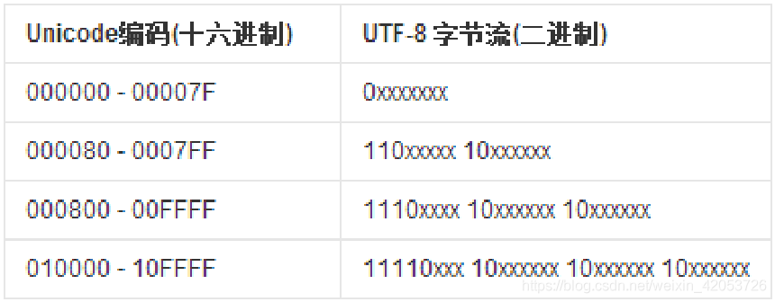

# 编码格式

- [编码格式](#编码格式)
  - [基础概念](#基础概念)
  - [0.先验知识](#0先验知识)
  - [1.字符编码集](#1字符编码集)
  - [2.字符在硬盘上的存储](#2字符在硬盘上的存储)

## 基础概念

字符：你正在阅读的这篇文章就是由很多个字符（Character）构成的，字符一个信息单位，它是各种文字和符号的统称，比如一个英文字母是一个字符，一个汉字是一个字符，一个标点符号也是一个字符。

字符集：字符集（Character Set）就是某个范围内字符的集合，不同的字符集规定了字符的个数，比如 ASCII 字符集总共有128个字符，包含了英文字母、阿拉伯数字、标点符号和控制符。而 GB2312 字符集定义了7445个字符，包含了绝大部分汉字字符。

字符码：字符码（Code Point）指的是字符集中每个字符的数字编号，例如 ASCII 字符集用 0-127 连续的128个数字分别表示128个字符，例如 "A" 的字符码编号就是65。

字符编码：字符编码（Character Encoding）是将字符集中的字符码映射为字节流的一种具体实现方案，常见的字符编码有 ASCII 编码、UTF-8 编码、GBK 编码等。某种意义上来说，字符集与字符编码有种对应关系，例如 ASCII 字符集对应 有 ASCII 编码。ASCII 字符编码规定使用单字节中低位的7个比特去编码所有的字符。例如"A" 的编号是65，用单字节表示就是0×41，因此写入存储设备的时候就是b'01000001'。

编码、解码：编码的过程是将字符转换成字节流，解码的过程是将字节流解析为字符。

理解了这些基本的术语概念后，我们就可以开始讨论计算机的字符编码的演进过程了。

## 0.先验知识

Windows默认的中文集就是GBK，两个字节表示。

Ubuntu默认只是支持utf-8汉字编码，没有GBK。

英文一个字节表示，一个字节是8位。

对于汉字『好』，用 str 表示时，它对应的 utf-8 编码 是'\xe5\xa5\xbd'，对应的 gbk 编码是 '\xba\xc3'，而用 unicode 表示时，他对应的符号就是u'\u597d'，与u"好" 是等同的。

## 1.字符编码集

Unicode：
  
*   直接支持全球所有语言，每个国家都可以不用再使用自己之前的旧编码了。
*   unicode包含了跟全球所有国家编码的映射关系，Unicode解决了字符和二进制的对应关系。

UTF：
  
*   为了解决存储和网络传输的问题，对unicode进行转换，以便于在存储和网络传输时可以节省空间，出现了Unicode Transformation Format。
*   UTF-8：使用1、2、3、4个字节表示所有字符；优先使用1个字符、无法满足则使增加一个字节，最多4个字节。英文占1个字节、欧洲语系占2个、东亚语系占3个，其他及特殊字符占4个。
*   UTF-16：使用2、4个字节表示所有字符；优先使用2个字节，否则使用4个字节表示。
*   UTF-32：使用4个字节表示所有字符。
*   总结：UTF是为unicode编码设计的一种在存储和传输时节省空间的编码方案。

## 2.字符在硬盘上的存储

首先要明确的一点就是，无论以什么编码在内存里显示字符，存到硬盘上都是2进制。

Unicode统一码：

*   用0-0x10FFFF来映射全球各国的语言文字，Unicode是国际组织制定的可以容纳世界上所有文字和符号的字符编码方案。  
*   Unicode用数字0-0x10FFFF来映射这些字符，最多可以容纳1114112个字符。
*   第一种方案：UTF-32编码每个字符用一个int来表示。特点：简单，但太浪费空间abcd -> 16个字节。
*   第二种方案：UTF-16编码。特点: 用1~2个short来表示一个字符。
*   第三种方案：UTF-8编码。用1~4个字节来表示一个字符(比较节省空间)。
*   
*   UTF-8是针对Unicode的可变长度字符编码，一个字符可以由1到4个字节表示，其中由一个字节表示的字符和ASCII的7bits编码一样，而包括中文在内的大部分字符则由3个字节表示。

ANSI-外文编码：

*   ANSI编码一般指Windows-1252编码，是一个256个字符的字集的编码，每个字符由一个字节表示。其中前128个字符(00-7F)和ASCII的7bits编码一样，后128个字符中有一些欧洲国家用的有重音的字符。
*   ANSI编码在不同语言的Windows下也指此语言下的Windows编码页，比如中文环境下指Windows-936(也就是GB2312)，日文环境下是Windows-932(JIS)编码等等，也是前128个字符(00-7F)和ASCII的7bits编码一样，其他字符则由2个字节表示。
*   如果文本里只有ASCII的7bits编码的那些，ANSI和UTF-8是互相兼容没有区别的，但是对其他字符，编码就不同了。
*   Windows-1252编码无法表达除了256个字符外的比如中文字符，其他的ANSI编码如Windows-936也只能表示一部分Unicode中的字符。编码格式的不同导致程序无法运行很容易理解，因为同样的字集在不同的编码方式下表达的字符是不同的或者是不能被表示的，除非是ASCII的7bits编码中的那些字符。

BOM：
  
*   UTF-8不需要BOM来表明字节顺序，但可以用BOM来表明编码方式。
*   Windows就是使用BOM来标记文本文件的编码方式的，Windows下UTF-8编码的文件时有UTF-8 BOM标识（EF BB BF）。
*   不是所有软件都支持BOM。
