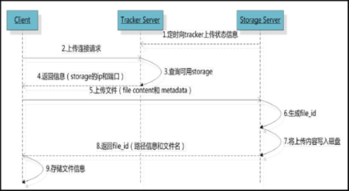
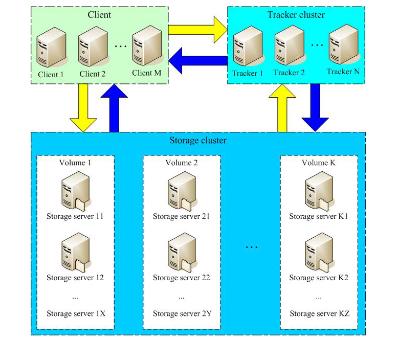

# FastDFS入门

## FastDFS简介

FastDFS是用C语言编写的一款开源的分布式文件系统。为互联网量身定制，充分考虑了冗余备份（纵向扩容）、负载均衡、线性扩容（横向扩容）等机制，注意高可用、高性能等指标。可以很容易搭建一套高性能的文件服务器集群提供文件上传、下载等服务。

FastDFS框架中三个主要模块：

*   Tracker：跟踪器，主要负责管理和调度存储节点，对客户端提供文件上传、下载等服务。
*   Storage：存储节点，主要负责存储文件，支持集群部署，提供高可用。
*   Client：客户端，主要负责上传、下载文件，与Tracker交互，获取存储节点信息。
*   注意：
    *   Tracker和Storage可以部署在同一台服务器上，也可以部署在不同的服务器上。
    *   Tracker和Storage是守护进程，需要启动和停止。而Client则是应用进程，可以直接调用API接口。

FastDFS上传流程：

FastDFS下载流程：

FastDFS集群架构：

