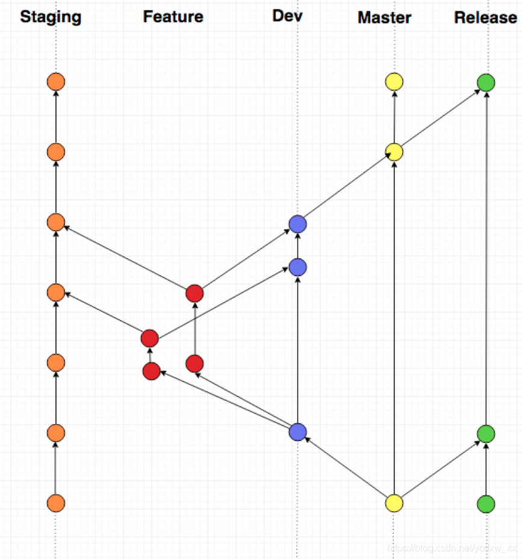
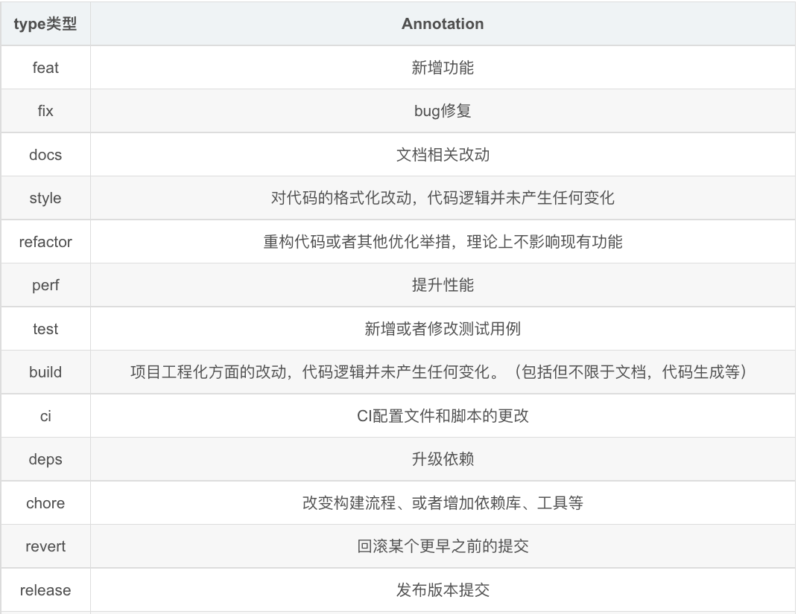
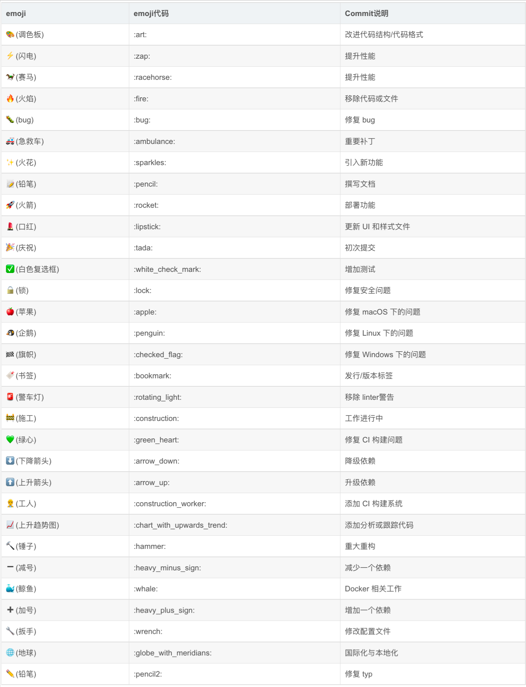

# Git使用规范和Emoji列表

1.  [Git工作区域](#git工作区域)
2.  [开发过程中的git分支管理](#开发过程中的git分支管理)
3.  [软件版本号](#软件版本号)
4.  [Commit Message（Angular规范）](#commit-messageangular规范)
5.  [Emoji](#emoji)
6.  [Git常用命令](#git常用命令)
7.  [Git支持的传输协议](#git支持的传输协议)

## Git工作区域


Workspace：直接写好的代码，以文件形式存储在硬盘上。

index/stage：git add之后会存入index/stage暂存区。

repository：git commit之后会存入repository本地仓库。

remote：git push之后会存入remote远程仓库。

## 开发过程中的git分支管理

使用Github进行代码管理与权限控制。

服务器部署环境：

*   staging：用于开发功能时给RD测试用。代码、数据库都是测试环境下的。
*   preview：用于代码部署到生产环境前的测试。代码是准生产版本，数据库是生产环境下的。
*   production：生产环境。代码、数据库都是生产环境下的。

分支种类：

*   永久存在于代码库中的分支：
    *   staging分支：用于staging环境的部署。
    *   master分支：Git的默认分支，提供最新、稳定的代码。
    *   preview分支：用于preview环境的部署。
    *   release分支：用于production环境的部署，保持代码随时可发布到生产环境。
*   暂存于代码库中的分支：
    *   dev分支：以dev_xxx命名，其中xxx是对功能的简单描述。
    *   feature分支：以feature_xxx命名，其中xxx是对子功能的简单描述。
    *   bugfix分支：以bugfix_xxx命名，其中xxx是对bug的简单描述。
    *   hotfix分支：以hotfix_xxx命名，其中xxx是对紧急bug的简单描述。

分支的生命周期：

*   
*   master分支：默认存在，保持最新的、稳定的代码。
    *   从如下分支合并（merged from）：dev，bugfix，hotfix。
*   preview分支：
    *   从如下分支合并（merged from）：master。
    *   一旦拉出，再也不合入其它分支。
*   release分支：
    *   从如下分支合并（merged from）：master。
    *   一旦拉出，再也不合入其它分支。
*   staging分支：
    *   从如下分支合并（merged from）：feature。
    *   一旦拉出，再也不合入其它分支。
*   dev分支：
    *   派生自如下分支（forked from）：master。
    *   合入如下分支：master。
*   feature分支：
    *   派生自如下分支（forked from）：dev。
    *   合入如下分支：staging，dev。
*   bugix分支：
    *   派生自如下分支（forked from）：master。
    *   合入如下分支：staging，master。
*   hotfix分支：
    *   派生自如下分支（forked from）：release。
    *   合入如下分支：staging，master，preview，release。

分支命名的建议：

*   对dev分支，建议以dev_xxx_yyyyMMdd。
*   对feature、bugfix和hotfix分支，建议以feature_xxx_name。

典型场景举例：

*   开发新的功能：
    *   1.某RD先从master分支fork出dev分支，命名为dev_xxx。
    *   2.参与开发这个功能的RD基于dev_xxx分支fork出feature_xxx_RDA，feature_xxx_RDB等分支。
    *   3.各RD在本身的feature分支开发子功能。
    *   4.RDA在本身的分支feature_xxx_RDA上提交了几个工具类，这些类会给其余RD用。他把feature_xxx_RDA分支push到远程仓库，再merge到staging，在staging环境发布、测试。若是测试发现问题，他再提交一次commit到feature_xxx_RDA分支，然后merge到staging，再发布、测试。测试通过后，他把feature_xxx_RDA分支merge到dev_xxx分支，而后继续开发其它功能。
    *   5.RDB的工作依赖于RDA开发的工具类，他把feature_xxx_RDB分支rebase到最新的dev_xxx分支，然后进行开发。
    *   6.全部RD开发完后，某RD再把dev_xxx分支merge到master分支，然后删除dev_xxx分支。某RD再把master分支merge到preview分支。
    *   7.在preview分支通过测试后，再把master分支merge到release分支，而后发布到生产环境。
*   修复常规bug：
    *   1.某RD领到一个bug，开始修复时，他从master分支fork出bugfix分支，命名为bugfix_xxx。
    *   2.RD在bugfix_xxx分支上提交修复代码，然后自己测试通过后，再merge到staging，然后在staging环境发布、测试。若是测试发现问题，他再提交一个commit到bugfix_xxx分支，然后再merge到staging，再发布、测试。直到测试彻底通过，他把bugfix_xxx_merge到master分支，然后删除bugfix_xxx分支。
    *   3.由于是常规bug，他不需要立刻把修复的代码部署到生产环境，等待下一次发布周期即可。
*   修复线上紧急bug：
    *   1.某RD领到一个紧急bug，开始修复时，他从release分支fork出hotfix分支，命名为hotfix_xxx。
    *   2.RD在hotfix_xxx分支进行修复，提交代码后，他把hotfix_xxx分支merge到staging，然后在staging环境发布、测试。若是测试发现问题，他再提交一个commit到hotfix_xxx分支，然后再merge到staging，再发布、测试。直到测试彻底通过，他把hotfix_xxx分支merge到preview分支，在preview环境测试。若是测试发现问题，继续在hotfix_xxx分支提交修复代码，再merge到staging进行测试。
    *   preview环境测试通过后，RD把hotfix_xxx分支merge到release分支。上线，在生产环境观察bug是否修复。
    *   若是生产环境还有问题，继续在hotfix_xxx修复，然后再staging、preview测试，测试通过后再从新上线。这种情况应该尽量避免，保证一次上线修复成功。
    *   生产环境验证没问题后，RD把hotfix_xxx分支merge到master，然后删除hotfix_xxx分支。

## 软件版本号

GNU命名风格：主版本号.子版本号.修正版本号.编译版本号。

*   管理策略：
    *   1.项目初版本时，版本号可以为0.1或0.1.0，也可以为1.0或1.0.0，如果你为人很低调，我想你会选择那个主版本号为0的方式。
    *   2.当项目在进行了局部修改或bug修正时，主版本号和子版本号都不变，修正版本号加1。
    *   3.当项目在原有的基础上增加了部分功能时，主版本号不变，子版本号加1，修正版本号复位为0，因而可以被忽略掉。
    *   4.当项目在进行了重大修改或局部修正累积较多，而导致项目整体发生全局变化时，主版本号加1。
    *   5.编译版本号一般是编译器在编译过程中自动生成的，我们只定义其格式，并不进行人为控制。

## Commit Message（Angular规范）

每次提交，Commit Message都包括三个部分：header、body和footer。

*   其中，header是必需的，body和footer可以省略。
*   不管是哪一部分，任何一行都不得超过72个字符（或100个字符）。这是为了避免自动换行影响美观，方便在github或其它git工具上阅读。

```txt
<type>(<scope>): <subject>
<BLANK LINE>
<body>
<BLANK LINE>
<footer>
```

Header部分：type（必需）、scope（可选）和subject（必需）。

*   type：代表提交的类型，比如修复一个bug或者增加一个新的feature。
    *   
    *   如果type为feat和fix，则该commit将肯定出现在Change Log中，其它情况（docs、chore、style、refactor、test）由你决定要不要放入Change Log，建议是不要。
    *   在type后面增加"!"代表重大的代码更改。
*   scope：用于标记此次修改文件的范围，这个范围可以对应某个功能或者文件夹等。
*   subject：commit的概述，应言简意骇。

Body部分：对本次commit的详细描述，可以分为多行。

Footer部分：包含一些重大的更改或弃用信息（即不兼容变动），或者关闭issue。

Revert部分：这是一种特殊情况，如果当前commit用于撤销以前的commit，则必须以revert开头，后面跟着被撤销的Commit的Header。

Commit示例参考：

```txt
feat($browser): onUrlChange event (popstate/hashchange/polling)

Added new event to $browser:
- forward popstate event if available
- forward hashchange event if popstate not available
- do polling when neither popstate nor hashchange available

Breaks $browser.onHashChange, which was removed (use onUrlChange instead)
```

```txt
fix($compile): couple of unit tests for IE9

Older IEs serialize html uppercased, but IE9 does not
Would be better to expect case insensitive, unfortunately jasmine does
not allow to user regexps for throw expectations.

Closes #351
```

```txt
docs(guide): updated fixed docs from Google Docs

Couple of typos fixed:
- indentation
- batchLogbatchLog -> batchLog
- start periodic checking
- missing brace
```

## Emoji



## Git常用命令

|    命令    |                        举例                         |                                说明                                 |
| :--------: | :-------------------------------------------------: | :-----------------------------------------------------------------: |
|   config   |           git config --list --show-origin           |                  查看所有的配置以及它们所在的文件                   |
|            |                  git config --list                  |                           查看所有的配置                            |
|            |                git config user.name                 |                        查看提交的作者的姓名                         |
|            |                git config user.email                |                    查看提交的作者的电子邮件地址                     |
|            |       git config --global user.name "[name]"        |                    设置（切换）提交的作者的姓名                     |
|            |  git config --global user.email "[email address]"   |                设置（切换）提交的作者的电子邮件地址                 |
|    init    |             git init [repository name]              |                         启用一个新的存储库                          |
|   clone    |                   git clone [url]                   |                        从现有 URL 获取存储库                        |
|    add     |                   git add [file]                    |                       将某个文件添加到暂存区                        |
|            |                      git add .                      |                       将所有文件添加到暂存区                        |
|  ls-files  |                    git ls-files                     |                        查看暂存区中文件信息                         |
|   commit   |                  git commit [file]                  |                  将暂存区某个文件添加到本地仓库中                   |
|            |                    git commit *                     |                 将暂存区中所有文件添加到本地仓库中                  |
|            |    git commit -m "[type in the commit message]"     |                    将暂存区内容添加到本地仓库中                     |
|            |                    git commit -a                    |    将暂存区和"Changes bu not updated"的文件一起提交到本地仓库中     |
|    log     |                       git log                       |                            查看提交记录                             |
|    show    |                      git show                       |                       查看最近一次提交的内容                        |
|            |                 git show [commitID]                 |                         查看某次提交的内容                          |
| update-ref |               git update-ref -d HEAD                |                           删除第一次提交                            |
|   reset    |                git reset [commitID]                 |           回滚到某次提交，此次提交之后的修改不在暂存区中            |
|            |             git reset --soft [commitID]             |                   此次提交之后的修改仍然在暂存区                    |
|            |             git reset --hard [commitID]             |            此次提交之后的修改不做任何保留，文件会被删除             |
|    diff    |                      git diff                       | 显示已写入暂存区的文件和"Changes not staged for commit"的文件的区别 |
|            |                  git diff --cached                  |      显示已提交到本地仓库和未提交到本地仓库的暂存区文件的区别       |
|            |       git diff [first branch] [second branch]       |                         显示两个分支的区别                          |
|   status   |                     git status                      |                       列出所有必须提交的文件                        |
|     rm     |               git rm --cached [file]                |                        从暂存区删除某个文件                         |
|            |                  git rm --f [file]                  |                    从暂存区和工作区删除某个文件                     |
|   branch   |                     git branch                      |                   列出当前存储库中的所有本地分支                    |
|            |              git branch [branch name]               |                           创建一个新分支                            |
|            |             git branch -d [branch name]             |                            删除一个分支                             |
|  checkout  |             git checkout [branch name]              |                   用于从一个分支切换到另一个分支                    |
|            |            git checkout -b [branch name]            |                        创建一个新分支并切换                         |
|   merge    |               git merge [branch name]               |                  将指定分支的历史合并到当前分支中                   |
|   remote   |                     git remote                      |                          显示远程仓库别名                           |
|            |        git remote show [remote server link]         |                       显示某个远程仓库的信息                        |
|            | git remote add [variable name] [remote server link] |                      将本地仓库连接到远程仓库                       |
|    push    |           git push [variable name] master           |               将主分支的已提交更改发送到你的远程仓库                |
|            |       git push [variable name] [branch name]        |                将分支的已提交更改发送到你的远程仓库                 |
|            |            git push -all [variable name]            |                    将全部分支发送到你的远程仓库                     |
|            |      git push [variable name] : [branch name]       |                      将分支从你的远程仓库删除                       |
|    pull    |            git pull [remote server link]            |            获取远程仓库上的更改并将其合并到你的工作目录             |

## Git支持的传输协议

git可以在各种不同的协议上运行：

*   https协议：
    *   格式为：`https://github.com/project/repo.git`。
    *   本协议使用443端口（或http使用80端口），允许匿名读访问，但是写访问需要密码验证。
    *   对防火墙较为友好。
*   ssh协议：
    *   格式为：`git@github.com:project/repo.git`。
    *   本协议使用22端口，允许读写访问，但是需要ssh密钥进行身份验证。
    *   如果你向git提供了公共ssh密钥，ssh协议将使用你的私有密钥进行git身份验证，这样你不需要提用户名密码。
    *   使用ssh协议，你不用每次使用git push命令时都要被要求提供密码，因为ssh协议将使用你的私有密钥与远程仓库进行身份验证。

```bash
# using https for git
git config --global url."https://github.com/".insteadOf git@github.com:
git config --global url."https://".insteadOf git://
# using git for https
git config --global url."git@github.com:".insteadOf https://github.com/
git config --global url."git://".insteadOf https://
```
