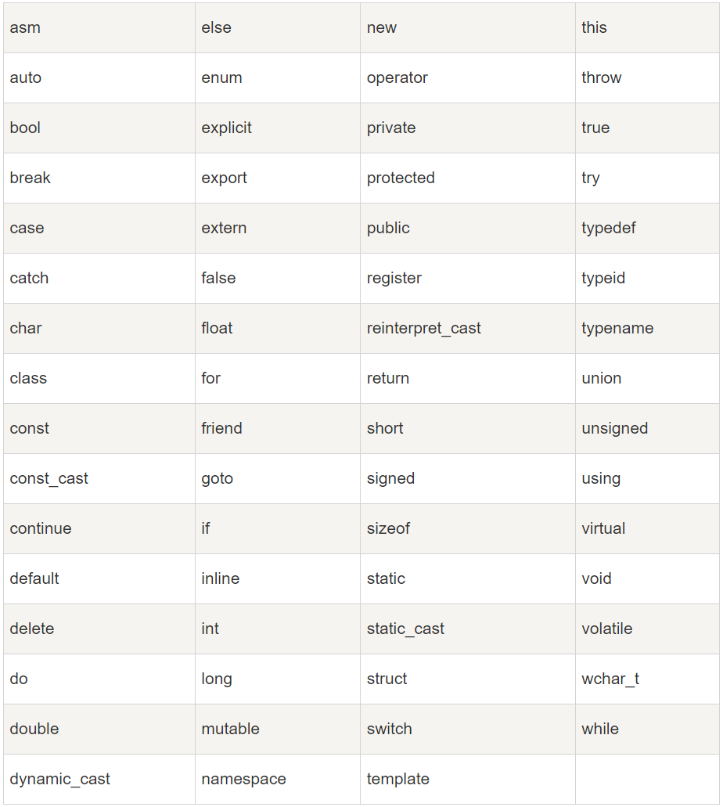

# CPP

1.  [C++简介](#cpp简介)
2.  [C++基础](#cpp基础)
3.  [C++标准库](#cpp标准库)

## CPP简介

C++是由Bjarne Stroustrup于1979年在新泽西州贝尔实验室开始设计开发的。C++进一步扩充和完善了C语言，最初命名为带类的C，后来在1983年更名为C++。C++是C的一个超集，事实上，任何合法的C程序都是合法的C++程序。

C++是一种静态类型的、编译式的、通用的、大小写敏感的、不规则的编程语言，支持过程化编程、面向对象编程和泛型编程。

C++完全支持面向对象的程序设计，包括面向对象开发的四大特性：

*   封装（Encapsulation）：封装是将数据和方法组合在一起，对外部隐藏实现细节，只公开对外提供的接口。这样可以提高安全性、可靠性和灵活性。
*   继承（Inheritance）：继承是从已有类中派生出新类，新类具有已有类的属性和方法，并且可以扩展或修改这些属性和方法。这样可以提高代码的复用性和可扩展性。
*   多态（Polymorphism）：多态是指同一种操作作用于不同的对象，可以有不同的解释和实现。它可以通过接口或继承实现，可以提高代码的灵活性和可读性。
*   抽象（Abstraction）：抽象是从具体的实例中提取共同的特征，形成抽象类或接口，以便于代码的复用和扩展。抽象类和接口可以让程序员专注于高层次的设计和业务逻辑，而不必关注底层的实现细节。

## CPP基础

C++标识符：

*   C++标识符是用来标识变量、函数、类、模块，或任何其他用户自定义项目的名称。
*   一个标识符以字母（A-Z或a-z）或下划线（_）开始，后跟零个或多个字母、下划线和数字（0-9）。
*   C++标识符内不允许出现标点字符，比如@、&和%。C++是区分大小写的编程语言。
*   关键字不能作用标识符。

C++关键字：



C++注释：单行注释（`//`）和多行注释（`/* */`）。

C++变量：

*   变量其实只不过是程序可操作的存储区的名称。
*   C++中每个变量都有指定的类型，类型决定了变量存储的大小和布局，该范围内的值都可以存储在内存中，运算符可应用于变量上。
*   C++中，类型的长度（即占用的字节数）取决于编译器和计算机架构，然而C++标准规定了不同整数类型的最小范围，而不是具体的字节数，这是为了确保代码在不同的系统上能够正常运行。因为C++标准规定的是最小范围，所以实际上许多系统上这些类型可能占用更多的字节。
*   变量的定义：`数据类型 变量名 (= 初始值);`。

C++数据类型：

*   内置数据类型：
    *   注意：C++中内置数据类型大小实现并不固定，取决于编译器和平台。通常依照如下约定：
        *   char：至少8位，通常是8位。
        *   short：至少和char一样大，但通常比int小，通常是16位。
        *   int：至少和short一样大，但通常比long小，通常是32位。
        *   long：至少和int一样大，但通常比long long小，通常是32位。
        *   long long：至少和long一样大，通常是64位。
        *   float：通常是32位。
        *   double：至少和float一样大，通常是64位。
    *   整型：int、short、long、long long，以及无符号版本（如unsigned int等）。默认情况下，整型都是带符号版本，如int默认就是signed int。
    *   浮点型：float、double、long double。
    *   字符型：char、wchar_t（宽字符）、char16_t（C++11，UTF-16编码）、char32_t（C++11，UTF-32编码）。
    *   布尔型：bool。
    *   指针型：用于存储内存地址，如int*、double*。
    *   引用型：引用是已存在变量的别名，如int&，double&。
    *   其他类型：void（无类型）、void*（通用指针类型）、site_t（数组索引）、ptrdiff_t（指针运算）。
*   用户自定义数据类型：
    *   结构体（struct）：结构体允许你将多个不同类型的变量组合成一个单一的类型。
    *   类（class）：类是C++中面向对象编程的基础。类可以包含数据成员和成员函数。
    *   联合体（union）：联合体允许你在相同的内存位置存储不同的数据类型。但联合体只能同时存储一种类型的值。
    *   枚举（enum）：枚举类型是一种用户定义的整型类型，它可以用来定义一组相关常量。
    *   模板：虽然模板本身不是数据类型，但它允许你创建泛型类或函数，这些类或函数可以处理多种数据类型。
    *   类型别名：使用typedef或using关键字，可以为已存在的类型创建别名。注意using关键字从C++98开始就有，但是定义类型别名的语法在C++11中才引入。

```c++
/* Print size of types */
#include <iostream>
#include <limits>
using namespace std;

struct Point {
  int x;
  int y;
};

class Rectangle {
 public:
  int width;
  int height;

  Rectangle(int w, int h) : width(w), height(h) {}

  int Area() { return width * height; }
};

union Data {
  int i;
  double d;
};

enum Color { RED, GREEN, BLUE };

int main() {
  cout << "********************************** size of type **********************************" << endl;
  cout << "bool: \t\tbytes:" << sizeof(bool);
  cout << "\t\t max value:" << static_cast<int>((numeric_limits<bool>::max)());
  cout << "\t\t\t min value:" << static_cast<int>((numeric_limits<bool>::min)()) << endl;
  cout << "char: \t\tbytes:" << sizeof(char);
  cout << "\t\t max value:" << static_cast<int>((numeric_limits<char>::max)());
  cout << "\t\t\t min value:" << static_cast<int>((numeric_limits<char>::min)()) << endl;
  cout << "signed char: \tbytes:" << sizeof(signed char);
  cout << "\t\t max value:" << static_cast<int>((numeric_limits<signed char>::max)());
  cout << "\t\t\t min value:" << static_cast<int>((numeric_limits<signed char>::min)()) << endl;
  cout << "unsigned char: \tbytes:" << sizeof(unsigned char);
  cout << "\t\t max value:" << static_cast<int>((numeric_limits<unsigned char>::max)());
  cout << "\t\t\t min value:" << static_cast<int>((numeric_limits<unsigned char>::min)()) << endl;
  cout << "wchar_t: \tbytes:" << sizeof(wchar_t);
  cout << "\t\t max value:" << static_cast<int>((numeric_limits<wchar_t>::max)());
  cout << "\t\t min value:" << static_cast<int>((numeric_limits<wchar_t>::min)()) << endl;
  cout << "short: \t\tbytes:" << sizeof(short);
  cout << "\t\t max value:" << (numeric_limits<short>::max)();
  cout << "\t\t min value:" << (numeric_limits<short>::min)() << endl;
  cout << "int: \t\tbytes:" << sizeof(int);
  cout << "\t\t max value:" << (numeric_limits<int>::max)();
  cout << "\t\t min value:" << (numeric_limits<int>::min)() << endl;
  cout << "unsigned: \tbytes:" << sizeof(unsigned);
  cout << "\t\t max value:" << (numeric_limits<unsigned>::max)();
  cout << "\t\t min value:" << (numeric_limits<unsigned>::min)() << endl;
  cout << "long: \t\tbytes:" << sizeof(long);
  cout << "\t\t max value:" << (numeric_limits<long>::max)();
  cout << "\t\t min value:" << (numeric_limits<long>::min)() << endl;
  cout << "long long: \tbytes:" << sizeof(long long);
  cout << "\t\t max value:" << (numeric_limits<long long>::max)();
  cout << "\t min value:" << (numeric_limits<long long>::min)() << endl;
  cout << "float: \t\tbytes:" << sizeof(float);
  cout << "\t\t max value:" << (numeric_limits<float>::max)();
  cout << "\t\t min value:" << (numeric_limits<float>::min)() << endl;
  cout << "double: \tbytes:" << sizeof(double);
  cout << "\t\t max value:" << (numeric_limits<double>::max)();
  cout << "\t\t min value:" << (numeric_limits<double>::min)() << endl;
  cout << "long double: \tbytes:" << sizeof(long double);
  cout << "\t max value:" << (numeric_limits<long double>::max)();
  cout << "\t min value:" << (numeric_limits<long double>::min)() << endl;
  cout << "int*: \t\tbytes:" << sizeof(int *) << endl;
  cout << "double*: \tbytes:" << sizeof(double *) << endl;
  cout << "int&: \t\tbytes:" << sizeof(int &) << endl;
  cout << "double&: \tbytes:" << sizeof(double &) << endl;
  cout << "void*: \t\tbytes:" << sizeof(void *) << endl;
  cout << "size_t: \tbytes:" << sizeof(size_t);
  cout << "\t\t max value:" << (numeric_limits<size_t>::max)();
  cout << "\t\t min value:" << (numeric_limits<size_t>::min)() << endl;
  cout << "ptrdiff_t: \tbytes:" << sizeof(ptrdiff_t);
  cout << "\t\t max value:" << (numeric_limits<ptrdiff_t>::max)();
  cout << "\t\t min value:" << (numeric_limits<ptrdiff_t>::min)() << endl;
  cout << "string: \tbytes:" << sizeof(string) << endl;
  cout << "struct Point: \tbytes:" << sizeof(struct Point) << endl;
  cout << "Rectangle: \tbytes:" << sizeof(Rectangle) << endl;
  cout << "union Data: \tbytes:" << sizeof(union Data) << endl;
  cout << "enum Color: \tbytes:" << sizeof(enum Color) << endl;
  cout << "********************************** size of type **********************************" << endl;
  return 0;
}
```

C++常量：

*   整数常量：
    *   前缀修饰：可以使用前缀`0b`、`0`或`0x`表示二进制、八进制或十六进制数，不含前缀时默认表示十进制数。
    *   后缀修饰：可以使用后缀`u`或`l`表示无符号或长整型。
    *   注意：前后缀中字母的大小写不敏感，如0B1010和0b1010表示相同的值。
*   浮点常量：分为小数形式和指数形式。
    *   小数形式：使用小数点分隔整数部分和小数部分。
    *   指数形式：使用`e`或`E`表示指数部分。
*   布尔常量：`true`和`false`。
*   字符常量：
    *   括在单引号中的单个字符。
    *   不含前缀表示窄字符常量，使用前缀`L`表示宽字符常量。注意：此处前缀大小写敏感，只能用大写不能用小写的`l`。
    *   C++中还有一些特定的转义字符，如`\n`表示换行符、`\r`表示回车符、`\t`表示制表符、`\b`是退格符、`\0`表示空字符。
*   字符串常量：括在双引号中的字符序列，可以包含任意字符。

```c++
#include <clocale>
#include <iostream>
#include <string>
using namespace std;

int main() {
  int bin = 0b10000000000;
  int oct = 02000;
  int dec = 1024;
  int hex = 0x400;
  unsigned int ui = 1024U;
  long l = 1024L;

  cout << bin << "\t" << oct << "\t" << dec << "\t" << hex << endl;
  cout << ui << "\t" << l << endl;

  float fe = 314159E-5;
  cout << fe << endl;

  wchar_t wc = L'\u6211';
  setlocale(LC_ALL, "");
  wcout << wc << endl;

  string hello = "Hello World";
  cout << hello << endl;

  return 0;
}
```

定义常量：

*   使用`#define`预处理器。
*   使用`const`关键字。

C++中的类型限定符：提供变量的额外信息，用于在定义变量或函数时提供额外的约束条件。

*   `const`：用于修饰变量，表示该变量只能被赋值一次并且不能被修改。
*   `volatile`：用于修饰变量，表示该变量在程序执行过程中可以被某些因素（如操作系统、硬件、其他线程等）改变，因此必须每次都从内存中读取值，不能被编译器优化。它在多线程编程或硬件接口编程中特别有用，以确保对共享数据的正确访问。
*   `mutable`：用于修饰成员变量，使其可以在const成员函数中被修改。通常用于保持常量对象中大部分成员变量仍然是“只读”的情况下，实现对个别成员变量的修改。需要注意的是，mutable只能作用于类的非静态和非常量成员变量。在一个类中应尽量或者不用mutable，大量使用mutable说明程序设计有缺陷。

    ```c++
    class Test {
     public:
      Test() : count_(0) {}
      ~Test() {}

      int GetCount() const { return count_; }
      void Increment() const { count_++; }  // count_ 可以被 const 成员函数修改

     private:
      mutable int count_;
    };
    ```

*   `static`：用于修饰变量、函数和类成员。
    *   共同点：无论是静态变量、静态函数还是静态类成员，它们都具有静态存储期，这意味着它们只在程序运行时初始化一次，并在程序结束时销毁。
    *   不同点：
        *   静态变量：静态局部变量只在其定义的函数内部可见，但其生命周期是整个程序的执行期间。静态全局变量具有文件作用域，只在定义它们的文件中可见，且生命周期也是整个程序的执行期间。未显式初始化的静态局部变量和静态全局变量默认都会被初始化为0（对于基本数据类型）。
        *   静态函数：只能在定义它们的文件内部被调用，不能被其他文件调用。通常用于封装只在单个文件中使用的功能。
        *   静态类成员：静态类成员的存储期也是整个程序的执行期间。静态成员变量在类的所有对象之间共享，也就是说所有对象都访问同一份静态数据成员的副本。通常静态类成员保存与类相关但是与对象无关的全局数据或功能。

    ```c++
    void Foo() {
      static int si = 0;  // 只在第一次调用时初始化
      si++;
      cout << si << endl;
    }

    static void Bar() {  // 只在这个文件中可见
      cout << "Hello from bar" << endl;
    }

    class Test {
     public:
      static int count;  // 所有类的对象共享同一个 count 变量
      static void Increment() { count++; }

     private:
      static const int sci_ = 42;  // 静态成员常量可以在类中初始化，只能在类内部访问
    };

    int Test::count = 0;  // 静态成员变量的初始化必须在类外部进行

    int main() {
      for (int i = 0; i < 5; i++) {
        Foo();
      }

      Bar();

      Test::Increment();
      cout << Test::count << endl;
      return 0;
    }
    ```

*   `register`：用于修饰变量，表示该变量被频繁使用，变量可以被存放在寄存器中，而不是在内存中，以提高程序的运行效率，但是实际上是否会存储在寄存器中由编译器决定。

C++存储类：决定了变量或函数的存储方式和生命周期。

*   `auto`：在C++98中，auto关键字是默认的存储类说明符，通常可以省略不写。auto指定的变量具有自动存储期，即它们的生命周期仅限于定义它们的块（block），在块结束时销毁。但从C++11开始，auto的主要用途变为自动类型推导，即让编译器自动确定变量的类型，auto几乎不再用于表示存储类。
*   `register`：建议编译器将变量的值存储在寄存器中，但C++标准中没有强制要求编译器遵循此建议，同时由于编译器优化，它几乎不被使用。
*   `static`：对于局部变量，static表示变量具有静态存储期，即它在程序执行期间一直存在，且只在初始化时分配内存。对于全局或命名空间变量，static表示变量具有内部链接，即它只能在定义它的文件内被访问。对于类成员变量，static表示该变量属于类而非类的任何特定对象。
*   `extern`：extern表示变量或函数在另一个文件中定义，即在当前文件之外定义。它告诉编译器不要在当前文件中为该变量或函数分配存储空间。可以在一个文件中使用extern声明另一个文件中定义的全局变量或函数，可以实现跨文件共享。
*   `mutable`：用于类的非静态成员变量，使其可以在const成员函数中被修改。通常用于缓存或计数器等需要在const上下文中修改的数据。
*   `thread_local`：是C++11新增的关键字，表示该变量的生命周期与线程的生命周期一致。每个线程都有自己的该变量的副本，并且线程间不会共享这些副本。

    ```c++
    #include <iostream>
    #include <mutex>
    #include <thread>
    using namespace std;

    thread_local int kLocalCounter = 0;
    int kGlobalCount = 1;
    mutex kPrintMtx;

    void Increment(const string& name, int step) {
      for (int i = 0; i < 5; i++) {
        this_thread::sleep_for(chrono::seconds(1));
        lock_guard<mutex> lock(kPrintMtx);
        cout << "Thread name: " << name << ", Local Counter: " << kLocalCounter
            << ", Global Counter: " << kGlobalCount++ << endl;
        kLocalCounter += step;
      }
    }

    int main() {
      thread t1(Increment, "t1", 2);
      thread t2(Increment, "t2", 5);

      t1.join();
      t2.join();

      return 0;
    }
    ```

类型转换：将一个数据类型的值转换为另一个数据类型的值。

*   隐式类型转换（Implicit Type Conversion）：由编译器自动完成，无需显式指示，但个人不推荐。
    *   算术运算：当两个不同类型的数据进行算术运算时，较低精度的数据类型会自动转换为较高精度的数据类型。

        ```c++
        cout << int_var + doouble_var << endl;
        ```

    *   赋值运算：当将一个值赋给一个不同类型的变量时，如果这个转换是安全的，编译器会自动进行类型转换。

        ```c++
        int int_var = double_var;
        ```

    *   函数调用：当函数的参数类型与实际传递的参数类型不同时，编译器会自动进行类型转换。

        ```c++
        void PrintInteger(int i) { /* doSomething */ }
        PrintInteger(double_var);
        ```

*   显式类型转换（Explicit Type Conversion）：
    *   C风格的强制类型转换：使用`(type)expression`语法进行转换。
    *   函数风格的强制类型转换：使用`type(expression)`语法进行转换。
    *   C++风格的强制类型转换：
        *   静态转换（static_cast）：用于执行常规的类型转换，如基本数据类型之间的转换、指针类型的转换、类层次结构中的上行转换和一些用户自定义的转换，但不进行运行时类型检查。

            ```c++
            int int_var = static_cast<int>(double_var);  // 基本数据类型之间的转换

            Derived derived;
            Base* base_ptr = static_cast<Base*>(&derived);  // 上行转换
            ```

        *   动态转换（dynamic_cast）：主要用于多态类型的转换，尤其是在运行时进行类型检查和安全向下转换（从基类指针或引用转换成派生类指针或引用）。因为进行类型检查，如果不能进行转换则返回空指针或引发异常。

            ```c++
            Base* base_ptr = new Derived();
            Derived* derived_ptr = dynamic_cast<Derived*>(base_ptr);  // 下行转换
            ```

        *   常量转换（const_cast）：用于添加或移除变量的const属性，它通常用于函数重载或者处理遗留代码中的const不一致问题。

            ```c++
            const int const_var = 42;
            int* non_const_ptr = const_cast<int*>(&const_var);
            ```

        *   重新解释转换（reinterpret_cast）：用于指针类型之间的位模式转换，或者将指针转换为足够大的整数类型，通常用于底层操作。使用reinterpret_cast时，必须非常小心，因为它可能导致未定义行为。

            ```c++
            int int_var = 42;
            int* int_ptr = &int_var;
            uintptr_t uiptr = reinterpret_cast<uintptr_t>(int_ptr);  // 将指针转换为整数，以进行地址计算
            ```

C++变量作用域：

*   可以定义变量的位置：
    *   在函数或一个代码块内部声明的变量，称为局部变量。
    *   在函数参数列表声明的变量，称为形式参数。
    *   在全局作用域声明的变量，称为全局变量。
*   作用域：决定了变量的生命周期。
    *   局部作用域：在函数内部声明的变量具有局部作用域，它们只能在函数内部访问。局部变量在函数每次被调用时被创建，在函数执行完后被销毁。
    *   全局作用域：在所有函数和代码块之外声明的变量具有全局作用域，它们可以被程序中的任何函数访问。全局变量在程序运行时被创建，直到程序结束时才被销毁。
    *   块作用域：在代码块（如if语句、for语句、while语句等）内部声明的变量具有块作用域，它们只能在该代码块内部访问。块作用域变量在代码块每次被执行时被创建，在代码块执行完后被销毁。
    *   类作用域：在类内部声明的变量具有类作用域，它们可以被类的所有成员函数访问。类作用域变量的生命周期与类的生命周期相同。
*   注意：如果在内部作用域中声明的变量与外部作用域中的变量同名，则内部作用域中的变量将覆盖外部作用域中的变量。

C++运算符：

*   算术运算符：`+`、`-`、`*`、`/`、`%`、`++`、`--`。
*   关系运算符：`==`、`!=`、`>`、`<`、`>=`、`<=`。
*   逻辑运算符：`&&`、`||`、`!`。
*   赋值运算符：`=`、`+=`、`-=`、`*=`、`/=`、`%=`、`&=`、`|=`、`^=`、`<<=`、`>>=`。
*   位运算符：`&`、`|`、`^`、`~`、`<<`、`>>`。
*   条件运算符：`? :`。
*   成员运算符：`.`、`->`。
*   取地址和解引用运算符：`&`、`*`。
*   作用域解析运算符：`::`。
*   逗号运算符：`,`。
*   括号运算符：`()`。
*   下标运算符：`[]`。
*   动态内存分配运算符：`new`、`delete`。
*   类型大小运算符：`sizeof`。

C++运算符优先级：


C++循环：

*   `for`循环：

    ```c++
    for (initialization; condition; iteration) {
      // loop body
    }
    ```

*   `while`循环：

    ```c++
    while (condition) {
      // loop body
    }

*   `do-while`循环：

    ```c++
    do {
      // loop body
    } while (condition);
    ```

*   `range-based for`循环（C++11引入）：

    ```c++
    for (type& element : container) {
      // loop body
    }
    ```

C++循环控制语句：

*   `break`语句：终止loop或switch语句，程序流将继续执行紧接着loop或switch后的语句。
*   `continue`语句：用于跳过当前循环的剩余部分，并立即开始测试条件进入下一次循环。
*   `goto`语句：将控制转移到被标记的语句。但是不建议在程序中使用goto语句。

C++判断：

*   `if`语句：

    ```c++
    if (condition) {
      // code block
    } else if (condition) {
      // code block
    } else {
      // default code block
    }
    ```

*   `switch`语句：

    ```c++
    switch (expression) {
      case value1:
        // code block
        break;
      case value2:
        // code block
        break;
      default:
        // default code block
        break;
    }
    ```

C++函数：

*   定义函数：

    ```c++
    return_type FunctionName(parameter_list) {
      // function body
    }
    ```

*   函数参数：
    *   形式参数是函数定义中声明的变量，用来接收传递给函数的实际参数。实际参数是在调用有参函数时，函数名后面括号中的参数。
    *   在调用函数时，有三种向函数传递参数的方式：
        *   传值调用：该方法把参数的实际值赋给函数的形式参数。在这种情况下，修改函数内的形式参数对实际参数没有影响。
        *   指针调用：该方法把参数的地址（而不是值）赋给函数的形式参数。在这种情况下，修改函数内的形式参数会影响实际参数。
        *   引用调用：该方法把参数的地址赋给函数的形式参数。在这种情况下，修改函数内的形式参数会影响实际参数。
    *   在定义函数时，可以为参数列表中后边的每一个参数指定默认值。在调用函数时，如果实际参数的值留空，则使用这个默认值。
*   Lambda函数（C++11引入）：也称为匿名函数或闭包，是一种可以捕获其所在作用域内变量值并定义简单函数对象的语法结构。Lambda函数特别适用于需要定义一次性使用的简单函数对象的情况。
    *   定义Lambda函数：
        *   `capture`：捕获子句，用于指定Lambda函数体中可以访问的外部变量及其访问方式（值捕获或引用捕获）。如果不指定捕获方式，则默认不能访问外部变量。

            ```c++
            []       // 没有捕获任何外部变量，使用未定义变量会引发错误。
            [x, &y]  // x 以传值方式传入（默认），y 以引用方式传入。
            [&]      // 任何被使用到的外部变量都隐式地以引用方式加以引用。
            [=]      // 任何被使用到的外部变量都隐式地以传值方式加以引用。
            [&, x]   // x 显示地以传值方式加以引用，其余变量以引用方式加以引用。
            [=, &z]  // z 显式地以引用方式加以引用，其余变量以传值方式加以引用。
            ```

        *   `parameters`：函数参数列表，与普通函数的参数列表类似，用于指定Lambda函数的输入参数。
        *   `return_type`：函数返回类型，在函数体中没有return语句或者返回值不复杂时可以省略。

        ```c++
        [capture](parameters) -> return_type { body }
        ```

    *   示例：

        ```c++
        #include <algorithm>
        #include <iostream>
        #include <vector>
        using namespace std;

        int main() {
          vector<int> numbers = {1, 2, 3, 4, 5};
          vector<int> result;

          auto IsGreaterThanThree = [](int num) { return num > 3; };
          copy_if(numbers.begin(), numbers.end(), back_inserter(result), IsGreaterThanThree);

          for (int& num : result) {
            cout << num << endl;
          }

          return 0;
        }
        ```

C++数组：用于存储一个固定大小的相同类型元素的顺序集合。

*   定义数组：`type array_name[array_size]`。
*   初始化数组：`type array_name[array_size] = {value1, value2, ..., valueN}`。
*   访问数组元素：`array_name[index]`。

```c++
#include <iomanip>
#include <iostream>
using namespace std;

double GetAverage(int* arr, int size) {
  int sum = 0;
  double avg;

  for (int i = 0; i < size; i++) {
    sum += arr[i];
  }

  avg = static_cast<double>(sum) / size;

  return avg;
}

int main() {
  int i, j;
  int arr[5] = {0, 1, 2, 3, 4};
  int td_arr[3][4] = {  // two-dimensional array
      {0, 1, 2, 3},
      {4, 5, 6, 7},
      {8, 9, 10, 11}
  };
  int* arr_ptr = arr;
  int* td_arr_ptr[3];
  for (i = 0; i < 3; i++) {
    td_arr_ptr[i] = td_arr[i];
  }

  for (i = 0; i < 5; i++) {
    cout << "arr[" << i << "]: " << setw(12) << left << arr[i];
    cout << "arr_ptr[" << i << "]: " << arr_ptr[i] << endl;
  }
  for (i = 0; i < 3; i++) {
    for (j = 0; j < 4; j++) {
      cout << "td_arr[" << i << "][" << j << "]: ";
      cout << setw(6) << left << td_arr[i][j];
      cout << "td_arr_ptr[" << i << "][" << j << "]: ";
      cout << td_arr_ptr[i][j] << endl;
    }
  }

  cout << "GetAverage(arr, 5): " << GetAverage(arr, 5) << endl;

  return 0;
}
```

C++字符串：

*   C风格字符串：使用`\0`终止的一维字符数组。
*   C++风格字符串：标准库提供了`string`类类型，用于存储和操作字符串。

```c++
#include <iostream>
using namespace std;

int main() {
  // char name[5] = {'J', 'o', 'h', 'n', '\0'}; 等价于下面的代码
  char name[] = "John";
  string sex = "Male";

  cout << "Name: " << name << ", Sex: " << sex << "." << endl;

  return 0;
}
```

C++指针：指针是一个变量，其值为另一个变量的地址，即内存位置的直接地址。

*   定义指针：`type* pointer_name`。
*   初始化指针：`type* pointer_name = &variable_name`。
*   访问指针中存储的变量的值：`*pointer_name`。
*   空指针：`NULL`和`nullptr`（C++11引入）。

C++引用：引用变量是一个别名，也就是说，它是某个已存在的变量的另一个名字。一旦把引用初始化为某个变量，就可以使用该引用名称或变量名称来指向变量。

*   定义引用：`type& reference_name = variable_name`。
*   引用和指针的区别：
    *   不存在空引用。引用必须连接到一块合法的内存。
    *   一旦引用被初始化为一个对象，就不能被指向另一个对象。指针可以在任何时候指向另一个对象。
    *   引用必须在创建时初始化，而指针可以在任何时候被初始化。

C++结构体：结构体是一种用户定义的数据类型，它由零个或多个成员变量组成，每个成员变量都有其特定的类型和名称。

*   定义结构体：`struct struct_name { member_list } object_name`。
*   初始化结构体：`struct_name object_name = {value1, value2,..., valueN}`。
*   访问结构体成员：`object_name.member_name`。
*   初始化结构体指针：`struct_name* pointer_name = &object_name`。
*   通过结构体指针访问结构体成员：`pointer_name->member_name`。
*   使用typedef定义结构体别名：`typedef struct struct_name { member_list } new_name`。

C++类：类用于指定对象的形式，是一种用户自定义的数据类型，它是一种封装了数据和函数的组合。类中的数据称为成员变量，函数称为成员函数。类可以被看作是一种模板，可以用来创建具有相同属性和行为的多个对象。

*   定义类：

    ```c++
    class class_name {
     access_specifier:
      type member_name;
      type function_name() {};
    };
    ```

*   访问类成员：`object_name.member_name`。
*   没有显式定义会自动生成的成员函数：
    *   构造函数：一种特殊的成员函数，它的名称与类名相同，并且没有返回类型，构造函数主要用于在创建对象时初始化对象。
    *   拷贝构造函数：一种特殊的成员函数，用于创建一个对象的副本。拷贝构造函数接受一个对同一类类型的常量引用作为参数。
    *   拷贝赋值运算符：用于将一个对象的值赋给另一个同类型的对象。默认情况下C++为类提供了赋值运算符的实现，但这不适用于所有情况，例如当类包含指针时，可能需要自定义赋值运算符以实现深拷贝。
    *   析构函数：一种特殊的成员函数，其名称是在类名前加上波浪号（`~`），析构函数主要用于在对象销毁前执行清理工作。
    *   注意：
        *   当一个类是派生类时，其调用构造函数的顺序是：基类构造函数、派生类构造函数；调用析构函数的顺序是：派生类析构函数、基类析构函数。
        *   当一个数组成员是类对象时，其调用构造函数的顺序是：数组中第一个元素的构造函数、数组中第二个元素的构造函数、...、数组中最后一个元素的构造函数；调用析构函数的顺序是：数组中最后一个元素的析构函数、数组中倒数第二个元素的析构函数、...、数组中第一个元素的析构函数。

        ```c++
        #include <iostream>
        using namespace std;

        class Base {
        public:
          Base() {
            cout << "Base's constructor called" << endl;
          }

          // 只有声明虚函数时，才能先调用 Derived 的析构函数，再调用 Base 的析构函数
          virtual ~Base() {
            cout << "Base's destructor called" << endl;
          }
        };

        class Derived: public Base {
        public:
          Derived() {
            cout << "Derived's constructor called" << endl;
          }

          ~Derived() {
            cout << "Derived's destructor called" << endl;
          }
        };

        int main() {
          Base* d = new Derived();
          delete d;
          return 0;
        }
        ```

*   成员函数可以定义在类定义内部，或者单独使用范围解析运算符（`::`）来定义。
*   友元函数：
    *   一种特殊类型的函数，它不是类的成员函数，但可以访问类的所有私有和被保护成员。这种机制允许其他类或函数访问某个类的内部实现细节，而无需将该细节暴露给所有用户。
    *   友元函数声明在类中，经常定义在类外，使用friend关键字，不受类的访问说明符限制。
    *   使用友元时应谨慎，因为它破坏了封装性，使得类的内部实现细节对外部可见。因此，除非确实需要，否则应该避免使用友元。
    *   可以定义友元类。

    ```c++
    #include <iostream>
    using namespace std;

    class Engine {
    public:
      Engine(int horsepower) : horsepower_(horsepower) {}
      friend void Print(const Engine& engine);
      friend class Display;

    private:
      int horsepower_;
    };

    void Print(const Engine& engine) {
      cout << engine.horsepower_ << endl;
    }

    class Display {
    public:
      static void Print(const Engine& engine) {
        cout << engine.horsepower_ << endl;
      }
    };

    int main() {
      Engine e(10);
      Print(e);
      Display::Print(e);
      return 0;
    }
    ```

*   内联函数：
    *   一种特殊的函数，它的代码会在每个调用点处被直接展开，而不是像普通函数那样进行调用。这样做的目的是减少函数调用的开销，特别是对于那些体积小、频繁调用的函数。
    *   内联函数通过在函数声明或定义前加上inline关键字来指定。请注意，inline是向编译器发出的请求，而不是强制要求。编译器会根据函数的复杂性和调用频率等因素来决定是否将函数内联展开。
    *   内联函数是不能递归的，因为递归函数需要函数调用自身的地址，而内联展开会导致该地址无法确定。
*   每个对象都有一个特殊的指针`this`，它指向对象本身。
*   类成员的访问限制是通过类主体内部对各个区域标记访问修饰符来实现的：
    *   `public`：公有成员在程序中的任何位置都可以访问。
    *   `protected`：受保护成员与私有成员十分相似，但有一点不同，受保护成员在派生类中是可访问的。
    *   `private`：私有成员在类的外部是不可访问的，只有类的内部和友元函数可以访问私有成员。默认情况下，类的所有成员都是私有的。
*   C++继承：
    *   继承允许我们根据一个类来定义另一个类，这使得创建和维护一个应用程序变得更容易。以达到重用代码功能和提高执行效率的效果。
    *   单重继承：`class derived_class : public base_class { member_list }`。
    *   多重继承：`class derived_class : public base_class1, public base_class2 { member_list }`。
    *   当使用访问修饰符来继承类时：
        *   `public`继承：基类public成员、protected成员和private成员的访问属性在派生类中依旧保持不变。
        *   `protected`继承：基类public成员、protected成员和private成员的访问属性在派生类中分别变为protected成员、protected成员和private成员。
        *   `private`继承：基类public成员、protected成员和private成员的访问属性在派生类中全部变为private成员。
        *   注意：
            *   继承时不显式声明访问修饰符，则默认private继承。struct则是默认public继承。
            *   基类中private成员在派生类中是不可访问的。派生类外访问派生类中成员根据继承规则访问成员。
    *   一个派生类继承了所有的基类方法，但下列情况除外：
        *   基类的构造函数、析构函数和拷贝构造函数。
        *   基类的重载运算符。
        *   基类的友元函数。
*   类的示例：

    ```c++
    #include <cstring>
    #include <iostream>
    #include <string>
    using namespace std;

    class Box {
     public:
      Box() : length_(0.0), breadth_(0.0), height_(0.0) {
        name_ = new char[4];
        strcpy(name_, "Box");
      }
      Box(const char* name, double length, double breadth, double height)
          : length_(length), breadth_(breadth), height_(height) {
        if (name) {
          name_ = new char[strlen(name) + 1];
          strcpy(name_, name);
        } else {
          name_ = NULL;
        }
      }
      Box(const Box& other) {
        length_ = other.length_;
        breadth_ = other.breadth_;
        height_ = other.height_;
        if (other.name_) {
          name_ = new char[strlen(other.name_) + 1];
          strcpy(name_, other.name_);
        } else {
          name_ = NULL;
        }
      }
      Box& operator=(const Box& other) {
        if (this != &other) {
          if (name_) {
            delete[] name_;
            name_ = NULL;
          }

          length_ = other.length_;
          breadth_ = other.breadth_;
          height_ = other.height_;
          if (other.name_) {
            name_ = new char[strlen(other.name_) + 1];
            strcpy(name_, other.name_);
          } else {
            name_ = NULL;
          }
        }
        return *this;
      }
      ~Box() {
        delete[] name_;
      }
      void Set(double length, double breadth, double height);
      const char* GetName() const;
      double GetVolume() const;

     private:
      char* name_;
      double length_;
      double breadth_;
      double height_;
    };

    class ColoredBox : public Box {
     public:
      ColoredBox() : Box(), color_("") {}
      ColoredBox(const char* name, double length, double breadth, double height, const string& color)
          : Box(name, length, breadth, height), color_(color) {}
      ColoredBox(const ColoredBox& other) : Box(other), color_(other.color_) {}
      ColoredBox& operator=(const ColoredBox& other) {
        if (this != &other) {
          Box::operator=(other);
          color_ = other.color_;
        }
        return *this;
      }
      void SetColor(const string& color);
      const string& GetColor() const;
      friend void Print(const ColoredBox& cbox);

     private:
      string color_;
    };

    void Box::Set(double length, double breadth, double height) {
      length_ = length;
      breadth_ = breadth;
      height_ = height;
    }

    const char* Box::GetName() const {
      return name_;
    }

    double Box::GetVolume() const {
      return length_ * breadth_ * height_;
    }

    void ColoredBox::SetColor(const string& color) {
      color_ = color;
    }

    const string& ColoredBox::GetColor() const {
      return color_;
    }

    void Print(const ColoredBox& cbox) {
      cout << "Name: " << cbox.GetName() << ", Color: " << cbox.color_ << endl;
    }

    int main() {
      Box box("Box", 1.0, 2.0, 3.0);
      cout << box.GetName() << ": " << box.GetVolume() << endl;
      box.Set(5.0, 6.0, 7.0);
      cout << box.GetName() << ": " << box.GetVolume() << endl;
      ColoredBox cbox("RedBox", 8.0, 9.0, 10.0, "Red");
      cout << cbox.GetName() << ": " << cbox.GetVolume() << ", " << cbox.GetColor() << endl;
      Print(cbox);
    }
    ```

*   C++重载函数和重载运算符：C++允许在同一作用域中的某个函数和运算符指定多个定义，分别称为函数重载和运算符重载。
    *   重载声明是指一个与之前已经在该作用域内声明过的函数或方法具有相同名称的声明，但是它们的参数列表和定义不相同。
    *   当您调用一个重载函数或重载运算符时，编译器通过把您所使用的参数类型与定义中的参数类型进行比较，决定选用最合适的定义。选择最合适的重载函数或重载运算符的过程，称为重载决策。
    *   函数重载：在同一个作用域内，可以声明几个功能类似的同名函数，但是这些同名函数的参数列表必须不同。

        ```c++
        void Print(int i) {
          cout << "Printing int: " << i << endl;
        }

        void Print(double f) {
          cout << "Printing float: " << f << endl;
        }

        void Print(const char* c) {
          cout << "Printing character: " << c << endl;
        }
        ```

    *   运算符重载：
        *   可重载运算符：
            *   
        *   不可重载运算符：`.`、`.*`、`->*`、`::`、`sizeof`、`?:`、`#`。

        ```c++
        class Time {
         public:
          Time() : hour_(0), minute_(0) {}
          Time(int hour, int minute) : hour_(hour), minute_(minute) {}
          // 重载拷贝赋值运算符
          Time& operator=(const Time& other) {
            this->hour_ = other.hour_;
            this->minute_ = other.minute_;
            return *this;
          }
          // 重载前缀递增运算符
          Time operator++() {
            ++minute_;
            if (minute_ >= 60) {
              ++hour_;
              minute_ -= 60;
            }
            return Time(hour_, minute_);
          }
          // 重载后缀递增运算符，括号内 int 是向编译器说明这是后缀形式，并不表示整数
          Time operator++(int) {
            Time t(hour_, minute_);
            ++minute_;
            if (minute_ >= 60) {
              ++hour_;
              minute_ -= 60;
            }
            return t;
          }
          // 重载二元加法运算符
          Time operator+(const Time& other) const {
            Time t;
            t.hour_ = this->hour_ + other.hour_;
            t.minute_ = this->minute_ + other.minute_;
            if (t.minute_ >= 60) {
              ++t.hour_;
              t.minute_ -= 60;
            }
            return t;
          }
          // 重载相等运算符
          bool operator==(const Time& other) const {
            return this->hour_ == other.hour_ && this->minute_ == other.minute_;
          }
          // 重载函数调用运算符
          Time operator()() {
            // do something;
          }
          // 非成员函数方式重载二元加法运算符
          friend Time operator+(const Time& t1, const Time& t2);
          // 重载输出运算符
          friend ostream& operator<<(ostream& output, const Time& t);
          // 重载输入运算符
          friend istream& operator>>(istream& input, Time& t);

         private:
          int hour_;
          int minute_;
        };

        Time operator+(const Time& t1, const Time& t2) {
          Time t;
          t.hour_ = t1.hour_ + t2.hour_;
          t.minute_ = t1.minute_ + t2.minute_;
          if (t.minute_ >= 60) {
            ++t.hour_;
            t.minute_ -= 60;
          }
          return t;
        }

        ostream& operator<<(ostream& output, const Time& t) {
          output << "H: " << t.hour_ << " M: " << t.minute_;
          return output;
        }

        istream& operator>>(istream& input, Time& t) {
          input >> t.hour_ >> t.minute_;
          return input;
        }
        ```

*   C++多态：
    *   多态：允许不同类的对象对同一消息做出响应。
    *   在C++中，多态通常是通过继承和虚函数来实现的。多态分为编译时多态（通过函数重载和模板实现）和运行时多态（通过继承和虚函数实现）。常常讨论的是运行时多态。
    *   虚函数：虚函数是C++中用于实现多态的一种机制。当一个类中的成员函数被声明为虚函数时，它允许在派生类中被重写，并且在通过基类指针或引用调用该成员函数时，将调用派生类中的重写版本（如果存在的话），而不是基类中的版本。
        *   注意：其中类的静态成员函数不能是虚函数。
    *   纯虚函数：在基类中声明一个虚函数，但不提供具体实现，而是要求所有派生类都必须提供该函数的实现。这样做的目的是为了创建一个抽象基类（也称为接口类），该基类不能被实例化，但可以作为其他类的基类，从而强制派生类提供特定的接口实现。

        ```c++
        class Base {
         public:
          virtual void Func() = 0;
        };
        ```

    ```c++
    #include <iostream>
    using namespace std;

    class Animal {
     public:
      virtual void Speak() const {
        cout << "Some animal sound" << endl;
      }

      virtual ~Animal() {}  // 虚析构函数是一个好习惯
    };

    class Dog : public Animal {
     public:
      void Speak() const {
        cout << "Woof!" << endl;
      }
    };

    class Cat : public Animal {
     public:
      void Speak() const {
        cout << "Meow!" << endl;
      }
    };

    int main() {
      Animal* animals[2];

      animals[0] = new Dog();
      animals[1] = new Cat();

      for (int i = 0; i < 2; i++) {
        animals[i]->Speak();
      }

      delete animals[0];
      delete animals[1];

      return 0;
    }
    ```

C++异常处理：一种错误处理机制，它允许程序在发生错误时优雅地恢复或终止执行，而不是突然崩溃。

*   抛出异常：当程序遇到无法内部处理的错误时，可以使用`throw`关键字抛出一个异常。被抛出的异常可以是C++中任意类型，但通常使用从标准异常类派生的类型。

    ```c++
    throw "Division by zero condition!";  // 抛出一个字符串异常

    throw runtime_error("Out of memory!");  // 抛出一个运行时异常
    ```

*   捕获异常：
    *   `catch`块紧跟在`try`块之后，用于捕获并处理`try`块中抛出的异常。可以使用多个`catch`块来捕获不同类型的异常，或者捕获所有类型的异常（使用省略号）。
    *   抛出异常时，会立即终止当前程序段的执行，并开始查找匹配的`catch`块。
    *   如果在`catch`块中再次抛出异常，则继续向外层`try`块查找匹配的`catch`块。
    *   如果在所有嵌套`try`块中都找不到匹配的`catch`块，则程序会调用`std::terminate`函数。

    ```c++
    try {
      // 尝试执行的代码
    } catch (const char* e) {
      cerr << e << endl;
    } catch (const runtime_error& e) {
      cerr << "Runtime error: " << e.what() << endl;
    } catch (const exception& e) {
      cerr << "Unknown error: " << e.what() << endl;
    } catch (...) {
      // 处理所有其他类型的异常
    }
    ```

*   标准异常类：由`<exception>`（仅包含基类`exception`）和`<stdexcept>`头文件提供。
    *   
*   定义新异常：

```c++
#include <exception>
#include <string>
using namespace std;

class MyException : public exception {
 public:
  MyException(const string& msg) : message_(msg) {}
  // C++98 中，throw() 是一个异常规范，它表明该函数保证不会抛出任何异常
  // C++11 中，规范被 noexcept 关键字所取代，并且旧的 throw() 规范被丢弃
  const char* what() const throw() {
    return message_.c_str();
  }
  ~MyException() throw() {}
  // const char* what() const noexcept {
  //   return message_.c_str();
  // }
  // ~MyException() noexcept {}

 private:
  string message_;
};
```

*   异常处理会增加程序的复杂性和开销，因此应谨慎使用。

C++动态内存管理：允许程序在运行时根据需要分配和释放内存。

*   静态内存分配：在程序编译时分配内存，并在程序结束时释放内存。主要用于全局变量和静态变量。
*   自动（栈）内存分配：在函数调用时分配内存，并在函数返回时释放内存。通常用于存储局部变量和函数参数，以及函数调用后的返回地址等。
*   动态（堆）内存分配：在运行时分配内存，并在不再需要时释放内存。主要通过`new/new[]`和`delete/delete[]`运算符来实现。

    ```c++
    #include <iostream>
    using namespace std;

    class Base {};

    int main() {
      double* dptr = new double;
      char* sptr = new char[10];
      Base* bptr = new Base();
      Base* bptr_arr = new Base[10];

      delete dptr;
      delete[] sptr;
      delete bptr;
      delete[] bptr_arr;
      
      return 0;
    }
    ```

*   注意：
    *   内存泄漏：如果分配了内存但没有释放，那么这块内存将一直被占用，直到程序结束。
    *   野指针：指向已释放内存的指针。访问野指针是未定义行为，可能导致程序崩溃或数据损坏。
    *   异常安全：分配内存时，如果发生异常（如`bad_alloc`），则可能需要额外的逻辑来确保程序不会尝试访问未成功分配的内存。
*   可以使用标准模板库（STL）中的容器和算法来管理动态内存，或使用C++11中的智能指针（如`unique_ptr`、`shared_ptr`）来自动管理内存。
    *   `unique_ptr`是独占所有权的智能指针，它保证同一时间内只有一个`unique_ptr`指向某个给定对象。当`unique_ptr`被销毁时，它所指向的对象也会被销毁。`unique_ptr`不支持拷贝构造和拷贝赋值，但支持移动构造和移动赋值。
    *   `shared_ptr`允许多个`shared_ptr`实例共享堆同一对象的所有权。每个`shared_ptr`都包含一个计数器，当最后一个指向对象的`shared_ptr`被销毁或重置时，对象也会被销毁。

    ```c++
    #include <iostream>
    #include <memory>
    using namespace std;

    class Base {};

    int main() {
      // 当 uptr 离开作用域时，它指向的对象会自动销毁
      unique_ptr<Base> uptr(new Base());

      // 当 sptr 和 sptr_other 都离开作用域时，它们指向的对象会自动销毁
      shared_ptr<Base> sptr(new Base());
      shared_ptr<Base> sptr_other = sptr;

      return 0;
    }
    ```

C++命名空间：用于解决命名冲突的问题，使得代码的组织更加清晰、易于管理。

*   命名空间内部可以包含变量、函数、类、结构体、枚举等所有C++实体。
*   命名空间支持嵌套，即命名空间可以嵌套在其他命名空间中，形成`outer::inner::Func()`这样的调用方式。
*   命名空间可以定义在几个不同源文件中，也可以定义在同一个源文件中。

```c++
#include <iostream>
// using namespace std;
// using std::cout;
// using std::endl;

namespace mns {  // My NameSpace
  int value;
  void Func() {
    std::cout << "Hello from MyNamespace!" << std::endl;
  }
  class Base {};
}

int main() {
  mns::Func();
  return 0;
}
```

C++模板：一种强大的特性，它允许程序员编写与类型无关的代码。通过使用模板，可以编写函数或类，这些函数或类可以与多种数据类型一起工作，而无需为每种数据类型都编写单独的代码。这提高了代码的重用性、灵活性和可维护性。

*   函数模板：

    ```c++
    template <typename T>
    const T& Max(const T& a, const T& b) {
      return (a > b) ? a : b;
    }
    ```

*   类模板：

    ```c++
    template <typename T>
    class Line {
     public:
      Line(T length) : length_(length) {}
      T GetLength() const {
        return length_;
      }
      void SetLength(T length) {
        length_ = length;
      }

     private:
      T length_;
    };
    ```

*   模板实例化：模板实例化发生在程序编译时，根据提供的类型参数生成具体代码的过程。

C++预处理：

*   一种编译器指令，它在编译前进行处理，并将其结果嵌入到源代码中。
*   所有预处理器指令以`#`开头，后跟指令名和参数。因为预处理指令不是C++语句，所以不会以分号结尾。

```c++
// #define 预处理指令用于创建宏
#define PI 3.1415926
#define MIN(a, b) (a < b ? a : b)

// 条件编译
#ifdef DEBUG
  cerr << "Debug mode enabled." << endl;
#endif

// # 和 ## 运算符
#define MKSTR(x) #x
#define CONCAT(x, y) x##y

// C++ 中预定义宏
cout << "Value of __DATE__ : " << __DATE__ << endl;
cout << "Value of __TIME__ : " << __TIME__ << endl;
cout << "Value of __FILE__ : " << __FILE__ << endl;
cout << "Value of __LINE__ : " << __LINE__ << endl;
cout << "Value of __cplusplus : " << __cplusplus << endl;
```

## CPP标准库

C++标准库：提供了丰富的功能，包括算法、容器、输入输出、字符串处理等。

*   C头文件：
    *   `<cstdio>`：提供了标准C语言的输入/输出函数，这些函数主要用于文件或流的输入输出操作。
    *   `<cstring>`：提供了一组处理C风格字符串（即以`\0`结尾的字符数组）的函数，这些函数包括字符串的复制、连接、比较、搜索等操作。
    *   `<cmath>`：提供了一组用于数学运算的函数，这些函数包括基本的算术运算、三角函数、指数函数、对数函数等。
    *   `<cctype>`：提供了一组处理字符的函数，这些函数用于判断字符类型（如字母、数字等）和转换字符大小写等。
    *   `<cstdlib>`：提供了一组通用的实用函数，这些函数包括内存管理、进程控制、环境管理、随机数生成、字符串转换等。
    *   `<ctime>`：提供了一些用于操作日期和时间的函数和类型。
    *   `<clocale>`：提供了与程序的区域设置相关的函数，用于控制程序的区域化特性，如数字、货币、日期和时间的格式。区域设置是指处理不同国家或语言的特定格式的集合。
*   C++头文件：
    *   `<iostream>`：提供了对控制台进行输入和输出操作的功能。
    *   `<iomanip>`：提供了一组用于格式化输入输出的操纵器，主要用于控制流的格式化方法。这些操纵器可以用于格式化数值、字符串和其他类型的数据输出，提供了对对齐、精度、填充字符等方面的控制。
    *   `<fstream>`：提供了对文件进行读写的功能。
    *   `<sstream>`：提供了基于字符串的输入输出操作。
    *   `<string>`：提供了字符串类`string`及其相关的函数和操作，这使得字符串处理更加方便和高效。
    *   `<vector>`：提供了向量类`vector`及其相关的函数和操作，vector是一个动态数组，能够自动调整其大小，支持快速的随机访问和高效的插入和删除操作。
    *   `<list>`：提供了双向链表容器类`list`及其相关的函数和操作。
    *   `<map>`：提供了关联容器类`map`及其相关的函数和操作。
    *   `<iterator>`：提供了一组与迭代器相关的类和函数，用于简化和增强迭代器的使用。
    *   `<algorithm>`：提供了一组通用的算法，用于对容器进行操作，如排序、搜索、变换和各种数值计算。这些算法大多是函数模板，能够适用于各种类型的容器和迭代器。
    *   `<memory>`：C++11得到扩充，提供了一系列与动态内存管理、智能指针和内存分配相关的工具。它包含了一些用于管理动态内存和对象生命周期的重要类和函数，使得内存管理更加安全和高效。
    *   `<exception>`/`<stdexcept>`：提供了异常处理相关的类，帮助程序员在程序处理错误和异常情况。
    *   `<thread>`：C++11开始引入，提供了多线程编程的支持。
    *   `<mutex>`：C++11开始引入，提供了一组工具，用于在多线程编程中进行线程同步和互斥。它包含了互斥锁和其他相关的类和函数。
    *   `<condition_variable>`：C++11开始引入，用于线程间的同步。它提供了条件变量类和相关的工具，用于管理线程的等待和通知机制。
    *   `<future>`：C++11开始引入，用于处理异步任务的执行与结果获取。它提供了多种工具来简化并行编程，尤其是在涉及任务的异步执行和未来结果的获取时。
    *   `<functional>`：C++11开始引入，提供了函数对象、绑定器和用于处理函数的工具。
    *   `<numeric>`：提供了一组数值操作的模板函数，主要用于对容器中的元素进行数值运算。
    *   `<complex>`：用于处理复数的运算。
    *   `<regex>`：C++11开始引入，用于正则表达式的处理和操作。它提供了正则表达式的匹配、替换、搜索等功能，广泛应用于字符串处理、文本分析等场景。
    *   `<chrono>`：C++11开始引入，提供了时间和时钟相关的功能，用于处理时间点、时间段以及计时操作。主要用于高精度的时间测量和处理时间相关的计算。
    *   `<limits>`：用于定义与数据类型的数值范围相关的特性。
    *   `<typeinfo>`：用于支持类型信息的查询和处理，主要用于在运行时获取对象的类型信息。
    *   `<locale>`：用于支持国际化和本地化的功能，它提供了处理不同区域设置（如语言、字符编码、货币符号、日期格式等）相关的类和函数。

`cstdio`：

*   `printf`：格式化输出数据到标准输出（通常是屏幕）。
*   `scanf`：从标准输入（通常是键盘）读取格式化的数据。
*   `fopen`：打开文件。
*   `fclose`：关闭文件。
*   `fprintf`：格式化输出数据到指定文件。
*   `fscanf`：从指定文件读取格式化的数据。
*   `fgets`：从文件中读取一行。
*   `fputs`：将字符串写入文件。
*   `fgetc`：从文件中读取一个字符。
*   `fputc`：将一个字符写入文件。
*   `feof`：判断文件是否已经到达结尾。

```c++
printf("%d %f %s\n", int_value, float_value, string_value);

scanf("%d %f %s", &int_value, &float_value, string_value);

FILE* file = fopen("filename.txt", "r");
if (file == NULL) {
  perror("Error opening file");
  return 1;
}

fclose(file);

fprintf(file, "This is a test.\n");

fscanf(file, "%s", string_value);

char buffer[100];
while (fgets(buffer, sizeof(buffer), file)) {
  printf("%s", buffer);
}

fputs("This is a test.\n", file);

int c;
while ((c = fgetc(src_file)) != EOF) {
  fpuc(c, dest_file);
}

while (!feof(file)) {
  char c = fgetc(file);
  if (c != EOF) {
    putchar(c);
  }
}
```

`cstring`：

*   `strlen`：计算字符串的长度。
*   `strcpy`：复制字符串。
*   `strncpy`：复制指定长度的字符串。
*   `strcat`：连接字符串。
*   `strncat`：连接指定长度的字符串。
*   `strcmp`：比较字符串。
*   `strncmp`：比较指定长度的字符串。
*   `strchr`：查找字符在字符串中首次出现的位置。
*   `strrchr`：查找字符在字符串中最后一次出现的位置。
*   `strstr`：查找子串在字符串中首次出现的位置。
*   `memset`：将指定值填充到指定长度的内存区域。
*   `memcpy`：将指定长度的内存区域从源地址复制到目的地址。
*   `memmove`：将指定长度的内存区域从源地址复制到目的地址，可以跨越内存边界。
*   `memcmp`：对指定长度的内存区域进行比较。

```c++
strlen(string_value);

strcpy(dest_string, src_string);
strncpy(dest_string, src_string, n);

strcat(dest_string, src_string);
strncat(dest_string, src_string, n);

if (strcmp(string1, string2) == 0) {
  // Do something
}
if (strncmp(string1, string2, n) == 0) {
  // Do something
}

char* p = strchr(string_value, 'H');
if (p != NULL) {
  cout << "Found 'H' at position: " << (p - string_value) << endl;
} else {
  cout << "'H' not found" << endl;
}

char* p = strstr(string_value, "Hello");
if (p != NULL) {
  cout << "Found 'Hello' at position: " << (p - string_value) << endl;
} else {
  cout << "'Hello' not found" << endl;
}

char buffer[100];
memset(buffer, '*', sizeof(buffer) - 1);
buffer[sizeof(buffer) - 1] = '\0';

char hello[] = "Hello, world!";
memcpy(buffer, hello, sizeof(hello) + 1);
```

`cmath`：

*   基本算术运算：`abs`、`fmod`、`pow`、`sqrt`。
*   三角函数：`sin`、`cos`、`tan`、`asin`、`acos`、`atan`。
*   指数和对数函数：`exp`、`log`、`log10`。
*   舍入和取整：`ceil`、`floor`、`round`。

```c++
#include <cmath>
#include <iostream>
using namespace std;

int main() {
  double x = -5.3, y = 2.0, z = 5.7, angle = 30.0;
  const double pi = 3.14159265;

  cout << "abs(x) = " << abs(x) << endl;          // 绝对值
  cout << "fmod(x, y) = " << fmod(x, y) << endl;  // 浮点数取模
  cout << "pow(x, y) = " << pow(x, y) << endl;    // 幂运算
  cout << "sqrt(y) = " << sqrt(y) << endl;        // 平方根
  cout << "sin(angle) = " << sin(angle * pi / 180) << endl;    // 正弦
  cout << "cos(angle) = " << cos(angle * pi / 180) << endl;    // 余弦
  cout << "tan(angle) = " << tan(angle * pi / 180) << endl;    // 正切
  cout << "asin(angle) = " << asin(angle * pi / 180) << endl;  // 反正弦
  cout << "acos(angle) = " << acos(angle * pi / 180) << endl;  // 反余弦
  cout << "atan(angle) = " << atan(angle * pi / 180) << endl;  // 反正切
  cout << "exp(y) = " << exp(y) << endl;          // e 的 y 次幂
  cout << "log(y) = " << log(y) << endl;          // 以 e 为底的对数
  cout << "log10(y) = " << log10(y) << endl;      // 以 10 为底的对数
  cout << "ceil(z) = " << ceil(z) << endl;        // 向上取整
  cout << "floor(z) = " << floor(z) << endl;      // 向下取整
  cout << "round(z) = " << round(z) << endl;      // 四舍五入

  return 0;
}
```

`cctype`：

*   字符分类函数：`isalnum`、`isalpha`、`isdigit`、`islower`、`isupper`、`isspace`、`ispunct`、`isxdigit`。
*   字符转换函数：`tolower`、`toupper`。

```c++
#include <cctype>
#include <iostream>
using namespace std;

void CheckAndConvert(char c) {
  if (isalpha(c)) {
    if (islower(c)) {
      cout << c << " is a lowercase letter. Uppercase: " << static_cast<char>(toupper(c)) << endl;
    } else {
      cout << c << " is an uppercase letter. Lowercase: " << static_cast<char>(tolower(c)) << endl;
    }
  } else if (isdigit(c)) {
    cout << c << " is a digit." << endl;
  } else if (isspace(c)) {
    cout << "'" << c << "' is a whitespace character." << endl;
  } else if (ispunct(c)) {
    cout << c << " is a punctuation character." << endl;
  } else {
    cout << c << " is a special character." << endl;
  }
}

int main() {
  char chars[] = {'a', 'A', '1', ' ', '!', '#', '\x7F'};
  int array_size = sizeof(chars);

  for (int i = 0; i < array_size; i++) {
    CheckAndConvert(chars[i]);
  }

  return 0;
}
```

`cstdlib`：

*   内存管理函数：`malloc`、`free`、`calloc`、`realloc`。

    ```c++
    #include <cstdlib>
    #include <iostream>
    using namespace std;

    int main() {
      // 分配指定大小但未初始化的内存块
      int* arr1 = (int*)malloc(5 * sizeof(int));
      if (arr1 == NULL) {
        cerr << "Memory allocation failed" << endl;
        return 1;
      }

      for (int i = 0; i < 5; i++) {
        arr1[i] = i * 2;
        cout << "arr1[" << i << "] = " << arr1[i] << endl;
      }

      // 分配指定数量的内存块，并将每个字节初始化为 0
      double* arr2 = (double*)calloc(5, sizeof(double));
      if (arr2 == NULL) {
        cerr << "Memory allocation failed" << endl;
        return 1;
      }

      for (int i = 0; i < 5; i++) {
        arr2[i] = i * 3.0;
        cout << "arr2[" << i << "] = " << arr2[i] << endl;
      }

      // 调整内存块大小，可以增大或减小内存块，如果增大那么新的部分未初始化
      arr2 = (double*)realloc(arr2, 10 * sizeof(double));
      if (arr2 == NULL) {
        cerr << "Memory reallocation failed" << endl;
        return 1;
      }

      for (int i = 0; i < 10; i++) {
        arr2[i] = i * 5.0;
        cout << "arr2[" << i << "] = " << arr2[i] << endl;
      }

      // 释放内存
      free(arr1);
      free(arr2);

      return 0;
    }
    ```

*   进程控制函数：`exit`、`abort`、`system`。

    ```c++
    #include <cstdlib>
    #include <iostream>
    using namespace std;

    void CriticalError() {
      cerr << "Critical error occurred! Aborting the program." << endl;
      abort();
    }

    int main() {
      cout << "Executing 'ls' command:" << endl;
      int result = system("ls");
      cout << "'ls' command executed with result: " << result << endl;

      // CriticalError();

      cout << "Exiting the program with exit code 0" << endl;
      exit(0);

      std::cout << "This line will never be executed." << std::endl;
      return 0;
    }
    ```

*   环境管理函数：`getenv`、`setenv`（POSIX扩展，不在C++标准中）、`unsetenv`（POSIX扩展，不在C++标准中）。

    ```c++
    #include <cstdlib>
    #include <iostream>
    using namespace std;

    int main() {
      const char* path = getenv("PATH");
      int i = 0;

      if (path != NULL) {
        while (true) {
          cout << path[i];
          if (path[i] == ';') cout << endl;
          if (path[i] == '\0') break;
          i++;
        }
      } else {
        cerr << "PATH environment variable not found" << endl;
      }

      return 0;
    }
    ```

*   随机数生成函数：`rand`、`srand`。

    ```c++
    #include <cstdlib>
    #include <ctime>
    #include <iostream>
    using namespace std;

    int main() {
      int min = 1, max = 100;

      srand((unsigned)time(NULL));  // 设置随机数种
      for (int i = 0; i < 10; i++) {
        int random_number = min + (rand() % (max - min + 1));  // 生成随机数
        cout << "Random number " << i + 1 << ": " << random_number << endl;
      }

      return 0;
    }
    ```

*   字符串转换函数：`atoi`、`atol`、`atof`、`itoa`（Windows，不在C++标准中）、`ltoa`（Windows，不在C++标准中）。

    ```c++
    #include <cstdlib>
    #include <iostream>
    using namespace std;

    int main() {
      const char* str_int = "1234";
      const char* str_long = "123456789";
      const char* str_double = "1234.567";

      int num_int = atoi(str_int);
      long num_long = atol(str_long);
      double num_double = atof(str_double);

      cout << num_int << " " << num_long << " " << num_double << endl;

      return 0;
    }
    ```

`ctime`：

*   `time_t`：时间戳类型，表示从1970年1月1日（UTC时间）起经过的秒数，通常用于存储时间值。
*   `tm`：结构体，用于存储日期和时间的各个组成部分（年、月、日、时、分、秒等）。
*   `time`：获取当前时间戳。
*   `gmtime`：将时间戳转换为`tm`结构（UTC时间）。
*   `localtime`：将时间戳转换为`tm`结构（本地时间）。
*   `asctime`：将`tm`结构转换为一个表示时间的C风格字符串。
*   `strftime`：将`tm`结构按照指定的格式化字符串转换为一个表示时间的C风格字符串。

    ```c++
    #include <ctime>
    #include <iostream>
    using namespace std;

    int main() {
      time_t now = time(NULL);
      tm* utc_tm = gmtime(&now);
      tm* local_tm = localtime(&now);
      cout << "Current time: " << now << " seconds since epoch." << endl;
      cout << "UTC time: " << asctime(utc_tm);
      cout << "Local time: " << asctime(local_tm);

      char buffer[80];
      strftime(buffer, sizeof(buffer), "%Y-%m-%d %H:%M:%S", local_tm);
      cout << "Formatted time: " << buffer << endl;

      return 0;
    }
    ```

`clocale`：

*   `setlocale`：用于设置或查询当前的区域设置。
*   `localeconv`：返回一个指针，指向一个`lconv`结构，该结构包含了当前区域设置的数字和货币格式的信息。
*   `strcoll`：按照当前区域设置比较两个字符串。
*   `strxfrm`：按照当前区域设置将一个字符串转换为另一个字符串，用于比较字符串。

```c++
#include <clocale>
#include <cstring>
#include <iostream>
using namespace std;

int main() {
  // setlocale(LC_ALL, "zh_CN.UTF-8");  // 设置区域设置为中国汉语
  // setlocale(LC_ALL, "en_US.UTF-8");  // 设置区域设置为美国英语
  setlocale(LC_ALL, "");  // 设置区域设置为用户环境的默认区域设置

  // 获取当前的区域设置
  char* current_locale = setlocale(LC_ALL, NULL);
  cout << "CUrrent locale: " << current_locale << endl;

  // 获取区域设置的格式化信息
  lconv* lc = localeconv();
  cout << "Decimal point: " << lc->decimal_point << endl;
  cout << "Thousands separator: " << lc->thousands_sep << endl;

  // 使用区域设置进行字符串比较
  const char* str1 = "äpfel";
  const char* str2 = "apfel";
  int result = strcoll(str1, str2);
  if (result < 0) {
    cout << "\"" << str1 << "\" is less than \"" << str2 << "\"" << endl;
  } else if (result > 0) {
    cout << "\"" << str1 << "\" is greater than \"" << str2 << "\"" << endl;
  } else {
    cout << "\"" << str1 << "\" is equal to \"" << str2 << "\"" << endl;
  }

  // 使用区域设置转换字符串
  char transformed[100];
  strxfrm(transformed, str1, 100);
  cout << "Transformed string: " << transformed << endl;

  return 0;
}
```

`iostream`：

*   
*   常用类：
    *   `istream`：用于处理输入流。
    *   `ostream`：用于处理输出流。
    *   `iostream`：继承自`istream`和`ostream`，用于处理输入输出流。
*   常用对象：
    *   `cin`：标准输入流对象，用于从标准输入设备读取数据。
    *   `cout`：标准输出流对象，用于向标准输出设备写入数据。
    *   `cerr`：标准错误流对象，用于向标准错误设备写入错误信息。
    *   `clog`：标准日志流对象，用于向标准日志设备写入日志信息。
*   常用操纵符：
    *   `endl`：用于插入换行符并刷新输出缓冲区。
    *   `ws`：用于跳过输入流中的空白字符。
    *   `getline`：从输入流中读取一行字符串，直到换行符或文件结束符。

```c++
#include <iostream>
#include <string>
using namespace std;

int main() {
  int age;
  cout << "Enter your age: ";
  cin >> age;
  cout << "Your age is: " << age << endl;

  string name;
  cout << "Enter your name: ";
  cin >> ws;
  getline(cin, name);
  cout << "Hello, " << name << "!" << endl;

  if (age < 0) {
    cerr << "Error: Age cannot be negative." << endl;
    return 1;
  }

  clog << "Logging some information." << endl;

  return 0;
}
```

`iomanip`：

*   `showpos`：显示正号。
*   `setw`：设置输出字段的宽度。
*   `setprecision`：设置浮点数的精度。
*   `setfill`：设置填充字符。
*   `left`、`right`：控制对齐方式。
*   `fixed`、`scientific`：控制浮点数的格式。
*   `hex`、`dec`、`oct`：控制整数的基数。
*   `showbase`、`noshowbase`：显示或不显示整数基数前缀。
*   `uppercase`、`nouppercase`：控制输出的十六进制字母（大写或小写）。
*   `boolalpha`、`noboolalpha`：控制布尔值的输出格式（`true/false`或`1/0`）。

```c++
#include <iomanip>
#include <iostream>
using namespace std;

int main() {
  int number = 10;
  double pi = 3.141592653589793;
  bool flag = true;
  streamsize prev_precision = cout.precision();

  // 显示正号
  cout << showpos;
  // 设置字段宽度、填充字符和对齐方式
  // 默认情况下，数字出现在右边，字符填充左边空白
  cout << setw(10) << setfill('*') << left << number << endl;
  cout << setw(10) << setfill('*') << right << number << endl;
  // 关闭显示正号
  cout << noshowpos;

  // 设置浮点数的精度和格式
  cout << pi << endl;
  cout << setprecision(5) << pi << endl;
  cout << fixed << setprecision(5) << pi << endl;       // 固定小数点格式
  cout << scientific << setprecision(5) << pi << endl;  // 科学计数法格式
  // 设置回默认格式，固定小数点格式，有效数字六位
  // 不知道是不是编译器实现的问题，精度多了一位，所以下面代码中精度减一
  cout << fixed << setprecision(static_cast<int>(prev_precision) - 1);

  // 设置整数的基数和显示基数前缀
  cout << number << endl;
  cout << hex << number << endl;  // 十六进制
  cout << dec << number << endl;  // 十进制
  cout << oct << number << endl;  // 八进制
  cout << showbase << hex << number << endl;  // 显示基数前缀
  cout << showbase << uppercase << number << endl;    // 使用大写
  cout << showbase << nouppercase << number << endl;  // 使用小写
  // 设置回默认模式，基数前缀，十进制输出
  cout << noshowbase << dec;

  // 布尔值格式化，默认为 noboolalpha
  cout << boolalpha << flag << endl;
  cout << noboolalpha << flag << endl;

  return 0;
}
```

`fstream`：

*   常用类：
    *   `ifstream`：用于处理输入文件流。
    *   `ofstream`：用于处理输出文件流。
    *   `fstream`：继承自`ifstream`和`ofstream`，用于处理输入输出文件流。
*   常用函数：
    *   `open`：打开文件，可以指定打开模式。
        *   打开模式：
            *   `ios::in`：以读取方式打开文件。
            *   `ios::out`：以写入方式打开文件。如果文件已经存在，则内容会被覆盖。
            *   `ios::app`：以追加方式打开文件。所有写入都会添加到文件末尾，而不会覆盖原有内容。
            *   `ios::ate`：文件打开后定位到文件末尾。
            *   `ios::trunc`：如果文件已经存在，并且是以写入方式打开的，则其内容会被清空，即文件长度被设置为0。
            *   `ios::binary`：以二进制方式打开文件，而不是默认的文本方式。

        ```c++
        fstream file("example.txt", ios::in | ios::out | ios::trunc);

        // 等价于上面的代码
        fstream file;
        file.open("example.txt", ios::in | ios::out | ios::trunc);
        ```

    *   `close`：关闭文件。
    *   `is_open`：判断文件是否已打开。

        ```c++
        // is_open 只会判断文件是否打开，!file 除了判断是否打开外，还会检查流是否处于错误状态
        if (file.is_open()) {
          cout << "File is open!" << endl;
        } else {
          cerr << "Could not open the file!" << endl;
        }
        ```

    *   `seekg`：设置输入流的位置指针。

        ```c++
        infile.seekg(0, ios::beg);  // 定位到文件开头

        infile.seekg(10, ios::cur);  // 定位到当前位置的后 10 个字节

        infile.seekg(0, ios::end);  // 定位到文件末尾
        ```

    *   `seekp`：设置输出流的位置指针。
    *   `tellg`：获取输入流的位置指针。

        ```c++
        infile.seekg(0, ios::end);
        streampos size = infile.tellg();
        cout << "File size: " << size << " bytes." << endl;
        ```

    *   `tellp`：获取输出流的位置指针。

```c++
#include <fstream>
#include <iostream>
#include <string>
using namespace std;

int main() {
  ofstream outfile("example.txt");
  if (!outfile) {
    cerr << "Could not open the file!" << endl;
    return 1;
  }

  outfile << "Hello, file!" << endl;
  outfile << "This is a test." << endl;
  outfile.close();

  ifstream infile("example.txt");
  if (!infile) {
    cerr << "Could not open the file!" << endl;
    return 1;
  }

  if (infile.good()) {
    string line;
    while (getline(infile, line)) {
      cout << line << endl;
    }
    infile.close();
  }

  return 0;
}
```

`sstream`：

*   常用类：
    *   `istringstream`：用于处理输入字符串流。
    *   `ostringstream`：用于处理输出字符串流。
    *   `stringstream`：继承自`istringstream`和`ostringstream`，用于处理输入输出字符串流。
*   常用函数：
    *   `str`：获取或设置字符串流的内容。

        ```c++
        string data = ss.str();  // 获取字符串流的内容

        ss.str(data);  // 设置字符串流的内容
        ```

```c++
#include <iostream>
#include <sstream>
#include <string>
using namespace std;

int main() {
  string input = "123 45.67 Hello";
  istringstream iss(input);

  int a;
  float b;
  string c;

  iss >> a >> b >> c;

  cout << "Integer: " << a << endl;
  cout << "Float: " << b << endl;
  cout << "String: " << c << endl;

  ostringstream oss;

  int x = 789;
  float y = 12.34;
  string z = "World";

  oss << x << " " << y << " " << z;

  string output = oss.str();

  cout << "Output: " << output << endl;

  return 0;
}
```

`string`：

```c++
#include <iostream>
#include <string>
using namespace std;

int main() {
  string s1;            // 默认构造函数，创建一个空字符串
  string s2 = "Hello";  // 使用 C 风格字符串初始化
  string s3 = "World";
  string s4(s1);        // 复制构造函数
  string s5 = s2 + " " + s3;  // 连接字符串

  cout << "Concatenated string: " << s5 << endl;
  cout << "Length of s2: " << s2.length() << endl;     // 获取字符串长度
  cout << "First character of s2: " << s2[0] << endl;  // 访问字符串中的字符

  // 查找子字符串
  size_t pos = s5.find("World");
  if (pos != string::npos) {
    cout << "\"World\" found at position: " << pos << endl;
  }

  // 获取子字符串
  string sub = s5.substr(6, 5);
  cout << "Substring: " << sub << endl;

  // 插入字符串
  s5.insert(5, " Beautiful");
  cout << "String after insertion: " << s5 << endl;

  // 删除字符串
  s5.erase(5, 10);
  cout << "String after erasing: " << s5 << endl;

  // 替换字符串
  s5.replace(0, 5, "Hi");
  cout << "String after replacement: " << s5 << endl;

  // 比较字符串
  if (s1 == s4) {
    cout << "s1 is equal to s4" << endl;
  } else {
    cout << "s1 is not equal to s4" << endl;
  }

  return 0;
}
```

`vector`：

```c++
#include <iostream>
#include <vector>
using namespace std;

int main() {
  int arr[] = {1, 2, 3, 4, 5};

  vector<int> v1;         // 默认构造函数
  vector<int> v2(10);     // 包含 10 个元素的向量
  vector<int> v3(10, 5);  // 包含 10 个元素，每个值都是 5
  vector<int> v4(v3);     // 复制构造函数
  vector<int> v5(arr, arr + sizeof(arr) / sizeof(arr[0]));  // 复制数组内容给向量
  vector<int> v6 = {1, 2, 3, 4, 5};  // C++11 开始支持的列表初始化

  // 获取向量大小和检查是否为空
  cout << "Size of v5: " << v5.size() << endl;
  cout << "Is v5 empty? " << (v5.empty() ? "Yes" : "No") << endl;

  // 访问元素
  cout << "First element of v5: " << v5[0] << endl;
  cout << "Element at index 2 of v5: " << v5.at(2) << endl;
  cout << "First element of v5 using front(): " << v5.front() << endl;
  cout << "Last element of v5 using back(): " << v5.back() << endl;

  // 添加和删除元素
  v5.push_back(11);  // 添加元素到最后一个位置
  v5.pop_back();     // 删除最后一个元素

  // 插入和删除元素
  v5.insert(v5.begin(), 0);  // 在开头添加元素
  v5.erase(v5.begin());      // 删除第一个元素 
  v5.erase(v5.begin() + 1, v5.end() - 1);  // 删除第二个元素到倒数第二个元素

  // 使用迭代器遍历向量
  cout << "Elements of v5: ";
  for (vector<int>::iterator it = v5.begin(); it != v5.end(); it++) {
    cout << *it << " ";
  }
  cout << endl;

  // 重新设置向量大小
  // 空间比原本小，向量中后部元素会被截断
  // 空间比原本大，向量中后部元素会被填充默认值
  // v5.resize(8, 5); 填充默认值设置为 5
  v5.resize(8);
  cout << "Size of v5 after resize: " << v5.size() << endl;

  // 预留内存空间，一般是需要大量内存空间时才使用，不修改向量中的元素数量
  v5.reserve(20);

  // 清空向量
  v5.clear();
  cout << "Size of v5 after clear: " << v5.size() << endl;

  return 0;
}
```

`list`：

```c++
#include <iostream>
#include <list>
using namespace std;

int main() {
  int arr[] = {2, 1, 5, 4, 3};

  list<int> l1;         // 默认构造函数
  list<int> l2(10);     // 包含 10 个元素的向量，值为默认值
  list<int> l3(10, 5);  // 包含 10 个元素，每个值都是 5
  list<int> l4(l3);     // 复制构造函数
  list<int> l5(arr, arr + sizeof(arr) / sizeof(arr[0]));  // 复制数组内容给向量
  list<int> l6 = {1, 2, 3, 4, 5};  // C++11 开始支持的列表初始化

  // 获取链表大小和检查是否为空
  cout << "Size of l5: " << l5.size() << endl;
  cout << "Is l5 empty? " << (l5.empty() ? "Yes" : "No") << endl;

  // 访问元素
  cout << "First element of l5 using front(): " << l5.front() << endl;
  cout << "Last element of l5 using back(): " << l5.back() << endl;

  // 添加和删除元素
  l5.push_front(5);  // 在开头添加元素
  l5.push_back(11);  // 添加元素到最后一个位置
  l5.pop_front();    // 删除第一个元素
  l5.pop_back();     // 删除最后一个元素

  // 插入和删除元素
  l5.insert(l5.begin(), 0);
  l5.erase(l5.begin());

  // 使用迭代器遍历向量
  cout << "Elements of l5: ";
  for (list<int>::iterator it = l5.begin(); it != l5.end(); it++) {
    cout << *it << " ";
  }
  cout << endl;

  // 反转链表
  l5.reverse();
  cout << "Reversed l5: ";
  for (list<int>::iterator it = l5.begin(); it != l5.end(); it++) {
    cout << *it << " ";
  }
  cout << endl;

  // 重新排序链表
  l5.sort();
  cout << "Sorted l5: ";
  for (list<int>::iterator it = l5.begin(); it != l5.end(); it++) {
    cout << *it << " ";
  }
  cout << endl;

  // 合并两个已经排好序的链表，如果链表没有排序会出错
  // l6 中元素会迁移到 l5 中
  l5.merge(l6);
  cout << "Merged l5: ";
  for (list<int>::iterator it = l5.begin(); it != l5.end(); it++) {
    cout << *it << " ";
  }
  cout << endl;

  // 清空链表
  l5.clear();
  cout << "Size of l5 after clear: " << l5.size() << endl;

  return 0;
}
```

`map`：

```c++
#include <iostream>
#include <map>
using namespace std;

int main() {
  map<int, string> m1;        // 默认构造函数
  map<int, string> m2(m1);    // 复制构造函数
  map<int, string> m3 = {{1, "one"}, {2, "two"}, {3, "three"}};  // C++11 开始支持的列表初始化

  // 获取map大小和检查是否为空
  cout << "Size of m3: " << m3.size() << endl;
  cout << "Is m3 empty? " << (m3.empty() ? "Yes" : "No") << endl;

  // 访问元素
  cout << "Element with key 2: " << m3[2] << endl;
  try {
    cout << "Element with key 3: " << m3.at(3) << endl;
  } catch (const out_of_range& e) {
    cerr << e.what() << endl;
  }

  // 插入和删除元素
  m3.insert({4, "four"});
  m3.erase(4);

  // 查找元素
  map<int, string>::iterator it = m3.find(5);
  if (it != m3.end()) {
    cout << "Found element with key 5: " << it->second << endl;
  } else {
    cout << "Element with key 5 not found" << endl;
  }

  // 使用迭代器遍历map
  cout << "Elements of m3: ";
  for (it = m3.begin(); it != m3.end(); it++) {
    cout << "{" << it->first << ", " << it->second << "} ";
  }
  cout << endl;

  // 清空map
  m3.clear();
  cout << "Size of m3 after clear: " << m3.size() << endl;

  return 0;
}
```

`iterator`：

*   迭代器类别：
    *   `iterator_traits`：提供迭代器类型的属性信息。
*   插入迭代器：
    *   `back_insert_iterator`：允许在容器的末尾插入元素。
    *   `front_insert_iterator`：允许在容器的开头插入元素。
    *   `insert_iterator`：允许在容器的指定位置插入元素。
*   流迭代器：
    *   `istream_iterator`：用于从输入流中读取元素的迭代器。
    *   `ostream_iterator`：用于向输出流中写入元素的迭代器。
*   反向迭代器：
    *   `reverse_iterator`：提供反向遍历容器的能力。
*   移动迭代器：
    *   `move_iterator`：将普通迭代器转换为移动迭代器，用于移动语义。
*   辅助函数：
    *   `advance`：将迭代器前进指定的距离。
    *   `distance`：计算两个迭代器之间的距离。
    *   `next`：C++11开始支持，返回向前移动n步的迭代器。
    *   `prev`：C++11开始支持，返回向后移动n步的迭代器。

```c++
#include <algorithm>
#include <iostream>
#include <iterator>
#include <list>
#include <vector>
using namespace std;

template <typename Iterator>
typename iterator_traits<Iterator>::value_type
SumRange(Iterator begin, Iterator end) {
  typedef typename iterator_traits<Iterator>::value_type ValueType;
  ValueType sum = ValueType();  // 初始化 sum 为元素类型的默认值

  for (; begin != end; begin++) {
    sum += *begin;
  }

  return sum;
}

int main() {
  int arr[] = {1, 2, 3, 4, 5};
  vector<int> vec(arr, arr + sizeof(arr) / sizeof(arr[0]));
  list<int> lst(arr, arr + sizeof(arr) / sizeof(arr[0]));
  vector<int>::iterator vit;
  list<int>::iterator lit, next_it, prev_it;
  vector<int>::reverse_iterator rvit;

  cout << "Sum of vector elements: " << SumRange(vec.begin(), vec.end()) << endl;

  // C++11 开始支持 '>>' 写法，但是 C++98 必须使用 '> >'
  // 使用 back_insert_iterator 需要类型支持 push_back 函数
  back_insert_iterator<vector<int> > back_it(vec);
  *back_it = 6;
  cout << "Vector after back_insert_iterator: ";
  for (vit = vec.begin(); vit != vec.end(); vit++) {
    cout << *vit << " ";
  }
  cout << endl;

  // 使用 front_insert_iterator 需要类型支持 push_front 函数
  front_insert_iterator<list<int> > front_it(lst);
  *front_it = 0;
  cout << "List after front_insert_iterator: ";
  for (lit = lst.begin(); lit != lst.end(); lit++) {
    cout << *lit << " ";
  }
  cout << endl;

  // 使用 insert_iterator 需要类型支持 insert 函数
  // 第一个参数表示指向的容器，第二个参数表示插入容器中的起始位置
  insert_iterator<vector<int> > insert_it(vec, vec.begin() + 2);
  *insert_it = 10;
  *insert_it = 20;
  cout << "Vector after insert_iterator: ";
  for (vit = vec.begin(); vit != vec.end(); vit++) {
    cout << *vit << " ";
  }
  cout << endl;

  // 使用 istream_iterator 从标准输入读取元素
  cout << "Enter integers (end with non-integer): ";
  // end 默认构造，表示流的末尾
  istream_iterator<int> in_it(cin), end;
  vec = vector<int>(in_it, end);
  cout << "Read integers using istream_iterator: ";
  for (vit = vec.begin(); vit != vec.end(); vit++) {
    cout << *vit << " ";
  }
  cout << endl;

  // 使用 ostream_iterator 输出元素
  cout << "Output list using ostream_iterator: ";
  // ostream_iterator 第二个参数是分隔符
  ostream_iterator<int> out_it(cout, " ");
  copy(lst.begin(), lst.end(), out_it);
  cout << endl;

  // 使用 reverse_iterator 反向遍历容器
  cout << "Vector in reverse order: ";
  for (rvit = vec.rbegin(); rvit != vec.rend(); rvit++) {
    cout << *rvit << " ";
  }
  cout << endl;

  // 使用 advance 移动迭代器
  lit = lst.begin();
  advance(lit, 2);
  cout << "Element at position 2 using advance: " << *lit << endl;

  // 使用 distance 计算两个迭代器之间的距离
  int dist = distance(lst.begin(), lit);
  cout << "Distance from begin to position 2: " << dist << endl;

  // 使用 next 和 prev 移动迭代器
  next_it = next(lst.begin(), 2);
  prev_it = prev(lst.end(), 2);
  cout << "Element at position 2 using next: " << *next_it << endl;
  cout << "Element at second last position using prev: " << *prev_it << endl;

  return 0;
}
```

`algorithm`：

*   排序：
    *   `sort`：对范围内的元素进行排序。
    *   `partial_sort`：对部分范围内的元素进行排序。
    *   `nth_element`：对范围内的元素进行部分排序，并将第 n 个元素移动到正确的位置。
    *   `stable_sort`：对范围内的元素进行稳定排序。
    *   `reverse`：反转范围内的元素。
    *   `rotate`：旋转范围内的元素。
*   排列：
    *   `next_permutation`：生成范围内元素的下一个排列。
    *   `prev_permutation`：生成范围内元素的上一个排列。
*   搜索：
    *   `find`：在范围内查找第一个等于给定值的元素。
    *   `binary_search`：在已经排好序的范围内进行二分查找，不返回位置而返回是否存在的布尔值。
    *   `lower_bound`：在已经排好序的范围内进行二分查找，在范围内查找第一个不小于给定值的元素。
    *   `upper_bound`：在已经排好序的范围内进行二分查找，在范围内查找第一个大于给定值的元素。
    *   `equal_range`：在已经排好序的范围内进行二分查找，在范围内查找等于给定值的元素范围。
*   复制和替换：
    *   `copy`：将范围内的元素复制到另一个范围。
    *   `copy_if`：C++11开始支持，将满足条件的元素复制到另一个范围。
    *   `replace`：将范围内等于给定值的元素替换为新值。
    *   `replace_if`：C++11开始支持，将范围内满足条件的元素替换为新值。
*   删除：
    *   `remove`：删除范围内等于给定值的元素。
    *   `remove_if`：C++11开始支持，删除范围内满足条件的元素。
    *   `unique`：删除范围内相邻重复的元素。
*   变换：
    *   `transform`：对范围内的每个元素应用函数并存储结果。
    *   `for_each`：对范围内的每个元素应用函数。

```c++
#include <algorithm>
#include <iostream>
#include <vector>
using namespace std;

bool IsEven(int n) {
  return n % 2 == 0;
}

void PrintInt(int n) {
  cout << n << " ";
}

int main() {
  vector<int> vec, source, destination;
  vector<int>::iterator it;
  int arr1[] = {3, 1, 4, 1, 5, 9, 2, 6, 5, 3, 5};
  int arr2[] = {2, 1, 4, 3};
  int arr3[] = {0, 1, 2, 3, 4, 5, 6, 7};
  int arr4[] = {1, 2, 3, 4, 5, 6, 7, 8, 9, 10};
  int arr5[] = {1, 5, 3, 5, 5, 2, 4};
  int arr6[] = {1, 2, 3, 4, 5};

  // 排序
  vec = vector<int>(arr1, arr1 + sizeof(arr1) / sizeof(arr1[0]));
  // 对所有元素进行排序
  sort(vec.begin(), vec.end());
  // 将最小的 5 个元素找出来并排序到前 5 个位置，后面的元素并不排序
  // partial_sort(vec.begin(), vec.begin() + 5, vec.end());
  // 将排序大小为第 6 的元素放置在 vec.begin() + 5 这个位置，前面的都比它小，后面的都比它大，但是其余元素不排序
  // nth_element(vec.begin(), vec.begin() + 5, vec.end());
  // 排序，保留元素原始顺序
  // stable_sort(vec.begin(), vec.end());
  // 反序
  // reverse(vec.begin(), vec.end());
  // 将前 5 个元素放置到最后
  // rotate(vec.begin(), vec.begin() + 5, vec.end());
  cout << "After sort: ";
  for (it = vec.begin(); it != vec.end(); it++) {
    cout << *it << " ";
  }
  cout << endl;

  // 排列
  vec = vector<int>(arr2, arr2 + sizeof(arr2) / sizeof(arr2[0]));
  cout << "After permutation:" << endl;
  do {
    cout << "  ";
    for (it = vec.begin(); it != vec.end(); it++) {
      cout << *it << " ";
    }
    cout << endl;
  } while (
      // 生成给定序列的下一个排序
      next_permutation(vec.begin(), vec.end()));
      // 生成给定序列的上一个排序
      // prev_permutation(vec.begin(), vec.end()));

  // 搜索
  vec = vector<int>(arr3, arr3 + sizeof(arr3) / sizeof(arr3[0]));
  // 返回首个数值为 5 的元素在向量中的迭代器
  it = find(vec.begin(), vec.end(), 5);
  // 使用二分查找法，需要容器已经排序
  // bool is_exist = binary_search(vec.begin(), vec.end(), 5);
  // 基于二分查找法，需要容器已经排序，查找不小于 5 的第一个迭代器
  // it = lower_bound(vec.begin(), vec.end(), 5);
  // 基于二分查找法，需要容器已经排序，查找大于 5 的第一个迭代器
  // it = upper_bound(vec.begin(), vec.end(), 5);
  // 基于二分查找法，需要容器已经排序，查找等于 5 的范围迭代器
  pair<vector<int>::iterator, vector<int>::iterator> pits = equal_range(vec.begin(), vec.end(), 5);
  if (it != vec.end()) {
    cout << "Found 5 at position: " << distance(vec.begin(), it) << endl;
  } else {
    cout << "5 not found" << endl;
  }
  cout << "Range for 5 is from position " << distance(vec.begin(), pits.first)
       << " to " << distance(vec.begin(), pits.second) - 1 << endl;

  // 复制和替换
  source = vector<int>(arr4, arr4 + sizeof(arr4) / sizeof(arr4[0]));
  destination.resize(source.size());
  // 复制向量中所有元素，因为使用迭代器进行操作，必须提前使用 resize 分配有效空间
  copy(source.begin(), source.end(), destination.begin());
  // 复制向量中所有偶数，因为使用迭代器进行操作，必须提前使用 resize 分配有效空间
  // copy_if(source.begin(), source.end(), destination.begin(), IsEven);
  cout << "After copy: ";
  for (it = destination.begin(); it != destination.end(); it++) {
    cout << *it << " ";
  }
  cout << endl;
  // 替换向量中所有值为 5 的元素改为 0，因为使用迭代器进行操作，必须提前使用 resize 分配有效空间
  replace(destination.begin(), destination.end(), 5, 0);
  // 替换向量中所有偶数为 0，因为使用迭代器进行操作，必须提前使用 resize 分配有效空间
  // replace_if(destination.begin(), destination.end(), IsEven, 0);
  cout << "After replace: ";
  for (it = destination.begin(); it != destination.end(); it++) {
    cout << *it << " ";
  }
  cout << endl;

  // 删除
  vec = vector<int>(arr5, arr5 + sizeof(arr5) / sizeof(arr5[0]));
  // remove 会将容器中不是 5 的值替换到容器前方值为 5 的位置，然后配合 erase 删除后部元素，实现删除
  it = remove(vec.begin(), vec.end(), 5);
  // 删除所有偶数
  // it = remove_if(vec.begin(), vec.end(), IsEven);
  // 删除所有相邻重复元素
  // it = unique(vec.begin(), vec.end());
  vec.erase(it, vec.end());
  cout << "After remove: ";
  for (it = vec.begin(); it != vec.end(); it++) {
    cout << *it << " ";
  }
  cout << endl;

  // 变换
  source = vector<int>(arr6, arr6 + sizeof(arr6) / sizeof(arr6[0]));
  destination = vector<int>(5, 0);
  // 对向量中所有元素执行 IsEven 函数，并将结果进行保存
  transform(source.begin(), source.end(), destination.begin(), IsEven);
  cout << "After transform: ";
  for (it = destination.begin(); it != destination.end(); it++) {
    cout << *it << " ";
  }
  cout << endl;
  cout << "After for_each: ";
  // 对向量中所有元素执行无返回值的函数
  for_each(source.begin(), source.end(), PrintInt);
  cout << endl;

  return 0;
}
```

`memory`：

*   `unique_ptr`：独占所有权的智能指针，确保对象在不再使用时自动释放内存。`unique_ptr`不允许复制，但可以移动。
*   `shared_ptr`：共享所有权的智能指针，多个`shared_ptr`共享同一个对象的所有权。对象在最后一个`shared_ptr`被销毁时自动释放内存。
*   `weak_ptr`：弱引用的智能指针，配合`shared_ptr`使用，不影响对象的生命周期。`weak_ptr`可以防止循环引用。

```c++
#include <iostream>
#include <memory>
using namespace std;

template <typename T>
class Node {
 public:
  Node(T value) : data(value) {
    cout << "Node created!" << endl;
  }
  ~Node() {
    cout << "Node destroyed!" << endl;
  }

  T data;
  weak_ptr<Node<T>> next;
};

int main() {
  unique_ptr<int> uptr1(new int(42));
  cout << "uptr1 value: " << *uptr1 << endl;

  // unique_ptr<int> uptr2 = uptr1;  // 错误，unique_ptr 不支持复制
  unique_ptr<int> uptr2 = move(uptr1);  // 可以转移所有权
  if (!uptr1) {
    cout << "uptr1 is now nullptr after move." << endl;
  }

  shared_ptr<Node<int>> sptr1(new Node<int>(43));
  shared_ptr<Node<int>> sptr2(new Node<int>(44));
  sptr1->next = sptr2;
  sptr2->next = sptr1;  // 如果 next 类型是 shared_ptr，那么会导致循环引用导致内存泄漏

  // weak_ptr.lock() 会返回 shared_ptr
  if (shared_ptr<Node<int>> sptr3 = sptr1->next.lock()) {
    cout << "Node is still alive" << endl;
  }

  return 0;
}
```

`exception`和`stdexcept`：

*   `exception`：该异常是所有标准C++异常的父类，提供了一个虚函数`what()`，返回一个描述异常的C字符串。
*   `bad_alloc`：继承自exception，用于在内存分配失败时抛出异常。
*   `bad_cast`：继承自exception，用于在类型转换失败时抛出异常，通常是`dynamic_cast`失败时。
*   `bad_typeid`：继承自exception，用于在对空指针进行`typeid`操作时抛出异常。
*   `bad_exception`：继承自exception，用于表示无法处理的异常。在C++98中是在异常规范被违反时抛出，而C++11开始废弃。
*   `logic_error`：继承自exception，是所有逻辑错误异常类的基类。
*   `domain_error`：继承自logic_error，表示数学函数域错误的异常。
*   `invalid_argument`：继承自logic_error，表示无效参数异常。
*   `length_error`：继承自logic_error，表示长度错误的异常。
*   `out_of_range`：继承自logic_error，表示超出范围的异常。
*   `runtime_error`：继承自exception，是所有运行时错误异常类的基类。
*   `overflow_error`：继承自runtime_error，表示算术运算溢出的异常。
*   `range_error`：继承自runtime_error，表示数值范围错误的异常。
*   `underflow_error`：继承自runtime_error，表示算术运算下溢的异常。

```c++
#include <cmath>
#include <exception>
#include <iostream>
#include <limits>
#include <stdexcept>
#include <vector>
using namespace std;

void MightThrowBadAlloc() {
  try {
    // 可能抛出 bad_alloc
    int* arr = new int[1000000000000000];
    arr[0] = 0;
    cout << arr[0] << endl;
  } catch (const bad_alloc& e) {
    cout << "Caught bad_alloc: " << e.what() << endl;
  }
}

void MightThrowDomainError(double x) {
  try {
    // 在调用 sqrt 函数前确保输入不是负数
    if (x < 0) {
      throw domain_error("Cannot take the square root of a negative number.");
    }
    double result = sqrt(x);
    cout << "Result is: " << result << endl;
  } catch (const domain_error& e) {
    cout << "Caught domain_error: " << e.what() << endl;
  }
}

void MightThrowInvalidArgument(int x) {
  try {
    if (x < 0) {
      throw invalid_argument("Negative number not allowed.");
    }
    cout << "X is: " << x << endl;
  } catch (const invalid_argument& e) {
    cout << "Caught invalid_argument: " << e.what() << endl;
  }
}

void MightThrowLengthError() {
  try {
    // 尝试创建一个超出 max_size() 的 vector，可能会抛出异常
    vector<int> vec(numeric_limits<vector<int>::size_type>::max());
  } catch (const length_error& e) {
    cout << "Caught length_error: " << e.what() << endl;
  }
}

void MightThrowOutOfRange() {
  vector<int> vec(5);
  try {
    // 尝试访问一个超出向量当前大小的索引
    int value = vec.at(10);
    cout << "Value is: " << value << endl;
  } catch (const out_of_range& e) {
    cout << "Caught out_of_range: " << e.what() << endl;
  }
}

void MightThrowOverflowError() {
  try {
    throw overflow_error("Simulated overflow error.");
  } catch (const overflow_error& e) {
    cout << "Caught overflow_error: " << e.what() << endl;
  }
}

int main() {
  try {
    throw exception();
  } catch (const exception& e) {
    cout << "Caught an exception: " << e.what() << endl;
  }

  MightThrowBadAlloc();
  MightThrowDomainError(-1.0);
  MightThrowInvalidArgument(-1);
  MightThrowLengthError();
  MightThrowOutOfRange();
  MightThrowOverflowError();

  return 0;
}
```

`thread`：

*   `thread`：用来创建和管理线程的类。
*   `this_thread`：包含一些与当前线程相关的工具，比如`sleep_for`、`yield`和`sleep_until`。

```c++
#include <chrono>
#include <iostream>
#include <thread>
using namespace std;

void PrintMessage(const char* message) {
  // 使用 sleep_for 暂停 1 秒，模拟耗时操作
  cout << "Sleeping for 1 second..." << endl;
  this_thread::sleep_for(chrono::seconds(1));

  // 尝试使用 yield，当前线程愿意放弃其时间片，以便其他线程可以运行
  // 但请注意其效果可能不明显
  cout << "Yielding control to other threads (if any)..." << endl;
  this_thread::yield();

  // 获取当前时间并加上 3 秒，用于 sleep_until
  chrono::system_clock::time_point now = chrono::system_clock::now();
  chrono::system_clock::time_point end_time = now + chrono::seconds(3);

  // 使用 sleep_until 暂停到指定时间点
  cout << "Sleeping until a specific time..." << endl;
  this_thread::sleep_until(end_time);

  // 打印完成消息
  cout << message << endl;
}

int main() {
  thread t1(PrintMessage, "Hello from thread 1");
  thread t2(PrintMessage, "Hello from thread 2");

  cout << "Waiting for thread 1 to finish..." << endl;
  t1.join();
  cout << "Waiting for thread 2 to finish..." << endl;
  t2.join();

  cout << "All threads have finished." << endl;

  return 0;
}
```

`mutex`：

*   `mutex`：互斥锁，用来保护共享资源的访问，防止多个线程同时访问导致数据竞争。
*   `lock_guard`：提供对互斥锁的RAII（Resource Acquisition Is Initialization）封装，自动管理锁的生命周期，在构造时加锁，在析构时解锁，不支持手动解锁，也不支持被复制或移动。
*   `unique_lock`：提供对互斥锁的RAII封装，可以手动锁定和解锁互斥锁，并且可以延迟锁定。此外`unique_lock`可以被复制、赋值和移动，提供更大的灵活性。

```c++
#include <iostream>
#include <mutex>
#include <thread>
using namespace std;

int kSharedData = 0;
mutex kMutex;  // 定义一个全局互斥锁

void ModifySharedData(int n) {
  // 使用 lock_guard 自动管理锁，作用域结束后自动解锁
  lock_guard<mutex> lock(kMutex);

  // 在锁的保护下修改共享数据
  for (int i = 0; i < n; i++) {
    kSharedData++;
  }
}

int main() {
  thread t1(ModifySharedData, 1000000);
  thread t2(ModifySharedData, 1000000);

  t1.join();
  t2.join();

  cout << "Final kSharedData value: " << kSharedData << endl;

  return 0;
}
```

`condition_variable`：

*   `condition_variable`：条件变量类，用于线程间的同步，它允许一个线程阻塞，等待另一个线程发出信号或通知，以便继续执行。
*   `condition_variable_any`：这是一个更通用的条件变量类，允许与任何类型的锁配合使用，而不仅仅是`unique_lock<mutex>`。
*   `wait`系列函数：
    *   `wait`：使当前线程阻塞并释放锁，直到被其他线程通过`notify_one`或`notify_all`唤醒。
    *   `wait_for`：阻塞当前线程，等待指定的时间或直到被通知。
    *   `wait_until`：阻塞当前线程，直到指定的时间点或被通知。
*   `notify_one`：唤醒等待在条件变量上的一个线程。
*   `notify_all`：唤醒等待在条件变量上的所有线程。

```c++
/* sync_queue.h */
#ifndef SYNC_QUEUE_H_
#define SYNC_QUEUE_H_

#include <condition_variable>
#include <iostream>
#include <list>
#include <mutex>
#include <thread>
using namespace std;

template <typename T>
class SyncQueue {
 public:
  explicit SyncQueue(int max_size) : max_size_(max_size) {}

  void Put(const T& t) {
    lock_guard<mutex> lock(mutex_);
    while (IsFull()) {
      cout << "Full wait..." << endl;
      not_full_.wait(mutex_);
    }
    queue_.push_back(t);
    not_empty_.notify_one();
  }

  void Take(T& t) {
    lock_guard<mutex> lock(mutex_);
    while (IsEmpty()) {
      cout << "Empty wait..." << endl;
      not_full_.notify_one();
      not_empty_.wait(mutex_);
    }
    t = queue_.front();
    queue_.pop_front();
    not_full_.notify_one();
  }

  bool Empty() {
    lock_guard<mutex> lock(mutex_);
    return queue_.empty();
  }

  bool Full() {
    lock_guard<mutex> lock(mutex_);
    return queue_.size() == max_size_;
  }

  size_t Size() {
    lock_guard<mutex> lock(mutex_);
    return queue_.size();
  }

  int Count() { return queue_.size(); }

 private:
  bool IsEmpty() const {
    return queue_.empty();
  }

  bool IsFull() const {
    return queue_.size() == max_size_;
  }

  list<T> queue_;                     // 缓冲区
  mutex mutex_;                       // 互斥量
  condition_variable_any not_empty_;  // 不为空的条件变量
  condition_variable_any not_full_;   // 没有满的条件变量
  int max_size_;
};

#endif  // SYNC_QUEUE_H_

/* main.cc */
#include <iostream>
#include "sync_queue.h"
using namespace std;

SyncQueue<int> kSyncQueue(5);

void PutData() {
  for (int i = 0; i < 20; i++) {
    kSyncQueue.Put(i);
  }
  cout << "PutData finish" << endl;
}

void TakeData() {
  int x = 0;
  for (int i = 0; i < 20; i++) {
    kSyncQueue.Take(x);
    cout << x << endl;
  }
  cout << "TakeData finish" << endl;
}

int main() {
  thread t1(PutData);
  thread t2(TakeData);

  t1.join();
  t2.join();

  cout << "Finish" << endl;

  return 0;
}
```

`future`：

*   `future`：用于获取异步操作的结果。它可以由`async`、`promise`或`packaged_task`等生成，并允许在任务完成后获取结果。
*   `shared_future`：与`future`类似，但允许多个线程共享同一个异步结果。`future`只能移动，`shared_future`可以复制。
*   `async`：用于启动一个异步任务，并返回一个`future`对象。
*   `promise`：用于在某个线程中设置异步任务的结果，并将结果传递给关联的`future`。它与`future`成对使用。
*   `packaged_task`：将一个可调用对象包装起来，使其可以异步执行，并将结果存储在关联的`future`中。

```c++
#include <chrono>
#include <future>
#include <iostream>
#include <thread>
using namespace std;

int AsyncTask() {
  this_thread::sleep_for(chrono::seconds(2));  // 模拟耗时任务
  return 42;
}

void Calculate(promise<int>&& prom, int a, int b) {
  this_thread::sleep_for(chrono::seconds(2));  // 模拟耗时任务
  prom.set_value(a + b);
}

int Multiply(int a, int b) {
  this_thread::sleep_for(chrono::seconds(2));  // 模拟耗时任务
  return a * b;
}

int main() {
  future<int> result1 = async(launch::async, AsyncTask);  // 启动异步任务

  cout << "Task started..." << endl;

  // 在等结果的同时，可以执行其他工作
  cout << "Doing other work..." << endl;

  result1.wait();  // 等待任务完成
  cout << "Result1 from async task: " << result1.get() << endl;

  promise<int> prom;  // 创建一个 promise 对象
  future<int> fut = prom.get_future();  // 获取与 promise 关联的 future
  thread t(Calculate, move(prom), 10, 20);  // 异步执行任务

  cout << "Waiting for result..." << endl;
  t.join();
  cout << "Result2: " << fut.get() << endl;

  packaged_task<int(int, int)> task(Multiply);
  future<int> result3 = task.get_future();  // 获取与 task 关联的 future
  t = thread(move(task), 10, 20);  // 将 task 移交给线程执行

  cout << "Waiting for result..." << endl;
  t.join();
  cout << "Result3: " << result3.get() << endl;

  return 0;
}
```

`functional`：

*   `function`：提供通用的函数包装器，可以存储、复制和调用任何可调用对象。
*   `bind`：用于创建函数对象或函数调用结果，并将参数绑定到该函数调用。
*   `mem_fn`：将成员函数指针转换为函数对象。
*   预定义的函数对象：
    *   算术运算：
        *   `plus`：加法运算。
        *   `minus`：减法运算。
        *   `multiplies`：乘法运算。
        *   `divides`：除法运算。
        *   `modulus`：模运算。
        *   `negate`：相反数运算。
    *   比较运算：
        *   `equal_to`：是否相等。
        *   `not_equal_to`：是否不等。
        *   `greater`：是否大于。
        *   `less`：是否小于。
        *   `greater_equal`：是否大于等于。
        *   `less_equal`：是否小于等于。
    *   逻辑运算：
        *   `logical_and`：逻辑与。
        *   `logical_or`：逻辑或。
        *   `logical_not`：逻辑非。

```c++
#include <algorithm>
#include <functional>
#include <iostream>
#include <vector>
using namespace std;

int Add(int a, int b) {
  return a + b;
}

class MyClass {
 public:
  void PrintSum(int a, int b) {
    cout << "Sum: " << a + b << endl;
  }
};

int main() {
  // 使用 function 包装普通函数
  // 如果想在 C++98 中使用类似的功能，可以使用 int (*func1)(int, int) = Add; 这样的函数指针，但是在灵活性上不如 function
  function<int(int, int)> func1 = Add;
  cout << "Result of func1(2, 3): " << func1(2, 3) << endl;

  // 使用 bind 绑定参数
  // 10 是直接绑定到 Add 的第一个参数的值
  // placeholders::_1 是一个占位符，它表示 bind 的结果将接收一个参数，这个参数将被传递给 Add 的第二个参数
  function<int(int)> func2 = bind(Add, 10, placeholders::_1);
  cout << "Result of func2(5): " << func2(5) << endl;

  // 使用 function 包装 lambda 表达式
  function<int(int, int)> func3 = [](int a, int b) { return a * b; };
  cout << "Result of func3(4, 5): " << func3(4, 5) << endl;

  // 使用function包装成员函数
  MyClass obj;
  function<void(MyClass&, int, int)> func4 = &MyClass::PrintSum;
  func4(obj, 7, 8);

  // 使用 mem_fn 包装成员函数
  function<void(MyClass&, int, int)> func5 = mem_fn(&MyClass::PrintSum);
  func5(obj, 2, 3);

  // 使用标准库的函数对象
  vector<int> vec = {1, 2, 3, 4, 5};
  transform(vec.begin(), vec.end(), vec.begin(), negate<int>());
  cout << "Transformed vector: ";
  for (vector<int>::iterator it = vec.begin(); it != vec.end(); it++) {
    cout << *it << " ";
  }
  cout << endl;

  return 0;
}
```

`numeric`：

*   `accumulate`：计算范围内所有元素的累计和。
*   `inner_product`：计算两个范围内元素的内积。
*   `adjacent_difference`：计算相邻元素之间的差。
*   `partial_sum`：计算范围内元素的部分和。

```c++
#include <iostream>
#include <numeric>
#include <vector>
using namespace std;

int main() {
  int arr[] = {7, 2, 5, 4, 3};
  vector<int> vec1(arr, arr + sizeof(arr) / sizeof(arr[0]));
  vector<int> vec2(arr, arr + sizeof(arr) / sizeof(arr[0]));
  vector<int> adjacent_diffs(vec1.size());
  vector<int> partial_sums(vec1.size());
  vector<int>::iterator it;

  // 计算累计和
  int sum = accumulate(vec1.begin(), vec1.end(), 0);
  cout << "Sum: " << sum << endl;

  // 计算内积，即第一个向量中元素依次和第二个向量中元素相乘后计算累计和，第二个向量只提供起始位置的迭代器
  // 如果第一个向量中元素个数少于等于第二个向量中元素个数，那么只计算第一个向量中的元素个数
  // 如果第一个向量中元素个数大于第二个向量中元素个数，那么会出错
  int product = inner_product(vec1.begin(), vec1.end(), vec2.begin(), 0);
  cout << "Inner product: " << product << endl;

  // 计算相邻元素差
  // adjacent_diffs 向量中第一个元素存放 vec1 向量中第一个元素
  // adjacent_diffs 后每一个元素存放 vec1[n] - vec1[n-1] 的结果
  adjacent_difference(vec1.begin(), vec1.end(), adjacent_diffs.begin());
  cout << "Adjacent differences: ";
  for (it = adjacent_diffs.begin(); it != adjacent_diffs.end(); it++) {
    cout << *it << " ";
  }
  cout << endl;

  // 计算部分和
  // partial_sums[n] 中存放 vec1[1] + ... + vec1[n] 的值
  partial_sum(vec1.begin(), vec1.end(), partial_sums.begin());
  cout << "Partial sums: ";
  for (it = partial_sums.begin(); it != partial_sums.end(); it++) {
    cout << *it << " ";
  }
  cout << endl;

  return 0;
}
```

`complex`：

*   `complex`：模板类，表示复数，它封装了复数的实部和虚部，并提供了复数的各种运算符重载。
*   `real`：返回复数的实部。
*   `imag`：返回复数的虚部。
*   `abs`：返回复数的模，即复数在复平面上的长度。
*   `arg`：返回复数的辐角，即复数与正实轴的夹角（以弧度为单位）。
*   `norm`：返回复数模的平方。
*   `conj`：返回复数的共轭，即虚部取反。
*   `polar`：通过模和辐角构造复数。
*   `exp`：计算复数的指数。
*   `log`：计算复数的自然对数。
*   `log10`：计算复数的常用对数。
*   `sin`：计算复数的正弦。
*   `cos`：计算复数的余弦。
*   `tan`：计算复数的正切。
*   `sinh`：计算复数的双曲正弦。
*   `cosh`：计算复数的双曲余弦。
*   `tanh`：计算复数的双曲正切。

```c++
#include <complex>
#include <iostream>
using namespace std;

int main() {
  complex<double> c1(1.0, 2.0);
  complex<double> c2(3.0, 4.0);

  cout << "sum of (1 + 2i) and (3 + 4i): " << c1 + c2 << endl;
  cout << "product of (1 + 2i) and (3 + 4i): " << c1 * c2 << endl;
  cout << "real(1 + 2i): " << real(c1) << endl;
  cout << "imag(1 + 2i): " << imag(c1) << endl;
  cout << "abs(1 + 2i): " << abs(c1) << endl;
  cout << "arg(1 + 2i): " << arg(c1) << endl;
  cout << "exp(1 + 2i): " << exp(c1) << endl;
  cout << "sin(1 + 2i): " << sin(c1) << endl;
  cout << "cos(1 + 2i): " << cos(c1) << endl;

  return 0;
}
```

`regex`：

*   `regex`：用于表示正则表达式的类。
*   `regex_match`：用于检查整个字符串是否与正则表达式匹配，常用于验证格式是否完全符合某种模式。
*   `regex_search`：用于搜索字符串中是否包含符合正则表达式的子串，常用于在字符串中查找特定模式。
*   `regex_replace`：用于将字符串中匹配正则表达式的部分替换为指定的字符串，常用于格式化文本或清理数据。
*   `smatch`：是一个用于存储字符串匹配结果的容器类。
*   `cmatch`：是一个用于存储C风格字符串匹配结果的容器类。
*   `regex_error`：用于表示正则表达式处理中的错误，它是一个异常类，当正则表达式编译失败或在匹配过程中出现错误时会抛出该异常。
*   `regex_iterator`：用于遍历一个字符串中所有匹配的子串。
*   `regex_token_iterator`：用于遍历一个字符串中所有符合给定模式的子串或分隔符。

```c++
#include <iostream>
#include <regex>
using namespace std;

int main() {
  string email = "example@example.com";
  // R 表示该字符串是原始字符串字面量
  regex email_pattern(R"((\w+)(\.\w+)*@(\w+)(\.\w+)+)");

  if (regex_match(email, email_pattern)) {
    cout << "Valid email format." << endl;
  } else {
    cout << "Invalid email format." << endl;
  }

  string text = "The quick brown fox jumps over the lazy dog";
  regex word_pattern(R"(\b\w{4}\b)");
  smatch match;

  if (regex_search(text, match, word_pattern)) {
    cout << "Found a 4-letter word: " << match.str() << endl;
  } else {
    cout << "No 4-letter word found." << endl;
  }

  text = "The rain in Spain stays mainly in the plain";
  regex vowel_pattern(R"([aeiou])");

  cout << "Replaced vowels: " << regex_replace(text, vowel_pattern, "_") << endl;

  text = "one two three four";
  word_pattern = regex(R"(\w+)");
  sregex_iterator words_begin(text.begin(), text.end(), word_pattern);
  sregex_iterator words_end;

  cout << "Words found: " << endl;
  for (sregex_iterator srit = words_begin; srit != words_end; srit++) {
    cout << (*srit).str() << endl;
  }

  return 0;
}
```

`chrono`：

*   `duration`：一个模板类，表示一段时间的长度，通常以秒、毫秒、微秒等为单位。
*   `time_point`：一个模板类，表示某个时钟的特定时间点。
*   `system_clock`：表示系统时钟，它是最常用的时钟类型，用于表示当前时间。
*   `steady_clock`：表示稳定时钟，不受系统时间的影响，通常用于计时和测量时间间隔。
*   `high_resolution_clock`：提供高精度的时间测量，但具体的精度依赖于实现。通常是`steady_clock`或`system_clock`的别名。
*   `duration_cast`：用于将一个`duration`对象转换为另一个`duration`对象，通常用于将一个`duration`对象转换为另一种时间单位。

```c++
#include <chrono>
#include <ctime>
#include <iostream>
using namespace std;

int main() {
  chrono::high_resolution_clock::time_point start = chrono::high_resolution_clock::now();

  // 模拟一些工作
  for (int i = 0; i < 1000000; i++) {}

  chrono::high_resolution_clock::time_point end = chrono::high_resolution_clock::now();

  // 计算时间差并转换为毫秒
  chrono::duration<double, milli> duration = end -start;
  cout << "Time taken: " << duration.count() << " ms" << endl;

  chrono::system_clock::time_point now = chrono::system_clock::now();
  time_t current_time = chrono::system_clock::to_time_t(now);
  cout << "Current time: " << ctime(&current_time);

  chrono::seconds two_seconds(2);
  chrono::milliseconds half_second(500);
  chrono::duration<long long, ratio<1, 1000000>> total_duration = two_seconds + half_second;

  cout << "Total duration: " << total_duration.count() << " milliseconds" << endl;

  return 0;
}
```

`limits`：

*   `numeric_limits`：一个模板类，用于获取某个类型的值的上下限，如最大值、最小值、精度等。

```c++
#include <iostream>
#include <limits>
using namespace std;

int main() {
  cout << "int max: " << numeric_limits<int>::max() << endl;
  cout << "int min: " << numeric_limits<int>::min() << endl;
  cout << "float max: " << numeric_limits<float>::max() << endl;
  cout << "float min: " << numeric_limits<float>::min() << endl;

  cout << "Is int signed? " << boolalpha << numeric_limits<int>::is_signed << endl;
  cout << "Is int exact? " << boolalpha << numeric_limits<int>::is_exact << endl;
  cout << "Is float signed? " << boolalpha << numeric_limits<float>::is_signed << endl;
  cout << "Is float exact? " << boolalpha << numeric_limits<float>::is_exact << endl;

  // 类型的最小精度差
  cout << "float epsilon: " << numeric_limits<float>::epsilon() << endl;
  // 类型的无穷大值
  cout << "float infinity: " << numeric_limits<float>::infinity() << endl;

  return 0;
}
```

`typeinfo`：

*   `type_info`：用于存储和操作类型信息的类。
*   `typeid`：用于获取一个表达式或类型的类型信息的运算符。

```c++
#include <iostream>
#include <typeinfo>
using namespace std;

class Base {
 public:
  virtual ~Base() {}  // 虚析构函数，确保多态行为
};
class Derived : public Base {};

int main() {
  int a = 10;
  double b = 3.14;

  cout << "Type of a: " << typeid(a).name() << endl;
  cout << "Type of b: " << typeid(b).name() << endl;

  Base* base_ptr = new Base();
  Base* derived_ptr = new Derived();

  cout << "Type of base_ptr: " << typeid(*base_ptr).name() << endl;
  cout << "Type of derived_ptr: " << typeid(*derived_ptr).name() << endl;

  delete base_ptr;
  delete derived_ptr;

  base_ptr = NULL;

  try {
    cout << "Type of base_ptr: " << typeid(*base_ptr).name() << endl;
  } catch (const bad_typeid& e) {
    cerr << "Caught bad_typeid: " << e.what() << endl;
  }

  return 0;
}
```

`locale`：

*   `locale`：处理区域设置的核心类，用于表示和管理程序的区域设置。它可以用于控制诸如字符分类、数字格式化、货币符号、日期和时间格式等方面的行为。
*   `locale::global`：用于设置全局的区域设置。

```c++
#include <iostream>
#include <locale>
using namespace std;

int main() {
  double num = 1234567.89;

  cout.imbue(locale("en_US.UTF-8"));
  cout << "Formatted number (en_US): " << num << endl;
  cout.imbue(locale("de_DE.UTF-8"));
  cout << "Formatted number (de_DE): " << num << endl;

  locale loc("en_US.UTF-8");
  const ctype<char>& ctype_facet = use_facet<ctype<char>>(loc);

  char c = 'a';
  if (ctype_facet.is(ctype_base::lower, c)) {
    cout << c << " is a lowercase letter." << endl;
  }

  c = '1';
  if (ctype_facet.is(ctype_base::digit, c)) {
    cout << c << " is a digit." << endl;
  }

  locale::global(locale("en_US.UTF-8"));
  cout << "Global locale set to en_US.UTF-8" << endl;

  return 0;
}
```
