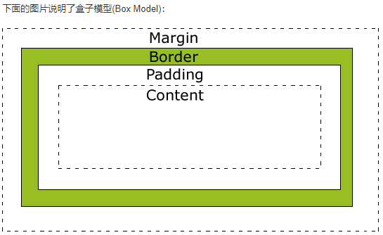
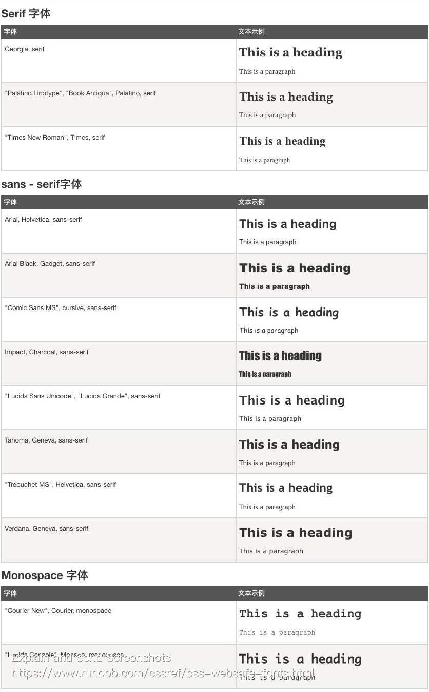

# CSS

1.  [CSS简介](#css简介)
2.  [CSS中的各种属性](#css中的各种属性)
3.  [示例](#示例)

## CSS简介

CSS是用来表现HTML或XML等文件样式的一种语言：

*   CSS指层叠样式表：Cascading Style Sheets。
*   样式定义如何显示HTML元素。
*   样式通常存储在样式表中。
*   把样式添加到HTML 4.0中，是为了解决内容与表现分离的问题。
*   外部样式表可以极大提高工作效率。
*   外部样式表通常存储在CSS文件中。
*   多个样式定义可层叠为一个。

CSS规则：

*   选择器（selector）指需要改变样式的HTML元素。
*   每条声明由一个属性和一个值组成。
*   属性（property）指希望设置的样式属性（style attribute）。每个属性有一个值。属性和值被冒号分开。

```css
selector { property: value; property: value; ... }
```

CSS注释：

```css
/* 注释内容 */
```

CSS选择器：元素选择器，选择器分组，类选择器，ID选择器，属性选择器，后代选择器，子元素选择器，相邻兄弟选择器。

```css
/* 元素选择器 */
html { color: black; }
h1 { font-family: sans-serif; }

/* 选择器分组 */
h1, h2, h3, h4, h5, h6 {
  color: gray;
  background: white;
  padding: 10px;
  border: 1px solid black;
  font-family: Verdana;
}

/**
 * 类选择器，class
 * <p class="important"></p>
 * <h1 class="important"></h1>
 */
.important { color: red; }
h1.important { color: red; }

/**
 * 多类选择器 
 * <p class="important warning"></p>
 */
.important.warning { background: silver; }

/** 
 * ID选择器，id
 * <p id="intro"></p>
 */
#intro { font-weight: bold; }

/** 
 * 属性选择器
 * <h2 title="Hello">Hello</h2>
 * <a href="https://w3school.com.cn">W3School</a>
 * <a href="https://baidu.com" title="baidu">Baidu</a>
 * <input type="text" name="fname" value="Peter" size="20">
 * <input type="button" value="Example Button">
 */
[title] { color: red; }
a[href] { color: blue; }
a[href="https://baidu.com"][title="baidu"] { color: yellow; }
input[type="text"] { width: 150px; display: block; margin-bottom: 10px; background-color: yellow; }
input[type="button"] { width: 120px; margin-left: 35px; display: block; }

/**
 * 后代选择器
 * <p>This is a <em>important</em> paragraph.</p>
 */
p em { color: red; }

/**
 * 子元素选择器
 * <h1>This is <strong>very</strong> <strong>very</strong> important.</h1>
 */
h1 > strong { color: red; }

/**
 * 相邻兄弟选择器：选择紧接在另一个元素后的元素，且二者有相同父元素
 * <h1>This is a heading.</h1>
 * <p>This is paragraph.</p>
 */
h1 + p { margin-top: 50px; }

/**
 * 后续兄弟选择器：选取所有指定元素之后的相邻兄弟元素 
 * <h1>This is a heading.</h1>
 * <p>This is paragraph.</p>
 * <p>This is paragraph.</p>
 */
h1 ~ p { background-color: yellow; }
```

CSS创建：

*   外部样式表（External Style Sheet）：

    ```html
    <head>
      <link rel="stylesheet" href="mystyle.css">
    </head>
    ```

*   内部样式表（Internal Style Sheet）：

    ```html
    <head>
      <style>
        p { margin-left: 20px; }
        body { background-image: url("images/back.gif"); }
      </style>
    </head>
    ```

*   内联样式（Inline Style）：

    ```html
    <p style="color: sienna; margin-left: 20px"></p>
    ```

*   多重样式优先级：内联样式 > 内部样式 > 外部样式 > 浏览器默认样式。

CSS中颜色定义：

*   十六进制：`#ff00ff`。
*   RGB：`rgb(255, 0, 255)`。
*   颜色名称：`red`。

盒子模型（Box Model）：

*   Margin（外边距或边距）：清除边框外的区域，外边框是透明的。
*   Border（边框）：围绕在内边距和内容外的边框。
*   Padding（内边距或填充）：清除内容周围的区域，内边距是透明的。
*   Content（内容）：盒子的内容，显示文本和图像。
*   

伪类：用于已有元素处于某种状态时为其添加对应的样式，这个状态是根据用户行为而动态变化的。

*   语法：
    *   selector: pseudo-class { property: value; }
    *   selector.class: pseudo-class { property: value; }

```css
/* anchor 伪类 */
a:link { color: #FF0000; }
a:visited { color: #00FF00; }
a:hover { color: #FF00FF; }
a:active { color: #0000FF; }

/**
 * 伪类和 CSS 类
 * <a class="red" href="css-syntax.html">CSS 语法</a>
 */
a.red:visited { color: #ff0000; }

/* first-child */
p:first-child { /* 匹配任何元素的第一个为 <p> 的子元素 */
  color: blue;
}

p > i:first-child { /* 匹配所有 <p> 元素下的第一个 <i> 元素 */
  color: blue;
}

p:first-child i { /* 匹配任何元素的第一个为 <p> 的子元素下的所有 <i> 元素 */
  color: blue;
}

/* lang */
q:lang(no) {
  quotes: "~" "~";
}
```

伪元素：用于创建一些不在DOM树中的元素，并为其添加样式。

*   语法：
    *   selector: pseudo-element { property: value; }
    *   selector.class: pseudo-element { property: value; }

```css
/* first-line */
p:first-line {
  color: #ff0000;
  font-variant: small-caps;
}

/* first-letter */
p:first-letter {
  color: #ff0000;
  font-size: xx-large;
}

/**
 * 伪元素和 CSS 类
 * <p class="article">文章段落</p>
 */
p.article:first-letter {
  color: #ff0000;
}

/* before */
h1:before { content: url(smiley.gif); }

/* after  */
h1:after { content: url(smiley.gif); }
```

媒体类型：允许你指定文件将如何在不同媒体呈现。该文件可以以不同的方式显示在屏幕上，在纸张上，或听觉浏览器等等。

```css
/**
 * all      所有媒体设备
 * handheld 手持设备
 * print    打印机
 * screen   电脑显示屏
 * tv       电视机类型的设备
 */
@media screen {
  p {
    font-family: verdana, sans-serif;
    font-size: 14px;
  }
}

@media print {
  p {
    font-family: times, serif;
    font-size: 10px;
  }
}

@media screen, print {
  p {
    font-weight: bold;
  }
}
```

`!important`：

*   CSS中的!important规则用来增加样式的权重。
*   使用!important是一个坏习惯，应该尽量避免，因为这破坏了样式表中固有的级联规则，使得调试找bug变得更加困难了。

## CSS中的各种属性

背景（Background）：

| Property         | Name                |
| ---------------- | ------------------- |
| 背景颜色         | background-color    |
| 背景图像         | background-image    |
| 背景重复属性     | background-repeat   |
| 背景图片大小     | background-size     |
| 背景位置属性     | background-position |
| 背景原点位置属性 | background-origin   |
| 背景裁剪属性     | background-clip     |

```css
/* background */
body {
  background-color: #b0c4de;
  background-image: url("paper.jpg");
  background-repeat: repeat;
  background-position: right top;
}

body { background: #ffffff url('img_tree.png') no-repeat right top; }

div {
  background-image: url(img_flwr.gif), url(paper.gif);
  background-position: right bottom, left top;
  background-repeat: no-repeat, repeat;
}
```

文本（Text）：

| Property | Name            |
| -------- | --------------- |
| 文本颜色 | color           |
| 文本对齐 | text-align      |
| 文本修饰 | text-decoration |
| 文本转换 | text-transform  |
| 文本缩进 | text-indent     |
| 文本阴影 | text-shadow     |
| 文本换行 | word-wrap       |

```css
/* text */
p {
  color: red;
  text-align: justify;
  text-decoration: underline;
  text-transform: uppercase;
  text-indent: 50px;
}
```

字体（Font）：

| Property     | Name        |
| ------------ | ----------- |
| 设置字体类型 | font-family |
| 字体样式     | font-style  |
| 字体大小     | font-size   |
| 字体宽度     | font-weight |

```css
/* font */
p {
  font-family: "Times New Roman", Times, serif;
  font-style: italic;
  font-size: 14px;    /* 1em=16px */
  font-weight: normal;
}
```

链接（Link）：

| Property     | Name                       |
| ------------ | -------------------------- |
| 链接文本颜色 | color(for link)            |
| 链接文本修饰 | text-decoration(for link)  |
| 链接背景颜色 | background-color(for link) |

```css
/* link */
a:link { /* 未访问链接 */
  color: #000000;
  text-decoration: none;
  background-color: #b2ff99;
}

a:visited { /* 已访问链接 */
  color: #00ff00;
  text-decoration: none;
  background-color: #ffff85;
}

a:hover { /* 鼠标移动到链接上 */
  color: #ff00ff;
  text-decoration: underline;
  background-color: #ff704d;
}

a:active { /* 鼠标点击时 */
  color: #0000ff;
  text-decoration: underline;
  background-color: #ff704d;
}
```

列表（List）：

| Property       | Name             |
| -------------- | ---------------- |
| 列表项标记类型 | list-style-type  |
| 列表项标记图像 | list-style-image |

```css
/* list */
ol.a {
  list-style-type: upper-roman;
}

ol.b {
  list-style-type: lower-alpha;
}

ul {
  list-style-image: url("sqpurple.gif");
}
```

表格（Table）：

| Property         | Name             |
| ---------------- | ---------------- |
| 表格边框         | border           |
| 表格边框折叠     | border-collapse  |
| 表格宽度和高度   | width height     |
| 表格文字水平对齐 | text-align       |
| 表格文字垂直对齐 | vertical-align   |
| 表格填充         | padding          |
| 表格颜色         | background-color |

```css
/* table */
table {
  border-collapse: collapse;
  width: 100%;
}

table, th, td {
  border: 1px solid black;
}

th {
  height: 50px;
  color: white;
  background-color: green;
}

td {
  text-align: right;
  vertical-align: bottom;
  padding: 15px;
}
```

Box Model：

| Property | Name    |
| -------- | ------- |
| 边距     | margin  |
| 边框     | border  |
| 填充     | padding |

```css
/* box model */
div {
  width: 220px;
  padding: 10px;
  border: 5px solid gray;
  margin: 0;
}
```

边框（Border）：

| Property | Name          |
| -------- | ------------- |
| 边框样式 | border-style  |
| 边框宽度 | border-width  |
| 边框颜色 | border-color  |
| 边框圆角 | border-radius |
| 盒阴影   | box-shadow    |
| 边界图片 | border-image  |

```css
/* border */
p {
  border-style: solid;
  border-width: 3px;
  border-color: red;
}

p {
  border-top-style: dotted;
  border-right-style: solid;
  border-bottom-style: dotted;
  border-left-style: solid;
}

p {
  border: 5px solid red;
}
```

轮廓（Outline）：

| Property | Name          |
| -------- | ------------- |
| 轮廓样式 | outline-style |
| 轮廓颜色 | outline-color |
| 轮廓宽度 | outline-width |

```css
/* outline */
p {
  border: 1px solid blue;
  outline-style: solid;
  outline-color: #ff00ff;
  outline-width: thin;
}

p {
  border: 1px solid red;
  outline: green dotted thick;
}
```

尺寸（Dimension）：

| Property     | Name       |
| ------------ | ---------- |
| 元素高度     | height     |
| 元素宽度     | width      |
| 元素最大高度 | max-height |
| 元素最大宽度 | max-width  |
| 元素最小高度 | min-height |
| 元素最小宽度 | min-width  |

```css
/* dimension */
p {
  height: 100px;
  width: 100px;
}
```

显示（Display）：

| Property | Name       |
| -------- | ---------- |
| 显示     | display    |
| 可见性   | visibility |

```css
/* display */
div {
  display: block;   /* 表现为一个块级元素（一般情况下独占一行） */
  display: inline;  /* 表现为一个内联元素（一般情况下不独占一行） */
  display: inline-block; /* 表现为一个内联块元素，既可以和其他行内元素并排，又可以设置长宽 */
  display: none;    /* 元素不可见，并且不为其保留相应的位置 */
}

/* display: flex */
.flex-container {
  display: flex;
  flex-direction: row; /* 设置主轴方向为水平 */
  justify-content: center; /* 居中对齐主轴上的项目 */
  align-items: center; /* 居中对齐交叉轴上的项目 */
}
.flex-item {
  flex: 1;  /* 定义项目的占比，这里设置为相等占比 */
}

/* display: grid */
.grid-container {
  display: grid;
  grid-template-columns: repeat(3, 1fr); /* 定义三列，每列平均分配剩余空间 */
  grid-gap: 10px; /* 设置列与列之间的间距 */
}
.grid-item {
  grid-column: span 1; /* 定义项目的跨列数量为 1 */
  grid-row: span 2; /* 定义项目的跨行数量为 2 */
}

/* display: table */
.table {
  display: table;
  width: 100%; /* 设置表格宽度为100% */
}
.table-row {
  display: table-row;
}
.table-cell {
  display: table-cell;
  padding: 10px; /* 设置单元格内边距 */
}

/* visibility */
div {
  visibility: visible; /* 元素可见，默认值 */
  visibility: hidden;  /* 元素不可见，但仍然为其保留相应的空间 */
  visibility: inherit; /* 继承上级元素的 visibility 的值 */
}
```

定位（Position）：

```css
/* position */
p {
  position: static;    /* 元素默认值，即没有定位，遵循正常的文档流对象 */
}

p {
  position: fixed;     /* 元素的位置相对于浏览器窗口是固定位置 */
  top: 30px;
  right: 5px;
}

p {
  position: relative;  /* 相对定位，相对于其正常位置 */
  left: 20px;
}

p {
  position: absolute;  /* 绝对定位，相对于父元素的定位 */
  left: 100px;
  top: 150px;
}

p {
  position: sticky;    /* 粘性定位，依赖用户的滚动，在 relative 和 fixed 之间切换 */
  position: -webkit-sticky;
  top: 0;
  background-color: green;
  border: 2px solid #4caf50;
}

img {
  position: absolute;
  left: 0px;
  top: 0px;
  z-index: -1;  /* z 轴 */
}
```

溢出（Overflow）：

```css
/* overflow */
div {
  background-color: #eee;
  width: 200px;
  height: 50px;
  border: 1px dotted black;
  overflow: visible; /* 默认值，内容不会被修剪，会呈现在元素框之外 */
  overflow: hidden;  /* 内容会被修剪，并且其余内容是不可见的 */
  overflow: scroll;  /* 内容会被修剪，但是浏览器会显示滚动条以便查看其余的内容 */
  overflow: auto;    /* 如果内容被修剪，则浏览器会显示滚动条以便查询其余的内容 */
  overflow: inherit; /* 规定应该从父元素继承 overflow 属性的值 */
}
```

浮动（Float）：

| Property | Name  |
| -------- | ----- |
| 浮动     | float |
| 清除浮动 | clear |

```css
/* float */
.object_need_float {
  float: left;
  width: 110px;
  height: 90px;
  margin: 5px;
}

.object_clear_float {
  clear: both;
  margin-bottom: 2px;
}
```

对齐（Alignment）：

```css
/* alignment */
.center { /* 元素居中对齐 */
  margin: auto;
  width: 50%;
  border: 3px solid green;
  padding: 10px;
}

.center { /* 文本居中对齐 */
  text-align: center;
  border: 3px solid green;
}

img {     /* 图片居中对齐 */
  display: block;
  margin: auto;
  width: 40%;
}

.right {  /* 左右对齐 - 使用定位方式 */
  position: absolute;
  right: 0px;
  width: 300px;
  border: 3px solid #73ad41;
  padding: 10px;
}

.right {  /* 左右对齐 - 使用 float 方式 */
  float: right;
  width: 300px;
  border: 3px solid #73ad41;
  padding: 10px;
}

.center { /* 垂直居中对齐 - 使用 padding */
  padding: 70px 0;
  border: 3px solid green;
}

.center { /* 水平垂直居中 */
  padding: 70px 0;
  border: 3px solid green;
  text-align: center;
}
```

转换（Transform）：

```css
/* transform */
div {
  transform: translate(50px, 100px);         /* 沿 X 轴和 Y 轴平移 */
  -ms-transform: translate(50px, 100px);     /* IE 9 */
  -webkit-transform: translate(50px, 100px); /* Safari and Chrome */
}

div {
  transform: rotate(30deg);         /* 旋转 */
  -ms-transform: rotate(30deg);     /* IE 9 */
  -webkit-transform: rotate(30deg); /* Safari and Chrome */
}

div {
  transform: scale(2, 3);         /* 比例缩放 scale(w, h) */
  -ms-transform: scale(2, 3);      /* IE 9 */
  -webkit-transform: scale(2, 3); /* Safari */
}

div {
  transform: skew(30deg, 20deg);         /* 倾斜 */
  -ms-transform: skew(30deg, 20deg);     /* IE 9 */
  -webkit-transform: skew(30deg, 20deg); /* Safari and Chrome */
}

div {
  transform: matrix(0.866, 0.5, -0.5, 0.866, 0, 0);         /* 没看懂 */
  -ms-transform: matrix(0.866, 0.5, -0.5, 0.866, 0, 0);     /* IE 9 */
  -webkit-transform: matrix(0.866, 0.5, -0.5, 0.866, 0, 0); /* Safari and Chrome */
}

div {
  transform: rotateX(120deg);         /* 沿 X 轴旋转 */
  -webkit-transform: rotateX(120deg); /* Safari 与 Chrome */
}

div {
  transform: rotateY(130deg);         /* 沿 Y 轴旋转 */
  -webkit-transform: rotateY(130deg); /* Safari 与 Chrome */
}
```

过渡（Transition）：

```css
/* transition */
div {
  width: 100px;
  height: 100px;
  background: red;
  transition: width 2s;
  -webkit-transition: width 2s; /* Safari */
}

div:hover {
  width: 300px;
}
```

动画（Animation）：

```css
/* animation */
div {
  width: 100px;
  height: 100px;
  background: red;
  animation: myfirst 5s;
  -webkit-animation: myfirst 5s; /* Safari and Chrome */
}

@keyframes myfirst {
  from { background: red; }
  to { background: yellow; }
}

@-webkit-keyframes myfirst { /* Safari and Chrome */
  from { background: red; }
  to { background: yellow; }
}
```

多列（Column）：

| Property     | Name              |
| ------------ | ----------------- |
| 列数         | column-count      |
| 列间隙       | column-gap        |
| 列间分割风格 | column-rule-style |
| 列间分割宽度 | column-rule-width |
| 列间分割颜色 | column-rule-color |
| 列宽         | column-width      |
| 跨越列       | column-span       |

Web Safe Fonts：



## 示例

导航栏：本质上是一个链接列表。

*   src: css-example/vertical-navigation-bar.html
*   src: css-example/horizontal-navigation-bar.html

下拉菜单：

*   src: css-example/dropdown-menu.html

提示工具栏：

*   src: css-example/tooltip.html

图片廊：

*   src: css-example/picture-gallery.html

透明：

*   src: css-example/opacity-example.html

表单：

*   src: css-example/css-form.html

计数器：通过一个变量来设置，根据规则递增变量。

*   src: css-example/css-counter.html

网页布局：

*   src: css-example/website-layout.html

渐变（Gradients）：可以让你在两个或多个指定的颜色之间显示平稳的过渡。

*   src: css-example/css-gradients.html

过渡：

*   src: css-example/css-transition.html

动画：

*   src: css-example/css-animation.html

多列：

*   src: css-example/css-column.html

用户界面：调整元素尺寸，框尺寸和外边框。

*   src: css-example/css-user-interface.html

图片：

*   src: css-example/css-image.html

按钮：

*   src: css-example/css-button.html

分页：

*   src: css-example/css-pagination.html

弹性盒子（Flex Box）：是一种当页面需要适应不同的屏幕大小以及设备类型时确保元素拥有恰当的行为的布局方式。

*   src: css-example/css-flex-box.html

多媒体查询：

*   src: css-example/css-multimedia-query.html

```css
/**
 * @media not|only mediatype and (expressions) {
 *   CSS 代码;
 * }
 * mediatype: all print screen speech
 */
@media screen and (max-width: 480px) {
    body {
        background-color: lightgreen;
    }
}

@media screen and (min-width: 600px) {
  div.example {
    display: none;
  }
}
```

网格布局：CSS提供了基于网格的布局系统，可以让我们更轻松地设计网页，而无需使用浮动和定位。

*   src: css-example/css-grid-layout.html
