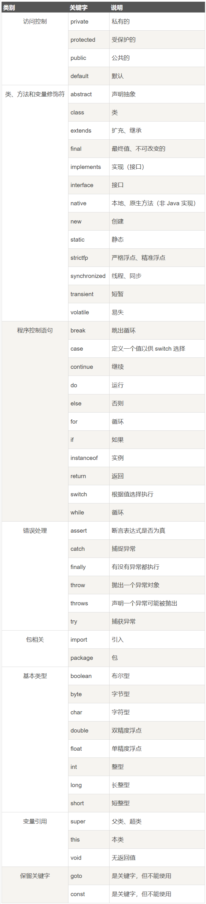
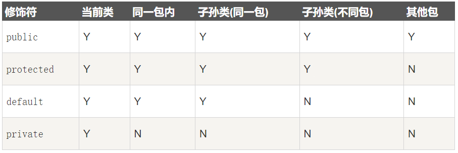
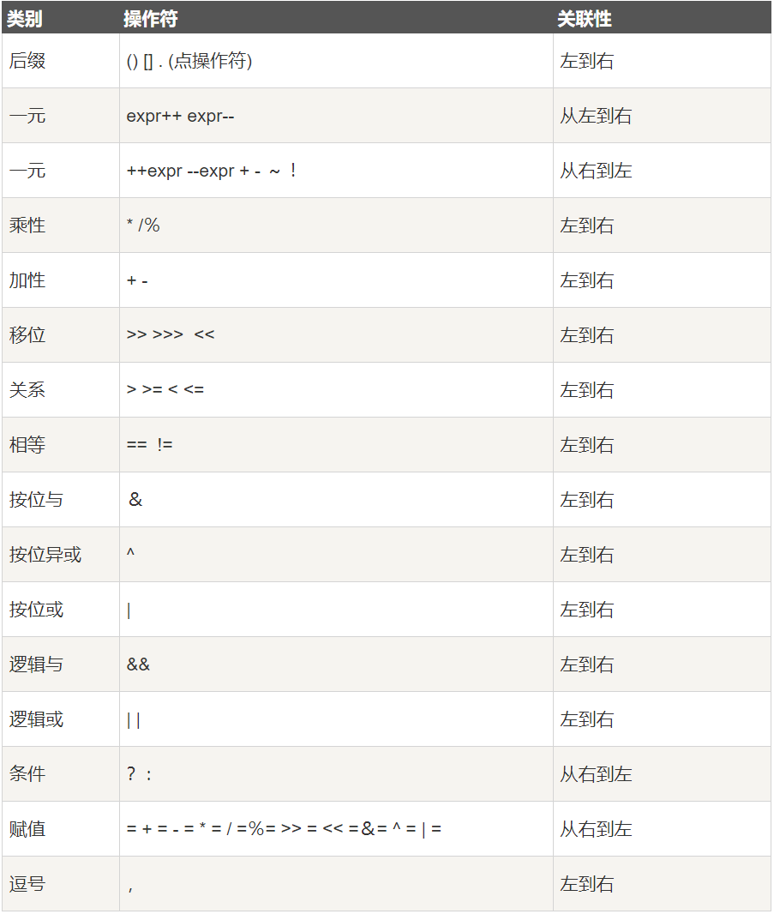

# Java

## Java简介

Java由Sun公司于1995年推出，是一门面向对象的编程语言。后来Sun公司被Oracle公司收购，Java也随之称为Oracle公司产品。

Java分为三个体系：

*   Java SE：Java SE是Java的标准版，包含了Java类库、Java虚拟机、Java工具和Java文档。
*   Java EE：Java EE是Java的企业版，包含了Java的Web开发技术、Java的分布式计算技术、Java的消息服务技术等。
*   Java ME：Java ME是Java的微型版，包含了Java的移动开发技术。

主要特性：

*   Java语言是简单的：
    *   Java语言的语法与C语言和C++语言很接近，使得大多数程序员很容易学习和使用。
    *   Java语言丢弃了C++中很少使用的、很难理解的、令人疑惑的那些特性，如操作符重载、多继承、自动的强制类型转换。特别的，Java语言不使用指针，而是引用。
    *   提供了自动分配和回收内存空间的机制，使得程序员不必为内存管理而担忧。
*   Java语言是面向对象的：
    *   提供了类、接口和继承等面向对象的特性。为了简单起见，只支持类之间的单继承，但支持接口之间的多继承，并支持类与接口之间的实现机制（`implements`）。
    *   Java语言全面支持动态绑定，而C++语言只对虚函数使用动态绑定。
*   Java语言是分布式的：
    *   Java语言支持Internet应用的开发，在基本的Java应用编程接口中有一个网络应用编程接口（java net），它提供了用于网络应用编程的类库。
    *   Java的RMI（远程方法激活）机制也是开发分布式应用的重要手段。
*   Java语言是健壮的：
    *   Java的强类型机制、异常处理、垃圾的自动收集等是Java程序健壮性的保证。
    *   对指针的丢弃是Java的明智选择。
*   Java语言是体系结构中立的：
    *   Java程序（后缀为java的文件）在Java平台上被编译为体系结构中立的字节码格式（后缀为class的文件），然后可以在实现这个Java平台的任何系统中运行。
    *   这种途径适合于异构的网络环境和软件的分发。
*   Java语言是可移植的：
    *   这种可移植性来源于体系结构中立性，另外，Java还严格规定了各个基本数据类型的长度。
    *   Java系统本身也具有很强的可移植性，Java编译器是用Java实现的，Java的运行环境是用ANSI C实现的。
*   Java语言是解释型的：
    *   Java程序在Java平台上被编译成字节码格式，然后可以在实现这个Java平台的任何系统中运行。
    *   在运行时，Java平台中的Java解释器对这些字节码进行解释执行，执行过程中需要的类在联结阶段被载入到运行环境中。
*   Java是高性能的：与那些解释型的高级脚本语言相比，Java的确是高性能的。事实上，Java的运行速度随着JIT（Just-In-Time）编译器基数的发展越来越接近于C++。

## Java基础

Java标识符：

*   所有的标识符都应该以字母、美元符号或下划线开头。
*   首字符之后可以是字母、数字、美元符号或下划线的任何字符组合。
*   关键字不能作用标识符。

Java关键字：



Java注释：单行注释（`//`）、多行注释（`/* */`）和文档注释（`/** */`）。

Java源程序和编译型源程序运行的区别：


Java数据类型：

*   内置数据类型：
    *   整型：byte（8位）、short（16位）、int（32位）、long（64位）。
    *   浮点型：float（32位）、double（64位）。
    *   字符型：char（16位，Unicode编码）。
    *   布尔型：boolean。

    ```java
    // 在 Java 中，默认导入的库是 java.lang 包

    public class PrimitiveType {
      public static void main(String[] args) {
        // byte b = 0;
        System.out.println("包装类：java.lang.Byte");
        System.out.println("基本类型：byte 二进制位数：" + Byte.SIZE);
        System.out.println("Byte.MIN_VALUE = " + Byte.MIN_VALUE);
        System.out.println("Byte.MAX_VALUE = " + Byte.MAX_VALUE);

        // short s = 0;
        System.out.println("包装类：java.lang.Short");
        System.out.println("基本类型：short 二进制位数：" + Short.SIZE);
        System.out.println("Short.MIN_VALUE = " + Short.MIN_VALUE);
        System.out.println("Short.MAX_VALUE = " + Short.MAX_VALUE);

        // int i = 0;
        System.out.println("包装类：java.lang.Integer");
        System.out.println("基本类型：int 二进制位数：" + Integer.SIZE);
        System.out.println("Integer.MIN_VALUE = " + Integer.MIN_VALUE);
        System.out.println("Integer.MAX_VALUE = " + Integer.MAX_VALUE);

        // long l = 0L;
        System.out.println("包装类：java.lang.Long");
        System.out.println("基本类型：long 二进制位数：" + Long.SIZE);
        System.out.println("Long.MIN_VALUE = " + Long.MIN_VALUE);
        System.out.println("Long.MAX_VALUE = " + Long.MAX_VALUE);

        // float f = 0.0F;
        System.out.println("包装类：java.lang.Float");
        System.out.println("基本类型：float 二进制位数：" + Float.SIZE);
        System.out.println("Float.MIN_VALUE = " + Float.MIN_VALUE);
        System.out.println("Float.MAX_VALUE = " + Float.MAX_VALUE);

        // double d = 0.0;
        System.out.println("包装类：java.lang.Double");
        System.out.println("基本类型：double 二进制位数：" + Double.SIZE);
        System.out.println("Double.MIN_VALUE = " + Double.MIN_VALUE);
        System.out.println("Double.MAX_VALUE = " + Double.MAX_VALUE);

        // char c = '\u0000';
        System.out.println("包装类：java.lang.Character");
        System.out.println("基本类型：char 二进制位数：" + Character.SIZE);
        System.out.println("Character.MIN_VALUE = " + (int)Character.MIN_VALUE);
        System.out.println("Character.MAX_VALUE = " + (int)Character.MAX_VALUE);

        // boolean flag = false;
        System.out.println("包装类：java.lang.Boolean");
      }
    }
    ```

*   引用类型：
    *   对象、数组都是引用数据类型。
    *   所有引用类型的默认值都是`null`。
    *   一个引用变量可以用来引用任何与之兼容的类型。
    *   例如：`Object obj = new Integer(10);`。

Java常量：

```java
final double PI = 3.1415926;
```

类型转换：

*   自动类型转换：
    *   整型、浮点型、字符型数据可以混合运算。运算中，不同类型的数据先转换为同一类型，然后进行运算，按照从低级到高级的顺序转换：`byte,short,char->int->long->float->double`。
    *   不能对`boolean`类型进行类型转换。
    *   不能把对象类型转换成不相关类的对象。
    *   在把容量大的类型转换为容量小的类型时必须使用强制类型转换。
*   强制类型转换：
    *   语法：`(type)value`。
    *   强制类型转换可能导致溢出或损失精度。
    *   注意：整型的默认类型是`int`，浮点型的默认类型是`double`。

Java声明变量的基本格式：`type identifier [= value][, identifier [= value] ...]`。

Java变量类型：

*   局部变量（`Local Variable`）：局部变量是在方法、构造函数或块内部声明的变量，它们在声明的方法、构造函数或块执行结束后被销毁。
*   实例变量（`Instance Variable`）：实例变量是在类中声明，但在方法、构造函数或块之外，它们属于类的实例，每个类的实例都有自己的副本，如果不明确初始化，实例变量会被赋予默认值（数值类型为`0`，布尔类型为`false`，引用类型为`null`）。
*   静态变量或类变量（`Class Variable`）：类变量是在类中用static关键字声明的变量，它们属于类而不是实例，所有该类的实例共享同一个副本，类变量在类加载时被初始化，而且只初始化一次。
*   参数变量（`Parameter Variable`）：参数变量是在方法或构造函数中的变量，用于接收调用该方法或构造函数时传递的值，参数变量的作用域只限于方法内部。
    *   值传递：在方法调用时，传递的是实际参数的值的副本。Java中的基本数据类型都采用值传递方式传递参数变量的值。
    *   引用传递：在方法调用时，传递的是实际参数的引用。Java中的对象类型采用引用传递方式传递参数变量的值。如果方法内部通过引用修改了对象的内部状态（比如修改了对象的某个字段），那么这个改变会影响到原始对象。但是如果方法内部让引用指向了一个新的对象，那么原始引用不会收到影响，因为它仍然指向原来的对象。

```java
public class Main {
  public int instanceVar;
  public static int staticVar;

  public void method(int parameterVar) {
    int localVar = 10;
    instanceVar = localVar;
    staticVar = parameterVar;

    System.out.println("成员变量：" + instanceVar);
    System.out.println("静态变量：" + staticVar);
    System.out.println("参数变量：" + parameterVar);
    System.out.println("局部变量：" + localVar);
  }

  public static void main(String[] args) {
    Main main = new Main();
    main.method(20);
  }
}
```

Java修饰符：

*   访问修饰符：使用访问修饰符来保护对类、变量、方法和构造方法的访问。
    *   `default`（即默认，什么也不写）：在同一包内可见，不使用任何修饰符。使用对象：类、接口、变量、方法。
    *   `private`：在同一类内可见。使用对象：变量、方法。注意：不能修饰类（内部类除外）。
    *   `protected`：对同一包内的类和所有子类可见。使用对象：变量、方法。注意：不能修饰类（内部类除外）。
    *   `public`：对所有类可见。使用对象：类、接口、变量、方法。
    *   访问权限：

        

    *   注意：如果没有指定访问修饰符，则默认使用`default`。
    *   访问控制和继承：
        *   父类中声明为`public`的方法在子类中也必须为`public`。
        *   父类中声明为`protected`的方法在子类中要么声明为`protected`，要么声明为`public`，不能声明为`private`。
        *   父类中声明为`private`的方法，不能被子类继承。
*   非访问修饰符：
    *   `static`：用来修饰静态方法和静态变量。

        ```java
        import java.util.ArrayList;

        public class InstanceCounter {
          private static int numInstances = 0;

          InstanceCounter() {
            InstanceCounter.addInstance();
          }

          private static void addInstance() {
            numInstances++;
          }

          protected static int getCount() {
            return numInstances;
          }

          public static void main(String[] args) {
            System.out.println("Starting with " + InstanceCounter.getCount() + " instances");

            ArrayList<InstanceCounter> arr = new ArrayList<>();
            for (int i = 0; i < 500; i++) {
              arr.add(new InstanceCounter());
            }

            System.out.println("Created " + InstanceCounter.getCount() + " instances");
          }
        }

        ```

    *   `final`：用来修饰类、方法和变量。
        *   `final`用于变量：它表示该变量的值一旦被初始化之后就不能在被改变。同时也有些许区别：`final`修饰基本数据类型时，那么其值不能改变；`final`修饰引用类型，那么这个引用被初始化指向一个对象，这个引用就不能再指向另一个对象，但是对象本身的状态可以被改变。
        *   `final`用于方法：它表示该方法不能在子类中被重写。主要用于防止子类修改父类的某些行为。
        *   `final`用于类：它表示该类不能被继承。主要确保类的安全，避免其设置被不当地扩展。

        ```java
        import java.util.ArrayList;

        class Parent {
          public final void show() {
            System.out.println("Parent show()");
          }
        }

        class Child extends Parent {
          // @Override
          // public void show() {  // 这会导致编译错误
          //   System.out.println("Child show()");
          // }
        }

        final class MyFinalClass {}

        // class MySubFinalClass extends MyFinalClass {}  // 这会导致编译错误

        public class Main {
          public static final double PI = 3.1415926;

          public static void main(String[] args) {
            final ArrayList<String> NAMES = new ArrayList<>();
            NAMES.add("Alice");
            NAMES.add("Bob");
            // NAMES = new ArrayList<>();  // 这会导致编译错误
          }
        }
        ```

    *   `abstract`：用来创建抽象类和抽象方法。
        *   `abstract`用于类：它表示该类不能实例化，声明抽象类的唯一目的是为了将来对该类进行扩展。抽象类可以包含抽象方法和非抽象方法，甚至抽象类可以不包含抽象方法。

            ```java
            abstract class Caravan {
              private double price;
              private String model;
              private String year;
              public abstract void goFast();
              public abstract void changeColor();
            }
            ```

        *   `abstract`用于方法：它表示该方法不能现在实现，必须由子类提供具体实现。如果一个类包含抽象方法，那么该类一定要声明为抽象类，否则编译器会报错。任何继承抽象类的子类必须实现父类的所有抽象方法，除非该子类也是抽象类。

            ```java
            abstract class SuperClass {
              abstract void method();
            }

            class SubClass extends SuperClass {
              void method() {}
            }
            ```

    *   `synchronized`：对象互斥锁，用来创建同步方法和同步块。

        ```java
        import java.util.ArrayList;

        public class Counter {
          private static int count = 0;

          public static synchronized void increment() {
            count++;
          }

          public static synchronized int getCount() {
            return count;
          }

          public static void main(String[] args) {
            ArrayList<Thread> arr = new ArrayList<>();
            for (int i = 0; i < 10; i++) {
              Thread thread = new Thread(() -> {
                for (int j = 0; j < 1000; j++) {
                  Counter.increment();
                }
              });
              arr.add(thread);
              thread.start();
            }

            for (int i = 0; i < 10; i++) {
              try{
                arr.get(i).join();
              } catch (InterruptedException e) {
                Thread.currentThread().interrupt();
                System.err.println("Thread(" + i + ") interrupted: " + e.getMessage());
              }
            }

            System.out.println("All threads have completed running");
            System.out.println("Count: " + Counter.getCount());
          }
        }
        ```

    *   `volatile`：用来创建易变变量。确保多线程环境下变量的可见性和有序性，但它并不能保证原子性。

        ```java
        import java.time.Duration;
        import java.time.Instant;

        class MyRunnable implements Runnable {
          private volatile boolean running;

          @Override
          public void run() {
            running = true;
            while (running) {
              System.out.println("Thread is running...");
              try {
                Thread.sleep(1000);
              } catch (InterruptedException e) {
                e.printStackTrace();
              }
            }
            System.out.println("Thread is stopped");
          }

          public void stop() {
            running = false;
          }
        }

        public class Main {
          public static void main(String[] args) {
            MyRunnable mr = new MyRunnable();
            Thread thread = new Thread(mr);

            Instant start = Instant.now();
            try {
              thread.start();  // 线程会调用 run()
              Thread.sleep(5000);
              mr.stop();
              thread.join();
            } catch (InterruptedException e) {
              e.printStackTrace();
            }
            Instant end = Instant.now();
            Duration duration = Duration.between(start, end);

            System.out.println("Operation takes " + duration.toMillis() + " milliseconds");
          }
        }
        ```

    *   `transient`：用来创建非持久化变量。表示该变量不应在对象序列化时被序列化（保存）。

        ```java
        import java.io.FileInputStream;
        import java.io.FileOutputStream;
        import java.io.IOException;
        import java.io.ObjectInputStream;
        import java.io.ObjectOutputStream;
        import java.io.Serializable;

        public class User implements Serializable {
          // Java 序列化机制中用于标识类版本的一个固定名称的常量字段
          // 值的意义：2024 年 + 1 月 + 1 日 + 0001 版本
          private static final long serialVersionUID = 202401010001L;

          private String name;  // 将会被序列化
          private transient String password;  // 将不会被序列化

          public User(String name, String password) {
            this.name = name;
            this.password = password;
          }

          public String getName() {
            return name;
          }

          public void setName(String name) {
            this.name = name;
          }

          public String getPassword() {
            return password;
          }

          public void setPassword() {
            this.password = password;
          }

          public void serialize(String filePath) throws IOException {
            FileOutputStream fileOutput = new FileOutputStream(filePath);
            ObjectOutputStream output = new ObjectOutputStream(fileOutput);
            output.writeObject(this);
            output.close();
            fileOutput.close();
            System.out.printf("Serialized data is saved in %s%n", filePath);
          }

          public static User deserialize(String filePath) throws IOException, ClassNotFoundException {
            FileInputStream fileInput = new FileInputStream(filePath);
            ObjectInputStream input = new ObjectInputStream(fileInput);
            User user = (User)input.readObject();
            input.close();
            fileInput.close();
            return user;
          }

          public static void main(String[] args) {
            User user = new User("John Doe", "secretPassword");

            try {
              user.serialize("user.ser");
              User deserializedUser = deserialize("user.ser");
              System.out.println("Name: " + deserializedUser.getName());
              System.out.println("Password: " + deserializedUser.getPassword());
            } catch (IOException | ClassNotFoundException e) {
              e.printStackTrace();
            }
          }
        }
        ```

    *   `strictfp`：用来创建严格的浮点数运算。确保所有的浮点数运算都按照IEEE 754标准进行，不受平台或JVM实现的影响。在进行金融计算或高精度浮点运算的场合特别有用。

        ```java
        public class Main {
          public static strictfp void main(String[] args) {
            System.out.println(1.0F + 2.0F * 3.0F);
          }
        }
        ```

    *   `native`：用来创建本地方法。声明一个方法是在Java之外的某个地方实现，通常是使用C或C++编写的，并且这个方法通过Java的本地接口（Java Native Interface，JNI）与Java代码进行交互。
        *   编写Java代码：

            ```java
            // NativeMethod.java
            public class NativeMethod {
              public native void displayHelloFromC();

              static {
                System.loadLibrary("hello");
              }

              public static void main(String[] args) {
                new NativeMethod().displayHelloFromC();
              }
            }
            ```

        *   执行`javac NativeMethod.java -h .`生成class文件和头文件。
        *   编写C代码（注意函数名声明已经在自动生成的头文件中）：

            ```c
            // NativeMethod.c
            #include <jni.h>
            #include <stdio.h>
            #include "NativeMethod.h"

            JNIEXPORT void JNICALL Java_NativeMethod_displayHelloFromC
              (JNIEnv *, jobject) {
              printf("Hello from c!\n");
            }
            ```

        *   执行`gcc -shared -fPIC -o libhello.so -I${JAVA_HOME}/include -I${JAVA_HOME}/include/linux NativeMethod.c`生成共享库。
        *   运行`java -Djava.library.path=. NativeMethod`。

Java运算符：

*   算术运算符：`+`、`-`、`*`、`/`、`%`、`++`、`--`。
*   关系运算符：`==`、`!=`、`>`、`<`、`>=`、`<=`。
*   位运算符：`&`、`|`、`^`、`~`、`<<`、`>>`、`>>>`。

    ```java
    public class Main {
      public static void main(String[] args) {
        int a = 60;  // 二进制表示为 0000 .... 0000 0011 1100
        int b = 13;  // 二进制表示为 0000 .... 0000 0000 1101
        int c = -60;  // 二进制表示为 1111 .... 1111 1100 0100
        // byte，short 会隐式转换为 int，然后进行位运算
        System.out.println(a & b);  // 结果为 12，二进制表示为 0000 .... 0000 0000 1100
        System.out.println(a | b);  // 结果为 61，二进制表示为 0000 .... 0000 0011 1101
        System.out.println(a ^ b);  // 结果为 49，二进制表示为 0000 .... 0000 0011 0001
        System.out.println(~a);  // 结果为 -61，二进制表示为 1111 .... 1111 1100 0011
        System.out.println(a << 2);  // 结果为 240，二进制表示为 0000 .... 0000 1111 0000
        System.out.println(c >> 2);  // 结果为 -15，二进制表示为 1111 .... 1111 1111 0001
        System.out.println(c >>> 2);  // 结果为 1073741809，二进制表示为 0011 .... 1111 0011 0001
      }
    }
    ```

*   逻辑运算符：`&&`、`||`、`!`。
*   赋值运算符：`=`、`+=`、`-=`、`*=`、`/=`、`%=`、`&=`、`|=`、`^=`、`<<=`、`>>=`、`>>>=`。
*   其他运算符：`? :`、`instanceof`。

    ```java
    int max = (a > b) ? a : b;

    // instanceof 用来判断一个对象是否属于某个类或接口
    String name = "James";
    boolean isString = name instanceof String;
    ```

Java运算符优先级：



Java循环：

*   `for`循环：

    ```java
    for (initialization; condition; iteration) {
      // loop body
    }
    ```

*   `while`循环：

    ```java
    while (condition) {
      // loop body
    }
    ```

*   `do-while`循环：

    ```java
    do {
      // loop body
    } while (condition);
    ```

*   `for-each`循环：

    ```java
    for (Object element : iterable) {
      // loop body
    }
    ```

Java循环控制语句：`break`和`continue`。

Java判断：

*   `if`语句：

    ```java
    if (condition1) {
      // if block
    } else if (condition2) {
      // else if block
    } else {
      // else block
    }
    ```

*   `switch`语句：

```java
switch (expression) {
  case value1:
    // case block
    break;
  case value2:
    // case block
    break;
  default:
    // default block
    break;
}
```

Java数组：

*   定义数组：`type[] arrayName = new type[arraySize]`。
*   初始化数组：`type[] arrayName = {value1, value2, ..., valueN}`。
*   访问数组元素：`arrayName[index]`。
*   数组长度：`arrayName.length`。
*   `java.util.Arrays`提供了对数组的操作方法。

Java方法：

*   定义方法：

    ```java
    modifier returnType methodName(parameterType parameterName) {
      // method body
    }
    ```

*   方法重载：允许一个类中定义多个名称相同的方法，但是方法的参数必须不同。
*   命令行参数的使用：

    ```java
    public static void main(String[] args) {
      for (int i = 0; i < args.length; i++) {
        System.out.println("args[" + i + "]: " + args[i]);
      }
    }
    ```

*   构造方法：
    *   当一个对象被创建时，构造方法用来初始化对象。构造方法和它所在类的名字相同，但构造方法没有返回值。
    *   不管你是否自定义构造方法，所有的类都有构造方法，因为Java自动提供了一个默认构造方法，默认构造方法的访问修饰符和类的访问修饰符相同（类为`public`，构造函数也为`public`；类为`protected`，构造函数也为`protected`）。
    *   一旦你定义了自己的构造方法，默认构造方法就不会自动生成。
*   可变参数：一个方法只能指定一个可变参数，它必须是方法的最后一个参数。任何普通的参数都必须在可变参数之前。

    ```java
    public class Main {
      public static void print(String message, double... numbers) {
        if (numbers.length == 0) {
          System.out.println("No argument passed");
          return;
        }

        System.out.print(message + ": {");
        for (int i = 0; i < numbers.length - 1; i++) {
          System.out.print(numbers[i] + ", ");
        }
        System.out.print(numbers[numbers.length - 1] + "}");
      }

      public static void main(String[] args) {
        print("List", 1, 2, 3, 4, 5);
      }
    }
    ```

Java类：

*   类：定义对象的模板，包含属性、方法。
*   对象：类的实例，具有状态和行为。
*   变量：
    *   局部变量：在方法、构造方法或语句块中声明的变量。变量声明和初始化都在方法中，方法结束后，变量就会自动销毁。
    *   成员变量：定义在类中，方法体之外的变量。这种变量在创建对象的时候实例化。成员变量可以被类中方法、构造函数和特定类的语句块访问。
    *   类变量：类变量也声明在类中，方法体之外，但必须声明为static类型。
    *   注意：任何变量都应该在使用前进行初始化，否则会导致编译错误。当变量没有初始化时，默认值是`0`或`null`。
*   构造方法：
    *   每个类都有构造方法。如果没有显式地为类定义构造方法，Java编译器将会为该类提供一个默认构造方法。
    *   构造方法必须和类名相同，一个类可以有多个构造方法。
    *   在创建一个对象的时，至少要调用一个构造方法。
*   创建对象：`Class objectName = new Class()`。
*   源文件中定义类的规则：
    *   一个源文件中只能有一个公开类（`public class`）。
    *   一个源文件中可以有多个默认类（`class`）或私有类。
    *   源文件名应该和公开类的类名相同。
    *   如果一个类定义在某个包中，那么`package`语句应该在源文件的首行。
    *   如果源文件包含`import`语句，那么应该放在`package`语句和类定义之间。
*   Java继承：
    *   Java支持单继承、多重继承，但不支持多继承。
    *   子类拥有父类的非`private`属性和方法。
    *   子类可以重写父类的方法。
    *   子类可以拥有自己的属性和方法。
    *   可以使用`super`关键字来实现对父类成员的访问，而`this`关键字则用于访问本类成员。
    *   可以使用`final`关键字修饰变量、方法和类。修饰方法时，意味方法不能被重写；修饰类时，意味类不能被继承。
*   重写和重载：
    *   重写和重载是Java多态性的不同表现，重写是父类和子类之间的多态性的一种表现，重载是同一个类中方法的多态性的一种表现。
    *   重写（`Override`）：指子类定义了一个与其父类中具有相同名称、参数列表和返回类型的方法，并且子类方法的实现覆盖了父类方法的实现。
        *   重写的方法中参数列表必须与父类方法完全相同，包括顺序、类型、数量。
        *   重写的方法的返回类型可以与父类方法的返回类型相同，也可以不同（从Java7开始）。
        *   重写的方法的访问权限不能比父类方法的访问权限更低。
        *   声明为`final`的方法不能被重写。
        *   重写的方法能够抛出任何非检查型异常，无论被重写的方法是否抛出该异常。但是重写的方法不能抛出新的检查型异常，或更广泛的检查型异常。

        ```java
        class Animal {
          public void move() {
            System.out.println("An animal is moving");
          }
        }

        class Dog extends Animal {
          @Override
          public void move() {
            System.out.println("A dog is moving");
          }

          public void bark() {
            System.out.println("A dog is barking");
          }
        }

        public class Main {
          public static void main(String[] args) {
            Animal a = new Animal();
            Animal d = new Dog();

            a.move();
            d.move();
            // d 的引用类型为 Animal，没有 bark 方法
            // d.bark();
          }
        }
        ```

    *   重载（`Overload`）：在一个类中，方法名字相同，而参数不同。
        *   被重载的方法必须改写参数列表（参数个数或类型不同）。
        *   被重载的方法可以改变返回类型。
        *   被重载的方法可以改变修饰符。
        *   被重载的方法可以声明新的或更广的检查型异常。
        *   方法能够在同一个类中或者在一个子类中被重载。
        *   无法以返回值类型作为重载函数的区分标准。

        ```java
        public class Main {
          public static int max(int a, int b) {
            return a > b ? a : b;
          }

          public static String max(String a, String b) {
            int length1 = a.length(), length2 = b.length();
            int length = length1 < length2 ? length1 : length2;
            for (int i = 0; i < length; i++) {
              char x = a.charAt(i), y = b.charAt(i);
              if (x == y) continue;
              return x > y ? a : b;
            }
            return length1 > length2 ? a : b;
          }

          public static void main(String[] args) {
            System.out.println(max(10, 2));
            System.out.println(max("Hello world", "Hello World!"));
          }
        }
        ```

*   Java多态：
    *   多态：同一个行为具有多个不同表现形式或形态的能力。
    *   多态存在的三个必要条件：继承、重写、向上转型（父类引用指向子类对象）。
    *   多态实现的三种方式：重写，抽象类，接口。
    *   当使用多态调用方法时，首先检查父类中是否有该方法。如果没有，则编译错误；如果有，则调用子类同名方法。
    *   Java中没有虚函数的概念，它的普通函数相当于C++中的虚函数，动态绑定是Java的默认行为。

    ```java
    abstract class Animal {
      abstract void eat();
    }

    class Cat extends Animal {
      @Override
      public void eat() {
        System.out.println("Eat fish");
      }

      public void work() {
        System.out.println("Catch mouse");
      }
    }

    class Dog extends Animal {
      @Override
      public void eat() {
        System.out.println("Eat bones");
      }

      public void work() {
        System.out.println("Look after the house");
      }
    }

    public class Main {
      public static void show(Animal a) {
        a.eat();
        if (a instanceof Cat) {
          Cat c = (Cat)a;  // 向下转型
          c.work();
        } else if (a instanceof Dog) {
          Dog d = (Dog)a;  // 向下转型
          d.work();
        }
      }

      public static void main(String[] args) {
        Animal a = new Cat();  // 向上转型
        Animal b = new Dog();  // 向上转型

        show(a);
        show(b);
      }
    }
    ```

*   抽象类：
    *   在面向对象的概念中，所有的对象都是通过类来描述的，但是反过来，并不是所有的类都是用来描绘对象的，如果一个类中没有包含足够的信息来描绘一个具体的对象，这样的类就是抽象类。
    *   抽象类除了不能实例化对象外，其他功能依然存在，成员变量、成员方法和构造方法的访问方式和普通类一样。
    *   由于抽象类不能实例化对象，所以抽象类必须被继承，才能被使用。
    *   抽象方法：
        *   设计一个类，该类包含一个特别的成员方法，该方法的具体实现由它的子类确定，那么你可以在父类中声明该方法为抽象方法。
        *   声明抽象方法需要注意：
            *   如果一个类包含抽象方法，那么该类必须是抽象类。
            *   抽象方法不能有其它的访问修饰符，只能是公共的。
            *   构造方法，类方法（用`static`修饰的方法）不能声明为抽象方法。
            *   抽象类中的抽象方法只能声明，不包含具体实现。
            *   任何子类必须重写父类的抽象方法，或者声明自身为抽象类。

        ```java
        public abstract class Employee {
          private int id;
          private String name;
          private String address;

          public abstract double computePay();
        }
        ```

    *   抽象类的总结：
        *   抽象类不能被实例化，只有抽象类的非抽象子类可以创建对象。
        *   抽象类不一定包含抽象方法，但是有抽象方法的类必定是抽象类。

    ```java
    // Employee.java
    public abstract class Employee {
      private int id;
      private String name;
      private String address;

      public Employee(int id, String name, String address) {
        this.id = id;
        this.name = name;
        this.address = address;
      }

      public int getId() {
        return id;
      }

      public String getName() {
        return name;
      }

      public String getAddress() {
        return address;
      }

      public void setAddress(String address) {
        this.address = address;
      }

      public void mailCheck() {
        System.out.println("Mailing a check to " + this.name + "(" + this.address + ")");
      }

      @Override
      public String toString() {
        return id + " " + name + " " + address;
      }
    }

    // Salary.java
    public class Salary extends Employee {

      private double salary;

      public Salary(int id, String name, String address, double salary) {
        super(id, name, address);
        this.salary = salary;
      }

      public double getSalary() {
        return salary;
      }

      public void setSalary(double salary) {
        if (salary >= 0.0) {
          this.salary = salary;
        }
      }

      @Override
      public void mailCheck() {
        System.out.println(
            "Mailing a check to " + getName() + "(" + getAddress() + ") with salary " + salary);
      }

      public double computePay() {
        System.out.println("Computing salary pay for " + getName());
        return salary / 52;
      }

      public static void main(String[] args) {
        Employee e = new Salary(1001, "John Adams", "Boston, MA", 3600.0);
        Salary s = new Salary(1002, "Mohd Mohtashim", "Ambehta, UP", 2400.0);

        e.mailCheck();
        s.mailCheck();
      }
    }
    ```

*   类的示例：

    ```java
    // Box.java
    public class Box {
      private String name;
      private double length;
      private double breadth;
      private double height;

      public Box() {
        this.name = "Box";
        this.length = this.breadth = this.height = 0.0;
      }

      public Box(String name, double length, double breadth, double height) {
        this.name = name;
        this.length = length;
        this.breadth = breadth;
        this.height = height;
      }

      public void setBox(double length, double breadth, double height) {
        this.length = length;
        this.breadth = breadth;
        this.height = height;
      }

      public String getName() {
        return name;
      }

      public double getVolume() {
        return length * breadth * height;
      }

      public static void main(String[] args) {
        Box box = new Box("Box", 1.0, 2.0, 3.0);
        System.out.println(box.getName() + ": " + box.getVolume());
        box.setBox(5.0, 6.0, 7.0);
        System.out.println(box.getName() + ": " + box.getVolume());
      }
    }

    // ColoredBox.java
    public class ColoredBox extends Box {
      private String color;

      public ColoredBox() {
        // 无参构造函数自动调用父类的无参构造函数
        this.color = "";
      }

      public ColoredBox(String name, double length, double breadth, double height, String color) {
        super(name, length, breadth, height);
        this.color = color;
      }

      public String getColor() {
        return color;
      }

      public void setColor(String color) {
        this.color = color;
      }

      public void print() {  // Java 中没有友元函数的概念
        System.out.println("Name: " + getName() + ", Color: " + color);
      }

      public static void main(String[] args) {
        ColoredBox cbox = new ColoredBox("RedBox", 8.0, 9.0, 10.0, "Red");
        System.out.println(cbox.getName() + ": " + cbox.getVolume() + ", " + cbox.getColor());
        cbox.print();
      }
    }
    ```

Java接口：

*   接口：Java编程语言中的一个抽象概念，是抽象方法的集合，不能包含属性。
*   接口与类的相似点：
    *   接口文件保存在`.java`结尾的文件中，文件名使用接口名。
    *   接口的字节码文件保存在`.class`结尾的文件中。
    *   接口相应的字节码文件必须在与包名称相匹配的目录结构中。
    *   一个接口可以有多个方法。
*   接口与类的区别：
    *   接口不能用来实例化对象，只能被其他类实现。
    *   接口不能被类继承，只能被类实现。
    *   接口支持多继承。
    *   接口不能包含成员变量，只能包含`public static final`常量。
    *   接口没有构造方法。
    *   接口中所有方法必须是抽象方法，Java8之后接口中可以使用`default`关键字修饰的非抽象方法。
*   接口特性：
    *   接口中每一个方法都是隐式抽象的，接口中的方法会被隐式的指定为`public abstract`（其他修饰符会报错）。
    *   接口中可以含有变量，但是接口中的变量会被隐式的指定为`public static final`变量（其他修饰符会报错）。
    *   接口中的方法是不能在接口中实现的，只能由实现接口的类来实现接口中的方法。
*   接口与抽象类的区别：
    *   抽象类中的方法可以有方法体，就是能实现方法的具体功能，但是接口中的方法不行。
    *   抽象类中的成员变量可以是各种类型，而接口中的成员变量只能是`public static final`类型。
    *   接口中不能含有静态代码块或静态方法，而抽象类是可以有静态代码块和静态方法。
    *   一个类只能继承一个抽象类，而一个类却可以实现多个接口。
*   特别注意：
    *   Java8之后，接口里可以有静态方法。
    *   Java8之后，接口允许包含具体实现的方法，该方法称为默认方法。默认方法使用default修饰。
    *   Java9之后，允许将方法定义为`private`，使得某些复用的代码不会把方法暴露出去。

    ```java
    public interface Vehicle {
      private void doSomething() {
        System.out.println("Doing something");
      }

      static void blowHorn() {
        System.out.println("Blowing horn");
      }

      default void print() {
        System.out.println("I am a vehicle");
      }
    }
    ```

*   接口的示例：

    ```java
    // MyInterface.java
    // 接口默认为 public abstract，其中 abstract 不用声明
    public interface MyInterface {
      // 默认为 public static final 变量，不用声明
      int DEFAULT_VALUE = 10;
      String CONSTANT_STRING = "Hello, World!";
      
      // 默认为 public abstract 方法，不用声明
      void doSomething();
    }

    // MyClass.java
    public class MyClass implements MyInterface {
      @Override
      public void doSomething() {
        System.out.println("Doing something");
      }
    }
    ```

*   接口的继承：一个接口能继承另一个接口，和类之间的继承方式比较类似。接口的继承使用`extends`关键字，继承多个接口需要用逗号分隔（允许接口的多继承）。
*   标记接口：没有任何方法和属性的接口，它仅仅表明实现它的类属于一个特定的类型。也就是给某个类型盖个章，使得对象拥有某个或某些特权。

    ```java
    // 例如 EventListener 接口
    package java.util;

    public interface EventListener {
    }
    ```

Java枚举：

*   枚举是一种特殊的类，它提供了一种更加方便的创建和使用常量的方式。
*   枚举和普通类一样可以有自己的变量、方法和构造方法。构造函数只能使用`private`修饰符，所以外部无法调用。
*   enum定义的枚举类默认继承了`java.lang.Enum`类，并实现了`java.lang.Serializable`和`java.lang.Comparable`两个接口。其中`values()`、`ordinal()`和`valueOf()`方法位于`java.lang.Enum`类中。

```java
// Color.java
public enum Color {
  RED, GREEN, BLUE;

  private Color() {
    System.out.println("Constructor called for: " + this.toString());
  }

  public void colorInfo() {
    System.out.println("Universal Color");
  }
}


// 上面的代码等价于
// public class Color {
//   public static final Color RED = new Color();
//   public static final Color GREEN = new Color();
//   public static final Color BLUE = new Color();
// }

// 使用枚举
public class Main {
  public static void main(String[] args) {
    Color blue = Color.BLUE;
    switch (blue) {
      case RED:  // 这里不能写成 case Color.RED:
        System.out.println("红色");
        break;
      case GREEN:
        System.out.println("绿色");
        break;
      case BLUE:
        System.out.println("蓝色");
        break;
    }

    for (Color color : Color.values()) {  // values() 方法返回 Color 数组
      System.out.println(color + " at index " + color.ordinal());  // 返回枚举值的序号
    }

    // 使用 valueOf() 方法获取枚举值，不存在的枚举值会抛出 IllegalArgumentException
    Color color = Color.valueOf("RED");
    System.out.println(color);
  }
}
```

Java异常处理：

*   Java中所有异常基于`Throwable`类，分为`Error`和`Exception`。
    *   `Error`：指Java处理器无法处理的严重错误，如内存溢出、虚拟机错误等。
    *   `Exception`：指程序运行过程中发生的一般性错误，如空指针异常、数组越界异常等。它又分为检查型异常和非检查型异常。
*   
*   异常处理的示例：

    ```java
    try {
      // 可能产生异常的代码
    } catch (ExceptionType1 e1) {
      // 处理 ExceptionType1 类型的异常
      // 例如 e1.printStackTrace();
    } catch (ExceptionType2 e2) {
      // 处理 ExceptionType2 类型的异常
      // 例如 throw new ExceptionType3();
    } finally {
      // 无论是否产生异常，都会执行，通常用于释放资源
    }
    ```

*   使用`throws`关键字声明可能会抛出的异常：

    ```java
    public void method() throws ExceptionType1, ExceptionType2 {
      // 可能产生异常的代码
    }
    ```

*   使用JDK7引入的`try-with-resources`语句自动关闭资源：

    ```java
    try (InputStream in = new FileInputStream("file.txt");
        OutputStream out = new FileOutputStream("file.txt")) {
      // 可能产生异常的代码
    } catch (IOException e) {
      // 处理 IOException 类型的异常
    }
    ```

*   自定义异常类：

    ```java
    public class MyException extends Exception {
      public MyException(String message) {
        super(message);
      }
    }
    ```

Java包：

*   Java使用包机制是为了防止命名冲突，访问控制，提供搜索和定位类（`class`），接口（`interface`），枚举（`enum`）和注解（`annotation`）等。
*   包的作用：
    *   把功能相似或相关的类或接口组织再同一个包中，方便类的查找和使用。
    *   如同文件夹一样，包也采用了树形目录的存储方式。同一个包中的类名字是不同的，不同的包中的类名字可以相同。当同时调用两个不同包中相同类名的类时，应该加上包名加以区别，避免名字冲突。
    *   包也限定了访问权限，拥有包访问权限的类才能访问某个包中的类。

```java
// 包的声明
package package1[.package2[.package3[...]];

// 导入包
import package1[.package2[.package3[...]].(ClassName|*);
```

Java反射：一个强大的特性，它允许程序在运行时查询、访问和修改类、接口、字段和方法的信息。反射提供的动态地操作类的能力，在很多框架和库中被广泛使用，例如Spring框架的依赖注入。

## Java标准库

Java标准库包含了许多常用的类和接口，可以帮助我们快速开发应用。

*   `java.lang`：包含了Java语言的核心类和接口，这些类为Java程序的开发提供了基础支持。这个包中包含的类和接口，涉及基本类型包装、字符串操作、异常处理、反射、线程管理、数学运算、运行环境（输出）等。默认情况下，所有的Java程序都会自动导入这个包。
*   `java.util`：包含了许多实用类，特别是与数据结构、集合框架、线程管理、日期时间处理、随机数生成、输入、正则表达式等相关的类和接口。
*   `java.io`：用来处理输入和输出操作的核心包，提供了文件操作、数据流处理、对象序列化等功能的类和接口。它使得读取和写入数据变得更加容易，支持多种数据源（如文件、网络、内存等）的操作。
*   `java.nio`：该包引入了一种新的、高效的I/O操作模型，用于代替传统的基于流的I/O模型（`java.io`包）。`java.nio`主要面向需要处理大量数据或高性能网络通信的场景，提供了一种非阻塞、基于通道和缓冲区的I/O模型。
*   `java.net`：用来处理网络编程的核心包，提供了创建和管理网络连接的类和接口。允许开发人员使用TCP、UDP等协议进行网络通信。这些功能使得开发网络应用程序变得更加容易。
*   `java.rmi`：用于远程方法调用（Remote Method Invocation，RMI）的核心API。允许一个Java应用程序调用另一个JVM上的对象的方法，就像调用本地对象一样，简化了分布式计算中的远程通信问题。
*   `java.sql`：用来处理与关系型数据库进行交互的核心包，属于Java数据库连接（JDBC）API的一部分。它提供了一系列类和接口，用于执行SQL语句、管理数据库连接、处理结果集等。开发人员可以实现Java应用程序与各种关系型数据库之间的通信和数据交换。
*   `java.text`：主要用于文本处理和格式化操作，提供了类和接口来处理文本的解析和格式化工作、如数字、日期、时间的格式化，国际化支持等。
*   `java.time`：提供了强类型、不可变和线程安全的类来处理日期、时间、时间段、时区等操作。
*   `java.math`：提供了用于高精度数学运算的类，尤其是在处理需要精确计算的场景中，如金融、科学计算等
*   `java.security`：提供了用于实现安全机制和加密功能的核心包。包含了一组类和接口，用于定义和实现与加密、安全密钥管理、认证、授权、签名等相关的功能。Java的安全框架通过这些类帮助开发人员在应用程序中实现数据的加密和解密、数字签名、消息摘要等常见的安全操作。
*   `java.beans`：提供了对JavaBeans组件的支持。JavaBeans是一种可重用的、可视化编辑的组件模型，用于构建可重用的应用程序模块，尤其是与GUI相关的模块。
*   `java.awt`：提供了用于创建图形用户界面（GUI）和处理图形相关操作的抽象窗口工具包。`java.awt`是Java早期GUI库，现在更多人使用`javax.swing`。
*   `javax.swing`：图形用户界面工具包，专门用于创建基于窗口的应用程序。
*   `javax.servlet`：Java EE中的一个重要组件，用于构建基于Web的应用程序。它定义了一组用于处理请求和生成相应的类和接口，主要用于创建动态的Web内容。Servlet是一种服务器端的Java程序，可以接收和响应HTTP请求，从而为客户端（通常是浏览器）提供服务。
*   `javax.xml`：用于处理XML（可扩展标记语言）数据。它包含了多种用于解析、生成和操作XML文档的类和接口，广泛应用于数据交换、配置文件和Web服务等领域。

`java.lang`：

*   核心语言功能：
    *   `Object`：所有类的基类，所有类都直接或间接继承自`Object`。提供了一些通用的方法，如`equals()`、`hashCode()`、`toString()`等。

        ```java
        // 默认继承自 Object 类
        public class Person {
          private String name;
          private int age;

          public Person(String name, int age) {
            this.name = name;
            this.age = age;
          }

          @Override
          public String toString() {
            return "Person{ name = " + name + ", age = " + age + " }";
          }

          // 主方法，用于测试
          public static void main(String[] args) {
            Object obj = new Object();
            Person person = new Person("John Doe", 30);
            System.out.println(obj.toString());
            System.out.println(person.toString());
            System.out.println(obj.hashCode());
            System.out.println(person.hashCode());
            System.out.println(obj.equals(person));
          }
        }
        ```

    *   `Byte`/`Short`/`Integer`/`Long`/`Float`/`Double`/`Character`/`Boolean`：基本数据类型的包装类。包装类主要用于在需要对象的地方使用基本数据类型，比如在集合（Collections）中存储基本数据类型时，因为集合只能存储对象。
        *   

        ```java
        import java.util.ArrayList;

        public class Main {
          public static void main(String[] args) {
            ArrayList<Integer> arr = new ArrayList<>();  // ArrayList 必须使用 Integer，不能使用 int
            arr.add(0);  // 自动装箱和拆箱机制，允许基本数据类型和它们的包装类之间自动转换
            arr.add(1);
            arr.add(2);
            System.out.println(arr);

            Integer i1 = Integer.parseInt("123");
            Integer i2 = Integer.parseInt("234");

            System.out.println(i1);
            System.out.println(i2);
            System.out.println(i1.toString());
            System.out.println(i2.compareTo(i1));
          }
        }
        ```

*   字符串操作：
    *   
    *   `String`：不可变的字符序列（因为字符串内容存储在字符串常量池中，并将地址赋给对象，当再赋值一个新值给对象时，会重新给对象一个新的地址，并且之前的地址失效，即内容不可变，引用可变）。

        ```java
        public class Main {
          public static void main(String[] args) {
            String str1 = "Hello, ";
            String str2 = "World!";

            String greeting = str1 + str2;
            System.out.println(greeting);
            System.out.println(greeting.length());

            String subStr = greeting.substring(7);
            System.out.println(subStr);

            int index = greeting.indexOf("World");
            System.out.println(index);

            String replacedStr = greeting.replace("World", "Java");
            System.out.println(replacedStr);

            String fs = String.format("%s %d", "Hello", 123);
            System.out.println(fs);
          }
        }
        ```

    *   `StringBuilder`：可变的字符序列，线程不安全。

        ```java
        public class Main {
          public static void main(String[] args) {
            StringBuilder sb = new StringBuilder("Hello, ");

            sb.append("World!");
            System.out.println(sb.toString());

            sb.insert(7, "Beautiful ");
            System.out.println(sb.toString());

            sb.replace(7, 16, "Java");
            System.out.println(sb.toString());

            sb.delete(7, sb.length());
            System.out.println(sb.toString());

            sb.reverse();
            System.out.println(sb.toString());
          }
        }
        ```

    *   `StringBuffer`：可变的字符序列，线程安全，性能上可能略逊于`StringBuilder`。拥有的方法与`StringBuilder`基本一致。
*   异常处理：Java的异常类都基于`Throwable`类，它有两个主要的子类：`Error`和`Exception`。
    *   `Error`：`Error`类及其子类表示的是Java运行时系统内部的错误和资源耗尽的情况，这些错误通常是严重的，通常应用程序无法捕获或处理它们，JVM往往会终止线程。
        *   `OutOfMemoryError`：当JVM运行时内存不足时，抛出该异常。
        *   `StackOverflowError`：当线程请求的栈空间超过最大限制时，抛出该异常。
        *   `NoClassDefFoundError`：当JVM找不到类的定义时，抛出该异常。
    *   `Exception`：`Exception`类及其子类表示程序本身可以捕获或处理的异常情况。这些异常分为：检查型异常（Checked Exception）和非检查型异常（Unchecked Exception）。
        *   检查型异常：在编译时就需要被显式地捕获或声明抛出，否则编译器会报错。这些异常通常是可恢复的，如文件不存在、网络连接失败等。
            *   `IOException`：当发生输入输出错误时抛出。
            *   `SQLException`：当数据库操作失败时抛出。
            *   `FileNotFoundException`：当文件不存在时抛出。

            ```java
            import java.io.File;
            import java.io.FileReader;
            import java.io.IOException;

            public class Main {
              public static void main(String[] args) {
                File file = new File("example.txt");
                FileReader fileReader = null;

                try {
                  fileReader = new FileReader(file);
                  int character;
                  while ((character = fileReader.read()) != -1) {
                    System.out.print((char)character);
                  }
                } catch (IOException e) {
                  e.printStackTrace();
                } finally {
                  if (fileReader != null) {
                    try {
                      fileReader.close();
                    } catch (IOException e) {
                      e.printStackTrace();
                    }
                  }
                }
              }
            }
            ```

        *   非检查型异常：在编译时不需要被显式地捕获或声明抛出，它们通常是程序员的编程错误导致的，如数组越界、空指针等。
            *   `NullPointerException`：当程序试图在需要对象的地方使用`null`时抛出。
            *   `ArrayIndexOutOfBoundsException`: 当访问数组的索引超出其范围时抛出。
            *   `IllegalArgumentException`：当传递给方法的参数不合法时抛出。
            *   `ArithmeticException`：当发生算术运算错误时抛出。

            ```java
            public class Main {
              public static void main(String[] args) {
                try {
                  int result = 10 / 0;
                } catch (ArithmeticException e) {
                  e.printStackTrace();
                }
              }
            }
            ```

*   反射：
    *   `Class`：在运行时动态地获取类的信息，并操作类的对象和成员。
    *   `java.lang.reflect`：是Java反射机制的核心包，提供了操作类及其成员（字段、方法、构造函数等）的类和接口。

    ```java
    import java.lang.reflect.Constructor;
    import java.lang.reflect.Field;
    import java.lang.reflect.Method;

    class MyClass {
      private String name;

      public MyClass(String name) {
        this.name = name;
      }

      public int nameLength() {
        System.out.println("Return name length");
        return name.length();
      }
    }

    public class Main {
      public static void main(String[] args) {
        try {
          // ? 是一个通配符，表示未知的类型
          Class<?> clazz = MyClass.class;

          // 获取类的名称
          System.out.println("Class name: " + clazz.getName());

          // 判断是否为接口
          System.out.println("Is interface: " + clazz.isInterface());

          // 判断是否为基本类型
          System.out.println("Is primitive type: " + clazz.isPrimitive());

          // 获取构造函数并创建对象
          Constructor<?> constructor = clazz.getDeclaredConstructor(String.class);  // 传入参数类型
          Object obj = constructor.newInstance("John");

          // 通过对象获取类的名称
          System.out.println("Object class: " + obj.getClass().getName());

          // 访问和修改字段
          Field nameField = clazz.getDeclaredField("name");
          nameField.setAccessible(true);  // 设置字段为可访问（如果字段是私有的）
          System.out.println("Original name: " + nameField.get(obj));
          nameField.set(obj, "Bob");
          System.out.println("Updated name: " + nameField.get(obj));

          // 通过对象获取类的所有方法
          Method[] methods = obj.getClass().getMethods();
          for (Method method: methods) {
            System.out.println("Method: " + method.getName());
          }

          // 通过对象获取类的指定方法并调用
          Method doSomethingMethod = obj.getClass().getMethod("nameLength");
          Object result = doSomethingMethod.invoke(obj);
          System.out.println("Result of nameLength: " + result);
        } catch (Exception e) {
          e.printStackTrace();
        }
      }
    }
    ```

*   多线程的支持：
    *   `Thread`：Java中用于表示线程和执行线程的代码的类。`Thread`类提供了创建线程、运行线程、暂停线程、停止线程等方法。

        ```java
        class Worker extends Thread {
          private static final Object lock = new Object();
          private static volatile boolean shouldContinue = false;

          @Override
          public void run() {
            try {
              System.out.println("Worker: Starting work...");
              synchronized (lock) {
                while (!shouldContinue) {
                  System.out.println("Worker: Waiting for notification...");
                  lock.wait();
                }
              }

              System.out.println("Worker: Resuming work...");
              Thread.sleep(2000);  // 休眠 2 秒用来模拟工作
              System.out.println("Worker: Work completed.");
            } catch (InterruptedException e) {
              System.out.println("Worker: Interrupted.");
              Thread.currentThread().interrupt();
            }
          }

          public static void notifyWorker() {
            synchronized (lock) {
              shouldContinue = true;
              lock.notify();
            }
          }
        }

        class Controller extends Thread {
          private final Worker worker;
          public Controller(Worker worker) {
            this.worker = worker;
          }

          @Override
          public void run() {
            try {
              worker.start();
              System.out.println("Controller: Starting control...");
              Thread.sleep(1000);  // 休眠 1 秒用来模拟控制逻辑
              Worker.notifyWorker();  // 通知工作者线程继续执行
              worker.join();  // 等待工作者线程完成

              // 尝试中断工作者线程（在这个例子中，工作者线程已经完成，所以中断不会有效果）
              // 这里只是为了演示如何中断线程
              worker.interrupt();
              System.out.println("Controller: Attempted to interrupt worker (but it's already done).");
            } catch (InterruptedException e) {
              System.out.println("Controller: Interrupted.");
              Thread.currentThread().interrupt();
            }
          }
        }

        public class TestThread {
          public static void main(String[] args) {
            Worker worker = new Worker();
            Controller controller = new Controller(worker);
            controller.start();
          }
        }
        ```

    *   `Runnable`：定义了一个`run()`方法，该方法没有返回值，用于表示线程要执行的任务。通过`Runnable`接口可以创建一个不继承自`Thread`类的线程执行体，因为它允许我们的类继承其他类（Java不支持多继承）。

        ```java
        public class Counter implements Runnable {
          private int count = 0;

          public synchronized void increment() {
            count++;
          }

          public synchronized int getCount() {
            return count;
          }

          @Override
          public void run() {
            for (int i = 0; i < 1000; i++) {
              increment();
            }
            System.out.println(Thread.currentThread().getName() + " Count: " + getCount());
          }

          public static void main(String[] args) {
            Counter counter = new Counter();

            Thread t1 = new Thread(counter, "Thread1");
            Thread t2 = new Thread(counter, "Thread2");

            t1.start();
            t2.start();

            try {
              t1.join();
              t2.join();
            } catch (InterruptedException e) {
              e.printStackTrace();
            }

            System.out.println("Count: " + counter.getCount());
          }
        }
        ```

    *   对于更复杂的并发编程，可以使用`java.util.concurrent`包。
*   数学运算：使用`Math`类，包含了一系列用于执行基本数学运算的静态方法、比如指数、对数、平方根、三角函数等。

    ```java
    public class Main {
      public static void main(String[] args) {
        double a = -5.5;
        double b = 2.1;

        System.out.println(Math.abs(a));  // 绝对值
        System.out.println(Math.ceil(a));  // 返回大于或等于参数的最小 double 值，是一个整数
        System.out.println(Math.floor(a));  // 返回小于或等于参数的最大 double 值，是一个整数
        System.out.println(Math.round(b));  // 返回最接近参数的 long 值
        System.out.println(Math.max(a, b));  // 较大值
        System.out.println(Math.min(a, b));  // 较小值
        System.out.println(Math.pow(a, 3));  // a 的 3 次幂
        System.out.println(Math.sqrt(b));  // 正平方根
        System.out.println(Math.sin(Math.toRadians(30)));  // 正弦值
        System.out.println(Math.cos(Math.toRadians(30)));  // 余弦值
        System.out.println(Math.tan(Math.toRadians(30)));  // 正切值
        System.out.println(Math.exp(b));  // e 的 b 次幂
        System.out.println(Math.log(Math.E));  // 以 e 为底的自然对数
        System.out.println(Math.log10(10));  // 以 10 为底的对数
        System.out.println(Math.random());  // 返回随机的大于等于 0.0 小于 1.0 的 double 值
        System.out.println(Math.PI + " " + Math.E);
      }
    }
    ```

*   运行环境：
    *   `System`：提供了许多静态方法来访问系统属性和环境变量、加载文件和库、以及执行一些运行时操作。
    *   `Runtime`：代表Java程序的运行时环境。每个Java应用程序都有一个`Runtime`实例，使应用程序能够与其运行的环境相连接。

    ```java
    import java.io.IOException;

    public class Main {
      public static void main(String[] args) {
        System.out.println("Java version: " + System.getProperty("java.version"));
        System.out.println("PATH: " + System.getenv("PATH"));

        Runtime runtime = Runtime.getRuntime();
        long totalMemory = runtime.totalMemory();
        long freeMemory = runtime.freeMemory();
        long usedMemory = totalMemory - freeMemory;
        System.out.println("Total Memory: " + totalMemory + " bytes");
        System.out.println("Free Memory: " + freeMemory + " bytes");
        System.out.println("Used Memory: " + usedMemory + " bytes");

        try {
          Process process = runtime.exec("calc");

          int exitCode = process.waitFor();

          if (exitCode == 0) {
            System.out.println("Program executed successfully.");
          } else {
            System.out.println("Program terminated with exit code " + exitCode);
          }
        } catch (IOException e) {
          e.printStackTrace();
        } catch (InterruptedException e) {
          throw new RuntimeException(e);
        }

        System.exit(0);
      }
    }
    ```

`java.util`：

*   集合框架：
    *   `List`：一个接口，代表一个有序的元素集合，可以包含重复的元素。
        *   `ArrayList`：一个实现了`List`接口的类，它是一个动态数组，可以自动扩容。
        *   `LinkedList`：一个实现了`List`接口的类，它是一个双向链表。
        *   `Vector`：一个实现了`List`接口的类，它是一个同步的动态数组，可以自动扩容。

        ```java
        import java.util.ArrayList;

        public class Main {
          public static void main(String[] args) {
            ArrayList<String> studentNames = new ArrayList<>();
            studentNames.add("Alice");
            studentNames.add("Bob");
            studentNames.add("Charlie");
            studentNames.set(1, "David");
            studentNames.remove(2);

            System.out.println("studentNames[0]: " + studentNames.get(0));
            System.out.println("studentNames: " + studentNames);
          }
        }
        ```

    *   `Set`：一个接口，代表一个无序的元素集合，不包含重复的元素。
        *   `HashSet`：一个实现了`Set`接口的类，它是一个哈希表，元素不允许重复。
        *   `LinkedHashSet`：一个实现了`Set`接口的类，它是一个哈希表，元素按照插入顺序排列。
        *   `TreeSet`：一个实现了`Set`接口的类，它是一个有序的树。

        ```java
        import java.util.HashSet;

        public class Main {
          public static void main(String[] args) {
            HashSet<Integer> numbers = new HashSet<>();
            numbers.add(0);
            numbers.add(1);
            numbers.add(2);
            numbers.add(2);  // 重复添加的数不会被 Set 保留
            numbers.remove(1);

            System.out.println("numbers: " + numbers);
          }
        }
        ```

    *   `Map`：一个接口，代表一个无序的键值对的集合。
        *   `HashMap`：一个实现了`Map`接口的类，它是一个哈希表，元素不允许重复。
        *   `LinkedHashMap`：一个实现了`Map`接口的类，它是一个哈希表，元素按照插入顺序排列。
        *   `TreeMap`：一个实现了`Map`接口的类，它是一个有序的树。

        ```java
        import java.util.HashMap;

        public class Main {
          public static void main(String[] args) {
            HashMap<Integer, String> studentIds = new HashMap<>();
            studentIds.put(1, "Alice");
            studentIds.put(2, "Bob");
            studentIds.put(3, "Charlie");
            studentIds.put(2, "David");  // put 既可以添加也可以修改
            studentIds.remove(3);

            System.out.println("studentIds<key=1>: " + studentIds.get(1));
            System.out.println("studentIds: " + studentIds);
          }
        }
        ```

    *   `Queue`：一个接口，代表一个遵循先入先出（FIFO）原则的元素集合。
        *   `LinkedList`：一个实现了`Queue`接口的类，它是一个双向链表。
        *   `PriorityQueue`：一个实现了`Queue`接口的类，它是一个优先级队列。

        ```java
        import java.util.PriorityQueue;

        public class Main {
          public static void main(String[] args) {
            PriorityQueue<Integer> numbers = new PriorityQueue<>();
            numbers.add(3);
            numbers.add(1);
            numbers.add(2);
            numbers.add(4);
            numbers.remove(2);

            while (!numbers.isEmpty()) {
              System.out.print(numbers.poll() + " ");  // 输出 1 3 4
            }
          }
        }
        ```

*   工具类：
    *   `Arrays`：提供了一系列用于操作数据（如排序、搜索、比较等）的静态方法。

        ```java
        import java.util.Arrays;
        import java.util.List;

        public class Main {
          private static final int SIZE = 5;

          public static void main(String[] args) {
            Integer[] numbers = {5, 3, 8, 4, 2};

            // 排序
            Arrays.sort(numbers);
            System.out.println("numbers: " + Arrays.toString(numbers));

            // 二分查找
            int index = Arrays.binarySearch(numbers, 4);
            System.out.println("Index of 4: " + index);

            // 复制数组
            Integer[] copiedNumbers = Arrays.copyOf(numbers, 7);
            System.out.println(Arrays.toString(copiedNumbers));

            // 填充数组
            Integer[] filledNumbers = new Integer[SIZE];
            Arrays.fill(filledNumbers, 5);
            System.out.println(Arrays.toString(filledNumbers));

            // 将数组转换为列表
            List<Integer> list = Arrays.asList(numbers);
            System.out.println(list);
          }
        }
        ```

    *   `Collections`：提供了许多用于操作集合（如List、Set、Map等）的静态方法。

        ```java
        import java.util.ArrayList;
        import java.util.Arrays;
        import java.util.Collections;

        public class Main {
          public static void main(String[] args) {
            ArrayList<Integer> numbers = new ArrayList<>(Arrays.asList(5, 3, 8, 4, 2));

            // 排序
            Collections.sort(numbers);
            System.out.println("numbers: " + numbers);

            // 反转
            Collections.reverse(numbers);
            System.out.println("reversed numbers: " + numbers);

            // 查找最大和最小元素
            Integer max = Collections.max(numbers);
            Integer min = Collections.min(numbers);
            System.out.println("Max: " + max + ", Min: " + min);
          }
        }
        ```

*   线程管理：`java.util.concurrent`包提供了更高级的线程和并发工具。
    *   `ExecutorService`：是Java并发框架的一部分，提供了一种管理线程池的方法。你可以提交任务（`Runnable`或`Callable`实例）给线程池执行，而不需要手动创建和管理线程。`ExecutorService`提供了灵活的方式来控制线程池的大小、任务的执行顺序等。
        *   `newCachedThreadPool`：创建一个可缓存线程池，线程数量动态调整（理论上最大可达`Integer.MAX_VALUE`），超过指定时间未使用的空闲线程会自动回收，适合执行大量生存期短的异步型任务。
        *   `newFixedThreadPool`：创建一个固定大小的线程池，空闲线程会一直保持，直到线程池被关闭，适合执行稳定、固定的并发任务。
    *   `Future`：代表一个异步计算的结果。`ExecutorService`的`submit()`方法返回一个`Future`对象，代表一个任务的执行结果。`Future`提供了检查任务是否完成、取消任务、等待任务完成、获取任务的结果等方法。
    *   `Callable`：类似`Runnable`接口，但它可以返回一个结果，并且可以抛出异常。
    *   `TimeUnit`：Java中的一个枚举类，提供了丰富的表示方式，以及在这些表示之间进行转换和基于给定时间量执行操作（如等待、延迟）的能力。

        ```java
        import java.util.concurrent.TimeUnit;

        public class TestTimeUnit {
          public static void main(String[] args) {
            long seconds = TimeUnit.MILLISECONDS.toSeconds(1000);

            try {
              // 等待 5 秒
              TimeUnit.SECONDS.sleep(seconds * 5);
              System.out.println("Hello World");
            } catch (InterruptedException e) {
              System.out.println(e.getMessage());
            }
          }
        }
        ```

    ```java
    import java.util.ArrayList;
    import java.util.concurrent.Callable;
    import java.util.concurrent.ExecutionException;
    import java.util.concurrent.Executors;
    import java.util.concurrent.ExecutorService;
    import java.util.concurrent.Future;
    import java.util.concurrent.TimeUnit;
    import java.util.List;

    public class Main {
      private static class Calculation implements Callable<Double> {
        private final int input;

        public Calculation(int input) {
          this.input = input;
        }

        @Override
        public Double call() throws Exception {
          // 模拟耗时计算
          TimeUnit.SECONDS.sleep(input);
          // 返回一个简单的计算结果
          return Math.pow(input, 2) * Math.PI;
        }
      }

      public static void main(String[] args) throws InterruptedException {
        // 创建一个可缓存的线程池
        // ExecutorService executorService = Executors.newCachedThreadPool();
        // 创建一个固定大小的线程池
        ExecutorService executorService = Executors.newFixedThreadPool(4);

        ArrayList<Callable<Double>> tasks = new ArrayList<>();
        for (int i = 1; i <= 10; i++) {
          tasks.add(new Calculation(i));
        }

        // 提交一个任务并获取 Future
        // Future<Double> future = executorService.submit(new Calculation(10));
        // 提交所有任务并获取 Future 列表
        List<Future<Double>> futures = executorService.invokeAll(tasks);

        for (Future<Double> future : futures) {
          try {
            // 获取结果，如果结果尚未完成，则阻塞
            Double result = future.get();
            System.out.println("Result: " + result);
          } catch (ExecutionException e) {
            e.printStackTrace();
          }
        }

        // 不再接收新任务，等待已经提交的任务执行完成，关闭线程池
        executorService.shutdown();
      }
    }
    ```

*   日期时间处理：
    *   `Date`：表示从1970年1月1日0时0分0秒开始的毫秒值，可以用来表示日期和时间，但不包含时区信息。
    *   `Calendar`：是一个抽象类，允许程序操作日期和时间。`GregorianCalendar`是`Calendar`的具体实现类，提供了世界上大多数国家/地区使用的标准日历系统。
    *   `Java 8`引入了`java.time`包，它提供了更易用的API来处理日期和时间。

    ```java
    import java.text.SimpleDateFormat;
    import java.util.Calendar;
    import java.util.Date;
    import java.util.TimeZone;

    public class Main {
      public static void main(String[] args) {
        Date now = new Date();
        SimpleDateFormat sdf = new SimpleDateFormat("yyyy-MM-dd HH:mm:ss");
        String formattedDate = sdf.format(now);

        System.out.println("Date: " + now);
        System.out.println("Formatted Date: " + formattedDate);

        // TimeZone tz = TimeZone.getTimeZone("GMT-8:00");  // 东八区
        TimeZone tz = TimeZone.getTimeZone("America/Los_Angeles");  // 洛杉矶时区

        // 获取一个 Calendar 实例，默认时区和语言环境
        Calendar calendar1 = Calendar.getInstance();
        // 使用洛杉矶时区
        Calendar calendar2 = Calendar.getInstance(tz);

        // 打印当前时间（通常结果相同）
        System.out.println("Default TimeZone Current Time: " + calendar1.getTime());
        System.out.println("Los Angeles TimeZone Current Time: " + calendar2.getTime());

        // 打印年、月、日、小时（结果不相同）
        // 注意：Calendar.MONTH 从 0 开始，至 11 结束，表示 1 月到 12 月
        System.out.printf("Default TimeZone: %d-%02d-%02d %02d:%02d\n",
            calendar1.get(Calendar.YEAR), calendar1.get(Calendar.MONTH) + 1, calendar1.get(Calendar.DAY_OF_MONTH),
            calendar1.get(Calendar.HOUR_OF_DAY), calendar1.get(Calendar.MINUTE));
        System.out.printf("Los Angeles TimeZone: %d-%02d-%02d %02d:%02d\n",
            calendar2.get(Calendar.YEAR), calendar2.get(Calendar.MONTH) + 1, calendar2.get(Calendar.DAY_OF_MONTH),
            calendar2.get(Calendar.HOUR_OF_DAY), calendar2.get(Calendar.MINUTE));
      }
    }
    ```

*   随机数生成：`Random`类是一个用于生成随机数的类，但不是线程安全的。如果在多线程环境下，应使用`java.util.concurrent.ThreadLocalRandom`类。

    ```java
    import java.util.Random;

    public class Main {
      public static void main(String[] args) {
        Random random = new Random();

        // 随机生成一个 int 值
        int randomInt = random.nextInt();
        System.out.println("Random int: " + randomInt);

        // 生成 0（含）到 100（不含）之间的随机 int 值
        int randomIntBounded = random.nextInt(100);
        System.out.println("Random int between 0 and 99: " + randomIntBounded);

        // 随机生成一个 long 值
        long randomLong = random.nextLong();
        System.out.println("Random long: " + randomLong);

        // 随机生成一个 boolean 值
        boolean randomBoolean = random.nextBoolean();
        System.out.println("Random boolean: " + randomBoolean);

        // 生成 0.0（含）到 1.0（不含）之间的随机 double 值
        double randomDouble = random.nextDouble();
        System.out.println("Random double: " + randomDouble);

        // 生成 0.0F（含）到 1.0F（不含）之间的随机 float 值
        float randomFloat = random.nextFloat();
        System.out.println("Random float: " + randomFloat);
      }
    }
    ```

*   输入：`Java 5`引入的`Scanner`类是一个简单的文本扫描器，它可以解析原始类型和字符串的简单文本表示形式。

    ```java
    import java.util.Scanner;

    public class Main {
      public static void main(String[] args) {
        Scanner scanner = new Scanner(System.in);

        System.out.print("Enter your name: ");
        String name = scanner.nextLine();
        System.out.print("Enter your age: ");
        int age = scanner.nextInt();
        System.out.print("Enter your salary: ");
        double salary = scanner.nextDouble();

        System.out.println("Name: " + name + ", Age: " + age + ", Salary: " + salary + ".");

        scanner.close();
      }
    }
    ```

*   正则表达式：`java.util.regex`提供了一系列用于处理正则表达式的类和接口，使得Java程序中能够方便地进行字符串匹配、查找、替换等操作。
    *   `Pattern`：代表一个正则表达式模式。
    *   `Matcher`：代表一个匹配器，它可以用来搜索与正则表达式模式匹配的字符串。

    ```java
    import java.util.regex.Matcher;
    import java.util.regex.Pattern;

    public class Main {
      public static void main(String[] args) {
        // 第一个示例
        String content = "This is a test";
        String pattern = ".*test.*";

        boolean isMatch = Pattern.matches(pattern, content);
        System.out.println("Does the string contain the substring `test`? " + isMatch);

        // 第二个示例
        content = "This order was placed for QT3000! OK?";
        pattern = "(\\D*)(\\d+)(.*)";
        Pattern p = Pattern.compile(pattern);  // 创建 Pattern 对象
        Matcher m = p.matcher(content);

        if (m.find()) {
          System.out.println("Found value: " + m.group(0));
          System.out.println("Found value: " + m.group(1));
          System.out.println("Found value: " + m.group(2));
          System.out.println("Found value: " + m.group(3));
        } else {
          System.out.println("NO MATCH");
        }

        // 第三个示例
        content = "cat cat cat cattie cat";
        pattern = "\\bcat\\b";
        p = Pattern.compile(pattern);
        m = p.matcher(content);
        int count = 0;

        while (m.find()) {
          count++;
          System.out.println("Match number: " + count);
          System.out.println("start(): " + m.start());
          System.out.println("end(): " + m.end());
        }

        // 第四个示例
        content = "The dog says meow. All dogs say meow.";
        pattern = "dog";
        String replace = "cat";
        p = Pattern.compile(pattern);
        m = p.matcher(content);
        content = m.replaceAll(replace);
        System.out.println(content);
      }
    }
    ```

`java.io`：

*   文件操作：`File`用于表示文件和目录的路径，提供了对文件系统中文件和目录的基本操作。

    ```java
    import java.io.File;
    import java.io.IOException;

    public class Main {
      public static void main(String[] args) {
        File fileName = new File("Main.java");
        File directoryName = new File(".");  // 当前目录

        System.out.println(fileName.exists());
        System.out.println(fileName.isFile());
        System.out.println(fileName.getName());
        System.out.println(fileName.getParent());
        System.out.println(fileName.length());
        System.out.println(fileName.lastModified());
        System.out.println(fileName.canRead());
        System.out.println(fileName.canWrite());
        System.out.println(directoryName.isDirectory());

        // 创建文件
        File newFileName = new File("test.txt");
        try {
          boolean isFileCreated = newFileName.createNewFile();
          System.out.println("File created: " + isFileCreated);
        } catch (IOException e) {
          e.printStackTrace();
        }

        // 删除文件
        boolean isFileDeleted = newFileName.delete();
        System.out.println("File deleted: " + isFileDeleted);

        // 创建目录
        File newDirectoryName = new File("./test");
        boolean isDirectoryCreated = newDirectoryName.mkdir();
        System.out.println("Directory created: " + isDirectoryCreated);

        // 删除目录
        boolean isDirectoryDeleted = newDirectoryName.delete();
        System.out.println("Directory deleted: " + isDirectoryDeleted);

        // 打印某个目录下所有文件或目录
        File[] filesArray = directoryName.listFiles();
        for (File file: filesArray) {
          System.out.println(file.getName());
        }
      }
    }
    ```

*   数据流处理：
    *   
    *   字节流：
        *   `InputStream`：字节输入流的抽象基类，定义了基本的读取字节的方法。
        *   `OutputStream`：字节输出流的抽象基类，定义了基本的写入字节的方法。
        *   `FileInputStream`：从文件中读取数据的输入流。
        *   `FileOutputStream`：向文件中写入数据的输出流。
        *   `BufferedInputStream`：带有缓冲区的输入字节流，提高读取效率。
        *   `BufferedOutputStream`：带有缓冲区的输出字节流，提高写入效率。
        *   `DataInputStream`：允许程序以机器无关的方式从底层输入流中读取基本Java数据类型的输入流。
        *   `DataOutputStream`：允许程序以机器无关的方式将基本Java数据类型写入底层输出流。
    *   字符流：
        *   `Reader`：字符输入流的抽象基类，定义了基本的读取字符的方法。
        *   `Writer`：字符输出流的抽象基类，定义了基本的写入字符的方法。
        *   `FileReader`：从文件中读取字符数据的输入流。
        *   `FileWriter`：从文件中写入字符数据的输出流。
        *   `BufferedReader`：带有缓冲区的输入字符流，提高读取效率。
        *   `BufferedWriter`：带有缓冲区的输出字符流，提高写入效率。
        *   `InputStreamReader`：将字节流转换为字符流的转换流。
        *   `OutputStreamWriter`：将字符流转换为字节流的转换流。
    *   注意：将`ObjectInputStream`和`ObjectOutputStream`放在下面介绍。

    ```java
    // 以 UTF-8 编码读取和写入文件，防止中文乱码
    import java.io.FileInputStream;
    import java.io.FileOutputStream;
    import java.io.IOException;
    import java.io.InputStreamReader;
    import java.io.OutputStreamWriter;

    public class Main {
      static final String SOURCE_FILE_PATH = "source.dat";

      public static void main(String[] args) {
        try {
          String[] data = {"中文输入", "\r\n", "English"};
          FileOutputStream fos = new FileOutputStream(SOURCE_FILE_PATH);  // 文件不存在会自动创建
          OutputStreamWriter writer = new OutputStreamWriter(fos, "UTF-8");
          for (int i = 0; i < data.length; i++) {
            writer.append(data[i]);
          }
          writer.close();
          fos.close();

          FileInputStream fis = new FileInputStream(SOURCE_FILE_PATH);
          InputStreamReader reader = new InputStreamReader(fis, "UTF-8");
          StringBuffer sb = new StringBuffer();
          while (reader.ready()) {
            sb.append((char)reader.read());  // 只支持一个个字符读取
          }
          System.out.println(sb);
          reader.close();
          fis.close();
        } catch (IOException e) {
          e.printStackTrace();
        }
      }
    }
    ```

    ```java
    import java.io.BufferedInputStream;
    import java.io.BufferedOutputStream;
    import java.io.DataInputStream;
    import java.io.DataOutputStream;
    import java.io.FileInputStream;
    import java.io.FileOutputStream;
    import java.io.IOException;

    public class Main {
      public static final String SOURCE_FILE_PATH = "source.dat";
      public static final String DESTINATION_FILE_PATH = "destination.dat";

      public static void createSourceFile() {
        // Java 7 引入的新特性，try-with-resources 语句
        // 确保每个资源在使用后都被正确地关闭，从而避免资源泄漏
        // try 括号中资源必须实现 java.lang.AutoCloseable 接口，无论是否发生异常都会调用它们的 close() 释放资源
        try (FileOutputStream fos = new FileOutputStream(SOURCE_FILE_PATH);
            DataOutputStream dos = new DataOutputStream(fos)) {
          dos.writeInt(1);
          dos.writeDouble(100.0);
          dos.write("foo".getBytes());
          dos.writeByte(0);  // 字符串结束标志
        } catch (IOException e) {
          e.printStackTrace();
        }
      }

      public static void fileCopyWithDataStreams() {
        try (FileInputStream fis = new FileInputStream(SOURCE_FILE_PATH);
            BufferedInputStream bis = new BufferedInputStream(fis);
            DataInputStream dis = new DataInputStream(bis);
            FileOutputStream fos = new FileOutputStream(DESTINATION_FILE_PATH);
            BufferedOutputStream bos = new BufferedOutputStream(fos);
            DataOutputStream dos = new DataOutputStream(bos)) {
          int intValue = dis.readInt();
          double doubleValue = dis.readDouble();

          StringBuilder sb = new StringBuilder();
          int byteRead;
          // 读取字符串直到遇到 null 字符
          while ((byteRead = dis.readByte()) != 0) {
            sb.append((char)byteRead);
          }
          System.out.println("Data: " + intValue + ", " + doubleValue + ", " + sb);

          dos.writeInt(intValue);
          dos.writeDouble(doubleValue);
          dos.write(sb.toString().getBytes());
          dos.writeByte(0);  // 写入字符串结束标志
          System.out.println("Data copied successfully");
        } catch (IOException e) {
          e.printStackTrace();
        }
      }

      public static void main(String[] args) {
        createSourceFile();
        fileCopyWithDataStreams();
      }
    }
    ```

    ```java
    import java.io.BufferedReader;
    import java.io.BufferedWriter;
    import java.io.FileReader;
    import java.io.FileWriter;
    import java.io.IOException;

    public class FileCopyExample {
      public static final String SOURCE_FILE_PATH = "source.dat";
      public static final String DESTINATION_FILE_PATH = "destination.dat";

      public static void main(String[] args) {
        // 使用 FileReader 和 BufferedReader 读取文件
        try (BufferedReader reader = new BufferedReader(new FileReader(SOURCE_FILE_PATH))) {
          // 使用 FileWriter 和 BufferedWriter 写入文件
          try (BufferedWriter writer = new BufferedWriter(new FileWriter(DESTINATION_FILE_PATH))) {
            String line;
            // 逐行读取并写入
            while ((line = reader.readLine()) != null) {
              writer.write(line);
              writer.newLine();  // 保持行格式
            }
            System.out.println("Data copied successfully.");
          } catch (IOException e) {
            System.err.println("Error occurred when writing to the file.");
          }
        } catch (IOException e) {
          System.err.println("Error occurred when reading the file.");
        }
      }
    }
    ```

*   对象序列化：
    *   `ObjectInputStream`：用于反序列化对象，从字节流中读取对象。
    *   `ObjectOutputStream`：用于序列化对象，将对象写入字节流。

    ```java
    import java.io.FileInputStream;
    import java.io.FileOutputStream;
    import java.io.IOException;
    import java.io.ObjectInputStream;
    import java.io.ObjectOutputStream;
    import java.io.Serializable;

    class Person implements Serializable {
      private static final long serialVersionUID = 1L;
      private String name;
      private int age;

      public Person(String name, int age) {
        this.name = name;
        this.age = age;
      }

      public String getName() {
        return name;
      }

      public void setName(String name) {
        this.name = name;
      }

      public int getAge() {
        return age;
      }

      public void setAge(int age) {
        this.age = age;
      }

      @Override
      public String toString() {
        return "Person{name='" + name + "', age=" + age + "}";
      }
    }

    public class Main {
      public static final String FILE_PATH = "person.ser";

      public static void main(String[] args) {
        Person person = new Person("Alice", 30);

        // 序列化对象
        try (ObjectOutputStream oos = new ObjectOutputStream(new FileOutputStream(FILE_PATH))) {
          oos.writeObject(person);
          System.out.println("对象已序列化到文件：" + FILE_PATH);
        } catch (IOException e) {
          System.err.println("序列化时出错：" + e.getMessage());
        }

        // 反序列化对象
        try (ObjectInputStream ois = new ObjectInputStream(new FileInputStream(FILE_PATH))) {
          Person deserializedPerson = (Person)ois.readObject();
          System.out.println("从文件反序列化的对象：" + deserializedPerson);
        } catch (IOException | ClassNotFoundException e) {
          System.err.println("反序列化时出错：" + e.getMessage());
        }
      }
    }
    ```

`java.nio`：

*   文件操作：
    *   `Path`：表示文件系统中的文件或目录的路径。
    *   `Files`：提供了对文件系统中文件的基本操作，如创建、删除、读写等。

    ```java
    import java.io.IOException;
    import java.nio.charset.StandardCharsets;
    import java.nio.file.Files;
    import java.nio.file.Path;
    import java.nio.file.Paths;
    import java.util.List;

    public class Main {
      public static final String SOURCE_FILE_PATH = "source.dat";
      public static final String DESTINATION_FILE_PATH = "destination.dat";

      public static void main(String[] args) {
        Path sourceFilePath = Paths.get(SOURCE_FILE_PATH);

        System.out.println("Absolute Path: " + sourceFilePath.toAbsolutePath());
        System.out.println("Parent Path: " + sourceFilePath.getParent());
        System.out.println("File Name: " + sourceFilePath.getFileName());

        // 打印文件扩展名（需要手动解析）
        String fileName = sourceFilePath.getFileName().toString();
        String extension = "";
        int i = fileName.lastIndexOf('.');
        if (i > 0) {
          extension = fileName.substring(i + 1);
        }
        System.out.println("File Extension: " + extension);

        // 写入文件
        try {
          String content = "Hello, NIO!";
          Files.write(sourceFilePath, content.getBytes(StandardCharsets.UTF_8));
        } catch (IOException e) {
          e.printStackTrace();
        }

        // 读取文件
        try {
          List<String> lines = Files.readAllLines(sourceFilePath, StandardCharsets.UTF_8);
          for (String line: lines) {
            System.out.println(line);
          }
        } catch (IOException e) {
          e.printStackTrace();
        }

        // 复制文件
        try {
          Path destinationFilePath = Paths.get(DESTINATION_FILE_PATH);
          Files.copy(sourceFilePath, destinationFilePath);  // 目标文件不能在复制前存在
          System.out.println("File copied successfully!");
        } catch (IOException e) {
          e.printStackTrace();
        }
      }
    }
    ```

*   缓冲区：用于在通道之间传递数据，所有数据的读写操作都要通过缓冲区。`Buffer`是抽象类，而`ByteBuffer`和`CharBuffer`是其常用的具体实现类。

    ```java
    import java.nio.ByteBuffer;
    import java.nio.CharBuffer;

    public class Main {
      public static void main(String[] args) {
        ByteBuffer byteBuffer = ByteBuffer.allocate(10);
        CharBuffer charBuffer = CharBuffer.allocate(10);

        // 写入 byte 数据并读取
        for (int i = 0; i < byteBuffer.capacity(); i++) {
          byteBuffer.put((byte)i);
        }
        byteBuffer.flip();  // 切换到读取模式
        while (byteBuffer.hasRemaining()) {
          System.out.println(byteBuffer.get());
        }

        // 重置缓冲区的 position 和 limit，实际上并没删除数据
        byteBuffer.clear();

        // 再次写入 byte 数据并读取
        for (int i = 0; i < byteBuffer.capacity(); i++) {
          byteBuffer.put((byte)(i + 10));
        }
        byteBuffer.flip();
        while (byteBuffer.hasRemaining()) {
          System.out.println(byteBuffer.get());
        }

        // 写入字符数据并读取
        charBuffer.put("Hello");
        charBuffer.flip();
        while (charBuffer.hasRemaining()) {
          System.out.println(charBuffer.get());
        }
      }
    }
    ```

*   通道：新的I/O模型核心，负责与数据源（如文件或网络）进行数据传输。

    ```java
    import java.io.IOException;
    import java.io.RandomAccessFile;
    import java.nio.ByteBuffer;
    import java.nio.channels.FileChannel;

    public class Main {
      public static void main(String[] args) {
        try {
          RandomAccessFile file = new RandomAccessFile("source.dat", "rw");
          FileChannel fileChannel = file.getChannel();

          ByteBuffer buffer = ByteBuffer.allocate(1024);
          buffer.put("Hello, FileChannel!".getBytes());
          buffer.flip();
          fileChannel.write(buffer);  // 将数据从 buffer 写入 fileChannel

          fileChannel.read(buffer);  // 从 fileChannel 读取数据到 buffer
          buffer.flip();
          byte[] bytes = new byte[buffer.remaining()];
          buffer.get(bytes);
          System.out.println(new String(bytes));

          fileChannel.close();
          file.close();
        } catch (IOException e) {
          e.printStackTrace();
        }
      }
    }
    ```

*   内存映射文件：将文件映射到内存中进行操作，提供了非常高效的大文件处理方式。

    ```java
    import java.io.IOException;
    import java.io.RandomAccessFile;
    import java.nio.MappedByteBuffer;
    import java.nio.channels.FileChannel;
    import java.nio.channels.FileChannel.MapMode;

    public class Main {

      public static void main(String[] args) {
        try {
          RandomAccessFile file = new RandomAccessFile("source.dat", "rw");
          FileChannel fileChannel = file.getChannel();
          MappedByteBuffer buffer = fileChannel.map(MapMode.READ_WRITE, 0, 1024);

          String data = "Hello, MappedByteBuffer!";
          buffer.put(data.getBytes());  // 实际操作中，确保不会超出缓冲区范围，也要考虑字符编码
          buffer.flip();
          while (buffer.hasRemaining()) {
            System.out.print((char)buffer.get());
          }

          fileChannel.close();
          file.close();
        } catch (IOException e) {
          e.printStackTrace();
        }
      }
    }
    ```

*   选择器：实现多路复用，可以使用单个线程处理多个通道。通常与`SocketChannel`和`ServerSocketChannel`一起使用，适合高性能的网络应用。

    ```java
    // ServerLauncher.java
    public class ServerLauncher {
      public static void main(String[] args) {
        String host = "localhost";
        int port = 8080;

        NIOServer server = new NIOServer(host, port);
        new Thread(server).start();
        System.out.println("Server started and listening on port 8080...");
      }
    }

    // ClientLauncher.java
    public class ClientLauncher {
      public static void main(String[] args) {
        String host = "localhost";
        int port = 8080;

        NIOClient client = new NIOClient(host, port);
        new Thread(client).start();
      }
    }

    // NIOServer.java
    import java.io.IOException;
    import java.net.InetSocketAddress;
    import java.nio.ByteBuffer;
    import java.nio.channels.SelectionKey;
    import java.nio.channels.Selector;
    import java.nio.channels.ServerSocketChannel;
    import java.nio.channels.SocketChannel;
    import java.util.Iterator;
    import java.util.Set;

    public class NIOServer implements Runnable {
      private final String host;
      private final int port;
      private Selector selector;

      public NIOServer(String host, int port) {
        this.host = host;
        this.port = port;
      }

      @Override
      public void run() {
        try {
          selector = Selector.open();
          ServerSocketChannel serverSocketChannel = ServerSocketChannel.open();
          serverSocketChannel.socket().bind(new InetSocketAddress(host, port));
          // 设置为非阻塞模式
          serverSocketChannel.configureBlocking(false);
          // 注册 ServerSocketChannel 到 Selector，监听连接事件
          serverSocketChannel.register(selector, SelectionKey.OP_ACCEPT);

          ByteBuffer readBuffer = ByteBuffer.allocate(1024);
          ByteBuffer writeBuffer = ByteBuffer.allocate(2048);

          while (true) {
            // 阻塞直到有事情就绪
            int readyNum = selector.select();
            if (readyNum == 0) {
              continue;
            }

            // 获取已选择的键组合
            Set<SelectionKey> selectedKeys = selector.selectedKeys();
            Iterator<SelectionKey> keyIterator = selectedKeys.iterator();

            while (keyIterator.hasNext()) {
              SelectionKey key = keyIterator.next();

              if (key.isValid()) {
                if (key.isAcceptable()) {  // 处理连接事件
                  SocketChannel socketChannel = serverSocketChannel.accept();
                  socketChannel.configureBlocking(false);
                  socketChannel.register(selector, SelectionKey.OP_READ);
                  System.out.println("Create Connection");
                } else if (key.isReadable()) {  // 处理读事件
                  SocketChannel socketChannel = (SocketChannel)key.channel();
                  int readLen = 0;
                  readBuffer.clear();
                  StringBuffer sb = new StringBuffer();
                  while ((readLen = socketChannel.read(readBuffer)) > 0) {
                    readBuffer.flip();
                    byte[] temp = new byte[readLen];
                    readBuffer.get(temp, 0, readLen);
                    sb.append(new String(temp));
                    readBuffer.clear();
                  }

                  if (readLen == -1) {
                    socketChannel.close();
                  }
                  key.interestOps(SelectionKey.OP_WRITE);  // 准备写事件
                  System.out.println("Received from client: " + sb.toString());
                } else if (key.isWritable()) {  // 处理写事件
                  writeBuffer.clear();
                  String s = "*** " + new String(readBuffer.array()).trim();
                  writeBuffer.put(s.getBytes());
                  writeBuffer.flip();
                  SocketChannel socketChannel = (SocketChannel)key.channel();
                  while (writeBuffer.hasRemaining()) {
                    socketChannel.write(writeBuffer);
                  }
                  key.interestOps(SelectionKey.OP_READ);  // 准备下一次读事件
                }
              }
              keyIterator.remove();  // 处理完该事件就移除该对象
            }
          }
        } catch (IOException e) {
          e.printStackTrace();
        }
      }
    }

    // NIOClient.java
    import java.io.IOException;
    import java.net.InetSocketAddress;
    import java.nio.ByteBuffer;
    import java.nio.channels.SocketChannel;

    public class NIOClient implements Runnable {
      private final String host;
      private final int port;
      private SocketChannel socketChannel;

      public NIOClient(String host, int port) {
        this.host = host;
        this.port = port;
      }

      @Override
      public void run() {
        try {
          socketChannel = SocketChannel.open();
          socketChannel.connect(new InetSocketAddress(host, port));

          ByteBuffer readBuffer = ByteBuffer.allocate(32);
          ByteBuffer writeBuffer = ByteBuffer.allocate(32);

          // 发送数据
          writeBuffer.put("Hello Server!".getBytes());
          writeBuffer.flip();
          while (writeBuffer.hasRemaining()) {
            socketChannel.write(writeBuffer);
          }
          writeBuffer.clear();

          // 接收数据
          while (true) {
            readBuffer.clear();
            int byteRead = socketChannel.read(readBuffer);
            if (byteRead > 0) {
              readBuffer.flip();
              byte[] bytes = new byte[byteRead];
              readBuffer.get(bytes);
              String message = new String(bytes);
              System.out.println("Received from server: " + message);
            } else if (byteRead == -1) {
              break;  // 连接关闭
            }

            Thread.sleep(1000);  // 延时一秒再次读取
          }

          socketChannel.close();  // 关闭通道
        } catch (IOException | InterruptedException e) {
          e.printStackTrace();
        }
      }
    }
    ```

`java.net`：

*   管理网络地址：
    *   `InetAddress`：用于表示IP地址，可以用来获取主机名和IP地址等网络信息。

        ```java
        import java.net.InetAddress;
        import java.net.UnknownHostException;

        public class Main {
          public static void main(String[] args) {
            try {
              InetAddress localHost = InetAddress.getLocalHost();
              System.out.println("Host Name: " + localHost.getHostName());
              System.out.println("Host Address: " + localHost.getHostAddress());
            } catch (UnknownHostException e) {
              e.printStackTrace();
            }
          }
        }
        ```

    *   `URL`：表示统一资源定位符。

        ```java
        import java.io.BufferedReader;
        import java.io.IOException;
        import java.io.InputStreamReader;
        import java.net.URL;

        public class Main {
          public static void main(String[] args) {
            try {
              URL url = new URL("https://www.baidu.com");
              BufferedReader bufferedReader = new BufferedReader(new InputStreamReader(url.openStream()));

              String inputLine;
              while ((inputLine = bufferedReader.readLine()) != null) {
                System.out.println(inputLine);
              }
              bufferedReader.close();
            } catch (IOException e) {
              e.printStackTrace();
            }
          }
        }
        ```

*   网络通信：通过TCP、UDP协议在网络上传输数据。
*   HTTP请求：

`java.rmi`：
`java.sql`：

`java.text`：

```java
import java.text.DateFormat;
import java.text.DecimalFormat;
import java.text.MessageFormat;
import java.text.NumberFormat;
import java.text.ParseException;
import java.text.SimpleDateFormat;
import java.util.Date;
import java.util.Locale;

public class Main {
  public static void main(String[] args) {
    // 格式化日期
    Date date = new Date();
    SimpleDateFormat sdf = new SimpleDateFormat("yyyy-MM-dd HH:mm:ss");
    String formattedDate = sdf.format(date);
    System.out.println("Formatted Date: " + formattedDate);

    // 格式化日期
    DateFormat dateFormatter = DateFormat.getDateInstance(DateFormat.LONG);
    formattedDate = dateFormatter.format(date);
    System.out.println("Formatted Date: " + formattedDate);

    // 解析日期
    String dateString = "2024-01-01 15:30:45";
    try {
      date = sdf.parse(dateString);
    } catch (ParseException e) {
      e.printStackTrace();
    }
    System.out.println("Parsed Date: " + date);

    // 格式化数字
    double number = 12345.6789;
    DecimalFormat df = new DecimalFormat("#,###.00");
    String formattedNumber = df.format(number);
    System.out.println("Formatted Number: " + formattedNumber);

    // 格式化消息
    String pattern = "Hello {0}, today is {1}";
    Object[] messageArgs = {"Alice", "2024-01-01"};
    String formattedMessage = MessageFormat.format(pattern, messageArgs);
    System.out.println(formattedMessage);

    // 格式化货币
    double amount = 12345.67;
    NumberFormat currencyFormatter = NumberFormat.getCurrencyInstance(Locale.CHINA);
    String formattedCurrency = currencyFormatter.format(amount);
    System.out.println("Formatted Currency: " + formattedCurrency);

    // 格式化百分比
    double ratio = 0.85;
    NumberFormat percentFormatter = NumberFormat.getPercentInstance();
    String formattedPercent = percentFormatter.format(ratio);
    System.out.println("Formatted Percent: " + formattedPercent);
  }
}
```

`java.time`：

```java
import java.time.Duration;
import java.time.Instant;
import java.time.LocalDate;
import java.time.LocalDateTime;
import java.time.LocalTime;
import java.time.Period;
import java.time.ZoneId;
import java.time.ZonedDateTime;
import java.time.format.DateTimeFormatter;

public class Main {
  public static void main(String[] args) {
    // LocalDate 表示不包含时间的日期（如 2024-01-01），它是不可变且线程安全的
    LocalDate currentDate = LocalDate.now();
    System.out.println("Current Date: " + currentDate);

    // 创建指定日期并操作
    LocalDate date = LocalDate.of(2024, 01, 01);
    LocalDate nextDay = date.plusDays(1);
    System.out.println("Next Day: " + nextDay);

    // LocalTime 表示不包含日期的时间
    LocalTime currentTime = LocalTime.now();
    System.out.println("Current Time: " + currentTime);

    // LocalDateTime 表示日期和时间的组合，不包含时区信息
    LocalDateTime currentDateTime = LocalDateTime.now();
    System.out.println("Current Date and Time: " + currentDateTime);

    // ZonedDateTime 表示带时区的日期和时间，支持时区的日期时间计算和转换
    ZonedDateTime zonedDateTime = ZonedDateTime.now(ZoneId.of("America/Los_Angeles"));
    System.out.println("Los Angeles Current Time: " + zonedDateTime);

    // Period 处理日期之间的差异
    LocalDate startDate = LocalDate.of(2022, 1, 1);
    LocalDate endDate = LocalDate.of(2023, 6, 1);
    Period period = Period.between(startDate, endDate);
    System.out.println("Period: " + period.getYears() + " years, " +
        period.getMonths() + "months, " + period.getDays() + "days");

    // Duration 处理时间之间的差异
    LocalTime startTime = LocalTime.of(10, 30);
    LocalTime endTime = LocalTime.of(15, 45);
    Duration duration = Duration.between(startTime, endTime);
    System.out.println("Duration: " + duration.toHours() + " hours and " +
        (duration.toMinutes() - duration.toHours() * 60) + " minutes");

    // Instant 用于表示时间戳（以 1970 年 1 月 1 日的 UTC 时区为基准的时间点）
    Instant now = Instant.now();
    System.out.println("Current Timestamp: " + now);

    // DateTimeFormatter 格式化和解析时间日期，代替 SimpleDateFormat
    DateTimeFormatter formatter = DateTimeFormatter.ofPattern("yyyy/MM/dd HH:mm:ss");
    String formattedDateTime = currentDateTime.format(formatter);
    System.out.println("Formatted Date: " + formattedDateTime);
  }
}
```

`java.math`：

*   `BigInteger`：提供了任意精度的整数运算。

    ```java
    import java.math.BigInteger;

    public class Main {
      public static void main(String[] args) {
        BigInteger bigInt1 = new BigInteger("12345678901234567890");
        BigInteger bigInt2 = new BigInteger("-98765432109876543210");

        BigInteger sum = bigInt2.add(bigInt2);
        BigInteger difference = bigInt1.subtract(bigInt2);
        BigInteger product = bigInt1.multiply(bigInt2);
        BigInteger quotient = bigInt1.divide(bigInt2);
        BigInteger remainder = bigInt1.remainder(bigInt2);
        BigInteger power = bigInt1.pow(2);
        BigInteger absoluteValue = bigInt2.abs();
        BigInteger opposite = bigInt1.negate();

        System.out.println("Sum: " + sum + "\n" + "Difference: " + difference + "\n" +
            "Product: " + product + "\n" + "Quotient: " + quotient + "\n" +
            "Remainder: " + remainder + "\n" + "Power:" + power + "\n" +
            "Absolute Value: " + absoluteValue + "\n" + "Opposite: " + opposite
        );
      }
    }
    ```

*   `BigDecimal`：提供了任意精度的浮点数运算。

    ```java
    import java.math.BigDecimal;
    import java.math.RoundingMode;

    public class Main {
      public static void main(String[] args) {
        BigDecimal bigDec1 = new BigDecimal("12345.6789");
        BigDecimal bigDec2 = new BigDecimal("-98765.4321");

        BigDecimal sum = bigDec1.add(bigDec2);
        BigDecimal difference = bigDec1.subtract(bigDec2);
        BigDecimal product = bigDec1.multiply(bigDec2);
        // 小数点后余 2 位，舍入模式为大于等于 5 进 1
        BigDecimal quotient = bigDec1.divide(bigDec2, 2, RoundingMode.HALF_UP);
        BigDecimal power = bigDec1.pow(2);
        BigDecimal absoluteValue = bigDec2.abs();
        BigDecimal opposite = bigDec1.negate();

        System.out.println("Sum: " + sum + "\n" + "Difference: " + difference + "\n" +
            "Product: " + product + "\n" + "Quotient: " + quotient + "\n" +
            "Power:" + power + "\n" + "Absolute Value: " + absoluteValue + "\n" +
            "Opposite: " + opposite
        );
      }
    }
    ```

`java.security`：
`java.beans`：

`java.awt`：

*   常用组件、颜色、字体、事件处理：

    ```java
    import java.awt.Button;
    import java.awt.Canvas;
    import java.awt.Checkbox;
    import java.awt.Color;
    import java.awt.Font;
    import java.awt.Frame;
    import java.awt.Graphics;
    import java.awt.Label;
    import java.awt.TextField;
    import java.awt.event.ActionEvent;
    import java.awt.event.ActionListener;

    class MyCanvas extends Canvas {
      @Override
      public void paint(Graphics g) {
        g.setColor(Color.RED);
        g.fillOval(50, 50, 100, 100);
      }
    }

    public class TestGUI {
      public static void main(String[] args) {
        Frame frame = new Frame("AWT Window");

        Label label = new Label("This is a label");
        label.setBackground(Color.YELLOW);
        label.setFont(new Font("Serif", Font.BOLD | Font.ITALIC, 18));
        label.setBounds(100, 100, 150, 20);  // 设置按钮的位置和大小

        TextField textField = new TextField();
        textField.setBounds(100, 200, 200, 30);

        Checkbox checkbox = new Checkbox("I agree");
        checkbox.setBounds(350, 200, 100, 30);

        Button button = new Button("Submit");
        button.setBounds(500, 200, 80, 30);
        button.addActionListener(new ActionListener() {
          @Override
          public void actionPerformed(ActionEvent e) {
            String input = textField.getText();
            System.out.println("User input: " + input);
            System.out.println("Checkbox selected: " + checkbox.getState());
          }
        });

        MyCanvas canvas = new MyCanvas();
        canvas.setBounds(100, 250, 200, 200);

        frame.add(label);
        frame.add(textField);
        frame.add(checkbox);
        frame.add(button);
        frame.add(canvas);
        frame.setSize(800, 600);
        frame.setLayout(null);  // 禁用布局管理器，按照 setBounds 手动设置组件位置
        frame.setVisible(true);
      }
    }
    ```

*   布局管理：
    *   `FlowLayout`：Java中最简单的布局管理器，按照组件的添加顺序从左到右，从上到下地排列组件。当一行没有足够的空间容纳下一个组件时，自动换行。
    *   `BorderLayout`：将容器划分为五个区域（`NORTH`、`SOUTH`、`EAST`、`WEST`、`CENTER`），组件默认添加到`CENTER`区域。每个区域最多只能包含一个组件，并且这些组件会根据容器的尺寸进行调整。
    *   `GridLayout`：将容器划分为若干个等大小的单元格的布局管理器。每个单元格都可以放置一个组件，并且组件的大小会自动调整以适应单元格的尺寸。

    ```java
    import java.awt.BorderLayout;
    import java.awt.Button;
    import java.awt.Color;
    import java.awt.FlowLayout;
    import java.awt.Font;
    import java.awt.Frame;
    import java.awt.GridLayout;
    import java.awt.Label;
    import java.awt.Panel;

    public class TestGUI {
      public static void main(String[] args) {
        Frame frame = new Frame("AWT Window");
        frame.setLayout(null);
        frame.setSize(800, 800);

        Color labelBackground = Color.YELLOW;
        Font labelFont = new Font("Serif", Font.BOLD | Font.ITALIC, 18);

        Label label1 = new Label("FLowLayout");
        label1.setBackground(labelBackground);
        label1.setFont(labelFont);
        label1.setBounds(50, 50, 150, 20);

        Panel panel1 = new Panel();
        panel1.setLayout(new FlowLayout());
        panel1.setBounds(50, 100, 300, 150);
        panel1.setBackground(Color.darkGray);
        panel1.add(new Button("First"));
        panel1.add(new Button("Second"));
        panel1.add(new Button("Third"));
        panel1.add(new Button("Forth"));

        Label label2 = new Label("BorderLayout");
        label2.setBackground(labelBackground);
        label2.setFont(labelFont);
        label2.setBounds(50, 300, 150, 20);

        Panel panel2 = new Panel();
        panel2.setLayout(new BorderLayout());
        panel2.setBounds(50, 350, 300, 150);
        panel2.add(new Button("EAST"), BorderLayout.EAST);
        panel2.add(new Button("WEST"), BorderLayout.WEST);
        panel2.add(new Button("NORTH"), BorderLayout.NORTH);
        panel2.add(new Button("SOUTH"), BorderLayout.SOUTH);
        panel2.add(new Button("CENTER"), BorderLayout.CENTER);

        Label label3 = new Label("GridLayout");
        label3.setBackground(labelBackground);
        label3.setFont(labelFont);
        label3.setBounds(50, 550, 150, 20);

        Panel panel3 = new Panel();
        panel3.setLayout(new GridLayout(3, 2));
        panel3.setBounds(50, 600, 300, 150);
        panel3.add(new Button("Btn1"));
        panel3.add(new Button("Btn2"));
        panel3.add(new Button("Btn3"));
        panel3.add(new Button("Btn4"));
        panel3.add(new Button("Btn5"));
        panel3.add(new Button("Btn6"));

        frame.add(label1);
        frame.add(panel1);
        frame.add(label2);
        frame.add(panel2);
        frame.add(label3);
        frame.add(panel3);
        frame.setVisible(true);
      }
    }
    ```

`javax.swing`：

```java
import java.awt.GridLayout;
import java.awt.event.ActionEvent;
import java.awt.event.ActionListener;
import javax.swing.JButton;
import javax.swing.JComboBox;
import javax.swing.JFrame;
import javax.swing.JLabel;
import javax.swing.JPasswordField;
import javax.swing.JTextField;

public class TestGUI {
  private static String[] sex = {"Female", "Male"};

  public static void main(String[] args) {
    JFrame frame = new JFrame("Login Page");
    frame.setSize(400, 300);
    frame.setDefaultCloseOperation(JFrame.EXIT_ON_CLOSE);
    frame.setLayout(new GridLayout(4, 2));

    JLabel usernameLabel = new JLabel("Username:");
    JLabel passwordLabel = new JLabel("Password:");
    JLabel sexLabel = new JLabel("Sex:");
    JTextField usernameTextField = new JTextField("Input Username", 20);
    JPasswordField passwordTextField = new JPasswordField("Input Password", 20);
    JComboBox<String> sexComboBox = new JComboBox<>(sex);
    sexComboBox.setSelectedIndex(0);
    JButton loginButton = new JButton("Login");

    frame.add(usernameLabel);
    frame.add(usernameTextField);
    frame.add(passwordLabel);
    frame.add(passwordTextField);
    frame.add(sexLabel);
    frame.add(sexComboBox);
    frame.add(new JLabel());  // 占位符，使布局更美观
    frame.add(loginButton);

    loginButton.addActionListener(new ActionListener() {
      @Override
      public void actionPerformed(ActionEvent e) {
        String username = usernameTextField.getText();
        String password = new String(passwordTextField.getPassword());  // getPassword 返回 char[]
        String sex = (String)sexComboBox.getSelectedItem();

        System.out.println("Username: " + username);
        System.out.println("Password: " + password);
        System.out.println("Sex: " + sex);
      }
    });

    frame.setVisible(true);
  }
}
```

`javax.servlet`：
`javax.xml`：

## 示例

Todo：

*   src: java_todo
