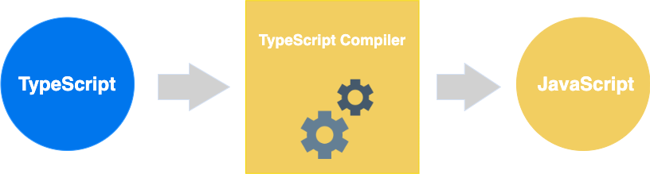

# TypeScript

1.  [TypeScript简介](#typescript简介)
2.  [TypeScript基础](#typescript基础)

## TypeScript简介

TypeScript是JavaScript的一个超集，支持ECMAScript 6标准（ES6教程）。

TypeScript由微软开发的自由和开源的编程语言。

TypeScript设计目标是开发大型应用，它可以编译成纯JavaScript，编译出来的JavaScript可以运行在任何浏览器上。

TypeScript在JavaScript基础上扩展的功能：类型批注和编译时类型检查，类型推断，类型擦除，接口，枚举，Mixin，泛型编程，名字空间，元组，Await。



tsconfig.json：

*   如果一个目录下存在一个`tsconfig.json`文件，那么它意味着这个目录是TypeScript项目的根目录。
*   `tsconfig.json`文件中指定了用来编译这个项目的根文件和编译选项。

## TypeScript基础

基础类型：

```typescript
/**
 * 任意类型 
 * keyword: any
 * 变量的值会动态改变
 */
let x: any = 1;       // 数字类型
x = 'I am who I am';  // 字符串类型
x = false;            // 布尔类型

/**
 * 数字类型
 * keyword: number
 */
let binaryLiteral: number = 0b1010;  // 二进制
let octalLiteral: number = 0o744;    // 八进制
let decLiteral: number = 6;          // 十进制
let hexLiteral: number = 0xf00d;     // 十六进制

/**
 * 字符串类型
 * keyword: string
 */
let name: string = "Runoob";
let years: number = 5;
let words: string = `您好，今年是 ${ name } 发布 ${ years + 1} 周年`;

/**
 * 布尔类型
 * keyword: boolean
 */
let flag: boolean = true;

/**
 * 数组类型
 */
// 在元素类型后面加上 []
let arr: number[] = [1, 2];

// 或者使用数组泛型
let arr: Array<number> = [1, 2];

/**
 * 元组
 */
let x: [string, number];
x = ['Runoob', 1];    // 运行正常
x = [1, 'Runoob'];    // 报错
console.log(x[0]);    // 输出 Runoob

/**
 * 枚举
 */
enum Color {Red, Green, Blue};
let c: Color = Color.Blue;
console.log(c);    // 输出 2

/**
 * void
 */
function hello(): void {
    alert("Hello Runoob");
}

/**
 * null 和 undefined
 * null 是一个只有一个值的特殊类型。表示一个空对象引用。用 typeof 检测 null 返回是 object。
 * undefined 是一个没有设置值的变量。typeof 一个没有值的变量会返回 undefined。
 * null 和 undefined 是其他任何类型（包括 void）的子类型，可以赋值给其他类型，如数字类型。
 * 而在 TypeScript 中启用严格的空校验（--strictNullChecks）特性，就可以使得 null 和 undefined 只能被赋值给 void 或本身对应的类型。
 */
// 启用 --strictNullChecks
let x: number | null | undefined;
x = 1;  // 运行正确
x = undefined;  // 运行正确
x = null;  // 运行正确

/**
 * never 
 * never 是其他类型（包括 null 和 undefined）的子类型，代表从不会出现的值。
 */
let x: never;
let y: number;

// 运行错误，数字类型不能转为 never 类型
x = 123;

// 运行正确，never 类型可以赋值给 never类型
x = (()=>{ throw new Error('exception')})();

// 运行正确，never 类型可以赋值给 数字类型
y = (()=>{ throw new Error('exception')})();

// 返回值为 never 的函数可以是抛出异常的情况
function error(message: string): never {
    throw new Error(message);
}

// 返回值为 never 的函数可以是无法被执行到的终止点的情况
function loop(): never {
    while (true) {}
}
```

变量声明：

```typescript
// 声明变量的类型及初始值
// let [变量名] : [类型] = 值;
let uname: string = "Runoob";

// 声明变量的类型，但没有初始值，变量值会设置为 undefined
// let [变量名] : [类型];
let uname: string;

// 声明变量并初始值，但不设置类型，该变量可以是任意类型
// let [变量名] = 值;
let uname = "Runoob";

// 声明变量没有设置类型和初始值，类型可以是任意类型，默认初始值为 undefined
// let [变量名];
let uname;
```

类型断言（Type Assertion）：

*   类型断言可以用来手动指定一个值的类型，即允许变量从一种类型更改为另一种类型。
*   用途：将一个联合类型断言为其中一个类型；将一个父类断言为更加具体的子类；将任何一个类型断言为any；将any断言为一个具体的类型。
*   它之所以不被称为类型转换，是因为转换通常意味着某种运行时的支持。但是，类型断言纯粹是一个编译时语法，同时，它也是一种为编译器提供关于如何分析代码的方法。

```typescript
/**
 * 类型断言
 * 语法：<类型> 值，值 as 类型 
 */
let str1 = '1';
let str2: number = <number> <any> str1;
console.log(str2);
```

类型推断：当类型没有给出时，TypeScript编译器利用类型推断来推断类型。如果由于缺乏声明而不能推断出类型，那么它的类型被视作默认的动态any类型。

```typescript
let num = 2;  // 类型推断为 number
num = '12';   // error TS2322: Type '"12"' is not assignable to type 'number'.
```

变量作用域：

*   变量作用域指定了变量定义的位置。程序中变量的可用性由变量作用域决定。
*   全局作用域：全局变量定义在程序结构的外部，它可以在你代码的任何位置使用。
*   类作用域：这个变量也可以称为字段。类变量声明在一个类里头，但在类的方法外面。该变量可以通过类的对象来访问。类变量也可以是静态的，静态的变量可以通过类名直接访问。
*   局部作用域：局部变量，局部变量只能在声明它的一个代码块（如：方法）中使用。

```typescript
let globalNum = 12;  // 全局变量
class Numbers {
  let numVal = 13;   // 实例变量
  static sval = 10;  // 静态变量
  square(): void {
    let a = numVal * numVal;  // 局部变量
    console.log(a);
  }
}
```

运算符：

*   算术运算符：加法，减法，乘法，除法，取模，自增，自减。
*   关系运算符：等于，不等于，大于，小于，大于或等于，小于或等于。
*   逻辑运算符：与，或，非。
*   位运算符：按位与，按位或，取反，按位异或，左移，右移。
*   赋值运算符：赋值，加法赋值，减法赋值，乘法赋值，除法赋值等。
*   三元运算符：条件表达式 ? 表达式1 : 表达式2。
*   类型运算符：typeof，instanceof。
*   字符串运算符：连接运算符。

条件语句：用于基于不同的条件来执行不同的动作。

```typescript
/* if - elseif - else */
let num: number = 2;
if (num > 0) {
  console.log(num + ' 是正数');
} else if (num < 0) { 
  console.log(num + ' 是负数');
} else { 
  console.log(num + ' 不是正数也不是负数');
}

/* switch - case */
let grade: string = 'A';
switch (grade) { 
  case 'A': {
    console.log('优');
    break;
  }
  case 'B': {
    console.log('良');
    break;
  }
  case 'C': {
    console.log('及格');
    break;
  }
  case 'D': {
    console.log('不及格');
    break;
  }
  default: {
    console.log('非法输入');
    break;
  }
}
```

循环：允许我们多次执行一个语句或语句组。

```typescript
/* for */
let num: number = 5;
let factorial: number = 1;
for (let i: number = num; i >= 1; i--) {
  factorial *= i;
}
console.log(factorial);

/** 
 * for in
 * 变量使用 any 类型
 */
let j: any;
let n: any = 'a b c';

for (j in n) {
  console.log(n[j]);
}

/* for of */
let someArray = [1, 'string', false];

for (let entry of someArray) {
  console.log(entry);
}

/* forEach */
let list: number[] = [4, 5, 6];
list.forEach((val, idx, array) => {
  // val：当前值
  // idx：当前 index
  // array：Array
  console.log(val);
});

/* every */
let list: number[] = [4, 5, 6];
list.every((val, idx, array) => {
  if (val === 6) {
    return false;  // Return false will quit the iteration
  }
  console.log(val);
  return true;     // Continues
});

/* some */
let list: number[] = [4, 5, 6];
list.some((val, idx, array) => {
  if (val === 6) {
    return true;  // Continues
  }
  console.log(val);
  return false;   // Return true will quit the iteration
});

/* filter：过滤数组成员，满足条件的成员组成一个新数组返回 */
interface IPerson {
  id: number;
  name: string;
}

let arrObj: IPerson[] = [{
  id: 1,
  name: 'xiaohua',
}, {
  id: 2,
  name: 'xiaoming',
}, {
  id: 3,
  name: 'xiaobai',
}];

let result = arrObj.filter((val, idx, array) => {
  return (val.name === 'xiaohua');
});

console.log(result);

/* map：返回一个新的 array，数组元素由每一次调用函数产生结果组成 */
arrObj.map((val, idx, array) => {
  // do something
});

/* Object.keys and Object.values */
interface IPerson {
  id: number;
  name: string;
}

let person: IPerson = { id: 1, name: 'xiaohua' };
console.log(Object.keys(person));
console.log(Object.values(person));

/* while */
let num: number = 5;
let factorial: number = 1;

while (num >= 1) {
  factorial = factorial * num;
  num--;
}
console.log('5 的阶乘为：' + factorial);
```

函数：一组一起执行一个任务的语句。

```typescript
/* 带参数函数 */
function add(x: number, y: number): number {
  return x + y;
}
console.log(add(1, 2));

/* 可选参数 */
function buildName(firstName: string, lastName?: string): string {
  if (lastName)
    return firstName + ' ' + lastName;
  else
    return firstName;
}
let result1 = buildName('Bob');
let result2 = buildName('Bob', 'Adams');

/* 默认参数 */
function calculateDiscount(price: number, rate: number = 0.50): void {
  let discount = price * rate;
  console.log('计算结果：', discount);
}
calculateDiscount(1000);
calculateDiscount(1000, 0.30);

/* 剩余参数 */
function buildName(firstName: string, ...restOfName: string[]): string {
  return firstName + ' ' + restOfName.join(' ');
}
let employeeName: string = buildName('Joseph', 'Samuel', 'Lucas', 'MacKinzie');

/* 匿名函数 */
let msg: Function = function (): string { return 'Hello World'; };
console.log(msg());

/* 匿名函数自调用 */
(function (): void {
  let x: string = 'Hello World';
  console.log(x);
})();

/* 构造函数 */
let myFunction: Function = new Function('a', 'b', 'return a * b');
let x: number = myFunction(4, 3);
console.log(x);

/* 递归函数 */
function factorial(num: number): number {
  if (num <= 0) {
    return 1;
  } else {
    return (num * factorial(num - 1));
  }
}
console.log(factorial(6));

/* Lambda 函数，又称为箭头函数 */
let foo: Function = (x:number) => 10 + x;
console.log(foo(100));

/* 函数重载 */
let suits: string[] = ['hearts', 'spades', 'clubs', 'diamonds'];
function pickCard(x: {suit: string; card: number; }[]): number;
function pickCard(x: number): {suit: string; card: number; };
function pickCard(x: any): any {
  if (typeof x === 'object') {
    let pickedCard: number = Math.floor(Math.random() * x.length);
    return pickedCard;
  } else if (typeof x === 'number') {
    let pickedSuit: number = Math.floor(x / 13);
    return { suit: suits[pickedSuit], card: x % 13 };
  }
}

let myDeck: {suit: string; card: number; }[] = [{ suit: 'diamonds', card: 2 }, { suit: 'spades', card: 10 }, { suit: 'hearts', card: 4 }];
let pickedCard1: {suit: string; card: number; } = myDeck[pickCard(myDeck)];
console.log('card: ' + pickedCard1.card + ' of ' + pickedCard1.suit);

let pickedCard2 = pickCard(15);
console.log('card: ' + pickedCard2.card + ' of ' + pickedCard2.suit);
```

Number：Number对象是原始数值的包装对象。

```typescript
/**
 * number 对象：let number1: number = 123;
 * Number 对象：let number2: Number = new Number(123);
 */

// 属性
console.log('TypeScript Number 属性：');
console.log('最大值为：' + Number.MAX_VALUE);
console.log('最小值为：' + Number.MIN_VALUE);
console.log('负无穷大：' + Number.NEGATIVE_INFINITY);
console.log('正无穷大：' + Number.POSITIVE_INFINITY);

// Number.NaN
let month: number = 0;
if (month <= 0 || month > 12) {
  month = Number.NaN;
  console.log('月份是：' + month);
} else {
  console.log('输入月份数值正确');
}

// constructor
let num: Number = new Number(123);
console.log(num.constructor(456));

// prototype
function employee(this: any, id: number,name: string) { 
    this.id = id;
    this.name = name;
}
 
let emp = new (employee as any)(123, 'admin');
employee.prototype.email = 'admin@runoob.com';
 
console.log('员工号：' + emp.id);
console.log('员工姓名：' + emp.name);
console.log('员工邮箱：' + emp.email);

// toExponential()：指数计数法
let num: number = 1225.30;
let val: number = num.toExponential();
console.log(val);  // 1.2253e+3

// toFixed()
let num: number = 177.234;
console.log(num.toFixed());   // 177
console.log(num.toFixed(2));  // 177.23
console.log(num.toFixed(6));  // 177.234000

// toLocaleString()：数字转换为字符串

// toPrecision()
let num: number = new Number(7.123456);
console.log(num.toPrecision());   // 7.123456 
console.log(num.toPrecision(1));  // 7
console.log(num.toPrecision(2));  // 7.1

// toString()：指定基数的将数字转换为字符串
let num: number = new Number(10);
console.log(num.toString());   // 十进制：10
console.log(num.toString(2));  // 二进制：1010
console.log(num.toString(8));  // 八进制：12

// valueOf()：返回一个 Number 对象的原始数字值
let num: number = new Number(10);
console.log(num.valueOf());  // 10
```

String：

```typescript
/**
 * string 对象：let string1: string = 'hello';
 * String 对象：let string2: String = new String('hello');
 */

// constructor

// length
let uname: String = new String('Hello World');
console.log(uname.length);

// prototype

// charAt()
let str: String = new String('Runoob');
console.log(str.charAt(1));  // u

// charCodeAt()
let str: String = new String('Runoob');
console.log(str.charCodeAt(1));  // 117

// concat()：连接两个或更多字符串，并返回新的字符串

// indexOf()
let str: String = new String('Runoob');
console.log(str.indexOf('oo'));  // 3

// lastIndexOf()：从后向前搜索

// match()：查找找到一个或多个正则表达式的匹配

// split()
let str: string = 'Apples are round, and apples are juicy.';
console.log(str.split(' ', 3));  // ['Apples', 'are', 'round,']

// toLowerCase()

// toUpperCase()
```

Array：数组对象是使用单独的变量名来存储一系列的值。

```typescript
/**
 * 下列都是 Array 对象
 * let array1: string[] = ['Google', 'Runoob', 'Taobao'];
 * let array2: Array<String> = new Array('Google', 'Runoob', 'Taobao');
 */

// 数组解构
let arr: number[] = [12, 13];
let [x, y] = arr;
console.log(x);
console.log(y);

// 数组迭代
let j:any;  // The left-hand side of a 'for...in' statement must be of type 'string' or 'any'.
let nums: number[] = [1001, 1002, 1003, 1004];
 
for (j in nums) {
  console.log(nums[j]);
}

// 多维数组
let multi: number[][] = [ [1, 2, 3], [23, 24, 25] ];
console.log(multi[0][0]);
console.log(multi[0][1]);
console.log(multi[0][2]);
console.log(multi[1][0]);
console.log(multi[1][1]);
console.log(multi[1][2]);

// 数组在函数中的使用
let sites: Array<String> = new Array('Google', 'Baidu', 'Taobao', 'Facebook');

function disp<T>(arr_sites: Array<T>): void {
  for (let i: number = 0; i < arr_sites.length; i++) {
    console.log(arr_sites[i]);
  }
}

disp<String>(sites);

// concat()：连接两个或更多的数组，并返回结果

// every()：检测数值元素的每个元素是否都符合条件

// some()：检测数组元素中是否有元素符合指定条件

// filter()：检测数值元素，并返回符合条件所有元素的数组

// forEach()

// indexOf()：搜索数组中的元素，并返回它所在的位置

// join()
let arr: Array<String> = new Array('Google', 'Baidu', 'Taobao');
let str: string = arr.join(', ');
console.log(str);  // Google, Baidu, Taobao

// map()
let nums: number[] = [1, 4, 9];
let roots: number[] = nums.map(Math.sqrt);
console.log(roots);

// push()：向数组的末尾添加一个或更多元素，并返回新的长度

// pop()：删除数组的最后一个元素并返回删除的元素

// reduce()：将数组元素计算为一个值（从左到右）
let total:number = [0, 1, 2, 3].reduce(function (a, b) { return a + b; });
console.log(total);

// reduceRight()：将数组元素计算为一个值（从右到左）

// reverse()：反转数组的元素顺序并返回该数组的浅拷贝

// shift()：删除并返回数组的第一个元素

// unshift()：向数组的开头添加一个或更多元素，并返回新的长度

// slice()：选取数组的一部分，并返回一个新数组
let arr: string[] = ['Orange', 'Mango', 'Banana'];
console.log(arr.slice(1, 3));  // ['Mango', 'Banana']

// splice()：从数组中添加或删除元素
let arr: string[] = ['Orange', 'Mango', 'Banana'];
let removed = arr.splice(2, 0, 'Water');
console.log(arr);      // ['Orange', 'Mango', 'Water', 'Banana']
console.log(removed);  // []

removed = arr.splice(3, 1);
console.log(arr);      // ['Orange', 'Mango', 'Water']
console.log(removed);  // ['Banana']
```

Map：Map对象保存键值对，并且能够记住键的原始插入顺序

```typescript
/**
 * 键值对：let map1: {[key: string]: number} = {'Google': 1, 'Taobao': 2};
 * Map 对象：let map2: Map<string, number> = new Map([['Google', 1], ['Taobao', 2]]);
 *
 * map.clear()：移除 Map 对象的键值对
 * map.set()
 * map.get()
 * map.has()：返回一个布尔值，用于判断 Map 中是否包含键对应的值
 * map.delete()：删除 Map 中的元素，删除成功返回 true，失败返回 false
 * map.size：返回 Map 对象键值对的数量
 * map.keys()
 * map.values()
 * map.entries()
 */
let nameSiteMapping: Map<string, number> = new Map();

nameSiteMapping.set('Google', 1);
nameSiteMapping.set('Runoob', 2);
nameSiteMapping.set('Taobao', 3);

console.log(nameSiteMapping.get('Runoob'));
console.log(nameSiteMapping.has('Taobao'));
console.log(nameSiteMapping.has('Zhihu')); 
console.log(nameSiteMapping.size);

console.log(nameSiteMapping.delete("Runoob"));
console.log(nameSiteMapping);

for (let key of nameSiteMapping.keys()) {
  console.log(key);
}

for (let value of nameSiteMapping.values()) {
  console.log(value);
}

for (let entry of nameSiteMapping.entries()) {
  console.log(entry[0], entry[1]);
}

for (let [key, value] of nameSiteMapping) {
  console.log(key, value);
}

nameSiteMapping.clear();
console.log(nameSiteMapping);
```

元组：数组中元素的数据类型都一般是相同的（any[]类型的数组可以不同），如果存储的元素数据类型不同，则需要使用元组。

```typescript
/**
 * 元组：let tuple: [string, number] = ['Hello', 1];
 */

// push()

// pop()
```

联合类型：可以通过管道（|）将变量设置多种类型，赋值时可以根据设置的类型来赋值。

```typescript
/**
 * let val: string | number;
 */

// 将联合类型作为函数参数使用
function disp(name: string | string[]) {
  if (typeof name === 'string') {
    console.log(name);
  } else {
    for (let i = 0; i < name.length; i++) {
      console.log(name[i]);
    }
  }
}

// 联合类型数组
// let arr: number[] | string[];
```

接口：接口是一系列抽象方法的声明，是一些方法特征的集合，这些方法都应该是抽象的，需要由具体的类去实现，然后第三方就可以通过这组抽象方法调用，让具体的类执行具体的方法。

```typescript
interface IPerson {
  firstName: string;
  lastName: string;
  disp: () => string;
}

let customer: IPerson = {
  firstName: 'Tom',
  lastName: 'Hanks',
  disp: (): string => { return 'Hi there'; }
}

console.log(customer.firstName);
console.log(customer.lastName);
console.log(customer.disp());

// 联合类型和接口
interface RunOptions {
  program: string;
  commandline: string[] | string | (() => string);
}

// 接口继承
// 单接口继承：interface Child extends Super {};
// 多接口继承：interface Child extends Super1, Super2 {};
interface IParent1 {
  v1: number;
}
interface IParent2 {
  v2: number;
}

interface Child extends IParent1, IParent2 {};
let iobj: Child = { v1: 12, v2: 23 };
console.log(iobj.v1 + ' ' + iobj.v2);
```

类：

*   描述了所创建的对象共同的属性和方法。
*   类的继承：TypeScript支持继承类，即我们可以在创建类的时候继承一个已存在的类，这个已存在的类称为父类，继承它的类称为子类。类继承使用关键字`extends`，子类除了不能继承父类的私有成员（方法和属性）和构造函数，其他的都可以继承。TypeScript一次只能继承一个类，不支持继承多个类，但支持多重继承。
*   访问控制修饰符：public，protected，private。
*   类和接口：用一个类实现接口，必须将接口中包含的所有属性和方法都声明才可以。

```typescript
class Car {
  // 字段
  engine: string;
  // 静态
  static id: number;
  // 构造函数
  constructor(engine: string) {
    this.engine = engine;
  }
  // 方法
  disp(): void {
    console.log('发动机为：' + this.engine);
  }
}
let car: Car = new Car('XXSY1');
console.log(car.engine);
console.log(car.disp());
// 类的继承
class Shape {
  area: number;
  constructor(a: number) {
    this.area = a;
  }
}
class Circle extends Shape {
  disp(): void {
    console.log('圆的面积：' + this.area);
  }
}
let obj: Circle = new Circle(223);
obj.disp();
// 继承类的方法重写
class PrinterClass {
  doPrint(): void {
    console.log('父类的 doPrint() 方法');
  }
}
class StringPrinter extends PrinterClass {
  doPrint(): void {
    super.doPrint();
    console.log('子类的 doPrint() 方法');
  }
}
// instanceof
class Person {}
let obj: Person = new Person();
let isPerson: boolean = obj instanceof Person;
console.log('obj 对象是 Person 类实例化来的吗？ ' + isPerson);
// 类和接口
interface ILoan {
  interest: number;
}
class AgriLoan implements ILoan {
  interest: number;
  rebate: number;
  constructor(interest: number, rebate: number) {
    this.interest = interest;
    this.rebate = rebate;
  }
}
let obj: AgriLoan = new AgriLoan(10, 1);
console.log('利润为：' + obj.interest + '，抽成为：' + obj.rebate);
```

对象：对象是包含一组键值对的实例。值可以是标量、函数、数组、对象等。

```typescript
let objectName = {
  key1: 'value1',
  key2: 'value2',
  key3: function () { return 'Hello'; },
  key4: ['content1', 'content2']
}

// 类型模板
let sites = {
  site1: 'Runoob',
  site2: 'Google',
  sayHello: function () {}  // 类型模板
}
sites.sayHello = function () {
  console.log('Hello ' + sites.site1);
}

// 对象作为参数传递给函数
let sites = {
  site1: 'Runoob',
  site2: 'Google',
}

let invokesites = function(obj: {site1: string, site2: string}) {
  console.log('site1: ' + obj.site1);
  console.log('site2: ' + obj.site2);
}

// 鸭子类型：当看到一只鸟走起来像鸭子、游泳起来像鸭子、叫起来也像鸭子，那么这只鸟就可以被称为鸭子。
interface IPoint {
  x: number;
  y: number;
}
function addPoints(p1: IPoint, p2: IPoint): IPoint {
  let x = p1.x + p2.x;
  let y = p1.y + p2.y;
  return {x: x, y: y};
}

let newPoint = addPoints({x: 3, y: 4}, {x: 5, y: 1});
```

命名空间：解决重名问题。

```typescript
/* 命名空间使用 */

// ishape.ts
namespace Drawing {
  export interface IShape {
    draw: () => void;
  }
}

// circle.ts
/// <reference path = 'ishape.ts' />
namespace Drawing {
  export class Circle implements IShape {
    public draw() {
      console.log('Circle is drwan');
    }
  }
}

// triangle.ts
/// <reference path = 'ishape.ts' />
namespace Drawing {
  export class Triangle implements IShape {
    public draw() {
      console.log('Triangle is drwan');
    }
  }
}

// main.ts
/// <reference path = 'ishape.ts' />
/// <reference path = 'circle.ts' />
/// <reference path = 'triangle.ts' />
function drawAllShapes(shape: Drawing.IShape) {
  shape.draw();
}

drawAllShapes(new Drawing.Circle());
drawAllShapes(new Drawing.Triangle());

// 编译命令
// tsc --out main.js main.ts

/* 嵌套命名空间 */

// invoice.ts
namespace Runoob {
  export namespace invoiceApp {
    export class Invoice {
        public calculateDiscount(price: number) {
          return price * .40; 
        } 
    } 
  }
}

// test-invoice.ts
let invoice: Invoice = new Runoob.invoiceApp.Invoice(); 
console.log(invoice.calculateDiscount(500));
```

模块：

*   模块的设计理念是可以更换的组织代码。
*   模块是在其自身的作用域里执行，并不是在全局作用域，这意味着定义在模块里面的变量、函数和类等在模块外部是不可见的，除非明确地使用export导出它们。类似的，必须通过import导入其他模块中的变量、函数、类等。
*   两个模块之间的关系是通过在文件级别上使用import和export建立的。
*   模块使用模块加载器去导入其他的模块。在运行时，模块加载器的作用是在执行此模块代码前去查找并执行这个模块的所有依赖。大家最熟知的JavaScript模块加载器是服务于`Node.js`的`CommonJS`和服务于`Web`应用的`Require.js`。

```typescript
// ishape.ts
export interface IShape { 
  draw: () => void;
}
// circle.ts
import shape = require('./ishape');
export class Circle implements shape.IShape {
  public draw() {
    console.log('Cirlce is drawn (external module)');
  }
}
// triangle.ts
import shape = require('./ishape');
export class Triangle implements shape.IShape {
  public draw() {
    console.log('Triangle is drawn (external module)');
  }
}
// main.ts
import shape = require('./ishape');
import circle = require('./circle'); 
import triangle = require('./triangle');
 
function drawAllShapes(shapeToDraw: shape.IShape) {
  shapeToDraw.draw();
} 
drawAllShapes(new circle.Circle());
drawAllShapes(new triangle.Triangle());
// CommonJS 规范加载模块是同步的，也就是说，只有加载完成，才能执行后面的操作
// tsc --module commonjs main.ts
// AMD 规范则是异步加载模块，允许指定回调函数，在回调函数中执行操作
// tsc --module amd main.ts
```

声明文件：

*   TypeScript作为JavaScript的超集，在开发过程中不可避免要引用其他第三方的JavaScript的库。虽然通过直接引用可以调用库的类和方法，但是却无法使用TypeScript诸如类型检查等特性功能。为了解决这个问题，需要将这些库里的函数和方法体去掉后只保留导出类型声明，而产生了一个描述JavaScript库和模块信息的声明文件。
*   通过引用这个声明文件，就可以借用TypeScript的各种特性来使用库文件了。
*   `declare`定义的类型只会用于编译时的检查，编译结果中会被删除。
*   很多流行的第三方库的声明文件不需要我们定义了，开发者已经定义好了。

```typescript
// calc-thirdparty-jslib.js
let Runoob;
(function (Runoob) {
  let Calc = (function () {});
  Calc.prototype.doSum = function (limit) {
    let sum = 0;
    for (let i = 0; i <= limit; i++) {
      sum += i;
    }
    return sum;
  }
  Runoob.Calc = Calc;
  return Calc;
})(Runoob || (Runoob = {}));
let test = new Runoob.Calc();
// calc.d.ts
declare module Runoob {
  export class Calc {
    doSum(limit: number): number;
  }
}
// calc-test.ts
/// <reference path = 'calc.d.ts' />
let obj: Calc = new Runoob.Calc();
console.log(obj.doSum(10));
// tsc calc-test.ts
// import calc-thirdparty-jslib.js and calc-test.js to index.html
```
