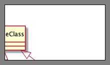
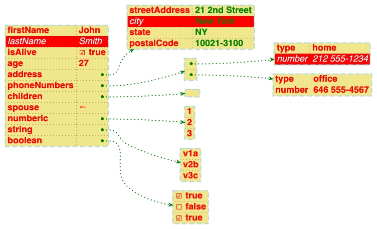
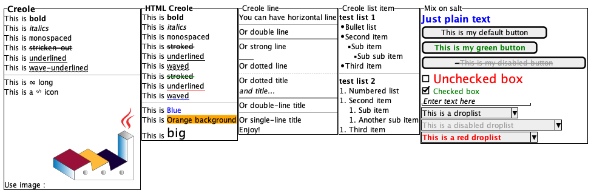
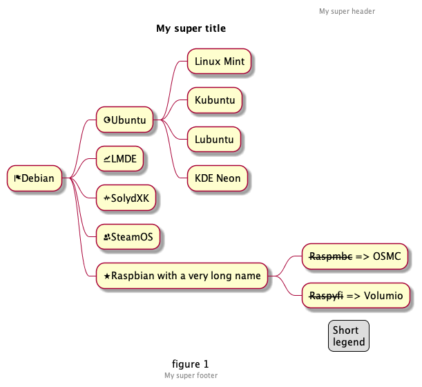

# UML

1.  [运行](#运行)
2.  [UML](#uml)
    1.  [时序图](#时序图)
    2.  [用例图](#用例图)
    3.  [类图](#类图)
    4.  [对象图](#对象图)
    5.  [活动图](#活动图)
    6.  [组件图](#组件图)
    7.  [部署图](#部署图)
    8.  [状态图](#状态图)
    9.  [定时图](#定时图)
3.  [非UML](#非uml)
    1.  [JSON数据](#json数据)
    2.  [YAML数据](#yaml数据)
    3.  [网络图](#网络图)
    4.  [线框图形界面](#线框图形界面)
    5.  [架构图](#架构图)
    6.  [规范和描述语言](#规范和描述语言)
    7.  [Ditaa图](#ditaa图)
    8.  [甘特图](#甘特图)
    9.  [思维导图](#思维导图)
    10.  [WBS工作分解图](#wbs工作分解图)
    11.  [LaTexMath](#以asciimath或jlatexmath符号的数学公式)
    12.  [实体关系图](#实体关系图)

## 运行

```bash
> create sequenceDiagram.txt

> java -jar plantuml.jar sequenceDiagram.txt

> import sequenceDiagram.png to markdown file
```

## UML

### 时序图


### 用例图


### 类图


  





### 对象图


### 活动图


### 组件图


### 部署图


### 状态图


### 定时图


## 非UML

### JSON数据



### YAML数据


### 网络图


### 线框图形界面




### 架构图


### 规范和描述语言


### Ditaa图


### 甘特图


### 思维导图



### WBS工作分解图


### 以AsciiMath或JLaTeXMath符号的数学公式


### 实体关系图


