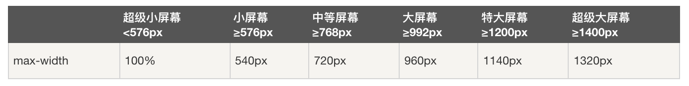
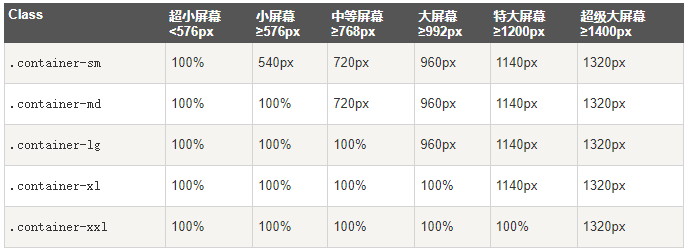
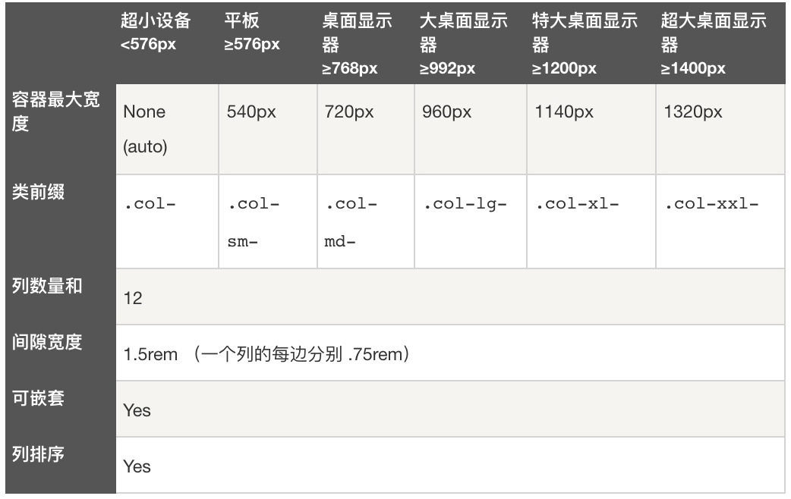

# Bootstrap

1.  [Bootstrap简介](#bootstrap简介)
2.  [Bootstrap基础](#bootstrap基础)
3.  [Bootstrap其余类](#bootstrap其余类)

## Bootstrap简介

Bootstrap是全球最受欢迎的前端组件库，用于开发响应式布局、移动设备优先的WEB项目。

使用CDN库的基本HTML源文件：

*   src: bootstrap-example/bootstrap-base.html

## Bootstrap基础

容器：

*   `.container`：用于固定宽度并支持响应式布局的容器。
    *   
*   `.container-fluid`：用于100%宽度，占据全部视口（viewport）的容器。
*   `.container-sm|md|lg|xl|xxl`：响应式容器
    *   
*   容器都有填充左右内边距，顶部和底部没有填充内边距。

网格系统：

*   Bootstrap提供了一套响应式、移动设备优先的流式网格系统，随着屏幕或视口（viewport）尺寸的增加，系统会自动分为最多12列。
*   Bootstrap的网格系统是响应式的，列会根据屏幕大小自动重新排列。请确保每一行中列的总和等于或小于12。
*   
*   网格每一行需要放置在容器中，这样可以自动设置一些外边距与内边距。
*   `.row`：设置行。
*   `.col-*-*`：设置列。
*   `.offset-*-*`：设置偏移。

```html
<!-- 让 Bootstrap 自动处理布局 -->
<div class="container-fluid mt-3">
  <div class="row">
    <div class="col p-3 bg-primary text-white">.col</div>
    <div class="col p-3 bg-dark text-white">.col</div>
    <div class="col p-3 bg-primary text-white">.col</div>
  </div>
</div>
<!-- 控制列的宽度及在不同的设备上如何显示 -->
<div class="container-fluid mt-3">
  <div class="row">
    <div class="col-*-* p-3 bg-primary text-white">.col</div>
    <div class="col-*-* p-3 bg-dark text-white">.col</div>
    <div class="col-*-* p-3 bg-primary text-white">.col</div>
  </div>
</div>
<!-- 多端响应式布局 -->
<div class="container-fluid mt-3">
  <div class="row">
    <div class="col-sm-3 col-md-6 col-lg-4 col-xl-2 p-3 bg-primary text-white">.col</div>
    <div class="col-sm-9 col-md-6 col-lg-8 col-xl-10 p-3 bg-dark text-white">.col</div>
  </div>
</div>
```

文字排版：

*   Bootstrap5默认设置：font-size为16px，line-height为1.5。默认的font-family为<kbd>"Helvetica Neue", Helvetica, Arial, sans-serif</kbd>。所有的p元素margin-top为0，margin-bottom为1rem（16px）。
*   src: bootstrap-example/bootstrap-text-layout.html

颜色：

*   src: bootstrap-example/bootstrap-color.html

表格：

*   src: bootstrap-example/bootstrap-table.html

图像形状：

*   src: bootstrap-example/bootstrap-image.html

信息提示框：

*   src: bootstrap-example/bootstrap-alert.html

按钮：

*   src: bootstrap-example/bootstrap-button.html

徽章：

*   徽章（Badges）主要用于突出显示新的或未读的项。如需使用徽章，只需要将.badges类加上带有指定意义的颜色类添加到span元素上即可。徽章可以根据父元素的大小的变化而变化。
*   src: bootstrap-example/bootstrap-badges.html

进度条：

*   src: bootstrap-example/bootstrap-progressbar.html

加载效果：

*   src: bootstrap-example/bootstrap-spinner.html

分页：

*   网页开发过程，如果碰到内容过多，一般都会做分页处理。
*   src: bootstrap-example/bootstrap-pagination.html

列表组：

*   src: bootstrap-example/bootstrap-listgroup.html
*   src: bootstrap-example/bootstrap-listgroup-example.html

卡片：

*   src: bootstrap-example/bootstrap-card.html

下拉菜单：

*   src: bootstrap-example/bootstrap-dropdownmenu.html
*   src: bootstrap-example/bootstrap-dropdownmenu-example.html

折叠：

*   src: bootstrap-example/bootstrap-collapse.html

导航：

*   src: bootstrap-example/bootstrap-navigation.html

导航栏：

*   src: bootstrap-example/bootstrap-navigation-bar.html
*   src: bootstrap-example/bootstrap-navigation-bar-example.html

轮播：

*   src: bootstrap-example/bootstrap-carousel.html

模态框：

*   src: bootstrap-example/bootstrap-modal.html

提示框：

*   src: bootstrap-example/bootstrap-promptbox.html

弹出框：

*   src: bootstrap-example/bootstrap-popup.html

滚动监听：

*   src: bootstrap-example/bootstrap-scrollspy.html

侧边栏导航：

*   src: bootstrap-example/bootstrap-offcanvas.html
*   src: bootstrap-example/bootstrap-offcanvas-exmaple.html

## Bootstrap其余类

width：

| Class | Description               |
| ----- | ------------------------- |
| .w-n  | n=(25, 50, 75, 100, auto) |

height：

| Class | Description               |
| ----- | ------------------------- |
| .h-n  | n=(25, 50, 75, 100, auto) |

margin：

| Class | Description                       |
| ----- | --------------------------------- |
| .m-n  | n=(0~5, auto), margin all         |
| .mx-n | n=(0~5, auto), margin left, right |
| .my-n | n=(0~5, auto), margin top, bottom |
| .mt-n | n=(0~5, auto), margin top         |
| .me-n | n=(0~5, auto), margin right       |
| .mb-n | n=(0~5, auto), margin bottom      |
| .ms-n | n=(0~5, auto), margin left        |

padding：

| Class | Description                  |
| ----- | ---------------------------- |
| .p-n  | n=(0~5), padding all         |
| .px-n | n=(0~5), padding left, right |
| .py-n | n=(0~5), padding top, bottom |
| .pt-n | n=(0~5), padding top         |
| .pe-n | n=(0~5), padding right       |
| .pb-n | n=(0~5), padding bottom      |
| .ps-n | n=(0~5), padding left        |

display：

| Class      | Description                                                                                  |
| ---------- | -------------------------------------------------------------------------------------------- |
| .d-n       | n=(inline, inline-block, block, grid, table, table-row, table-cell, flex, inline-flex, none) |
| .d-sm-n    | n=(inline, inline-block, block, grid, table, table-row, table-cell, flex, inline-flex, none) |
| .d-md-n    | n=(inline, inline-block, block, grid, table, table-row, table-cell, flex, inline-flex, none) |
| .d-lg-n    | n=(inline, inline-block, block, grid, table, table-row, table-cell, flex, inline-flex, none) |
| .d-xl-n    | n=(inline, inline-block, block, grid, table, table-row, table-cell, flex, inline-flex, none) |
| .d-xxl-n   | n=(inline, inline-block, block, grid, table, table-row, table-cell, flex, inline-flex, none) |
| .d-print-n | n=(inline, inline-block, block, grid, table, table-row, table-cell, flex, inline-flex, none) |

gap：

*   使用于`.d-grid`类中。
*   使用于`.d-flex`类和`style="flex-direction:column;"`中。

| Class      | Description |
| ---------- | ----------- |
| .gap-n     | n=(0~5)     |
| .gap-sm-n  | n=(0~5)     |
| .gap-md-n  | n=(0~5)     |
| .gap-lg-n  | n=(0~5)     |
| .gap-xl-n  | n=(0~5)     |
| .gap-xxl-n | n=(0~5)     |

justify-content：

*   使用于`.d-flex`类中。

| Class                  | Description                                     |
| ---------------------- | ----------------------------------------------- |
| .justify-content-n     | n=(start, end, center, between, around, evenly) |
| .justify-content-sm-n  | n=(start, end, center, between, around, evenly) |
| .justify-content-md-n  | n=(start, end, center, between, around, evenly) |
| .justify-content-lg-n  | n=(start, end, center, between, around, evenly) |
| .justify-content-xl-n  | n=(start, end, center, between, around, evenly) |
| .justify-content-xxl-n | n=(start, end, center, between, around, evenly) |
