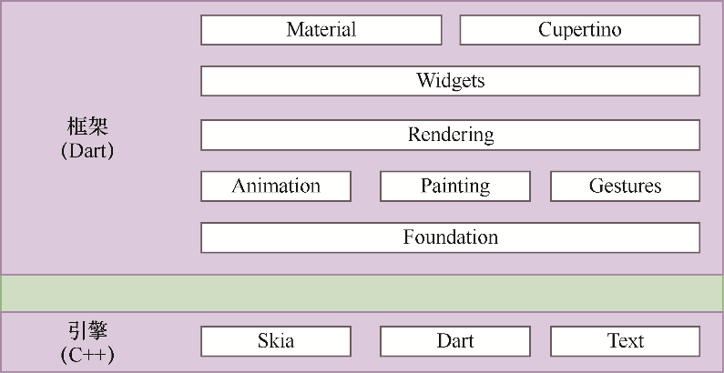
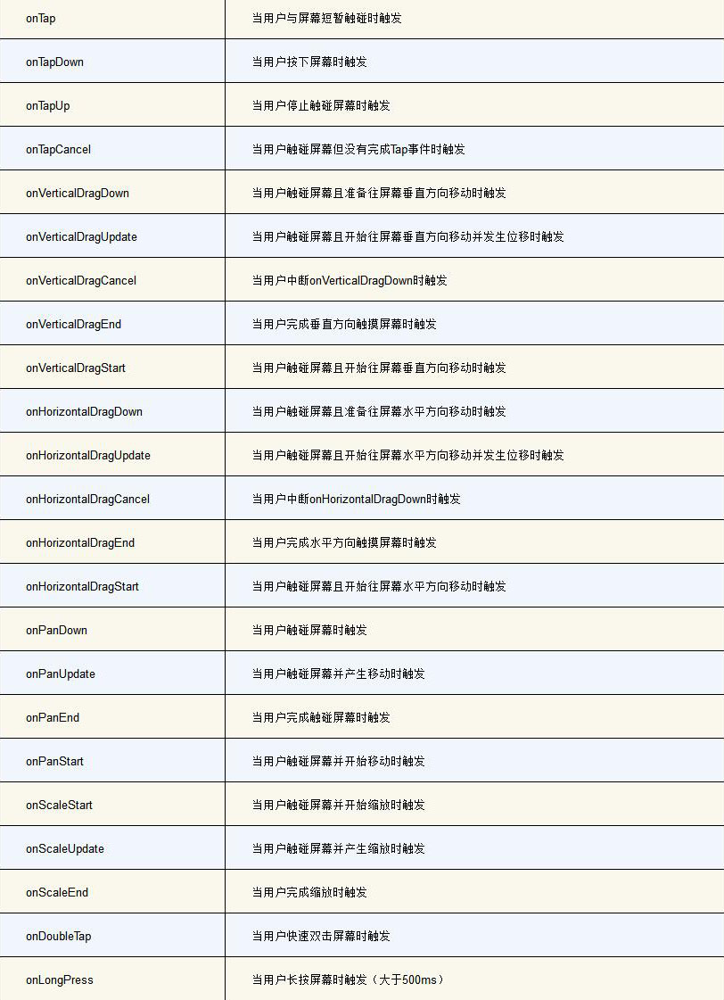

# Flutter

## Flutter基础

Flutter架构：

*   
*   引擎是由纯C++实现的SDK，主要包括Skia、Dart和Text。Framework层中所有的UI库都会调用Engine层的API。
    *   Skia：一个二位图形渲染引擎。
    *   Dart：主要包括Dart Runtime、内存垃圾回收（GC）。如果是Debug模式的话，还包括JIT支持。在Release和Profile模式下，是AOT编译成了原生的ARM代码，并不存在JIT部分。
    *   Text：文字排版引擎。
*   Foundation层与Animation、Painting、Gestures层：这两层提供了动画、绘制以及手势操作，是谷歌公司专门提供给开发人员调用的。
*   Rendering层：这一层负责构建UI树，也就是当UI树上的Element发生变更时，会重新计算变更部分的位置以及大小，并更新UI树，也就是更新界面，最终将更新的界面呈现给用户。
*   Widget层与Material、Cupertino层：其中Widgets层是Flutter提供的基础组件库。Material和Cupertino是另外两种视觉风格的组件库。在绝大多数情况下，使用官方提供的基础组件库就能满足多样化的日常开发需求。

Flutter开发的核心思想是：一切皆`Widget`（组件）。

*   下面所包含的所有组件：`Text`、`ElevatedButton`、`TextButton`、`IconButton`、`OutlinedButton`、`FloatingActionButton`、`Image`、`FlutterLogo`、`Container`、`Padding`、`Align`、`Center`、`FittedBox`、`AspectRatio`、`SizedBox`、`FractionallySizedBox`、`ConstrainedBox`、`Baseline`、`SingleChildScrollView`、`Scaffold`、`AppBar`、`Row`、`Column`、`ListView`、`ListWheelScrollView`、`GridView`、`CustomScrollView`、`CustomMultiChildLayout`、`Stack`、`IndexedStack`、`Table`、`Flexible`、`Wrap`、`Flow`、`TextField`、`TextFormField`。
*   基础组件：
    *   `Text`：
  
        ```dart
        const Text(
          'Hello World',
          style: TextStyle(
            fontSize: 24,
            color: Colors.red,
            decoration: TextDecoration.underline,
          ),
        ),
        ```

    *   `ElevatedButton`：常用按钮，点击的时候会带一点波纹以及阴影效果。

        ```dart
        ElevatedButton(
          onPressed: () => debugPrint('Elevated button clicked'),
          style: ElevatedButton.styleFrom(
            backgroundColor: Colors.blue,
            shape: const RoundedRectangleBorder(
              borderRadius: BorderRadius.all(Radius.circular(15)),
            ),
          ),
          child: const Text(
            'Click me',
            style: TextStyle(color: Colors.white),
          ),
        ),
        ```

    *   `TextButton`：文本按钮。

        ```dart
        TextButton(
          onPressed: () => debugPrint('Text button clicked'),
          child: const Text('Click me'),
        ),
        ```

    *   `IconButton`：图标按钮。

        ```dart
        IconButton(
          icon: const Icon(Icons.add, color: Colors.green),
          onPressed: () => debugPrint('Icon button clicked'),
        ),
        ```

    *   `OutlinedButton`：带边框的按钮。

        ```dart
        OutlinedButton(
          onPressed: () => debugPrint('Outlined button clicked'),
          child: const Text('Click me'),
        ),
        ```

    *   `FloatingActionButton`：悬浮按钮。

        ```dart
        Scaffold(
          floatingActionButton: FloatingActionButton(
            onPressed: () {},
            tooltip: 'Floating action button clicked',
            child: const Icon(Icons.add),
          ),
        ),
        ```

    *   `Image`：

        ```dart
        // 从应用的本地资源加载图片
        Image.asset(
          'assets/logo.png',
          width: 50,
        ),

        // 从网络中加载图片
        Image.network(
          'https://via.placeholder.com/350x150',
          width: 50,
        ),

        // 从设备的文件系统中加载图片
        // 通常是加载用户选择的图片或从设备存储中访问的图片，需要额外的权限配置
        Image.file(
          File('path/to/image.jpg'),
          width: 50,
        ),

        // 从内存中的字节数据加载图片
        // 通常用来处理动态生成的图片或从其他来源获取的字节流数据
        Image.memory(
          // 需要用实际的图片字节数据替换 Uint8List 中的内容
          Uint8List.fromList([0x00, 0x01, 0x02, 0x03]),
          width: 50,
        ),
        ```

    *   `FlutterLogo`：

        ```dart
        const FlutterLogo(size: 100),
        ```

*   单一子元素组件：
    *   `Container`：容器组件，可以设置边距、内边距、对齐方式、装饰、变换、子组件等属性。

        ```dart
        Container(
          // margin: const EdgeInsets.fromLTRB(20, 20, 20, 20),
          // margin: const EdgeInsets.symmetric(horizontal: 20, vertical: 20),
          // margin: const EdgeInsets.only(left: 20, top: 20, right: 20),
          margin: const EdgeInsets.all(20),
          padding: const EdgeInsets.all(10),
          alignment: Alignment.center,
          // 固定大小
          // width: 200,
          // height: 200,
          // 约束，不固定大小，同时会根据子组件大小适当的缩放
          constraints: const BoxConstraints(
            minWidth: 200,
            minHeight: 200,
          ),
          // 装饰器
          decoration: BoxDecoration(
            border: Border.all(
                color: Colors.yellowAccent,
                style: BorderStyle.solid,
                width: 5),
            image: const DecorationImage(
              image: AssetImage('assets/logo.png'),
            ),
            borderRadius: const BorderRadius.all(Radius.circular(30)),
            boxShadow: const [
              BoxShadow(
                color: Colors.redAccent,
                offset: Offset(20, 20),
                blurRadius: 10,
              ),
            ],
          ),
          transform: Matrix4.rotationZ(.3),
          child: const Text(
            'Hello, World!',
            style: TextStyle(fontSize: 90),
          ),
        ),
        ```

    *   `Padding`：内边距组件。

        ```dart
        Padding(
          padding: const EdgeInsets.all(40),
          child: ElevatedButton(
            onPressed: () {},
            child: const Text('Click me!'),
          ),
        ),
        ```

    *   `Align`：对齐组件。

        ```dart
        const Align(
          alignment: Alignment.center,
          // 高度为子组件的两倍
          heightFactor: 2,
          child: Text('Centered Text'),
        ),
        ```

    *   `Center`：居中组件。

        ```dart
        const Center(
          heightFactor: 2,
          child: Text('Centered Text'),
        ),
        ```

    *   `FittedBox`：用来调整子组件大小以适应给定约束条件的布局组件。

        ```dart
        Container(
          width: 200,
          height: 100,
          color: Colors.red,
          child: const FittedBox(
            // fit: BoxFit.fill,  // 不等比例缩放，子组件填充满整个父组件
            // fit: BoxFit.fitWidth,  // 等比例缩放，子组件的宽度充满父组件
            // fit: BoxFit.fitHeight,  // 等比例缩放，子组件的高度充满父组件
            // fit: BoxFit.none,  // 不等比例缩放，保留原始大小并居中显示
            // fit: BoxFit.scaleDown,  // 等比例缩放，当子组件大于父组件时采用 BoxFit.contain，当子组件小于父组件时采用 BoxFit.none
            // fit: BoxFit.cover,  // 等比例缩放，子组件填充满父组件，同时保持子组件的长宽比，会导致子组件部分被裁剪（但是我看到的效果是不会被裁剪并且超出父组件范围）
            fit: BoxFit.contain,  // 等比例缩放，直到子组件的高或宽适应父组件
            child: Text('Hello World!'),
          ),
        ),
        ```

    *   `AspectRatio`：用来控制子组件宽高比的布局组件。

        ```dart
        Container(
          width: 200,
          // 如果下一行取消注释，则子组件的宽高比会失效，子组件会填充整个父组件
          // height: 200,
          color: Colors.red,
          child: AspectRatio(
            // 宽高比为 16:9
            aspectRatio: 16 / 9,
            child: Container(
              // 仅用于演示的容器颜色
              color: Colors.blue,
            ),
          ),
        ),
        ```

    *   `SizedBox`：

        ```dart
        const SizedBox(
          width: 100,
        ),
        ```

    *   `FractionallySizedBox`：

        ```dart
        Container(
          width: 200,
          height: 200,
          color: Colors.red,
          child: FractionallySizedBox(
            alignment: Alignment.topRight,
            widthFactor: 0.5,
            heightFactor: 0.5,
            child: Container(
              color: Colors.blue,
              child: const Text('Hello World'),
            ),
          ),
        ),
        ```

    *   `ConstrainedBox`：

        ```dart
        ConstrainedBox(
          constraints: const BoxConstraints(
            minWidth: 100,
            minHeight: 100,
          ),
          child: Container(
            color: Colors.red,
            child: const Text('Hello World'),
          ),
        ),
        ```

    *   `Baseline`：

        ```dart
        Baseline(
          baseline: 50.0,
          baselineType: TextBaseline.alphabetic,
          child: Text(
            'Baseline Text',
            style: TextStyle(
              fontSize: 18,
              color: Colors.grey,
            ),
          ),
        ),
        ```

    *   `SingleChildScrollView`：滚动视图组件。

        ```dart
        SingleChildScrollView(
          child: Column(),
        ),
        ```

*   多子元素组件：
    *   `Scaffold`：脚手架组件，包含顶部导航栏、主体内容、底部导航栏、悬浮按钮、抽屉等。

        ```dart
        import 'package:flutter/material.dart';

        void main() {
          runApp(const MyApp());
        }

        class MyApp extends StatelessWidget {
          const MyApp({super.key});

          @override
          Widget build(BuildContext context) {
            return MaterialApp(
              title: 'Flutter Scaffold Example',
              theme: ThemeData(
                primarySwatch: Colors.blue,
              ),
              home: const MyHomePage(),
            );
          }
        }

        class MyHomePage extends StatefulWidget {
          const MyHomePage({super.key});

          @override
          State<MyHomePage> createState() => _MyHomePageState();
        }

        class _MyHomePageState extends State<MyHomePage>
            with SingleTickerProviderStateMixin {
          int _selectedIndex = 0;
          final List<Widget> _widgetOptions = <Widget>[
            const Text('Home Screen'),
            const Text('Search Screen'),
            const Text('Settings Screen'),
          ];

          void _onItemTapped(int index) {
            setState(() {
              _selectedIndex = index;
            });
          }

          @override
          Widget build(BuildContext context) {
            return Scaffold(
              appBar: AppBar(
                title: const Text('Flutter Scaffold Example'),
              ),
              body: Center(
                child: _widgetOptions.elementAt(_selectedIndex),
              ),
              bottomNavigationBar: BottomNavigationBar(
                items: const [
                  BottomNavigationBarItem(
                    icon: Icon(Icons.home),
                    label: 'Home',
                  ),
                  BottomNavigationBarItem(
                    icon: Icon(Icons.search),
                    label: 'Search',
                  ),
                  BottomNavigationBarItem(
                    icon: Icon(Icons.settings),
                    label: 'Settings',
                  ),
                ],
                currentIndex: _selectedIndex,
                onTap: _onItemTapped,
              ),
              floatingActionButton: FloatingActionButton(
                tooltip: 'Add',
                child: const Icon(Icons.add),
                onPressed: () {},
              ),
              floatingActionButtonLocation: FloatingActionButtonLocation.endFloat,
              // 添加 drawer 后，appBar 中 leading 会默认设置为 Icons.menu 按钮
              // 如果还自定义了 leading，会导致 drawer 打不开
              drawer: Drawer(
                child: ListView(
                  padding: EdgeInsets.zero,
                  children: <Widget>[
                    const DrawerHeader(
                      decoration: BoxDecoration(
                        color: Colors.blue,
                      ),
                      child: Text('Drawer Header'),
                    ),
                    ListTile(
                      title: const Text('Item 1'),
                      onTap: () {
                        // Handle the tap
                        Navigator.pop(context); // Close the drawer
                      },
                    ),
                    ListTile(
                      title: const Text('Item 2'),
                      onTap: () {
                        // Handle the tap
                        Navigator.pop(context); // Close the drawer
                      },
                    ),
                  ],
                ),
              ),
            );
          }
        }
        ```

    *   `AppBar`：顶部导航栏组件。

        ```dart
        appBar: AppBar(
          leading: IconButton(
            icon: const Icon(Icons.menu),
            onPressed: () {},
          ),
          title: const Text('Flutter Scaffold Example'),
          actions: <Widget>[
            IconButton(
              icon: const Icon(Icons.search),
              tooltip: 'Search',
              onPressed: () {},
            ),
            IconButton(
              icon: const Icon(Icons.more_vert),
              tooltip: 'More',
              onPressed: () {},
            ),
          ],
        ),
        ```

    *   `Row`：

        ```dart
        Row(
          // mainAxisAligment 子组件在水平方向上的对齐方式
          mainAxisAlignment: MainAxisAlignment.spaceBetween,
          // crossAxisAlignment 子组件在垂直方向上的对齐方式
          crossAxisAlignment: CrossAxisAlignment.stretch,
          mainAxisSize: MainAxisSize.min,
          textDirection: TextDirection.rtl,
          children: <Widget>[
            Container(
              width: 100.0,
              height: 100.0,
              color: Colors.yellow,
              alignment: Alignment.center,
              child: const Text(
                '1',
                style: TextStyle(fontSize: 20),
              ),
            ),
            Container(
              width: 100.0,
              height: 100.0,
              color: Colors.deepOrange,
              alignment: Alignment.center,
              child: const Text(
                '2',
                style: TextStyle(fontSize: 20),
              ),
            ),
            Container(
              width: 100.0,
              height: 100.0,
              color: Colors.green,
              alignment: Alignment.center,
              child: const Text(
                '3',
                style: TextStyle(fontSize: 20),
              ),
            ),
          ],
        ),
        ```

    *   `Column`：

        ```dart
        Column(
          // mainAxisAligment 子组件在垂直方向上的对齐方式
          mainAxisAlignment: MainAxisAlignment.spaceBetween,
          // crossAxisAlignment 子组件在水平方向上的对齐方式
          crossAxisAlignment: CrossAxisAlignment.stretch,
          // children: <Widget>[],
        ),
        ```

    *   `ListView`：列表视图组件。

        ```dart
        // 创建 ListView 的第一种方式
        ListView(
          // itemExtent 设置列表项的高度，如果不设置，则默认是子组件的最小高度
          itemExtent: 50.0,
          children: [
            ListTile(
              leading: const Icon(Icons.home),
              title: const Text('Home'),
              trailing: const Icon(Icons.arrow_forward_ios),
              onTap: () {},
            ),
            ListTile(
              leading: const Icon(Icons.search),
              title: const Text('Search'),
              trailing: const Icon(Icons.arrow_forward_ios),
              onTap: () {},
            ),
            ListTile(
              leading: const Icon(Icons.add_shopping_cart),
              title: const Text('Cart'),
              trailing: const Icon(Icons.arrow_forward_ios),
              onTap: () {},
            ),
            ListTile(
              leading: const Icon(Icons.person),
              title: const Text('Profile'),
              trailing: const Icon(Icons.arrow_forward_ios),
              onTap: () {},
            ),
          ],
        ),

        // 创建 ListView 的第二种方式
        ListView.builder(
          itemCount: 20,
          itemBuilder: (BuildContext context, int index) {
            return ListTile(
              title: Text('Item $index'),
            );
          },
        ),

        // 创建 ListView 的第三种方式
        ListView.separated(
          itemCount: 20,
          separatorBuilder: (BuildContext context, int index) => const Divider(),
          itemBuilder: (BuildContext context, int index) => ListTile(
            title: Text('Item $index'),
          ),
        ),

        // 创建 ListView 的第四种方式
        // ListView.builder 和 ListView.separated 都是根据 ListView.cutom 实现的，上面三种创建方式已经够用了
        // ListView.custom(),
        ```

    *   `ListWheelScrollView`：列表滚轮组件。

        ```dart
        ListWheelScrollView(
          itemExtent: 150,
          children: items.map((item) {
            return Card(
              child: Row(
                mainAxisAlignment: MainAxisAlignment.center,
                children: <Widget>[
                  Image.asset(item),
                  const Text('Item'),
                ],
              ),
            );
          }).toList(),
        ),
        ```

    *   `GridView`：网格视图组件。多用于展示图片、视频等多媒体内容。

        ```dart
        // 创建 GridView 的第一种方式
        GridView.builder(
          gridDelegate: const SliverGridDelegateWithFixedCrossAxisCount(
            crossAxisCount: 2,
            mainAxisSpacing: 10,
            crossAxisSpacing: 10,
          ),
          itemCount: 20,
          itemBuilder: (BuildContext context, int index) {
            return Center(
              child: Text('Item $index'),
            );
          },
        ),

        // 创建 GridView 的第二种方式
        GridView.count(
          crossAxisCount: 2,
          mainAxisSpacing: 10,
          crossAxisSpacing: 10,
          children: List.generate(20, (index) {
            return Center(
              child: Text('Item $index'),
            );
          }),
        ),

        // 创建 GridView 的第三种方式
        GridView.extent(
          maxCrossAxisExtent: 200,
          mainAxisSpacing: 10,
          crossAxisSpacing: 10,
          children: List.generate(20, (index) {
            return Center(
              child: Text('Item $index'),
            );
          }),
        ),
        ```

    *   `CustomScrollView`：自定义滚动视图组件，可以包裹`ListView`和`GridView`的集合组件。

        ```dart
        CustomScrollView(
          slivers: <Widget>[
            SliverGrid(
              gridDelegate: const SliverGridDelegateWithMaxCrossAxisExtent(
                  maxCrossAxisExtent: 200,
                  mainAxisSpacing: 10,
                  crossAxisSpacing: 10,
                  childAspectRatio: 4),
              delegate:
                  SliverChildBuilderDelegate((BuildContext context, int index) {
                return Container(
                  alignment: Alignment.center,
                  color: Color.fromARGB(
                      255, 255 - index * 6, 255 - index * 20, index * 20),
                  child: Text('gridview$index'),
                );
              }, childCount: 10),
            ),
            SliverFixedExtentList(
              itemExtent: 50,
              delegate:
                  SliverChildBuilderDelegate((BuildContext context, int index) {
                return Container(
                  alignment: Alignment.center,
                  color: Colors.teal[100 * (index % 5)],
                  child: Text('listview$index'),
                );
              }),
            ),
          ],
        ),
        ```

    *   `CustomMultiChildLayout`：一个可以自定义多子组件布局的组件。通过`delegate`控制子组件的位置和尺寸。

        ```dart
        class _MyHomePageState extends State<MyHomePage> {
          @override
          Widget build(BuildContext context) {
            return Scaffold(
              appBar: AppBar(
                title: const Text('Flutter Example'),
              ),
              body: CustomMultiChildLayout(
                delegate: _MyLayoutDelegate(),
                children: <Widget>[
                  LayoutId(
                    id: 'top',
                    child: Container(
                      color: Colors.red,
                      height: 100,
                      width: 100,
                    ),
                  ),
                  LayoutId(
                    id: 'bottom',
                    child: Container(
                      color: Colors.blue,
                      height: 100,
                      width: 100,
                    ),
                  ),
                ],
              ),
            );
          }
        }

        class _MyLayoutDelegate extends MultiChildLayoutDelegate {
          @override
          void performLayout(Size size) {
            final topChild = layoutChild(
              'top',
              BoxConstraints.loose(size),
            );
            positionChild(
              'top',
              Offset(
                (size.width - topChild.width) / 2,
                0,
              ),
            );

            final bottomChild = layoutChild(
              'bottom',
              BoxConstraints.loose(size),
            );
            positionChild(
              'bottom',
              Offset(
                (size.width - bottomChild.width) / 2,
                size.height - bottomChild.height,
              ),
            );
          }

          @override
          bool shouldRelayout(covariant MultiChildLayoutDelegate oldDelegate) {
            return this != oldDelegate;
          }
        }
        ```

    *   `Stack`：层叠布局组件。`Stack`会根据child组件是`Positioned`子组件还是`NonPositioned`子组件来进行区分。如果child是`Positioned`，那么它的位置会根据`top`、`bottom`、`left`、`right`、`width`、`height`属性来确定；如果child是`Non-Positioned`，那么它的位置会根据`alignment`来确定。

        ```dart
        // 子组件是 Non-Positioned，CircleAvatar 组件会作为底部居中显示，Container 组件会在上层根据 alignment 属性进行定位并显示
        Stack(
          alignment: const Alignment(0, 1.4),
          children: <Widget>[
            const CircleAvatar(
              backgroundImage: AssetImage('assets/logo.png'),
              radius: 100,
            ),
            Container(
              decoration: const BoxDecoration(
                color: Colors.black45,
              ),
              child: const Text(
                'Flutter',
                style: TextStyle(
                    fontSize: 20,
                    fontWeight: FontWeight.bold,
                    color: Colors.white),
              ),
            ),
          ],
        ),

        // 子组件是 Positioned
        Stack(
          children: <Widget>[
            Positioned(
              top: 0,
              left: 0,
              right: 0,
              height: 200,
              child: Container(
                color: Colors.red,
              ),
            ),
            Positioned(
              bottom: 0,
              left: 0,
              right: 0,
              height: 200,
              child: Container(
                color: Colors.blue,
              ),
            ),
          ],
        ),
        ```

    *   `IndexedStack`：继承自`Stack`，通过`index`属性选择显示哪一个子组件，其余不显示。

        ```dart
        IndexedStack(
          index: 1,
          alignment: AlignmentDirectional.center,
          children: <Widget>[
            Container(
              width: 50,
              height: 50,
              color: Colors.red,
            ),
            Container(
              width: 100,
              height: 100,
              color: Colors.blue,
            ),
            Container(
              width: 200,
              height: 200,
              color: Colors.green,
            ),
          ],
        ),
        ```

    *   `Table`：

        ```dart
        Table(
          columnWidths: const {
            0: FixedColumnWidth(100.0),
            1: FixedColumnWidth(200.0),
            2: FixedColumnWidth(50.0),
          },
          border: TableBorder.all(
              color: Colors.blue, width: 2, style: BorderStyle.solid),
          children: const [
            TableRow(
              decoration: BoxDecoration(color: Colors.yellow),
              children: [Text('姓名'), Text('职业'), Text('年龄')],
            ),
            TableRow(
              decoration: BoxDecoration(color: Colors.yellow),
              children: [Text('张三'), Text('产品经理'), Text('30')],
            ),
            TableRow(
              decoration: BoxDecoration(color: Colors.yellow),
              children: [Text('李四'), Text('软件工程师'), Text('27')],
            ),
            TableRow(
              decoration: BoxDecoration(color: Colors.yellow),
              children: [Text('王五'), Text('执行总裁'), Text('55')],
            ),
          ],
        ),
        ```

    *   `Flex`：

        ```dart
        Column(
          children: <Widget>[
            SizedBox(
              height: 200,
              child: Flex(
                direction: Axis.horizontal,
                children: <Widget>[
                  Expanded(
                    flex: 1,
                    child: Container(
                      color: Colors.yellow,
                    ),
                  ),
                  Expanded(
                    flex: 2,
                    child: Container(
                      color: Colors.blue,
                    ),
                  ),
                ],
              ),
            ),
          ],
        ),
        ```

    *   `Wrap`：

        ```dart
        Wrap(
          spacing: 10,
          runSpacing: 1,
          children: <Widget>[
            TextButton(
              onPressed: () {},
              child: const Text('Flutter学习指南'),
            ),
            TextButton(
              onPressed: () {},
              child: const Text('Java服务器开发'),
            ),
            TextButton(
              onPressed: () {},
              child: const Text('Vue'),
            ),
            TextButton(
              onPressed: () {},
              child: const Text('Android Studio'),
            ),
            TextButton(
              onPressed: () {},
              child: const Text('Django'),
            ),
            TextButton(
              onPressed: () {},
              child: const Text('C/C++'),
            ),
            TextButton(
              onPressed: () {},
              child: const Text('Qt5'),
            ),
            TextButton(
              onPressed: () {},
              child: const Text('Unity3D'),
            ),
          ],
        ),
        ```

    *   `Flow`：

        ```dart
        class _MyHomePageState extends State<MyHomePage> {
          @override
          Widget build(BuildContext context) {
            return Scaffold(
              appBar: AppBar(
                title: const Text('Flutter Example'),
              ),
              body: Center(
                child: Flow(
                  delegate: MyFlowDelegate(),
                  children: List.generate(10, (int index) {
                    return Container(
                      width: 100,
                      height: 50,
                      decoration: BoxDecoration(
                        color: Colors.primaries[index % Colors.primaries.length],
                        border: Border.all(color: Colors.black),
                      ),
                      child: Center(
                        child: Text(
                          'Box $index',
                          style: const TextStyle(color: Colors.white, fontSize: 18),
                        ),
                      ),
                    );
                  }),
                ),
              ),
            );
          }
        }

        class MyFlowDelegate extends FlowDelegate {
          @override
          void paintChildren(FlowPaintingContext context) {
            double x = 0.0;
            double y = 0.0;

            for (int i = 0; i < context.childCount; i++) {
              Size? size = context.getChildSize(i)!;
              if (x + size.width <= context.size.width) {
                context.paintChild(i, transform: Matrix4.translationValues(x, y, 0.0));
                // 添加 10 像素的间距
                x += size.width + 10;
              } else {
                x = 0.0;
                // 添加 10 像素的间距
                y += size.height + 10;
                context.paintChild(i, transform: Matrix4.translationValues(x, y, 0.0));
                x += size.width + 10;
              }
            }
          }

          @override
          Size getSize(BoxConstraints constraints) {
            // 设置Flow的尺寸为无限大，高度为300
            return const Size(double.infinity, 300);
          }

          @override
          bool shouldRepaint(covariant FlowDelegate oldDelegate) {
            return this != oldDelegate;
          }
        }
        ```

*   其他常用组件：
    *   `TextField`：

        ```dart
        class _MyHomePageState extends State<MyHomePage> {
          final TextEditingController _emailController = TextEditingController();
          final TextEditingController _passwordController = TextEditingController();

          void _onSubmitted(String value) {
            debugPrint('Email: ${_emailController.text}');
            debugPrint('Password: ${_passwordController.text}');
          }

          @override
          Widget build(BuildContext context) {
            return Scaffold(
              appBar: AppBar(
                title: const Text('Flutter Example'),
              ),
              body: Column(
                children: <Widget>[
                  Padding(
                    padding: const EdgeInsets.all(10),
                    child: TextField(
                      controller: _emailController,
                      decoration: const InputDecoration(
                        labelText: 'Input your email',
                        icon: Icon(Icons.email),
                        errorText: 'Please enter a valid email',
                      ),
                      keyboardType: TextInputType.emailAddress,
                      onSubmitted: _onSubmitted,
                    ),
                  ),
                  Padding(
                    padding: const EdgeInsets.all(10),
                    child: TextField(
                      controller: _passwordController,
                      decoration: const InputDecoration(
                        labelText: 'Input your password',
                        icon: Icon(Icons.all_inclusive),
                      ),
                      keyboardType: TextInputType.number,
                      onSubmitted: _onSubmitted,
                    ),
                  ),
                ],
              ),
            );
          }
        }
        ```

    *   `TextFormField`：

        ```dart
        class _MyHomePageState extends State<MyHomePage> {
          final GlobalKey<FormState> _formKey = GlobalKey<FormState>();

          @override
          Widget build(BuildContext context) {
            return Scaffold(
              appBar: AppBar(
                title: const Text('Flutter Example'),
              ),
              body: Column(
                children: <Widget>[
                  Form(
                    key: _formKey,
                    child: Column(
                      children: <Widget>[
                        Padding(
                          padding: const EdgeInsets.all(10),
                          child: TextFormField(
                            decoration: const InputDecoration(
                              labelText: 'Enter your iphone number',
                            ),
                            validator: (value) {
                              RegExp regex = RegExp(r'^[0-9]+$');
                              if (value == null || value.isEmpty) {
                                return 'Please enter a valid iphone number';
                              }
                              if (!regex.hasMatch(value)) {
                                return 'Please enter a valid iphone number';
                              }
                              return null;
                            },
                          ),
                        ),
                        Padding(
                          padding: const EdgeInsets.all(10),
                          child: TextFormField(
                            decoration: const InputDecoration(
                              labelText: 'Enter your password',
                            ),
                            initialValue: '123456',
                            obscureText: true,
                            validator: (value) {
                              if (value == null || value.isEmpty) {
                                return 'Please enter a password';
                              }
                              return null;
                            },
                          ),
                        ),
                        Padding(
                          padding: const EdgeInsets.all(10),
                          child: ElevatedButton(
                            onPressed: () {
                              if (_formKey.currentState!.validate()) {
                                ScaffoldMessenger.of(context).showSnackBar(
                                  const SnackBar(
                                    content: Text('Form submitted successfully'),
                                  ),
                                );
                              }
                            },
                            child: const Text('Submit'),
                          ),
                        ),
                      ],
                    ),
                  ),
                ],
              ),
            );
          }
        }
        ```

状态管理：

*   Widget树：
    *   Flutter根据Widget树来创建和更新UI，是由一组Widget对象构成的有向无环图（DAG）。
    *   Widget分为`StatelessWidget`和`StatefulWidget`两种。`StatelessWidget`用来描述静态部分的UI，即不会随时间或事件变化的部分；而`StatefulWidget`用来描述动态部分的UI，即会随时间或事件变化的部分。
        *   `StatelessWidget`的生命周期：
            *   `createElement`：当`StatelessWidget`被插入到`Widget`树中时，会创建一个对应的`Element`对象。
            *   `build`：随后，调用`build`方法进行渲染，生成对应的UI界面。由于`StatelessWidget`无法改变状态，因此一旦创建完成，就不会再发生变化，也不会再次调用`build`方法（除非它被从Widget树中移除再重新插入）。

            ```dart
            class MyStatelessWidget extends StatelessWidget {
              final String text;

              const MyStatelessWidget({super.key, required this.text});

              @override
              Widget build(BuildContext context) {
                return Text(text);
              }
            }
            ```

        *   `StatefulWidget`的生命周期：
            *   `createState`：当`StatefulWidget`被插入到Widget树中时，会调用`createState`方法来创建与之关联的`State`对象。该方法只会被调用一次。
            *   `initState`：随后，调用该方法初始化`State`对象。可以在这个方法中进行一些初始化操作，如订阅事件、初始化变量等。`initState`只会被调用一次。
            *   `didChangeDependencies`：随后，调用该方法用来处理依赖关系的变化。比如，当`StatefulWidget`依赖的`InheritedWidget`发生改变时，会调用方法。此外，当Widget传递的数据发生变化时，也会调用此方法。
            *   `build`：随后，调用该方法创建Widget的UI。在调用`didChangeDependencies`、`didUpdateWidget`、`setState`后如果引起`State`对象的状态发生改变时，会重新调用此方法以更新UI。
            *   `didUpdateWidget`：当父Widget发生变化导致当前`StatefulWidget`需要重新构建时，会调用此方法。可以在这个方法中更新`State`对象的一些属性以响应父Widget的变化。
            *   `setState`：这是一个用于更新`State`对象状态的方法。当调用此方法时，会触发`build`方法重新构建UI。需要注意的是：`setState`方法是异步的，它不会立即更新UI，而是将更新请求放入队列，等待UI线程空闲时再更新；不应该把`setState`方法放在`initState`、`didUpdateWidget`或`dispose`等生命周期方法中频繁调用，因为这可能会导致性能问题。
            *   `deactivate`：当`StatefulWidget`被移除出Widget树时（例如页面跳转或组件被移除时），会调用此方法。在这个方法中可以做一些清理的工作，比如取消订阅事件、关闭数据库连接等。但需要注意的是，有时`StatefulWidget`只会被暂时移除出Widget树（比如页面被覆盖或未销毁时），此时`deactivate`会被调用但``dispose`不会被调用。
            *   `dispose`：当`StatefulWidget`被永久移除出Widget树时（例如页面关闭时），会调用此方法。在这个方法中应该释放所有的资源、取消所有的订阅等以避免内存泄漏。

            ```dart
            class MyStatefulWidget extends StatefulWidget {
              final String text;

              const MyStatefulWidget({super.key, required this.text});

              @override
              State<MyStatefulWidget> createState() => _MyStatefulWidgetState();
            }

            class _MyStatefulWidgetState extends State<MyStatefulWidget> {
              int _counter = 0;

              @override
              void initState() {
                super.initState();
                debugPrint('initState called');
              }

              @override
              void didChangeDependencies() {
                super.didChangeDependencies();
                debugPrint('didChangeDependencies called');
              }

              @override
              Widget build(BuildContext context) {
                debugPrint('build called');

                return Center(
                  child: Column(
                    mainAxisAlignment: MainAxisAlignment.center,
                    children: <Widget>[
                      Text(widget.text),
                      Text('$_counter'),
                      ElevatedButton(
                        onPressed: _incrementCounter,
                        child: const Text('Increment'),
                      ),
                    ],
                  ),
                );
              }

              void _incrementCounter() {
                setState(() {
                  _counter++;
                  debugPrint('setState called');
                });
              }

              @override
              void didUpdateWidget(MyStatefulWidget oldWidget) {
                super.didUpdateWidget(oldWidget);
                debugPrint('didUpdateWidget called');
              }

              @override
              void deactivate() {
                debugPrint('deactivate called');
                super.deactivate();
              }

              @override
              void dispose() {
                debugPrint('dispose called');
                super.dispose();
              }
            }
            ```

    *   Widget树的构建和更新：
        *   当一个Widget创建时，它会通过`createElement`方法创建一个对应的`Element`对象，并将这个对象添加到父Widget的子元素列表中（添加到Widget树中）。
        *   对于`StatefulWidget`而言，如果`State`的状态发生变化，`build`方法会被重新执行，产生新的Widget树。Flutter框架会对比新旧Widget树，尽可能复用已经存在的`Element`对象，以减少内存消耗。
        *   如果Widget树结构发生变化，如某个Widget被移除或位置改变，对应的`Element`对象也会被移除或重新附加到新的位置上。
*   Context树：
    *   Context是Widget树中每个Widget的位置标识。它包含了对父Widget、祖先Widget、兄弟Widget的引用，以及当前Widget的状态信息。
    *   每个Widget都有一个关联的`BuildContext`，它指示了Widget在树中的位置。在构建新的`Widget`时，`BuildContext`是必需的，因为它是`build`方法的一个参数。
    *   Context的主要功能：
        *   位置感知：Context直到Widget在树中的位置，可以通过它查询和访问其他Widgets。
        *   与树的交互：通过Context可以访问`Theme`、`Navigator`等，进行主题切换、导航等操作。
        *   上下文信息传递：Context提供了Widget之间的信息传递机制，特别是数据和主题的共享。
        *   与框架交互：Context是Flutter框架与Widget之间的接口，允许Widgets与框架互动，获取必要的资源和信息。
*   `Key`：
    *   Key是用来标识Widget的唯一标识符。
    *   Key的主要作用：
        *   唯一标识：Key在Widget树中是唯一的，因此可以用来查找对应的Widget。
        *   状态恢复：当Widget树重新构建时，Key可以用来恢复之前的状态。
        *   性能优化：当Widget树中有大量的重复Widget时，Key可以用来优化性能
    *   Key有如下三个规则：
        *   要更新一个元素，新提供的Widget的Key必须与元素之前关联的Widget的Key相同。
        *   同一个父Widget下面的各个子Widget的Key必须是互不相同的。
        *   如果要实现Key的子类，应当继承`GlobalKey`或者`LocalKey`类。
    *   Key的类型：
        *   `GlobalKey`：一个全局的Key，可以跨越多个Widget树，在整个应用中唯一标识一个Widget。分为`LabeledGlobalKey`和``GlobalObjectKey`两种。

            ```dart
            class _MyHomePageState extends State<MyHomePage> {
              final GlobalKey<SwitchWidgetState> _key = GlobalKey<SwitchWidgetState>();

              @override
              Widget build(BuildContext context) {
                return Scaffold(
                  appBar: AppBar(
                    title: const Text('Flutter Example'),
                  ),
                  body: SwitchWidget(key: _key),
                  floatingActionButton: FloatingActionButton(
                    onPressed: () {
                      _key.currentState?.toggleActive();
                    },
                    child: const Icon(Icons.refresh),
                  ),
                );
              }
            }

            class SwitchWidget extends StatefulWidget {
              const SwitchWidget({required Key key}) : super(key: key);

              @override
              State<SwitchWidget> createState() => SwitchWidgetState();
            }

            class SwitchWidgetState extends State<SwitchWidget> {
              bool _isActive = false;

              void toggleActive() {
                setState(() {
                  _isActive = !_isActive;
                });
              }

              @override
              Widget build(BuildContext context) {
                return Center(
                  child: Switch.adaptive(
                    value: _isActive,
                    activeColor: Colors.blueAccent,
                    onChanged: (bool isActive) {
                      setState(() {
                        _isActive = isActive;
                      });
                    },
                  ),
                );
              }
            }
            ```

        *   `LocalKey`：一个局部的Key，只能在其所在的Widget树中唯一标识一个Widget。分为`ValueKey`、`ObjectKey`和`UniqueKey`三种。

            ```dart
            class _MyHomePageState extends State<MyHomePage> {
              List<String> _items = ['Item 1', 'Item 2', 'Item 3'];

              @override
              Widget build(BuildContext context) {
                return Scaffold(
                  appBar: AppBar(
                    title: const Text('Flutter Example'),
                  ),
                  body: ListView.builder(
                    itemCount: _items.length,
                    itemBuilder: (context, index) {
                      return EditableListItem(
                        title: _items[index],
                        onSave: (value) {
                          setState(() {
                            _items[index] = value;
                          });
                        },
                      );
                    },
                  ),
                );
              }
            }

            class EditableListItem extends StatefulWidget {
              final String title;
              final Function(String) onSave;

              const EditableListItem({
                super.key,
                required this.title,
                required this.onSave,
              });

              @override
              State<EditableListItem> createState() => _EditableListItemState();
            }

            class _EditableListItemState extends State<EditableListItem> {
              late final TextEditingController _controller;

              @override
              void initState() {
                super.initState();
                _controller = TextEditingController(text: widget.title);
              }

              void _save() {
                widget.onSave(_controller.text);
              }

              @override
              void dispose() {
                _controller.dispose();
                super.dispose();
              }

              @override
              Widget build(BuildContext context) {
                return ListTile(
                  key: ValueKey(widget.title),
                  title: TextField(
                    decoration: const InputDecoration(
                      labelText: 'Edit item',
                    ),
                    controller: _controller,
                    onEditingComplete: _save,
                  ),
                  trailing: IconButton(
                    icon: const Icon(Icons.save),
                    onPressed: _save,
                  ),
                );
              }
            }
            ```

*   `InheritedWidget`：一个比较特殊的组件，开发人员可以通过它从上向下传递和共享数据，注意它只能用于共享不可变数据。

    ```dart
    class _MyHomePageState extends State<MyHomePage> {
      @override
      Widget build(BuildContext context) {
        return Scaffold(
          appBar: AppBar(
            title: const Text('Flutter Example'),
          ),
          body: const BackgroundColorProvider(
            backgroundColor: Colors.red,
            child: MyWidget(),
          ),
        );
      }
    }

    class BackgroundColorProvider extends InheritedWidget {
      final Color backgroundColor;

      const BackgroundColorProvider({
        super.key,
        required super.child,
        required this.backgroundColor,
      });

      static BackgroundColorProvider? of(BuildContext context) {
        return context
            .dependOnInheritedWidgetOfExactType<BackgroundColorProvider>();
      }

      @override
      bool updateShouldNotify(BackgroundColorProvider oldWidget) {
        return backgroundColor != oldWidget.backgroundColor;
      }
    }

    class MyWidget extends StatelessWidget {
      const MyWidget({super.key});

      @override
      Widget build(BuildContext context) {
        final backgroundColor =
            BackgroundColorProvider.of(context)!.backgroundColor;
        return Container(
          color: backgroundColor,
          child: const Text('Hello, World!'),
        );
      }
    }
    ```

*   `ChangeNotifier`：实现状态管理和通知机制。
    *   src: flutter_example/lib/mini_provider

事件处理：

*   原始指针事件：通过`Listener`组件来监听事件。
    *   `onPointerDown`：当指针按下时触发。
    *   `onPointerMove`：当指针移动时触发。
    *   `onPointerUp`：当指针抬起时触发。
    *   `onPointerCancel`：当指针被取消时触发。

    ```dart
    Center(
      child: Container(
        width: 300,
        height: 300,
        color: Colors.blue,
        alignment: Alignment.center,
        child: Listener(
          onPointerDown: (PointerDownEvent event) => debugPrint('Pointer Down at: ${event.position}'),
          onPointerMove: (PointerMoveEvent event) => debugPrint('Pointer Move at: ${event.position}'),
          onPointerUp: (PointerUpEvent event) => debugPrint('Pointer Up at: ${event.position}'),
          // onPointerCancel 可能永远也不会触发
          onPointerCancel: (PointerCancelEvent event) => debugPrint('Pointer Cancel at: ${event.position}'),
          child: Container(
            width: 200,
            height: 200,
            color: Colors.greenAccent,
            child: const Center(
              child: Text(
                'Move pointer here',
                style: TextStyle(color: Colors.black87),
              ),
            ),
          ),
        ),
      ),
    ),
    ```

*   忽略指针事件：
    *   `IgnorePointer`：阻止子树接收指针事件，但`IgnorePointer`本身不会参与命中测试。

        ```dart
        // 父 Listener 和子 Listener 都将忽略点击事件。
        Center(
          child: Listener(
            onPointerDown: (PointerDownEvent event) => debugPrint('Pointer1 Down at: ${event.position}'),
            child: IgnorePointer(
              ignoring: true,
              child: Listener(
                onPointerDown: (PointerDownEvent event) => debugPrint('Pointer2 Down at: ${event.position}'),
                child: Container(
                  width: 200,
                  height: 200,
                  color: Colors.greenAccent,
                ),
              ),
            ),
          ),
        ),
        ```

    *   `AbsorbPointer`：阻止子树接收指针事件，但`AbsorbPointer`本身会参与命中测试。

        ```dart
        // 父 Listener 接收点击事件，子 Listener 忽略点击事件。
        Center(
          child: Listener(
            onPointerDown: (PointerDownEvent event) => debugPrint('Pointer1 Down at: ${event.position}'),
            child: AbsorbPointer(
              child: Listener(
                onPointerDown: (PointerDownEvent event) => debugPrint('Pointer2 Down at: ${event.position}'),
                child: Container(
                  width: 200,
                  height: 200,
                  color: Colors.greenAccent,
                ),
              ),
            ),
          ),
        ),
        ```

*   手势识别：通过`GestureDetector`组件来处理手势（`GestureDetector`内部封装了`Listener`，用以识别语义化的手势）。
    *   

    ```dart
    class _GestureDetectorTestState extends State<GestureDetectorTest>
        with SingleTickerProviderStateMixin {
      double _top = 10.0;
      double _left = 10.0;

      @override
      Widget build(BuildContext context) {
        return Stack(
          children: <Widget>[
            Positioned(
              top: _top,
              left: _left,
              child: GestureDetector(
                onTap: () => debugPrint('Tap'),
                onDoubleTap: () => debugPrint('Double Tap'),
                onLongPress: () => debugPrint('Long Press'),
                onPanDown: (DragDownDetails e) =>
                    debugPrint('Pan down: ${e.globalPosition}'),
                onPanUpdate: (DragUpdateDetails e) {
                  setState(() {
                    _left += e.delta.dx;
                    _top += e.delta.dy;
                  });
                },
                onPanEnd: (DragEndDetails e) =>
                    debugPrint('Pan end: ${e.velocity}'),
                child: const CircleAvatar(child: Text('A')),
              ),
            ),
          ],
        );
      }
    }
    ```

*   Flutter事件处理流程：
    *   命中测试：当手指按下时，触发`PointerDownEvent`事件，按照深度优先遍历当前渲染树（`Render Object Tree`），对每一个渲染对象进行命中测试（`Hit Test`）。如果测试通过，则该渲染对象会被添加到一个`HitTestResult`列表中。
    *   事件分发：命中测试完毕后，会遍历`HitTestResult`列表，调用每一个渲染对象的事件处理方法（`handleEvent`）来处理`PointerDownEvent`事件，该过程称为事件分发（`Event Dispatch`）。随后当手指移动时，便会分发`PointerMoveEvent`事件。
    *   事件清理：当手指抬起或事件取消时，会分发`PointerUpEvent`或`PointerCancelEvent`事件，并清空`HitTestResult`列表。
    *   注意：
        *   命中测试是在`PointerDownEvent`事件触发时进行的，一个完成的事件流是`PointerDownEvent` -> `Hit Test` -> `Event Dispatch` -> `PointerMoveEvent` -> `PointerUpEvent`或`PointerCancelEvent`。
        *   如果父子组件都监听同一事件，则子组件会比父组件先响应事件。这是因为命中测试过程是按照深度优先规则遍历的。

事件通知：通过`NotificationListener`组件来监听通知。

```dart
class _TestState extends State<Test> {
  String _message = 'Hello, World!';

  @override
  Widget build(BuildContext context) {
    return Column(
      children: <Widget>[
        Container(
          height: 50,
          color: Colors.greenAccent,
          child: Center(
            child: Text(_message),
          ),
        ),
        Expanded(
          child: NotificationListener(
            onNotification: (notification) {
              if (notification is ScrollStartNotification) {
                setState(() {
                  _message = 'Start scrolling';
                });
              } else if (notification is ScrollUpdateNotification) {
                setState(() {
                  _message = 'Scrolling';
                });
              } else if (notification is ScrollEndNotification) {
                setState(() {
                  _message = 'End scrolling';
                });
              } else if (notification is OverscrollNotification) {
                setState(() {
                  _message = 'Overscrolling';
                });
              }
              return false;
            },
            child: ListView.builder(
              itemCount: 20,
              itemBuilder: (context, index) {
                return ListTile(
                  title: Text('Item $index'),
                );
              },
            ),
          ),
        ),
      ],
    );
  }
}
```

路由管理：

*   在Flutter中，路由也称为导航，是连接APP多个界面的“桥梁”，这个桥梁被称为`Navigator`。路由用于管理一组具有某种进出规则的界面组件，以便实现各个界面之间有规律的跳转。而遵从这种规则并存放路由信息的事物称为路由栈（`Route Stack`）。

## 常用库

`fluro`

`provider`

`shared_preferences`

`sqflite`

`dio`

`file_picker`

`flutter_local_notifications`

`flutter_app_badger`
