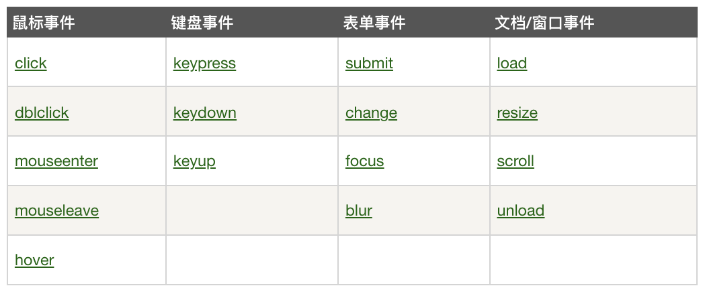
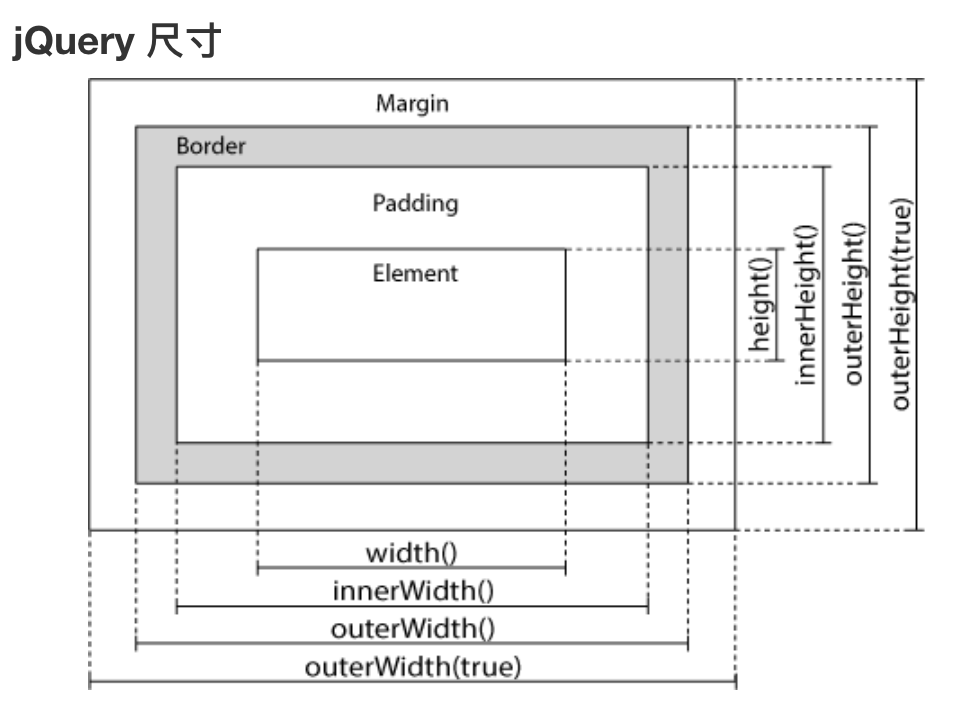

# jQuery

1.  [jQuery简介](#jquery简介)
2.  [jQuery基础](#jquery基础)

## jQuery简介

jQuery是一个JavaScript库，极大地简化了JavaScript编程。

jQuery库包含以下功能：

*   HTML元素选取，HTML元素操作，HTML事件函数，HTML DOM遍历和修改。
*   CSS操作。
*   JavaScript特效和动画。
*   AJAX。

使用CDN库的基本HTML源文件：

*   src: jquery-example/jquery-base.html

jQuery语法：jQuery语法是通过选取HTML元素，并对选取的元素执行某些操作。

```javascript
$(selector).action()
```

文档就绪事件：防止文档在完全加载（就绪）之前运行jQuery代码，即在DOM加载完成后才可以对DOM进行操作。

*   jQuery的入口函数是在HTML所有标签都加载之后，就会去执行。JavaScript的window.onload事件是等到所有内容，包括外部图片之类的文件加载完成后，才会执行。

```javascript
/* 完整写法 */
$(document).ready(function () {
  // 开始写 jQuery 代码
});
/* 简洁写法 */
$(function () {
  // 开始写 jQuery 代码
});
```

jQuery选择器：

*   允许你对HTML元素组或单个元素进行操作。
*   jQuery选择器基于已经存在的CSS选择器，除此之外，还有一些自定义的选择器。

```javascript
/* 元素选择器 */
$('p')
/* ID 选择器 */
$('#test')
/* Class 选择器 */
$('.test')
/* 当前元素选择器 */
$(this)
```

事件：

*   

```javascript
// click 单击元素时触发
$(function () {
  $('p').click(function () {
    $(this).hide();
  });
});
// dblclick 双击元素时触发
$(function () {
  $('p').dblclick(function () {
    $(this).hide();
  });
});
// mouseenter 鼠标指针穿过元素时触发
// mouseleave 鼠标指针离开元素时触发
// mousedown  鼠标指针在元素上按下时触发
// mouseup    鼠标指针在元素上松开时触发
// hover = mouseenter + mouseleave
$(function () {
  $('#p1').hover(
    function () {
      alert('穿过元素');
    },
    function () {
      alert('离开元素');
    }
  );
});
// focus 元素获取焦点时触发
// blur  元素失去焦点时触发
$(function () {
  $('input').focus(function () {
    $(this).css('background-color', '#ccc');
  });
  $('input').blur(function () {
    $(this).css('background-color', '#fff');
  });
});
```

## jQuery基础

jQuery效果：

*   src: jquery-example/jquery-effect-methods.html

```javascript
/**
 * 显示和隐藏
 * $(selector).hide(speed, callback);
 * $(selector).show(speed, callback);
 * $(selector).toggle(speed, callback);
 *
 * 淡入和淡出
 * $(selector).fadeIn(speed, callback);
 * $(selector).fadeOut(speed, callback);
 * $(selector).fadeToggle(speed, callback);
 * $(selector).fadeTo(speed, opacity, callback);
 *
 * 向上滑动和向下滑动
 * $(selector).slideDown(speed, callback);
 * $(selector).slideUp(speed, callback);
 * $(selector).slideToggle(speed,callback);
 *
 * 动画
 * $(selector).animate({params}, speed, callback);
 *
 * 停止动画：适用于所有效果函数
 * $(selector).stop(stopAll, goToEnd);
 *
 * 链
 * $(selector).action1().action2().action3();
 *
 * speed    可以取以下值：'slow'、'fast'或毫秒
 * callback jQuery函数运行完成后所执行的函数
 */
```

jQuery DOM操作：

*   jQuery中非常重要的部分，就是操作DOM的能力。jQuery提供一系列与DOM相关的方法，这使访问和操作元素和属性变得很容易。
*   
*   src: jquery-example/jquery-manipulation-methods.html

```javascript
/**
 * 捕获
 * $(selector).text();
 * $(selector).html();
 * $(selector).val();
 * $(selector).attr(attr_name);
 *
 * 设置
 * $(selector).text(new_value);
 * $(selector).html(new_html_statement);
 * $(selector).val(new_value);
 * $(selector).attr(attr_name, new_value);
 * 
 * 添加元素：支持添加若干新元素
 * $(selector).append(new_value);
 * $(selector).prepend(new_value);
 * $(selector).after(new_value);
 * $(selector).before(new_value);
 * 
 * 删除元素
 * $(selector).remove();
 * $(selector).empty();
 *
 * 操作 CSS
 * $(selector).addClass(class_name);
 * $(selector).removeClass(class_name);
 * $(selector).toggleClass(class_name);
 * $(selector).css({attr_name: value, attr_name: value});
 *
 * jQuery 尺寸
 * $(selector).width();
 * $(selector).height();
 * $(selector).innerWidth();
 * $(selector).innerHeight();
 * $(selector).outerWidth();
 * $(selector).outerHeight();
 */
```

jQuery 遍历：

*   通过jQuery遍历，能够从被选（当前的）元素开始，轻松地在家族树中向上移动（祖先），向下移动（子孙），水平移动（同胞），这种移动被称为对DOM进行遍历。
*   src: jquery-example/jquery-traversal.html

```javascript
/**
 * 祖先
 * $(selector).parent();
 * $(selector).parents();
 * $(selector).parentsUntil();
 *
 * 后代
 * $(selector).children();
 * $(selector).find();
 *
 * 同胞
 * $(selector).siblings();
 * $(selector).next();
 * $(selector).nextAll();
 * $(selector).nextUntil();
 * $(selector).prev();
 * $(selector).prevAll();
 * $(selector).prevUntil();
 *
 * 过滤
 * $(selector).first();
 * $(selector).last();
 * $(selector).eq();
 * $(selector).filter();
 * $(selector).not();
 */
```

AJAX（Asynchronous JavaScript and XML）：

*   AJAX是与服务器交换数据的技术，它在不重载全部页面的情况下，实现了对部分网页的更新。
*   jQuery提供多个与AJAX有关的方法。通过jQuery AJAX方法，能够使用HTTP Get和HTTP Post从远程服务器上请求文本、HTML、XML或JSON，同时能够把外部数据直接载入网页的被选元素中。
*   两种在客户端和服务器端进行请求-响应的常用方法是：GET（从指定的资源请求数据）和POST（向指定的资源提交要处理的数据）。
*   src: open django_example project and run it, then visit localhost:8000/jquery-example/ajax

```javascript
/**
 * $(selector).load();
 * $.get();
 * $.post();
 */
```
