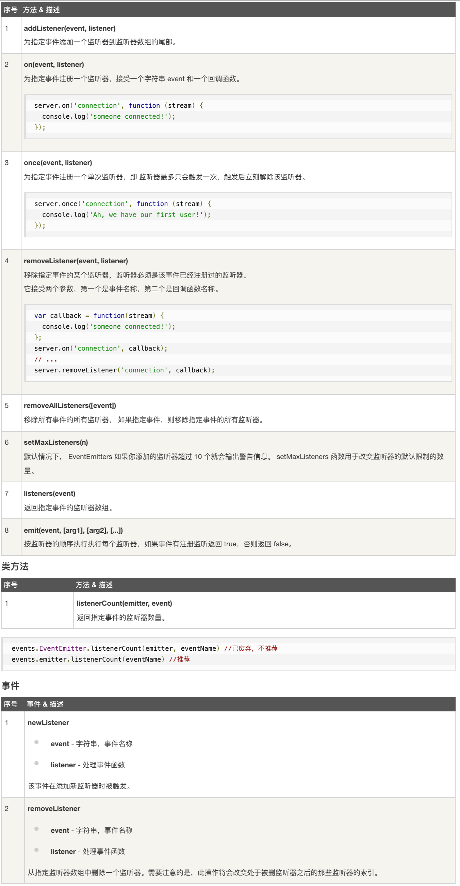

# Node

1.  [Node简介](#node简介)
2.  [Node基础](#node基础)

## Node简介

简单的说Node.js就是运行在服务端的JavaScript。Node.js是一个基于Chrome JavaScript运行时建立的一个平台。Node.js是一个事件驱动I/O服务端JavaScript环境，基于Google的V8引擎，V8引擎执行Javascript的速度非常快，性能非常好。

Node应用的组成：

*   引入required模块：我们可以使用`require`指令来载入Node.js模块。
*   创建服务器：服务器可以监听客户端的请求，类似于Apache、Nginx等HTTP服务器。
*   接收请求与响应请求：服务器很容易创建，客户端可以使用浏览器或终端发送HTTP请求，服务器接收请求后返回响应数据。

NPM：随同NodeJS一起安装的包管理工具，能解决NodeJS代码部署上的很多问题。

*   允许用户从NPM服务器下载别人编写的第三方包到本地使用。
*   允许用户从NPM服务器下载并安装别人编写的命令行程序到本地使用。
*   允许用户将自己编写的包或命令行程序上传到NPM服务器供别人使用。

Read Eval Print Loop（交互式解释器）：表示一个电脑的环境，类似Window系统的终端或Unix/Linux shell，我们可以在终端中输入命令，并接收系统的响应。

回调函数：异步编程依托于回调来实现，但不能说使用了回调后程序就异步化了。回调函数在完成任务后就会被调用，Node使用了大量的回调函数，Node所有API都支持回调函数。

```javascript
/* 阻塞代码实例 */
let fs = require('fs');

let data = fs.readFileSync('input.txt');

console.log(data.toString());
console.log('程序执行结束!');

/* 非阻塞代码实例 */
let fs = require('fs');

fs.readFile('input.txt', function (err, data) {
    if (err) return console.error(err);
    console.log(data.toString());
});

console.log('程序执行结束!');
```

## Node基础

事件循环：

*   Node.js是单进程单线程应用程序，但是因为V8引擎提供的异步执行回调接口，通过这些接口可以处理大量的并发，所以性能非常高。
*   Node.js基本上所有的事件机制都是用设计模式中观察者模式实现。
*   Node.js单线程类似进入一个while(true)的事件循环，直到没有事件观察者退出，每个异步事件都生成一个事件观察者，如果有事件发生就调用该回调函数。
*   事件驱动程序：在事件驱动模型中，会生成一个主循环来监听事件，当检测到事件时触发回调函数。
*   

```javascript
// 引入 events 模块
let events = require('events');
// 创建 eventEmitter 对象
let eventEmitter = new events.EventEmitter();
 
// 创建事件处理程序
let connectHandler = function connected() {
   console.log('连接成功。');
  
   // 触发 data_received 事件 
   eventEmitter.emit('data_received');
}
 
// 绑定 connection 事件处理程序
eventEmitter.on('connection', connectHandler);
 
// 使用匿名函数绑定 data_received 事件
eventEmitter.on('data_received', function (){
   console.log('数据接收成功。');
});
 
// 触发 connection 事件 
eventEmitter.emit('connection');
 
console.log('程序执行完毕。');
```

EventEmitter：

*   Node.js所有的异步I/O操作在完成时都会发送一个事件到事件队列。
*   Node.js里面的许多对象都会分发事件：一个net.Server对象会在每次有新连接时触发一个事件，一个fs.readStream对象会在文件被打开的时候触发一个事件。所有这些产生事件的对象都是events.EventEmitter的实例。
*   

```javascript
let events = require('events');
let eventEmitter = new events.EventEmitter();
// 监听器 #1
let listener1 = function listener1() {
   console.log('监听器 listener1 执行。');
}
// 监听器 #2
let listener2 = function listener2() {
  console.log('监听器 listener2 执行。');
}
// 绑定 connection 事件，处理函数为 listener1 
eventEmitter.addListener('connection', listener1);
// 绑定 connection 事件，处理函数为 listener2
eventEmitter.on('connection', listener2);
let eventListeners = eventEmitter.listenerCount('connection');
console.log(eventListeners + ' 个监听器监听连接事件。');
// 处理 connection 事件 
eventEmitter.emit('connection');
// 移除监绑定的 listener1 函数
eventEmitter.removeListener('connection', listener1);
console.log('listener1 不再受监听。');
// 触发连接事件
eventEmitter.emit('connection');
eventListeners = eventEmitter.listenerCount('connection');
console.log(eventListeners + ' 个监听器监听连接事件。');
console.log('程序执行完毕。');
```

Buffer：

*   JavaScript语言自身只有字符串数据类型，没有二进制数据类型。但在处理像TCP流或文件流时，必须使用到二进制数据。因此在Node.js中，定义了一个`Buffer`类，该类用来创建一个专门存放二进制数据的缓存区。
*   在Node.js中，Buffer类是随Node内核一起发布的核心库。Buffer库为Node.js带来了一种存储原始数据的方法，可以让Node.js处理二进制数据，每当需要在Node.js中处理I/O操作中移动的数据时，就有可能使用Buffer库。原始数据存储在Buffer类的实例中。一个Buffer类似于一个整数数组，但它对应于V8堆内存之外的一块原始内存。
*   Node.js目前支持的字符编码包括：ascii，utf-8，utf16le，ucs2，base64，latin1，binary，hex。

```javascript
/**
 * 创建 Buffer 类
 *   Buffer.alloc(size[, fill[, encoding]])：返回一个指定大小的 Buffer 实例，如果没有设置 fill，则默认填满 0
 *   Buffer.allocUnsafe(size)：返回一个指定大小的 Buffer 实例，但是它不会被初始化，所以它可能包含敏感的数据
 *   Buffer.allocUnsafeSlow(size)
 *   Buffer.from(array)：返回一个被 array 的值初始化的新的 Buffer 实例（传入的 array 的元素只能是数字，不然就会自动被 0 覆盖）
 *   Buffer.from(arrayBuffer[, byteOffset[, length]])：返回一个新建的与给定的 ArrayBuffer 共享同一内存的 Buffer
 *   Buffer.from(buffer)：复制传入的 Buffer 实例的数据，并返回一个新的 Buffer 实例
 *   Buffer.from(string[, encoding])：返回一个被string的值初始化的新的 Buffer 实例
 */
let buf;
// 创建一个长度为 10、且用 0 填充的 Buffer。
buf = Buffer.alloc(10);
// 创建一个长度为 10、且用 0x1 填充的 Buffer。 
buf = Buffer.alloc(10, 1);
// 创建一个长度为 10、且未初始化的 Buffer。
// 这个方法比调用 Buffer.alloc() 更快，
// 但返回的 Buffer 实例可能包含旧数据，
// 因此需要使用 fill() 或 write() 重写。
buf = Buffer.allocUnsafe(10);
// 创建一个包含 [0x1, 0x2, 0x3] 的 Buffer。
buf = Buffer.from([1, 2, 3]);
// 创建一个包含 UTF-8 字节 [0x74, 0xc3, 0xa9, 0x73, 0x74] 的 Buffer。
buf = Buffer.from('tést');
// 创建一个包含 Latin-1 字节 [0x74, 0xe9, 0x73, 0x74] 的 Buffer。
buf = Buffer.from('tést', 'latin1');
/**
 * 写入缓冲区
 * buf.write(string[, offset[, length]][, encoding])
 * 
 *   string - 写入缓冲区的字符串
 *   offset - 缓冲区开始写入的索引值，默认为 0
 *   length - 写入的字节数，默认为 buffer.length
 *   encoding - 使用的编码默认为 'utf8'
 */
let buf = Buffer.alloc(256);
let len = buf.write('www.runoob.com');
console.log('写入字节数 : ' + len);  // len = 14
/**
 * 从缓冲区读取数据 
 * buf.toString([encoding[, start[, end]]])
 * 
 *   encoding - 使用的编码默认为 'utf8'
 *   start - 指定开始读取的索引位置，默认为 0
 *   end - 结束位置，默认为缓冲区的末尾
 */
let buf = Buffer.alloc(26);
for (let i = 0 ; i < 26 ; i++) {
  buf[i] = i + 97;
}
console.log(buf.toString('ascii'));           // 输出：abcdefghijklmnopqrstuvwxyz
console.log(buf.toString('ascii', 0, 5));     // 使用 'ascii' 编码，并输出：abcde
console.log(buf.toString('utf8', 0, 5));      // 使用 'utf8' 编码，并输出：abcde
console.log(buf.toString(undefined, 0 , 5));  // 使用默认的 'utf8' 编码，并输出：abcde
/**
 * 将 Buffer 转换为 JSON 对象
 * buf.toJSON()
 */
let buf = Buffer.from([0x1, 0x2, 0x3, 0x4, 0x5]);
const json = JSON.stringify(buf);  // JSON.stringify() 会隐式地调用 toJSON()
console.log(json);  // 输出：{"type":"Buffer","data":[1,2,3,4,5]}
const copy = JSON.parse(json, (key, value) => {
  return value && value.type === 'Buffer' ?
    Buffer.from(value.data) :
    value;
});
console.log(copy);  // 输出：<Buffer 01 02 03 04 05>
/**
 * 缓冲区合并
 * Buffer.concat(list[, totalLength])
 *
 *   list - 用于合并的 Buffer 对象数组列表
 *   totalLength - 指定合并后 Buffer 对象的总长度
 */
let buffer1 = Buffer.from(('菜鸟教程'));
let buffer2 = Buffer.from(('www.runoob.com'));
let buffer3 = Buffer.concat([buffer1,buffer2]);
console.log('buffer3 内容: ' + buffer3.toString());
/**
 * 缓冲区比较
 * buf.compare(otherBuffer)
 */
let buffer1 = Buffer.from('ABC');
let buffer2 = Buffer.from('ABCD');
let result = buffer1.compare(buffer2);
// 输出结果是：ABC 在 ABCD 之前
if (result < 0) {
   console.log(buffer1 + ' 在 ' + buffer2 + '之前');
} else if (result == 0){
   console.log(buffer1 + ' 与 ' + buffer2 + '相同');
} else {
   console.log(buffer1 + ' 在 ' + buffer2 + '之后');
}
/**
 * 拷贝缓冲区
 * buf.copy(targetBuffer[, targetStart[, sourceStart[, sourceEnd]]])
 * 
 *   targetBuffer - 要拷贝的 Buffer 对象
 *   targetStart - 数字，可选，默认：0
 *   sourceStart - 数字，可选，默认：0
 *   sourceEnd - 数字，可选，默认：buffer.length
 */
let buf1 = Buffer.from('abcdefghijkl');
let buf2 = Buffer.from('RUNOOB');
buf2.copy(buf1, 2);  // 将 buf2 插入到 buf1 指定位置上
console.log(buf1.toString());  // buf1 = abRUNOOBijkl
/**
 * 缓冲区裁剪
 * buf.slice([start[, end]])
 */
let buffer1 = Buffer.from('runoob');
let buffer2 = buffer1.slice(0, 2);
console.log('buffer2 content: ' + buffer2.toString());
/* 缓冲区长度：buf.length */
```

Stream：

*   Stream是一个抽象接口，Node中有很多对象实现了这个接口。
*   Stream有四种流类型：Readable，Writable，Duplex，Transform。
*   所有Stream对象都是EventEmitter的实例，常用的事件有：data，end，error，finish。
*   管道流：管道提供了一个输出流到输入流的机制。通常用于从一个流中获取数据并将数据传递到另外一个流中。
*   链式流：链式是通过连接输出流到另外一个流并创建多个流操作链的机制。

```javascript
/* 从流中读取数据 */
let fs = require('fs');
let data = '';
// 创建可读流
let readerStream = fs.createReadStream('input.txt');
// 设置编码为 utf-8
readerStream.setEncoding('utf8');
// 处理流事件
readerStream.on('data', function (chunk) {  // 当有数据可读时触发
  data += chunk;
});
readerStream.on('end', function () {  // 没有更多的数据可读时触发
  console.log(data);
});
readerStream.on('error', function (err) {
  console.log(err.stack);
});
console.log('程序执行完毕');
/* 写入流 */
let fs = require('fs');
let data = '菜鸟教程官网地址：www.runoob.com';
// 创建一个可以写入的流，写入到文件 output.txt 中
let writerStream = fs.createWriteStream('output.txt');
// 使用 utf8 编码写入数据
writerStream.write(data, 'utf8');
// 标记文件末尾
writerStream.end();
// 处理流事件
writerStream.on('finish', function () {  // 所有数据已被写入到底层系统时触发
  console.log('写入完成');
});
writerStream.on('error', function (err) {
  console.log(err.stack);
});
console.log('程序执行完毕');
/* 管道流 */
let fs = require('fs');
// 创建一个可读流
let readerStream = fs.createReadStream('input.txt');
// 创建一个可写流
let writerStream = fs.createWriteStream('output.txt');
// 管道读写操作
// 读取 input.txt 文件内容，并将内容写入到 output.txt 文件中
readerStream.pipe(writerStream);
console.log('程序执行完毕');
/* 链式流：压缩文件 */
let fs = require('fs');
let zlib = require('zlib');
// 压缩 input.txt 文件为 input.txt.gz
fs.createReadStream('input.txt')
  .pipe(zlib.createGzip())
  .pipe(fs.createWriteStream('input.txt.gz'));
console.log('文件压缩完成');
/* 链式流：解压文件 */
let fs = require('fs');
let zlib = require('zlib');
// 解压 input.txt.gz 文件为 input.txt
fs.createReadStream('input.txt.gz')
  .pipe(zlib.createGunzip())
  .pipe(fs.createWriteStream('input.txt'));
console.log('文件解压完成');
```

模块系统：

*   为了让Node.js的文件可以相互调用，Node.js提供了一个简单的模块系统。
*   模块是Node.js应用程序的基本组成部分，文件和模块是一一对应的。换言之，一个Node.js文件就是一个模块，这个文件可能是JavaScript代码、JSON或者编译过的C/C++扩展。
*   Node.js默认支持2种模块：
    *   核心模块（Core Modules）：编译成二进制，其源码位于`lib/`目录下。
    *   文件模块（File Modules）：包括JavaScript文件、JSON文件，C++扩展文件（.node）。
*   模块加载：
    *   
    *   从文件模块缓存中加载：尽管原生模块与文件模块的优先级不同，但是都会优先从文件模块的缓存中加载已经存在的模块。
    *   从原生模块加载：原生模块的优先级仅次于文件模块缓存的优先级。require文件在解析文件名之后，优先检查模块是否在原生模块列表中。以http模块为例，尽管在目录下存在一个`http, http.js, http.node, http.json`文件，`require('http')`都不会从这些文件中加载，而是从原生模块中加载。原生模块也有一个缓存区，同样也是优先从缓存区加载。如果缓存区没有被加载过，则调用原生模块的加载方式进行加载和执行。
    *   从文件加载：当文件模块缓存中不存在，而且不是原生模块的时候，Node.js会解析require方法传入的参数，并从文件系统中加载实际的文件。

```javascript
/* 引入模块：单个对象封装在模块中 */
// hello.js
function Hello() {
  let name;
  this.setName = function (thyName) {
    name = thyName;
  };
  this.sayHello = function () {
    console.log('Hello ' + name);
  };
}
module.exports = Hello;
// main.js
let Hello = require('./hello');
let hello = new Hello();
hello.setName('BYVoid');
hello.sayHello();
/* 引入模块：多个对象封装在模块中 */
// hello.js
function HelloWorld() {
  console.log('Hello World');
}
function HelloRunoob() {
  console.log('Hello Runoob');
}
exports.world = HelloWorld;
exports.runoob = HelloRunoob;
// main.js
let hello = require('./hello');
hello.world();
hello.runoob();
```

路由：要为路由提供请求的URL和其他需要的GET及POST参数，随后路由需要根据这些数据来执行相应的代码。

```javascript
// server.js
let http = require('http');
let { URL } = require('url');
let events = require('events');

function start(route) {
  function onRequest(request, response) {
    let baseURL = 'http://' + request.headers.host + '/';
    let myURL = new URL(request.url, baseURL);
    let pathname = myURL.pathname;

    console.log('Request for ' + pathname + ' received.');

    route(pathname);

    pathname = pathname.slice(1);  // 删除开头的 '/'
    pathname = pathname.replace(pathname[0], pathname[0].toUpperCase());  // 首字母大写

    response.writeHead(200, {'Content-Type': 'text/plain'});
    response.write('Hello ' + pathname);
    response.end();
  }

  http.createServer(onRequest).listen(8888);
  console.log('Server has started.');
}

exports.start = start;

// router.js
function route(pathname) {
  console.log('About to route a request for ' + pathname);
}

exports.route = route;

// index.js
let server = require('./server');
let router = require('./router');

server.start(router.route);
```

全局对象（Global Object）：

*   JavaScript中有一个特殊的对象，称为全局对象，它及其所有属性（全局变量）都可以在程序的任何地方访问。
*   在浏览器JavaScript中，通常window是全局对象，而Node.js中的全局对象是global，所有全局变量都是global对象的属性。
*   在Node.js中我们可以直接访问到global的属性，而不需要在应用中包含它。
*   最好不要使用`var`定义变量以避免引入全局变量，因为全局变量会污染命名空间，提高代码的耦合风险。

```javascript
/* 文件属性 */
console.log(__filename);  // 当前正在执行的脚本的文件名
console.log(__dirname);   // 当前执行脚本所在的目录
/* 全局属性 */
// setTimeout()：在指定毫秒数后执行指定函数
setTimeout(function () { console.log('Hello'); }, 2000);
// clearTimeout()
let t = setTimeout(function () { console.log('Hello'); }, 2000);
clearTimeout(t);
// setInterval()：反复执行
setInterval(function () { console.log('Hello'); }, 2000);
// clearInterval()
let t = setInterval(function () { console.log('Hello'); }, 2000);
clearInterval(t);
// console 对象
console.log('Hello');
console.info('Hello');
console.error('Hello');
console.warn('Hello');
console.dir(obj);
console.time('label');
console.timeEnd('label');
console.trace('Hello');  // 打印当前执行的代码在堆栈中的调用路径
console.assert(exp, 'Hello');  // 当 exp 为 false时，才输出 Hello
// console-example.js
console.info('程序开始执行：');
let counter = 10;
console.log('计数：%d', counter);
console.time('获取数据');
(function () {
  for (let i = 0; i < 100000000; i++) {}
}());
console.timeEnd('获取数据');
console.info('程序执行完毕');
// process 的事件和退出状态码
//   exit 事件：当进程准备退出时触发
//   beforeExit 事件：当 Node 清空事件循环，并且没有其他安排时触发这个事件
//   uncaughtException 事件：当一个异常冒泡回到事件循环，触发这个事件
//   Signal 事件：当进程接收到信号时就触发
//   退出状态码（Exit Code）：进程退出时的状态，是个整数
process.on('exit', function (code) {
  // 以下代码永远不会执行
  setTimeout(function () {
    console.log('该代码不会执行');
  }, 0);
  
  console.log('退出码为：', code);
});
process.on('beforeExit', (code) => {
   console.log('Process beforeExit event with code:', code);
});
// process 属性
//   stdout stderr stdin
//   argv
//   execPath：返回执行当前脚步的 Node 二进制文件的绝对路径
//   pid：当前进程的进程号
//   platform：运行程序所在的平台
//   version：Node 的版本
process.stdout.write('Hello World!' + '\n');  // 输出到终端
process.argv.forEach(function (val, index, array) {  // 通过参数读取
   console.log(index + ': ' + val);
});
console.log(process.execPath);  // 获取执行路径
console.log(process.platform);  // 平台信息
// process方法
//   abort()：导致 Node 触发 abort 事件
//   chdir()：改变当前工作进程的目录
//   cwd()：返回当前进程的工作目录
//   exit()：使用指定的 code 结束进程
console.log('当前目录：' + process.cwd());  // 输出当前目录
console.log(process.memoryUsage());  // 输出内存使用情况
```

常用工具：util是一个Node.js核心模块，提供常用函数的集合，用于弥补核心JavaScript的功能过于精简的不足。

```javascript
let util = require('util');

// callbackify()：将 async 异步函数（或者一个返回值为 Promise 的函数）转换成遵循异常优先的回调风格的函数。
function call(err, ret) {
  if (err) console.log(err);
  console.log(ret);
}

async function fn1() {
  return 'Hello World';
};

const callbackFunction1 = util.callbackify(fn1);

callbackFunction1(call);

async function fn2() {
  throw Error();
};

const callbackFunction2 = util.callbackify(fn2);

callbackFunction2(call);

// inherits()：实现对象间原型继承的函数
let util = require('util');
function Base() {
  this.name = 'base';
  this.sayHello = function () {
    console.log('Hello ' + this.name);
  };
}
Base.prototype.showName = function () {
  console.log(this.name);
}
function Sub() {
  this.name = 'sub';
}
util.inherits(Sub, Base);

let objBase = new Base();
objBase.showName();
objBase.sayHello();
console.log(objBase);

let objSub = new Sub();
objSub.showName();
// objSub.sayHello(); 不能继承非原型的属性
console.log(objSub);

// inspect()：将任意对象对象转换为字符串的方法
let util = require('util');
function Base() {
  this.name = 'base';
  this.sayHello = function () {
    console.log('Hello ' + this.name);
  };
}
let obj = new Base();
console.log(util.inspect(obj));
console.log(util.inspect(obj, true));  // 设置 true，会显示更多内容

// isArray()

// isRegExp()

// isDate()
```

文件系统：

*   Node.js提供一组类似UNIX（POSIX）标准的文件操作API。
*   Node.js文件系统（fs模块）模块中的方法均有异步和同步版本，例如读取文件内容的函数有异步的`fs.readFile()`和同步的`fs.readFileSync()`。异步的方法函数最后一个参数为回调函数，回调函数的第一个参数包含了错误信息（error）。建议大家使用异步方法，比起同步，异步方法性能更高，速度更快，而且没有阻塞。

```javascript
/* 异步和同步 */
let fs = require('fs');
fs.readFile('input.txt', function (err, data) {  // 异步读取
  if (err) {
    return console.error(err);
  }
  console.log('异步读取：' + data.toString());
});
let data = fs.readFileSync('input.txt');  // 同步读取
console.log('同步读取：' + data.toString());
console.log('程序执行完毕');
/* 文件系统内函数 */
// open()：异步模式下打开文件
let fs = require('fs');
console.log('准备打开文件！');
fs.open('input.txt', 'r+', function (err, fd) {
  if (err) {
    return console.error(err);
  }
  console.log('文件打开成功！');
});
// stat()：异步模式下获取文件信息
let fs = require('fs');
fs.stat('./main.js', function (err, stats) {
  // console.log(stats);
  // console.log(stats.isDirectory());
  console.log(stats.isFile());
})
// read()：通过文件描述符 fd 读取文件内容
let fs = require('fs');
let buf = new Buffer.alloc(1024);
console.log('准备打开已存在的文件！');
fs.open('input.txt', 'r+', function (err, fd) {
  if (err) {
    return console.error(err);
  }
  console.log('文件打开成功！');
  console.log('准备读取文件：');
  fs.read(fd, buf, 0, buf.length, 0, function (err, bytes) {
    if (err) {
      return console.log(err);
    }
    console.log(bytes + ' 字节被读取');
    // 仅输出读取的字节
    if(bytes > 0) {
      console.log(buf.slice(0, bytes).toString());
    }
  });
});
// write()：通过文件描述符 fd 写入文件内容
let fs = require('fs');
let buf = new Buffer.from('我是通过 fs.write 写入文件的内容');
console.log('准备打开文件！');
fs.open('output.txt', 'w+', function (err, fd) {
  if (err) {
    return console.error(err);
  }
  console.log('文件打开成功！');
  console.log('准备写入文件：');
  fs.write(fd, buf, 0, buf.length, 0, function (err, bytes) {
    if (err) {
      return console.log(err);
    }
    console.log(bytes + ' 字节被写入');
    // 仅输出写入的字节
    if(bytes > 0) {
      console.log(buf.slice(0, bytes).toString());
    }
  });
});
// close()：异步模式下关闭文件
let fs = require('fs');
let buf = new Buffer.alloc(1024);
console.log('准备打开文件！');
fs.open('input.txt', 'r+', function (err, fd) {
  if (err) {
    return console.error(err);
  }
  console.log('文件打开成功！');
  console.log('准备读取文件！');
  fs.read(fd, buf, 0, buf.length, 0, function (err, bytes) {
    if (err) {
      console.log(err);
    }
    // 仅输出读取的字节
    if (bytes > 0) {
      console.log(buf.slice(0, bytes).toString());
    }
    // 关闭文件
    fs.close(fd, function (err) {
      if (err) {
        console.log(err);
      }
      console.log('文件关闭成功');
    });
  });
});
// readFile() 和 writeFile()：异步模式下读入和写入文件
let fs = require('fs');
console.log('准备写入文件');
fs.writeFile('input.txt', '我是通过 fs.writeFile 写入文件的内容', function (err) {
  if (err) {
    return console.error(err);
  }
  console.log('数据写入成功！');
  console.log('--------我是分割线-------------');
  console.log('读取写入的数据！');
  fs.readFile('input.txt', function (err, data) {
    if (err) {
      return console.error(err);
    }
    console.log('异步读取文件数据：' + data.toString());
  });
});
// ftruncate()：异步模式下截取文件
let fs = require('fs');
let buf = new Buffer.alloc(1024);
console.log('准备打开文件！');
fs.open('input.txt', 'r+', function (err, fd) {
  if (err) {
    return console.error(err);
  }
  console.log('文件打开成功！');
  console.log('截取10字节内的文件内容，超出部分将被去除');
  
  // 截取文件
  fs.ftruncate(fd, 10, function (err) {
    if (err) {
      console.log(err);
    } 
    console.log('文件截取成功');
    console.log('读取相同的文件');
    fs.read(fd, buf, 0, buf.length, 0, function (err, bytes) {
      if (err) {
        console.log(err);
      }
      // 仅输出读取的字节
      if (bytes > 0) {
        console.log(buf.slice(0, bytes).toString());
      }
      // 关闭文件
      fs.close(fd, function (err) {
        if (err) {
          console.log(err);
        }
        console.log('文件关闭成功！');
      });
    });
  });
});
// unlink()：异步模式下删除文件
let fs = require('fs');
console.log('准备删除文件！');
fs.unlink('input.txt', function (err) {
  if (err) {
    return console.error(err);
  }
  console.log('文件删除成功！');
});
// mkdir()：异步模式下创建目录
let fs = require('fs');
console.log('创建目录 ./test/');
fs.mkdir('./test/', function (err) {
  if (err) {
    return console.error(err);
  }
  console.log('目录创建成功');
});
// readdir()：异步模式下读取目录
let fs = require('fs');
console.log('查看当前目录');
fs.readdir('./', function (err, files) {
  if (err) {
    return console.error(err);
  }
  files.forEach(function (file) {
    console.log(file);
  });
});
// rmdir()：异步模式下删除目录
let fs = require('fs');
console.log('准备删除目录 ./test/');
fs.rmdir('./test', function (err) {
  if (err) {
    return console.error(err);
  }
  console.log('目录删除成功');
});
```

GET和POST请求：

*   Get和Post的区别：
    *   GET把参数包含在URL中，POST通过request body传递参数。
    *   GET请求在URL中传送的参数是有长度限制的，而POST没有。
    *   GET比POST更不安全，因为参数直接暴露在URL上，所以不能用来传递敏感信息。
    *   GET请求只能进行url编码，而POST支持多种编码方式。
    *   GET请求参数会被完整保留在浏览器历史记录里，而POST中的参数不会被保留。
    *   对参数的数据类型，GET只接受ASCII字符，而POST没有限制。
    *   GET产生一个TCP数据包；POST产生两个TCP数据包。
*   Get，Put，Post，Delete：
    *   GET请求会向数据库发索取数据的请求，从而来获取信息，该请求就像数据库的select操作一样，只是用来查询一下数据，不会修改、增加数据，不会影响资源的内容，即该请求不会产生副作用。无论进行多少次操作，结果都是一样的。
    *   与GET不同的是，PUT请求是向服务器端发送数据的，从而改变信息，该请求就像数据库的update操作一样，用来修改数据的内容，但是不会增加数据的种类等，也就是说无论进行多少次PUT操作，其结果并没有不同。
    *   POST请求同PUT请求类似，都是向服务器端发送数据的，但是该请求会改变数据的种类等资源，就像数据库的insert操作一样，会创建新的内容。几乎目前所有的提交操作都是用POST请求的。
    *   DELETE请求顾名思义，就是用来删除某一个资源的，该请求就像数据库的delete操作。

```javascript
/* get */
let http = require('http');
let { URL } = require('url');
let util = require('util');
// 使用浏览器访问 http://localhost:3000/user?name=runoob&url=www.runoob.com 查看结果
http.createServer(function (req, res) {
  let baseURL = 'http://' + req.headers.host + '/';
  let myURL = new URL(req.url, baseURL);
  let params = myURL.searchParams;
  res.writeHead(200, {'Content-Type': 'text/plain; charset=utf-8'});
  res.write(util.inspect(myURL));
  res.write('\n');
  res.write('网站名：' + params.get('name'));
  res.write('\n');
  res.write('网站 URL：' + params.get('url'));
  res.end();
}).listen(3000);
/* post */
let http = require('http');
let querystring = require('querystring');
 
let postHTML = 
  '<html><head><meta charset="utf-8"><title>菜鸟教程 Node.js 实例</title></head>' +
  '<body>' +
  '<form method="post">' +
  '网站名： <input name="name"><br>' +
  '网站 URL： <input name="url"><br>' +
  '<input type="submit">' +
  '</form>' +
  '</body></html>';
 
http.createServer(function (req, res) {
  let body = '';
  req.on('data', function (chunk) {
    body += chunk;
  });
  req.on('end', function () {
    // 解析参数
    body = querystring.parse(body);
    // 设置响应头部信息及编码
    res.writeHead(200, {'Content-Type': 'text/html; charset=utf8'});
 
    if(body.name && body.url) {  // 输出提交的数据
      res.write('网站名：' + body.name);
      res.write('<br>');
      res.write('网站 URL：' + body.url);
    } else {   // 输出表单
      res.write(postHTML);
    }
    res.end();
  });
}).listen(3000);
```

工具模块：OS，Path，Net，DNS和Domain。

```javascript
/* OS：提供了一些基本的系统操作函数 */
let os = require('os');

console.log('endianness: ' + os.endianness());  // CPU 的字节序
console.log('type: ' + os.type());              // 操作系统名
console.log('platform: ' + os.platform());      // 操作系统名
console.log('total memory: ' + os.totalmem() + ' bytes');  // 系统内存总量
console.log('free memory: ' + os.freemem() + ' bytes');    // 操作系统空闲内存量

/* Path：提供了一些用于处理文件路径的小工具 */
let path = require('path');

console.log('normalization: ' + path.normalize('/test/test1//2slashes/1slash/..'));  // 格式化路径，规范化路径
console.log('joint path: ' + path.join('/test', 'test1', '2slashes/1slash', 'tab', '..'));  // 连接路径
console.log('resolve: ' + path.resolve('main.js'));                                  // 转换为绝对路径
console.log('ext name: ' + path.extname('main.js'));                                 // 路径中文件的后缀名

/* Net：用于底层的网络通信，提供了服务端和客户端的操作 */

// server.js
let net = require('net');
let server = net.createServer(function (connection) {
  console.log('client connected');
  connection.on('end', function () {
    console.log('客户端关闭连接');
  });
  connection.write('Hello World!\r\n');
  connection.pipe(connection);
});
server.listen(8080, function () {
  console.log('server is listening');
});

// client.js
let net = require('net');
let client = net.connect({port: 8080, host: 'localhost'}, function () {
  console.log('连接到服务器');
});
client.on('data', function (data) {
  console.log(data.toString());
  client.end();
});
client.on('end', function () {
  console.log('断开与服务器的连接');
});

/* DNS：用于解析域名 */
let dns = require('dns');

dns.lookup('www.github.com', function onLookup(err, address, family) {
  console.log('ip地址：', address);
  dns.reverse(address, function (err, hostnames) {
    if (err) {
      console.log(err.stack);
    }
    console.log('反向解析 ' + address + '：' + JSON.stringify(hostnames));
  })
});

/* Domain：简化异步代码的异常处理，可以捕捉处理 try-catch 无法捕获的 */
let EventEmitter = require('events').EventEmitter;
let domain = require('domain');

let emitter1 = new EventEmitter();

let domain1 = domain.create();  // 创建域

domain1.on('error', function (err) {
  console.log('domain1 处理这个错误（' + err.message + '）');
});

domain1.add(emitter1);  // 显式绑定

emitter1.on('error', function (err) {
  console.log('监听器处理此错误（' + err.message + '）');
});

emitter1.emit('error', new Error('通过监听器来处理'));

emitter1.removeAllListeners('error');

emitter1.emit('error', new Error('通过 domain1 处理'));

let domain2 = domain.create();

domain2.on('error', function (err) {
  console.log('domain2 处理这个错误（' + err.message + '）');
});

domain2.run(function () {  // 隐式绑定
  let emitter2 = new EventEmitter();
  emitter2.emit('error', new Error('通过 domain2 处理'));
});

domain1.remove(emitter1);
emitter1.emit('error', new Error('转换为异常，系统将崩溃'));
```

Web模块：

*   Web服务器一般指网站服务器，是指驻留于因特网上某种类型计算机的程序，Web服务器的基本功能就是提供Web信息浏览服务。它只需支持HTTP协议、HTML文档格式及URL，与客户端的网络浏览器配合。
*   大多数Web服务器都支持服务端的脚本语言（php，python，ruby）等，并通过脚本语言从数据库获取数据，将结果返回给客户端浏览器。
*   目前最主流的三个Web服务器是Apache、Nginx、IIS。
*   
*   Client：客户端，一般指浏览器，浏览器可以通过HTTP协议向服务器请求数据。
*   Server：服务端，一般指Web服务器，可以接收客户端请求，并向客户端发送响应数据。
*   Business：业务层，通过Web服务器处理应用程序，如与数据库交互，逻辑运算，调用外部程序等。
*   Data：数据层，一般由数据库组成。

```html
<!-- index.html -->
<!DOCTYPE html>
<html>
<head>
  <meta charset="utf-8">
  <title>菜鸟教程</title>
</head>
<body>
  <h1>我的第一个标题</h1>
  <p>我的第一个段落。</p>
</body>
</html>
```

```javascript
/* Web 服务器 */
let http = require('http');
let fs = require('fs');
let url = require('url');
// 创建服务器
http.createServer(function (request, response) {
  // 解析请求，包括文件名
  let baseURL = 'http://' + request.headers.host + '/';
  let myURL = new URL(request.url, baseURL);
  let pathname = myURL.pathname;
  // 输出请求的文件名
  console.log('Request for ' + pathname + ' received');
  // 从文件系统中读取请求的文件内容
  fs.readFile(pathname.substr(1), function (err, data) {
    if (err) {
      console.log(err);
      response.writeHead(404, {'Content-Type': 'text/html'});
    } else {
      response.writeHead(200, {'Content-Type': 'text/html'});
      response.write(data.toString());
    }
    // 发送响应数据
    response.end();
  });
}).listen(8080);
// 控制台会输出一下信息
console.log('Server running at http://127.0.0.1:8080/');
/* Web 客户端 */
let http = require('http');
let options = {
  host: 'localhost',
  port: '8080',
  path: '/index.html'
};
let callback = function (response) {
  // 不断更新数据
  let body = '';
  response.on('data', function (data) {
    body += data;
  });
  response.on('end', function () {
    // 数据接收完成
    console.log(body);
  });
};
// 想服务端发送请求
let req = http.request(options, callback);
req.end();
```

Express：

*   Express是一个简洁而灵活的Node.js Web应用框架，提供了一系列强大特性帮助你创建各种Web应用，和丰富的HTTP工具。使用Express可以快速地搭建一个完整功能的网站。
*   Express框架核心特性：可以设置中间件来响应HTTP请求。定义了路由表用于执行不同的HTTP请求动作。可以通过向模板传递参数来动态渲染HTML页面。
*   src: open express-example project and run it, then visit localhost:8081

```bash
npm install express --save
npm install body-parser --save
npm install cookie-parser --save
npm install multer --save
```

RESTful API：

*   REST即表述性状态传递（英文：Representational State Transfer，简称REST）是Roy Fielding博士在2000年他的博士论文中提出来的一种软件架构风格。
*   表述性状态转移是一组架构约束条件和原则。满足这些约束条件和原则的应用程序或设计就是RESTful。需要注意的是，REST是设计风格而不是标准。REST通常基于使用HTTP，URI，和XML（标准通用标记语言下的一个子集）以及HTML（标准通用标记语言下的一个应用）这些现有的广泛流行的协议和标准。REST通常使用JSON数据格式。
*   REST基本架构的四种方法：GET，PUT，DELETE，POST。
*   Web Service是一个平台独立的，低耦合的，自包含的、基于可编程的Web的应用程序，可使用开放的XML（标准通用标记语言下的一个子集）标准来描述、发布、发现、协调和配置这些应用程序，用于开发分布式的互操作的应用程序。基于REST架构的Web Services即是RESTful。
*   src: open express-restful project and run it, then visit localhost:8081

多进程：

*   Node.js是以单线程的模式运行的，但它使用的是事件驱动来处理并发，这样有助于我们在多核cpu的系统上创建多个子进程，从而提高性能。
*   每个子进程总是带有三个流对象：child.stdin、child.stdout和child.stderr。他们可能会共享父进程的stdio流，或者也可以是独立的被导流的流对象。
*   Node提供了`child_process`模块来创建子进程：
    *   exec：child_process.exec使用子进程执行命令，缓存子进程的输出，并将子进程的输出以回调函数参数的形式返回。
    *   spawn：child_process.spawn使用指定的命令行参数创建新进程。
    *   fork：child_process.fork是spawn()的特殊形式，用于在子进程中运行的模块，如`fork('./son.js')`相当于`spawn('node', ['./son.js'])` 。与spawn方法不同的是，fork会在父进程与子进程之间，建立一个通信管道，用于进程之间的通信。

```javascript
/* exec */
// master.js
let fs = require('fs');
let child_process = require('child_process');
for (let i = 0; i < 3; i++) {
  let workerProcess = child_process.exec('node support.js ' + i, function (error, stdout, stderr) {
    if (error) {
      console.log(error.stack);
      console.log('Error code: ' + error.code);
      console.log('Signal received: ' + error.signal);
    }
    console.log('stdout: ' + stdout);
  });
  workerProcess.on('exit', function (code) {
    console.log('子进程已退出，退出码：' + code);
  });
};
// support.js
console.log('进程 ' + process.argv[2] + ' 执行');
/* spawn */
// master.js
let fs = require('fs');
let child_process = require('child_process');
 
for (let i = 0; i < 3; i++) {
  let workerProcess = child_process.spawn('node', ['support.js', i]);
  workerProcess.stdout.on('data', function (data) {
    console.log('stdout: ' + data);
  });
  workerProcess.on('close', function (code) {
    console.log('子进程已退出，退出码：' + code);
  });
}
// support.js
console.log('进程 ' + process.argv[2] + ' 执行');
/* fork */
// master.js
let fs = require('fs');
let child_process = require('child_process');
 
for (let i = 0; i < 3; i++) {
  let workerProcess = child_process.fork('support.js', [i]);
  workerProcess.on('close', function (code) {
    console.log('子进程已退出，退出码：' + code);
  });
}
// support.js
console.log('进程 ' + process.argv[2] + ' 执行');
```

JXcore打包：

*   Node.js是一个开放源代码、跨平台的、用于服务器端和网络应用的运行环境。
*   JXcore是一个支持多线程的Node.js发行版本，基本不需要对你现有的代码做任何改动就可以直接线程安全地以多线程运行。

MySql和MongoDB：

```bash
npm install mysql --save
npm install mongodb --save
```

src: open node-example project and run it, then visit localhost:8888
