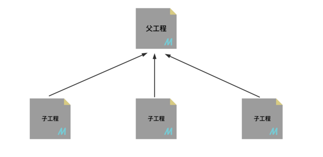
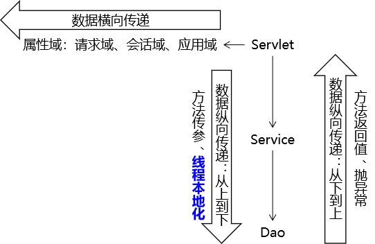

# Spring

## Maven入门和进阶

`Maven`简介：Maven是一款为Java项目构建管理、依赖管理的工具（软件），使用Maven可以自动化构建、测试、打包和发布项目，大大提高了开发效率和质量。

*   Maven主要作用：
    *   构建管理：
        *   项目构建是指将源代码、配置文件、资源文件等转化为能够运行或部署的应用程序或库的过程。
        *   Maven可以管理项目的编译、测试、打包、部署等构建过程。通过实现标准的构建生命周期，Maven可以确保每一个构建过程都遵循同样的规则和最佳实践。同时，Maven的插件机制也使得开发者可以对构建过程进行扩展和定制。主动触发构建，只需要简单的命令操作即可。
    *   依赖管理：
        *   Maven可以管理项目的依赖，包括自动下载所需依赖库、自动下载依赖需要的依赖并且保证版本没有冲突、依赖版本管理等。
        *   通过Maven，我们可以方便地维护项目所依赖的外部库，而我们仅仅需要编写配置即可。
*   Maven的安装和配置：
    *   安装前置条件：本机安装Java，配置`JAVA_HOME`环境变量并设置`PATH`环境变量。
    *   安装后：
        *   配置`MAVEN_HOME`环境变量，并将`maven`目录添加到`PATH`环境变量中。
        *   通过`mvn -v`命令验证是否安装成功。
        *   通过`maven/conf/settings.xml`文件配置Maven本地仓库路径（`<localRepository>`）、镜像源（`<mirror>`）。
        *   打开IDEA软件，选中`file/settings/build, execution, deployment/build tools/Maven`配置Maven相关信息。

基于IDEA的Maven工程创建：

*   Maven工程的GAVP属性：Maven中的GAVP是指GroupId、ArtifactId、Version、Packaging等四个属性的缩写，其中前三个是必要的，而Packaging属性为可选项。这四个属性主要为每个项目在maven仓库中做一个标识，类似人的姓名。
    *   `GroupId`：项目的唯一标识，通常以域名倒写的形式出现，格式为`com.公司名.业务线名.子业务线名`，如`com.taobao.tddl`或`com.alibaba.sourcing.multilang`。
    *   `ArtifactId`：项目的名称，通常以项目名称的形式出现，格式为`产品线名-模块名`，如`tc-client`、`uic-api`或`bookstore`。
    *   `Version`：项目的版本号，格式为`主版本号.次版本号.修订号`，如`1.0.0`或`2.1.1-SNAPSHOT`。
        *   主版本号：当产品有重大变化时，比如增加新功能或者废弃旧功能，则主版本号会增加。
        *   次版本号：当产品有重要变化时，比如增加新特性或者修复bug，则次版本号会增加。
        *   修订号：当产品有小的变动时，比如修复一个小bug，则修订号会增加。
    *   `Packaging`：项目的打包方式，IDEA会根据Packaging属性识别Maven项目类型。
        *   `jar`（默认值）：Java Archive，即Java归档文件，包含编译后的class文件和依赖库。
        *   `war`：Web Application Archive，即Web应用程序归档文件，包含编译后的class文件、Web资源文件和依赖库。
        *   `pom`：Project Object Model，即项目对象模型，包含项目的基本信息、依赖信息、插件信息等。
*   在IDEA中创建项目：
    *   通过`Empty Project`创建一个JavaSE项目。
    *   通过`New Project`创建一个Maven JavaSE项目。
    *   创建Maven JavaEE项目的两种方法：
        1.  创建Maven JavaSE项目，补全`webapp/WEB-INF/web.xml`，修改`pom.xml`文件中中的打包属性为`war`，刷新Maven工程。
        2.  创建Maven JavaSE项目，通过`JBLJavaToWeb`插件全速生成Maven JavaEE项目。
*   Maven工程的目录结构：

    ```txt
    |-- pom.xml                               # Maven 项目管理文件 
    |-- src
        |-- main                              # 项目主要代码
        |   |-- java                          # Java 源代码目录
        |   |   |-- com/example/myapp         # 开发者代码主目录
        |   |       |-- controller            # 存放 Controller 层代码的目录
        |   |       |-- service               # 存放 Service 层代码的目录
        |   |       |-- dao                   # 存放 DAO 层代码的目录
        |   |       |-- model                 # 存放数据模型的目录
        |   |-- resources                     # 资源目录，存放配置文件、静态资源等
        |   |   |-- log4j.properties          # 日志配置文件
        |   |   |-- spring-mybatis.xml        # Spring Mybatis 配置文件
        |   |   |-- static                    # 存放静态资源的目录
        |   |       |-- css                   # 存放 CSS 文件的目录
        |   |       |-- js                    # 存放 JavaScript 文件的目录
        |   |       |-- images                # 存放图片资源的目录
        |   |-- webapp                        # 存放 WEB 相关配置和资源
        |       |-- WEB-INF                   # 存放 WEB 应用配置文件
        |       |   |-- web.xml               # Web 应用的部署描述文件
        |       |   |-- classes               # 存放编译后的 class 文件
        |       |-- index.html                # Web 应用入口页面
        |-- test                              # 项目测试代码
            |-- java                          # 单元测试目录
            |-- resources                     # 测试资源目录
    ```

实现和理解Maven的依赖管理和构建管理：

*   `pom.xml`文件的基础配置和实现依赖管理：

    ```xml
    <?xml version="1.0" encoding="UTF-8"?>
    <project xmlns="http://maven.apache.org/POM/4.0.0"
      xmlns:xsi="http://www.w3.org/2001/XMLSchema-instance"
      xsi:schemaLocation="http://maven.apache.org/POM/4.0.0 https://maven.apache.org/xsd/maven-4.0.0.xsd">

      <!-- 模型版本 -->
      <modelVersion>4.0.0</modelVersion>
      <!-- 公司或者组织的唯一标志 -->
      <groupId>com.companyname.project-group</groupId>
      <!-- 项目的唯一 ID，一个 groupId 下面可能多个项目，就是靠 artifactId 来区分的 -->
      <artifactId>project</artifactId>
      <!-- 版本号 -->
      <version>1.0.0</version>
      <!-- 打包方式
        默认：jar
        - jar 指的是普通的 java 项目打包方式，项目打成 jar 包！
        - war 指的是 web 项目打包方式，项目打成 war 包！
        - pom 不会将项目打包，这个项目作为父工程，被其他工程聚合或者继承！
      -->
      <packaging>jar/pom/war</packaging>

      <!-- 声明版本 -->
      <properties>
        <!-- 命名随便，内部制定版本号即可 -->
        <junit.version>4.11</junit.version>
        <!-- 也可以通过 maven 规定的固定的 key 来配置maven的参数，如下配置编码格式 -->
        <project.build.sourceEncoding>UTF-8</project.build.sourceEncoding>
        <project.reporting.outputEncoding>UTF-8</project.reporting.outputEncoding>
      </properties>

      <!-- 
        通过编写依赖 jar 包的 gav 必要属性，引入第三方依赖！
        scope 属性是可选的，可以指定依赖生效范围！
        依赖信息可以通过 Maven 仓库官网（https://mvnrepository.com/）查询！
      -->
      <dependencies>
        <!-- 引入具体的依赖包 -->
        <dependency>
          <groupId>log4j</groupId>
          <artifactId>log4j</artifactId>
          <version>1.2.17</version>
          <!-- 依赖生效范围
            默认：compile
            - compile  依赖项在编译、测试和运行阶段都是可用的，这是最常见也是最适用于大多数库的依赖范围。
            - provided 依赖项在编译和测试阶段可用，但是在运行时不是必需的，因为容器或JDK会提供这个依赖，例如 Servlet API 和 JSP API 在运行时通常由 Servlet 容器提供。
            - runtime  依赖项在测试或运行时可用的，但是在编译时不是必需的，例如 JDBC 驱动程序或 JNDI 实现。
            - test     依赖项在测试阶段可用，但是在编译和运行时不是必需的，例如 JUnit 或 Mockito 这样的测试框架。
          -->
          <scope>runtime</scope>
        </dependency>

        <dependency>
          <groupId>junit</groupId>
          <artifactId>junit</artifactId>
          <!-- 引用 properties 声明版本 -->
          <version>${junit.version}</version>
        </dependency>
      </dependencies>
    </project>
    ```

*   依赖传递：
    *   依赖传递指的是当一个模块或库A依赖于另一个模块或库B，而B又依赖于模块或库C，那么A会间接依赖于C。这种依赖传递结构可以形成一个依赖树。当我们引入一个库或框架时，构建工具（如Maven、Gradle）会自动解析和加载其所有的直接和间接依赖，确保这些依赖都可用。
    *   依赖传递的作用：
        1.  减少重复依赖：当多个项目依赖同一个库时，Maven可以自动下载并且只下载一次该库。这样可以减少项目的构建时间和磁盘空间。
        2.  自动管理依赖: Maven可以自动管理依赖项，使用依赖传递，简化了依赖项的管理，使项目构建更加可靠和一致。
        3.  确保依赖版本正确性：通过依赖传递的依赖，之间都不会存在版本兼容性问题，确保依赖的版本正确性！
*   依赖冲突：
    *   当直接引用或者间接引用出现了版本不同的相同jar包，这时一个项目就会出现版本不同的重复jar包，这就算作冲突！依赖冲突避免出现重复依赖，并且终止依赖传递！
    *   依赖解析策略：
        1.  声明者优先原则：Maven默认使用此原则解析依赖冲突。当存在多个版本的同一依赖时，Maven会选择离当前项目“最近”的版本。这里的“最近”指的是依赖声明在pom.xml文件中的位置，后声明的依赖会覆盖先前声明的相同依赖。此外，如果一个子模块和它的父模块都指定了某个库的不同版本，则会采用子模块中指定的版本。
        2.  短路径优先原则：当一个间接依赖存在多条引入路径时，Maven会选择引入路径最短的依赖版本。
*   依赖导入失败场景和解决方案：
    *   依赖项下载错误情况：
        1.  下载依赖时出现网络故障或仓库服务器宕机等原因，导致无法连接至Maven仓库，从而无法下载依赖。
        2.  依赖项的版本号或配置文件中的版本号错误，或者依赖项没有正确定义，导致Maven下载的依赖项与实际需要的不一致，从而引发错误。
        3.  本地Maven仓库或缓存被污染或损坏，导致Maven无法正确地使用现有的依赖项，并且也无法重新下载！
    *   解决方案：
        1.  检查网络连接和Maven仓库服务器状态。
        2.  确保依赖项的版本号与项目对应的版本号匹配，并检查POM文件中的依赖项是否正确。
        3.  清除本地Maven仓库缓存（`xxx.lastUpdated`文件），因为只要存在`.lastupdated`缓存文件，刷新也不会重新下载。本地仓库中，根据依赖的gav属性依次向下查找文件夹，最终删除内部的文件，刷新重新下载即可！
*   构建管理和生命周期：
    *   
    *   触发场景：
        *   重新打包：编译不充分，部分文件没有被编译。
        *   打包：独立部署到外部服务器软件，打包部署。
        *   部署本地或者私服仓库：Maven工程加入到本地或者私服仓库，供工程使用。
    *   命令方式构建：
  
        | Command       | Description                                |
        | ------------- | ------------------------------------------ |
        | `mvn clean`   | 清理编译或打包后的项目结构，删除target目录 |
        | `mvn compile` | 编译项目，生成target目录                   |
        | `mvn test`    | 执行测试源码                               |
        | `mvn site`    | 生成一个项目依赖信息的展示页面             |
        | `mvn package` | 打包项目，生成jar或war文件                 |
        | `mvn install` | 打包后上传到Maven本地仓库                  |
        | `mvn deploy`  | 只打包，上传到Maven私服仓库                |

    *   生命周期：clean生命周期，default生命周期，site生命周期。
    *   最佳使用方案：

        ```bash
        mvn clean compile  # 重新编译
        mvn clean package  # 打包
        mvn clean install  # 本地部署
        ```

    *   周期、命令和插件之间的关系：一个生命周期可以包含至少一个命令，一个命令可以包含多个插件。最终进行构建的是插件！

Maven继承和聚合特性：

*   继承概念：
    *   Maven继承是指在Maven的项目中，子项目从父项目中继承配置信息的机制。继承可以让我们在多个项目中共享同一配置信息，简化项目的管理和维护工作。
    *   对于一个比较大型的项目（`Project`）需要进行模块拆分（`Module`），每一个模板都需要配置自己的依赖关系。这些子项目的配置可以继承父项目的配置，可以进行统一管理。
    *   
    *   父项目配置：

        ```xml
        <groupId>com.example</groupId>
        <artifactId>parent</artifactId>
        <version>1.0-SNAPSHOT</version>
        <!-- 当前工程作为父工程，它要去管理子工程，所以打包方式必须是 pom -->
        <packaging>pom</packaging>

        <!-- 使用 dependencyManagement 标签配置对依赖的管理 -->
        <!-- 被管理的依赖并没有真正被引入到工程 -->
        <dependencyManagement>
          <dependencies>
            <dependency>
              <groupId>org.springframework</groupId>
              <artifactId>spring-core</artifactId>
              <version>4.0.0.RELEASE</version>
            </dependency>
            <dependency>
              <groupId>org.springframework</groupId>
              <artifactId>spring-beans</artifactId>
              <version>4.0.0.RELEASE</version>
            </dependency>
            <dependency>
              <groupId>org.springframework</groupId>
              <artifactId>spring-context</artifactId>
              <version>4.0.0.RELEASE</version>
            </dependency>
            <dependency>
              <groupId>org.springframework</groupId>
              <artifactId>spring-expression</artifactId>
              <version>4.0.0.RELEASE</version>
            </dependency>
            <dependency>
              <groupId>org.springframework</groupId>
              <artifactId>spring-aop</artifactId>
              <version>4.0.0.RELEASE</version>
            </dependency>
          </dependencies>
        </dependencyManagement>
        ```

    *   子项目配置：

        ```xml
        <!-- 使用 parent 标签指定当前工程的父工程 -->
        <parent>
          <!-- 父工程的坐标 -->
          <groupId>com.example</groupId>
          <artifactId>parent</artifactId>
          <version>1.0-SNAPSHOT</version>
        </parent>

        <!-- 子工程的坐标 -->
        <!-- 如果子工程坐标中的 groupId 和 version 与父工程一致，那么可以省略 -->
        <!-- <groupId>com.example</groupId> -->
        <artifactId>child</artifactId>
        <!-- <version>1.0-SNAPSHOT</version> -->

        <!-- 子工程引用父工程中的依赖信息时，可以把版本号去掉 -->
        <!-- 把版本号去掉就表示子工程中这个依赖的版本由父工程决定 -->
        <!-- 具体来说是由父工程的 dependencyManagement 来决定 -->
        <dependencies>
          <dependency>
            <groupId>org.springframework</groupId>
            <artifactId>spring-core</artifactId>
          </dependency>
          <dependency>
            <groupId>org.springframework</groupId>
            <artifactId>spring-beans</artifactId>
          </dependency>
          <dependency>
            <groupId>org.springframework</groupId>
            <artifactId>spring-context</artifactId>
          </dependency>
          <dependency>
            <groupId>org.springframework</groupId>
            <artifactId>spring-expression</artifactId>
          </dependency>
          <dependency>
            <groupId>org.springframework</groupId>
            <artifactId>spring-aop</artifactId>
          </dependency>
        </dependencies>
        ```

*   聚合概念：
    *   Maven聚合是指将多个项目组织到一个父级项目中，通过触发父工程的构建，统一按顺序触发子工程构建的过程。
    *   通过聚合，可以将多个子项目组织在一起，方便管理和维护；通过聚合，可以对多个项目进行顺序控制，避免出现构建依赖混乱导致构建失败的情况。
    *   父项目配置：

        ```xml
        <groupId>com.example</groupId>
        <artifactId>parent</artifactId>
        <version>1.0-SNAPSHOT</version>
        <packaging>pom</packaging>

        <modules>
          <module>child1</module>
          <module>child2</module>
          <module>child3</module>
        </modules>
        ```

手动下载并管理依赖：

*   从网络仓库中下载对应的Jar包。
*   执行`install:install-file`命令，例如：

    ```bash
    # Windows 下安装命令中字符串一定要用双引号包括起来，不然会报错
    mvn install:install-file -DgroupId="jakarta.platform" -DartifactId="jakarta.jakartaee-web-api" -Dversion="9.1.0" -Dpackaging="jar" -Dfile=".\java-archive\jakarta.jakartaee-web-api-9.1.0.jar"

    mvn install:install-file -DgroupId="org.apache.tomcat.maven" -DartifactId="tomcat7-maven-plugin" -Dversion="2.2" -Dpackaging="maven-plugin" -Dfile=".\java-archive\tomcat7-maven-plugin-2.2.jar"
    ```

## SpringFramework实战指南

技术体系结构：

*   总体技术体系：
    1.  单一架构：
        *   一个项目，一个工程，导出一个war包，在一个Tamcat上运行，也叫`all in one`。
        *   主要应用技术框架：`Spring`、`Spring MVC`、`MyBatis`等。
        *   
    2.  分布式架构：
        *   一个项目，拆分成多个模块。每个工程都运行在自己的Tomcat上。模块之间可以相互调用，每一个模块内部可以看成是一个单一架构的应用。
        *   主要应用技术框架：`Spring Boot`、`Spring Cloud`、中间件等。
        *   
*   框架：
    *   一个集成了基本结构、规范、设计模式、编程语言和程序库等基础组件的软件系统，他可以用来构建更高级别的应用程序。框架的设计和实现旨在解决特定领域中的常见问题，帮助开发人员更高效、更稳定地实现软件开发目标。
    *   框架的优点：提高开发效率，降低开发成本，提高应用程序的稳定性，提供标准化的解决方案。
    *   框架的缺点：学习成本高，可能存在局限性，版本变更和兼容性问题，架构风险。

Spring介绍：

*   狭义上Spring指的是`SpringFramework`，是一个开源的Java开发框架，为了解决企业级开发中各种常见的问题而创建的。提供了：依赖注入（`Dependency Injection`）、面向切面编程（`Aspect Oriented Programming`）、声明式事务管理（`Transaction Management`）等。
*   广义上Spring指的是`Spring技术栈`，包括`Spring Framework`、`Spring MVC`、`SpringBoot`、`Spring Cloud`、`Spring Data`、`Spring Security`、`Spring Batch`等。其中SpringFramework是其他项目的基础，这些项目涵盖了从企业级应用开发到云计算等各方面的内容，能够帮助开发人员解决软件发展过程中不断产生的各种实际问题，给开发人员带来了更好的开发体验。

Spring IoC容器和核心概念：

*   Spring充当组件管理角色：
    *   程序员编写组件，并通过编写元数据（配置文件）来描述这些组件及其依赖关系。Spring框架会代替程序员执行创建组件对象和对象属性赋值等操作。
    *   Spring具体的组件管理操作包含：组件对象实例化、组件属性赋值、组件对象之间引用、组件对象存活周期管理等。
    *   综上所述，Spring充当了一个组件容器，创建、管理、存储组件，减少了我们编码压力，让我们更加专注进行业务编写。
    *   注意：组件是映射到应用程序中所有可重用的Java功能对象。组件一定是对象、对象不一定是组件。
*   IoC/DI概念：
    *   IoC（`Inversion of Control`，控制反转）：是一种设计思想，主要是针对对象的创建和调用控制而言的。当应用程序需要使用一个对象时，不再是应用程序直接创建该对象，而是由IoC容器来创建和管理，即控制权由应用程序转移到IoC容器中，也就是“反转”了控制权。这种方式基本上是通过依赖查找的方式来实现的，即IoC容器维护着构成应用程序的对象，并负责创建这些对象。
    *   DI（`Dependency Injection`，依赖注入）：指在组件之间传递依赖关系的过程中，将依赖关系在容器内部进行处理，这样就不必在应用程序代码中硬编码对象之间的依赖关系，实现了对象之间的解耦合。
*   Spring IoC容器：
    *   普通的容器比如数组、List、Map等，只能用来存储对象，不能管理对象之间的依赖关系。复杂的容器比如Spring IoC容器，不仅要负责创建组件的对象、存储组件的对象，还要负责调用组件的方法让它们工作，最终在特定情况下销毁组件。
    *   Spring IoC容器，负责实例化、配置和组装`Bean`（组件）。容器通过读取配置元数据来获取有关要实例化、配置和组装组件的指令。配置元数据以`XML`、`Java注解`或`Java配置类`形式表现。它允许表达组成应用程序的组件以及这些组件之间丰富的相互依赖关系。
        *   `XML`配置方式：是Spring框架最早的配置方式之一，通过在XML文件中定义Bean及其依赖关系、Bean的作用域等信息，让Spring IoC容器来管理Bean之间的依赖关系。该方式从Spring框架的第一版开始提供支持。
        *   `注解`配置方式：从Spring 2.5版本开始提供支持，可以通过在Bean类上使用注解来代替XML配置文件中的配置信息。通过在Bean类上加上相应的注解（如@Component、@Controller、@Service、@Repository、@Autowired等），将Bean注册到Spring IoC容器中，这样Spring IoC容器就可以管理这些Bean之间的依赖关系。
        *   `Java配置类`配置方式：从Spring 3.0版本开始提供支持，通过Java类来定义Bean、Bean之间的依赖关系和配置信息，从而代替XML配置文件的方式。Java配置类是一种使用Java编写配置信息的方式，通过@Configuration、@Bean等注解来实现Bean和依赖关系的配置。
        *   注意：当前主流的配置方式是使用配置类+注解的方式，XML配置方式已被淘汰。
    *   Spring IoC容器的具体接口和实现类：
        *   `BeanFactory`接口：提供了一种高级配置机制，能够管理任何类型的对象，它是Spring IoC容器标准化超接口！
        *   `ApplicationContext`接口：`ApplicationContext`是`BeanFactory`的子接口。它扩展了以下功能：
            *   更容易与Spring的AOP功能集成。
            *   消息资源处理（用于国际化）。
            *   特定于应用程序给予此接口实现，例如Web应用程序的`WebApplicationContext`。
        *   `ApplicationContext`容器实现类：
            *   `ClassPathXmlApplicationContext`：通过读取类路径下的XML格式的配置文件创建IoC容器对象。
            *   `FileSystemXmlApplicationContext`：通过文件系统路径读取XML格式的配置文件创建IoC容器对象。
            *   `AnnotationConfigApplicationContext`：通过读取Java配置类创建IoC容器对象。
            *   `WebApplicationContext`：专门为Web应用准备，基于Web环境创建IoC容器对象，并将对象引入存入ServletContext域中。
*   Spring IoC实践和应用：
    *   
    *   Spring IoC实现步骤：
        1.  配置元数据：Spring IoC容器管理一个或多个组件（Bean），这些组件是使用你提供给容器的配置元数据创建的，例如XML文件下`<bean>`标签定义的Bean，所以先创建配置元数据。
        2.  实例化IoC容器：将配置元数据提供给`ApplicationContext`实现类以创建IoC容器，IoC容器读取配置元数据，创建并初始化Bean。
        3.  获取Bean：使用创建的Spring IoC容器，通过`getBean()`方法获取Bean。
    *   基于XML配置方式管理Bean：
        *   导入依赖：

            ```xml
            <dependencies>
              <!-- spring context 依赖 -->
              <dependency>
                <groupId>org.springframework</groupId>
                <artifactId>spring-context</artifactId>
                <version>${spring-context.version}</version>
              </dependency>
              <!-- junit5 测试-->
              <dependency>
                <groupId>org.junit.jupiter</groupId>
                <artifactId>junit-jupiter-api</artifactId>
                <version>${junit-jupiter-api.version}</version>
              </dependency>
            </dependencies>
            ```

        *   组件信息声明配置：通过定义XML配置文件，声明组件类信息，交给Spring IoC容器进行组件管理。

            1.  基于无参数构造函数：

                ```java
                package com.example.ioc;

                // 基于无参数构造函数
                public class HappyComponent {
                  public void doWork() {
                    System.out.println("HappyComponent.doWork");
                  }
                }
                ```

                ```xml
                <bean id="happyComponent" class="com.example.ioc.HappyComponent" />
                ```

            2.  基于静态工厂方法实例化：

                ```java
                package com.example.ioc;

                // 基于静态工厂方法实例化
                public class ClientService {
                  private static ClientService clientService = new ClientService();
                  private ClientService() {}

                  public static ClientService createInstance() {
                    return clientService;
                  }

                  public void doWork() {
                    System.out.println("ClientService.doWork");
                  }
                }
                ```

                ```xml
                <bean id="clientService" class="com.example.ioc.ClientService" factory-method="createInstance" />
                ```

            3.  基于实例工厂方法实例化：

                ```java
                package com.example.ioc;

                class ClientServiceImpl {
                  public ClientServiceImpl() {}

                  public void doWork() {
                    System.out.println("DefaultServiceLocator.ClientServiceImpl.doWork");
                  }
                }

                // 基于实例工厂方法实例化
                public class DefaultServiceLocator {
                  private static ClientServiceImpl clientService = new ClientServiceImpl();

                  public ClientServiceImpl createClientServiceInstance() {
                    return clientService;
                  }
                }
                ```

                ```xml
                <bean id="serviceLocator" class="com.example.ioc.DefaultServiceLocator" />
                <bean id="clientServiceImpl" factory-bean="serviceLocator" factory-method="createClientServiceInstance" />
                ```

        *   组件依赖注入配置：通过配置文件，实现IoC容器中Bean之间的引用，也就是依赖注入DI的配置。
            1.  基于构造函数的依赖注入：

                ```java
                package com.example.di;

                class UserDao {
                }

                // 基于构造函数的依赖注入
                public class UserService {
                  private UserDao userDao;
                  private int age;
                  private String name;

                  public UserService(UserDao userDao, int age, String name) {
                    this.userDao = userDao;
                    this.age = age;
                    this.name = name;
                  }
                }
                ```

                ```xml
                <bean id="userService" class="com.example.di.UserService">
                  <constructor-arg name="userDao" ref="userDao" />
                  <constructor-arg name="age" value="18" />
                  <constructor-arg name="name" value="John" />
                </bean>
                <bean id="userDao" class="com.example.di.UserDao" />
                ```

            2.  基于setter方法依赖注入：

                ```java
                package com.example.di;

                class MovieFinder {
                }

                // 基于 Setter 方法依赖注入
                public class SimpleMovieLister {
                  private MovieFinder movieFinder;
                  private String movieName;

                  public void setMovieFinder(MovieFinder movieFinder) {
                    this.movieFinder = movieFinder;
                  }

                  public void setMovieName(String movieName){
                    this.movieName = movieName;
                  }
                }
                ```

                ```xml
                <bean id="simpleMovieLister" class="com.example.di.SimpleMovieLister">
                  <property name="movieFinder" ref="movieFinder" />
                  <property name="movieName" value="消失的她"/>
                </bean>
                <bean id="movieFinder" class="com.example.di.MovieFinder"/>
                ```

        *   IoC容器创建和使用：

            ```java
            // 第一种方法创建 IoC 容器
            ApplicationContext context = new ClassPathXmlApplicationContext("spring-01.xml", "spring-02.xml");

            // 第二种方法创建 IoC 容器
            // ClassPathXmlApplicationContext context = new ClassPathXmlApplicationContext();
            // context.setConfigLocations("spring-01.xml", "spring-02.xml");
            // context.refresh();

            // 第一种方法获取 Bean
            // 返回值需要强制转换，不推荐
            // HappyComponent happyComponent = (HappyComponent) context.getBean("happyComponent");
            // happyComponent.doWork();

            // 第二种方法获取 Bean
            // 要求同类型（当前类、接口实现类）只能有一个对象交给 IoC 容器管理
            // HappyComponent happyComponent = context.getBean(HappyComponent.class);
            // happyComponent.doWork();

            // 第三种方法获取 Bean
            HappyComponent happyComponent = context.getBean("happyComponent", HappyComponent.class);
            happyComponent.doWork();
            ```

        *   组件生命周期管理：我们可以在组件类中定义方法，然后当IoC容器实例化和销毁组件对象时进行调用，这两个方法我们称为生命周期方法。

            ```java
            package com.example.lifecycle;

            public class JavaBean {
              // 周期方法：方法名随意，但是方法必须是 public void
              public void init() {
                System.out.println("Init");
              }

              public void destroy() {
                System.out.println("Destroy");
              }
            }
            ```

            ```xml
            <bean id="javaBean" class="com.example.lifecycle.JavaBean" init-method="init" destroy-method="destroy" />
            ```

            ```java
            ClassPathXmlApplicationContext context = new ClassPathXmlApplicationContext("spring-03.xml");
            JavaBean javaBean = context.getBean(JavaBean.class);
            context.close();  // 只有执行这条命令，javaBean 才会执行 destroy-method
            ```

        *   组件作用域：
            *   `<bean>`标签声明Bean，只是将Bean的信息配置给IoC容器。当Bean被使用时，IoC容器会将这些信息转成Spring中定义的`BeanDefinition`对象，这些对象中包含所有定义的信息（id、class、scope、constructor-arg、property等）。其中scope属性定义了Bean的作用域。
            *   Spring IoC容器中的作用域：
                *   `singleton`（默认值）：在IoC容器中，只存在一个Bean实例，Bean的生命周期与容器相同。
                *   `prototype`：每次请求Bean时，都会创建一个新的Bean实例。
                *   `request`（WebApplicationContext）：在一次HTTP请求中，只存在一个Bean实例，Bean的生命周期与请求相同。
                *   `session`（WebApplicationContext）：在一次HTTP会话中，只存在一个Bean实例，Bean的生命周期与会话相同。

                ```xml
                <bean id="userService" scope="singleton" class="com.example.service.UserService" />
                ```

        *   `FactoryBean`特性和使用：
            *   `FactoryBean`接口是Spring IoC容器实例化逻辑的可插拔性点。用于配置复杂的Bean对象，可以将创建过程存储在`FactoryBean`的`getObject`方法！
            *   `FactoryBean`使用场景：代理类的创建；第三方框架整合；复杂对象实例化等。
            *   `FactoryBean`和`BeanFactory`的区别：
                *   FactoryBean是Spring中一种特殊的bean，可以在getObject()工厂方法自定义的逻辑创建Bean。是一种能够生产其他Bean的Bean。FactoryBean在容器启动时被创建，而在实际使用时则是通过调用getObject()方法来得到其所生产的Bean。因此，FactoryBean可以自定义任何所需的初始化逻辑，生产出一些定制化的bean。一般情况下，整合第三方框架，都是通过定义FactoryBean实现！
                *   BeanFactory是Spring框架的基础，其作为一个顶级接口定义了容器的基本行为，例如管理bean的生命周期、配置文件的加载和解析、bean的装配和依赖注入等。BeanFactory接口提供了访问bean的方式，例如getBean()方法获取指定的bean实例。它可以从不同的来源（例如Mysql数据库、XML文件、Java配置类等）获取bean定义，并将其转换为bean实例。同时，BeanFactory还包含很多子类（例如，ApplicationContext接口）提供了额外的强大功能。

            ```java
            package com.example.fb;

            public class HappyMachine {
              private String machineName;

              public String getMachineName() {
                return machineName;
              }

              public void setMachineName(String machineName) {
                this.machineName = machineName;
              }

              @Override
              public String toString() {
                return "HappyMachine [machineName=" + machineName + "]";
              }
            }
            ```

            ```java
            package com.example.fb;

            import org.springframework.beans.factory.FactoryBean;

            // 实现 FactoryBean 接口时需要指定泛型
            // 泛型类型就是当前工厂要生产的对象的类型
            public class HappyFactoryBean implements FactoryBean<HappyMachine> {
              private String machineName;

              public String getMachineName() {
                return machineName;
              }

              public void setMachineName(String machineName) {
                this.machineName = machineName;
              }

              @Override
              public HappyMachine getObject() throws Exception {
                // 方法内部模拟创建、设置一个对象的复杂过程
                HappyMachine happyMachine = new HappyMachine();
                happyMachine.setMachineName(this.machineName);
                return happyMachine;
              }

              @Override
              public Class<?> getObjectType() {
                // 返回要生产的对象的类型
                return HappyMachine.class;
              }
            }
            ```

            ```xml
            <bean id="happyMachine" class="com.example.fb.HappyFactoryBean">
              <property name="machineName" value="iceCreamMachine"/>
            </bean>
            ```

            ```java
            ApplicationContext context = new ClassPathXmlApplicationContext("spring-04.xml");

            // 注意：直接根据声明 FactoryBean 的 id，获取的是 getObject 方法返回的对象
            HappyMachine happyMachine = context.getBean("happyMachine", HappyMachine.class);
            System.out.println(happyMachine);

            // 如果想要获取 FactoryBean 对象，直接在 id 前添加 & 符号即可！
            // &happyMachine 这是一种固定的约束
            Object bean = context.getBean("&happyMachine");
            System.out.println("bean = " + bean);
            ```

    *   基于注解配置方式管理Bean：
        *   注解理解：注解本身并不能执行，注解本身仅仅只是做一个标记，具体的功能是框架检测到注解标记的位置，然后针对这个位置按照注解标记的功能来执行具体操作。本质上，所有一切的操作都是Java代码来完成的，XML和注解只是告诉框架中的Java代码如何执行。
        *   扫描：Spring为了知道程序员在哪里添加了哪些注解，就需要通过扫描的方式来进行检测，然后根据注解进行后续操作。
        *   注解可以直接标注在Java类上，将它们定义成Spring Bean，Spring提供了以下多个注解：
            *   `@Component`：该注解用于描述Spring中的Bean，它是一个泛化的概念，仅仅表示容器中的一个组件（Bean），并且可以作用在应用的任何层次，例如Service层、Dao层等。使用时只需将该注解标注在相应类上即可。
            *   `@Repository`：该注解用于将数据访问层（Dao层）的类标识为Spring中的Bean，其功能与@Component相同。
            *   `@Service`：该注解通常作用在业务层（Service层），用于将业务层的类标识为Spring中的Bean，其功能与@Component相同。
            *   `@Controller`：该注解通常作用在控制层（如SpringMVC的Controller），用于将控制层的类标识为Spring中的Bean，其功能与@Component相同。
        *   通过查看源码我们得知，@Controller、@Service、@Repository这三个注解只是在@Component注解的基础上起了三个新的名字。对于Spring使用IoC容器管理这些组件来说没有区别，也就是语法层面没有区别。所以@Controller、@Service、@Repository这三个注解只是给开发人员看的，让我们能够便于分辨组件的作用。虽然它们本质上一样，但是为了代码的可读性、程序结构严谨！我们肯定不能随便胡乱标记。
        *   导入依赖：

            ```xml
            <dependencies>
              <!-- spring context 依赖 -->
              <dependency>
                <groupId>org.springframework</groupId>
                <artifactId>spring-context</artifactId>
                <version>${spring-context.version}</version>
              </dependency>
              <!-- junit5 测试-->
              <dependency>
                <groupId>org.junit.jupiter</groupId>
                <artifactId>junit-jupiter-api</artifactId>
                <version>${junit-jupiter-api.version}</version>
              </dependency>
            </dependencies>
            ```

        *   配置文件确定扫描范围：

            ```xml
            <!-- 配置自动扫描的包 -->
            <!--
              1.包要精准，提高性能
              2.会扫描指定的包和子包内容
              3.多个包可以使用`,`分割 例如：com.example.controller,com.example.service等
            -->
            <context:component-scan base-package="com.example.components"/>


            <!-- 指定不扫描的组件 -->
            <context:component-scan base-package="com.example.components">
              <!-- context:exclude-filter 标签：指定排除规则 -->
              <!-- type 属性：指定根据什么来进行排除，annotation 取值表示根据注解来排除 -->
              <!-- expression 属性：指定排除规则的表达式，对于注解来说指定全类名即可 -->
              <context:exclude-filter type="annotation" expression="org.springframework.stereotype.Controller"/>
            </context:component-scan>

            <!-- 仅扫描指定的组件 -->
            <!-- 仅扫描 = 关闭默认规则 + 追加规则 -->
            <!-- use-default-filters 属性：取值 false 表示关闭默认扫描规则 -->
            <context:component-scan base-package="com.example.components" use-default-filters="false"> 
              <!-- context:include-filter 标签：指定在原有扫描规则的基础上追加的规则 -->
              <context:include-filter type="annotation" expression="org.springframework.stereotype.Controller"/>
            </context:component-scan>
            ```

        *   组件BeanName问题：在我们使用XML方式管理Bean的时候，每个Bean都有一个唯一标识id属性的值，便于在其他地方引用。现在使用注解后，每个组件仍然应该有一个唯一标识。

            ```java
            @Controller // 默认 id = userController
            // 第一种指定方法 @Controller("userController")
            // 第二种指定方法 @Controller(value = "userController")
            public class UserController {}
            ```

        *   组件依赖注入配置：
            *   自动装配前提：参与自动装配的组件（需要装配、被装配）全部都必须在IoC容器中。
            *   `@Autowired`：`@Autowired`注解用于标识需要自动装配的组件，当IoC容器中存在多个相同类型的组件时，`@Autowired`注解会根据组件的id或name属性值来选择唯一的组件进行装配。

                ```java
                @Repository
                public class UserDao {
                  public void getMessage() {
                    System.out.println("UserDao.getMessage()");
                  }
                }
                ```

                ```java
                @Service
                public class UserService {
                  @Autowired
                  @Qualifier("userDao")
                  private UserDao userDao;  // 标记在成员变量上，这是最主要的使用方式

                  // 标记在构造方法上，这是第二种使用方式
                  // private UserDao userDao;
                  //
                  // @Autowired
                  // public UserService(UserDao userDao) {
                  //   this.userDao = userDao;
                  // }

                  // 标记在 set 方法上，这是第三种使用方式
                  // private UserDao userDao;
                  //
                  // @Autowired
                  // public void setUserDao(UserDao userDao) {
                  //   this.userDao = userDao;
                  // }

                  public void getMessage() {
                    userDao.getMessage();
                  }
                }
                ```

            *   依赖注入流程：首先根据所需要的组件类型到IoC容器中查找。如果能够找到唯一的bean，则直接执行装配；如果完全找不到匹配的bean，则装配失败；如果所需类型匹配的bean不止一个，根据`@Qualifier`注解中指定的名称作为bean的id进行匹配，如果没有@Qualifier注解或还是没有匹配的bean，则装配失败。
            *   `@Resource`注解：该注解也可以完成属性注入，是JDK扩展包中的注解。
                *   @Resource和@Autowired的区别：
                    *   @Resource注解默认根据Bean名称装配，未指定name时，使用属性名作为name。通过name找不到的话会自动启动通过类型装配。@Resource注解用在属性上、setter方法上。
                    *   @Autowired注解是Spring框架内定义的注解。@Autowired注解默认根据类型装配，如果想根据名称装配，需要配合@Qualifier使用。@Autowired注解用在属性上、setter方法上、构造器上。

                ```xml
                <!-- @Resource 注解所需依赖 -->
                <dependency>
                  <groupId>jakarta.annotation</groupId>
                  <artifactId>jakarta.annotation-api</artifactId>
                </dependency>
                ```

                ```java
                @Controller
                public class UserController {
                  /**
                   * 1. 如果没有指定 name，先根据属性名查找 IoC 中组件 userService
                   * 2. 如果没有指定 name，并且属性名没有对应的组件，会根据属性类型查找
                   * 3. 可以指定 name 名称查找，@Resource(name='test') == @Autowired + @Qualifier(value='test')
                   */
                  @Resource
                  private UserService userService;

                  // @Resource(name = "指定 beanName")
                  // private UserService userService;

                  public void show(){
                    System.out.println("UserController.show");
                    userService.show();
                  }
                }
                ```

            *   基本类型属性赋值：`@Value`用于注入外部化属性。

                ```txt
                // application.properties
                catalog.name=MovieCatalog
                ```

                ```xml
                <!-- 引入外部配置文件 -->
                <context:property-placeholder location="application.properties" />
                ```

                ```java
                package com.example.components;

                import org.springframework.beans.factory.annotation.Value;
                import org.springframework.stereotype.Component;

                /**
                 * projectName: com.example.components
                 *
                 * description: CommonComponent
                 */
                @Component
                public class CommonComponent {
                  /**
                   * 情况 1：${key} 取外部配置 key 对应的值
                   * 情况 2：${key:defaultValue} 没有key，可以给与默认值
                   */
                  @Value("${catalog:hahaha}")
                  private String name;

                  public String getName() {
                    return name;
                  }

                  public void setName(String name) {
                    this.name = name;
                  }
                }
                ```

        *   组件生命周期管理：

            ```java
            public class JavaBean {
              // 周期方法要求：方法命名随意，但是要求方法必须是 public void 无形参列表
              @PostConstruct  // 注解指定初始化方法
              public void init() {
                // 初始化逻辑
              }

              @PreDestroy  // 注解指定销毁方法
              public void destroy() {
                // 释放资源逻辑
              }
            }
            ```

        *   组件作用域：

            ```java
            // 单例，默认值
            @Scope(scopeName = ConfigurableBeanFactory.SCOPE_SINGLETON)
            // 多例
            // @Scope(scopeName = ConfigurableBeanFactory.SCOPE_PROTOTYPE)
            public class JavaBean {
            }
            ```

    *   基于Java配置类方式管理Bean：
        *   完全注解开发：Spring完全注解配置（Fully Annotation-based Configuration）是指通过Java配置类代码来配置Spring应用程序，使用注解来代替原本在XML配置文件中的配置。相对于XML配置，完全注解配置具有更强的类型安全性和更好的可读性。
            1.  使用`@Configuration`注解的配置类代替`application.xml`。
            2.  使用方法和`@Bean`注解来代替`<bean>`标签。
            3.  使用`@ComponentScan`注解来代替`<context:component-scan>`。
            4.  使用`@PropertySource`注解来代替`<context:property-placeholder>`。
        *   配置类和扫描注解：

            ```java
            import org.springframework.context.annotation.ComponentScan;
            import org.springframework.context.annotation.Configuration;
            import org.springframework.context.annotation.PropertySource;

            // 标注当前类是配置类，替代 application.xml    
            @Configuration
            // 使用注解读取外部配置，替代 <context:property-placeholder /> 标签
            @PropertySource("classpath:application.properties")
            // 使用 @ComponentScan 注解，可以配置扫描包，替代 <context:component-scan /> 标签
            @ComponentScan(basePackages = {"com.example.components"})
            public class MyConfiguration {   
            }
            ```

            ```java
            // 第一种：AnnotationConfigApplicationContext 根据配置类创建 IoC 容器对象
            ApplicationContext iocContainerAnnotation = new AnnotationConfigApplicationContext(MyConfiguration.class);

            // 第二种：
            ApplicationContext iocContainerAnnotation = new AnnotationConfigApplicationContext();
            // 外部设置配置类
            iocContainerAnnotation.register(MyConfiguration.class);
            // 刷新后方可生效
            iocContainerAnnotation.refresh();
            ```

        *   `@Bean`定义组件：

            ```java
            // 标注当前类是配置类，替代 application.xml
            @Configuration
            // 引入 jdbc.properties 文件
            @PropertySource({"classpath:application.properties", "classpath:jdbc.properties"})
            @ComponentScan(basePackages={"com.example.components"})
            public class MyConfiguration {
              // 如果第三方类进行 IoC 管理，无法直接使用 @Component 相关注解
              // 解决方案：xml 方式可以使用 <bean> 标签
              // 解决方案：配置类方式，可以使用方法返回值 + @Bean 注解
              @Bean
              public DataSource createDataSource(@Value("${jdbc.user}") String username,
                                                @Value("${jdbc.password}")String password,
                                                @Value("${jdbc.url}")String url,
                                                @Value("${jdbc.driver}")String driverClassName) {
                // 使用 Java 代码实例化
                DruidDataSource dataSource = new DruidDataSource();
                dataSource.setUsername(username);
                dataSource.setPassword(password);
                dataSource.setUrl(url);
                dataSource.setDriverClassName(driverClassName);
                // 返回结果即可
                return dataSource;
              }
            }
            ```

        *   `@Bean`注解细节：
            *   @Bean注解源码：

                ```java
                public @interface Bean {
                  // 前两个注解可以指定 Bean 的标识
                  @AliasFor("name")
                  String[] value() default {};
                  @AliasFor("value")
                  String[] name() default {};

                  // autowireCandidate 属性来指示该 Bean 是否候选用于自动装配
                  // autowireCandidate 属性默认值为 true，表示该 Bean 是一个默认的装配目标，可被候选用于自动装配
                  // 如果将 autowireCandidate 属性设置为 false，则说明该 Bean 不是默认的装配目标，不会被候选用于自动装配
                  boolean autowireCandidate() default true;

                  // 指定初始化方法
                  String initMethod() default "";
                  // 指定销毁方法
                  String destroyMethod() default "(inferred)";
                }
                ```

            *   默认情况下，Bean名称和方法名称相同：

                ```java
                // 等价于如下配置
                // <beans>
                //   <bean id="transferService" class="com.acme.TransferServiceImpl"/>
                // </beans>

                @Configuration
                public class AppConfig {
                  @Bean
                  public TransferServiceImpl transferServiceImpl() {
                    return new TransferServiceImpl();
                  }
                }
                ```

            *   指定@Bean名称：

                ```java
                @Configuration
                public class AppConfig {
                  @Bean("myThing")
                  public Thing thing() {
                    return new Thing();
                  }
                }
                ```

            *   组件生命周期管理：

                ```java
                @Configuration
                public class AppConfig {

                  @Bean(initMethod = "init")
                  public BeanOne beanOne() {
                    return new BeanOne();
                  }

                  @Bean(destroyMethod = "cleanup")
                  public BeanTwo beanTwo() {
                    return new BeanTwo();
                  }
                }
                ```

            *   组件作用域：

                ```java
                @Configuration
                public class MyConfiguration {

                  @Bean
                  // 默认值为 singleton，可以使用 @Scope 注解覆盖
                  @Scope("prototype")
                  public Encryptor encryptor() {
                    // do something
                  }
                }
                ```

        *   组件依赖注入配置：
            *   准备组件：

                ```java
                public class HappyMachine {
                  private String machineName;
                  
                  public String getMachineName() {
                    return machineName;
                  }
                  
                  public void setMachineName(String machineName) {
                    this.machineName = machineName;
                  }
                }
                ```

                ```java
                public class HappyComponent {
                  // 引用新组件
                  private HappyMachine happyMachine;

                  public HappyMachine getHappyMachine() {
                    return happyMachine;
                  }

                  public void setHappyMachine(HappyMachine happyMachine) {
                    this.happyMachine = happyMachine;
                  }

                  public void doWork() {
                    System.out.println("HappyComponent.doWork");
                  }
                }
                ```

            *   直接调用方法返回Bean：

                ```java
                @Configuration
                public class JavaConfig {
                  @Bean
                  public HappyMachine happyMachine(){
                    return new HappyMachine();
                  }

                  @Bean
                  public HappyComponent happyComponent(){
                    HappyComponent happyComponent = new HappyComponent();
                    // 直接调用方法即可
                    happyComponent.setHappyMachine(happyMachine());
                    return happyComponent;
                  }
                }
                ```

            *   参数引用法：

                ```java
                package com.example.config;

                import com.example.ioc.HappyComponent;
                import com.example.ioc.HappyMachine;
                import org.springframework.context.annotation.Bean;
                import org.springframework.context.annotation.Configuration;

                /**
                 * projectName: com.example.config
                 * description: 配置 HappyComponent 和 HappyMachine 关系
                 */
                @Configuration
                public class JavaConfig {
                  @Bean
                  public HappyMachine happyMachine() {
                    return new HappyMachine();
                  }

                  /**
                   * 可以直接在形参列表接收 IoC 容器中的 Bean
                   *   情况 1：直接指定类型即可
                   *   情况 2：如果有多个bean，形参名称等于要指定的bean名称
                   *     例如：
                   *       @Bean
                   *       public Foo foo1(){
                   *         return new Foo();
                   *       }
                   *       @Bean
                   *       public Foo foo2(){
                   *         return new Foo()
                   *       }
                   *       @Bean
                   *       public Component component(Foo foo1 / foo2 通过此处指定引入的 bean)
                   */
                  @Bean
                  public HappyComponent happyComponent(HappyMachine happyMachine) {
                    HappyComponent happyComponent = new HappyComponent();
                    // 赋值
                    happyComponent.setHappyMachine(happyMachine);
                    return happyComponent;
                  }
                }
                ```

            *   `@Import`注解允许从另一个配置类加载@Bean定义：

                ```java
                @Configuration
                public class ConfigA {
                  @Bean
                  public A a() {
                    return new A();
                  }
                }
                ```

                ```java
                @Configuration
                @Import(ConfigA.class)
                public class ConfigB {
                  @Bean
                  public B b() {
                    return new B();
                  }
                }
                ```

                ```java
                public static void main(String[] args) {
                  ApplicationContext ctx = new AnnotationConfigApplicationContext(ConfigB.class);

                  // now both beans A and B will be available...
                  A a = ctx.getBean(A.class);
                  B b = ctx.getBean(B.class);
                }
                ```

Spring AOP面向切面编程：

*   代理模式：
    *   二十三种设计模式中的一种，属于结构型模式。它的作用就是通过提供一个代理类，让我们在调用目标方法的时候，不再是直接对目标方法进行调用，而是通过代理类间接调用。让不属于目标方法核心逻辑的代码从目标方法中剥离出来（解耦）。调用目标方法时先调用代理对象的方法，减少对目标方法的调用和打扰，同时让附加功能能够集中在一起也有利于统一维护。
    *   静态代理：
        *   静态代理确实实现了解耦，但是由于代码都写死了，完全不具备任何的灵活性。就拿日志功能来说，将来其他地方也需要附加日志，那还得再声明更多个静态代理类，那就产生了大量重复的代码，日志功能还是分散的，没有统一管理。
        *   提出进一步的需求：将日志功能集中到一个代理类中，将来有任何日志需求，都通过这一个代理类来实现。这就需要使用动态代理技术了。

        ```java
        public class CalculatorStaticProxy implements Calculator {
            
          // 将被代理的目标对象声明为成员变量
          private Calculator target;

          public CalculatorStaticProxy(Calculator target) {
            this.target = target;
          }

          @Override
          public int add(int i, int j) {
            // 附加功能由代理类中的代理方法来实现
            System.out.println("参数是：" + i + "," + j);

            // 通过目标对象来实现核心业务逻辑
            int addResult = target.add(i, j);

            System.out.println("方法内部 result = " + result);

            return addResult;
          }

          // 其他方法省略
        }
        ```

    *   动态代理：
        *   动态代理技术分类：
            *   JDK动态代理：JDK原生的实现方式，需要被代理的目标类必须实现接口！他会根据目标类的接口动态生成一个代理对象！代理对象和目标对象有相同的接口！（拜把子）
            *   cglib：通过继承被代理的目标类实现代理，所以不需要目标类实现接口！（认干爹）

        ```java
        // 基于 JDK 动态代理实现
        public class ProxyFactory {
          private Object target;

          public ProxyFactory(Object target) {
            this.target = target;
          }

          public Object getProxy(){
            /**
             * newProxyInstance()：创建一个代理实例
             * 其中有三个参数：
             * 1.classLoader：加载动态生成的代理类的类加载器
             * 2.interfaces：目标对象实现的所有接口的 class 对象所组成的数组
             * 3.invocationHandler：设置代理对象实现目标对象方法的过程，即代理类中如何重写接口中的抽象方法
             */
            ClassLoader classLoader = target.getClass().getClassLoader();
            Class<?>[] interfaces = target.getClass().getInterfaces();
            InvocationHandler invocationHandler = new InvocationHandler() {
              @Override
              public Object invoke(Object proxy, Method method, Object[] args) throws Throwable {
                /**
                 * proxy：代理对象
                 * method：代理对象需要实现的方法，即其中需要重写的方法
                 * args：method 所对应方法的参数
                 */
                Object result = null;
                try {
                  System.out.println("[动态代理][日志] " + method.getName() + "，参数：" + Arrays.toString(args));
                  result = method.invoke(target, args);
                  System.out.println("[动态代理][日志] " + method.getName() + "，结果：" + result);
                } catch (Exception e) {
                  e.printStackTrace();
                  System.out.println("[动态代理][日志] " + method.getName() + "，异常：" + e.getMessage());
                } finally {
                  System.out.println("[动态代理][日志] " + method.getName() + "，方法执行完毕");
                }
                return result;
              }
            };

            return Proxy.newProxyInstance(classLoader, interfaces, invocationHandler);
          }
        }
        ```

        ```java
        // 测试代码
        @Test
        public void testDynamicProxy(){
          ProxyFactory factory = new ProxyFactory(new CalculatorLogImpl());
          Calculator proxy = (Calculator) factory.getProxy();
          proxy.div(1,0);
          //proxy.div(1,1);
        }
        ```

    *   代理方法总结：
        *   代理方法可以解决附加功能代码干扰核心代码和不方便统一维护的问题。
        *   我们发现，无论是静态代理和动态代理，程序员的工作都比较繁琐，但是实际开发中，不需要编写代理代码，我们可以使用Spring AOP框架。
        *   代理模式是Spring AOP的基础，它允许在运行时动态地创建一个对象，这个对象可以调用原始对象的方法，并且可以在调用前后执行一些额外的代码。
*   面向切面编程思想（`Aspect Oriented Programming`）：
    *   AOP可以说是OOP（`Object Oriented Programming`，面向对象编程）的补充和完善。OOP引入封装、继承、多态等概念来建立一种对象层次结构，用于模拟公共行为的一个集合。不过OOP允许开发者定义纵向的关系，但并不适合定义横向的关系。例如日志代码往往横向地散布在所有对象层次中，而与它对应的对象的核心功能毫无关系对于其他类型的代码，如安全性、异常处理和透明的持续性也都是如此，这种散布在各处的无关的代码被称为横切（`cross cutting`），在OOP设计中，它导致了大量代码的重复，而不利于各个模块的重用。
    *   AOP技术恰恰相反，它利用一种称为“横切”的技术，剖解开封装的对象内部，并将那些影响了多个类的公共行为封装到一个可重用模块，并将其命名为`Aspect`，即切面。所谓切面，简单说就是那些与业务无关，却为业务模块所共同调用的逻辑或责任封装起来，便于减少系统的重复代码，降低模块之间的耦合度，并有利于未来的可操作性和可维护性。
*   AOP思想主要的应用场景：
    1.  日志记录：在系统中记录日志是非常重要的，可以使用AOP来实现日志记录的功能，可以在方法执行前、执行后或异常抛出时记录日志。
    2.  事务处理：在数据库操作中使用事务可以保证数据的一致性，可以使用AOP来实现事务处理的功能，可以在方法开始前开启事务，在方法执行完毕后提交或回滚事务。
    3.  安全控制：在系统中包含某些需要安全控制的操作，如登录、修改密码、授权等，可以使用AOP来实现安全控制的功能。可以在方法执行前进行权限判断，如果用户没有权限，则抛出异常或转向到错误页面，以防止未经授权的访问。
    4.  性能监控：在系统运行过程中，有时需要对某些方法的性能进行监控，以找到系统的瓶颈并进行优化。可以使用AOP来实现性能监控的功能，可以在方法执行前记录时间戳，在方法执行完毕后计算方法执行时间并输出到日志中。
    5.  异常处理：系统中可能出现各种异常情况，如空指针异常、数据库连接异常等，可以使用AOP来实现异常处理的功能，在方法执行过程中，如果出现异常，则进行异常处理（如记录日志、发送邮件等）。
    6.  缓存控制：在系统中有些数据可以缓存起来以提高访问速度，可以使用AOP来实现缓存控制的功能，可以在方法执行前查询缓存中是否有数据，如果有则返回，否则执行方法并将方法返回值存入缓存中。
    7.  动态代理：AOP的实现方式之一是通过动态代理，可以代理某个类的所有方法，用于实现各种功能。
*   AOP术语名称介绍：
    1.  横切关注点（`Cross-Cuttting Concerns`）：指的是与应用程序核心功能无关但又存在于整个应用程序中的功能或关注点。在同一个项目中，我们可以使用多个横切关注点对相关方法进行多个不同方面的增强。
        *   这个概念不是语法层面天然存在的，而是根据附加功能的逻辑上的需要：有十个附加功能，就有十个横切关注点。
        *   AOP把软件系统分为两个部分：核心关注点和横切关注点。业务处理的主要流程是核心关注点，与之关系不大的部分是横切关注点。横切关注点的一个特点是，他们经常发生在核心关注点的多处，而各处基本相似，比如权限认证、日志、事务、异常等。AOP的作用在于分离系统中的各种关注点，将核心关注点和横切关注点分离开来。
    2.  通知（增强，`Advice`）：通知是切面中的一部分，用于定义在连接点处应该执行的操作。通知类型可以在AOP框架中配置和使用，以便在运行时动态地将代码切入到类的指定方法、指定位置上。通知分为前置通知、后置通知、异常通知、最终通知和环绕通知五种类型。
        1.  前置通知：在被代理的目标方法前执行。
        2.  返回通知：在被代理的目标方法成功结束后执行（寿终正寝）。
        3.  异常通知：在被代理的目标方法异常结束后执行（死于非命）。
        4.  后置通知：在被代理的目标方法最终结束后执行（盖棺定论），通常用于清理资源。
        5.  环绕通知：使用try-catch-finally结构围绕整个被代理的目标方法，包括上面四种通知对应的所有位置。
    3.  连接点（`JoinPoint`）：这是一个逻辑概念，指程序执行中能够作为通知执行点的代码位置，可以是方法调用、异常抛出、字段读取/写入等。AOP框架通过织入切面来拦截连接点，并执行相应的通知。
    4.  切入点（`Pointcut`）：是对连接点进行拦截的定义，即切面与流程的交点。它指定了哪些连接点将被切面拦截。
    5.  切面（`Aspect`）：封装横切关注点的模块化单元，它包含了切入点和通知的定义，决定了切面在应用中的行为方式。
    6.  目标（`Target`）：被切面拦截的对象，即包含连接点的对象，也称作被通知或被代理对象。
    7.  代理（`Proxy`）：将通知应用到目标对象之后被动态创建的对象。代理对象的功能等于目标对象的核心业务逻辑功能加上共有功能。代理对象对于使用者而言是透明的。
    8.  织入（`Weave`）：将切面逻辑与目标对象结合的过程，即将切面应用到目标对象上，使得增强的代码在目标对象的方法中生效。织入方式决定了切面是如何“切入”到业务代码中的，可以发生在编译期、类装载期或运行期。
*   Spring AOP基于注解方式实现和细节：
    *   初步实现：
        1.  加入依赖：

            ```xml
            <!-- spring-context 包含 spring-aop -->
            <dependency>
              <groupId>org.springframework</groupId>
              <artifactId>spring-context</artifactId>
            </dependency>
            <dependency>
              <groupId>org.springframework</groupId>
              <artifactId>spring-aspects</artifactId>
            </dependency>
            ```

        2.  准备接口：

            ```java
            package com.example.service;

            public interface Calculator {
              int add(int i, int j);

              int sub(int i, int j);

              int mul(int i, int j);

              int div(int i, int j);
            }
            ```

        3.  实现类：

            ```java
            package com.example.service.impl;

            import com.example.service.Calculator;
            import org.springframework.stereotype.Component;

            /**
             * 实现计算接口，单纯添加 + - * / 实现，掺杂其他功能
             */
            @Component
            public class CalculatorPureImpl implements Calculator {

              @Override
              public int add(int i, int j) {
                int result = i + j;
                return result;
              }

              @Override
              public int sub(int i, int j) {
                int result = i - j;
                return result;
              }

              @Override
              public int mul(int i, int j) {
                int result = i * j;
                return result;
              }

              @Override
              public int div(int i, int j) {
                int result = i / j;
                return result;
              }
            }
            ```

        4.  声明切面类：

            ```java
            package com.example.advice;

            import java.lang.reflect.Modifier;
            import java.util.Arrays;
            import java.util.List;
            import org.aspectj.lang.JoinPoint;
            import org.aspectj.lang.Signature;
            import org.aspectj.lang.annotation.*;
            import org.springframework.core.annotation.Order;
            import org.springframework.stereotype.Component;

            // @Aspect 表示这个类是一个切面类
            @Aspect
            // @Component 注解保证这个切面类能够放入 IoC 容器
            @Component
            // @Order 注解设置切面类的执行顺序，值越小优先级越高
            @Order(20)
            public class LogAdvice {

              // 类中切入点表达式重用
              @Pointcut("execution(* com.example.service.*.*.*(int,int))")
              public void declarePointcut() {}

              // @Before 注解：声明当前方法是前置通知方法
              // value 属性：指定切入点表达式，由切入点表达式控制当前通知方法要作用在哪一个目标方法上
              // 在前置通知方法形参位置声明一个 JoinPoint 类型的参数，Spring 就会将这个对象传入
              // 根据 JoinPoint 对象就可以获取目标方法名称、实际参数列表
              @Before(value = "declarePointcut()")
              public void printLogBeforeCore(JoinPoint joinPoint) {
                // 1. 通过 JoinPoint 对象获取目标方法签名对象
                // 方法的签名：一个方法的全部声明信息
                Signature signature = joinPoint.getSignature();

                // 2. 通过方法的签名对象获取目标方法的详细信息
                String methodName = signature.getName();
                System.out.println("methodName = " + methodName);

                int modifiers = signature.getModifiers();
                String modifierStr = Modifier.toString(modifiers);
                System.out.println("modifiers = " + modifierStr);

                String declaringTypeName = signature.getDeclaringTypeName();
                System.out.println("declaringTypeName = " + declaringTypeName);

                // 3. 通过 JoinPoint 对象获取外界调用目标方法时传入的实参列表
                Object[] args = joinPoint.getArgs();

                // 4. 由于数组直接打印看不到具体数据，所以转换为 List 集合
                List<Object> argList = Arrays.asList(args);

                System.out.println("[AOP 前置通知] 方法名：" + methodName + "，参数列表：" + argList);
              }

              // @AfterReturning 注解标记返回通知方法
              // 在返回通知中获取目标方法返回值分两步：
              //   1. 在 @AfterReturning 注解中通过 returning 属性设置一个名称
              //   2. 使用 returning 属性设置的名称在通知方法中声明一个对应的形参
              @AfterReturning(
                value = "declarePointcut()",
                returning = "targetMethodReturnValue"
              )
              public void printLogAfterSuccess(JoinPoint joinPoint, int targetMethodReturnValue) {
                String methodName = joinPoint.getSignature().getName();
                System.out.println("[AOP 返回通知] 方法名：" + methodName + "，方法返回值：" + targetMethodReturnValue);
              }

              // @AfterThrowing 注解标记异常通知方法
              // 在异常通知中获取目标方法抛出的异常分两步：
              //   1. 在 @AfterThrowing 注解中声明一个 throwing 属性设定形参名称
              //   2. 使用 throwing 属性指定的名称在通知方法声明形参，Spring 会将目标方法抛出的异常对象从这里传给我们
              @AfterThrowing(
                value = "declarePointcut()",
                throwing = "targetMethodException"
              )
              public void printLogAfterException(JoinPoint joinPoint, Exception targetMethodException) {
                String methodName = joinPoint.getSignature().getName();
                System.out.println("[AOP 异常通知] 方法名：" + methodName + " 抛出异常，异常类型：" + targetMethodException.getClass().getName());
              }

              @After(value = "declarePointcut()")
              public void printLogFinallyEnd() {
                System.out.println("[AOP 后置通知] 方法结束");
              }

            }
            ```

        5.  开启AspectJ注解支持：
            1.  XML方式：

                ```xml
                <?xml version="1.0" encoding="UTF-8"?>
                <beans xmlns="http://www.springframework.org/schema/beans"
                  xmlns:xsi="http://www.w3.org/2001/XMLSchema-instance"
                  xmlns:context="http://www.springframework.org/schema/context"
                  xmlns:aop="http://www.springframework.org/schema/aop"
                  xsi:schemaLocation="http://www.springframework.org/schema/beans http://www.springframework.org/schema/beans/spring-beans.xsd
                      http://www.springframework.org/schema/context https://www.springframework.org/schema/context/spring-context.xsd http://www.springframework.org/schema/aop https://www.springframework.org/schema/aop/spring-aop.xsd">

                  <!-- 进行包扫描 -->
                  <context:component-scan base-package="com.example" />
                  <!-- 开启 aspectj 框架注解支持 -->
                  <aop:aspectj-autoproxy />

                </beans>
                ```

            2.  配置类方式：

                ```java
                package com.example.config;

                import org.springframework.context.annotation.ComponentScan;
                import org.springframework.context.annotation.Configuration;
                import org.springframework.context.annotation.EnableAspectJAutoProxy;

                @Configuration
                @ComponentScan(basePackages = "com.example")
                // 作用等于 <aop:aspectj-autoproxy /> 配置类上开启 Aspectj 注解支持
                @EnableAspectJAutoProxy
                public class AppConfig {
                }
                ```

        6.  测试：

            ```java
            import com.example.config.AppConfig;
            import com.example.service.Calculator;
            import org.junit.jupiter.api.Test;
            import org.springframework.beans.factory.annotation.Autowired;
            import org.springframework.test.context.junit.jupiter.SpringJUnitConfig;

            // @SpringJUnitConfig(locations = "classpath:application.xml")
            @SpringJUnitConfig(value = {AppConfig.class})
            public class AopTest {

              @Autowired
              private Calculator calculator;

              @Test
              public void testCalculator() {
                int result = calculator.add(1, 1);
                System.out.println("result = " + result);
              }
            }
            ```

    *   获取通知细节信息：
        *   `JointPoint`接口：可以在通知方法中声明JointPoint类型的形参，获取方法签名、传入的实参等信息。
        *   在返回通知中，通过`@AfterReturning`注解中`returning`属性获取目标方法的返回值。
        *   在异常通知中，通过`@AfterThrowing`注解中`throwing`属性获取目标方法抛出的异常对象。
    *   切点表达式（`Pointcut Expression`）：一种用于指定切点的语言，他可以通过定义匹配规则，来选择需要被切入的目标对象。
        *   
        *   切点表达式固定语法：`execution(访问修饰符 方法返回值 包名.类名.方法名(参数列表))`：
            *   访问修饰符和方法返回值可以一起省略（不能一个省略另一个不省略），用`*`表示。
            *   包名可以具体包，例如`com.example.service.impl`；可以单层模糊，例如`com.example.service.*`；可以多层模糊，例如`com..impl`。
            *   类名可以具体类名，例如`CalculatorPureImpl`；可以模糊，例如`*`；可以部分模糊，例如`*Impl`。
            *   方法名的模糊规则与类名相同。
            *   形参列表可以没有参数，例如`()`；可以具体参数，例如`(int, String)`；可以模糊，例如`(..)`；可以部分模糊，例如`(String..)`、`(..int)`。
    *   重用（提取）切点表达式：
        1.  同一个类中引用：

            ```java
            // 类中切入点表达式重用
            // 函数必须是无参数无返回值方法
            @Pointcut("execution(public int com.example.service.*.*.*(int,int))")
            public void declarePointcut() {}

            // 使用切点表达式
            @Before(value = "declarePointcut()")
            public void before(JoinPoint joinPoint) {}
            ```

        2.  不同类中引用：

            ```java
            // 使用类的全限定符
            @Before(value = "com.example.advice.LogAspect.declarePointcut()")
            public Object roundAdvice(ProceedingJoinPoint joinPoint) {
            ```

        3.  切点统一管理：

            ```java
            @Component
            public class ExamplePointcut {  
              @Pointcut(value = "execution(* *..*Service.*(..))")
              public void transactionPointCut(){}
            }
            ```

    *   环绕通知：

        ```java
        package com.example.advice;

        import java.util.Arrays;
        import org.apache.commons.logging.Log;
        import org.apache.commons.logging.LogFactory;
        import org.aspectj.lang.ProceedingJoinPoint;
        import org.aspectj.lang.Signature;
        import org.aspectj.lang.annotation.Around;
        import org.aspectj.lang.annotation.Aspect;
        import org.springframework.core.annotation.Order;
        import org.springframework.stereotype.Component;

        @Aspect
        @Component
        @Order(10)
        public class TxAroundAdvice {

          private final static Log logger = LogFactory.getLog(TxAroundAdvice.class);

          // 使用 @Around 注解标明环绕通知方法
          @Around(value = "com.example.pointcut.ExamplePointcut.transactionPointcut()")
          public Object manageTransaction(
            // 通过在通知方法形参位置声明 ProceedingJoinPoint 类型的形参
            // Spring 会将这个类型的对象传给我们
            ProceedingJoinPoint joinPoint) {

            // 通过 ProceedingJoinPoint 对象获取外界调用目标方法时传入的实参数组
            Object[] args = joinPoint.getArgs();

            // 通过 ProceedingJoinPoint 对象获取目标方法的签名对象
            Signature signature = joinPoint.getSignature();

            // 通过签名对象获取目标方法的方法名
            String methodName = signature.getName();

            // 声明变量用来存储目标方法的返回值
            Object targetMethodReturnValue = null;

            try {
              // 在目标方法执行前：开启事务（模拟）
              logger.info("[AOP 环绕通知] 开启事务，方法名：" + methodName + "，参数列表：" + Arrays.asList(args));

              // 通过 ProceedingJoinPoint 对象调用目标方法
              // 目标方法的返回值一定要返回给外界调用者
              targetMethodReturnValue = joinPoint.proceed(args);

              // 在目标方法成功返回后：提交事务（模拟）
              logger.info("[AOP 环绕通知] 提交事务，方法名：" + methodName + "，方法返回值：" + targetMethodReturnValue);
            } catch (Throwable e) {
              // 在目标方法抛异常后：回滚事务（模拟）
              logger.info("[AOP 环绕通知] 回滚事务，方法名：" + methodName + "，异常：" + e.getClass().getName());
            } finally {
              // 在目标方法最终结束后：释放数据库连接
              logger.info("[AOP 环绕通知] 释放数据库连接，方法名：" + methodName);
            }

            return targetMethodReturnValue;
          }
        }
        ```

    *   切面优先级：相同目标方法上同时存在多个切面时，切面的优先级控制切面的内外嵌套顺序。使用`@Order`注解控制切面优先级：数值越小，优先级越高；数值越大，优先级越低。
    *   上述代码中都是使用JDK动态代理实现的。因为如果目标类继承了接口，那么使用JDK动态代理；如果目标类没有实现接口，那么使用CGLIB动态代理。

        ```java
        @Service
        public class EmployeeService {
          public void getEmpList() {
            System.out.print("EmployeeService.getEmpList()");
          }
        }
        ```

        ```java
        @SpringJUnitConfig(value = {AppConfig.class})
        public class AopTest {
          @Autowired
          private EmployeeService employeeService;

          @Test
          public void testEmployeeService() {
            employeeService.getEmpList();
          }
        }
        ```

Spring声明式事务：

*   事务的分类：
    *   编程式事务：编程式事务是指手动编写程序来管理事务，即通过编写代码的方式直接控制事务的提交和回滚。在Java中，通常使用事务管理器（如Spring中的PlatformTransactionManager）来实现编程式事务。

        ```java
        Connection conn = ...;
          
        try {
          // 开启事务：关闭事务的自动提交
          conn.setAutoCommit(false);
          // 核心操作
          // 业务代码
          // 提交事务
          conn.commit();
        }catch(Exception e){
          // 回滚事务
          conn.rollBack();
        }finally{  
          // 释放数据库连接
          conn.close();
        }
        ```

    *   声明式事务：
        *   声明式事务是指使用注解或XML配置的方式来控制事务的提交和回滚。开发者只需要添加配置即可，具体事务的实现由第三方框架实现，避免我们直接进行事务操作！使用声明式事务可以将事务的控制和业务逻辑分离开来，提高代码的可读性和可维护性。
        *   Spring中声明式事务是基于Spring AOP实现的，通过拦截器来控制事务的提交和回滚。
    *   Spring事务管理器：
        *   Spring 声明式事务对应依赖

            ```xml
            <!-- 包含声明式事务实现的基本规范 -->
            <dependency>
              <groupId>org.springframework</groupId>
              <artifactId>spring-tx</artifactId>
            </dependency>
            <!-- 包含 DataSource 方式事务管理器实现类 DataSourceTransactionManager -->
            <!-- 用于 jdbc、jdbcTemplate、mybatis -->
            <dependency>
              <groupId>org.springframework</groupId>
              <artifactId>spring-jdbc</artifactId>
            </dependency>
            <!-- 包含其他持久层框架的事务管理器实现类，例如 HibernateTransactionManager -->
            <!-- 用于 Hibernate、JPA -->
            <dependency>
              <groupId>org.springframework</groupId>
              <artifactId>spring-orm</artifactId>
            </dependency>
            ```

        *   
        *   DataSourceTransactionManager类中主要方法：
            *   doBegin()：开启事务。
            *   doSuspend()：挂起事务。
            *   doResume()：恢复挂起的事务。
            *   doCommit()：提交事务。
            *   doRollback()：回滚事务。
*   基于注解的声明式事务实现：

    ```xml
    <dependencies>
      <dependency>
        <groupId>org.springframework</groupId>
        <artifactId>spring-context</artifactId>
      </dependency>
      <dependency>
        <groupId>com.mysql</groupId>
        <artifactId>mysql-connector-j</artifactId>
      </dependency>
      <dependency>
        <groupId>com.alibaba</groupId>
        <artifactId>druid</artifactId>
      </dependency>
      <dependency>
        <groupId>org.springframework</groupId>
        <artifactId>spring-jdbc</artifactId>
      </dependency>
      <dependency>
        <groupId>org.springframework</groupId>
        <artifactId>spring-aspects</artifactId>
      </dependency>
      <dependency>
        <groupId>jakarta.annotation</groupId>
        <artifactId>jakarta.annotation-api</artifactId>
      </dependency>
      <dependency>
        <groupId>org.springframework</groupId>
        <artifactId>spring-tx</artifactId>
      </dependency>
      <dependency>
        <groupId>org.springframework</groupId>
        <artifactId>spring-test</artifactId>
      </dependency>
      <dependency>
        <groupId>org.junit.jupiter</groupId>
        <artifactId>junit-jupiter-api</artifactId>
      </dependency>
    </dependencies>
    ```

    ```txt
    example.url=jdbc:mysql://localhost:3306/dbforspring
    example.driver=com.mysql.cj.jdbc.Driver
    example.username=root
    example.password=123456
    ```

    ```java
    package com.example.config;

    import com.alibaba.druid.pool.DruidDataSource;
    import javax.sql.DataSource;
    import org.springframework.beans.factory.annotation.Value;
    import org.springframework.beans.factory.config.ConfigurableBeanFactory;
    import org.springframework.context.annotation.Bean;
    import org.springframework.context.annotation.ComponentScan;
    import org.springframework.context.annotation.Configuration;
    import org.springframework.context.annotation.PropertySource;
    import org.springframework.context.annotation.Scope;
    import org.springframework.jdbc.core.JdbcTemplate;
    import org.springframework.jdbc.datasource.DataSourceTransactionManager;
    import org.springframework.transaction.TransactionManager;
    import org.springframework.transaction.annotation.EnableTransactionManagement;

    @Configuration
    @ComponentScan(basePackages = "com.example")
    @PropertySource("classpath:jdbc.properties")
    @EnableTransactionManagement
    public class AppConfig {
      @Value("${example.url}")
      private String url;
      @Value("${example.driver}")
      private String driver;
      @Value("${example.username}")
      private String username;
      @Value("${example.password}")
      private String password;

      @Bean(destroyMethod = "close")
      public DruidDataSource dataSource() {
        DruidDataSource dataSource = new DruidDataSource();
        dataSource.setUrl(url);
        dataSource.setDriverClassName(driver);
        dataSource.setUsername(username);
        dataSource.setPassword(password);
        return dataSource;
      }

      @Scope(ConfigurableBeanFactory.SCOPE_PROTOTYPE)
      @Bean
      public JdbcTemplate jdbcTemplate(DataSource dataSource) {
        JdbcTemplate jdbcTemplate = new JdbcTemplate();
        jdbcTemplate.setDataSource(dataSource);
        return jdbcTemplate;
      }

      /**
       * 装配事务管理实现对象
       * @param dataSource
       * @return
       */
      @Bean
      public TransactionManager transactionManager(DataSource dataSource) {
        return new DataSourceTransactionManager(dataSource);
      }
    }
    ```

    ```java
    // 只记录了 Service 层代码，Controller 和 Dao 层代码省略
    package com.example.service.impl;

    import com.example.dao.StudentDao;
    import com.example.entity.Student;
    import com.example.service.StudentService;
    import java.util.List;
    import org.springframework.beans.factory.annotation.Autowired;
    import org.springframework.stereotype.Service;
    import org.springframework.transaction.annotation.Transactional;

    @Service
    public class StudentServiceImpl implements StudentService {
      @Autowired
      private StudentDao studentDao;

      @Override
      public List<Student> findAll() {
        List<Student> studentList =  studentDao.queryAll();
        return studentList;
      }

      @Override
      @Transactional
      public void changeInfo(Integer id, String name, Integer age) {
        System.out.println("Update student name");
        studentDao.updateNameById(id, name);
        System.out.println("Update student age");
        studentDao.updateAgeById(id, age);
      }
    }
    ```

    ```java
    import com.example.config.AppConfig;
    import com.example.controller.StudentController;
    import org.junit.jupiter.api.Test;
    import org.springframework.beans.factory.annotation.Autowired;
    import org.springframework.test.context.junit.jupiter.SpringJUnitConfig;

    @SpringJUnitConfig(AppConfig.class)
    public class TxTest {
      @Autowired
      private StudentController studentController;

      @Test
      public void testTx() {
        // studentController.changeInfo(1, "张三", 15);
        studentController.changeInfo(1, "唐一", 18);
      }
    }
    ```

*   `@Transactional`：事务属性注解，可以写在类上也可以写在方法上，方法根据就近原则选择事务的具体属性。
*   事务属性：
    *   只读属性：对一个查询操作来说，如果我们把它设置成只读，就能够明确告诉数据库，这个操作不涉及写操作。这样数据库就能够针对查询操作来进行优化。

        ```java
        // readOnly = true 把当前事务设置为只读，默认是 false
        @Transactional(readOnly = true)
        ```

    *   超时属性：事务在执行过程中，有可能因为遇到某些问题，导致程序卡住，从而长时间占用数据库资源。而长时间占用资源，大概率是因为程序运行出现了问题（可能是Java程序或MySQL数据库或网络连接等等）。此时这个很可能出问题的程序应该被回滚，撤销它已做的操作，事务结束，把资源让出来，让其他正常程序可以执行。

        ```java
        /**
         * timeout 设置事务超时时间，单位为秒
         * 默认：-1 永不超时，不限制事务时间
         */
        @Transactional(readOnly = false, timeout = 3)
        ```

    *   事务异常：默认只针对运行时异常回滚，编译时异常等其他异常并不回滚。

        ```java
        /**
         * timeout 设置事务超时时间
         * rollbackFor 指定哪些异常才会回滚，默认是 RuntimeException 异常方可回滚
         * noRollbackFor 指定哪些异常不会回滚，默认没有指定，如果指定，应该在 rollbackFor 的范围内
         */
        @Transactional(readOnly = false, timeout = 3, rollbackFor = Exception.class)
        public void changeInfo() throws FileNotFoundException {
          studentDao.updateNameById(1, "test1");
          // 假设没有 xxxx 文件，会抛出 FileNotFoundException
          // 因为 rollbackFor = Exception.class，所以会回滚
          new FileInputStream("xxxx");
          studentDao.updateAgeById(1, 100);
        }
        ```

    *   事务隔离级别：
        *   数据库事务的隔离级别是指在多个事务并发执行时，数据库系统为了保证数据一致性所遵循的规定。
        *   常见的隔离级别包括：
            *   读未提交（Read Uncommitted）：事务可以读取未被提交的数据，容易产生脏读、不可重复读和幻读等问题。实现简单但不太安全，一般不用。
            *   读已提交（Read Committed）：事务只能读取已经提交的数据，可以避免脏读问题，但可能引发不可重复读和幻读。
            *   可重复读（Repeatable Read）：在一个事务中，相同的查询将返回相同的结果集，不管其他事务对数据做了什么修改。可以避免脏读和不可重复读，但仍有幻读的问题。
            *   串行化（Serializable）：最高的隔离级别，完全禁止了并发，只允许一个事务执行完毕之后才能执行另一个事务。可以避免以上所有问题，但效率较低，不适用于高并发场景。

        ```java
        package com.example.service;

        import com.example.dao.StudentDao;
        import org.springframework.beans.factory.annotation.Autowired;
        import org.springframework.stereotype.Service;
        import org.springframework.transaction.annotation.Isolation;
        import org.springframework.transaction.annotation.Transactional;

        import java.io.FileInputStream;
        import java.io.FileNotFoundException;

        /**
         * projectName: com.example.service
         */
        @Service
        public class StudentService {
          @Autowired
          private StudentDao studentDao;

          /**
           * isolation 设置事务的隔离级别，mysql 默认是 repeatable read
           */
          @Transactional(readOnly = false,
                        timeout = 3,
                        rollbackFor = Exception.class,
                        noRollbackFor = FileNotFoundException.class,
                        isolation = Isolation.REPEATABLE_READ)
          public void changeInfo() throws FileNotFoundException {
            studentDao.updateNameById(1, "test1");
            // 假设没有 xxxx 文件，会抛出 FileNotFoundException
            // 因为 noRollbackFor = FileNotFoundException.class 所以不会回滚
            new FileInputStream("xxxx");
            studentDao.updateAgeById(1, 100);
          }
        }
        ```

    *   事务传播行为：
        *   一个事务调用另一个事务，使其称为子事务。通过设置传播行为，可以控制父事务和子事务的运行方式。
        *   常见的事务传播行为包括：
            *   REQUIRED：如果父方法有事务，就在父事务中运行，如果没有事务，就新建一个事务。
            *   REQUIRES_NEW：总是新建一个事务，如果父方法有事务，则把父事务挂起。

        ```java
        @Service
        public class StudentService {
          @Autowired
          private StudentDao studentDao;

          /**
           * 声明两个独立修改数据库的事务业务方法
           *
           * 注意：在同一个类中，对于 @Transactional 注解的方法调用，事务传播行为不会生效
           * 这是因为 Spring 框架中使用代理模式实现了事务机制，在同一个类中的方法调用并不经过代理，而是通过对象的方法调用
           * 因此 @Transactional 注解的设置不会被代理捕获，也就不会产生任何事务传播行为的效果
           */
          @Transactional(propagation = Propagation.REQUIRED)
          public void changeName() {
            studentDao.updateNameById(1, "test1");
            int i = 1 / 0;
          }

          @Transactional(propagation = Propagation.REQUIRED)
          public void changeAge() {
            studentDao.updateAgeById(1, 100);
          }
        }
        ```

        ```java
        @Service
        public class TopService {
          @Autowired
          private StudentService studentService;

          // 声明一个整合业务方法
          @Transactional
          public void topService() {
            studentService.changeName();
            studentService.changeAge();
          }
        }
        ```

        ```java
        // 进行测试
        @SpringJUnitConfig(classes = AppConfig.class)
        public class TxTest {
          @Autowired
          private StudentService studentService;

          @Autowired
          private TopService topService;

          @Test
          public void testTx() throws FileNotFoundException {
            topService.topService();
          }
        }
        ```

## MyBatis实践

MyBatis简介：

*   MyBatis最初是Apache的一个开源项目iBatis，2010年6月这个项目由Apache Software Foundation迁移到了Google Code。随着开发团队转投Google Code旗下，iBatis3.x正式更名为MyBatis，代码于2013年11月迁移到Github。
*   MyBatis是一款优秀的持久层框架，它支持自定义SQL、存储过程以及高级映射。MyBatis免除了几乎所有的JDBC代码以及设置参数和获取结果集的工作。MyBatis可以通过简单的XML或注解来配置和映射原始类型、接口和Java POJO（Plain Old Java Objects，普通老式Java对象）为数据库中的记录。
*   持久层框架对比：
    *   开发效率：Hibernate > MyBatis > JDBC
    *   运行效率：JDBC > MyBatis > Hibernate

## SpringMVC实战

SpringMVC简介：

*   Spring Web MVC是基于Servlet API构建的原始Web框架，从一开始就包含在Spring Framework中。业界普遍选择了Spring MVC作为Java EE项目表述层开发的首选方案。
*   Spring MVC具备如下优势：
    *   Spring家族原生产品，与IOC容器等基础设施无缝对接。
    *   表述层各细分领域需要解决的问题全方位覆盖，提供全面解决方案。
    *   代码清新简洁，大幅度提升开发效率。
    *   内部组件化程度高，可插拔式组件即插即用，想要什么功能配置相应组件即可。
    *   性能卓著，尤其适合现代大型、超大型互联网项目要求。
*   SSM框架构建起单体项目的技术栈需要，其中Spring MVC负责表述层（控制层）实现简化。
    *   Spring MVC主要作用：请求映射、数据输入、视图界面、请求分发、表单回显、会话控制、过滤拦截、异步交互、文件上传、文件下载、数据校验、类型转换等。
    *   最终总结：简化前端参数接收，简化后端数据响应等等。
    *   
*   核心组件和调用流程：
    *   Spring MVC与许多Web框架一样，是围绕前端控制器模式设计的，其中中央Servlet（即DispatcherServlet）做整体请求处理调度。除了DispatcherServlet，Spring MVC还会提供其他特殊的组件协作完成请求处理和响应呈现。
    *   组件的理解：
        *   `DispatcherServlet`：Spring MVC提供，我们需要使用web.xml配置使其生效，它是整个流程处理的核心，所有请求都经过它的处理和分发。
        *   `HandlerMapper`：Spring MVC提供，我们需要进行IoC配置使其加入IoC容器方可生效，它内部缓存handler（controller方法）和handler访问路径数据，被DispatcherServlet调用，用于查找路径对应的handler。
        *   `HandlerAdapter`：Spring MVC提供，我们需要进行IoC配置使其加入IoC容器方可生效，它可以处理请求参数和处理响应数据数据，每次DispatcherServlet都是通过handlerAdapter间接调用handler，他是handler和DispatcherServlet之间的适配器。
        *   `Handler`：handler又称处理器，他是Controller类内部的方法简称，是由我们自己定义，用来接收参数，向后调用业务，最终返回响应结果。
        *   `ViewResolver`：SpringMVC提供，我们需要进行IoC配置使其加入IoC容器方可生效，视图解析器主要作用简化模版视图页面查找的，但是需要注意，前后端分离项目，后端只返回JSON数据，不返回页面，那就不需要视图解析器。所以，视图解析器，相对其他的组件不是必须的。
    *   
*   快速体验：
    1.  创建一个项目并转换为Maven/Web项目。
    2.  导入依赖：

        ```xml
        <dependencies>
          <!-- Sring IOC 相关依赖 -->
          <dependency>
            <groupId>org.springframework</groupId>
            <artifactId>spring-context</artifactId>
          </dependency>
          <!-- Spring MVC 相关依赖 -->
          <dependency>
            <groupId>org.springframework</groupId>
            <artifactId>spring-webmvc</artifactId>
          </dependency>
          <!--
            Spring Web 相关依赖（导入 Servlet API 依赖）：
              在 Spring Web MVC 6 中，Servlet API 迁移到了 Jakarta EE API，因此在配置 DispatcherServlet 时需要使用
              Jakarta EE 提供的相应类库和命名空间
          -->
          <dependency>
            <groupId>jakarta.platform</groupId>
            <artifactId>jakarta.jakartaee-web-api</artifactId>
            <scope>provided</scope>
          </dependency>
        </dependencies>
        ```

    3.  创建Controller：

        ```java
        @Controller
        public class HelloController {
          /**
           * handler 就是 controller 内部的具体方法
           * @RequestMapping("/hello") 就是用来向 handlerMapping 中注册的方法注解
           * @ResponseBody 代表向浏览器直接返回数据，而不是转发到视图页面
           */
          @RequestMapping("/hello")
          @ResponseBody
          public String hello(){
            System.out.println("HelloController.hello");
            return "Hello SpringMVC!";
          }
        }
        ```

    4.  SpringMVC核心组件配置类：

        ```java
        @Configuration
        @ComponentScan(basePackages = "com.example.controller")  // 扫描 controller 包
        // WebMvcConfigurer 是 Spring MVC 进行组件配置的规范接口
        // Spring MVC 通过实现 WebMvcConfigurer 接口，可以对 Spring MVC 的组件进行配置
        public class SpringMvcConfig implements WebMvcConfigurer {

          @Bean
          public HandlerMapping handlerMapping(){
            return new RequestMappingHandlerMapping();
          }

          @Bean
          public HandlerAdapter handlerAdapter(){
            return new RequestMappingHandlerAdapter();
          }

        }
        ```

    5.  不使用`web.xml`进行配置，使用`AbstractAnnotationConfigDispatcherServletInitializer`进行配置：

        ```java
        // Spring MVC 提供的接口，是用来替代 web.xml 的方案，更方便实现完全注解方式 ssm 处理
        // Spring MVC 框架会自动检查当前类的实现类，会自动加载 getRootConfigClasses / getServletConfigClasses 提供的配置类
        // getServletMappings 返回的地址，会设置 DispatcherServlet 对应处理的地址
        public class WebAppInitializer extends AbstractAnnotationConfigDispatcherServletInitializer {

          /**
           * 指定 service / mapper 层的配置类
           */
          @Override
          protected Class<?>[] getRootConfigClasses() {
            return null;
          }

          /**
           * 指定 springmvc（即 controller 层） 的配置类
           */
          @Override
          protected Class<?>[] getServletConfigClasses() {
            return new Class<?>[] { SpringMvcConfig.class };
          }

          /**
           * 设置 dispatcherServlet 的处理路径
           * 一般情况下为 / 代表处理所有请求
           */
          @Override
          protected String[] getServletMappings() {
            return new String[] { "/" };
          }

        }
        ```

*   注意：SpringMVC需要自己配置Tomcat服务器来启动服务。

SpringMVC接收数据：

*   访问路径设置：
    *   `@RequestMapping`注解的作用就是将请求的URL地址和处理请求的方式（handle方法）关联起来，建立映射关系。
    *   SpringMVC接收到指定的请求，就会在映射关系中找到对应的处理方法来处理请求。
    *   匹配规则：
        1.  精准路径匹配：

            ```java
            @Controller
            public class UserController {

              /**
               * 精准设置访问地址 /user/login
               */
              @RequestMapping(value = {"/user/login"})
              @ResponseBody
              public String login() {
                System.out.println("UserController.login");
                return "Login Success!";
              }

              /**
               * 精准设置访问地址 /user/register
               */
              @RequestMapping(value = {"/user/register"})
              @ResponseBody
              public String register() {
                System.out.println("UserController.register");
                return "Register Success!";
              }

            }
            ```

        2.  模糊路径匹配：

            ```java
            @Controller
            public class ProductController {

              /**
               * 单层匹配和多层匹配：
               *   /product/*：只能匹配URL地址的一层，例如 /product/a、/product/aaa
               *   /product/**：可以匹配URL地址的多层，例如 /product/a、/product/aaa/bbb
               * 其中所谓的一层或多层是指一个URL地址字符串被 "/" 划分出来的各个层次
               * 这个知识点虽然对于 @RequestMapping 注解来说实用性不大，但是将来配置拦截器的时候也遵循这个规则
               */
              @RequestMapping(value = {"/product/*", "/product/**"})
              @ResponseBody
              public String show() {
                System.out.println("ProductController.show");
                return "Product Show!";
              }

            }
            ```

    *   `@RequestMapping`注解在类和方法上的区别：
        *   设置到类级别：@RequestMapping注解可以设置在控制器类上，用于映射整个控制器的通用请求路径。这样，如果控制器中的多个方法都需要映射同一请求路径，就不需要在每个方法上都添加映射路径。
        *   设置到方法级别：@RequestMapping注解也可以单独设置在控制器方法上，用于更细粒度地映射请求路径和处理方法。当多个方法处理同一个路径的不同操作时，可以使用方法级别的@RequestMapping注解进行更精细的映射。
    *   附带请求方法限制：
        *   HTTP协议定义了八种请求方式，在SpringMVC中封装到了下面这个枚举类：

            ```java
            public enum RequestMethod {
              GET, HEAD, POST, PUT, PATCH, DELETE, OPTIONS, TRACE
            }
            ```

        *   示例：

            ```java
            @Controller
            @RequestMapping(value = {"user"})
            public class UserController {

              /**
               * method 属性可以指定一个或多个请求方式
               * 如果违背请求方式会出现 405 错误
               */
              @RequestMapping(value = {"login"}, method = RequestMethod.POST)
              @ResponseBody
              public String login() {
                System.out.println("UserController.login");
                return "Login Success!";
              }

              @RequestMapping(value = {"register"}, method = {RequestMethod.GET, RequestMethod.POST})
              @ResponseBody
              public String register() {
                System.out.println("UserController.register");
                return "Register Success!";
              }

              @RequestMapping(value = {"logout"})  // 默认情况下，任何请求方式都可以访问
              @ResponseBody
              public String logout() {
                System.out.println("UserController.logout");
                return "Logout Success!";
              }

            }
            ```

    *   进阶注解：`@GetMapping`、`@PostMapping`、`@PutMapping`、`@DeleteMapping`、`@PatchMapping`。
*   接收参数：
    *   接收`param`和`json`参数类型的比较（在实际开发中更多使用json类型）：
        1.  参数编码：param类型的参数会被编码为ASCII码，例如假设`name=john doe`，则会被编码为`name=john%20doe`。而json类型的参数会被编码为UTF-8。
        2.  参数顺序：param类型的参数没有顺序限制。而json类型的参数是有序的，json采用键值对的形式进行传递，其中键值对是有序排列的。
        3.  数据类型：param类型的参数仅支持字符串类型、数值类型和布尔类型等简单数据类型。而json类型的参数则支持更复杂的数据类型，如数组、对象等。
        4.  嵌套性：param类型的参数不支持嵌套。而json类型的参数支持嵌套，可以传递更为复杂的数据结构。
    *   param参数接收：

        ```java
        @Controller
        @RequestMapping(value = {"param"})
        public class ParamController {

          /**
           * 1. 直接接值
           *   前端请求：http://localhost:8080/param/value?name=xx&age=18
           *
           *   可以利用形参列表，直接接收前端传递的 param 参数
           *   要求：参数名 = 形参名，参数类型 == 形参类型
           *   编译器版本大于 1.8 的时候会报错，要求编译器添加 '-parameters' 参数
           */
          @GetMapping(value = "value")
          @ResponseBody
          public String setupForm1(String name, int age) {
            System.out.println("name = " + name + ", age = " + age);
            return "name = " + name + ", age = " + age;
          }

          /**
           * 2. @RequestParam 注解
           *   前端请求：http://localhost:8080/param/data?name=xx&stuAge=18
           * 
           *   使用 @RequestParam 注解标记 handler 方法的形参
           *   指定形参对应的请求参数 @RequestParam("requestParamName")
           */
          @GetMapping(value = "data")
          @ResponseBody
          public String setupForm2(@RequestParam("name") String name, @RequestParam("stuAge") int age) {
            System.out.println("name = " + name + ", age = " + age);
            return "name = " + name + ", age = " + age;
          }

          /**
           * 3. 一名多值：提交的数据时，一个 key 对应多个 value
           *   前端请求：http://localhost:8080/param/multi?name=xx&name=yy&name=zz
           *
           *   使用集合接收即可
           */
          @GetMapping(value = "multi")
          @ResponseBody
          public String setupForm3(@RequestParam("name") List<String> names) {
            System.out.println("names = " + names);
            return names.toString();
          }

          /**
           * 4. 实体接收：允许开发者使用实体对象来接收 HTTP 请求中的参数
           *    定义实体类（如 User），然后使用 Postman 工具创建 POST 请求，并将 key 和 value 值通过 Body/x-www-form-urlencoded 格式提交
           */
          @PostMapping(value = "entity")
          @ResponseBody
          public String setupForm4(User user) {
            System.out.println("user = " + user);
            return user.toString();
          }
        }
        ```

    *   json参数接收：
        *   前端传递json数据时，SpringMVC可以使用`@RequestBody`注解来将json数据转换为对象。
        *   因为SpringMVC没有处理json类型的工具，会报错`HTTP状态 415 - 不支持的媒体类型`，需要加入jackson依赖并给handlerAdapter配置json转换器（最好使用`@EnableWebMvc`注解来启用默认配置）。

        ```xml
        <dependency>
          <groupId>com.fasterxml.jackson.core</groupId>
          <artifactId>jackson-databind</artifactId>
        </dependency>
        ```

        ```java
        @Controller
        @RequestMapping(value = {"json"})
        public class JsonController {

          @PostMapping(value = "entity")
          @ResponseBody
          public String setupForm(@RequestBody User user) {
            return user.toString();
          }

        }
        ```

        ```java
        /**
         * 导入 handlerMapping 和 handlerAdapter 的三种方式
         *   1. 自动导入 handlerMapping 和 handlerAdapter，即使用 @EnableWebMvc [推荐]
         *   2. 可以不添加，Spring MVC会检查是否配置 handlerMapping 和 handlerAdapter，没有配置默认加载
         *   3. 使用 @Bean 方式配置 handlerMapper 和 handlerAdapter
         */
        @Configuration
        @ComponentScan(basePackages = "com.example.controller")
        @EnableWebMvc  // json 数据处理，必须使用此注解，因为他会加入 json 转换器
        public class SpringMvcConfig implements WebMvcConfigurer {
        }
        ```

    *   路径参数接收：`@PathVariable`注解允许将URL中的占位符映射到控制器方法中的参数。

        ```java
        /**
         * 动态路径设计：/user/{动态部分}/{动态部分}
         *   前端请求：http://localhost:8080/user/1/root
         * 
         *   @PathVariable("动态部分") 映射到控制器方法中的参数
         *   此时 id = 1，name = root
         */
        @GetMapping(value = "/user/{id}/{name}")
        @ResponseBody
        public String getUser(@PathVariable("id") Long id, @PathVariable("name") String name) {
          System.out.println("id = " + id + ", name = " + name);
          return "User Details";
        }
        ```

*   接收Cookie数据：可以使用`@CookieValue`注解将HTTP Cookie的值绑定到控制器中的方法参数。

    ```java
    @Controller
    @RequestMapping("/cookie")
    public class CookieController {

      @GetMapping("/data")
      @ResponseBody
      public String data(@CookieValue("JSESSIONID") String cookie) {
        System.out.println("Cookie value: " + cookie);
        return cookie;
      }

    }
    ```

*   接收请求头数据：

    ```java
    @GetMapping("/header")
    public void header(@RequestHeader("Host") String host, @RequestHeader("User-Agent") String userAgent) {}
    ```

*   共享域对象操作：
    *   在JavaWeb中，共享域指的是在Servlet中存储数据，以便在同一Web应用程序的多个组件中进行共享和访问。常见的共享域有四种：`ServletContext`、`HttpSession`、`HttpServletRequest`、`PageContext`。
        *   `ServletContext`共享域：ServletContext对象可以在整个Web应用程序中共享数据，是最大的共享域。一般可以用于保存整个Web应用程序的全局配置信息，以及所有用户都共享的数据。在ServletContext中保存的数据是线程安全的。
        *   `HttpSession`共享域：HttpSession对象可以在同一用户发出的多个请求之间共享数据，但只能在同一个会话中使用。比如，可以将用户登录状态保存在HttpSession中，让用户在多个页面间保持登录状态。
        *   `HttpServletRequest`共享域：HttpServletRequest对象可以在同一个请求的多个处理器方法之间共享数据。比如，可以将请求的参数和属性存储在HttpServletRequest中，让处理器方法之间可以访问这些数据。
        *   `PageContext`共享域：PageContext对象是在JSP页面Servlet创建时自动创建的。它可以在JSP的各个作用域中共享数据，包括pageScope、requestScope、sessionScope、applicationScope等作用域。
    *   
    *   Request级别共享域：
        *   使用Model类型的形参：

            ```java
            @RequestMapping("/attr/request/model")
            @ResponseBody
            public String testAttrRequestModel(Model model) {
              // 我们将数据存入模型，SpringMVC 会帮我们把模型数据存入请求域
              // 存入请求域这个动作也被称为暴露到请求域
              model.addAttribute("requestScopeMessageModel", "i am very happy[model]");
              
              return "target";
            }
            ```

        *   使用ModelMap类型的形参：

            ```java
            @RequestMapping("/attr/request/model/map")
            @ResponseBody
            public String testAttrRequestModelMap(ModelMap modelMap) {
              // 我们将数据存入模型，SpringMVC 会帮我们把模型数据存入请求域
              // 存入请求域这个动作也被称为暴露到请求域
              modelMap.addAttribute("requestScopeMessageModelMap", "i am very happy[model map]");
              
              return "target";
            }
            ```

        *   使用Map类型的形参：

            ```java
            @RequestMapping("/attr/request/map")
            @ResponseBody
            public String testAttrRequestMap(Map<String, Object> map) {
              // 我们将数据存入模型，SpringMVC 会帮我们把模型数据存入请求域
              // 存入请求域这个动作也被称为暴露到请求域
              map.put("requestScopeMessageMap", "i am very happy[map]");
              
              return "target";
            }
            ```

        *   使用原生Request对象：

            ```java
            @RequestMapping("/attr/request/original")
            @ResponseBody
            public String testAttrOriginalRequest(HttpServletRequest request) {
              request.setAttribute("requestScopeMessageOriginal", "i am very happy[original]");
              
              return "target";
            }
            ```

        *   使用ModelAndView对象：

            ```java
            @RequestMapping("/attr/request/mav")
            public ModelAndView testAttrByModelAndView() {
              // 1. 创建 ModelAndView 对象
              ModelAndView modelAndView = new ModelAndView();
              // 2. 存入模型数据
              modelAndView.addObject("requestScopeMessageMAV", "i am very happy[mav]");
              // 3. 设置视图名称
              modelAndView.setViewName("target");
              
              return modelAndView;
            }
            ```

    *   Session级别共享域：

        ```java
        @RequestMapping("/attr/session")
        @ResponseBody
        public String testAttrSession(HttpSession session) {
          // 直接对 session 对象操作，即对会话范围操作
          return "target";
        }
        ```

    *   Application级别共享域：

        ```java
        @Autowired
        private ServletContext servletContext;

        @RequestMapping("/attr/application")
        @ResponseBody
        public String attrApplication() {
          servletContext.setAttribute("appScopeMsg", "i am hungry...");
          return "target";
        }
        ```

*   原生API对象操作：

    | Controller Method Arguments                                                | Description                                             |
    | -------------------------------------------------------------------------- | ------------------------------------------------------- |
    | jakarta.servlet.ServletRequest, jakarta.servlet.ServletResponse            | 请求和响应对象                                          |
    | jakarta.servlet.http.HttpSession                                           | HttpSession对象，因为强制存在会话，所以该参数不会为null |
    | java.io.InpuutStream, java.io.Reader                                       | 用于访问Servlet API公开的原始请求正文                   |
    | java.io.OutputStream, java.io.Writer                                       | 用于访问Servlet API公开原始响应正文                     |
    | @PathVariable                                                              | 接收路径参数注解                                        |
    | @RequestParam                                                              | 用于访问Servlet请求参数，包括声明的方法参数类型         |
    | @RequestHeader                                                             | 用于访问请求标头                                        |
    | @CookieValue                                                               | 用于访问请求Cookie                                      |
    | @RequestBody                                                               | 用于访问HTTP请求体                                      |
    | java.util.Map, org.springframwork.ui.Model, org.springframwork.ui.ModelMap | 共享域对象，并在视图呈现过程中向模板公开                |
    | Error, BindingResult                                                       | 验证和数据绑定中的错误信息获取对象                      |

    ```java
    /**
     * 如果想要获取请求或响应对象，或者会话等，可以直接在形参列表中传入，并且不分前后顺序
     * 注意：接收原生对象，并不影响参数接收
     */
    @GetMapping("/test")
    @ResponseBody
    public String test(HttpSession session, HttpServletRequest request, HttpServletResponse response) {
      String method = request.getMethod();
      System.out.println("method = " + method);
      return "test";
    }
    ```

SpringMVC响应数据：

*   理解handler方法的作用和组成：
    *   一个Controller的方法是控制层的一个处理器，我们称为handler。
    *   handler需要使用@RequestMapping/@GetMapping等注解声明路径，在HandlerMapping中注册，供DispatcherServlet查找调用。
    *   handler首先接收请求参数（param，json，pathVariable，共享域等），然后调用业务逻辑，最后响应前端数据（模板页面跳转，json，转发和重定向等）。
*   页面跳转控制：
    *   快速返回模板视图：
        *   开发模式回顾：
            *   前后端分离模式：指将前端的界面和后端的业务逻辑通过接口分离开发的一种方式。开发人员使用不同的技术栈和框架，前端开发人员主要负责页面的呈现和用户交互，后端开发人员主要负责业务逻辑和数据存储。前后端通信通过API接口完成，数据格式一般使用JSON或XML。前后端分离模式可以提高开发效率，同时也有助于代码重用和维护。
            *   混合开发模式：指将前端和后端的代码集成在同一个项目中，共享相同的技术栈和框架。这种模式在小型项目中比较常见，可以减少学习成本和部署难度。但是，在大型项目中，这种模式会导致代码耦合性很高，维护和升级难度较大。对于混合开发，我们就需要使用动态页面技术，动态展示Java的共享域数据！
        *   JSP技术了解：
            *   JSP（JavaServer Pages）是一种动态网页开发技术，它是由Sun公司提出的一种基于Java技术的Web页面制作技术。它允许将Java代码嵌入到HTML页面中，以便使用Java进行数据库查询、处理表单数据和生成HTML等动态内容。另外，JSP还可以与Servlet结合使用，实现更加复杂的Web应用程序开发。
            *   JSP通过将Java代码嵌入到HTML页面中，使得生成动态内容的编写更加简单。JSP首次允许时会被转换为Servlet，然后编译为字节码，从而开一启用Just-in-Time编译器，实现更高效的运行。JSP支持多种标准标签库，包括JSTL、EL等，可以帮助开发人员更加方便的处理常见的Web开发需求。
        *   示例：
            *   导入依赖：

                ```xml
                <!-- jsp 需要 jstl 依赖 -->
                <dependency>
                  <groupId>jakarta.servlet.jsp.jstl</groupId>
                  <artifactId>jakarta.servlet.jsp.jstl-api</artifactId>
                </dependency>
                ```

            *   创建jsp页面（放在`webapp/WEB-INF/`下可以避免外部直接访问）：

                ```jsp
                <%@ page contentType="text/html;charset=UTF-8" language="java" %>
                <html>
                  <head>
                    <title>Title</title>
                  </head>
                  <body>
                    <!-- 可以获取共享域的数据，动态展示 -->
                    ${msg}
                  </body>
                </html>
                ```

            *   配置jsp视图解析器：

                ```java
                @Configuration
                @ComponentScan(basePackages = "com.example.controller")
                @EnableWebMvc
                public class SpringMvcConfig implements WebMvcConfigurer {
                  // 配置 jsp 对应的视图解析器
                  @Override
                  public void configureViewResolvers(ViewResolverRegistry registry) {
                    registry.jsp("/WEB-INF/views/", ".jsp");
                  }
                }
                ```

            *   返回视图：

                ```java
                @Controller
                @RequestMapping("/test")
                public class TestController {

                  @GetMapping("/home")
                  public String home(Model model) {
                    System.out.println("TestController.home");
                    model.addAttribute("msg", "Hello, SpringMVC!");
                    return "home";
                  }

                }
                ```

    *   转发和重定向：
        *   转发：服务器接收到一个请求后，将该请求转发给另一个资源进行处理，并将处理结果返回给客户端。整个过程对客户端是透明的，客户端只发送了一次请求，浏览器地址栏的URL不会改变。
        *   重定向：服务器接收到一个请求后，返回一个状态码（如301或302）和一个新的URL地址，告诉客户端重新发送请求到新的URL。这个过程对客户端是可见的，浏览器地址栏的URL会发生变化，客户端会发送两次请求。
        *   注意：转发和重定向到项目下资源路径都是相同，都不需要添加项目根路径，填写项目下路径即可。

        ```java
        @RequestMapping("/redirect-demo")
        public String redirectDemo() {
          // 重定向到 /demo 路径 
          return "redirect:/demo";
        }

        @RequestMapping("/forward-demo")
        public String forwardDemo() {
          // 转发到 /demo 路径
          return "forward:/demo";
        }
        ```

*   返回JSON数据：
    *   前置准备：导入`jackson-databind`依赖和添加`@EnableWebMvc`注解。
    *   使用`@ResponseBody`注解，用于将方法返回的对象序列化JSON或XML格式的数据，并发送给客户端。而不是由视图解析器来解析并渲染生成响应体。
    *   当`@ResponseBody`注解在方法上时，表示当前方法返回序列化后的数据；当`@ResponseBody`注解在类上时，表示当前类中所有方法返回的数据都进行序列化处理。
    *   `@RestController`：等同于@Controller注解和标记在类上的@ResponseBody注解。
*   访问静态资源：
    *   将图片`test.jpg`添加到`webapp/static/images`目录下。
    *   开启静态资源映射：

        ```java
        @Override
        public void configureDefaultServletHandling(DefaultServletHandlerConfigurer configurer) {
          configurer.enable();
        }
        ```

    *   访问`/static/images/test.jpg`即可。

RESTFul风格：

*   RESTful（Representational State Transfer）是一种软件架构风格，用于设计网络应用程序和服务之间的通信。它是一种基于标准HTTP方法的简单和轻量级的通信协议，广泛应用于现代的Web服务开发。
*   通过遵循RESTful架构的设计原则，可以构建出易于理解、可扩展、松耦合和可重用的Web服务。RESTful API的特点是简单、清晰，并且易于使用和理解，它们使用标准的HTTP方法和状态码进行通信，不需要额外的协议和中间件。
*   RESTFul风格特点：
    1.  每一个URI代表1种资源（URI是名词）。
    2.  客户端使用GET、POST、PUT、DELETE这4个表示操作方式的动词对服务端资源进行操作：GET用来获取资源（查询操作），POST用来新建资源（保存操作，也可以用于更新资源），PUT用来更新资源（更新操作），DELETE用来删除资源（删除操作）。
    3.  资源的表现形式是XML或者JSON。
    4.  客户端与服务端之间的交互在请求之间是无状态的，从客户端到服务端的每个请求都必须包含理解请求所必需的信息。
*   示例：

    | Operation    | Not Restful             | Restful                        |
    | ------------ | ----------------------- | ------------------------------ |
    | Read(Search) | /crud/searchEmp?empId=1 | /crud/emp/1 with GET method    |
    | Create(Save) | /crud/saveEmp           | /crud/emp with POST method     |
    | Update       | /crud/updateEmp         | /crud/emp with PUT method      |
    | Delete       | /crud/removeEmp?empId=1 | /crud/emp/1 with DELETE method |

SpringMVC扩展：

*   全局异常处理机制：
    *   异常处理
        *   开发过程中是不可避免地会出现各种异常情况的，例如网络连接异常、数据格式异常、空指针异常等。异常的出现可能导致程序的运行出现问题，甚至直接导致程序崩溃。因此，在开发过程中，合理处理异常、避免异常产生、以及对异常进行有效的调试是非常重要的。
        *   异常处理的两种方式：
            *   编程式异常处理：指在代码中显式地编写处理异常的逻辑。它通常涉及到对异常类型的检测及其处理，例如使用`try-catch`块来捕获异常，然后在catch块中编写特定的处理代码，或者在finally块中执行一些清理操作。在编程式异常处理中，开发人员需要显式地进行异常处理，异常处理代码混杂在业务代码中，导致代码可读性较差。
            *   声明式异常处理：将异常处理的逻辑从具体的业务逻辑中分离出来，通过配置等方式进行统一的管理和处理。在声明式异常处理中，开发人员只需要为方法或类标注相应的注解（如`@Throws`或`@ExceptionHandler`），就可以处理特定类型的异常。相较于编程式异常处理，声明式异常处理可以使代码更加简洁、易于维护和扩展。
        *   通过声明式异常处理，可以从架构层面上将整个项目的异常处理进行统一和规范。
    *   基于注解声明异常处理：首先定义异常处理类，然后处理异常处理handler方法，最后配置文件扫描控制器类。

        ```java
        /**
         * projectName：com.example.execptionhandler
         * 
         * description：全局异常处理器，内部可以定义异常处理 Handler
         *
         * @RestControllerAdvice = @ControllerAdvice + @ResponseBody
         * @ControllerAdvice 代表当前类的异常处理 controller 
         */
        @RestControllerAdvice
        public class GlobalExceptionHandler {
          /**
           * 异常处理 handler 
           * @ExceptionHandler(HttpMessageNotReadableException.class) 
           * 该注解标记异常处理 Handler，并且指定发生异常调用该方法
           * @param e 获取异常对象!
           * @return 返回handler处理结果!
           */
          @ExceptionHandler(HttpMessageNotReadableException.class)
          public Object handlerJsonDateException(HttpMessageNotReadableException e) {
            return null;
          }

          /**
           * 当发生空指针异常会触发此方法
           * @param e
           * @return
           */
          @ExceptionHandler(NullPointerException.class)
          public Object handlerNullException(NullPointerException e) {
            return null;
          }

          /**
           * 所有异常都会触发此方法，但是如果有具体的异常处理 Handler，具体异常处理的 Handler 优先级更高
           * 例如：发生 NullPointerException 异常会触发 handlerNullException 方法，不会触发 handlerException 方法
           * @param e
           * @return
           */
          @ExceptionHandler(Exception.class)
          public Object handlerException(Exception e) {
            return null;
          }
        }
        ```

        ```java
        // 扫描 controller 对应的包，将 handler 加入到 ioc -->
        @ComponentScan(basePackages = {"com.example.controller", "com.example.exceptionhandler"})
        ```

*   拦截器：
    *   拦截器和过滤器的比较：
        *   相似点：
            *   拦截：必须先把请求拦住，才能执行后续操作。
            *   过滤：拦截器或过滤器存在的意义就是对请求进行统一处理。
            *   放行：对请求执行了必要操作后，放请求过去，让它访问原本想要访问的资源。
        *   不同点：
            *   工作平台：拦截器工作在SpringMVC的控制层；过滤器工作在Servlet容器中。
            *   拦截的范围：拦截器能够拦截到最大范围是整个SpringMVC负责的请求；过滤器能够拦截到最大范围是整个Web应用。
            *   IoC容器支持：拦截器自己就在IoC容器中，所以可以直接从IoC容器中装配组件，也就是可以直接得到IoC容器的支持；过滤器想得到IoC容器需要调用专门的工具方法，是间接的。
        *   总结：如果能使用拦截器实现的功能，就不要用过滤器。
    *   拦截器使用：首先创建拦截器类，然后修改配置类添加拦截器。

        ```java
        public class Process01Interceptor implements HandlerInterceptor {
          // 在处理请求的目标 handler 方法前执行
          @Override
          public boolean preHandle(HttpServletRequest request, HttpServletResponse response, Object handler) throws Exception {
            System.out.println("request = " + request + ", response = " + response + ", handler = " + handler);
            System.out.println("Process01Interceptor.preHandle");
          
            // 返回 true：放行
            // 返回 false：不放行
            return true;
          }

          // 在目标 handler 方法之后，handler报错不执行
          @Override
          public void postHandle(HttpServletRequest request, HttpServletResponse response, Object handler, ModelAndView modelAndView) throws Exception {
            System.out.println("request = " + request + ", response = " + response + ", handler = " + handler + ", modelAndView = " + modelAndView);
            System.out.println("Process01Interceptor.postHandle");
          }

          // 渲染视图之后执行（最后），一定执行
          @Override
          public void afterCompletion(HttpServletRequest request, HttpServletResponse response, Object handler, Exception ex) throws Exception {
            System.out.println("request = " + request + ", response = " + response + ", handler = " + handler + ", ex = " + ex);
            System.out.println("Process01Interceptor.afterCompletion");
          }
        }
        ```

        ```java
        @Configuration
        @ComponentScan(basePackages = {"com.example.controller","com.example.exceptionhandler"})
        @EnableWebMvc
        public class SpringMvcConfig implements WebMvcConfigurer {
          // 添加拦截器
          @Override
          public void addInterceptors(InterceptorRegistry registry) { 
            // 将拦截器添加到 Spring MVC 环境
            // 默认拦截所有 Spring MVC 分发的请求
            registry.addInterceptor(new Process01Interceptor());

            // 精准匹配，设置拦截器处理指定请求
            // 路径可以设置一个或者多个，为项目下路径即可
            // 也支持 /* 和 /** 模糊路径
            // * 任意一层字符串 ** 任意层 任意字符串
            // registry.addInterceptor(new Process01Interceptor()).addPathPatterns("/common/request/one","/common/request/tow");

            // 排除匹配，排除应该在匹配的范围内排除
            // registry.addInterceptor(new Process01Interceptor()).addPathPatterns("/common/request/one","/common/request/tow").excludePathPatterns("/common/request/tow");
          }
        }
        ```

*   参数校验：在表述层需要对数据进行检查，将错误的数据隔绝在业务逻辑层之外。
    *   校验概述：
        *   JSR 303是Java为Bean数据合法性校验提供的标准框架，它已经包含在JavaEE 6.0标准中。
        *   JSR 303只是一个标准，Hibernate Validator是其一个具体实现。

        | Annotation                 | Description                                    |
        | -------------------------- | ---------------------------------------------- |
        | @Null                      | 标注值必须为 null                              |
        | @NotNull                   | 标注值不可为 null，一般用于包装类              |
        | @AssertTrue                | 标注值必须为 true                              |
        | @AssertFalse               | 标注值必须为 false                             |
        | @Min(value)                | 标注值必须大于或等于 value                     |
        | @Max(value)                | 标注值必须小于或等于 value                     |
        | @DecimalMin(value)         | 标注值必须大于或等于 value                     |
        | @DecimalMax(value)         | 标注值必须小于或等于 value                     |
        | @Size(max, min)            | 标注值大小必须在 max 和 min 限定的范围内       |
        | @Digits(integer, fraction) | 标注值值必须是一个数字，且必须在可接受的范围内 |
        | @Past                      | 标注值只能用于日期型，且必须是过去的日期       |
        | @Future                    | 标注值只能用于日期型，且必须是将来的日期       |
        | @Pattern(value)            | 标注值必须符合指定的正则表达式                 |
        | @Email                     | 标注值必须是格式正确的 Email 地址              |
        | @Length(max, min)          | 标注值字符串大小必须在指定的范围内             |
        | @NotEmpty                  | 标准值不能为空，一般用于集合                   |
        | @NotBlank                  | 标注值不能为空，一般用于字符串                 |
        | @Range                     | 标注值必须在指定的范围内                       |

    *   示例：

        ```xml
        <!-- 校验注解 -->
        <dependency>
          <groupId>jakarta.platform</groupId>
          <artifactId>jakarta.jakartaee-web-api</artifactId>
          <scope>provided</scope>
        </dependency>
                
        <!-- 校验注解实现-->
        <dependency>
          <groupId>org.hibernate.validator</groupId>
          <artifactId>hibernate-validator</artifactId>
          <version>8.0.0.Final</version>
        </dependency>
        <dependency>
          <groupId>org.hibernate.validator</groupId>
          <artifactId>hibernate-validator-annotation-processor</artifactId>
          <version>8.0.0.Final</version>
        </dependency>
        ```

```java
/**
 * projectName: com.example.entity
 */
@Data
public class User {
  // age >= 10
  @Min(10)
  private int age;

  // name.length >= 3 && name.length <= 10
  @Length(min = 3, max = 10)
  private String name;

  // email 邮箱格式
  @Email
  private String email;
}
```

```java
@RestController
@RequestMapping("user")
public class UserController {
/**
 * @Validated 代表应用校验注解，必须添加
 */
@PostMapping("save")
public Object save(@Validated @RequestBody User user,
                    // 在实体类参数和 BindingResult 之间不能有任何其他参数，BindingResult 可以接受错误信息，避免信息抛出
                    BindingResult result) {
    // 判断是否有信息绑定错误，有可以自行处理
    if (result.hasErrors()){
      System.out.println("Error");
      String errorMsg = result.getFieldError().toString();
      return errorMsg;
    }
    // 没有，正常处理业务即可
    System.out.println("Normal");
    return user;
  }
}
```

## SSM整合原理和实战

什么是SSM整合：

*   微观：将Spring、SpringMVC和Mybatis框架应用到项目中。
    *   SpringMVC负责控制层。
    *   Spring负责整体和业务层的声明式事务管理。
    *   MyBatis负责数据访问层。
*   宏观：Spring接管一切（将框架核心组件交给Spring进行IoC管理），代码更加简洁。
    *   SpringMVC管理表述层、SpringMVC相关组件。
    *   Spring管理业务层、持久层、以及数据库（DataSource、MyBatis）相关组件。
    *   使用IoC管理一切所需组件。
*   实施：通过编写配置文件，实现SpringIoC容器接管一切组件。

SSM整合相关问题：

1.  SSM整合需要几个IoC容器？
    *   需要两个容器。本质上说，整合就是将三层架构和框架核心API组件交给SpringIoC容器管理。一个容器可能就够了，但是我们常见的操作是创建两个IoC容器（Web容器和Root容器），组件分类管理。
    *   通过初始化两个容器，可以实现关注点分离、解耦合、灵活配置等好吃。它们各自负责不同的层次和功能，并通过合适的集成方式协同工作，提供一个高效、可维护和可扩张的应用程序架构。
2.  每个IoC容器对应哪些类型组件？
    1.  Web容器：实现Controller层，包括SpringMVC相关组件（HandlerMapper、HandlerAdapter、Interceptor、ViewResolver等）。
    2.  Root容器：实现Service和Mapper层，包含AOP、TX、DataSource、MyBatis等相关组件。
3.  IoC容器之间关系和调用方式？
    *   两个无关联IoC容器之间的组件无法注入；子IoC容器可以单向的注入父IoC容器的组件。
    *   Web容器是Root容器的子容器，Web容器和Root容器是父子容器管理。其实很好理解，先执行Controller层，然后才执行Service层和Mapper层，所以Web容器是Root容器的子容器。
4.  具体多少配置类以及对应容器关系？
    *   配置类的数量并不是固定的。
    *   可以为每一层架构创建一个配置类，可以为一个组件（例如DataSource）创建一个配置类。
5.  IoC初始化方式和配置位置？
    *   在Web项目下，我们可以选择web.xml或配置类方式进行IoC配置，推荐使用配置类。

Spring Todo:

*   src: open spring-todo project and run it, then visit localhost:5173

## SpringBoot3实战

SpringBoot3简介：

*   SpringBoot帮我们简单、快速地创建一个独立的、生产级别的Spring应用（说明：SpringBoot底层是Spring），大多数SpringBoot应用只需要编写少量配置即可快速整合Spring平台以及第三方技术。
*   SpringBoot的主要目标是：
    *   为所有Spring开发提供更快速、可广泛访问的入门体验。
    *   开箱即用，设置合理的默认值，但是也可以根据需求进行适当的调整。
    *   提供一系列大型项目通用的非功能性程序（如嵌入式服务器、安全性、指标、运行检查等）。
    *   约定大于配置，基本不需要主动编写配置类、也不需要XML配置文件。
*   总结：简化开发，简化配置，简化整合，简化部署，简化监控，简化运维。
*   快速入门：
    1.  创建Maven工程。
    2.  添加依赖：

        ```xml
        <!-- 
          所有 SpringBoot 项目都必须继承自 spring-boot-starter-parent
          spring-boot-starter-parent 工程里面已经对各种常用依赖的版本进行了统一管理
          我们只需要导入这个依赖，就不用操心其余依赖的版本问题
        -->
        <parent>
          <groupId>org.springframework.boot</groupId>
          <artifactId>spring-boot-starter-parent</artifactId>
          <version>3.0.5</version>
        </parent>

        <!-- web 开发的场景启动器 -->
        <dependencies>
          <dependency>
              <groupId>org.springframework.boot</groupId>
              <artifactId>spring-boot-starter-web</artifactId>
          </dependency>
        </dependencies>
        ```

    3.  编写启动引导类（SpringBoot项目运行的入口）：

        ```java
        package com.example;

        import org.springframework.boot.SpringApplication;
        import org.springframework.boot.autoconfigure.SpringBootApplication;

        /**
         * @SpringBootApplication 是一个特殊的注解，用于标识一个 SpringBoot 应用程序的入口类。它的主要作用是将三个常用注解组合在一起，简化了配置的过程。
         *
         * 具体而言，@SpringBootApplication 注解包含以下三个注解的功能：
         *   @SpringBootConfiguration：将该类标识为应用程序的配置类，它允许使用 Java 代码定义和配置 Bean。
         *   @EnableAutoConfiguration：启用 SpringBoot 的自动配置机制。它根据项目的依赖项自动配置 Spring 应用程序的行为。自动配置根据类路径、注解和配置属性等条件来决定要使用的功能和配置。
         *   @ComponentScan：自动扫描并加载应用程序中的组件，如控制器、服务、存储库等。它默认扫描 @SpringBootApplication 注解所在类的包及其子包中的组件。
         *
         * 使用 @SpringBootApplication 注解，可以将上述三个注解的功能集中在一个注解上，简化了配置文件的编写和组件的加载和扫描过程。它是 SpringBoot 应用程序的入口点，标识了应用程序的主类，
         * 并告诉 SpringBoot 在启动时应如何配置和加载应用程序。
         *
         * 自定义包扫描：
         *   1. @SpringBootApplication(scanBasePackages = {"com.example.controller"})
         *   2. @ComponentScan("com.example.controller")
         */
        @SpringBootApplication
        public class MainApplication {
          public static void main(String[] args) {
            // SpringApplication.run() 方法是启动 SpringBoot 应用程序的关键步骤。它创建应用程序上下文、
            // 自动配置应用程序、启动应用程序，并处理命令行参数，使应用程序能够运行和提供所需的功能。
            // 例如 SSM 中 DispatcherSerlet、ViewResolver、CharacterEncodingFilter 这些组件都会被自动配置。
            SpringApplication.run(MainApplication.class, args);
          }
        }
        ```

    4.  编写Controller：

        ```java
        package com.example.controller;

        import org.springframework.web.bind.annotation.GetMapping;
        import org.springframework.web.bind.annotation.RestController;

        @RestController
        public class HelloController {
          @GetMapping("/hello")
          public String hello() {
            return "Hello, Spring Boot 3!";
          }
        }
        ```

    5.  打包：
        *   导入依赖：

            ```xml
            <build>
              <plugins>
                <plugin>
                  <groupId>org.springframework.boot</groupId>
                  <artifactId>spring-boot-maven-plugin</artifactId>
                </plugin>
              </plugins>
            </build>
            ```

        *   打包命令：`mvn clean package`。
    6.  运行（假设`spring-boot-demo.jar`在`target`目录下`）：
        *   配置：通过命令行参数配置（`java -jar -Dserver.port=8080 target/spring-boot-demo.jar`）、通过外置配置文件配置（在`target`目录下创建`application.yml`文件进行配置）、通过环境变量进行配置、通过`jar`包内的配置文件进行配置，上述四种优先级由高到低。
        *   运行：`java -jar target/spring-boot-demo.jar`。
*   入门总结：
    *   为什么依赖不需要写版本？
        *   每个SpringBoot项目都有一个父项目`spring-boot-starter-parent`。
        *   parent项目的父项目`spring-boot-dependencies`中把所有常见的依赖都进行了版本管理。
    *   启动器（`Starter`）是什么？
        *   SpringBoot提供了一种叫做Starter的概念，它是一组预定义的依赖项集合，旨在简化Spring应用程序的配置和构建过程。Starter包含了一组相关的依赖项，以便在启动应用程序时自动引入所需的库、配置和功能。
        *   主要作用：
            *   简化依赖管理：SpringBoot Starter通过捆绑和管理一组相关的依赖项，减少了手动解析和配置依赖项的工作。只需引入一个相关的Starter依赖，即可获取应用程序所需的全部依赖。
            *   按需自动配置：SpringBoot Starter在应用程序启动时自动配置所需的组件和功能。通过根据类路径和其他设置的自动检测，Starter可以自动配置Spring Bean、数据源、消息传递等常见组件，从而使应用程序的配置变得简单和维护成本降低。
            *   提供约定优于配置：SpringBoot Starter遵循`约定优于配置`的原则，通过提供一组默认设置和约定，减少了手动配置的需要。它定义了标准的配置文件命名约定、默认属性值、日志配置等，使得开发者可以更专注于业务逻辑而不是繁琐的配置细节。
            *   快速启动和开发应用程序：SpringBoot Starter使得从零开始构建一个完整的SpringBoot应用程序变得容易。它提供了主要领域（如Web开发、数据访问、安全性、消息传递等）的Starter，帮助开发者快速搭建一个具备特定功能的应用程序原型。
            *   模块化和可扩展性：SpringBoot Starter的组织结构使得应用程序的不同模块可以进行分离和解耦。每个模块可以有自己的Starter和依赖项，使得应用程序的不同部分可以按需进行开发和扩展。
        *   预定义的Starter：
            *   SpringBoot提供了许多预定义的Starter，例如`spring-boot-starter-web`用于构建Web应用程序，`spring-boot-starter-data-jpa`用于使用JPA进行数据库访问，`spring-boot-starter-security`用于安全认证和授权等等。
            *   使用Starter非常简单，只需要在项目的构建文件（例如Maven的pom.xml）中添加所需的Starter依赖，SpringBoot会自动处理依赖管理和配置。
            *   通过使用Starter，开发人员可以方便地引入和配置应用程序所需的功能，避免了手动添加大量的依赖项和编写冗长的配置文件的繁琐过程。同时，Starter也提供了一致的依赖项版本管理，确保依赖项之间的兼容性和稳定性。
            *   为什么版本号都不用写？
                *   每个SpringBoot项目都有一个父项目`spring-boot-starter-parent`。
                *   `spring-boot-starter-parent`的父项目是`spring-boot-dependencies`，它包含了所有常见的依赖项的版本管理。
        *   [官方提供的所有Starter](https://docs.spring.io/spring-boot/docs/current/reference/html/using.html#using.build-systems.starters)
        *   Starter的命名规则：
            *   官方提供的场景：`spring-boot-starter-<name>`。
            *   第三方提供的场景：`<name>-spring-boot-starter`。
    *   `@SpringBootApplication`注解的功效？
        *   `@SpringBootApplication`添加到启动类上，是一个组合注解，他的功效有具体的子注解实现！
        *   `@SpringBootApplication`注解是SpringBoot框架中的核心注解，它的主要作用是简化和加速SpringBoot应用程序的配置和启动过程。
        *   主要作用：
            *   声明配置类：`@SpringBootApplication`注解包含了`@SpringBootConfiguration`注解，将被标注的类声明为配置类。配置类可以包含Spring框架相关的配置、Bean定义，以及其他的自定义配置。通过@SpringBootApplication注解，开发者可以将配置类与启动类合并在一起，使得配置和启动可以同时发生。
            *   自动配置：`@SpringBootApplication`注解包含了`@EnableAutoConfiguration`注解，用于启用SpringBoot的自动配置机制。自动配置会根据应用程序的依赖项和类路径，自动配置各种常见的Spring配置和功能，减少开发者的手动配置工作。它通过智能地分析类路径、加载配置和条件判断，为应用程序提供适当的默认配置。
            *   组件扫描：`@SpringBootApplication`注解包含了`@ComponentScan`注解，用于自动扫描并加载应用程序中的组件，例如控制器（Controllers）、服务（Services）、存储库（Repositories）等。它默认会扫描@SpringBootApplication注解所在类的包及其子包中的组件，并将它们纳入SpringBoot应用程序的上下文中，使它们可被自动注入和使用。

SpringBoot3配置文件：

*   统一配置管理概述：
    *   SpringBoot工程下，进行统一的配置管理，你想设置的任何参数（端口号、项目根路径、数据库连接信息等等）都集中到一个固定位置和命名的配置文件（`application.properties`或`application.yml`）中。
    *   配置文件应该放置在SpringBoot工程的`src/main/resources`目录下。这是因为src/main/resources目录是SpringBoot默认的类路径（classpath），配置文件会被自动加载并可供应用程序访问。
    *   [功能配置参数说明](https://docs.spring.io/spring-boot/docs/current/reference/html/application-properties.html#appendix.application-properties)
    *   配置文件中所有配置项都会和某个对象值进行一一绑定，绑定了配置文件中每一项值的类称为属性类。例如：
        *   `ServerProperties`：绑定了所有Tomcat服务器有关的配置。
        *   `MultipartProperties`：绑定了所有文件上传有关的配置。
    *   总结：
        *   集中式管理配置。统一在一个文件完成程序功能参数设置和自定义参数声明。
        *   位置在resources文件下，必须命名为application.properties或application.yml。
        *   如果同时存在application.properties和application.yml，application.properties优先级更高。
        *   配置基本都有默认值。
*   属性配置文件使用：
    *   添加配置文件：
        *   使用Properties格式的配置文件（`resources/application.properties`）：

            ```txt
            # application.properties 为统一配置文件
            # 内部包含：固定功能的 key，自定义的 key
            # 此处的配置信息，我们都可以在程序中 @Value 等注解读取

            # 固定的 key
            # 启动端口号
            server.port=80 

            # 自定义的 key
            spring.jdbc.datasource.driverClassName=com.mysql.cj.jdbc.driver
            spring.jdbc.datasource.url=jdbc:mysql://localhost:3306/dbforspring
            spring.jdbc.datasource.username=root
            spring.jdbc.datasource.password=123456
            ```

        *   使用YAML格式的配置文件（`resources/application.yml`）：

            ```yaml
            server:
              port: 80

            spring:
              jdbc:
                datasource:
                  driverClassName: com.mysql.cj.jdbc.driver
                  url: jdbc:mysql://localhost:3306/dbforspring
                  username: root
                  password: 123456
            ```

    *   读取配置文件：
        *   使用@Value注解读取配置文件：

            ```java
            package com.example.properties;

            import lombok.Data;
            import org.springframework.beans.factory.annotation.Value;
            import org.springframework.stereotype.Component;

            @Component
            @Data
            // @ConfigurationProperties(prefix = "spring.jdbc.datasource")
            public class DataSourceProperties {
              @Value("${spring.jdbc.datasource.driverClassName}")
              private String driverClassName;

              @Value("${spring.jdbc.datasource.url}")
              private String url;

              @Value("${spring.jdbc.datasource.username}")
              private String username;

              @Value("${spring.jdbc.datasource.password}")
              private String password;
            }
            ```

        *   使用@ConfigurationProperties注解读取配置文件（需要额外添加`spring-boot-configuration-processor`依赖）：

            ```java
            package com.example.properties;

            import lombok.Data;
            import org.springframework.boot.context.properties.ConfigurationProperties;
            import org.springframework.stereotype.Component;

            @Component
            @ConfigurationProperties(prefix = "spring.jdbc.datasource")
            @Data
            public class DataSourceProperties {
              // prefix 的值和属性名称必须要和配置文件中的 key 保持一致才能注入成功
              private String driverClassName;
              private String url;
              private String username;
              private String password;
            }
            ```

    *   测试：

        ```java
        @RestController
        public class HelloController {
          @Autowired
          private DataSourceProperties dataSourceProperties;

          @GetMapping("/hellojdbc")
          public String helloJDBC(){
            return dataSourceProperties.toString();
          }
        }
        ```

*   多环境配置和使用（以YAML格式为例）：
    1.  属性文件分离：通过创建多个属性文件，例如`application-dev.yml`、`application-prod.yml`、`application-test.yml`等，分别对应不同的环境。
    2.  指定环境：在`application.yml`文件中通过`spring.profiles.active`属性指定当前环境或者在命令行参数中通过`--spring.profiles.active=<env>`来指定当前环境。

深入理解SpringBoot自动配置的原理：

*   
*   自动配置流程细节梳理：
    *   以导入`spring-boot-starter-web`依赖为例：
        *   场景启动器（`Starter`）会先导入相关场景的所有依赖，例如`spring-boot-starter-json`、`spring-boot-starter-tomcat`等。
        *   每个场景启动器都会引入一个`spring-boot-starter`（核心场景启动器），核心场景启动器会导入一个`spring-boot-autoconfigure`依赖，该依赖囊括了所有场景的默认配置。
        *   所以只要`spring-boot-autoconfigure`这个依赖包下的所有类都被加载，那么SpringBoot官方写好的整合功能都会生效。但是SpringBoot默认却扫描不到`spring-boot-autoconfigure`下写好的所有配置类，默认只会扫描主程序所在的包，所以要通过`@SpringBootApplication`注解来实现。
    *   `@SpringBootApplication`：
        *   `@SpringBootApplication`其中包含注解`@EnableAutoConfiguration`，`@EnableAutoConfiguration`注解包含`@Import(AutoConfigurationImportSelector.class)`，默认会按需导入`spring-boot-autoconfigure.jar/META-INF/spring/org.springframework.boot.autoconfigure.AutoConfiguration.imports`文件内所有配置类（只有`@ConditionalOnXxx`的条件成立才导入），并注册到容器中。
        *   以`autoconfigure.AutoConfiguration.imports`文件下的`ServletWebServerFactoryAutoConfiguration`为例，只有`@ConditionalOnXxx`成立才会导入，并且会开启`@EnableConfigurationProperties({ServerProperties.class})`，其中`ServerProperties`包含了`server.port`、`server.servlet.context-path`等配置信息。
*   对于程序员只需要引入场景启动器并写好配置文件，即可快速开发项目。
*   普通开发：导入Starter、编写业务逻辑（Controller、Service、Repository）、偶尔修改配置文件；高级开发：自定义组件、自定义配置、自定义Starter。

SpringBoot3常用注解（SpringBoot摒弃XML配置方式，改为全注解驱动）：

*   组件注册：
    *   `@Configuration`：用来声明一个类是一个配置类，相当于XML配置文件中的`<beans>`标签。
    *   `@SpringBootConfiguration`：SpringBoot提供的用于声明一个类是一个配置类的方法，包含了`@Configuration`注解。
    *   `@Bean`：用来声明一个方法返回一个Bean，相当于XML配置文件中的`<bean>`标签。
    *   `@Scope`：用来声明一个Bean的作用域，相当于XML配置文件中的`<bean scope="">`标签，可能值有`singleton`、`prototype`等。
    *   `@Controller`：用来声明一个类是一个控制器，相当于XML配置文件中的`<bean class="">`标签。
    *   `@Service`：用来声明一个类是一个服务类，相当于XML配置文件中的`<bean class="">`标签。
    *   `@Repository`：用来声明一个类是一个数据访问类，相当于XML配置文件中的`<bean class="">`标签。
    *   `@Component`：用来声明一个类是一个组件，相当于XML配置文件中的`<bean class="">`标签。
    *   `@Import`：用来导入第三方组件，相当于XML配置文件中的`<import resource=""/>`标签。
    *   `@ComponentScan`：用来扫描指定包下的类，相当于XML配置文件中的`<context:component-scan base-package="">`标签。
    *   使用步骤：通过`@Configuration`方法创建一个配置类，通过`@Bean`方法创建一个Bean，通过`@ComponentScan`方法扫描指定包下的类，通过`@Import`方法导入第三方组件。
*   条件注解（如果注解指定的条件成立，则触发指定行为）：
    *   一般形式为：`@ConditionalOnXXX`。
    *   `ConditionalOnClass`：如果类路径中存在这个类，则触发指定行为。
    *   `ConditionalOnMissingClass`：如果类路径中不存在这个类，则触发指定行为。
    *   `ConditionalOnBean`：如果容器中存在这个Bean，则触发指定行为。
    *   `ConditionalOnMissingBean`：如果容器中不存在这个Bean，则触发指定行为。
*   属性配置：
    *   `@ConfigurationProperties`：用来将配置文件中的属性值注入到JavaBean中，相当于XML配置文件中的`<context:property-placeholder location=""/>`标签。
    *   `@EnableConfigurationProperties`：用来对第三方组件进行属性注入。

SpringBoot3中Web开发：

*   SpringBoot提供`WebMvcConfigurer`接口，用来对Web开发进行配置。可以定义配置类（`@Configuration`）来实现配置。
*   SpringBoot提供`WebMvcAutoConfiguration`定义了默认的Web开发配置，可以使用配置文件进行修改配置。
*   三种配置方法：
    *   全自动：直接编写业务逻辑，使用自动配置（`WebMvcAutoConfiguration`）。
    *   手自一体：使用`@Configuration`定义配置类，该配置类实现`WebMvcConfigurer`接口，但不标注`@EnableWebMvc`。这样既有自动配置，又添加了自定义配置。
    *   全手动：使用使用`@Configuration`定义配置类，该配置类实现`WebMvcConfigurer`接口，并标注`@EnableWebMvc`。这样会禁用自动配置，只能使用自定义配置。

路径匹配规则：默认使用`PathPatternParser`策略，可以通过`spring.mvc.pathmatch.matching-strategy`配置修改（还支持`AntPathMatcher`）。

内容协商：

*   一套系统适配多端数据多种类型格式（如json、xml、yaml、自定义协议等）返回。
*   内容协商原理：编写`WebMvcConfigurer`提供的`configureMessageConverters`底层，修改底层的`MessageConverter`，来定制`HttpMessageConverter`来实现多端内容协商。

SpringBoot3整合：

*   创建程序。
*   引入依赖：

    ```xml
    <dependencies>
      <!-- aop -->
      <dependency>
        <groupId>org.springframework.boot</groupId>
        <artifactId>spring-boot-starter-aop</artifactId>
      </dependency>
      <!-- web 开发的场景启动器 -->
      <dependency>
        <groupId>org.springframework.boot</groupId>
        <artifactId>spring-boot-starter-web</artifactId>
      </dependency>
      <!-- 连接 mysql -->
      <dependency>
        <groupId>com.mysql</groupId>
        <artifactId>mysql-connector-j</artifactId>
      </dependency>
      <!-- jdbctemplate 提供数据库操作和声明式事务 -->
      <dependency>
        <groupId>org.springframework.boot</groupId>
        <artifactId>spring-boot-starter-jdbc</artifactId>
      </dependency>
      <!-- druid 连接池  -->
      <dependency>
        <groupId>com.alibaba</groupId>
        <artifactId>druid-spring-boot-3-starter</artifactId>
      </dependency>
      <!-- mybatis -->
      <dependency>
        <groupId>org.mybatis.spring.boot</groupId>
        <artifactId>mybatis-spring-boot-starter</artifactId>
      </dependency>
      <!-- lombok 提供 @Data 和 @Slf4j 注解 -->
      <dependency>
        <groupId>org.projectlombok</groupId>
        <artifactId>lombok</artifactId>
      </dependency>
      <!-- thymeleaf 提供模板引擎 -->
      <dependency>
        <groupId>org.springframework.boot</groupId>
        <artifactId>spring-boot-starter-thymeleaf</artifactId>
      </dependency>
      <!-- 提供 JUnit 和 SpringTest 等测试库 -->
      <dependency>
        <groupId>org.springframework.boot</groupId>
        <artifactId>spring-boot-starter-test</artifactId>
        <scope>test</scope>
      </dependency>
    </dependencies>

    <!-- SpringBoot 应用打包插件 -->
    <build>
      <plugins>
        <plugin>
          <groupId>org.springframework.boot</groupId>
          <artifactId>spring-boot-maven-plugin</artifactId>
        </plugin>
      </plugins>
    </build>
    ```

*   创建配置文件：

    ```yaml
    server:
      # 端口号
      port: 80
      servlet:
        # 应用程序的上下文路径，即应用程序在URL中的基本路径
        context-path: /
        encoding:
          # 配置 HTTP 请求和响应的编码格式
          charset: UTF-8
          # 启用或禁用字符编码
          enabled: true
          # 强制设置字符编码
          force: true

    spring:
      # mvc:
      #   view:
      #     # 视图解析器的前缀路径
      #     prefix: /templates/
      #     # 视图解析器的后缀路径
      #     suffix: .html
      thymeleaf:
        cache: false
        prefix: classpath:/templates/
        encoding: UTF-8
        suffix: .html
        mode: HTML5
      web:
        resources:
          # 静态资源位置，默认值就是 classpath:/static/
          static-locations: classpath:/static/
      datasource:
        # 连接池类型 
        type: com.alibaba.druid.pool.DruidDataSource
        # Druid 的其他属性配置
        druid:
          driver-class-name: com.mysql.cj.jdbc.Driver
          url: jdbc:mysql://localhost:3306/dbforspring
          username: root
          password: 123456
          # 初始化时建立物理连接的个数
          initial-size: 5
          # 连接池的最小空闲数量
          min-idle: 5
          # 连接池最大连接数量
          max-active: 20
          # 获取连接时最大等待时间，单位毫秒
          max-wait: 60000
          # 申请连接的时候检测，如果空闲时间大于 timeBetweenEvictionRunsMillis，执行 validationQuery 检测连接是否有效
          test-while-idle: true
          # 既作为检测的间隔时间又作为 testWhileIdel 执行的依据
          time-between-eviction-runs-millis: 60000
          # 销毁线程时检测当前连接的最后活动时间和当前时间差大于该值时，关闭当前连接（配置连接在池中的最小生存时间）
          min-evictable-idle-time-millis: 30000
          # 用来检测数据库连接是否有效的 sql 必须是一个查询语句（oracle 中为 select 1 from dual）
          validation-query: select 1
          # 申请连接时会执行 validationQuery 检测连接是否有效，开启会降低性能，默认为true
          test-on-borrow: false
          # 归还连接时会执行 validationQuery 检测连接是否有效，开启会降低性能，默认为true
          test-on-return: false
          # 是否缓存 preparedStatement，也就是 PSCache，PSCache 对支持游标的数据库性能提升巨大，比如说 oracle，在 mysql 下建议关闭
          pool-prepared-statements: false
          # 要启用 PSCache，必须配置大于 0，当大于 0 时，poolPreparedStatements 自动触发修改为 true
          # 在 Druid 中，不会存在 Oracle 下 PSCache 占用内存过多的问题，可以把这个数值配置大一些，比如说 100
          max-pool-prepared-statement-per-connection-size: -1
          # 合并多个 DruidDataSource 的监控数据
          use-global-data-source-stat: true

    mybatis:
      # <settings>
      configuration:
        auto-mapping-behavior: full
        map-underscore-to-camel-case: true
        log-impl: org.apache.ibatis.logging.slf4j.Slf4jImpl
      # <typeAliases>
      type-aliases-package: com.example.entity
      # <mappers>
      mapper-locations: classpath:/mapper/*.xml

    logging:
      level:
        root: debug
    ```

*   创建启动类：

    ```java
    @SpringBootApplication
    @MapperScan("com.example.mapper") // mapper 接口扫描配置
    public class MainApplication {
      public static void main(String[] args) {
        SpringApplication.run(MainApplication.class, args);
      }
    }
    ```

*   创建实体类：

    ```java
    @Data
    public class Student {
      private Integer id;
      private String name;
      private String gender;
      private Integer age;
      private String classes;
    }
    ```

*   编写持久层：
    *   使用JdbcTemplate实现数据库操作：

        ```java
        @Repository
        public class StudentDao {
          @Autowired
          private JdbcTemplate jdbcTemplate;

          public Student selectStudentById(Integer id) {
            String sql = "select * from students where id = ?";
            return jdbcTemplate.queryForObject(sql, new BeanPropertyRowMapper<>(Student.class), id);
          }

          public List<Student> selectStudentList() {
            String sql = "select * from students";
            return jdbcTemplate.query(sql, new BeanPropertyRowMapper<>(Student.class));
          }
        }
        ```

    *   使用MyBatis实现数据库操作：

        ```java
        @Mapper
        public interface StudentMapper {
          Student selectStudentById(Integer id);
          List<Student> selectStudentList();
        }
        ```

        ```xml
        <?xml version="1.0" encoding="UTF-8"?>
        <!DOCTYPE mapper
          PUBLIC "-//mybatis.org//DTD Mapper 3.0//EN"
          "https://mybatis.org/dtd/mybatis-3-mapper.dtd">
        <mapper namespace="com.example.mapper.StudentMapper">
          <select id="selectStudentById" resultType="student">
            select * from students where id = #{id}
          </select>

          <select id="selectStudentList" resultType="student">
            select * from students
          </select>
        </mapper>
        ```

*   编写服务层：

    ```java
    public interface StudentService {
      public Student findStudentById(Integer id);
      public List<Student> findStudentList();
    }
    ```

    ```java
    @Service
    @Transactional
    public class StudentServiceImpl implements StudentService {
      // @Autowired
      // private StudentDao studentDao;

      // public Student findStudentById(Integer id) {
      //   return studentDao.selectStudentById(id);
      // }

      // public List<Student> findStudentList() {
      //   return studentDao.selectStudentList();
      // }
      @Autowired
      private StudentMapper studentMapper;

      public Student findStudentById(Integer id) {
        return studentMapper.selectStudentById(id);
      }

      public List<Student> findStudentList() {
        return studentMapper.selectStudentList();
      }
    }
    ```

*   编写控制层：

    ```java
    @RestController
    @RequestMapping(value = "student")
    @Slf4j
    public class StudentController {
      @Autowired
      private StudentService studentService;

      @GetMapping(value = "{id}")
      public Student getStudentById(@PathVariable("id") Integer id) {
        Student student = studentService.findStudentById(id);
        log.info("Student Info: {}", student);
        return student;
      }

      @GetMapping
      public List<Student> getStudentList() {
        List<Student> studentList = studentService.findStudentList();
        log.info("Student List: {}", studentList);
        return studentList;
      }
    }
    ```

*   自定义拦截器：

    ```java
    package com.example.interceptor;

    @Component
    public class MyInterceptor implements HandlerInterceptor {
      @Override
      public boolean preHandle(HttpServletRequest request, HttpServletResponse response, Object handler) throws Exception {
        System.out.println("MyInterceptor拦截器的preHandle方法执行....");
        return true;
      }

      @Override
      public void postHandle(HttpServletRequest request, HttpServletResponse response, Object handler, ModelAndView modelAndView) throws Exception {
        System.out.println("MyInterceptor拦截器的postHandle方法执行....");
      }

      @Override
      public void afterCompletion(HttpServletRequest request, HttpServletResponse response, Object handler, Exception ex) throws Exception {
        System.out.println("MyInterceptor拦截器的afterCompletion方法执行....");
      }
    }
    ```

    ```java
    package com.example.config;

    @Configuration
    public class MvcConfig implements WebMvcConfigurer {
      @Autowired
      private MyInterceptor myInterceptor;

      // 支持 /* 和 /** 模糊路径
      @Override
      public void addInterceptors(InterceptorRegistry registry) {
        registry.addInterceptor(myInterceptor).addPathPatterns("/**");
      }
    }
    ```

*   AOP整合：

    ```java
    package com.example.advice;

    @Aspect
    @Component
    @Order(1)
    public class LogAdvice {

      @Pointcut("execution(* com.example.controller.*.*(..))")
      public void pointcut() {}

      @Before(value = "pointcut()")
      public void before(JoinPoint joinPoint) {
        System.out.println("LogAdvice before...");
        System.out.println("JoinPoint: " + joinPoint);
      }
    }
    ```

*   进行测试：

    ```java
    @SpringBootTest(classes = MainApplication.class)
    public class StudentDaoTest {
      @Autowired
      private StudentDao studentDao;

      @Test
      public void testSelectStudentById() {
        Student student = studentDao.selectStudentById(1);
        System.out.println(student);
      }
    }
    ```

*   使用Thymeleaf模板引擎：

    ```java
    @Controller
    @RequestMapping(value = "thymeleaf")
    public class ThymeleafController {
      @GetMapping
      public ModelAndView index() {
        String message = "Hello, Thymeleaf!";
        ModelAndView modelAndView = new ModelAndView();
        modelAndView.addObject("message", message);
        modelAndView.setViewName("index");
        return modelAndView;
      }
    }
    ```

    ```html
    <!DOCTYPE html>
    <html lang="zh" xmlns:th="http://www.thymeleaf.org">
    <head>
      <meta charset="UTF-8">
      <title>Index</title>
    </head>
    <body>
      <h1 th:text="${message}"></h1>
      <!-- <div th:each="student : ${studentList}">
        <h2 th:text="${student.name}"></h2>
        <p th:text="${student.age}"></p>
        <p th:text="${student.gender}"></p>
      </div> -->
    </body>
    </html>
    ```

*   静态资源：
    *   SpringMVC中我们将静态资源放在项目的webapp目录下；现在使用的SpringBoot给我们提供了四个静态资源目录：`classpath:/static/`（推荐）、`classpath:/public/`、`classpath:/resources/`、`classpath:/META-INF/resources/`。
    *   例如将`test.jpg`放在`/resources/static/`目录下，直接访问地址`http://localhost/test.jpg`即可。
*   打包和运行：
    *   添加打包插件：`spring-boot-maven-plugin`。
    *   执行打包命令：`mvn clean package`。
    *   命令行执行：`java -jar -Dserver.port=8080 -Dspring.profiles.active=prod target/spring-boot-example.jar`（`-D`必须在jar之前）。

## MyBatis-Plus高级用法

MyBatis-Plus简介：

*   MyBatis-Plus是一个MyBatis的增强工具，在MyBatis的基础上只做增强不做改变，为简化开发、提高效率而生。
*   特性：
    *   无入侵：只做增强不做改变，引入它不会对现有工程产生影响。
    *   损耗小：启动即会自动注入基本CURD，性能基本无损耗，直接面向对象操作。
    *   强大的CRUD操作：内置通用Mapper、通用Service，仅仅通过少量配置即可实现单表大部分CRUD操作，更有强大的条件构造器，满足各类使用需求
    *   支持Lambda形式调用：通过Lambda表达式，方便的编写各类查询条件，无需再担心字段写错。
    *   支持主键自动生成：支持多达4种主键策略（内含分布式唯一ID生成器：Sequence），可自由配置，完美解决主键问题。
    *   支持ActiveRecord模式：支持ActiveRecord形式调用，实体类只需继承Model类即可进行强大的CRUD操作。
    *   支持自定义全局通用操作：支持全局通用方法注入（`Write once, use anywhere`）。
    *   内置代码生成器：采用代码或者Maven插件可快速生成Mapper、Model、Service、Controller层代码，支持模板引擎，更有超多自定义配置等您来使用。
    *   内置分页插件：基于MyBatis物理分页，开发者无需关心具体操作，配置好插件之后，写分页等同于普通List查询。
    *   分页插件支持多种数据库：支持MySQL、MariaDB、Oracle、DB2、H2、HSQL、SQLite、Postgre、SQLServer等多种数据库。
    *   内置性能分析插件：可输出SQL语句以及其执行时间，建议开发测试时启用该功能，能快速揪出慢查询。
    *   内置全局拦截插件：提供全表delete、update操作智能分析阻断，也可自定义拦截规则，预防误操作。
*   MyBatis-Plus总结：
    *   自动生成单表的CRUD功能。
    *   提供丰富的条件拼接方式。
    *   全自动ORM类型持久层框架。

MyBatis-Plus核心功能：

*   条件构造器使用：
    *   
    *   Wrapper：条件构造抽象类，最顶端父类。
        *   AbstractWrapper：用于查询条件封装，生成sql的where条件。
            *   QueryWrapper：用于查询和删除条件封装。
            *   UpdateWrapper：用于修改条件封装。
            *   AbstractLambdaWrapper：使用Lambda语法。
                *   LambdaQueryWrapper：使用Lambda语法的QueryWrapper。
                *   LambdaUpdateWrapper：使用Lambda语法的UpdateWrapper。
    *   
*   雪花算法：
    *   一种用于生成唯一ID的算法。由Twitter公司提出，用于解决分布式系统中生成全局唯一ID的需求。
    *   在传统的自增ID生成方式中，使用单点数据库生成ID会成为系统的瓶颈，而雪花算法通过在分布式系统中生成唯一ID，避免了单点故障和性能瓶颈的问题。
    *   雪花算法生成的ID是一个64位的整数，由以下几个部分组成：
        *   时间戳：41位，精确到毫秒级，可以使用69年。
        *   节点ID：10位，用于表示分布式系统中的不同节点，可以部署在1024个节点。
        *   序列号：12位，标识在同一毫秒内生成的不同ID序号。
    *   雪花算法的工作方式：当前时间戳从某一固定的起始时间开始计算，可以用于计算ID的时间部分；节点ID是分布式系统中每个节点的唯一标识，可以通过配置或自动分配的方式获得；序列化用于记录在同一毫秒内生成的不同ID序号，从0开始自增，最多支持4096个ID生成。
    *   雪花算法依赖于系统的时钟，需要确保系统时钟的准确性和单调性，否则可能会导致生成的ID不唯一或不符合预期的顺序。
    *   雪花算法是一种简单但有效的生成唯一ID的算法，广泛应用于分布式系统中，如微服务架构、分布式数据库、分布式锁等场景，以满足全局唯一标识的需求。
    *   注意：雪花算法生成的数字，需要使用Long或者String类型主键。
*   乐观锁和悲观锁：
    *   乐观锁和悲观锁是在并发编程中用于处理并发访问和资源竞争的两种不同的锁机制。
        *   悲观锁：在整个数据访问过程中，将共享资源锁定，以确保其他线程或进程不能同时访问和修改该资源。悲观锁的核心思想是“先保护，再修改”。在悲观锁的应用中，线程在访问共享资源之前会获取到锁，并在整个操作过程中保持锁的状态，阻塞其他线程的访问。只有当前线程完成操作后，才会释放锁，让其他线程继续操作资源。这种锁机制可以确保资源独占性和数据的一致性，但是在高并发环境下，悲观锁的效率相对较低。
        *   乐观锁：认为并发冲突的概率较低，因此不需要提前加锁，而是在数据更新阶段进行冲突检测和处理。乐观锁的核心思想是“先修改，后校验”。在乐观锁的应用中，线程在读取共享资源时不会加锁，而是记录特定的版本信息。当线程准备更新资源时，会先检查该资源的版本信息是否与之前读取的版本信息一致，如果一致则执行更新操作，否则说明有其他线程修改了该资源，需要进行相应的冲突处理。乐观锁通过避免加锁操作，提高了系统的并发性能和吞吐量，但是在并发冲突较为频繁的情况下，乐观锁会导致较多的冲突处理和重试操作。
        *   注意：乐观锁和悲观锁是两种解决并发数据问题的思路不是具体技术。
    *   具体技术和方案：
        *   乐观锁实现方案和技术：
            *   版本号/时间戳：为数据添加一个版本号或时间戳字段，每次更新数据时，比较当前版本号或时间戳与期望值是否一致，若一致则更新成功，否则表示数据已被修改，需要进行冲突处理。
            *   CAS（Compare and Swap）：使用原子操作比较当前值与旧值是否一致，若一致则进行更新操作，否则重新读取并重试。
            *   无锁数据结构：采用无锁数据结构，如无锁队列，无锁哈希表等，通过使用原子操作实现并发安全。
        *   悲观锁实现方案和技术：
            *   锁机制：使用传统的锁机制，如互斥锁（Mutex Lock）或读写锁（Read Write Lock）来保证对共享资源的独占访问。
            *   数据库锁：在数据库层面使用行级锁或表级锁来控制并发访问。
            *   信号量（Semaphore）：使用信号量来限制对资源的并发访问。
        *   版本号乐观锁技术的实现流程：
            *   每条数据添加一个版本号字段`version`。
            *   取出记录时，获取当前版本号。
            *   更新时，检查获取版本号是不是数据库当前最新版本号。
            *   如果是（证明没有人修改数据），执行更新，version加1。
            *   如果不是（证明有人已经修改了数据），重新获取最新数据，重新检查版本号，直到版本号一致。
*   MyBatisX插件逆向工程：
    *   
    *   
    *   

## SpringBoot实战

JWT和Token介绍：

*   Token（令牌）：
    *   在计算机领域，令牌是一种代表某种访问权限或身份认证信息的令牌。它可以是一串随机生成的字符或数字，用于验证用户的身份或授权用户对特定资源的访问。普通的令牌可能以各种形式出现，如访问令牌、身份令牌、刷新令牌等。
    *   使用Token的步骤：
        *   用户在浏览器端使用用户名和密码等信息访问登录服务器，服务器验证用户身份信息，如果验证通过则生成Token，并返回给用户。
        *   用户在浏览器端将Token存储在本地，例如cookie、localStorage等。在之后的请求中，用户在请求头中携带Token，服务器根据Token验证用户身份，并允许用户访问资源。
*   JWT介绍：Token是一项规范和标准，JWT（JSON Web Token）是具体可以生成、校验、解析等动作的Token技术。

## 版本控制

| 项目类型       | JDK | Maven  | Tomcat         |
| -------------- | --- | ------ | -------------- |
| SSM            | 8   | 3.5+   | 9.x            |
| SpringBoot 2.x | 8   | 3.6.3+ | 9.x（内置）    |
| SpringBoot 3.x | 17  | 3.8.5+ | 10.1.x（内置） |
