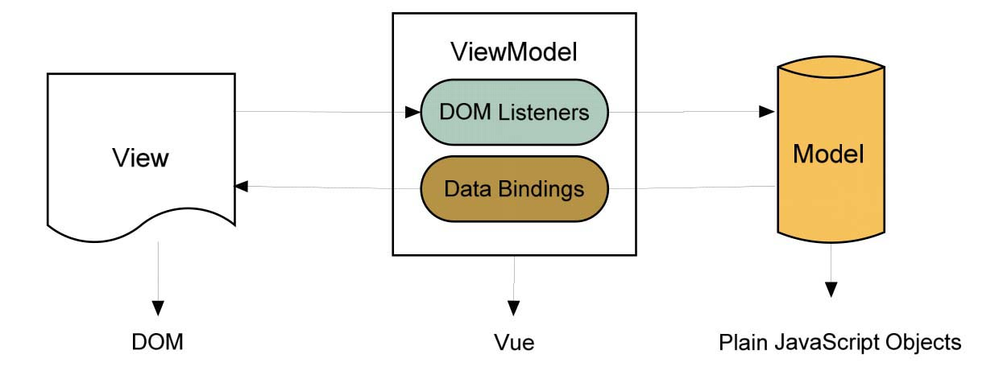
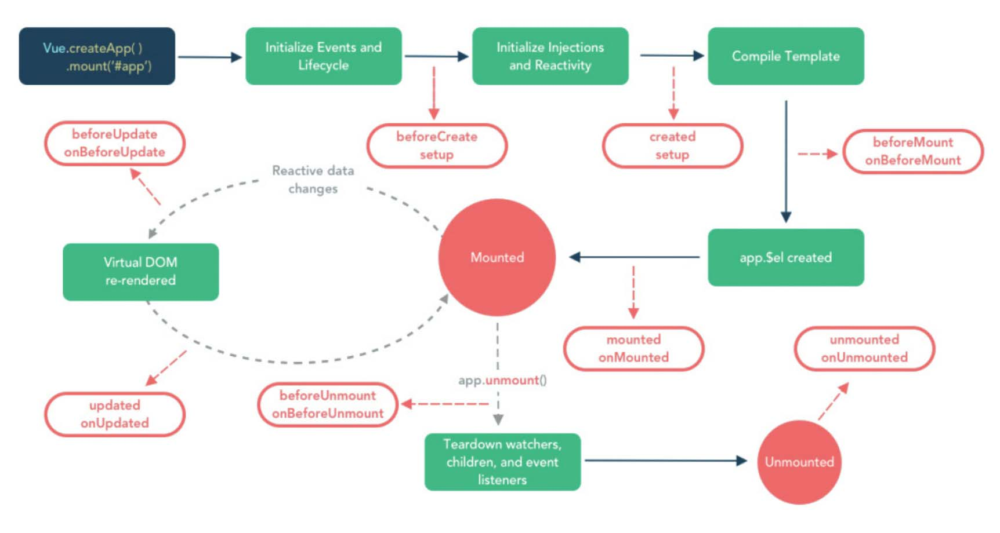

# Vue

1.  [Vue基础](#vue基础)
2.  [常用库](#常用库)

## Vue基础

初识Vue：

*   `MVVM`开发模式：Vue采用的是`Model-View-ViewModel`的开发模式，它本质上是MVC模式的改进版本，促进了前后端的分离解耦。
    *   `Model`（模型层）：也称数据层，是来自服务器请求或本地存储的数据。
    *   `View`（视图层）：在前端开发中通常来说是DOM层，是用户看得到的界面。
    *   `ViewModel`（视图模型层）：实现了数据绑定（`Data Binding`），可以在`Model`层数据发生变化时将变化反映到`View`上。用户与`View`进行交互时，`ViewModel`层又可以通过监听`DOM`事件的变化，将监听到的变化反映给`Model`。
    *   
*   响应式编程：保持状态和视图的同步，即允许将相关模型的变化自动反应到视图上，反之亦然。
*   组件化：通过对代码进行模块化，将复杂的应用分解为多个可重用组件，提高了开发效率和代码可维护性。
*   虚拟DOM技术：通过对真实DOM的抽象，实现了对DOM的局部更新，提高了渲染效率。
*   Vue的目标是通过尽可能简单的API来实现响应的数据绑定和组合的视图组件。

Vue快速入门：

*   双向数据绑定：在Vue中，可以使用`v-model`指令在`<input>`、`<select>`、`<textarea>`等表单元素上实现双向数据绑定。

    ```javascript
    const count = ref(0)
    const increment = () => {
      count.value++
    }
    <button @click="increment">Count is: {{ count }}</button>

    const form = reactive({
      name: '',
      region: '',
      date1: '',
      date2: '',
      delivery: false,
      type: [],
      resource: '',
      desc: ''
    })
    const create = () => {
      console.log(form)
    }
    <form :model="form">
      <label>Name:</label>
      <input v-model="form.name" />
      <label>Region:</label>
      <select v-model="form.region">
        <option value="">Please select your zone</option>
        <option value="shanghai">Zone one</option>
        <option value="beijing">Zone two</option>
      </select>
      <label>Description:</label>
      <textarea v-model="form.desc"></textarea>
      <button type="submit">Create</button>
    </form>

    <!-- 修饰符 .lazy：将数据更新从默认的 input 事件改为 change 事件，即只有从输入框失去焦点或按下回车键时才会更新数据 -->
    <input type="text" v-model.lazy="form.name" />
    <span>{{ form.name }}</span>

    <!-- 修饰符 .number：将输入值转为数值类型，如果输入的内容不能转换为有效数字，则返回 NaN -->
    <input type="text" v-model.number="form.age" />
    <span>{{ form.age }}</span>

    <!-- 修饰符 .trim：自动过滤输入框前后空格 -->
    <input type="text" v-model.trim="form.name" />
    <span>{{ form.name }}</span>
    ```

*   插值：传统方法中需要通过JavaScript代码操纵DOM对象才能改变HTML元素内容，而Vue通过插值语法直接改变HTML文档内容。
    *   文本插值：`{{ }}`和`v-text`指令，更新元素的文本内容。

        ```javascript
        <span v-text="msg"></span>
        <!-- 等同于 -->
        <span>{{msg}}</span>
        ```

    *   HTMl插值：
        *   使用`v-html`指令，可以动态渲染DOM节点，是对文本插值的补充和扩展，常用于处理一些不可预知或难以控制的DOM结构，如渲染Markdown、富文本等。
        *   由于HTML插值是直接把绑定的内容解析为DOM节点，如果绑定的内容来自用户输入，存在恶意输入的脚本时，很容易给网站造成巨大的影响。因此需要注意：
            *   尽可能多使用Vue自身的模板机制，减少对HTML插值的使用。
            *   支队可信内容使用HTML插值。
            *   绝不相信用户输入的数据（需对用户输入数据做一些脱敏或者转义操作）。

        ```javascript
        const htmlContent = '<p>This is a test message.</p>'
        <div v-html="htmlContent"></div>
        ```

*   常用指令：
    *   `v-bind`（可以简写为`:`）：用于动态绑定DOM元素的属性（`attribute`），支持绑定静/动态属性名。

        ```javascript
        <div v-bind:id="dynamicId"></div>
        <div :id="dynamicId"></div>
        <div :id="`list-${id}`"></div>
        <div :id="getId()"></div>
        <button :disabled="isDisabled">Button</button>

        const key = 'id'
        const value = '123'
        <div :[key]="value"></div>

        const objectOfAttrs = {
          id: 'dynamicId',
          class: 'wrapper',
          style: 'background-color: red'
        }
        <div v-bind="objectOfAttrs"></div>

        <!-- 修饰符 .camel：将短横线命名（kebab-case）的属性名转换为驼峰命名（camelCase） -->
        <!-- 修饰符 .prop：将属性名绑定为DOM的属性（property） -->
        <!-- 修饰符 .attr：将属性名绑定为DOM的属性（attribute） -->
        ```

    *   `v-on`（可以简写为`@`）：主要用于事件绑定，用法和`v-bind`相似，支持绑定静/动态属性名。

        ```javascript
        <button v-on:click="handleClick">Click me</button>
        <button @click="handleClick">Click me</button>

        const event = 'click'
        const doThis = () => { console.log('do this') }
        <button @[event]="doThis">Click me</button>

        <button v-on:"{ mouseover: handleMouseover, mouseout: handleMouseout }">Hover me</button>

        <!-- 修饰符 .stop：阻止事件冒泡 -->
        <!-- 点击 Inner Div 时，只会触发 innerClick，不会触发 outerClick -->
        <div @click="outerClick">
          Outer Div
          <div @click.stop="innerClick">
            Inner Div
          </div>
        </div>

        <!-- 修饰符 .prevent：阻止默认事件 -->
        <!-- 点击 button 后不会触发默认的 form 提交行为（不会刷新页面），但是会console.log('Form submitted') -->
        const handleSubmit = (event) => {
          console.log('Form submitted')
          // some code...
        }
        <form @submit.prevent="handleSubmit">
          <input type="text" v-model="form.name" />
          <button type="submit">Submit</button>
        </form>

        <!-- 修饰符 .capture：触发事件时使用捕获模式，不用冒泡模式 -->
        <!-- 点击 Inner Div 时，会先触发 outerClick，再触发 innerClick -->
        <div @click.capture="outerClick">
          Outer Div
          <div @click.capture="innerClick">
            Inner Div
          </div>
        </div>

        <!-- 修饰符 .self：只有事件是从该元素本身触发时才触发回调 -->
        <!-- 点击 Inner Div 时，不会触发 outerClick，只会触发 innerClick -->
        <div @click.self="outerClick">
          Outer Div
          <div @click="innerClick">
            Inner Div
          </div>
        </div>

        <!-- 修饰符 .once：只触发一次回调 -->
        <!-- 点击 button 后，只会触发 handleClick 一次 -->
        <button @click.once="handleClick">Click me</button>

        <!-- 修饰符 .left/.right/.middle：按下鼠标左/右/中键时触发回调 -->
        <button @click.left="handleLeftClick" @click.right="handleRightClick" @click.middle="handleMiddleClick">Click me</button>
        ```

    *   `v-if`/`v-else`/`v-else-if`：用于条件渲染，根据表达式的值来决定是否渲染元素。

        ```javascript
        const random = Math.random()

        <div v-if="random < 0.5">
          Random number is less than 0.5
        </div>
        <div v-else-if="random < 0.7">
          Random number is between 0.5 and 0.7
        </div>
        <div v-else>
          Random number is greater than 0.7
        </div>
        ```

    *   `v-show`：用于元素的显示/隐藏，根据表达式的值来决定元素的`display`属性。

        ```javascript
        const isShow = true
        
        <div v-show="isShow">
          This is a show/hide element
        </div>
        ```

    *   `v-for`：用于遍历数组或对象，渲染列表元素。

        ```javascript
        const todos = ['Learn Vue', 'Learn React', 'Learn Angular']
        <ul>
          <li v-for="(todo, index) in todos" :key="todo">
            {{ index + 1 }}. {{ todo }}
          </li>
        </ul>

        const object = {
          name: 'John',
          age: 30,
          city: 'New York'
        }
        <ul>
          <li v-for="(value, key, index) in object" :key="key">
            {{ index + 1 }}: {{ key }} - {{ value }}
          </li>
        </ul>

        <ul>
          <li v-for="item in 5" :key="item">
            {{ item }}
          </li>
        </ul>
        ```

*   组件：将重复的、大概率多次使用的交互元素等封装成组件，运用得当可以在很大程度上减少重复的代码量，也使得页面结构变得简洁。
    *   全局注册和局部注册：

        ```javascript
        // 全局注册
        // main.js
        import { createApp } from 'vue'
        import App from "./App.vue";
        import MyComponent from "./components/MyComponent.vue";

        const app = createApp({})
        app.component('MyComponent', MyComponent)
        app.mount("#app");

        <!-- 局部注册 -->
        <!-- App.vue，不使用 setup 语法糖 -->
        <script>
        import ComponentA from './ComponentA.vue'

        export default {
          components: {
            ComponentA: ComponentA
          },
          setup() {
            // some code...
          }
        }
        </script>


        <!-- 局部注册 -->
        <!-- App.vue，使用 setup 语法糖 -->
        <script setup>
        import ComponentA from './ComponentA.vue'
        </script>

        <template>
          <ComponentA />
        </template>
        ```

    *   每一个组件都有自己的生命周期，从组件被创建并添加到DOM，到组件被销毁的过程就是一个组件的生命周期。这个周期里面会有一个初始化的过程，包括设置数据监听（`watch`）、编译模板（`template`）、将实例挂载到DOM并在数据变化时更新DOM等，同时也会运行一些生命周期钩子函数。
    *   组件生命周期的主要阶段：
        1.  创建阶段：
            *   `beforeCreate(setup)`：在组件实例初始化完成之后立即调用。
            *   `created(setup)`：在组件实例处理完所有与状态相关的选项后调用。
            *   `beforeMount(onBeforeMount)`：在组件被挂载之前调用。
            *   `mounted(onMounted)`：在组件被挂载之后调用。
        2.  更新阶段：
            *   `beforUpdate(onBeforeUpdate)`：在组件即将因为一个响应式状态变更而更新其DOM树之前调用。
            *   `updated(onUpdated)`：在组件因为一个响应式状态变更而更新其DOM树之后调用。
        3.  销毁阶段：
            *   `beforeUnmount(onBeforeUnmount)`：在一个组件实例被卸载之前调用。
            *   `unmounted(onUnmounted)`：在一个组件实例被卸载之后调用。
    *   
    *   父子组件通信：
        *   单向数据传递：父组件通过`props`向子组件传递数据，子组件通过`emit`触发事件，父组件通过`v-on`监听事件并执行相应的回调函数。
        *   双向数据绑定：父组件通过`v-model`绑定数据，子组件通过`modelValue`获取数据，并通过`emit`触发`update:modelValue`事件更新数据。
    *   插槽（`slot`）：一种用于在父组件中向子组件传递内容的机制。
        *   默认插槽（未命名插槽）：使用`<slot>`标签将内容插到组件的默认位置。

            ```javascript
            <!-- Test.vue -->
            <script setup>
            </script>

            <template>
              <div>
                <h1>This is the default slot</h1>
                <slot></slot>
              </div>
            </template>

            <!-- App.vue -->
            <script setup>
            import Test from './Test.vue'
            </script>

            <template>
              <div>
                <h1>This is the parent component</h1>
                <Test>
                  <p>This is the child component</p>
                </Test>
              </div>
            </template>
            ```

        *   具名插槽：使用`v-slot`（可以简写为`#`）和`<slot>`标签将内容插到具名插槽中。

            ```javascript
            <!-- Test.vue -->
            <script setup>
            </script>

            <template>
              <div>
                <header>
                  <slot name="header"></slot>
                </header>
                <main>
                  <slot name="main"></slot>
                </main>
                <footer>
                  <slot name="footer"></slot>
                </footer>
              </div>
            </template>

            <!-- App.vue -->
            <script setup>
            import Test from './Test.vue'
            </script>

            <template>
              <div>
                <Test>
                  <template v-slot:header>
                    <h1>This is the header</h1>
                  </template>
                  <template v-slot:main>
                    <p>This is the main content</p>
                  </template>
                  <template v-slot:footer>
                    <p>This is the footer</p>
                  </template>
                </Test>
              </div>
            </template>
            ```

        *   作用域插槽：允许父组件访问子组件中的数据。

            ```javascript
            <!-- Test.vue -->
            <script setup>
            import { reactive } from 'vue'

            const types = reactive({
              404: 'Page not found',
              500: 'Server error'
            })

            const sources = reactive({
              system: 'System',
              page: 'Page',
              console: 'Console'
            })
            </script>

            <template>
              <div class="wrap">
                <div class="header">
                  <slot name="header">Error</slot>
                  <div class="close">Close</div>
                </div>
                <div>
                  <slot :types="types"></slot>
                </div>
                <div class="footer">
                  <slot name="footer" :types="types" :sources="sources">Error from: System</slot>
                </div>
              </div>
            </template>

            <style scoped>
            .wrap {
              position: relative;
              max-width: 300px;
              padding: 10px;
              color: #fff;
              border: 1px solid #fff;
            }

            .header {
              color: #333;
              font-size: 20px;
              font-weight: bold;
            }

            .close {
              position: absolute;
              top: 10px;
              right: 10px;
            }

            .footer {
              color: #666;
              font-size: 12px;
              text-align: right;
            }
            </style>

            <!-- App.vue -->
            <script setup>
            import Test from './Test.vue'
            </script>

            <template>
              <Test>
                <template #header>
                  <p>Tooptip</p>
                </template>
                <template #default="slotProps">
                  <p>Error: <span>{{ slotProps.types['404'] }}</span></p>
                </template>
                <template #footer="{ types, sources }">
                  <p>Error from: {{ sources['page'] }} - {{ types['404'] }}</p>
                </template>
              </Test>
            </template>
            ```

    *   选项式API组件：
  
        ```javascript
        <!-- Test.vue -->
        <script>
        export default {
          props: {
            name: String,
            data: {
              type: Array,
              default: () => [],
              required: true,
              validator: (value) => value.length > 0
            },
            modelValue: String
          },
          emits: ['selected', 'update:modelValue'],
          data() {
            return {
              counter: 0,
              obj: { title: 'This is a title' }
            }
          },
          computed: {
            twiceTheCounter() {
              return this.counter * 2
            }
          },
          watch: {
            counter(newValue, oldValue) {
              console.log(newValue, oldValue)
              this.obj.title = `The counter is ${newValue}`
            }
          },
          methods: {
            action() {
              this.counter = this.counter + 3
            },
            handleClick(item) {
              this.$emit('selected', item)
            },
            handleInput(event) {
              this.$emit('update:modelValue', event.target.value)
            }
          },
          mounted() {
            console.log('Component mounted')
          }
        }
        </script>

        <template>
          <div>{{ name }}: {{ counter }} - {{ obj.title }}</div>
          <div>{{ twiceTheCounter }}</div>
          <button @click="action">Add 3 to counter</button>
          <ul>
            <li v-for="item in data" :key="item" @click="handleClick(item)">{{ item }}</li>
          </ul>
          <div>
            <input type="text" :value="modelValue" @input="handleInput" />
          </div>
        </template>

        <!-- App.vue -->
        <script>
        import Test from './Test.vue'

        export default {
          data() {
            return {
              name: 'Test',
              data: ['Item 1', 'Item 2', 'Item 3'],
              selected: '',
              message: 'Hello, Vue!'
            }
          },
          components: {
            Test: Test
          },
          methods: {
            onSelected(item) {
              this.selected = item
            }
          }
        }
        </script>

        <template>
          <Test :name="name" :data="data" v-model="message" @selected="onSelected" />
          <div>Selected: {{ selected }}</div>
          <div>{{ message }}</div>
        </template>
        ```

    *   组合式API组件（不使用setup语法糖）：

        ```javascript
        <!-- Test.vue -->
        <script>
        import { ref, reactive, computed, watch, onMounted } from 'vue'

        export default {
          props: {
            name: String,
            data: {
              type: Array,
              default: () => [],
              required: true,
              validator: (value) => value.length > 0
            },
            modelValue: String
          },
          emits: ['selected', 'update:modelValue'],
          setup(props, { emit }) {
            const counter = ref(0)
            const obj = reactive({ title: 'This is a title' })

            const twiceTheCounter = computed(() => counter.value * 2)

            watch(counter, (newValue, oldValue) => {
              console.log(newValue, oldValue)
              obj.title = `The counter is ${newValue}`
            })

            const action = () => {
              counter.value += 3
            }

            const handleClick = (item) => {
              emit('selected', item)
            }

            const handleInput = (event) => {
              emit('update:modelValue', event.target.value)
            }

            onMounted(() => {
              console.log('Component mounted')
            })

            return {
              counter,
              obj,
              twiceTheCounter,
              action,
              handleClick,
              handleInput
            }
          }
        }
        </script>

        <template>
          <div>{{ name }}: {{ counter }} - {{ obj.title }}</div>
          <div>{{ twiceTheCounter }}</div>
          <button @click="action">Add 3 to counter</button>
          <ul>
            <li v-for="item in data" :key="item" @click="handleClick(item)">{{ item }}</li>
          </ul>
          <div>
            <input type="text" :value="modelValue" @input="handleInput" />
          </div>
        </template>


        <!-- App.vue -->
        <script>
        import { ref } from 'vue'
        import Test from './Test.vue'

        export default {
          components: {
            Test: Test
          },
          setup(props, { emit }) {
            const name = 'Test'
            const data = ['Item 1', 'Item 2', 'Item 3']
            const selected = ref('')
            const message = ref('Hello, Vue!')

            const onSelected = (item) => {
              selected.value = item
            }

            return {
              name,
              data,
              selected,
              message,
              onSelected
            }
          }
        }
        </script>

        <template>
          <Test :name="name" :data="data" v-model="message" @selected="onSelected" />
          <div>Selected: {{ selected }}</div>
          <div>{{ message }}</div>
        </template>
        ```

    *   组合式API组件（使用setup语法糖）：

        ```javascript
        <!-- Test.vue -->
        <script setup>
        import { ref, reactive, computed, watch, onMounted } from 'vue'

        const props = defineProps({
          name: String,
          data: {
            type: Array,
            default: () => [],
            required: true,
            validator: (value) => value.length > 0
          },
          modelValue: String
        })

        const emit = defineEmits(['selected', 'update:modelValue'])

        const counter = ref(0)
        const obj = reactive({ title: 'This is a title' })

        const twiceTheCounter = computed(() => counter.value * 2)

        watch(counter, (newValue, oldValue) => {
          console.log(newValue, oldValue)
          obj.title = `The counter is ${newValue}`
        })

        const action = () => {
          counter.value += 3
        }

        const handleClick = (item) => {
          emit('selected', item)
        }

        const handleInput = (event) => {
          emit('update:modelValue', event.target.value)
        }

        onMounted(() => {
          console.log('Component mounted')
        })
        </script>

        <template>
          <div>{{ name }}: {{ counter }} - {{ obj.title }}</div>
          <div>{{ twiceTheCounter }}</div>
          <button @click="action">Add 3 to counter</button>
          <ul>
            <li v-for="item in data" :key="item" @click="handleClick(item)">{{ item }}</li>
          </ul>
          <div>
            <input type="text" :value="modelValue" @input="handleInput" />
          </div>
        </template>

        <!-- App.vue -->
        <script setup>
        import { ref } from 'vue'
        import Test from './Test.vue'

        const name = 'Test'
        const data = ['Item 1', 'Item 2', 'Item 3']
        const selected = ref('')
        const message = ref('Hello, Vue!')

        const onSelected = (item) => {
          selected.value = item
        }
        </script>

        <template>
          <Test :name="name" :data="data" v-model="message" @selected="onSelected" />
          <div>Selected: {{ selected }}</div>
          <div>{{ message }}</div>
        </template>
        ```

路由：使用`Vue Router`构建单页面应用。

*   路由这个概念最先是在后端出现的，传统MVC架构的Web开发由后台设置路由规则，当用户发送请求时，后台根据设置的路由规则将数据渲染到模板中，并将模板返回给用户。因此，每次进行一次请求就要刷新一次页面，十分影响交互体验。
*   AJAX的出现则有效解决了这一问题。AJAX（Asynchronous JavaScript and XML）是浏览器提供的一种技术方案，采用异步加载数据的方式实现页面的局部刷新，极大地提升了用户体验。
*   随着前端单页应用的兴起，前后端分离成为主流，前端页面完全变成了组件化，不同的页面就是不同的组件，页面的切换就是组件的切换。页面切换的时候不需要再通过HTTP请求，直接通过JS解析URL地址，然后找到对应的组件进行渲染，不仅页面交互无刷新，甚至页面跳转也可以无刷新，前端路由随之而生。
*   `Vue Router`是Vue官方推出的路由管理器，是Vue生态中前端路由的解决方案。
*   三种路由历史模式：
    *   `Memory`：适合Node环境，不推荐在浏览器环境使用。
    *   `Hash`：
        *   Hash模式的URL中会包裹一个`#`符号，以及`#`后面的字符（即`hash`值），如`http://localhost:8080/#/about`。
        *   Hash模式利用window对象上的`onhashchange`事件监听`hash`值的变化。当`hash`值发生变化时，会触发`onhashchange`事件，`Vue Router`根据新的`hash`值来匹配对应的路由规则，并动态渲染相应的页面内容。
        *   由于`hash`值的变化不会导致浏览器向服务器发出请求，因此Hash模式对服务器没有特殊要求，不需要进行额外的配置。
        *   对SEO不友好，不建议在生产环境使用。
    *   `HTML5 History`：
        *   HTML5模式的URL看起来更加简洁，如`http://localhost:8080/about`。
        *   HTML5模式利用HTML5提供的`history.pushState()`和`history.replaceState()`方法，以及`onpopstate`事件来实现路由的跳转和状态的维护。
        *   由于HTML5模式的URL会被完整的发送给服务器，因此服务器需要配置相应的路由规则来匹配请求。如果服务器没有配置相应的路由规则，则无法匹配请求，导致404错误。
        *   HTML5模式对SEO友好，推荐在生产环境使用。

全局状态管理：使用`Vuex`管理全局状态。

*   多个组件依赖同一个数据，如何获取这个数据？如何修改这个数据？数据修改之后其他组件如何获取到最新的数据？
    *   不使用`Vuex`的做法：
        1.  将数据设置为全局变量（挂载到`app.config.globalProperties`）并通过事件监听方法实现：将这个共享数据设置为全局变量，并在需要改变这个数据的组件内直接修改这个数据，然后在所有用到这个数据的组件内设置监听，通过监听这个全局数据的变化，来同步这个数据的拷贝并执行相应的处理方法；或者在全局设置自定义事件监听这个数据的变化，并在这个事件中通知所有用到这个数据的组件​，同步这个数据的拷贝并执行对应的处理方法。但是这样的做法也有缺点，比如组件间通信繁琐，需要在每个组件内都设置监听，并且需要手动触发事件，不够自动化。
        2.  充分利用组件通信的方法：如果是父子组件间共享同一个数据，可以通过`v-model`将这个数据在父子组件中双向绑定，或者通过`props`方式将这个共享数据传递给子组件，同时定义一个事件接收这个数据的变化来改变父组件这个数据的值，最终实现父子组件间的数据共享。如果层次更深，则需要将这个共享数据层层传递下去。但是这种方式也有缺点，比如数据共享的粒度太粗，不利于数据的维护。

        ```javascript
        // main.js
        import { createApp, reactive } from 'vue';
        import App from './App.vue';

        const app = createApp(App);

        // 全局状态和事件总线
        app.config.globalProperties.$eventBus = new EventTarget();
        app.config.globalProperties.$sharedData = reactive({
          value: 'Initial Value',
        });

        app.mount('#app');

        <!-- App.vue -->
        <script setup>
        import { getCurrentInstance, ref, onMounted, onBeforeUnmount } from 'vue'
        import Test from '@/components/Test.vue'

        const instance = getCurrentInstance()
        const value = ref(instance.appContext.config.globalProperties.$sharedData.value)

        onMounted(() => {
          instance.appContext.config.globalProperties.$eventBus.addEventListener('updateValue', (event) => {
            instance.appContext.config.globalProperties.$sharedData.value = event.detail.value
            value.value = event.detail.value
          })
        })

        onBeforeUnmount(() => {
          instance.appContext.config.globalProperties.$eventBus.removeEventListener('updateValue')
        })
        </script>

        <template>
          <div>
            <h1>App Component</h1>
            <p>Shared data: {{ value }}</p>
            <Test />
          </div>
        </template>

        <!-- Test.vue -->
        <script setup>
        import { getCurrentInstance, ref } from 'vue'

        const instance = getCurrentInstance()
        const value = ref(instance.appContext.config.globalProperties.$sharedData.value)

        const updateSharedData = () => {
          instance.appContext.config.globalProperties.$eventBus.dispatchEvent(new CustomEvent('updateValue', {
            detail: {
              value: value.value
            }
          }))
        }
        </script>

        <template>
          <div>
            <h1>Test Component</h1>
            <input v-model="value" @input="updateSharedData" />
          </div>
        </template>
        ```

    *   使用`Vuex`的做法：每一个应用的核心就是一个仓库`store`，我们可以将各个组件都需要的同一个状态抽取出来，放在`store`的全局状态`state`中，那么在任何组件内都可以直接从`store`中获取这个状态。通过`store`的`mutations`或者`actions`来改变这个状态，就可以让组件中的状态实时同步。如果需要让这些数据持久化，可以配合缓存机制或者存入数据库，在状态改变之时将需要持久化的状态同步一份到缓存或者数据库中，刷新页面之后，先从缓存或数据库中读取初始值对`store`中的`state`进行初始化。

权限管理系统：

*   src: open vue-example project and run it

## 常用库

`vite`：前端开发与构建工具。

`vue-router`：路由管理库。

`vuex`：状态管理库。

`pinia`：状态管理库。

`axios`：网络请求库。

`element-plus`：组件库。

`mockjs`：模拟数据生成库。

`vue-i18n`：国际化插件。
