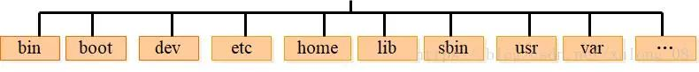
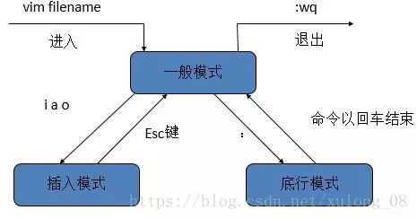

# Linux入门

linux是目前应用最广泛的服务器操作系统，基于Unix，开源免费，由于系统的稳定性和安全性，市场占有率很高，几乎成为程序代码运行的最佳系统环境。

1.  [Linux的目录结构](#linux的目录结构)
2.  [Linux常用命令](#linux常用命令)
3.  [Linux系统常用快捷键及符号命令](#linux系统常用快捷键及符号命令)
4.  [Vim编辑器](#vim编辑器)
5.  [Linux下的C/C++编译器](#linux下的cc编译器)

## Linux的目录结构



bin（binaries）：存放二进制可执行文件。
  
*   例如：cat，mkdir，kill，rm。

dev（devices）：用于存放设备文件。

*   例如：stdin，stdout，stdout。

etc（etcetera）存放系统配置文件：

*   例如：hosts，shells。

home：存放用户文件的根目录。

*   test用户的目录为/home/test。

lib（library）：存放跟文件系统中的程序运行所需要的共享库及内核模块。

*   例如：gcc，python3.6，systemd。

sbin（super user binaries）：存放二进制可执行文件，只有root才能访问。

*   例如：reboot, shutdown, ping, mount, umount。

tmp（temporary）：公共的临时文件存储点。

root：超级用户的根目录。

mnt（mount）：系统管理员安装临时文件系统的安装点。

lost+found：系统异常关机留下的“无家可归”文件。

proc：系统内存映射的虚拟目录。

var（variable）：用于存放运行时需要改变数据的文件。

usr（unix shared resources）：用于存放共享的系统资源。

## Linux常用命令

命令格式：

```bash
command -options parameters
```

| Command  | Option      | Example                        | Description                                                                                                         |
| -------- | ----------- | ------------------------------ | ------------------------------------------------------------------------------------------------------------------- |
| clear    |             | clear                          | 清屏                                                                                                                |
| cd       |             | cd /home                       | 进入/home目录                                                                                                       |
|          |             | cd -                           | 返回上次所在的目录                                                                                                  |
| pwd      |             | pwd                            | 显示当前工作目录                                                                                                    |
| touch    |             | touch newfile.txt              | 创建空文件                                                                                                          |
| echo     |             | echo string > newfile.txt      | 创建带有内容的文件                                                                                                  |
| mkdir    |             | mkdir newdir                   | 创建一个新目录                                                                                                      |
|          | p           | mkdir -p dir1/dir2/dir3        | 创建多级目录，父目录不存在情况下先生成父目录                                                                        |
| cp       |             | cp oldfile.txt newfile.txt     | 复制文件                                                                                                            |
|          | r           | cp -r olddir/ newdir/          | 递归处理，将目录下的文件与子目录一并拷贝                                                                            |
| mv       |             | mv olddir/ newdir/             | 移动文件或目录和文件或目录改名                                                                                      |
| rm       |             | rm file.txt                    | 删除文件                                                                                                            |
|          | r，f        | rm -rf dir/                    | r：删除该目录下的所有文件；f：强制删除文件或目录                                                                    |
| rmdir    |             | rmdir emptydir                 | 删除空目录                                                                                                          |
| ls       |             | ls                             | 显示目录中的文件                                                                                                    |
|          | l           | ls -l                          | 显示文件和目录的详细情况                                                                                            |
|          | a           | ls -a                          | 显示隐藏文件                                                                                                        |
| cat      |             | cat file.txt                   | 显示文本文件内容                                                                                                    |
|          |             | cat /etc/issue                 | 显示操作系统信息                                                                                                    |
| more     |             | more file.txt                  | 分页显示文本文件内容，可前后翻页，空格向后，b向前                                                                   |
| less     |             | less file.txt                  | 分页显示文本文件内容，可前后翻页，空格向后，b向前，支持底行模式                                                     |
| head     |             | head file.txt                  | 查看文本开头部分，默认十行                                                                                          |
|          | [num]       | head -20 file.txt              | 查看文本开头部分并指定行数                                                                                          |
| tail     |             | tail file.txt                  | 查看文本结尾部分，默认十行                                                                                          |
|          | [num]       | tail -20 file.txt              | 查看文本结尾部分并指定行数                                                                                          |
|          | f           | tail -f file.txt               | 循环滚动读取文件并动态显示在屏幕上，根据文件属性追踪                                                                |
|          | F           | tail -F file.txt               | 循环滚动读取文件并动态显示在屏幕上，根据文件名追踪                                                                  |
| wc       |             | wc file.txt                    | 统计文本的行数、字数、字符数                                                                                        |
|          | m           | wc -m file.txt                 | 文本字符数                                                                                                          |
|          | w           | wc -w file.txt                 | 文本字数                                                                                                            |
|          | l           | wc -l file.txt                 | 文本行数                                                                                                            |
| find     | name        | find / -name file.txt          | 在指定目录下查找指定的文件                                                                                          |
|          | user        | find / -user username          | 在指定目录下查找指定用户的文件                                                                                      |
| grep     |             | grep string file.txt           | 在指定文件中查找包含指定字符串的行                                                                                  |
| whereis  |             | whereis bash                   | 显示一个二进制文件、源码或man的位置（例如bash命令）                                                                 |
| which    |             | which bash                     | 显示一个二进制文件或可执行文件的完整路径（例如bash命令）                                                            |
| ln       |             | ln source.txt link.txt         | 建立链接文件                                                                                                        |
|          | s           | ln -s source.txt link.txt      | 对源文件建立软链接，而非硬链接                                                                                      |
| top      |             | top                            | 显示当前系统中耗费资源最多的进程                                                                                    |
| date     |             | date                           | 显示系统当前时间                                                                                                    |
| nohup    |             | nohup command > out.txt 2>&1 & | nohup是非挂断状态，&是后台运行                                                                                      |
| ps       | e           | ps -e                          | 显示所有进程，环境变量                                                                                              |
|          | f           | ps -ef                         | 全格式显示                                                                                                          |
|          | a           | ps -a                          | 显示所有用户的进程                                                                                                  |
|          | u           | ps -au                         | 按用户名和启动时间的顺序来显示进程                                                                                  |
|          | x           | ps -aux                        | 显示无控制终端的进程                                                                                                |
| kill     | 9           | kill -9 pid                    | 强制杀死一个进程                                                                                                    |
| df       |             | df                             | 显示文件系统磁盘空间的使用情况                                                                                      |
|          | h           | df -h                          | 以人类刻度方式显示，kb，mb，gb等                                                                                    |
| du       |             | du dir/                        | 显示指定目录及其子目录使用的磁盘空间的总和                                                                          |
|          | s           | du -s dir/                     | 显示指定目录的总和                                                                                                  |
|          | h           | du -sh dir/                    | 以人类刻度方式显示，kb，mb，gb等                                                                                    |
| free     |             | free                           | 显示当前内存和交换空间的使用情况                                                                                    |
| ifconfig |             | ifconfig                       | 网卡网络配置，常用于查看当前IP地址                                                                                  |
|          |             | ifconfig eth0 192.168.12.22    | 临时修改系统IP（重启后失效）                                                                                        |
| ping     |             | ping baidu.com                 | 检测网络的连通性                                                                                                    |
| who      |             | who                            | 显示在线登录用户                                                                                                    |
| whoami   |             | whoami                         | 显示当前操作用户                                                                                                    |
| hostname |             | hostname                       | 显示主机名                                                                                                          |
| shutdown | r           | shutdown -r                    | 先关机再重启                                                                                                        |
|          | h           | shutdown -h                    | 关机后不重启                                                                                                        |
| halt     |             | halt                           | 关机后关闭电源，相当于shutdown -h                                                                                   |
| reboot   |             | reboot                         | 重新启动，相当于shutdown -r                                                                                         |
| gzip     |             | gzip file.txt                  | 压缩文件或文件夹                                                                                                    |
|          | d           | gzip -d file.txt.gz            | 解压文件或文件夹                                                                                                    |
|          | [num]       | gzip -9 file.txt               | 用指定数字num调整压缩的速度，-1或--fast表示最快压缩方法，-9或--best表示最慢压缩方法，系统缺省值为6                  |
| tar      | c，v，f     | tar -cvf compress.tar file.txt | 压缩文件或文件夹                                                                                                    |
|          | x，v，f     | tar -xvf compress.tar          | 解压文件或文件夹                                                                                                    |
| chmod    |             | chmod u+r file.txt             | 修改文件或目录的权限，u表示当前用户，g表示同组用户，o表示其他用户，a表示所有用户，r表示可读，w表示可写，x表示可执行 |
|          | R           | chmod -R u+r dir/              | 修改指定目录及其子目录的所有文件的权限                                                                              |
|          | [three num] | chmod 764 file.sh              | 直接指定文件的权限                                                                                                  |
| chown    |             | chown user:group file.txt      | 修改文件的所属用户和组                                                                                              |
|          | R           | chown -R user:group file.txt   | 修改目录下所有文件及其子目录的所属用户和组                                                                          |

## Linux系统常用快捷键及符号命令

符号：

*   `*`：通配符。
*   `|`（管道命令）：以前一个命令的输出作为输入，然后进行计算。
*   `> >>`（重定向）：

    ```bash
    echo "haha" > 1.txt
    ```

快捷键：

*   常用：

    | Keyboard Shortcut | Description                                                              |
    | ----------------- | ------------------------------------------------------------------------ |
    | tab               | 自动补全                                                                 |
    | Ctrl + 左右键     | 在单词之间跳转                                                           |
    | Ctrl + A          | 跳到本行的行首                                                           |
    | Ctrl + E          | 跳到页尾                                                                 |
    | Ctrl + U          | 删除当前光标前面的所有文字（还有剪切功能）                               |
    | Ctrl + K          | 删除当前光标后面的所有文字（还有剪切功能）                               |
    | Ctrl + L          | 进行清屏操作                                                             |
    | Ctrl + Y          | 粘贴Ctrl + U或Ctrl + K剪切的内容                                         |
    | Ctrl + W和Alt + D | 对于当前的单词进行删除操作，W删除光标前面的单词的字符，D则删除后面的字符 |
    | Alt + Backsapce   | 删除当前光标后面的单词                                                   |

*   移动光标：

    | Keyboard Shortcut | Description                        |
    | ----------------- | ---------------------------------- |
    | Ctrl + A          | 移到行首                           |
    | Ctrl + E          | 移到行尾                           |
    | Ctrl + B          | 往回(左)移动一个字符（相当于左键） |
    | Ctrl + F          | 往后(右)移动一个字符（相当于右键） |
    | Ctrl + XX         | （两个X）在命令行尾和光标之间移动  |
    | Alt + B           | 往回(左)移动一个单词               |
    | Alt + F           | 往后(右)移动一个单词               |
    | Esc + B           | 往回(左)移动一个单词               |
    | Esc + F           | 往后(右)移动一个单词               |
    | Esc + T           | 交换光标位置前的两个单词           |

*   编辑命令：

    | Keyboard Shortcut                              | Description                                                                    |
    | ---------------------------------------------- | ------------------------------------------------------------------------------ |
    | Ctrl + H                                       | 删除光标左方位置的字符                                                         |
    | Ctrl + D                                       | 删除光标右方位置的字符（注意：当前命令行没有任何字符时，会注销系统或结束终端） |
    | Ctrl + W                                       | 由光标位置开始，往左删除单词，往行首删                                         |
    | Alt + D                                        | 由光标位置开始，往右删除单词，往行尾删                                         |
    | Esc + D                                        | 由光标位置开始，删除单词，直到该单词结束                                       |
    | Ctrl + K                                       | 由光标所在位置开始，删除右方所有的字符，直到该行结束                           |
    | Ctrl + U                                       | 由光标所在位置开始，删除左方所有的字符，直到该行开始                           |
    | Ctrl + Y                                       | 粘贴之前删除的内容到光标后                                                     |
    | Ctrl + T                                       | 交换光标处和之前两个字符的位置                                                 |
    | Alt + .                                        | 使用上一条命令的最后一个参数                                                   |
    | Ctrl + _                                       | 回复之前的状态，撤销操作                                                       |
    | Ctrl + A + K ，或 Ctrl + E + U 或 Ctrl + K + U | 组合可删除整行                                                                 |

*   查找历史命令：

    | Keyboard Shortcut | Description                                                                                                  |
    | ----------------- | ------------------------------------------------------------------------------------------------------------ |
    | Ctrl + P          | 显示当前命令的上一条历史命令（相当于上键）                                                                   |
    | Ctrl + N          | 显示当前命令的下一条历史命令（相当于下键）                                                                   |
    | Ctrl + R          | 搜索历史命令，随着输入会显示历史命令中的一条匹配命令，Enter键执行匹配命令；ESC键在命令行显示而不执行匹配命令 |
    | Ctrl + G          | 从历史搜索模式（Ctrl + R）退出                                                                               |

*   控制命令：

    | Keyboard Shortcut | Description                                                |
    | ----------------- | ---------------------------------------------------------- |
    | Ctrl + L          | 清除屏幕，然后，在最上面重新显示目前光标所在的这一行的内容 |
    | Ctrl + O          | 执行当前命令，并选择上一条命令                             |
    | Ctrl + S          | 阻止屏幕输出                                               |
    | Ctrl + Q          | 允许屏幕输出                                               |
    | Ctrl + C          | 终止命令                                                   |
    | Ctrl + Z          | 挂起命令（使用'fg'命令恢复）                               |

*   Bang（!）命令：

    | Keyboard Shortcut | Description                                                      |
    | ----------------- | ---------------------------------------------------------------- |
    | !!                | 执行上一条命令                                                   |
    | ^foo^bar          | 把上一条命令里的foo替换为bar，并执行                             |
    | !wget             | 执行最近的以wget开头的命令                                       |
    | !wget:p           | 仅打印最近的以wget开头的命令，不执行                             |
    | !$                | 上一条命令的最后一个参数，与 Alt - . 和 $_ 相同                  |
    | !*                | 上一条命令的所有参数                                             |
    | !*:p              | 打印上一条命令是所有参数，也即 !*的内容                          |
    | ^abc              | 删除上一条命令中的abc                                            |
    | ^foo^bar          | 将上一条命令中的 foo 替换为 bar                                  |
    | ^foo^bar^         | 将上一条命令中的 foo 替换为 bar                                  |
    | !-n               | 执行前n条命令，执行上一条命令： !-1，执行前5条命令的格式是： !-5 |

*   说明：

    | Keyboard Shortcut | Description                   |
    | ----------------- | ----------------------------- |
    | Ctrl + K          | 先按住 Ctrl 键，然后再按 K 键 |
    | Alt + K           | 先按住 Alt 键，然后再按 K 键  |
    | Esc + K           | 先单击 Esc 键，然后再按 K 键  |

## Vim编辑器

Vim编辑模式：



命令：

*   `i`：在光标前插入。
*   `I`：在光标当前行开始插入。
*   `a`：在光标后插入。
*   `A`：在光标当前行末尾插入。
*   `o`：在光标当前行的下一行插入新行。
*   `O`：在光标当前行的上一行插入新行。
*   `gg`：跳到首行。
*   `G`：跳到末行。
*   `:n`：跳到第n行。
*   `:wq`：保存并退出。
*   `:set nu`：显示行号。
*   `:set nonu`：取消行号。
*   `x`：删除光标所在处字符。
*   `nx`：删除光标所在处后的n个字符。
*   `dd`：删除光标所在行。ndd删除n行。
*   `dG`：删除光标所在行到末尾行的所有内容。
*   `D`：删除光标所在处到行尾的内容。
*   `v`或`V`：进入可视模式。
*   `:split`：上下显示两个窗口。
*   `:vsplit`：左右显示两个窗口。

## Linux下的C/C++编译器

Linux下的库：

*   libc是Linux下原来的标准C库，后来逐渐被glibc取代。
*   glibc是GNU C Library，主流的Linux操作系统都使用的是glibc（或者其变种）。
    *   glibc是Linux系统中最底层的API，几乎其他任何的运行库都要依赖glibc。
    *   glibc最主要的功能就是对系统调用的封装，glibc可以与上层应用程序和系统调用交互。
    *   glibc自身也提供了一些上层应用函数必要的功能
*   eglibc是glibc的变种，e是Embedded的意思。
    *   eglibc的主要特性是为了更好的支持嵌入式架构，支持不同的Shell。
    *   eglibc二进制兼容glibc。
    *   Ubuntu系统使用的是eglibc。
*   glib也是C程序库，不过比较轻量级，和glibc没有什么关系。
    *   glib将C语言中的数据类型统一封装成自己的数据类型。
    *   glib提供了C语言常用的数据结构的定义以及处理函数，有趣的宏以及可移植的封装等。
*   libstdc++是针对GCC编译器特别重写的C++标准库，libc++是针对Clang编译器特别重写的C++标准库。

GCC、gcc和g++：

*   GCC:GNU Compiler Collection(GUN 编译器集合)，它可以编译C、C++、JAVA、Fortran、Pascal、Object-C、Ada等语言。gcc是GCC中的GUN C Compiler（C 编译器）。g++是GCC中的GUN C++ Compiler（C++编译器）。
    *   gcc和g++并不是编译器，也不是编译器的集合，它们只是一种驱动器。gcc调用了C Compiler，而g++调用了C++ Compiler。
    *   用gcc编译一个c文件的话，会有以下几个步骤：
        1.  Call a preprocessor, like cpp.
        2.  Call an actual compiler, like cc or cc1.
        3.  Call an assembler, like as.
        4.  Call a linker, like ld.
    *   gcc和g++的主要区别：
        *   对于*.c和*.cpp文件，gcc分别当做c和cpp文件编译（c和cpp的语法强度是不一样的）。
        *   对于*.c和*.cpp文件，g++则统一当做cpp文件编译。
        *   使用g++编译文件时，g++会自动链接标准库STL，而gcc不会自动链接STL。
        *   gcc在编译C文件时，可使用的预定义宏是比较少的。
    *   gcc在编译cpp文件时/g++在编译c文件和cpp文件时（这时候gcc和g++调用的都是cpp文件的编译器），会加入一些额外的宏，这些宏如下：

        ```c
        #define __GXX_WEAK__ 1
        #define __cplusplus 1
        #define __DEPRECATED 1
        #define __GNUG__ 4
        #define __EXCEPTIONS 1
        #define __private_extern__ extern
        ```

    *   在用gcc编译c++文件时，为了能够使用STL，需要加参数-lstdc++，但这并不代表gcc -lstdc++和g++等价，它们的区别不仅仅是这个。

```bash
# 预处理
g++ -E test.cc -o test.i
# 生成汇编文件
g++ -S test.i -o test.s
# 生成二进制文件
g++ -c test.s -o test.o
# 生成可执行文件
g++ test.o *.o -o test
```
