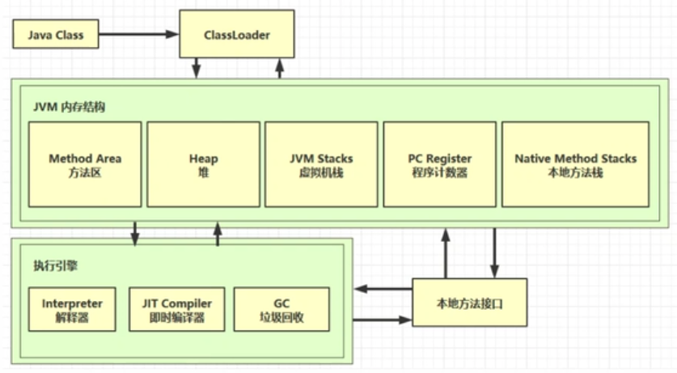
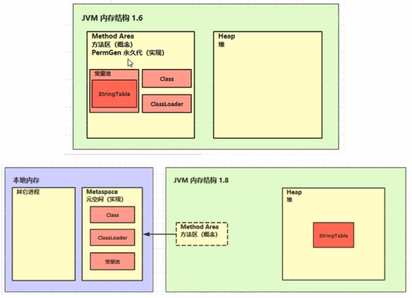

# JVM

## JVM入门

什么是JVM：

*   Java Virtual Machine，是Java二进制字节码的运行环境。
*   好处：一次编写，到处运行；自动内存管理，垃圾回收功能；数组下标越界检查；多态等等。
*   JRE包含JVM和基础类库，JDK包含JRE和编译工具。

## JVM内存结构

内存结构：

*   
*   程序计数器（Program Counter Register）：
    *   定义：物理实现上是寄存器，用来记录当前线程所执行的字节码行号。
    *   特点：
        *   线程私有：每个线程拥有独立的程序计数器。
        *   指向当前指令：存储当前线程正在执行的字节码指令地址。
        *   Native方法时为空：执行本地方法（Native）时值为undefined。
        *   无内存溢出：唯一不会抛出OutOfMemoryError的JVM内存区域。
        *   极小内存空间：占用固定大小的内存（通常为CPU字长）。
        *   生命周期同步：随线程创建而创建，随线程结束而销毁。
*   虚拟机栈（Java Virtual Machine Stacks）：
    *   定义：每个线程运行时所需要的内存，称为虚拟机栈；每个栈由多个栈帧（Frame）组成，对应着每次方法调用时所占用的内存；每个线程只能有一个活动栈帧，对应着当前正在执行的那个方法。
    *   特点：
        *   线程私有：每个线程独立拥有自己的栈空间。
        *   栈帧结构：以栈帧为单位存储方法调用的上下文。
        *   生命周期同步：随线程创建而创建，随线程结束而销毁。
        *   存储内容：局部变量表（基本数据类型/对象引用）；操作数栈（方法执行时的计算工作区）；动态链接（指向运行时常量池的方法引用）；方法返回地址。
        *   异常机制：当线程请求栈深度超过限制会抛出StackOverflowError异常；当栈扩展时无法申请足够内存时会抛出OutOfMemoryError异常。
*   本地方法栈（Native Method Stack）：
    *   定义：为虚拟机执行本地（Native）方法服务的内存区域，处理非Java代码（如C/C++）实现的方法调用。
    *   特点：
        *   线程私有：每个线程独立拥有自己的本地方法栈。
        *   与虚拟机栈协同：与Java虚拟机栈并列运行，但服务于Native方法。
        *   可选实现：部分JVM将虚拟机栈和本地方法栈合并管理（如HotSpot实现）。
        *   异常机制：当线程请求栈深度超过限制会抛出StackOverflowError异常；当栈扩展时无法申请足够内存时会抛出OutOfMemoryError异常。
*   堆（Heap）：
    *   定义：JVM管理的最大内存区域，被所有线程共享，在虚拟机启动时创建，通过new关键字创建的对象都会存储在堆中，如对象实例和数组。
    *   特点：
        *   线程共享：所有线程访问同一堆空间，需要考虑线程安全问题。
        *   垃圾回收机制：垃圾收集器管理的主要内存区域。
        *   内存细分：新生代（Eden、Survivor0/1）；老年代（Tenured）；元空间（代替永久代）。
        *   物理不连续：逻辑连续但物理内存可不连续。
        *   异常机制：当对象实例分配时堆内存不足时抛出OutOfMemoryError异常。
*   方法区（Method Area）：
    *   定义：线程共享的内存区域，存储已被加载的类信息、常量、静态变量、即时编译器编译后的代码。
    *   特点：
        *   线程共享：所有线程都可以访问，需要考虑线程安全问题。
        *   演进历史：JDK7及之前的方法区是永久代，位于堆中；JDK8+的方法区是元空间，使用本地内存。
        *   存储空间：类型信息（类名/方法修饰符/父类/接口）；运行时常量池（含字面量和符号引用）；静态变量（JDK7+将静态变量移动至堆中）；JIT编译后的代码缓存。
        *   异常机制：当元空间或永久代内存不足时抛出OutOfMemoryError异常。
    *   

线程运行诊断：在Linux系统上使用`nohup java Main > out.txt 2>&1 &`在后台运行程序（前提）。

*   CPU占用过多（如死循环）：
    *   用`top`命令定位哪个进程对CPU占用过高。
    *   用`ps H -eo pid,tid,%cpu | grep <PID>`命令定位具体是哪一个线程引起的CPU占用过高。
    *   用`jstack <PID>`命令查看线程具体运行情况，找出有问题的线程，进一步定位问题代码的源码行号。
*   程序运行很长时间没有结果（如死锁）：使用`jstack <PID>`命令查看线程具体运行情况。

堆内存诊断：在Linux系统上使用`nohup java Main > out.txt 2>&1 &`在后台运行程序（前提）

*   使用`jps`命令查看当前系统中有哪些Java进程。
*   使用`jmap -heap <PID>`或`jhsdb jmap --heap --pid <PID>`（JDK17+）查看堆内存占用情况。
*   使用`jconsole`工具图形化的连续性的监控堆内存使用情况。
*   垃圾回收后，内存占用仍然很高（在`jconsole`中执行GC后依旧内存占用很高）：使用`jvisualvm`工具查看堆内存使用情况。

方法区内存溢出：使用基础类库中ClassLoader（框架Spring中的CGLib使用了ClassLoader）加载类时，如果加载的类过多会导致方法区内存溢出，抛出OutOfMemoryError异常。在JDK1.8以前是永久代内存溢出，在JDK1.8以后是元空间内存。

运行时常量池：

*   使用`javap -v Main.class`查看Main.class文件反编译后的详细信息，包括常量池。
*   常量池（Constant Pool）：是一张表，虚拟机指令根据这张常量表找到要执行的类名、方法名、参数类型、字面量等信息。
*   运行时常量池（Runtime Constant Pool）：常量池是*.class文件中的静态数据，当该类被加载到虚拟机时，常量池中的数据会复制一份到运行时常量池中，并将里面的符号地址变为实际地址，称为运行时常量池。
*   串池（StringTable）：运行时常量池中的字符串常量会存储在串池中。串池中的字符串常量是共享的，即多个类加载器加载的类中，如果字符串常量相同，那么就会引用同一个对象。
    *   常量池中字符串仅是符号，第一次用到时才变为对象。
    *   利用串池的机制，来避免重复创建字符串对象。
    *   字符串变量拼接的原理是StringBuilder（JDK1.8）。
    *   字符串常量拼接的原理是编译期优化。
    *   可以使用intern方法，主动将串池中还没有的字符串对象添加到串池中。
        *   在JDK1.8之前，将字符串对象添加到串池时，如果串池中没有该字符串，则拷贝一份字符串放入串池中，即原字符串对象和串池中的对象是两个不同的对象。
        *   在JDK1.8及之后，将字符串对象添加到串池时，如果串池中没有该字符串，则将该字符串对象放入串池中，即原字符串对象和串池中的对象是同一个对象。如果串池中有该字符串，则返回串池中的对象。
    *   当StringTable的空间不足时，也会进行串池的垃圾回收。
    *   StringTable性能调优：
        *   当串池中需要存入大量的数据时，因为串池的本质是哈希表，通过增大Bucket的数量（`-XX:StringTableSize`），来减少数据存入串池所需要的时间。
        *   如果程序中有大量重复的字符串对象，可以将字符串对象添加到串池中，减少内存占用。大量重复的字符串存储在串池中所需的内存大小会远远低于存储在堆中的内存。

    ```java
    public class Main {
      public static void main(String[] args) {
        String s1 = "a";  // 懒加载 StringTable={"a"}
        String s2 = "b";  // 懒加载 StringTable={"a", "b"}
        String s3 = "ab";  // 懒加载 StringTable={"a", "b", "ab"}
        String s4 = s1 + s2;  // new StringBuilder().append("a").append("b").toString() -> new String("ab") 在堆中
        String s5 = "a" + "b";  // javac 在编译期间的优化，结果已经在编译期间确定为"ab"
        String s6 = s4.intern();  // intern() 方法会去 StringTable 中寻找 "ab"，如果找到了，则返回该对象，否则，将 "ab" 添加到 StringTable 中，并返回该对象

        System.out.println(s3 == s4);  // false
        System.out.println(s3 == s5);  // true
        System.out.println(s3 == s6);  // true
      }
    }
    ```

    ```java
    public class Main {
      public static void main(String[] args) {
        String s1 = new String("a") + new String("b");  // StringTable={"a", "b"}，同时在堆中 new String("a")、new String("b")、new String("ab")
        String s2 = s1.intern();  // 将 s1 的对象添加到 StringTable 中，StringTable={"a", "b", "ab"}

        String x = "ab";  // x 指向 StringTable 中的 "ab"
        System.out.println(s2 == x);  // true
        System.out.println(s1 == x);  // true，s1 的对象已经添加到串池中
      }
    }
    ```

    ```java
    public class Main {
      public static void main(String[] args) {
        String x = "ab";  // StringTable={"ab"}
        String s1 = new String("a") + new String("b");  // StringTable={"ab", "a", "b"}，同时在堆中 new String("a")、new String("b")、new String("ab")
        String s2 = s1.intern();  // 将 s1 的对象添加到 StringTable 中，由于串池中已经有了 "ab"，所以 s1 的对象不添加到串池中，s1 依旧指向堆中对象，但 s2 指向串池中的对象

        System.out.println(s2 == x);  // true
        System.out.println(s1 == x);  // false
      }
    }
    ```

直接内存（Direct Memory）：

*   定义：属于系统内存，非JVM虚拟机管理的内存，不受JVM内存回收管理；常用于NIO操作，用于数据缓冲区；分配回收成本较高，但读写速度快；例如使用NIO中的ByteBuffer可创建并访问直接内存。
*   分配和回收原理：
    *   使用Unsafe对象可以完成直接内存的分配回收，并且回收需要主动调用freeMemory方法。
    *   ByteBuffer的实现类内部，使用了Cleaner（虚引用）来监测ByteBuffer对象，一旦ByteBuffer对象被垃圾回收，那么就会由ReferenceHandler线程通过Cleaner的clear方法调用Unsafe的freeMemory方法来释放ByteBuffer所使用的直接内存。

## JVM垃圾回收

如何判断对象可以回收：

*   引用计数法（Reference Counting）：
    *   Python使用了引用计数法。
    *   为每个对象维护一个引用计数器，记录指向该对象的引用数量。当新增一个引用时，计数器加一；当减少一个引用时，计数器减一；当计数器为0时，对象可以回收。
    *   这种方式实现起来简单，但存在循环引用的问题，会引起内存泄漏。
*   可达性分析算法（Reachability Analysis）：
    *   Java使用了可达性分析算法。扫描堆中的对象，看是否能够沿着GC Root对象为起点的引用链找到该对象，找不到则表示可以回收。
    *   这种方法实现起来复杂，但是解决了循环引用的问题；但是需要STW（Stop-the-World），即分析时暂停所有用户线程。
    *   可以使用Memory Analyzer工具查看对象引用关系。
*   四种引用：JVM中有四种引用，它们都位于java.lang.ref包中，每种引用类型的行为和垃圾回收（GC）策略都不同，按强度从高到低依次是：
    *   强引用（Strong Reference）：
        *   特点：最常见的引用类型；只要有一个GC Root对象通过强引用引用该对象，那么该对象永远不会被GC回收（即使内存不足时JVM抛出OutOfMemoryError）。
        *   使用场景：日常编程中的普通对象引用。
        *   回收时机：当所有强引用断开时（置为null或超出作用域）。

        ```java
        Object obj = new Object();  // 强引用
        obj = null;  // 断开强引用，对象可被 GC 回收
        ```

    *   软引用（Soft Reference）：
        *   特点：内存不足时，GC会回收软引用对象；适合实现内存敏感的缓存；可以配合引用队列来释放软引用本身。
        *   使用场景：缓存图片、临时数据等。
        *   回收时机：内存不足时（GC后内存仍不够分配新对象）。

        ```java
        import java.lang.ref.SoftReference;

        public class SoftReferenceDemo {
          public static void main(String[] args) {
            Object obj = new Object();
            SoftReference<Object> softRef = new SoftReference<>(obj);  // 创建软引用

            obj = null;  // 断开强引用，只保留软引用
            System.gc();  // 触发 GC（建议 JVM 执行 GC，但不保证立即执行）

            System.out.println(softRef.get());  // 内存充足时仍能获取对象，输出对象地址

            // 模拟内存不足（需配置 JVM 参数测试：-Xmx10m）
            try {
              byte[] b = new byte[1024 * 1024 * 20];  // 申请 20MB 内存
            } catch (OutOfMemoryError e) {
              System.out.println("内存不足，软引用被回收：" + softRef.get());  // 输出 null
            }
          }
        }
        ```

    *   弱引用（Weak Reference）：
        *   特点：无论内存是否充足，GC都会回收弱引用对象；可以配合引用队列来释放弱引用本身。
        *   使用场景：实现临时缓存（如WeakHashMap的键）。
        *   回收时机：下一次GC发生时。

        ```java
        import java.lang.ref.WeakReference;

        public class WeakReferenceDemo {
          public static void main(String[] args) {
            Object obj = new Object();
            WeakReference<Object> weakRef = new WeakReference<>(obj);

            obj = null;
            System.out.println("GC 前：" + weakRef.get());
            System.gc();  // 触发 GC（弱引用会被回收）

            // 等待 GC 完成
            try {
              Thread.sleep(500);
            } catch (InterruptedException e) {}

            System.out.println("GC 后：" + weakRef.get());  // 输出 null
          }
        }
        ```

    *   虚引用（Phantom Reference）：
        *   特点：无法通过虚引用获取对象（`get()`永远返回null）；对象被回收时，会收到系统通知（需配合ReferenceQueue使用）。
        *   使用场景：管理堆外内存（如NIO的DirectByteBuffer），确保资源释放。
        *   回收时机：对象被GC后，虚引用进入引用队列（通知开发者做清理工作）。

        ```java
        import java.lang.ref.Reference;
        import java.lang.ref.PhantomReference;
        import java.lang.ref.ReferenceQueue;

        public class PhantomReferenceDemo {
          public static void main(String[] args) {
            Object obj = new Object();
            ReferenceQueue<Object> queue = new ReferenceQueue<>();
            PhantomReference<Object> phantomRef = new PhantomReference<>(obj, queue);

            obj = null;
            System.gc();

            // 等待 GC 完成
            try {
              Thread.sleep(500);
            } catch (InterruptedException e) {}


            // 检查引用队列，虚引用在对象回收后会进入队列
            Reference<?> ref = queue.poll();
            if (ref != null) {
              System.out.println("对象已被回收，可执行清理操作");
            }
          }
        }
        ```

引用队列（Reference Queue）：

*   作用：与软/弱/虚引用配合使用，当引用对象被GC回收后，JVM会将其加入队列（强引用无此机制）；用于将引用本身进行垃圾回收；软引用和弱引用在创建时不一定需要绑定引用队列，虚引用创建时必须绑定引用队列。
*   使用场景：清理缓存（软/弱引用）；跟踪对象回收（虚引用）。

在JVM中，除了标准的四种引用外，还存在一种特殊的终结器引用（Finalizer Reference），它由JVM内部管理，用于处理对象的finalize()方法，不属于开发者可控的引用类型，所以不推荐使用。

垃圾回收算法：JVM垃圾回收中，标记清除、标记整理、复制算法是三种基础垃圾回收算法，它们的核心区别在于内存处理方式和碎片解决方案。

*   标记清除算法（Mark-Sweep）：
    *   工作流程：
        1.  从GC Roots出发，标记所有存活对象。
        2.  遍历整个堆，回收未被标记的内存块。
    *   特点：实现简单，不移动对象；会产生内存碎片，分配效率低；执行时间与堆大小成正比；适用于老年代垃圾回收。
*   标记整理算法（Mark-Compact）：
    *   工作流程：
        1.  同标记清除算法一样，标记所有存活对象。
        2.  将所有存活对象向一端移动。
        3.  清除边界外的内存。
    *   特点：无内存碎片，内存利用率高；对象移动开销大；执行时间与存活对象数量成正比；适用于老年代垃圾回收。
*   复制算法（Copying）：
    *   工作流程：
        1.  将内存分为大小相等的两块，分别为From和To。
        2.  将From区中存活的对象复制到To区。
        3.  清空整个From区。
        4.  交换From和To区。
    *   特点：无内存碎片，分配速度快；内存利用率仅占50%；执行时间与存活对象数量成正比；适用于新生代垃圾回收；实际JVM中新生代按8：1：1分为Eden/S0/S1区。

JVM结合上述三种算法，使用分代垃圾回收算法（Generational Garbage Collection）：

*   分代内存布局：
    *   新生代（Young Generation）：约占堆内存的三分之一。
        *   Eden区：约占新生代内存的80%。
        *   Survivor区：两个相同大小的幸存区S0和S1，各个约占新生代内存的10%。
    *   老年代（Old Generation）：约占堆内存的三分之二，存放长期存活的对象。
*   分代回收原理：
    1.  新对象分配到新生代的Eden区。
    2.  当再创建一个新对象分到Eden区，而Eden区已经放不下（即满）时，执行第一次Minor GC。
    3.  如果执行Minor GC后，在Eden区存活下来的对象将被移动到Survivor区，并标记一次存活，Survivor区存活的对象会额外标记一次存活，并执行一次From区和To区之间的复制算法。
    4.  执行多次的Minor GC后，Survivor区中存活次数高于阈值的对象会晋升到老年代。
    5.  当老年代的空间不足时，会触发Full GC，当经过多次Full GC后，老年代中对象终会被垃圾回收，或者抛出OutOfMemoryError，或者程序退出。
*   新生代回收（Minor GC）：
    *   触发条件：Eden区满时。
    *   使用算法：复制算法。
    *   回收过程：
        1.  标记Eden和当前使用的Survivor区中存活对象。
        2.  将存活对象复制到另一个空的Survivor区中。
        3.  清空Eden和已使用的Survivor区。
        4.  对象年龄增加（每存活一次Minor GC，对象年龄加1）。
        5.  年龄达到阈值（默认为15）的对象晋升到老年代。
*   老年代回收（Full GC/Major GC）：
    *   触发条件：老年代空间不足；方法区空间不足（JDK8之前可能由于永久代空间不足导致Full GC；JDK8之后可能因为元空间不足，执行卸载类，而最终导致Full GC）；Minor GC后存活下的对象过多，导致不得不晋升老年代的对象过多而老年代空间不足。
    *   使用算法：标记清除算法和标记整理算法。
    *   回收过程：
        1.  标记整个堆中存活对象。
        2.  清除/整理不可达对象。
*   注意：
    *   新对象首次分配在Eden区。
    *   Full GC和Minor GC都会产生STW（Stop-The-World），但持续时间、触发机制和影响范围都不同。STW是JVM垃圾回收的关键机制，其核心目的是保证内存状态的一致性。
    *   新对象如果所需的空间大于新生代空间，那么会直接晋升至老年代空间。

相关JVM参数：

| Description               | Option                             |
| ------------------------- | ---------------------------------- |
| 堆初始大小                | -Xms                               |
| 堆最大大小                | -Xmx                               |
| 新生代大小                | -Xmn                               |
| 幸存区比例                | -XX:SurvivorRatio=ratio            |
| 幸存区比例（动态）        | -XX:+UseAdaptiveSizePolicy         |
| 晋升阈值                  | -XX:MaxTenuringThreshold=threshold |
| 晋升详情                  | -XX:+PrintTenuringDistribution     |
| GC详情                    | -XX:+PrintGCDetails -verbose:gc    |
| 执行Full GC前执行Minor GC | -XX:+ScavengeBeforeFullGC          |

垃圾回收器：根据基础的标记清除/标记整理/复制算法，引申出Minor GC和Full GC算法，最终由垃圾回收器实现这些算法。

*   串行回收器（Serial Collector）：
    *   设计目标：简单高效，适合单核CPU；
    *   算法：新生代使用复制算法，老年代使用标记整理算法。
    *   工作方式：单线程STW回收。
    *   适用场景：客户端应用；小型单核服务器；内存小于100M的应用。
    *   JVM参数：-XX:+UseSerialGC。
*   吞吐量优先回收器（Throughput Collector）：
    *   设计目标：最大化应用吞吐量。
    *   算法：新生代使用复制算法（并行），老年代使用标记整理算法（并行）。
    *   特点：多线程并行回收；适合计算密集型应用；可设置吞吐量目标（默认99%）。
    *   适用场景：后台批处理系统；科学计算应用；数据导出/报表生成。
    *   代表实现：Parallel Scavenge + Parallel Old。
    *   JVM参数：-XX:+UseParallelGC -XX:+UseParallelOldGC。
*   响应时间优先回收器（Low-Pause Collector）：
    *   设计目标：最小化GC停顿时间。
    *   算法：新生代使用复制算法（并行），老年代使用标记清除算法（并发）。
    *   特点：并发标记（与用户线程并行）；增量回收；可预测停顿时间。
    *   适用场景：Web服务；实时交易系统；GUI应用。
    *   代表实现：ParNew + CMS（老年代并发标记清除）、G1（Garbage First）、ZGC/Shenandoah（亚毫秒级停顿）。
    *   JVM参数：
        *   CMS：-XX:+UseParNewGC -XX:+UseConcMarkSweepGC。
        *   G1：-XX:+UseG1GC。
        *   ZGC：-XX:+UseZGC。
