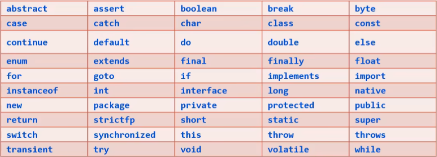
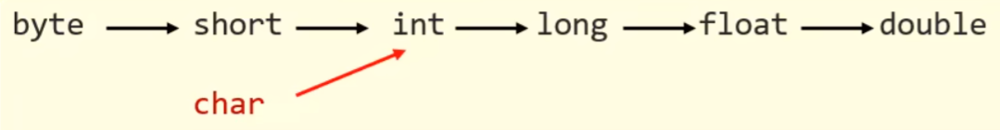
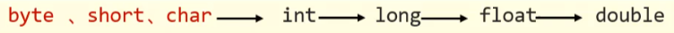
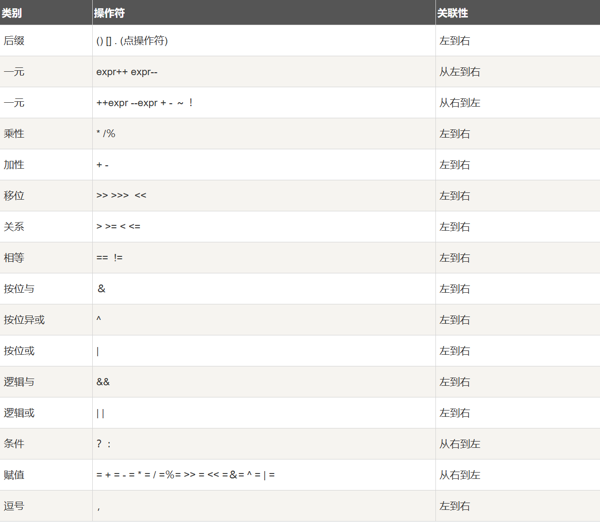
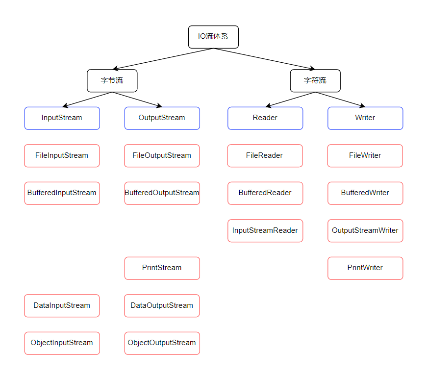
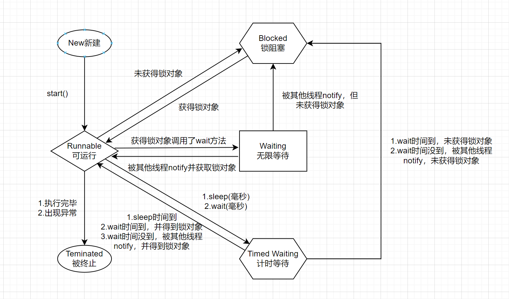

# JavaSE

## Java入门

安装Java编译环境，需要首先安装LTS版本的JDK，之后配置Path和JAVA_HOME环境变量。

*   JDK（Java Development Kit）：Java开发工具包。
    1.  JRE（Java Runtime Environment）：Java运行环境。
        1.  JVM（Java Virtual Machine）：Java虚拟机，真正运行Java程序的地方。
        2.  核心类库：Java自己写好的程序库，给程序员进行调用，例如System类等。
    2.  开发工具：javac、java等。
*   配置Path用于指定操作系统在哪些目录中查找可执行文件，例如java、javac等。
*   配置JAVA_HOME：
    *   用于简化其他工具的配置，例如许多开发工具（IDEA、Maven）依赖JAVA_HOME来定位JDK的安装位置。
    *   用于避免硬编码路径，例如在脚本或配置文件可使用`%JAVA_HOME%\bin`等形式的路径。
    *   用于多版本管理，只需修改JAVA_HOME的值，就可以切换到其他版本。

Java程序开发的步骤：

*   三个步骤：
    1.  编写代码：编写Main.java文件。
    2.  编译代码：使用`javac Main.java`编译得到Main.class文件。
    3.  运行代码：使用`java Main`运行Main.class文件。
*   注意：从JDK11开始使用`java Main.java`可以直接编译和运行Java程序。

IDEA管理Java程序的结构：Project（项目、工程）、Module（模块）、Package（包）、Class（类）。

注释：

*   写在程序中对代码进行解释说明的文字，方便自己和其他人查看，以便理解程序。
*   注释不影响程序的执行，因为javac编译的所得到class文件中已经不包含注释。
*   写注释是一个利人利己的好习惯。

```java
// 单行注释

/*
  多行注释
*/

/**
 * 文档注释
 */
```

字面量：计算机是用来处理数据的，字面量就是告诉程序员数据在程序中的书写格式。

*   整数和小数：
    *   以`0B`或`0b`开头的整型为二进制数。
    *   以`0`开头的整型为八进制数。
    *   以`0X`或`0x`开头的整型为十六进制数。
    *   以`L`或`l`结尾的整型为long类型（默认的整型为int类型）。
    *   以`F`或`f`结尾的浮点型为float类型（默认的浮点型为double类型）。
*   注意：字符必须用单引号围起来，并且有且仅能有一个字符；字符串必须用双引号围起来，可以没有或者有多个字符。

| 数据类型 | 生活中写法   | 程序中写法     |
| -------- | ------------ | -------------- |
| 整数     | 666, -88     | 666, -88       |
| 小数     | 13.14, -5.21 | 13.14, -5.21   |
| 字符     | A, 0, 我     | 'A', '0', '我' |
| 字符串   | HelloWorld   | "HelloWorld"   |
| 布尔值   | 真, 假       | true, false    |
| 空值     |              | null           |

变量：用来记住程序要处理的数据的。

*   变量的定义格式：`Type name = value;`。
*   变量存储在内存中的一块区域中，通过变量名访问该区域中的数据。
*   注意：
    *   变量必须先声明再使用。
    *   变量是声明了什么类型，就应该赋值什么类型的数据。
    *   变量只在作用域范围内有效，且同一范围内定义的变量，变量名不能重复。
    *   变量声明的时候可以不赋值，但是在使用前必须赋值。

关键字：Java语言中预定义的、有特定含义的单词，不能用来作为类名、变量名等。



标识符：Java语言中任意单词，如类名、方法名、变量名等都是标识符。

*   由数字、字母、下划线（`_`）和美元符（`$`）组成。
*   不能以数字开头、不能用关键字做为名字、且区分大小写。
*   标识符的建议规范：
    *   常量名称：使用大写字母（`FIRST_NAME`）。
    *   变量名称：使用小驼峰命名法（`firstName`）。
    *   方法名称：使用小驼峰命名法（`firstName`）。
    *   类名称：使用大驼峰命名法（`FirstName`）。

数据类型：

*   基本数据类型：直接存储数据值，而不是存储数据的地址，Java为每个基本数据类型提供了固定大小的存储空间。
    *   整型：byte（1B）、short（2B）、int（默认，4B）、long（8B）。
    *   浮点型：float（4B）、double（默认，8B）。
    *   字符型：char（2B）。
    *   布尔型：boolean（1B）。
*   引用数据类型：存储的是对象的地址，而不是对象本身的值。
    *   类（Class）：用于自定义的数据类型，如String、ArrayList、HashMap等。
    *   接口（Interface）：一种特殊的引用类型，完全由方法和常量组成，如Runnable、Comparable、Serializable等。
    *   数组（Array）：用于存储固定大小的同类型元素序列，如int[]、String[]、double[]等。

类型转换：

*   类型转换发生的情况：
    1.  存在某种类型的变量赋值给另一种类型的变量。
    2.  存在不同类型的数据一起运算。
*   类型转换的形式：
    *   自动类型转换：
        *   类型范围小的变量，可以直接赋值给类型范围大的变量。
        *   
        *   注意：
            *   从int或long类型转换成float或double类型时，可能会丢失精度。
            *   基本数据类型boolean不能转换为其他基本数据类型。
    *   表达式中自动类型转换：
        *   在一个表达式中有多个类型（例如多个变量相加减），那么小范围类型的变量会自动转换为表达式中较大范围的类型，再参与运算。
        *   
        *   注意：
            *   表达式的最终结果类型由表达式中的最大范围类型决定。
            *   在表达式中，byte、short、char类型会直接转换为int类型参与运算。
    *   强制类型转换：
        *   类型范围大的数据或者变量，直接赋值给类型范围小的变量，会报错。
        *   强制类型转换会强行将类型范围大的变量、数据赋值给类型范围小的变量，但是结果需要程序员自己负责，可能会截取数据、丢失精度等。
        *   强制类型转换的格式：`Type name1 = (Type) name2;`。
        *   注意：
            *   强制类型转换可能造成数据（丢失）溢出。
            *   浮点型强转成整型时，直接丢掉小数部分，保留整数部分返回。

运算符：对变量、字面量进行运算的符号。

*   算术运算符：`+`、`-`、`*`、`/`、`%`。
*   连接符：`+`。用于将字符串类型与其他类型进行连接，结果还是字符串，例如：`"hello" + "world" => "helloworld"`，`"hello" + 1 => "hello1"`，`"hello" + 1.0 => "hello1.0"`，`"hello" + 'a' => "helloa"`，`"hello" + true => "hellotrue"`，`1 + 'a' + "hello" => "98hello"`。
*   自增自减运算符：`++`、`--`。放在某个变量的前面或者后面，对变量自身的值进行自增或自减操作。
*   赋值运算符：`=`、`+=`、`-=`、`*=`、`/=`、`%=`。例如`a+=b;`其底层代码是`a = (a的类型) (a + b);`。
*   关系运算符：`>`、`>=`、`<`、`<=`、`==`、`!=`。成立返回`true`，不成立返回`false`。
*   逻辑运算符：`&&`、`||`、`&`、`|`、`!`、`^`。把多个条件放在一起运算，最终返回布尔类型的值，即`true`或`false`。短路与和短路或的执行效率更高，一般都会使用`&&`和`||`。
*   三元运算符：`condition ? value1 : value2`。

运算符优先级：



获取键盘输入：

```java
import java.util.Scanner;

public class Main {
  public static void main(String[] args) {
    Scanner sc = new Scanner(System.in);

    System.out.println("Please input your name: ");
    String name = sc.next();
    System.out.println("Please input your age: ");
    int age = sc.nextInt();
    System.out.println("Hello, " + name + ", you are " + age + " years old.")
  }
}
```

程序中最经典的三种执行顺序：顺序结构、分支结构和循环结构。

*   顺序结构：程序按代码书写顺序依次执行，是最基本的程序结构。
*   分支结构：根据条件判断选择不同的执行路径。
    *   `if`分支：

        ```java
        if (condition) {
          // do something
        } else if (condition) {
          // do something
        } else if (condition) {
          // do something
        } else {
          // do something
        }
        ```

    *   `switch`分支：
        *   表达式类型只能是byte、short、int、char，JDK5开始支持枚举，JDK7开始支持字符串，不支持double、float、long。
        *   case给出的值不允许重复，且只能是字面量，不能是变量。
        *   正常使用switch时，不要忘记break，否则会出现穿透现象；特殊情况下，也可以合理利用穿透现象以实现某些需求。

        ```java
        switch (expression) {
          case value1:
            // do something
            break;
          case value2:
            // do something
            break;
          default:
            // do something
        }
        ```

*   循环结构：在满足条件时重复执行某段代码，直到条件不成立。如果知道循环次数，那么用`for`循环；如果不知道循环次数，那么用`while`循环。`while`循环是先判断后执行；`do-while`循环是先执行后判断。
    *   `for`循环：

        ```java
        for (initialization; condition; increment/decrement) {
          // do something
        }
        ```

    *   `while`循环：

        ```java
        initialization;
        while (condition) {
          // do something
          increment/decrement;
        }
        ```

    *   `do-while`循环：

        ```java
        initialization;
        do {
          // do something
          increment/decrement;
        } while (condition);
        ```

`break`关键字：跳出并结束当前所在循环的执行。

`continue`关键字：跳出当前循环的当次执行，直接进入循环的下一次执行。

生成随机数：

```java
import java.util.Random;

public class Main {
  public static void main(String[] args) {
    Random random = new Random();
    int number = random.nextInt(10);  // 获取一个 0 到 9 之间的随机数
    System.out.println(number);
    number = random.nextInt(10) + 1;  // 获取一个 1 到 10 之间的随机数
    System.out.println(number);
  }
}
```

数组：一个容器，用来存储一批同样类型的数据。

*   数组的定义和访问：
    *   静态初始化数组：
        *   完整格式：`Type[] arrayName = new Type[]{value1, value2, ..., valueN};`。
        *   简化格式：`Type[] arrayName = {value1, value2, ..., valueN};`。
        *   注意：
            *   `Type[] arrayName`和`Type arrayName[]`是等价的，但是推荐使用前者。
            *   什么类型的数组只能存放什么类型的数据。
    *   动态初始化数组：
        *   定义数组时先不存入具体的元素值，只确定数组存储的数据类型和数组的长度。
        *   格式：

            ```java
            // Type[] arrayName = new Type[arrayLength];
            int[] arrayName = new int[5];
            ```

        *   动态初始化数组元素默认值规则：
            *   基本类型：
                *   byte、short、char、int、long类型的数组会默认初始化为0。
                *   float、double类型的数组会默认初始化为0.0。
                *   boolean类型的数组会默认初始化为false。
            *   引用类型：类、接口、数组等类型的数组会默认初始化为null。
    *   获取数组长度：`arrayName.length`。
    *   数组最大索引：`arrayName.length - 1`或`0`（当数组为空时）。
    *   修改数组元素：`arrayName[index] = value;`。
    *   输出数组地址：`System.out.println(arrayName);`。
    *   输出数组元素：`System.out.println(arrayName[index]);`。
    *   遍历数组：

        ```java
        for (int i = 0; i < arrayName.length; i++) {
          System.out.println(arrayName[i]);
        }
        ```

    *   反转数组：

        ```java
        for (int i = 0, j = arrayName.length - 1; i < j; i++, j--) {
          int temp = arrayName[i];
          arrayName[i] = arrayName[j];
          arrayName[j] = temp;
        }
        ```

    *   随机打乱：

        ```java
        Random random = new Random();
        for (int i = 0; i < arrayName.length; i++) {
          int index = random.nextInt(arrayName.length);
          int temp = arrayName[i];
          arrayName[i] = arrayName[index];
          arrayName[index] = temp;
        }
        ```

*   多维数组：二维数组是数组的数组；多维数组是二维数组的扩展，包含更多维度（三维及以上）。
    *   特点：
        *   非连续存储：每行独立分配内存。
        *   不规则性：不同行可有不同长度。
        *   引用结构：外层数组存储内层数组的引用。
    *   二维数组的创建：

        ```java
        // 方法 1：静态初始化
        int[][] arrayName1 = {{1, 2}, {3, 4, 5}, {6}};

        // 方法 2：动态初始化（规则数组）
        int[][] arrayName2 = new int[3][4];  // 创建一个 3 行 4 列的二维数组

        // 方法 3：动态初始化（不规则数组）
        int[][] arrayName3 = new int[3][];
        arrayName3[0] = new int[1];
        arrayName3[1] = new int[3];
        arrayName3[2] = new int[2];
        ```

    *   遍历二维数组：

        ```java
        for (int i = 0; i < arrayName.length; i++) {
          for (int j = 0; j < arrayName[i].length; j++) {
            System.out.print(arrayName[i][j] + " ");
          }
        }
        ```

    *   三维数组的创建：

        ```java
        // 方法 1：静态初始化
        int[][][] arrayName1 = {
          {{1, 2}, {3, 4, 5}, {6}},
          {{7, 8}, {9, 10}, {11, 12, 13}}
        };

        // 方法 2：动态初始化（规则数组）
        int[][][] arrayName2 = new int[2][3][2];

        // 方法 3：动态初始化（不规则数组）
        int[][][] arrayName3 = new int[2][][];
        arrayName3[0] = new int[3][];
        arrayName3[0][0] = new int[2];
        arrayName3[0][1] = new int[3];
        arrayName3[0][2] = new int[1];
        arrayName3[1] = new int[2][];
        arrayName3[1][0] = new int[5];
        arrayName3[1][1] = new int[2];
        ```

    *   遍历三维数组：

        ```java
        for (int i = 0; i < arrayName.length; i++) {
          for (int j = 0; j < arrayName[i].length; j++) {
            for (int k = 0; k < arrayName[i][j].length; k++) {
              System.out.print(arrayName[i][j][k] + " ");
            }
          }
        }
        ```

*   数组的排序：
    *   如果数组中元素是基本数据类型，那么数组可以使用Arrays.sort()进行排序。

        ```java
        int[] array = {5, 3, 8, 1, 4};
        Arrays.sort(array);
        System.out.println(Arrays.toString(array));  // 输出 [1, 3, 4, 5, 8]
        ```

    *   如果数组中元素是引用数据类型，那么直接使用Arrays.sort()是无效的。有两种解决方案：
        1.  让该对象的类实现Comparable（比较规则）接口，然后重写compareTo方法，自己来制定比较规则。

            ```java
            public class Student implements Comparable<Student> {
              private String name;
              private int age;

              public Student() {}

              public Student(String name, int age) {
                this.name = name;
                this.age = age;
              }

              public String getName() {
                return name;
              }

              public void setName(String name) {
                this.name = name;
              }

              public int getAge() {
                return age;
              }

              public void setAge(int age) {
                this.age = age;
              }

              @Override
              public int compareTo(Student o) {
                // 通过年龄进行排序
                return this.age - o.age;  // 升序
                // return o.age - this.age;  // 降序
              }

              @Override
              public String toString() {
                return "Student{" + "name='" + name + "', age=" + age + '}';
              }
            }
            ```

            ```java
            public class Main {
              public static void main(String[] args) {
                Student[] students = new Student[3];
                students[0] = new Student("张三", 18);
                students[1] = new Student("李四", 17);
                students[2] = new Student("王五", 19);

                Arrays.sort(students);
                System.out.println(Arrays.toString(students));
              }
            }
            ```

        2.  使用支持创建Comparator比较器接口的匿名内部类对象的sort方法，然后自己制定比较规则。

            ```java
            public class Student {
              private String name;
              private int age;

              public Student() {}

              public Student(String name, int age) {
                this.name = name;
                this.age = age;
              }

              public String getName() {
                return name;
              }

              public void setName(String name) {
                this.name = name;
              }

              public int getAge() {
                return age;
              }

              public void setAge(int age) {
                this.age = age;
              }

              @Override
              public String toString() {
                return "Student{" + "name='" + name + "', age=" + age + '}';
              }
            }
            ```

            ```java
            public class Main {
              public static void main(String[] args) {
                Student[] students = new Student[3];
                students[0] = new Student("张三", 18);
                students[1] = new Student("李四", 17);
                students[2] = new Student("王五", 19);

                Arrays.sort(students, new Comparator<Student>() {
                  @Override
                  public int compare(Student o1, Student o2) {
                    return o1.getAge() - o2.getAge();  // 升序
                    // return o2.getAge() - o1.getAge();  // 降序
                  }
                });
                System.out.println(Arrays.toString(students));
              }
            }
            ```

JVM中包含方法区、栈内存和堆内存三个内存区域：

*   方法区（Method Area）：
    *   方法区是JVM中所有线程共享的内存区域，用于存储已被虚拟机加载的类信息、常量、静态变量、即时编译器编译后的代码缓存等数据。
    *   存储如下数据：
        *   类元数据：类的结构信息（如类名、访问修饰符、父类名、实现的接口列表）、字段信息（名称、类型、修饰符）、方法信息（名称、返回类型、参数类型、修饰符、字节码）、运行时常量池的引用等，可以看作是类的“蓝图”或“模板”。
        *   运行时常量池：这是方法区的一部分，每个类或接口在加载后，其文件中的常量池表会被解析并存储到运行时常量池中，它包含：
            *   编译期生成的各种字面量（如字符串字面量、final基本类型常量）。
            *   符号引用（如类和接口的全限定名、字段和方法的名称和描述符）。
        *   静态变量：使用static关键字声明的类变量。
        *   JIT编译后的代码：即时编译器将热点字节码编译成本地机器码后的缓存。
    *   特点：
        *   线程共享：所有线程都可以访问这里的信息。
        *   逻辑上是堆的一部分：JVM规范将方法区描述为堆的一个逻辑部分，但实现上可以独立于堆。
        *   永久代（PermGen）和元空间（Metaspace）：
            *   在JDK7及之前，HotSpot虚拟机使用永久代来实现方法区，它位于堆内存中，大小受限（通过-XX:MaxPermSize设置），容易导致OutOfMemoryError。
            *   从JDK8开始，HotSpot虚拟机移除了永久代，改用元空间来实现方法区，元空间使用本地内存（Native Memory），不再受限于JVM堆的大小（默认只受本地内存限制，可通过-XX:MaxMetaspaceSize设置上限）。这大大减少了方法区溢出的风险，并且垃圾回收效率更高。
*   栈内存（Stack Memory）：
    *   为每个正在执行的线程分配一个私有的栈，栈用于存储方法调用时的栈帧。每个方法从调用到执行完成，对应着一个栈帧在虚拟机栈中从入栈到出栈的过程。栈帧存储局部变量表、操作数栈、动态链接、方法出口信息等。
    *   存储如下信息（在栈帧中）：
        *   局部变量表：存放编译期可知的各种基本数据类型（boolean、char、byte、short、int、long、float、double）、对象引用（reference类型，指向对象在堆中的地址）和returnAddress类型（指向一条字节码指令的地址）。局部变量所需的内存空间在编译期间完成分配。
        *   操作数栈：方法执行过程中进行算术运算或调用其他方法传递参数的临时工作区。字节码指令主要在这里操作数据（压栈、弹栈、运算）。
        *   动态链接：指向方法区中该栈帧所属方法的引用，用于支持方法调用过程中的动态绑定（多态）。
        *   方法返回地址：方法正常退出或异常退出时，需要返回到调用该方法的位置继续执行。
    *   特点：
        *   线程私有：每个线程都有自己的栈，互不干扰。
        *   快速访问：内存分配和回收通过指针的移动实现（压栈/弹栈），速度极快。
        *   生命周期与线程相同：线程创建时分配，线程结束时销毁。
        *   大小有限：栈深度是有限的（可通过-Xss参数设置栈大小）。如果线程请求的栈深度大于虚拟机所允许的深度（如无限递归），将抛出StackOverflowError异常。如果栈可以动态扩展但无法申请到足够内存，将抛出OutOfMemoryError异常。
        *   不存在垃圾回收：栈帧随着方法调用结束（无论是正常返回还是抛出异常）而自动弹出销毁，局部变量占用的内存随之释放，不需要垃圾回收机制介入。
*   堆内存（Heap Memroy）：
    *   堆是JVM管理的内存中最大的一块，被所有线程共享。堆的唯一目的就是存放对象实例和数组（在逻辑上，数组也是对象）。几乎所有通过new关键字创建的对象实例和数组都在堆上分配内存。
    *   存储如下信息：
        *   对象实例：程序中创建的所有对象（包括它们的实例变量/字段）。
        *   数组：各种类型的数组。
    *   特点：
        *   线程共享：所有线程都可以访问堆中的对象（通过引用）。
        *   在虚拟机启动时创建：堆是JVM启动时就分配好的内存区域。
        *   GC的主要管理区域：堆是垃圾收集器管理的主要区域，因此常被称为“GC堆”（Garbaga-Collected Heap）。垃圾回收的主要目标就是回收堆中不再被引用的对象所占用的内存。
        *   分代管理：现代JVM的堆通常采用分代收集算法进行管理，划分为不同的区域。
            *   新生代（Young Generation）：存放新创建的对象。大多数对象在这里很快变得不可达并被回收（Minor GC）。又细分为：
                *   Eden区：新对象首先在这里分配。
                *   Survivor区（两个，通常是S0和S1）：经历Minor GC后存活的对象会被移动到Survivor区，并在两个Survivor区之间来回拷贝，直到达到一定年龄。
            *   老年代（Old Generation/Tenured Generation）：存放存活时间较长、在新生代中经历多次GC后仍然存活的对象。当老年代空间不足时，会触发Major GC/Full GC，通常比Minor GC慢得多。
            *   （可选）永久代/元空间：在JDK7及以前，方法区的实现（永久代）在逻辑上属于堆的一部分。在JDK8+中，方法区的实现（元空间）移动到本地内存，不再属于堆的一部分。
        *   大小可调：堆的大小可以通过JVM参数（如-Xms初始化堆大小，-Xmx最大堆大小）进行调整。
        *   可能溢出：如果堆中没有足够的内存完成实例分配，并且堆也无法再扩展时（达到-Xmx设置的最大值），将会抛出OutOfMemoryError异常。
*   简单理解三者关系：
    *   创建对象：`MyObject obj = new MyObject();`。
        *   `new MyObject()`：在堆上分配内存，创建`MyObject`类的实例对象。
        *   `MyObject obj`：在栈的当前方法栈帧的局部变量表中，创建一个`obj`对象（引用类型）。
        *   `=`：将堆中新建的`MyObject`对象的内存地址赋值给栈中的`obj`变量（建立引用关系）。
        *   `MyObject`类的信息（字段定义、方法字节码等）存储在方法区。
    *   方法调用：`obj.doSomething();`。
        *   当前线程的栈上会为`doSomething()`方法创建一个新的栈帧并压入栈顶。
        *   `doSomething()`方法的字节码指令（存储在方法区）开始执行。
        *   方法内部使用的局部变量（包括参数、临时变量）存放在该方法的栈帧的局部变量表中。
        *   如果方法内部又创建了新对象（`new ...`），这些新对象在堆上分配。
        *   方法执行完毕，其对应的栈帧弹出销毁，局部变量消失（如果局部变量引用了堆上的对象，该引用消失，但对象本身还在堆上，等待GC判断是否回收）。
    *   常量和静态变量：
        *   `String s = "hello";`：字符串字面量`"hello"`存储在方法区的运行时常量池中。`s`是栈中的引用，直接指向常量池中地址。
        *   `static int count = 0;`：`count`变量本身存储在方法区，对该变量的访问是全局的。

方法：

*   方法是一种语法结构，它可以把一段代码封装成一个功能，以便重复调用。
*   方法的定义格式：

    ```txt
    修饰符 返回值类型 方法名(形参列表) {
      方法体代码
      return 返回值;
    }
    ```

    ```java
    public static int sum(int a, int b) {
      int c = a + b;
      reuturn c;
    }
    ```

*   方法的使用注意：
    *   方法定义时，需要按照方法解决的实际业务需求，来设计合理的方法形式解决问题。
    *   方法在类中位置放前放后无所谓，但一个方法不能定义在另一个方法里面。
    *   如果方法不需要返回数据，返回值类型必须声明为void（无返回值声明），此时方法内部不可以使用return返回数据，但是可以使用return提前退出方法。如果方法的返回值类型写了具体类型，方法内部则必须使用return返回对应类型的数据。
    *   return语句的下面，不能编写代码，属于无效的代码，不能执行到。
    *   方法不调用就不会执行，调用方法时，传给方法的数据，必须严格匹配方法的参数情况。
    *   方法如果不需要接受数据，则不需要定义形参，且调用方法时也不用传数据给方法了。
    *   没有参数且没有返回值类型的方法，称为无参数、无返回值的方法，依次类推。
*   方法在计算机中执行原理：
    *   方法的运行区域是栈内存。
    *   栈具有先进后出的特点，可以保证一个方法调用完另一个方法后，可以返回原方法。
*   Java中参数传递机制都是值传递：
    *   实参：在方法内部定义的变量。
    *   形参：方法定义时形参列表中声明的变量。
    *   值传递：指的是传递实参给方法的形参时，传输的是实参变量中存储的值的副本。
    *   基本类型传递的是当前值的拷贝，而引用类型传递的是当前引用地址的拷贝。
*   方法重载：
    *   一个类中，出现多个方法的名称相同，但是它们的形参列表不同，那么这些方法称为方法重载。
    *   方法重载的应用场景：开发中我们经常需要为处理一类业务，提供多种解决方案，此时用方法重载来设计是很专业的。
    *   注意：
        *   一个类中，只要一些方法的名称相同、形参列表不同，那么它们就是方法重载。其他的修饰符、返回值类型是否一样不影响。
        *   形参列表不同指的是形参个数、类型、顺序不同，不关心形参的名称。
*   方法递归：
    *   递归是一种算法，在程序设计语言中广泛应用。
    *   递归的形式：
        *   直接递归：方法自己调用自己。
        *   间接递归：方法调用其他方法，其他方法又回调方法自己。
    *   递归算法三要素：递归的公式；递归的终结点；递归的方法必须走向终结点。
    *   注意：递归如果没有控制好终止，会出现递归死循环，导致栈内存溢出错误。

    ```java
    /**
     * 计算 5 的阶乘
     */
    public class Main {
      public static void main(String[] args) {
        System.out.println(factorial(5));
      }

      // 递归的公式：f(n) = n * f(n-1)
      // 递归的终结点：f(1) = 1
      public static int factorial(int n) {
        if (n == 1) {
          return 1;
        } else {
          return n * factorial(n - 1);
        }
      }
    }
    ```

    ```java
    /**
     * 猴子吃桃问题
     */
    public class Main {
      public static void main(String[] args) {
        System.out.println(monkeyEatPeach(1));
      }

      public static int monkeyEatPeach(int day) {
        if (day == 10) {
          return 1;
        } else {
          return (monkeyEatPeach(day + 1) + 1) * 2;
        }
      }
    }
    ```

可变参数：

*   一种特殊形参，定义在方法、构造器的形参列表里，格式为`Type... paramName`。
*   可变参数的特点：可以不传数据给它；可以传一个或者同时传多个数据给它；也可以传一个数组给它。
*   可变参数的好处：常常用来灵活的接收数据。
*   注意：
    *   可变参数在方法内部就是一个数组。
    *   一个形参列表中可变参数只能有一个。
    *   可变参数必须放在形参列表的最后一个位置。

```java
public class Main {
  public static void main(String[] args) {
    test(1);
    test(1, 2, 3, 4, 5);
    test(1, new int[]{2, 3, 4, 5});
  }

  public static void test(int i, int... nums) {
    System.out.println(i);
    System.out.println(nums.length);
    System.out.println(Arrays.toString(nums));
  }
}
```

面向对象编程：

*   面向对象编程，更加符合人类思维习惯，编程也会更直观。
*   对象是一种特殊的数据结构，可以通过类创建出对象。类中封装了属性（数据）和方法（行为），而实例化后的对象则可以使用类中的属性和方法。
*   注意：
    *   类名建议用英文单词，首字母大写，满足大写驼峰命名法。
    *   类中定义的变量也称为成员变量（对象的数据），类中定义的方法也称为成员方法（对象的行为）。
    *   成员变量本身存在默认值，在定义成员变量时一般来说不需要赋初始值。成员变量的默认值和上述数组中变量的默认值一样。
    *   一个代码文件中，可以写多个类，但是只能有一个public类。而且public类的类名必须和文件名一致。
    *   对象与对象之间的数据不会相互影响，但多个变量指向同一个对象时就会相互影响。
    *   如果某个对象没有一个变量引用它，则该对象无法被操作了，该对象会被垃圾回收机制回收。
*   this是一个对象，可以用在类的方法中，表示当前对象。this主要用来解决变量名称冲突的问题，区分类的成员变量和方法中的局部变量。
*   构造器：
    *   一种特殊的方法，方法名与类名相同，无返回值和返回类型，用于初始化对象。
    *   注意：
        *   类在设计时，如果不写构造器，Java会给类自动生成一个无参构造器。
        *   一旦定义了有参构造器，Java就不会给类生成无参构造器，此时如果需要无参构造器则需要手动添加无参构造器。
*   封装：
    *   面向对象的三大特征之一。
    *   用类设计对象处理某一个事物的数据时，应把要处理的数据，以及处理这些数据的行为，设计到一个类中，并把数据定义为类的成员变量，把处理这些数据的行为定义为类的成员方法。
    *   封装的设计规范：合理隐藏，合理暴露。
*   实体类（JavaBean）：
    *   实体类定义时需要满足的规则：
        *   这个类中成员变量都要私有，并且要对外提供相应的getter和setter方法。
        *   类中必须要有一个公共的无参构造器。
    *   实体类只负责数据存取，而对数据的处理交给其他类来完成，以实现数据和数据业务处理相分离。

    ```java
    public class Student {
      private String name;
      private double score;

      public Student() {
      }

      public Student(String name, double score) {
        this.name = name;
        this.score = score;
      }

      public String getName() {
        return name;
      }

      public void setName(String name) {
        this.name = name;
      }

      public double getScore() {
        return score;
      }

      public void setScore(double score) {
        this.score = score;
      }
    }
    ```

*   成员变量和局部变量的区别（Java中只提成员变量，不提全局变量）：
    *   类中位置不同：成员变量定义在类中、方法外；局部变量定义在方法中。
    *   初始化值不同：成员变量有默认值，不需要初始化赋值；局部变量没有默认值，使用之前必须完成赋值。
    *   内存位置不同：成员变量存储在堆内存中；局部变量存储在栈内存中。
    *   作用域不同：成员变量作用域为整个类；局部变量作用域为所归属大括号中。
    *   生命周期不同：成员变量生命周期为对象生命周期；局部变量生命周期为方法生命周期。

## Java进阶

static：静态，可以修饰成员变量、成员方法。

*   成员变量按照有无static修饰，分为两种：
    *   类变量（静态变量）：有static修饰，属于类，在计算机里只有一份数据，会被类的全部对象共享；可以使用类名或对象名进行访问。
    *   实例变量：无static修饰，属于每个对象，每个对象都有自己的数据；只能使用对象名进行访问。
*   类变量的应用场景：在开发中，如果某个数据只需要一份，且希望能够被共享（修改、访问），则该数据可以定义成类变量记住。

    ```java
    public class User {
      public static int number;

      public User() {
        User.number++;
      }
    }
    ```

*   成员方法按照有无static修饰，分为两种：
    *   类方法（静态方法）：有static修饰，属于类；可以使用类名或对象名进行访问。
    *   实例方法：无static修饰，属于对象；只能使用对象名进行访问。
*   类方法的应用场景：
    *   工具类中的方法都是一些类方法，每个方法都是用来完成一个功能。
    *   工具类是给开发人员共同使用的，使用类方法设计工具类提高了代码复用和开发效率。
    *   实例方法需要创建对象才能调用，创建的对象会占用内存，这样会浪费内存；类方法直接通过类名调用就可以，调用方便且节省内存。
    *   由于工具类没有创建对象的需求，建议将工具类的构造器进行私有化。
  
    ```java
    public class CalculationUtils {
      private CalculationUtils() {}

      public static int add(int a, int b) {
        return a + b;
      }

      public static int sub(int a, int b) {
        return a - b;
      }
    }
    ```

*   使用类方法、实例方法时的注意事项：
    *   类方法中可以直接访问类的成员，不可以直接访问实例成员。
    *   实例方法中既可以直接访问类成员，也可以直接访问实例成员。
    *   实例方法中可以出现this关键字，类方法中不可以出现this关键字。

代码块：

*   代码块是类的五大成分之一。五大成分分别是：成员变量、构造器、方法、代码块和内部类。
*   代码块分为两种：
    *   静态代码块：
        *   格式：`static {}`。
        *   特点：类加载时自动执行，由于类只会加载一次，所以静态代码块也只会执行一次。
        *   作用：完成类的初始化，例如对类变量的初始化赋值。
    *   实例代码块：
        *   格式：`{}`。
        *   特点：每次创建对象时，执行实例代码块，并在构造器前执行。
        *   作用：和构造器一样，都是用来完成对象的初始化，例如对实例变量的初始化赋值。

设计模式（Design Pattern）：

*   一个问题通常有n种解法，其中肯定有一种解法是最优的，这个最优的解法被人总结出来，称之为设计模式。
*   设计模式一共有23种，对应23种软件开发中会遇到的问题。

单例设计模式：

*   确保一个类只有一个对象。
*   写法：
    1.  把类的构造器私有。
    2.  定义一个类变量用于存储对象。
    3.  定义一个类方法，保证返回的是同一个对象。
*   单例设计模式分为很多种，这里介绍两种：
    *   饿汉式单例：拿对象时，对象早就创建好了。

        ```java
        public class A {
          private static final A a = new A();

          private A() {}

          public static A getInstance() {
            return a;
          }
        }
        ```

    *   懒汉式单例：拿对象时，才开始创建对象。

        ```java
        // 非线程安全
        public class A {
          private static A a;

          private A() {}

          public static A getInstance() {
            if (a == null) {
              a = new A();
            }
            return a;
          }
        }
        ```

        ```java
        // 线程安全
        public class A {
          // volatile 关键字保证了变量的可见性和禁止指令重排
          private static volatile A a;

          private A() {}

          // 使用双重锁定检查线程安全
          public static A getInstance() {
            if (a == null) {
              synchronized (A.class) {
                if (a == null) {
                  a = new A();
                }
              }
            }
            return a;
          }
        }
        ```

    *   当需要频繁访问对象时，使用饿汉式单例获取对象；当不需要频繁访问对象甚至不一定访问对象时，使用懒汉式单例获取对象。
*   单例模式的应用场景：例如任务管理器对象，获取运行时对象只需要一个任务管理器对象。这样可以避免创建多个对象，节省内存。

继承：

*   面向对象的三大特征之一。
*   使用Java中提供的关键字extends，可以让一个类和另一个类建立起父子关系。
*   继承的特点：
    *   减少重复代码的编写，提高了代码的复用性。
    *   子类的对象由子类、父类共同创建完成的，即子类对象中包含父类和子类的所有成员，但是不一定都能访问。
    *   使用子类创建的对象可以访问父类的非私有成员（成员变量、成员方法）。
*   权限修饰符：
    *   用来限制类中的成员（成员变量、成员方法、构造器、代码块...）能够被访问的范围。
    *   权限修饰符分为四类：
        *   private：仅支持在当前类中进行访问。
        *   缺省：仅支持在当前类中和同一个包下的其他类中进行访问。
        *   protected：支持在当前类中、同一个包下的其他类中和任意包下的子类中进行访问。
        *   public：支持在当前类中、同一个包下的其他类中、任意包下的子类中和任意包下的任意类中进行访问，即任何地方都支持访问。
*   单继承：Java支持单继承，Java不支持多继承，但是支持多重继承。
*   Object类：是Java中所有类的根类。我们编写的任何一个类，其实都是Object类的子类或子孙类。
*   方法重写：
    *   当子类觉得父类中的某个方法不好用，或者无法满足自己的需求时，子类可以重写一个参数列表一样的方法，去覆盖父类的这个方法，这就是方法重写。如果参数列表不一样，那就是方法重载。
    *   注意：
        *   重写后，方法的访问会遵循就近原则，即子类会优先调用子类中的方法，如果子类中没有，就会调用父类中的方法。
        *   使用Override注解，它可以告知Java编译器，检查我们的方法重写的格式是否正确，代码可读性也会更好。
        *   子类重写父类方法时，访问权限必须大于或者等于父类该方法的权限（public>protected>default）。
        *   重写的方法返回值类型必须与被重写方法的返回值类型一样或者范围更小。
        *   父类中的私有方法、静态方法不能被重写，如果重写会抛出编译错误。
    *   子类可以重写Object类的toString方法，以便返回对象的描述信息。
*   注意：
    *   在子类方法中访问成员（成员变量、成员方法），依照就近原则。先在子类局部范围找，如果没有就在子类成员范围内找，如果还没有就在父类范围内找，如果再没有就报错。如果子类中有该成员，但还是要访问父类成员，则使用super关键字；同时可以使用this关键字标注访问的是子类中成员。
    *   子类的全部构造器，都会先调用父类的构造器，再执行自己的构造器。默认情况下，子类全部构造器的第一行代码都是super()，写不写都有，它会调用父类的无参构造器。如果父类没有无参构造器（只给父类写了一个有参构造器），则我们必须在子类构造器的第一行手写super(...)，指定去调用父类的有参构造器。
    *   任意类的构造器中，可以通过this(...)来调用该类的其他构造器。
    *   this(...)和super(...)不能在同一个构造器中被调用。

```java
// Person类
public class Person {
  private String name;
  private int age;

  public Person() {}

  public Person(String name, int age) {
    this.name = name;
    this.age = age;
  }

  public String getName() {
    return name;
  }

  public void setName(String name) {
    this.name = name;
  }

  public int getAge() {
    return age;
  }

  public void setAge(int age) {
    this.age = age;
  }

  public void show() {
    System.out.println(name + ":" + age);
  }
}
```

```java
// Student类
public class Student extends Person {
  private String school;
  
  public Student() {}

  public Student(String name, int age, String school) {
    super(name, age);
    this.school = school;
  }

  public String getSchool() {
    return school;
  }

  public void setSchool(String school) {
    this.school = school;
  }

  @Override
  public void show() {
    System.out.println(getName() + ":" + getAge() + ":" + school);
  }
}
```

多态：

*   面向对象的三大特征之一。
*   多态的前提：有继承/实现关系；存在父类引用子类对象；存在方法重写。
*   多态是在继承/实现情况下的一种现象，表现为：对象多态、行为多态。
*   注意：多态是对象、行为的多态，Java中不谈属性（成员变量）的多态。

    ```java
    public class Person {
      public String className = "Person";

      public void show() {
        System.out.println("Person show()");
      }
    }
    ```

    ```java
    public class Student extends Person {
      public String className = "Student";

      @Override
      public void show() {
        System.out.println("Student show()");
      }
    }
    ```

    ```java
    public class Test {
      public static void main(String[] args) {
        Person p = new Student();  // 对象多态
        System.out.println(p.className);  // 一般情况下不会使用 public 修饰一个成员变量，并赋初始值，这里只是演示，会打印 Person，不存在属性多态
        p.show();  // 行为多态，打印 Student show()
      }
    }
    ```

*   多态的好处：在多态形式下，右边对象是解耦合的，更便于扩展和维护；定义方法时，使用父类类型的形参，可以接收一切子类对象，扩展性更强，更便利。
*   多态情况下会产生一个问题：
    *   多态不能使用子类的独有方法。
    *   解决方案：使用类型转换。

        ```java
        // 当使用多态时，存在自动类型转换
        Person p = new Student();

        // 当将父类对象赋给子类对象时，需要强制类型转换
        Student s = (Student) p;
        ```

    *   强制类型转换的注意事项：
        *   存在继承/实现关系就可以在编译阶段进行强制类型转换，编译阶段不会报错。
        *   运行时，如果发现对象的真实类型与强转后的类型不同，就会报类型转换异常（ClassCastException）。

        ```java
        // 假设 Student 和 Teacher 都继承 Person
        Person p = new Teacher();
        Student s = (Student) p;  // 抛出 java.lang.ClassCastException
        ```

    *   建议在强制类型转换前，使用instanceof关键字判断对象的真实类型：

        ```java
        if (p instanceof Student) {
          Student s = (Student) p;
        } else if (p instanceof Teacher) {
          Teacher t = (Teacher) p;
        }
        ```

final：该关键字是最终的意思，可以修饰类、方法、变量。

*   修饰类：该类被称为最终类，特点是不能被继承了。
*   修饰方法：该方法被称为最终方法，特点是不能被重写。
*   修饰变量：该变量只能被赋值一次。
    *   Java中存在成员变量（实例成员变量和类成员变量）和局部变量。当使用final修饰类成员变量时，必须对变量进行初始化，且此时该变量可以称之为常量，例如`public static final int MAX_SIZE = 100;`；当使用final修饰实例成员变量时，因不能修改几乎没有意义，所以一般不建议使用final修饰实例成员变量；当使用final修饰局部变量时，表示该变量只能被赋值一次，例如`final int i;`然后`i = 10;`，再给该变量修改值将报错。
    *   final修饰基本类型的变量，变量存储的数据不能被改变；final修饰引用类型的变量，变量存储的地址不能被改变，但地址所指向对象的内容是可以被改变的。

常量：

*   使用static final修饰的成员变量就被称之为常量。
*   通常用于记录系统的配置信息，比如数据库的连接信息，服务器的IP地址等等。
*   常量名一般建议使用大写英文单词，多个单词使用下划线连接起来。
*   常量的执行原理：程序编译后，常量会被“宏替换”，出现常量的地方全部被替换成其记住的字面量，这样可以保证使用常量和直接用字面量的性能是一样的。

抽象类：

*   在Java中有一个关键字叫做abstract，它就是抽象的意思，可以用它来修饰类、成员方法。
*   当abstract修饰一个类时，这个类就是抽象类；当abstract修饰一个成员方法时，这个方法就是抽象方法。

    ```java
    public abstract class AbstractClass {
      // 抽象方法只能有方法签名，不能有方法体
      public abstract void abstractMethod();
    }
    ```

*   抽象类的注意事项：
    *   抽象类中不一定有抽象方法，有抽象方法的类一定是抽象类。
    *   类该有的成员（成员变量、方法、构造器）抽象类都可以有。
    *   抽象类最主要的特点是抽象类不能创建对象，仅作为一种特殊的父类，让子类继承并实现。
    *   一个类继承抽象类，必须重写完抽象类的全部抽象方法，否则这个类也必须定义成抽象类。
*   抽象类的好处：父类知道每个子类都要做某个行为，但每个子类要做的情况不一样，父类就可以定义抽象方法，交给子类去重写实现。所以设计抽象类的本质是为了更好的支持多态性。

模板方法模式：

*   模板方法模式是一种行为型设计模式，它在父类中定义一个算法的骨架，而将算法的某些步骤延迟到子类中实现。
*   模板方法模式的写法：
    1.  定义一个抽象类。
    2.  在里面定义两种方法：一个是模板方法，把相同代码放里面；一个是抽象方法，把具体实现交给子类完成。
*   注意：建议使用final修饰模板方法，避免子类重写。

```java
// 直播模板类
public abstract class LivePlay {
  // 模板方法
  public final void seeLivePlay() {
    login();
    openRoom();
    startAudioAndVideoStream();
    pushVideoStream();
    stopAudioAndVideoStream();
    closeRoom();
  }

  // 实体方法
  private void login() {
    System.out.println("登录直播平台");
  }

  // 抽象方法
  public abstract void openRoom();
  public abstract void startAudioAndVideoStream();
  public abstract void stopAudioAndVideoStream();
  public abstract void closeRoom();

  // 钩子方法，可以被需要的子类覆盖
  // 旁路推流，可以通过视频链接在浏览器中查看
  public void pushVideoStream() {}
}
```

```java
// 腾讯直播类
public class TencentLivePlay extends LivePlay {
  @Override
  public void openRoom() {
    System.out.println("打开腾讯直播房间");
  }

  @Override
  public void startAudioAndVideoStream() {
    System.out.println("打开腾讯直播音视频流");
  }

  @Override
  public void stopAudioAndVideoStream() {
    System.out.println("关闭腾讯直播音视频流");
  }

  @Override
  public void closeRoom() {
    System.out.println("关闭腾讯直播房间");
  }

  @Override
  public void pushVideoStream() {
    System.out.println("腾讯直播视旁路推流");
  }
}
```

```java
// 金山直播类
public class JinShanLivePlay extends LivePlay {
  @Override
  public void openRoom() {
    System.out.println("打开金山直播房间");
  }

  @Override
  public void startAudioAndVideoStream() {
    System.out.println("打开金山直播音视频流");
  }

  @Override
  public void stopAudioAndVideoStream() {
    System.out.println("关闭金山直播音视频流");
  }

  @Override
  public void closeRoom() {
    System.out.println("关闭金山直播房间");
  }
}
```

```java
public class Main {
  public static void main(String[] args) { 
    LivePlay tencentLive = new TencentLivePlay();
    tencentLive.seeLivePlay();
    LivePlay jinShanLive = new JinShanLivePlay();
    jinShanLive.seeLivePlay();
  }
}
```

接口：

*   什么是接口：
    *   Java提供了一个关键interface，用这个关键字可以用来定义一个特殊的结构，叫做接口。
    *   接口中只能定义成员变量和成员方法，并且定义的成员变量必须是常量，定义的成员方法必须是抽象方法。

    ```java
    public interface MyInterface {
      int NUM = 10;  // 默认为 public static final，即静态常量
      void method();  // 默认为 public abstract，即抽象方法
    }
    ```

*   如何创建实现类：
    *   接口不能创建对象，接口是用来被类实现的。可以通过implements关键字来实现接口，实现接口的类称为实现类。
    *   一个类可以实现多个接口，实现类实现多个接口时，必须重写完全部接口的全部抽象方法，否则实现类需要定义成抽象类。

    ```java
    public class MyClass implements MyInterface1, MyInterface2, MyInterface3 {
      public void method() {
        System.out.println("MyClass.method()");
      }
    }
    ```

*   接口的好处：
    *   弥补了类单继承的不足，一个类同时可以实现多个接口。
    *   让程序可以面向接口编程，这样程序员就可以灵活方便的切换各种业务实现。
*   在JDK8+接口中新增三种方法：实例方法、私有方法和静态方法。接口中新增这三种方法后，增强了接口的能力，更便于项目的扩展和维护。

    ```java
    public interface MyInterface {
      /**
       * 1. 默认方法（实例方法）：使用 default 关键字修饰，默认会加上 public 修饰
      * 注意：只能使用接口的实现类对象调用
      */
      default void defaultMethod() {
        // do something
      }

      /**
       * 2. 私有方法：必须用 private 修饰（从 JDK 9 开始支持）
      * 注意：只能在接口内部调用
      */
      private void privateMethod() {
        // do something
      }

      /**
       * 3. 类方法（静态方法）：使用 static 关键字修饰，默认会加上 public 修饰
      * 注意：只能使用接口名调用
      */
      static void staticMethod() {
        // do something
      }
    }
    ```

*   接口的多继承：
    *   一个接口可以同时继承多个接口。
    *   接口的多继承的好处：将多个接口合并成一个接口，方便实现类去实现。

    ```java
    public interface InterfaceA extends InterfaceB, InterfaceC {}
    ```

*   接口的注意事项：
    *   一个接口继承多个接口，如果多个接口中存在方法签名冲突，则此时不支持多继承。
    *   一个类实现多个接口，如果多个接口中存在方法签名冲突，则此时不支持多实现。
    *   一个类继承了父类，又同时实现了接口，父类中和接口中有同名的默认方法，实现类会优先用父类的。即父类中的方法和接口中defaultMethod方法的签名产生冲突，此时实现类会优先调用父类中的方法。
    *   一个类实现了多个接口，多个接口中存在同名的默认方法（defaultMethod），可以不冲突，这个类必须重写该方法即可。

内部类：

*   是类中的五大成分之一（成员变量、方法、构造器、代码块、内部类），如果一个类定义在另一个类的内部，这个类就是内部类。
*   使用内部类的场景：当一个类的内部，包含了一个完整的事物，且这个事物没有必要单独设计时，就可以把这个事物设计成内部类。
*   内部类的四种形式：
    *   成员内部类：就是类中的一个普通成员，类似成员变量、成员方法。

        ```java
        public class OuterClass {
          private int age;
          public static int n = 10;

          public class InnerClass {
            private String name;
            public static String school;  // 从 JDK16 开始支持内部类中定义静态成员变量
            public static int n = 20; 

            public void show() {
              // 没有签名相同的变量时，直接访问外部类的成员变量
              System.out.println("age: " + age);

              int n = 30;
              System.out.println(n);  // 输出 30
              System.out.println(this.n);  // 输出 20
              // 有签名相同的变量时，通过 OuterClass.this 访问外部类的成员变量
              System.out.println(OuterClass.this.n);  // 输出 10
            }
          }
        }
        ```

        ```java
        public class Main {
          public static void main(String[] args) {
            // 创建内部类对象
            OuterClass.InnerClass inner = new OuterClass().new InnerClass();
            inner.show();
          }
        }
        ```

    *   静态内部类：有static修饰的内部类，属于外部类自己持有的。

        ```java
        public class OuterClass {
          private int age;
          public static int n = 10;

          public static class InnerClass {
            private String name;
            public static String school;  // 从 JDK16 开始支持

            public void show() {
              // 可以直接访问外部类的静态成员，不可以直接访问外部类的实例成员
              System.out.println(n);
              // System.out.println(age);  // 错误
            }
          }
        }
        ```

        ```java
        public class Main {
          public static void main(String[] args) {
            OuterClass.InnerClass inner = new OuterClass.InnerClass();
            inner.show();
          }
        }
        ```

    *   局部内部类：定义在方法中、代码块中、构造器等执行体中。局部内部类是特别鸡肋的语法，不推荐使用。

        ```java
        public class Main {
          public static void main(String[] args) {}

          public static void go() {
            class InnerClass {}

            abstract class AbstractInnerClass {}

            interface InnerInterface {}
          }
        }
        ```

    *   匿名内部类：一种特殊的局部内部类。所谓匿名，指的是程序员不需要为这个类声明名字。匿名内部类非常的有用，推荐使用。

        ```java
        public class Main {
          public static void main(String[] args) {
            // 不使用匿名内部类
            Animal a1 = new Cat();
            a1.show();

            // 使用匿名内部类
            // 这个匿名内部类在底层会编译成 Animal 的一个子类，并创建一个对象
            Animal a2 = new Animal() {
              @Override
              public void show() {
                System.out.println("I am a dog.");
              }
            };
            a2.show();

            // 匿名内部类的使用场景：通常作为一个参数传递给一个方法。
            go(new Swimming() {
              @Override
              public void swim() {
                System.out.println("I can swim.");
              }
            });
          }
          
          public static void go(Swimming s) {
            s.swim();
          }
        }

        abstract class Animal {
          public abstract void show();
        }

        class Cat extends Animal {
          @Override
          public void show() {
            System.out.println("I am a cat.");
          }
        }

        interface Swimming {
          void swim();
        }
        ```

        ```java
        // 匿名内部类的真实应用场景
        public class Main {
          public static void main(String[] args) {
            Thread t = new Thread(new Runnable() {
              @Override
              public void run() {
                System.out.println("I am a thread.");
              }
            });
            t.start();
          }
        }
        ```

枚举：

*   枚举是一种特殊的类。

    ```java
    public enum Season {
      SPRING, SUMMER, AUTUMN, WINTER;

      private String name;

      public String getName() {
        return name;
      }

      public void setName(String name) {
        this.name = name;
      }
    }
    ```

    ```java
    public class Main {
      public static void main(String[] args) {
        Season spring = Season.SPRING;
        Season[] seasons = Season.values();

        System.out.println(spring);
        for (int i = 0; i < seasons.length; i++) {
          System.out.println(seasons[i]);
        }

        Season summer = Season.valueOf("SUMMER");
        System.out.println(summer.name());
      }
    }
    ```

*   枚举类的特点：
    *   枚举类的第一行只能罗列一些名称，这些名称都是常量，并且每个常量记住的都是枚举类的一个对象。
    *   枚举类的构造器都是私有的（写不写都只能是私有的），因此，枚举类对外不能创建对象。
    *   枚举类都是最终类，不可以被继承。
    *   枚举类中，从第二行开始，可以定义类的其他各种成员。
    *   编译器为枚举类新增了几个方法，并且枚举类都是继承：java.lang.Enum类的，从enum类也会继承到一些方法。

    ```java
    // 使用 javap 反编译 Season.class 文件
    Compiled from "Season.java"
    public final class com.example.Season extends java.lang.Enum<com.example.Season> {
      public static final com.example.Season SPRING;
      public static final com.example.Season SUMMER;
      public static final com.example.Season AUTUMN;
      public static final com.example.Season WINTER;
      public static com.example.Season[] values();
      public static com.example.Season valueOf(java.lang.String);
      public java.lang.String getName();
      public void setName(java.lang.String);
      static {};
    }
    ```

*   抽象枚举：

    ```java
    public enum Season {
      SPRING() {
        @Override
        public void show() {
          System.out.println("春天");
        }
      }, SUMMER("夏天") {
        @Override
        public void show() {
          System.out.println(getName());
        }
      };

      private String name;

      Season() {}

      Season(String name) {
        this.name = name;
      }

      public abstract void show();

      public String getName() {
        return name;
      }

      public void setName(String name) {
        this.name = name;
      }
    }
    ```

*   使用枚举编写单例模式：

    ```java
    // 因为构造器是私有的，所以枚举适合编写单例模式
    public enum Singleton {
      INSTANCE;
    }
    ```

*   枚举的应用场景：用来表示一组信息，然后作为参数进行传输。

泛型：

*   定义类、接口、方法时，同时声明了一个或者多个类型变量（如`<E>`），称为泛型类、泛型接口、泛型方法，它们统称为泛型。常用字母为：E、T、K、V。
*   泛型的作用：提供了在编译阶段约束所能操作的数据类型，并自动进行检查的能力。这样可以避免强制类型转换，及其可能出现的异常。
*   泛型类：

    ```java
    public class Box<T> {
      private T content;

      public T getContent() {
        return content;
      }

      public void setContent(T content) {
        this.content = content;
      }
    }
    ```

    ```java
    public class Main {
      public static void main(String[] args) {
        Box<String> box = new Box<>();
        box.setContent("hello world");
        System.out.println(box.getContent());
      }
    }
    ```

*   泛型接口：

    ```java
    public interface Pair<K, V> {
      K getKey();
      V getValue();
    }
    ```

    ```java
    public class StringIntegerPair implements Pair<String, Integer> {
      @Override
      public String getKey() {
        return "Age";
      }

      @Override
      public Integer getValue() {
        return 30;
      }
    }
    ```

    ```java
    public class GenericPair<K, V> implements Pair<K, V> {
      private K key;
      private V value;

      public GenericPair(K key, V value) {
        this.key = key;
        this.value = value;
      }

      @Override
      public K getKey() {
        return key;
      }

      @Override
      public V getValue() {
        return value;
      }
    }
    ```

    ```java
    public class Main {
      public static void main(String[] args) {
        Pair<String, Integer> pair1 = new StringIntegerPair();
        System.out.println(pair1.getKey() + ": " + pair1.getValue());

        Pair<String, Integer> pair2 = new GenericPair<>("Age", 42);
        System.out.println(pair2.getKey() + ": " + pair2.getValue());
      }
    }
    ```

*   泛型方法：

    ```java
    public class ArrayUtils {
      public static <T> void printArray(T[] array) {
        for (int i = 0; i < array.length; i++) {
          System.out.print(array[i] + " ");
        }
      }

      public static void main(String[] args) {
        Integer[] array = {1, 2, 3, 4, 5};
        ArrayUtils.printArray(array);
      }
    }
    ```

*   泛型的擦除问题：泛型是工作在编译阶段的，一旦程序编译成class文件，class文件中就不存在泛型了，这就是泛型擦除。即程序运行时泛型是通过Object来存储数据，通过类型强制转换来使用数据。
*   注意事项：泛型不支持基本数据类型，只能支持对象类型（引用数据类型）。

异常：

*   程序出现异常代表程序出现错误，例如：除数不能为0、数组越界、文件不存在等。
*   异常的体系：
    *   java.lang.Throwable是所有异常的父类，包含Error和Exception两个子类。
    *   Error代表出现系统级别错误（属于严重问题），也就是说系统一旦出现问题，系统会把这些问题封装成Error对象给出来。说白了，Error是给系统内部用的，不是给我们程序员用的，因此程序员定义的异常不需要继承Error类。
    *   Exception是我们通常所说的会使用到的异常，程序员通常会用Exception以及它的子类来封装程序出现的问题。其中Exception又分为运行时异常和编译时异常。
        *   运行时异常：RuntimeException及其子类，编译阶段不会出现错误提醒，运行时才会出现的异常。例如数组索引越界异常等。出现运行时异常说明程序员的编程能力不到位。
        *   编译时异常：是Exception下不包括RuntimeException类的其他类，编译阶段就会出现错误提醒。例如日期解析异常等。用于提醒程序员这里可能会出错，编写代码时要注意。
*   遇到异常的三种处理方式：
    1.  使用try-catch捕获异常：

        ```java
        public class Main {
          public static void main(String[] args) {
            try {
              System.out.println(10 / 0);
            } catch (Exception e) {
              e.printStackTrace();
            } finally {
              System.out.println("finally");
            }
          }
        }
        ```

    2.  使用try-with-resource释放资源（从JDK7开始支持）：

        ```java
        public class Main {
          public static void main(String[] args) {
            try (InputStream is = new FileInputStream("test.txt")) {
              byte[] bytes = new byte[1024];
              int len;
              while ((len = is.read(bytes)) != -1) {
                System.out.println(new String(bytes, 0, len));
              }
            } catch (IOException e) {
              e.printStackTrace();
            }
          }
        }
        ```

    3.  使用throws声明异常并继续向上抛出异常：

        ```java
        public class Main {
          public static void main(String[] args) throws Exception {
            System.out.println(10 / 0);
          }
        }
        ```

*   自定义异常：
    *   Java无法为这个世界上全部的问题都提供异常类来代表，如果企业自己的某个问题想通过异常来表示，以便用异常来管理问题，就要自定义异常类。
    *   自定义异常的分为两种：
        1.  自定义运行时异常：编译阶段不报错，提醒不强烈，运行时才可能出现。
            *   定义一个异常类继承RuntimeException类。
            *   重写构造器。
            *   通过throw new MyException(xxx)来创建异常对象并抛出。
        2.  自定义编译时异常：编译阶段就报错，提醒更加强烈。
            *   定义一个异常类继承Exception类。
            *   重写构造器。
            *   通过throw new MyException(xxx)来创建异常对象并抛出。
*   异常有什么作用：
    1.  异常是用来查询系统Bug的关键参考信息。
    2.  异常可以作为方法内部的一种特殊返回值，以便通知上层调用者底层的执行情况。
*   注意：
    *   在使用try-catch-finally时：无论try中的程序是否有异常，最后都一定会执行finally区，除非JVM终止；不要在finally区中使用return语句。

        ```java
        try {
          getAndUseResource();

          // 如果上面代码有异常，会直接执行 catch 块，然后执行 finally 块
          // 如果上面代码没有异常，并且运行 System.exit(0)，会终止 JVM 进程，将不会运行 finally 块
          // System.exit(0);
        } catch (Exception e) {
          e.printStackTrace();
        } finally {
          closeResource();

          // 不要在 finally 中返回值，因为返回值会覆盖 try 块的返回值
          // 如果 try 中有 return 1，现在执行到 finally 块，然后 return 0，那么最终返回的是 0
          // return 0;
        }
        ```

    *   在使用try-with-resources时：try后的小括号中只能定义资源，不能定义变量。资源类型必须实现AutoCloseable接口，该接口会有一个close方法，当try-with-resources块执行完毕，会自动调用close方法完成资源释放的操作。

        ```java
        try (
          InputStream is = new FileInputStream("test1.txt");
          OutputStream os = new FileOutputStream("test2.txt")
        ) {
          useResource(is, os);
        } catch (IOException e) {
          e.printStackTrace();
        }
        ```

注解：

*   Java代码里的特殊标记，例如@Override、@Test等。用于让其他程序根据注解信息来决定怎么执行该程序。
*   注解可以用在类上、构造器上、方法上、成员变量上、参数上、等位置处。
*   自定义注解：
    *   模板：

        ```java
        public @interface MyAnnotation {
          public AttributeType attributeName() default "defaultValue";
        }
        ```

    *   特殊属性名：value。如果注解中只有一个value属性，使用注解时，value名称可以不写。
    *   示例：

        ```java
        public @interface MyTest1 {
          String aaa();
          boolean bbb() default true;
          String[] ccc();
        }
        ```

        ```java
        public @interface MyTest2 {
          String value();  // 特殊属性
          int age() default 23;
        }
        ```

        ```java
        @MyTest1(aaa = "aaa", ccc = {"aaa", "bbb"})
        @MyTest2("bbb")  // 等价于 @MyTest2(value = "bbb")
        public class AnnotationTest {
          @MyTest1(aaa = "张三", bbb = false, ccc = {"HTML", "Java"})
          public void test1() {}
        }
        ```

*   注解的原理：
    *   注解本质是一个接口，Java中所有注解都是继承了Annotation接口的。

        ```java
        /**
         * 原始自定义注解
         */
        public @interface MyTest1 {
          String aaa();
          boolean bbb();
          String[] ccc();
        }
        ```

        ```java
        /**
         * 本质实现
         */
        public interface MyTest1 extends Annotation {
          public abstract String aaa();
          public abstract boolean bbb();
          public abstract String[] ccc();
        }
        ```

    *   `@MyAnnotation(...)`本质上是一个实现类对象，实现了该注解以及Annotation接口。

        ```java
        @MyTest1(aaa = "张三", bbb = false, ccc = {"HTML", "Java"})
        public void test1() {}
        ```

*   元注解：修饰注解的注解。
    *   @Target：用于声明被修饰的注解只能在哪些位置使用。
        *   TYPE：类、接口。
        *   FIELD：成员变量。
        *   METHOD：成员方法。
        *   PARAMETER：方法参数。
        *   CONSTRUCTOR：构造器。
        *   LOCAL_VARIABLE：局部变量。

        ```java
        @Target(ElementType.TYPE)
        ```

    *   @Retention：用于声明注解的保留周期。
        *   SOURCE：只作用在源码阶段，字节码文件中不存在。
        *   CLASS（默认值）：保留到字节码文件阶段，运行阶段不存在。
        *   RUNTIME（开发常用）：一直保留到运行阶段。

        ```java
        @Retention(RetentionPolicy.RUNTIME)
        ```

    ```java
    @Target({ElementType.TYPE, ElementType.METHOD})
    @Retention(RetentionPolicy.RUNTIME)
    public @interface MyTest {}
    ```

*   注解的解析：
    *   判断类上、方法上、成员变量上是否存在注解，并把注解里的内容给解析出来。
    *   如果解析注解？
        *   指导思想：要解析谁上面的注解，就应该先拿到谁。
        *   比如要解析类上面的注解，则应该先获取该类的Class对象，再通过Class对象解析其上面的注解。
        *   比如要解析成员方法上面的注解，则应该获取到该成员方法的Method对象，再通过Method对象解析其上面的注解。
        *   Class、Method、Field、Constructor都实现了AnnotatedElement接口，它们都拥有解析注解的能力。

    ```java
    @Target({ElementType.TYPE, ElementType.METHOD})
    @Retention(RetentionPolicy.RUNTIME)
    public @interface MyTest {
      String value();
      double aaa() default 100.0;
      String[] bbb();
    }
    ```

    ```java
    @MyTest(value = "张三", aaa = 99.5, bbb = {"HTML", "Java"})
    public class Demo {
      @MyTest(value = "李四", aaa = 199.9, bbb = {"HTML", "Java"})
      public void test1() {}
    }
    ```

    ```java
    public class Main {
      public static void main(String[] args) throws NoSuchMethodException {
        Class c = Demo.class;
        Method m = c.getMethod("test1");

        // 判断方法上面是否有某个注解
        if (m.isAnnotationPresent(MyTest.class)) {
          MyTest myTest = (MyTest) m.getDeclaredAnnotation(MyTest.class);
          System.out.println(myTest.value());
          System.out.println(myTest.aaa());
          System.out.println(Arrays.toString(myTest.bbb()));
        }
      }
    }
    ```

JDK8的新特性：

*   Lambda表达式：
    *   是一种从JDK8开始新增的语法形式，用于简化匿名内部类的代码写法。
    *   注意：Lambda表达式只能简化函数式接口的匿名内部类。
        *   什么是函数式接口？
            *   有且仅有一个抽象方法的接口。
            *   注意：将来我们看到的大部分函数式接口，上面都可能带有一个@FunctionalInterface的注解，有该注解的接口就必定是函数式接口。例如Array.setAll中用到的IntToDoubleFunction接口有@FunctionalInterface注解。

        ```java
        public class Main {
          public static void main(String[] args) {
            Animal animal1 = new Animal() {
              @Override
              public void run() {
                System.out.println("run...");
              }
            };
            animal1.run();

            // 注意：Lambda 表达式并不是说能简化全部的匿名内部类的写法，只能简化函数式接口的匿名内部类
            // 如下写法会报错
            // Animal animal2 = () -> {
            //   System.out.println("run...");
            // };
            // animal2.run();

            Swimming swimming1 = new Swimming() {
              @Override
              public void swim() {
                System.out.println("swim...");
              }
            };
            swimming1.swim();

            Swimming swimming2 = () -> {
              System.out.println("swim...");
            };
            swimming2.swim();
          }
        }

        abstract class Animal {
          public abstract void run();
        }

        interface Swimming {
          void swim();
        }
        ```

    *   Lambda表达式的省略写法（进一步简化Lambda表达式的写法）：
        *   参数类型可以省略不写。
        *   如果只有一个参数，参数类型可以省略，同时小括号也可以省略。
        *   如果Lambda表达式中的方法体代码只有一行代码，可以省略大括号不写，同时要省略分号。此时，如果这行代码是return语句，也必须去掉return不写。

        ```java
        public class Student {
          private String name;
          private int age;

          public Student() {}

          public Student(String name, int age) {
            this.name = name;
            this.age = age;
          }

          public String getName() {
            return name;
          }

          public void setName(String name) {
            this.name = name;
          }

          public int getAge() {
            return age;
          }

          public void setAge(int age) {
            this.age = age;
          }

          @Override
          public String toString() {
            return "Student{" + "name='" + name + "', age=" + age + '}';
          }
        }
        ```

        ```java
        public class Main {
          public static void main(String[] args) {
            double[] arr = {49.5, 23.5, 12.5, 34.5, 14.6};

            // Arrays.setAll(arr, new IntToDoubleFunction() {
            //   @Override
            //   public double applyAsDouble(int value) {
            //     return arr[value] * 0.8;
            //   }
            // });

            // Arrays.setAll(arr, (value) -> {
            //   return arr[value] * 0.8;
            // });

            // Arrays.setAll(arr, value -> {
            //   return arr[value] * 0.8;
            // });

            Arrays.setAll(arr, value -> arr[value] * 0.8);

            System.out.println(Arrays.toString(arr));

            Student[] students = new Student[3];
            students[0] = new Student("张三", 19);
            students[1] = new Student("李四", 20);
            students[2] = new Student("王五", 14);

            // Arrays.sort(students, new Comparator<Student>() {
            //   @Override
            //   public int compare(Student o1, Student o2) {
            //     return Double.compare(o1.getAge(), o2.getAge());  // 升序
            //   }
            // });

            // Arrays.sort(students, (Student o1, Student o2) -> {
            //   return Double.compare(o1.getAge(), o2.getAge());  // 升序
            // });

            // Arrays.sort(students, (o1, o2) -> {
            //   return Double.compare(o1.getAge(), o2.getAge());  // 升序
            // });

            Arrays.sort(students, (o1, o2) -> Double.compare(o1.getAge(), o2.getAge()));

            System.out.println(Arrays.toString(students));
          }
        }
        ```

*   方法引用：进一步简化Lambda表达式，标志性符号是`::`。
    *   注意：下面示例中Student类是带有name、age成员变量和重写toString成员方法的JavaBean类。
    *   静态方法引用：
        *   写法：`ClassName::staticMethodName`。
        *   使用场景：如果某个Lambda表达式里只是调用一个静态方法，并且前后参数的形式一致，就可以使用静态方法引用。

        ```java
        public class CompareByData {
          public static int compareByAge(Student o1, Student o2) {
            return o1.getAge() - o2.getAge();  // 升序
          }
        }
        ```

        ```java
        public class Main {
          public static void main(String[] args) {
            Student[] students = new Student[3];
            students[0] = new Student("张三", 19);
            students[1] = new Student("李四", 20);
            students[2] = new Student("王五", 14);

            // 原始写法
            // Arrays.sort(students, new Comparator<Student>() {
            //   @Override
            //   public int compare(Student o1, Student o2) {
            //     return o1.getAge() - o2.getAge();
            //   }
            // });

            // 使用 Lambda 表达式
            // Arrays.sort(students, (o1, o2) -> o1.getAge() - o2.getAge());

            // 替换成静态方法
            // Arrays.sort(students, (o1, o2) -> CompareByData.compareByAge(o1, o2));

            // 静态方法引用
            Arrays.sort(students, CompareByData::compareByAge);

            System.out.println(Arrays.toString(students));
          }
        }
        ```

    *   实例方法引用：
        *   写法：`objectName::instanceMethodName`。
        *   使用场景：如果某个Lambda表达式里只是调用一个实例方法，并且前后参数的形式一致，就可以使用实例方法引用。

        ```java
        public class CompareByData {
          public int compareByAgeDesc(Student o1, Student o2) {
            return o2.getAge() - o1.getAge();  // 降序
          }
        }
        ```

        ```java
        public class Main {
          public static void main(String[] args) {
            Student[] students = new Student[3];
            students[0] = new Student("张三", 19);
            students[1] = new Student("李四", 20);
            students[2] = new Student("王五", 14);

            // 使用 Lambda 表达式
            // Arrays.sort(students, (o1, o2) -> o2.getAge() - o1.getAge());  // 降序

            // 替换成实例方法
            CompareByData compareByData = new CompareByData();
            // Arrays.sort(students, (o1, o2) -> compareByData.compareByAgeDesc(o1, o2));

            // 实例方法引用
            Arrays.sort(students, compareByData::compareByAgeDesc);

            System.out.println(Arrays.toString(students));
          }
        }
        ```

    *   特定类型的方法引用：
        *   写法：`ClassName::instanceMethodName`。
        *   使用场景：如果某个Lambda表达式里只是调用一个实例方法，并且前面参数列表中的第一个参数是作为方法的主调，后面的所有参数都是作为该实例方法的入参，则此时就可以使用特定类型的方法引用。

        ```java
        public class Main {
          public static void main(String[] args) {
            String[] names = {"boby", "angela", "Andy", "dlei", "caocao", "Babo", "jack", "Cici"};

            // 进行排序，默认是按照字母在 ascii 码表中顺序进行排序
            Arrays.sort(names);
            System.out.println(Arrays.toString(names));

            // 要求忽略首字母大小写进行排序
            // Arrays.sort(names, new Comparator<String>() {
            //   @Override
            //   public int compare(String o1, String o2) {
            //     return o1.compareToIgnoreCase(o2);
            //   }
            // });

            // Arrays.sort(names, (o1, o2) -> o1.compareToIgnoreCase(o2));

            Arrays.sort(names, String::compareToIgnoreCase);

            System.out.println(Arrays.toString(names));
          }
        }
        ```

    *   构造器（构造方法）引用：
        *   写法：`ClassName::new`。
        *   使用场景：如果某个Lambda表达式里只是在创建对象，并且前后参数情况一致，就可以使用构造器引用。

        ```java
        public class Main {
          public static void main(String[] args) {
            // CreateStudent createStudent = new CreateStudent() {
            //   @Override
            //   public Student create(String name, int age) {
            //     return new Student(name, age);
            //   }
            // };

            // CreateStudent createStudent = (name, age) -> new Student(name, age);

            // 构造器引用
            CreateStudent createStudent = Student::new;
            Student student = createStudent.create("张三", 18);
            System.out.println(student);
          }
        }

        interface CreateStudent {
          Student create(String name, int age);
        }
        ```

*   Stream：
    *   是JDK8开始新增的一套流式处理API。
    *   Stream流大量的结合了Lambda的语法风格来编程，提供了一种更大，更加简单的方式操作集合或者数组中的数据，代码更简洁，可读性更好。

        ```java
        List<String> names = new ArrayList<>();
        Collections.addAll(names, "Anny", "Boby", "Andy", "Cici", "Caocao");

        // 需求：找出由 C 开头的名字，并且名字的长度大于 3
        List<String> result1 = new ArrayList<>();
        for (String name : names) {
          if (name.startsWith("C") && name.length() > 3) {
            result1.add(name);
          }
        }
        System.out.println(result1);

        // 使用 Stream 解决这个需求
        List<String> result2 = names.stream().filter(name -> name.startsWith("C"))
            .filter(name -> name.length() > 3).collect(Collectors.toList());
        System.out.println(result2);
        ```

    *   Stream流的使用步骤：
        *   获取Stream流：从数据源（集合、数组）中获取数据，并建立成Stream流。

            ```java
            // 从 List 中获取数据
            List<String> list = new ArrayList<>();
            Collections.addAll(list, "A", "B", "C", "D");
            Stream<String> stream1 = list.stream();
            stream1.forEach(System.out::println);

            // 从 Set 中获取数据
            Set<String> set = new HashSet<>();
            Collections.addAll(set, "A", "B", "C", "D");
            Stream<String> stream2 = set.stream();
            stream2.forEach(System.out::println);

            // 从 Map 中获取数据
            Map<String, Integer> map = new HashMap<>();
            map.put("A", 1);
            map.put("B", 2);
            map.put("C", 3);
            map.put("D", 4);
            Set<Map.Entry<String, Integer>> entrySet = map.entrySet();
            Stream<Map.Entry<String, Integer>> stream3 = entrySet.stream();
            stream3.forEach(System.out::println);

            // 从数组中获取数据
            String[] array = {"A", "B", "C", "D"};
            Stream<String> stream4 = Arrays.stream(array);
            stream4.forEach(System.out::println);
            ```

        *   Stream流常用的中间方法（支持链式编程）：调用流水线的各种方法对数据进行处理、计算。
            *   filter：用于对流中的数据进行过滤。
            *   sorted：对元素进行排序，可以自定义规则。
            *   limit：获取前几个元素。
            *   skip：跳过前几个元素。
            *   distinct：去除流中重复的元素。
            *   map：对元素进行加工。
            *   concat：合并两个流为一个流。

            ```java
            public class Student {
              private String name;
              private int age;
              private double score;

              public Student() {}

              public Student(String name, int age, double score) {
                this.name = name;
                this.age = age;
                this.score = score;
              }

              public String getName() {
                return name;
              }

              public void setName(String name) {
                this.name = name;
              }

              public int getAge() {
                return age;
              }

              public void setAge(int age) {
                this.age = age;
              }

              public double getScore() {
                return score;
              }

              public void setScore(double score) {
                this.score = score;
              }

              @Override
              public boolean equals(Object o) {
                if (this == o) return true;
                if (o == null || getClass() != o.getClass()) return false;
                Student student = (Student) o;
                return age == student.age &&
                    Double.compare(student.score, score) == 0 &&
                    Objects.equals(name, student.name);
              }

              @Override
              public int hashCode() {
                return Objects.hash(name, age, score);
              }

              @Override
              public String toString() {
                return "Student{" +
                    "name='" + name + '\'' +
                    ", age=" + age +
                    ", score=" + score +
                    '}';
              }
            }
            ```

            ```java
            List<Student> students = new ArrayList<>();
            Collections.addAll(students, new Student("张三", 21, 75.5), 
                new Student("李四", 18, 98.5), new Student("王五", 20, 86.5), 
                new Student("赵六", 19, 83.0), new Student("孙七", 17, 90.5));

            // 找出年龄大于 18 的学生，按照年龄升序输出
            students.stream().filter(student -> student.getAge() > 18)
                .sorted(Comparator.comparingInt(Student::getAge)).forEach(s -> System.out.println(s));

            // 找出年龄大于 17 并小于 20 的学生，按照年龄降序输出
            students.stream().filter(student -> student.getAge() > 17 && student.getAge() < 20)
                .sorted((o1, o2) -> o2.getAge() - o1.getAge()).forEach(System.out::println);

            // 找出年龄最小的 3 个学生，按照年龄升序输出
            students.stream().sorted(Comparator.comparingInt(Student::getAge))
                .limit(3).forEach(System.out::println);

            // 找出成绩最低的 2 个学生，按照成绩降序输出
            students.stream().sorted(Comparator.comparingDouble(Student::getScore)..reversed())
                .skip(students.size() - 2).forEach(System.out::println);

            // 找出成绩大于 95.0 的学生，要求去除重复姓名
            students.stream().filter(student -> student.getScore() > 95.0)
                .map(Student::getName).distinct().forEach(System.out::println);

            // 找出成绩大于 95.0 的学生，要求去除重复相同内容
            // distinct 方法会根据 hashCode 和 equals 方法判断对象是否相同
            students.stream().filter(student -> student.getScore() > 95.0)
                .distinct().forEach(System.out::println);
            ```

        *   Stream流常见的终结方法：获取处理的结果，遍历、统计、收集到一个新集合中返回。
            *   forEach：遍历流中的元素。
            *   count：统计流中元素的个数。
            *   max：获取流中最大的元素。
            *   min：获取流中最小的元素。
            *   collect：把流处理后的结果收集到一个指定的集合中。
            *   toArray：把流处理后的结果收集到一个数组中。

            ```java
            List<Student> students = new ArrayList<>();
            Collections.addAll(students, new Student("张三", 21, 75.5), 
                new Student("李四", 18, 98.5), new Student("王五", 20, 86.5), 
                new Student("赵六", 19, 83.0), new Student("孙七", 17, 90.5));

            // 计算出年龄大于 18 岁的学生的学生数
            int count = (int) students.stream().filter(student -> student.getAge() > 18).count();
            System.out.println(count);

            // 找出分数最高的学生
            Student maxStudent = students.stream().max(Comparator.comparingDouble(Student::getScore)).get();
            System.out.println(maxStudent);

            // 找出分数最低的学生
            Student minStudent = students.stream().min((o1, o2) -> Double.compare(o1.getScore(), o2.getScore())).get();
            System.out.println(minStudent);

            // 找出成绩大于 80.0 的所有学生，并放到一个新集合中
            // 注意：流只能收集一次
            Stream<Student> stream = students.stream().filter(student -> student.getScore() > 80.0);
            List<Student> list = stream.collect(Collectors.toList());
            System.out.println(list);

            // 会抛出异常
            // Set<Student> set = stream.collect(Collectors.toSet());
            // System.out.println(set);

            // 找出成绩大于 80.0 的所有学生，并把学生对象的名字和分数放入一个 Map 中
            Map<String, Double> map = students.stream().filter(student -> student.getScore() > 80.0)
                .distinct().collect(Collectors.toMap(Student::getName, Student::getScore));
            System.out.println(map);

            // 找出成绩大于 80.0 的所有学生，并把学生对象放入一个数组
            Student[] arr = students.stream().filter(student -> student.getScore() > 80.0)
                .distinct().toArray(Student[]::new);
            System.out.println(Arrays.toString(arr));
            ```

        *   注意：
            *   中间方法会返回一个新的流，可以接着使用；终结方法不会再返回新的流，表示流处理结束。
            *   Stream流是一个用于操作数据源的手段，而从一个旧的数据源操作成一个新的数据源才是目的。

字符集：定义了字符的集合以及每个字符对应的唯一数字编号（码点）。

*   ASCII（美国信息交换标准代码）：
    *   诞生背景：1960年代，主要为英语设计。
    *   使用方向：基础通信协议、配置文件、编程语言源代码；老式终端、嵌入式系统等资源受限环境；现代系统中仅处理纯英语文本（不含任何变音符号、特殊符号）的简单场景。
    *   底层实现：
        *   码点范围：0x00~0x7F。
        *   编码方式：固定长度单字节编码，每个字符用恰好1个字节（8位）表示，最高位（第8位）通常为0。
        *   字符数量：128个。
    *   优点：极其简单、高效、空间占用最小；兼容性极佳；是所有现代编码方案的事实基础。
    *   缺点：只能表示非常有限的字符，完全无法表示任何非英语字符（如中文、日文、韩文、欧洲语言的重音符号等）。
*   GBK（汉字内码扩展规范）：
    *   诞生背景：1990年代，为了解决GB2312无法包含足够多汉字（尤其是繁体字、生僻字、人名地名用字）以及部分符号的问题，由中国制定。
    *   使用方向：主要在中国大陆的旧版Windows系统、一些遗留系统和软件中；处理简体中文文本为主的本地化应用。
    *   底层实现：
        *   码点范围：兼容ASCII码点（0x00~0x7F），同时中文字符和扩展符号的码点范围主要在0x8140~0xFEFF之间。
        *   编码方式：
            *   双字节编码为主：一个中文字符（或扩展字符）用2个字节表示。
            *   兼容ASCII：字节值在0x00~0x7F之间的字符用1个字节表示。
            *   如何区分中英文：当一个字节的值大于0x7F（即最高位为1）时，它必定是某个双字节字符的第一个字节（称为前导字节），下一个字节（称为后随字节）的范围通常也在0x40~0xFE（避开某些控制字符范围）之间。通常检查第一个字节是否大于0x7F来判断是否需要读取下一个字节。
        *   字符数量：包含GB2312的所有字符（约6763个字符和682个符号），并扩展了约21000多个汉字和符号，共计3万多个字符。
    *   优点：在兼容ASCII的基础上，能够表示海量的中文字符，满足了当时中文处理的需求；存储效率相对较高。
    *   缺点：主要为中国大陆设计，对其他语言支持很差；不同厂商可能有自己的扩展GBK编码，导致兼容性问题；同一个字节序列在GBK和Unicode编码（如UTF-8）下可能代表完全不同的字符，这是乱码的主要根源；无法在一个文档中无缝混合多种语言字符。
*   Unicode（统一码/万国码）：
    *   诞生背景：1980到1990年代，为了解决不同国家和地区使用各自互不兼容的编码（如ASCII，GBK、Big5，Shift-JIS，ISO-8859等）导致的混乱和互通性问题。
    *   使用方向：所有主流操作系统、编程语言、Web标准、数据库都内置支持Unicode；处理多语言混合文本的任何场景；国际化/本地化（i18n/l10n）的应用程序。
    *   底层实现：
        *   码点范围：理论范围从U+0000到U+10FFFF（十六进制表示），共1114112个码位空间，目前已定义约15万个字符。
        *   编码实现：无，Unicode只定义了字符到码点之间的映射关系，如果将这些码点转换为字节序列进行存储或传输，则需要具体的编码方案，如UTF-8、UTF-16、UTF-32。
*   UTF-8：
    *   诞生背景：于1992年创建，旨在解决Unicode编码的效率和兼容性问题，尤其在互联网和Unix系统上。
    *   使用方向：现代操作系统、数据库、网络协议广泛支持UTF-8编码；跨平台应用开发的首选编码；任何需要兼顾兼容性、效率和国际化支持的场景。
    *   底层实现；
        *   核心思想：变长编码，使用1到4个字节来表示一个Unicode码点，具体长度取决于码点数值的大小。
        *   编码方式：
            *   兼容ASCII：对于ASCII字符（U+0000~U+007F），UTF-8使用单字节编码，且字节值与ASCII完全相同。
            *   非ASCII：使用2、3或4个字节编码。
            *   编码结构：
                *   U+0000~U+007F：1字节，0xxxxxxx。
                *   U+0080~U+07FF：2字节，110xxxxx 10xxxxxx。
                *   U+0800~U+FFFF：3字节，1110xxxx 10xxxxxx 10xxxxxx。
                *   U+10000~U+10FFFF：4字节，11110xxx 10xxxxxx 10xxxxxx 10xxxxxx。
    *   优点：
        *   完全兼容ASCII。
        *   自同步性（Self-Synchronizing）：通过首字节和延续字节的特殊前缀（0、10、110、1110、11110），使得在字节流中定位字符边界非常容易。即使从中间开始读取或丢失部分字节，也能快速找到下一个合法字符的起始位置。这是GBK等编码不具备的重要特性。
        *   字节序无关（No Bom Needed）：UTF-8的字节顺序是固定的（大端序），不存在字节序（Endianness）问题，通常不需要BOM（Byte Order Mark）。虽然在Windows记事本等工具保存时可能添加BOM（EF BB BF），但在现代标准（如HTML5）中不推荐使用BOM。
        *   全球标准，支持度最广泛。
*   字符集的编码、解码操作：
    *   编码：把字符按照指定字符集编码成字节。
    *   解码：把字节按照指定字符集解码成字符。

    ```java
    public class Main {
      public static void main(String[] args) throws UnsupportedEncodingException {
        String s = "hello world 你好世界";

        // 默认按照平台字符集（UTF-8）进行编码
        byte[] bytes1 = s.getBytes();
        System.out.println(Arrays.toString(bytes1));

        // 指定字符集进行编码
        byte[] bytes2 = s.getBytes("GBK");
        System.out.println(Arrays.toString(bytes2));

        // 默认按照平台字符集（UTF-8）进行解码
        String s1 = new String(bytes1);
        System.out.println(s1);

        // 指定字符集进行解码
        String s2 = new String(bytes2, "GBK");
        System.out.println(s2);

        // 错误解码
        String s3 = new String(bytes2);
        System.out.println(s3);
      }
    }
    ```

*   注意：
    *   字符编码时使用的字符集和解码时使用的字符集必须一致，否则会出现乱码。
    *   英文，数字一般不会乱码，因为很多字符集都兼容了ASCII编码。
    *   Java中char类型是16位无符号整数，占用2个字节，采用Unicode编码，具体实现是UTF-16编码，并不是UTF-8编码。
        *   Java内部使用UTF-16编码的char数组存储字符串，与外部系统交互时（文件、网络），通常使用UTF-8编码。
        *   表示一个ASCII字符时，char使用2个字节，UTF-8使用1个字节；表示一个中文字符时，char固定使用2个字节，UTF-8通常使用3个字节；对于扩展字符（如emoji），对于java内部需要两个char存储（即4个字节），对于UTF-8编码需要4个字节。

        ```java
        public class Main {
          public static void main(String[] args) {
            char ch = 'A';
            char chinese = '中';
            // char emoji = '😊';  // 无法定义

            System.out.println((int) ch);  // 输出 65
            System.out.println((int) chinese);  // 输出 20013
            // System.out.println((int) emoji);  // 无法输出

            // 对于 Unicode 值大于 0xFFFF 的字符（如表情符号），需要使用两个 char 存储
            String smile = "😊";
            System.out.println(smile.length());  // 输出 2，即需要 2 个 char 存储
            System.out.println(smile.codePointCount(0, smile.length()));  // 输出 1，即实际字符数只有 1 个
            
            int codePoint = smile.codePointAt(0);
            System.out.println("😊 的 Unicode 代码点：U+" + Integer.toHexString(codePoint));  // 输出 U+1f60a
          }
        }
        ```

        ```java
        public class Main {
          public static void main(String[] args) {
            String text = "Hello 中文 😊";

            // 内部表示（UTF-16）
            char[] chars = text.toCharArray();
            System.out.println(chars.length);

            // 转换为 UTF-8 编码
            byte[] bytes = text.getBytes(StandardCharsets.UTF_8);
            System.out.println(bytes.length);

            // 从 UTF-8 编码转换回字符串
            String decoded = new String(bytes, StandardCharsets.UTF_8);
            System.out.println(decoded);
          }
        }
        ```

## Java API

API：Application Programming Interface，应用程序编程接口。

*   它是Java帮我们已经写好的一些程序，如类、方法等，我们可以直接调用这些程序，解决一些问题。
*   使用Java API，可以提高开发效率。

包：

*   用于分门别类的管理各种不同程序的，类似于文件夹，建包有利于程序的管理和维护。
*   建包的语法格式：`package package_name;`，例如`package com.example.demo;`。
*   在自己程序中调用其他包下的程序的注意事项：
    *   如果当前程序中，要调用自己所在包下的其他程序，可以直接调用。即同一个包下的类，互相可以直接调用。
    *   如果当前程序中，要调用其他包下的程序，则必须在当前程序中导包，才可以访问。导包的语法格式：`import package_name.ClassName;`，例如`com.example.demo.Student;`。
    *   如果当前程序中，要调用Java提供的程序，也需要先导包才可以使用，但是java.lang包下的程序不需要导包，可以直接使用。
    *   如果当前程序中，要调用多个不同包下的程序，而这些程序名正好一样，此时默认只能导入一个程序，另一个程序必须带包名进行访问。

反射：

*   加载类，并允许以编程的方式解剖类中的各种成分（成员变量、方法、构造器等）。
*   获取并操纵类：
    1.  加载类并获取Class对象：

        ```java
        public class Main {
          public static void main(String[] args) {
            // 第一种方法：ClassName.class
            Class c1 = Student.class;
            System.out.println(c1.getName());  // 输出 com.example.demo.Student
            System.out.println(c1.getSimpleName());  // 输出 Student

            // 第二种方法：Class.forName("ClassName")
            try {
              Class c2 = Class.forName("com.example.demo.Student");
              System.out.println(c1 == c2);
            } catch (ClassNotFoundException e) {
              e.printStackTrace();
            }

            // 第三种方法：objectName.getClass()
            Student student = new Student();
            Class c3 = student.getClass();
            System.out.println(c1 == c3);
          }
        }
        ```

    2.  获取类的构造器：

        ```java
        public class Main {
          public static void main(String[] args) {
            Class c = Student.class;

            // 获取全部由 public 修饰的构造器
            Constructor[] constructors1 = c.getConstructors();
            for (Constructor constructor : constructors1) {
              System.out.println(constructor.getName() + "--->" + constructor.getParameterCount());
            }

            // 获取全部构造器，只要存在就能获取
            Constructor[] constructors2 = c.getDeclaredConstructors();
            for (Constructor constructor : constructors2) {
              System.out.println(constructor.getName() + "--->" + constructor.getParameterCount());
            }

            try {
              // 获取某个由 public 修饰的构造器
              Constructor constructor1 = c.getConstructor(String.class, int.class, double.class);
              System.out.println(constructor1.getName() + "--->" + constructor1.getParameterCount());

              // 禁止检查访问控制（暴力反射）
              constructor1.setAccessible(true);
              // 调用构造器对象创建对象
              Student student1 = (Student) constructor1.newInstance("张三", 18, 90.0);  // 张三，18 岁，90 分
              System.out.println(student1);

              // 获取某个构造器，只要存在就能获取
              Constructor constructor2 = c.getConstructor();
              System.out.println(constructor2.getName() + "--->" + constructor2.getParameterCount());

              // 禁止检查访问控制（暴力反射）
              constructor2.setAccessible(true);
              Student student2 = (Student) constructor2.newInstance();  // 无参构造器
              System.out.println(student2);
            } catch (NoSuchMethodException e) {
              e.printStackTrace();
            } catch (InvocationTargetException e) {
              e.printStackTrace();
            } catch (InstantiationException e) {
              e.printStackTrace();
            } catch (IllegalAccessException e) {
              e.printStackTrace();
            }
          }
        }
        ```

    3.  获取类的成员变量：

        ```java
        public class Main {
          public static void main(String[] args) {
            Class c = Student.class;

            // 获取全部由 public 修饰的成员变量
            Field[] fields1 = c.getFields();
            for (Field field : fields1) {
              System.out.println(field.getName() + "--->" + field.getType());
            }

            // 获取全部成员变量，只要存在就能获取
            Field[] fields2 = c.getDeclaredFields();
            for (Field field : fields2) {
              System.out.println(field.getName() + "--->" + field.getType());
            }

            try {
              // 获取某个由 public 修饰的成员变量
              // name 由 private 修饰不能获取
              // Field field1 = c.getField("name");
              // System.out.println(field1.getName() + "--->" + field1.getType());

              // 获取某个成员变量，只要存在就能获取
              Field field2 = c.getDeclaredField("age");
              System.out.println(field2.getName() + "--->" + field2.getType());

              // 禁止检查访问控制（暴力反射）
              field2.setAccessible(true);

              Student student = new Student();
              field2.set(student, 18);
              System.out.println(student);

              int age = (int) field2.get(student);
              System.out.println(age);
            } catch (NoSuchFieldException e) {
              e.printStackTrace();
            } catch (IllegalAccessException e) {
              e.printStackTrace();
            }
          }
        }
        ```

    4.  获取类的成员方法：

        ```java
        public class Main {
          public static void main(String[] args) {
            Class c = Student.class;

            // 获取全部由 public 修饰的成员方法
            Method[] methods1 = c.getMethods();
            for (Method method : methods1) {
              System.out.println(method.getName() + "--->" + method.getParameterCount() + "--->" + method.getReturnType());
            }

            // 获取全部成员方法，只要存在就能获取
            Method[] methods2 = c.getDeclaredMethods();
            for (Method method : methods2) {
              System.out.println(method.getName() + "--->" + method.getParameterCount() + "--->" + method.getReturnType());
            }

            try {
              // 获取某个由 public 修饰的成员方法
              Method method1 = c.getMethod("setName", String.class);
              System.out.println(method1.getName() + "--->" + method1.getParameterCount() + "--->" + method1.getReturnType());

              // 获取某个成员方法，只要存在就能获取
              Method method2 = c.getDeclaredMethod("getName");
              System.out.println(method2.getName() + "--->" + method2.getParameterCount() + "--->" + method2.getReturnType());

              // 禁止检查访问控制（暴力反射）
              method1.setAccessible(true);

              Student student = new Student();
              method1.invoke(student, "张三");
              System.out.println(student);
            } catch (NoSuchMethodException e) {
              e.printStackTrace();
            } catch (InvocationTargetException e) {
              e.printStackTrace();
            } catch (IllegalAccessException e) {
              e.printStackTrace();
            }
          }
        }
        ```

JDK中时间相关的API：

*   JDK8之前传统的时间API：
    *   Date、SimpleDateFormat、Calendar。
    *   特点：
        *   设计不合理，使用不方便，很多都被淘汰了。
        *   都是可变对象，修改后会丢失最开始的时间信息。
        *   线程不安全。
        *   只能精确到毫秒。
*   JDK8开始新增的时间API：
    *   代替Calendar：LocalDate、LocalTime、LocalDateTime、ZoneId、ZoneDateTime。
    *   代替Date：Instant。
    *   代替SimpleDateFormat：DateTimeFormatter。
    *   其他补充：Period、Duration。
    *   特点：
        *   设计更合理，功能丰富，使用更方便。
        *   都是不可变对象，修改后会返回新的时间对象，不会丢失最开始的时间信息。
        *   线程安全。
        *   能精确到毫秒、纳秒。

集合：

*   集合是一种容器，用来装数据的，类似于数组，但集合的大小可变，开发中也非常常用。
*   为了满足不同的业务场景需求，Java提供了很多不同特点的集合给我们选择。
*   集合体系结构：
    *   Collection（接口）：单列集合，每个元素（数据）只包含一个值。
        *   List（接口）：添加的元素是有序、可重复、有索引。
            *   ArrayList（实现类）：有序、可重复、有索引。
                *   ArrayList的底层原理：基于数组实现。
                *   数组的特点：查询快，增删慢。
                    *   查询速度快（注意：是根据索引查询数据快）：查询数据通过地址值和索引定位，查询任意数据耗时相同。
                    *   删除效率低：可能需要把后面很多的数据进行前移。
                    *   添加效率极低：可能需要把后面很多的数据进行后移，再添加数据；或者也可能需要进行数组的扩容。
                *   具体实现：
                    1.  利用无参构造器创建的ArrayList，会在底层创建一个默认长度为0的数组。
                    2.  添加第一个元素时，底层会创建一个新的长度为10的数组。
                    3.  存满时，会扩容1.5倍。
                    4.  如果一次添加多个元素（例如addAll方法），1.5倍还是放不下，则新创建数组的长度以实际为准。
                *   ArrayList中的size成员变量（并不是size方法）：等于ArrayList中元素的个数，同时表示下次添加的元素应该被存储在哪个位置。
                *   ArrayList适合的应用场景：有大量使用索引进行数据查询的时候；有增删改查操作，但是数据量不是很大的时候。
                *   ArrayList不适合的应用场景：数据量大的同时，又要频繁的进行增删操作。
            *   LinkedList（实现类）：有序、可重复、有索引。
                *   LinkedList的底层原理：基于双链表实现。
                *   链表：
                    *   链表使用结点来存储数据，每个结点是独立的对象，在内存中不连续，每个结点包含数据值和下一个结点的地址。
                    *   链表的特点：查询慢，无论查询哪个数据都要从头开始；链表增删相对较快。
                *   单向链表和双向链表区别：单向链表中结点存储数据值和下一个结点的地址；双向链表中结点存储数据值、下一个结点的地址和上一个结点的地址。
                *   LinkedList除了使用双链表存储外，还有first和last这两个存储头结点和尾结点的成员变量。
                *   LinkedList的特点：查询慢、增删相对较快；对首尾结点进行增删改查的速度是极快的。
                *   LinkedList的应用场景：可以用来设计队列（先进先出）和栈（后进先出）。
            *   注意：ArrayList和LinkedList采用的数据结构（存储、组织数据的方式）不同，所以实现不同，导致适用的场景不同。
        *   Set（接口）：添加的元素是无序、不重复、无索引。
            *   HashSet（实现类）：无序、不重复、无索引。
                *   HashSet的底层原理：基于哈希表实现。
                    *   哈希表是一种增删改查数据性能都较好的数据结构。
                    *   在JDK8之前，哈希表是由数组和链表组成的；在JDK8之后，哈希表是由数组、链表和红黑树组成的。
                *   哈希值：
                    *   它是一个int类型的数值，Java中每个对象都有一个哈希值。
                    *   Java中的所有对象，都可以调用Object提供的hashCode方法，返回该对象自己的哈希值。
                    *   对象哈希值的特点：
                        *   同一个对象多次调用hashCode方法返回的哈希值是相同的。
                        *   不同的对象，它们的哈希值一般不相同，但也有可能会相同（哈希碰撞）。例如String类型的abc和acD的哈希值是相同的。
                    *   String类的hashCode方法把字符值代入特定公式计算出一个哈希值，如果知道公式就能轻易的算出String对象的哈希值。
                *   JDK8之前HashSet的具体实现：
                    1.  创建一个默认长度为16的数组，默认加载因子为0.75，数组名table。
                    2.  使用元素的哈希值对数组的长度求余计算出应存入的位置。
                    3.  判断当前位置是否为null，如果是null直接存入。
                    4.  如果不为null，表示有元素，则调用equals方法进行比较。相等则不存；不相等则存入数组。
                        *   JDK8之前，新元素存入数组，占老元素位置，老元素挂在新元素的下面。
                        *   JDK8开始之后，新元素直接挂在老元素的下面。
                *   HashSet默认初始容量为16、默认加载因子为0.75（可以指定），此时扩容阈值是12。当元素数量达到扩容阈值时，哈希表会进行扩容，扩容为原本的两倍大小。
                *   红黑树：是一种可以自平衡的二叉树，是一种增删改查数据性能相对都较好的结构。
                *   JDK8开始，HashSet的底层基于数组、链表和红黑树。只要链表长度超过8，且数组长度大于等于64时，自动将链表转成红黑树。因为引入红黑树，进一步提高了操作数据的性能。
                *   深入理解HashSet去重复的机制：
                    *   HashSet默认不能对内容一样的两个不同对象去重复。
                    *   如果希望Set认为两个内容一样的对象是重复的，必须重写对象的hashCode和equals方法。默认的hashCode和equals方法都和对象的地址有关，和内容无关，所以必须要重写。
            *   LinkedHashSet（实现类）：有序、不重复、无索引。
                *   LinkedHashSet是HashSet的子类。
                *   LinkedHashSet的底层原理：基于哈希表实现。
                    *   哈希表是一种增删改查数据性能都较好的数据结构。
                    *   在JDK8之前，哈希表是由数组和链表组成的；在JDK8之后，哈希表是由数组、链表和红黑树组成的。
                    *   但是，它的每个元素都额外的多了一个双链表的机制记录它前后元素的位置。
            *   TreeSet（实现类）：按照大小默认升序排序、不重复、无索引。
                *   TreeSet的底层原理：基于红黑树实现。
                *   TreeSet的默认排序规则：
                    *   对于数值类型：例如Integer、Double会按照数值本身的大小进行升序排序。
                    *   对于字符串类型：默认逐字符比较Unicode码进行升序排序。
                    *   对于自定义类型：TreeSet默认无法直接排序。
                *   自定义排序规则：
                    *   TreeSet集合存储自定义类型的对象时，必须指定排序规则，支持如下两种方式来指定比较规则。
                        1.  让自定义的类实现Comparable接口，重写里面的compareTo方法来指定比较规则。
                        2.  通过调用TreeSet的有参构造函数，可以设置Comparator对象（比较器对象），用来指定比较规则。
                    *   如果类本身有实现Comparable接口，TreeSet同时也自带比较器，默认使用TreeSet自带的比较器进行排序。
        *   使用的业务场景：
            *   如果希望记住元素的添加顺序，需要存储重复的元素，又要频繁的根据索引查询数据，那么用ArrayList进行存储，ArrayList是非常常用的。
            *   如果希望记住元素的添加顺序，且增删首位数据的情况比较多，那么用LinkedList进行存储。
            *   如果不在意元素顺序，也没有重复元素需要存储，只希望增删改查都快，那么用HashSet进行存储，HashSet是非常常用的。
            *   如果希望记住元素的添加顺序，也没有重复元素需要存储，且希望增删改查都快，那么用LinkedHashSet进行存储。
            *   如果要对元素进行排序，也没有重复元素需要存储，且希望增删改查都快，那么用TreeSet进行存储。
        *   集合的并发修改异常问题：
            *   使用迭代器遍历集合时，又同时在删除集合中的数据，程序就会出现并发修改异常的错误。
            *   由于增强for循环遍历集合就是迭代器遍历集合的简化写法，因此，使用增强for循环遍历集合，又在同时删除集合中的数据时，程序也会出现并发修改异常的错误。
            *   解决方案：
                *   使用迭代器遍历集合，但用迭代器自己的删除方法删除数据即可。
                *   如果能用for循环遍历时，可以倒序遍历并删除；或者从前往后遍历，但删除元素后对索引做自增操作。

            ```java
            // 需求：删除集合中包含 abc 的元素
            // 使用迭代器遍历集合
            Iterator<String> it = list.iterator();
            while (it.hasNext()) {
              String s = it.next();
              if (s.contains("abc")) {
                // list.remove(s);  // 产生并发修改异常
                it.remove();  // 删除迭代器当前遍历的数据，没删除一个数据后，底层索引会自动减 1
              }
            }

            // 使用增强 for 循环遍历集合是没有办法解决 bug 的
            // for (String s : list) {
            //   if (s.contains("abc")) {
            //     list.remove(s);  // 此时一定会出现并发修改异常
            //   }
            // }
            ```

        *   注意：
            *   集合中存储的是元素对象的地址。
            *   有序：元素按特定顺序存储（插入顺序或自然顺序）；无序：元素存储顺序不可预测（通常基于哈希值）。
            *   可重复：集合允许存储相同的元素（依据equals方法）；不重复：集合内不允许存在相等的元素（依据equals和hashCode方法）。
            *   有索引：可通过整数索引（位置）直接访问元素；无索引：无法通过整数索引直接访问元素。
    *   Map（接口）：双列集合，每个元素（数据）包含两个值（键值对）。
        *   HashMap（实现类）：无序、不重复、无索引。
            *   HashMap跟HashSet的底层原理是一摸一样的，都是基于哈希表实现的。实际上，Set的底层是基于Map实现的，只是Set中的元素只要键数据，不要值数据而已。
            *   HashMap的底层基于哈希表实现：
                *   HashMap基于键计算哈希值，跟值无关。
                *   HashMap的键依赖hashCode方法和equals方法保证键的唯一。
        *   LinkedHashMap（实现类）：有序、不重复、无索引。
            *   基于哈希表实现，只是每个键值对元素又额外的多了一个双链表的机制记录元素顺序。
            *   LinkedHashMap跟LinkedHashSet的底层原理是一摸一样的。
        *   TreeMap（实现类）：按照大小默认升序排序、不重复、无索引。
            *   TreeMap基于红黑树实现，只能对键进行排序。
            *   TreeMap跟TreeSet的底层原理是一摸一样的。
        *   注意：
            *   Map中的每个元素称为一个键值对或Entry对象。
            *   Map中的所有键不允许重复，但值可以重复，键和值是一一对应的，每一个键只能找到自己对应的值。
            *   Map的特点由键决定，值只是一个附属品，值是不做要求的。
            *   需要存储一一对应的数据时，就可以考虑使用Map来做。
    *   集合的嵌套：集合中的元素又是一个集合。

        ```java
        Map<String, List<String>> map = new HashMap<>();

        List<String> cities1 = new ArrayList<>();
        Collections.addAll(cities1, "南京", "无锡", "苏州");
        map.put("江苏", cities1);

        List<String> cities2 = new ArrayList<>();
        Collections.addAll(cities2, "合肥", "蚌埠", "芜湖");
        map.put("安徽", cities2);

        List<String> cities3 = new ArrayList<>();
        Collections.addAll(cities3, "杭州", "宁波", "温州");
        map.put("浙江", cities3);

        map.forEach((province, cities) -> {
          System.out.println(province + ": " + cities);
        });
        ```

IO流：

*   I表示Input，即输入流，负责把数据读到内存中去；O表示Output，即输出流，负责把数据从内存中写出去。
*   IO流的分类：
    *   按流的方向分为：输入流和输出流。
    *   按流中数据的最小单位分为：字节流（适合操作所有类型的文件，例如音频、视频、图片、文本文件的复制和转移等）和字符流（只适合操作纯文本文件，如读写txt、java文件等）。
    *   按功能划分：原始流，缓冲流，转换流，打印流，数据流，序列化流。
    *   IO流总体分为四大类：
        *   字节输入流：以内存为基准，来自磁盘文件/网络中的数据以字节的形式读入到内存中去的流。
        *   字节输出流：以内存为基准，把内存中的数据以字节的形式写出到磁盘文件/网络中去的流。
        *   字符输入流：以内存为基准，来自磁盘文件/网络中的数据以字符的形式读入到内存中去的流。
        *   字符输出流：以内存为基准，把内存中的数据以字符的形式写出到磁盘文件/网络中去的流。
*   IO流的体系：
    *   InputStream（接口）：字节输入流。
        *   FileInputStream（实现类）：文件字节输入流。
        *   BufferedInputStream（实现类）：字节缓冲输入流。
        *   DataInputStream（实现类）：数据输入流。
        *   ObjectInputStream（实现类）：对象输入流。
    *   OutputStream（接口）：字节输出流。
        *   FileOutputStream（实现类）：文件字节输出流。
        *   BufferedOutputStream（实现类）：字节缓冲输出流。
        *   PrintStream（实现类）：字节打印流。
        *   DataOutputStream（实现类）：数据输出流。
        *   ObjectOutputStream（实现类）：对象输出流。
    *   Reader（接口）：字符输入流。
        *   FileReader（实现类）：文件字符输入流。
        *   BufferedReader（实现类）：字符缓冲输入流。
        *   InputStreamReader（实现类）：字符输入转换流。
    *   Writer（接口）：字符输出流。
        *   FileWriter（实现类）：文件字符输出流。
        *   BufferedWriter（实现类）：字符缓冲输出流。
        *   OutputStreamWriter（实现类）：字符输出转换流。
        *   PrintWriter（实现类）：字符打印流。

    

*   使用字节流对文件进行复制操作：
    *   字节流非常适合做一切文件的复制操作。
    *   任何文件的底层都是字节，字节流做复制，是一字不漏的转移完全部字节，只要复制后的文件格式一致就没问题。

    ```java
    public class Main {
      public static void main(String[] args) throws IOException {
        InputStream is = new FileInputStream("picture1.png");
        OutputStream os = new FileOutputStream("picture2.png");
        byte[] buffer = new byte[1024];  // 创建一个字节数组，大小为 1024 字节，负责转移字节
        int len;

        while ((len = is.read(buffer)) != -1) {
          os.write(buffer, 0, len);
        }
        
        os.close();
        is.close();
        System.out.println("Copy completed!");
      }
    }
    ```

*   使用字符流对文本文件进行读写操作：

    ```java
    public class Main {
      public static void main(String[] args) throws IOException {
        Reader r = new FileReader("input.txt");
        Writer w = new FileWriter("output.txt");
        char[] buffer = new char[1024];
        int len;

        while ((len = r.read(buffer)) != -1) {
          w.write(buffer, 0, len);
        }

        w.close();
        r.close();
        System.out.println("Copy completed!");
      }
    }
    ```

*   使用缓冲流提高原始流的性能：

    ```java
    public class Main {
      public static void main(String[] args) {
        try (
          InputStream is = new FileInputStream("input.txt");
          InputStream bis = new BufferedInputStream(is);
          OutputStream os = new FileOutputStream("output.txt");
          OutputStream bos = new BufferedOutputStream(os)
        ) {
          byte[] buffer = new byte[1024];
          int len;
          while ((len = bis.read(buffer)) != -1) {
            bos.write(buffer, 0, len);
          }
          System.out.println("Copy completed!");
        } catch (IOException e) {
          e.printStackTrace();
        }
      }
    }
    ```

*   使用打印流实现输出语句的重定向：

    ```java
    public class Main {
      public static void main(String[] args) {
        try (PrintStream ps = new PrintStream("test.txt")) {
          PrintStream console = System.out;

          System.setOut(ps);
          System.out.println("Hello World!");
          System.out.println("I am learning Java.");

          System.setOut(console);
          System.out.println("I am learning Java.");
        } catch (IOException e) {
          e.printStackTrace();
        }
      }
    }
    ```

*   使用序列化流读写对象：

    ```java
    public class User implements Serializable {
      private String username;
      private int age;
      // 用 transient 修饰的成员变量表明其不参与序列化
      private transient String password;

      public User() {}

      public User(String username, int age, String password) {
        this.username = username;
        this.age = age;
        this.password = password;
      }

      public String getUsername() {
        return username;
      }

      public void setUsername(String username) {
        this.username = username;
      }

      public int getAge() {
        return age;
      }

      public void setAge(int age) {
        this.age = age;
      }

      public String getPassword() {
        return password;
      }

      public void setPassword(String password) {
        this.password = password;
      }

      @Override
      public String toString() {
        return "User{" + "username='" + username + "', age=" + age + '}';
      }
    }
    ```

    ```java
    public class Main {
      public static void main(String[] args) {
        try (
          ObjectInputStream ois = new ObjectInputStream(new FileInputStream("test.txt"));
          ObjectOutputStream oos = new ObjectOutputStream(new FileOutputStream("test.txt"))
        ) {
          User user1 = new User("张三", 18, "123456");
          oos.writeObject(user1);
          User user2 = (User) ois.readObject();
          System.out.println(user2);
          System.out.println(user1 == user2);
        } catch (IOException | ClassNotFoundException e) {
          e.printStackTrace();
        }
      }
    }
    ```

*   关闭和释放资源：
    1.  使用try-catch-finally：

        ```java
        public class Main {
          public static void main(String[] args) {
            InputStream is = null;
            OutputStream os = null;
            try {
              is = new FileInputStream("test1.txt");
              os = new FileOutputStream("test2.txt");

              System.out.println(10 / 0);  // throw ArithmeticException

              byte[] buffer = new byte[1024];
              int len;
              while ((len = is.read(buffer)) != -1) {
                os.write(buffer, 0, len);
              }
              System.out.println("Copy completed!");
            } catch (IOException e) {
              e.printStackTrace();
            } finally {
              try {
                if (os != null) os.close();
              } catch (IOException e) {
                e.printStackTrace();
              }

              try {
                if (is != null) is.close();
              } catch (IOException e) {
                e.printStackTrace();
              }
            }
          }
        }
        ```

    2.  使用try-with-resources：

        ```java
        public class Main {
          public static void main(String[] args) {
            try (
              InputStream is = new FileInputStream("test1.txt");
              OutputStream os = new FileOutputStream("test2.txt")
            ) {
              byte[] buffer = new byte[1024];
              int len;
              while ((len = is.read(buffer)) != -1) {
                os.write(buffer, 0, len);
              }
              System.out.println("Copy completed!");
            } catch (IOException e) {
              e.printStackTrace();
            }
          }
        }
        ```

*   注意：
    *   缓冲流对原始流进行包装，以提高原始流读写数据的性能。例如文件有16KB、程序中定义的数组有1KB，如果仅使用原始流读取，则需要反复从磁盘中读取数据到数组中，速度很慢；如果使用缓冲流并使用8KB缓冲区，则理论上只需要两次就能将数据从磁盘中读入内存中，然后从内存中读取数据到数组中，速度大大提高。
    *   转换流用于解决不同编码时字符流读取文本内容乱码的问题。当读取文件时，先获取文件的原始字节流，再将其按真实的字符集编码转换成字符输入流，这样字符输入流中的字符就不会乱码了；当写入文件时，先获取字节输出流，再按照指定的字符集编码将其转换成字符输出流，以后写出去就会用该字符集编码了。
    *   打印流可以实现更方便、更高效的打印数据出去，能实现打印啥出去就是啥出去。PrintStream继承自OutputStream，因此使用write方法时可以写整数或者字节数组出去；PrintWriter继承自Writer，因此使用write方法时可以写整数、字符串或者字符数组出去。但是两者都支持使用println方法打印任意类型的数据。
    *   数据流可以按照类型读写数据，默认只支持读写基本数据类型和字符串类型。
    *   序列化流可以读写Java对象。对象序列化指的是把Java对象写入到文件中；对象反序列化指的是把文件里的Java对象读出来。同时需要注意，对象如果要参与序列化，必须实现Serializable接口。如果要序列化多个对象，那么可以用ArrayList存储多个对象，然后直接对ArrayList进行序列化，因为ArrayList已经实现了Serializable接口。

多线程：

*   线程是一个程序内部的一条执行流程；程序中如果只有一条执行流程，那这个程序就是单线程的程序。
*   多线程是指从软硬件上实现的多条执行流程的技术（多条线程由CPU负责调度执行）。
*   创建线程的方式：
    1.  继承Thread类：
        *   定义一个子类MyThread继承线程类java.lang.Thread类，重写run方法；创建MyThread对象；调用线程对象的start方法启动线程（本质上start方法会调用线程对象中的run方法）。
        *   优点：编码简单；缺点：线程类已经继承Thread，无法继承其他类，不利于功能的扩展。

        ```java
        public class Main {
          public static void main(String[] args) {
            Thread t = new MyThread();
            t.start();

            for (int i = 0; i < 100; i++) {
              System.out.println("Main Thread: " + i);
            }
          }
        }

        class MyThread extends Thread {
          @Override
          public void run() {
            for (int i = 0; i < 100; i++) {
              System.out.println("Child Thread: " + i);
            }
          }
        }
        ```

    2.  实现Runnable接口：
        *   定义一个线程任务类MyRunnable类实现Runnable接口，重写run方法；创建MyRunnable任务对象；把MyRunnable任务对象交给Thread处理，然后调用线程对象的start方法启动线程。
        *   优点：任务类只是实现接口，可以继续继承其他类，实现其他接口，扩展性强；缺点：需要多一个Runnable对象。

        ```java
        /**
         * 非匿名内部类写法
         */
        public class Main {
          public static void main(String[] args) {
            Runnable r = new MyRunnable();
            new Thread(r).start();

            for (int i = 0; i < 100; i++) {
              System.out.println("Main Thread: " + i);
            }
          }
        }

        class MyRunnable implements Runnable {
          @Override
          public void run() {
            for (int i = 0; i < 100; i++) {
              System.out.println("Child Thread: " + i);
            }
          }
        }
        ```

        ```java
        /**
         * 匿名内部类写法
         */
        public class Main {
          public static void main(String[] args) {
            Runnable r = new Runnable() {
              @Override
              public void run() {
                for (int i = 0; i < 100; i++) {
                  System.out.println("Child1 Thread: " + i);
                }
              }
            };
            new Thread(r).start();

            new Thread(new Runnable() {
              @Override
              public void run() {
                for (int i = 0; i < 100; i++) {
                  System.out.println("Child2 Thread: " + i);
                }
              }
            }).start();

            new Thread(() -> {
              for (int i = 0; i < 100; i++) {
                System.out.println("Child3 Thread: " + i);
              }
            }).start();

            for (int i = 0; i < 100; i++) {
              System.out.println("Main Thread: " + i);
            }
          }
        }
        ```

    3.  实现Callable接口：
        *   定义一个线程任务类MyCallable类，重写call方法，封装要做的事情和要返回的数据；把MyCallable类型的对象封装成FutureTask（未来任务对象）；把未来任务对象交给Thread对象；调用Thread对象中的start方法启动线程；线程执行完毕后，通过FutureTask对象的get方法去获取线程任务执行的结果。
        *   好处：线程任务类只是实现接口，可以继续继承类和实现接口，扩展性强；可以在线程执行完毕后去获取线程执行的结果。缺点：编码复杂一点。

        ```java
        public class Main {
          public static void main(String[] args) {
            try {
              Callable<String> c = new MyCallable(100);
              FutureTask<String> ft = new FutureTask<>(c);
              new Thread(ft).start();

              // 如果程序执行到这里，但是线程任务还没有执行完毕，那么程序会阻塞在这里，等待线程任务执行完毕
              String result = ft.get();
              System.out.println(result);
            } catch (Exception e) {
              e.printStackTrace();
            }
          }
        }

        class MyCallable implements Callable<String> {
          private int n;
          public MyCallable(int n) {
            this.n = n;
          }

          @Override
          public String call() throws Exception {
            int sum = 0;
            for (int i = 1; i <= n; i++) {
              sum += i;
            }
            return "Sum of " + n + " numbers from 1 to " + n + " is " + sum;
          }
        }
        ```

    *   注意事项：
        1.  启动线程必须是调用start方法，不是调用run方法。如果直接调用run方法会当作普通方法调用去运行，此时相当于还是单线程执行。只有调用start方法才是启动一个新的线程执行。
        2.  不要把主线程任务放在启动子线程之前。这样主线程一直是先跑完，相当于是一个单线程的效果。
*   线程安全问题：
    *   多个线程，同时操作同一个共享资源的时候，可能会出现业务安全问题。
    *   模拟因线程安全可能导致数据出错的示例：

        ```java
        public class Account {
          private String cardId;
          private double money;

          public Account() {}

          public Account(String cardId, double money) {
            this.cardId = cardId;
            this.money = money;
          }

          public String getCardId() {
            return cardId;
          }

          public void setCardId(String cardId) {
            this.cardId = cardId;
          }

          public double getMoney() {
            return money;
          }

          public void setMoney(double money) {
            this.money = money;
          }

          public void drawMoney(double money) {
            String name = Thread.currentThread().getName();
            if (this.money >= money) {
              System.out.println(name + "取钱成功，取钱金额：" + money);
              this.money -= money;
              System.out.println(name + "取钱成功，剩余金额：" + this.money);
            } else {
              System.out.println(name + "取钱失败，余额不足！");
            }
          }
        }
        ```

        ```java
        public class DrawMoneyThread extends Thread {
          private Account account;

          public DrawMoneyThread(Account account, String name) {
            super(name);
            this.account = account;
          }

          @Override
          public void run() {
            account.drawMoney(100000.0);
          }
        }
        ```

        ```java
        public class Main {
          public static void main(String[] args) {
            // 创建一个共享账户，两个人都可以从这个账户中取钱
            Account account = new Account("ICBC-001", 100000.0);

            new DrawMoneyThread(account, "张三").start();  // 模拟张三开始取钱的操作
            new DrawMoneyThread(account, "李四").start();  // 模拟李四开始取钱的操作
          }
        }
        ```

*   线程同步：
    *   解决线程安全问题的方案。
    *   线程同步的思想：让多个线程实现先后依次访问共享资源，这样就解决了安全问题。
    *   线程同步的常见方案：通过加锁限制线程访问共享资源，每次只允许一个线程加锁，加锁后才能访问资源，访问完毕后释放锁，其他线程才能加锁访问资源。
    *   具体实现：
        1.  同步代码块：
            *   把访问共享资源的核心代码上锁，以此保证线程安全。

                ```java
                synchronized (同步锁) {
                  // 访问共享资源的核心代码
                }
                ```

            *   以上面取钱的安全问题为示例：

                ```java
                public void drawMoney(double money) {
                  String name = Thread.currentThread().getName();
                  // 同步锁必须是相同的对象，张三和李四使用同一个 Account 对象作为锁
                  // 如果将 this 改为 new Object() 或任意局部变量将不能保证线程安全
                  // 对于实例方法推荐使用 this 作为锁，对于静态方法推荐使用 Account.class 作为锁
                  synchronized (this) {
                    if (this.money >= money) {
                      System.out.println(name + "取钱成功，取钱金额：" + money);
                      this.money -= money;
                      System.out.println(name + "取钱成功，剩余金额：" + this.money);
                    } else {
                      System.out.println(name + "取钱失败，余额不足！");
                    }
                  }
                }
                ```

            *   注意：对于当前同时执行的线程来说，同步锁（Synchronization Lock）必须是同一把（同一个对象），否则会出bug。
        2.  同步方法：
            *   把访问共享资源的核心方法上锁，以此保证线程安全

                ```java
                修饰符 synchronized 返回值类型 方法名(参数列表) {
                  // 访问共享资源的核心代码
                }
                ```

            *   以上面取钱的安全问题为示例：

                ```java
                public synchronized void drawMoney(double money) {
                  String name = Thread.currentThread().getName();
                  if (this.money >= money) {
                    System.out.println(name + "取钱成功，取钱金额：" + money);
                    this.money -= money;
                    System.out.println(name + "取钱成功，剩余金额：" + this.money);
                  } else {
                    System.out.println(name + "取钱失败，余额不足！");
                  }
                }
                ```

            *   同步方法底层原理：
                *   同步方法其实底层也是有隐式锁对象的，只是锁的范围是整个方法。
                *   如果方法是实例方法，同步方法默认使用this作为锁对象；如果方法是静态方法，同步方法默认使用ClassName.class作为锁对象。
            *   同步代码块和同步方法区别：
                *   范围上：同步代码块锁的范围更小，同步方法锁的范围更大。
                *   可读性：同步方法更好。
        3.  Lock锁：
            *   JDK5开始提供的一个新的锁定操作，通过它可以创建出锁对象进行加锁和解锁，更灵活、更方便、更强大。
            *   Lock是接口，不能直接实例化，可以采用它的实现类ReentrantLock来构建Lock锁对象。
            *   以上面取钱的安全问题为示例：

            ```java
            public class Account {
              private String cardId;
              private double money;
              private final Lock lock = new ReentrantLock();

              public Account() {}

              public Account(String cardId, double money) {
                this.cardId = cardId;
                this.money = money;
              }

              public String getCardId() {
                return cardId;
              }

              public void setCardId(String cardId) {
                this.cardId = cardId;
              }

              public double getMoney() {
                return money;
              }

              public void setMoney(double money) {
                this.money = money;
              }

              public void drawMoney(double money) {
                String name = Thread.currentThread().getName();
                lock.lock();
                if (this.money >= money) {
                  System.out.println(name + "取钱成功，取钱金额：" + money);
                  this.money -= money;
                  System.out.println(name + "取钱成功，剩余金额：" + this.money);
                } else {
                  System.out.println(name + "取钱失败，余额不足！");
                }
                lock.unlock();
              }
            }
            ```

*   线程通信：
    *   当多个线程共同操作共享资源时，线程间通过某种方式互相告知自己的状态，以相互协调，并避免无效的资源争夺。
    *   线程通信的常用模型：生产者与消费者模型。
        *   生产者线程负责生产数据。
        *   消费者线程负责消费生产者生产的数据。
        *   生产者生产完数据应该通知并等待消费者消费；消费者消费完数据应该通知并等待生产者生产数据。
    *   示例：

        ```java
        /**
         * 三个生产者线程负责生产数据，每个线程每次只能生产一份数据放入一个缓冲区中。
         * 两个消费者线程负责消费数据，每个线程每次只能从缓冲区中取出一份数据消费。
         */
        public class Main {
          public static void main(String[] args) {
            // 创建缓冲区
            Buffer buffer = new Buffer();

            // 创建三个生产者线程
            new Thread(() -> {
              while (true) {
                buffer.put();
              }
            }, "Producer1").start();

            new Thread(() -> {
              while (true) {
                buffer.put();
              }
            }, "Producer2").start();

            new Thread(() -> {
              while (true) {
                buffer.put();
              }
            }, "Producer3").start();

            // 创建两个消费者线程
            new Thread(() -> {
              while (true) {
                buffer.get();
              }
            }, "Consumer1").start();

            new Thread(() -> {
              while (true) {
                buffer.get();
              }
            }, "Consumer2").start();
          }
        }

        class Buffer {
          private static int count = 0;
          private List<String> list = new ArrayList<>();

          // 放入数据
          public synchronized void put() {
            try {
              String name = Thread.currentThread().getName();

              // 如果缓冲区内没有数据，就放入一个数据
              if (list.size() == 0) {
                list.add("No." + count + " data");
                count++;
                System.out.println(name + " put " + list.get(0));
                Thread.sleep(2000);
              }

              // 唤醒别人，阻塞自己
              this.notifyAll();
              this.wait();
            } catch (Exception e) {
              e.printStackTrace();
            }
          }

          public synchronized void get() {
            try {
              String name = Thread.currentThread().getName();

              // 如果缓冲区内有数据就消费
              if (list.size() == 1) {
                System.out.println(name + " get " + list.get(0));
                list.clear();
                Thread.sleep(1000);
              }

              // 唤醒别人，阻塞自己
              this.notifyAll();
              this.wait();
            } catch (Exception e) {
              e.printStackTrace();
            }
          }
        }
        ```

*   线程池：
    *   线程池就是一个可以复用线程的技术。
    *   不使用线程池的问题：用户每发起一个请求，后台就需要创建一个新线程来处理，下次新任务来了肯定又要创建新线程处理，而创建新线程的开销是很大的，并且请求过多时，肯定会产生大量的线程出来，这样会严重影响系统的性能。
    *   线程池的工作原理：当你向线程池提交一个任务时，它会遵循一套严格的规则来决定如何处理这个任务，其工作流程可以按照下述步骤进行：
        1.  正式员工优先：当一个新任务来临时，线程池首先检查当前线程数是否小于corePoolSize（核心线程数），如果是，即使有其他线程空闲，也会立即创建一个新的核心线程来执行这个任务。
        2.  入队等待：如果核心线程已满，新任务不会立即执行，而是被放入WorkQueue（工作队列）中等待。
        3.  招募临时工：如果工作队列也满了，线程池会尝试创建新的非核心线程（临时工）来立即执行这个新任务，而不是让任务在队列中一直等待。
        4.  拒绝策略：如果线程数已经达到maximumPoolSize，并且队列也满了，说明线程池已经完全饱和，无法处理新的任务。此时，会启动决绝策略RejectedExecutionhandler来处理这个被拒绝的任务。
        5.  任务执行与复用：一旦线程被创建（无论是核心还是非核心），它就会启动并执行任务。线程不会在执行完一个任务后就退出，相反，它会循环往复地工作，不停的从工作队列中通过getTask方法获取下一个任务（如果工作队列中没有任务，则线程会阻塞，等待有任务加入工作队列），然后执行该任务。通过这个循环，一个线程可以连续执行无数个任务，实现了线程的复用，极大的减少了创建线程和销毁线程的次数。
        6.  回收临时工：如果一个非核心线程在keepAliveTime内都是空闲的，没有获取到新任务，那么它就会被销毁，以节省系统资源。核心线程默认会一直存活，除非设置了allowCoreThreadTimeOut为true。
    *   创建线程池：
        1.  使用ExecutorService（接口）的实现类ThreadPoolExecutor创建一个线程池对象。

            ```java
            /**
             * 使用线程池处理 Runnable 任务
             */
            public class Main {
              public static void main(String[] args) {
                ExecutorService pool = new ThreadPoolExecutor(
                  // corePoolSize：指定线程池的核心线程数
                  3,
                  // maximumPoolSize：指定线程池的最大线程数
                  5,
                  // keepAliveTime：指定临时线程的存活时间
                  8,
                  // unit：指定 keepAliveTime 的单位，如秒、分、时、天
                  TimeUnit.SECONDS,
                  // workQueue：指定任务队列，用于存放等待状态的线程
                  new ArrayBlockingQueue<>(4),
                  // threadFactory：指定线程工厂，用于创建线程
                  Executors.defaultThreadFactory(),
                  // 指定决绝策略
                  // AbortPolicy：丢弃任务并抛出异常
                  // DiscardPolicy：丢弃任务，但是不抛出异常，不推荐使用
                  // DiscardOldestPolicy：丢弃队列中最老的任务，然后重新尝试执行任务
                  // CallerRunsPolicy：由主线程处理该任务，绕过线程池直接执行
                  new ThreadPoolExecutor.AbortPolicy()
                );

                Runnable r = new MyRunnable();
                pool.execute(r);
                pool.execute(r);
                pool.execute(r);
                pool.execute(r);
                pool.execute(r);
                pool.execute(r);
                pool.execute(r);
                pool.execute(r);
                pool.execute(r);
                // 再添加一个新任务会抛出异常，因为工作线程和任务队列都已经满了
                // pool.execute(r);

                // 线程池默认不会关闭，会一直等待接收新任务
                pool.shutdown();  // 等待线程池中任务全部执行完毕后关闭线程池
                // pool.shutdownNow();  // 立即关闭线程池，不管任务是否执行完毕
              }
            }

            class MyRunnable implements Runnable {
              @Override
              public void run() {
                System.out.println(Thread.currentThread().getName() + " is running...");
                try {
                  Thread.sleep(1000);
                } catch (InterruptedException e) {
                  e.printStackTrace();
                }
              }
            }
            ```

            ```java
            /**
             * 使用线程池处理 Callable 任务
             */
            public class Main {
              public static void main(String[] args) throws ExecutionException, InterruptedException {
                ExecutorService pool = new ThreadPoolExecutor(
                  3,
                  5,
                  8,
                  TimeUnit.SECONDS,
                  new ArrayBlockingQueue<>(4),
                  Executors.defaultThreadFactory(),
                  new ThreadPoolExecutor.CallerRunsPolicy()
                );

                Future<String> f1 = pool.submit(new MyCallable(100));
                Future<String> f2 = pool.submit(new MyCallable(200));
                Future<String> f3 = pool.submit(new MyCallable(300));
                Future<String> f4 = pool.submit(new MyCallable(400));

                System.out.println(f1.get());
                System.out.println(f2.get());
                System.out.println(f3.get());
                System.out.println(f4.get());
              }
            }

            class MyCallable implements Callable<String> {
              private int n;
              public MyCallable(int n) {
                this.n = n;
              }

              @Override
              public String call() throws Exception {
                int sum = 0;
                for (int i = 1; i <= n; i++) {
                  sum += i;
                }
                return "Sum of " + n + " numbers from 1 to " + n + " is " + sum;
              }
            }
            ```

        2.  使用Executors（线程池的工作类）调用方法返回不同特点的线程池对象。
            *   Executors中有4种线程池对象，分别如下：newFixedThreadPool()、newCachedThreadPool()、newSingleThreadExecutor()、newScheduledThreadPool()。
            *   上述方法的底层，都是通过线程池的实现类ThreadPoolExecutor来实现的。
            *   阿里巴巴Java开发手册不推荐使用Executors创建线程池，而是推荐使用ThreadPoolExecutor创建线程池。
*   进程：正在运行的程序（软件）就是一个对立的进程；线程是属于进程的，一个进程中可以同时运行很多个线程；进程中的多个线程其实是并发和并行执行的。多线程也是并发和并行同时进行的。
    *   并发：单核处理器通过是时间片切换“同时”处理多个任务（逻辑上同时）。
    *   并行：多核处理器真正同时执行多个任务（物理上同时）。
*   线程的生命周期：线程从生到死的过程中，经历的各种状态及状态转换。理解线程这些状态有利于提升并发编程的理解能力。
    *   Java总共定义了6个状态，都定义在Thread类的内部枚举类中：

        ```java
        // 来自 JDK
        public class Thread {
          public enum State {
            NEW,
            RUNNABLE,
            BLOCKED,
            WAITING,
            TIMED_WAITING,
            TERMINATED;
          }
        }
        ```

    *   
*   悲观锁：认为一定会发生并发冲突，因此每次操作数据前都先加锁，确保独占资源。
    *   基于synchronized实现：

        ```java
        public class Main {
          private int balance = 100;

          public static void main(String[] args) {
            Main main = new Main();

            // 创建多个线程模拟同时取款
            for (int i = 0; i < 5; i++) {
              new Thread(() -> main.withdraw(30), "线程" + i).start();
            }
          }

          public synchronized void withdraw(int amount) {
            if (balance >= amount) {
              try {
                Thread.sleep(1000);
              } catch (InterruptedException e) {
                Thread.currentThread().interrupt();
              }

              balance -= amount;
              System.out.println(Thread.currentThread().getName() + "取款" + amount + "，余额为" + balance);
            } else {
              System.out.println(Thread.currentThread().getName() + "取款失败，余额不足");
            }
          }
        }
        ```

    *   基于ReentrantLock实现：

        ```java
        public class Main {
          private int balance = 100;
          private final Lock lock = new ReentrantLock();

          public static void main(String[] args) {
            Main main = new Main();

            // 创建多个线程模拟同时取款
            for (int i = 0; i < 5; i++) {
              new Thread(() -> main.withdraw(30), "线程" + i).start();
            }
          }

          public void withdraw(int amount) {
            lock.lock();

            try {
              if (balance >= amount) {
                try {
                  Thread.sleep(1000);
                } catch (InterruptedException e) {
                  Thread.currentThread().interrupt();
                }

                balance -= amount;
                System.out.println(Thread.currentThread().getName() + "取款" + amount + "，余额为" + balance);
              } else {
                System.out.println(Thread.currentThread().getName() + "取款失败，余额不足");
              }
            } finally {
              lock.unlock();
            }
          }
        }
        ```

*   乐观锁：认为不会发生并发冲突，因此不对数据加锁，而是在更新时才判断在此期间是否有其他操作修改了数据。通常使用
    *   基于CAS（Compare And Swap）实现：

        ```java
        public class Main {
          private AtomicInteger balance = new AtomicInteger(100);

          public static void main(String[] args) {
            Main main = new Main();

            // 创建多个线程模拟同时取款
            for (int i = 0; i < 5; i++) {
              new Thread(() -> main.withdraw(30), "线程" + i).start();
            }
          }

          public void withdraw(int amount) {
            while (true) {
              int current = balance.get();
              if (current < amount) {
                System.out.println(Thread.currentThread().getName() + "取款失败，余额不足");
                return;
              }

              try {
                Thread.sleep(1000);
              } catch (InterruptedException e) {
                Thread.currentThread().interrupt();
              }

              // 如果当前值仍然是 current，则更新为 current - amount
              if (balance.compareAndSet(current, current - amount)) {
                System.out.println(Thread.currentThread().getName() + "取款" + amount + "，余额为" + (current - amount));
                return;
              } else {
                System.out.println(Thread.currentThread().getName() + "检测到冲突，重试中...");
              }
            }
          }
        }
        ```

    *   基于版本号实现：

        ```java
        public class Main {
          private int balance = 100;
          private int version = 0;

          public static void main(String[] args) {
            Main main = new Main();

            // 创建多个线程模拟同时取款
            for (int i = 0; i < 5; i++) {
              new Thread(() -> main.withdraw(30), "线程" + i).start();
            }
          }

          public void withdraw(int amount) {
            while (true) {
              int currentVersion = version;
              int currentBalance = balance;

              if (currentBalance < amount) {
                System.out.println(Thread.currentThread().getName() + "取款失败，余额不足");
                return;
              }

              try {
                Thread.sleep(1000);
              } catch (InterruptedException e) {
                Thread.currentThread().interrupt();
              }

              // 检查版本号是否变化
              synchronized (this) {
                if (version == currentVersion) {
                  balance = currentBalance - amount;
                  version++;  // 更新版本号
                  System.out.println(Thread.currentThread().getName() + "取款" + amount + "，余额为" + balance);
                  return;
                } else {
                  System.out.println(Thread.currentThread().getName() + "检测到冲突，重试中...");
                }
              }
            }
          }
        }
        ```

网络编程：

*   可以让设备中程序与网络上其他设备中的程序进行数据交互，实现网络通信。
*   基本的通信架构：CS架构（客户端/服务器）；BS架构（浏览器/服务器）。
*   传输层的通信协议：
    *   UDP协议：用户数据报协议。
        *   无连接，不可靠通信；通信效率高。
        *   适合实现语音通话、视频直播等场景。
    *   TCP协议：传输控制协议。
        *   面向连接，可靠通信；通信效率相对不高。
        *   适合实现网页、文件下载、支付等场景。
*   使用UDP协议实现网络通信：
    *   一发一收：

        ```java
        /**
         * 客户端
         */
        public class Client {
          public static void main(String[] args) {
            try (DatagramSocket socket = new DatagramSocket()) {
              byte[] bytes = "hello world".getBytes();
              DatagramPacket packet = new DatagramPacket(bytes, bytes.length, InetAddress.getLocalHost(), 8080);

              // 发送数据
              socket.send(packet);
            
              System.out.println("Send success!");
            } catch (IOException e) {
              e.printStackTrace();
            }
          }
        }
        ```

        ```java
        /**
         * 服务器
         */
        public class Server {
          public static void main(String[] args) {
            try (DatagramSocket socket = new DatagramSocket(8080)) {
              byte[] buffer = new byte[1024 * 64];  // 64KB
              DatagramPacket packet = new DatagramPacket(buffer, buffer.length);

              // 服务器接收客户端发出的数据
              socket.receive(packet);

              System.out.println("Receive: " + new String(packet.getData(), 0, packet.getLength()));

              System.out.println(packet.getAddress().getHostAddress());
              System.out.println(packet.getPort());
            } catch (IOException e) {
              e.printStackTrace();
            }
          }
        }
        ```

    *   多发多收：

        ```java
        /**
         * 客户端
         */
        public class Client {
          public static void main(String[] args) {
            Scanner scanner = new Scanner(System.in);
            try (DatagramSocket socket = new DatagramSocket()) {
              while (true) {
                System.out.print("Input: ");
                String input = scanner.nextLine();

                if ("exit".equals(input)) {
                  System.out.println("Exit!");
                  break;
                }

                byte[] bytes = input.getBytes();
                DatagramPacket packet = new DatagramPacket(bytes, bytes.length, InetAddress.getLocalHost(), 8080);

                socket.send(packet);
              }
            } catch (IOException e) {
              e.printStackTrace();
            }
          }
        }
        ```

        ```java
        /**
         * 服务器
         */
        public class Server {
          public static void main(String[] args) {
            try (DatagramSocket socket = new DatagramSocket(8080)) {
              byte[] buffer = new byte[1024 * 64];
              DatagramPacket packet = new DatagramPacket(buffer, buffer.length);

              while (true) {
                socket.receive(packet);

                System.out.println("Receive: " + new String(packet.getData(), 0, packet.getLength()));
                
                System.out.println(packet.getAddress().getHostAddress());
                System.out.println(packet.getPort());
              }
            } catch (IOException e) {
              e.printStackTrace();
            }
          }
        }
        ```

*   使用TCP协议实现网络通信：
    *   一发一收：

        ```java
        public class Client {
          public static void main(String[] args) {
            try (
              Socket socket = new Socket("localhost", 8080);
              OutputStream outputStream = socket.getOutputStream();
              DataOutputStream dataOutputStream = new DataOutputStream(outputStream)
            ) {
              dataOutputStream.writeUTF("hello world");
              System.out.println("Send success!");
            } catch (IOException e) {
              e.printStackTrace();
            }
          }
        }
        ```

        ```java
        public class Server {
          public static void main(String[] args) {
            try (
              ServerSocket serverSocket = new ServerSocket(8080);
              Socket socket = serverSocket.accept();
              InputStream inputStream = socket.getInputStream();
              DataInputStream dataInputStream = new DataInputStream(inputStream)
            ) {
              System.out.println("Receive: " + dataInputStream.readUTF());
              System.out.println(socket.getRemoteSocketAddress());
            } catch (IOException e) {
              e.printStackTrace();
            }
          }
        }
        ```

    *   多发多收：

        ```java
        public class Client {
          public static void main(String[] args) {
            try (
              Socket socket = new Socket("localhost", 8080);
              OutputStream outputStream = socket.getOutputStream();
              DataOutputStream dataOutputStream = new DataOutputStream(outputStream)
             ) {
              Scanner scanner = new Scanner(System.in);
              while (true) {
                System.out.print("Input: ");
                String input = scanner.nextLine();

                if ("exit".equals(input)) {
                  System.out.println("Exit!");
                  break;
                }

                dataOutputStream.writeUTF(input);
                dataOutputStream.flush();
              }
            } catch (IOException e) {
              e.printStackTrace();
            }
          }
        }
        ```

        ```java
        public class Server {
          public static void main(String[] args) {
            try (
              ServerSocket serverSocket = new ServerSocket(8080);
              Socket socket = serverSocket.accept();
              InputStream inputStream = socket.getInputStream();
              DataInputStream dataInputStream = new DataInputStream(inputStream)
            ) {
              while (true) {
                try {
                  System.out.println("Receive: " + dataInputStream.readUTF());
                } catch (Exception e) {
                  System.out.println(socket.getRemoteSocketAddress() + " disconnected");
                  break;
                }
              }
            } catch (IOException e) {
              e.printStackTrace();
            }
          }
        }
        ```

    *   单服务器与多客户端同时通信：

        ```java
        public class Client {
          public static void main(String[] args) {
            try (
              Socket socket = new Socket("localhost", 8080);
              OutputStream outputStream = socket.getOutputStream();
              DataOutputStream dataOutputStream = new DataOutputStream(outputStream)
             ) {
              Scanner scanner = new Scanner(System.in);
              while (true) {
                System.out.print("Input: ");
                String input = scanner.nextLine();

                if ("exit".equals(input)) {
                  System.out.println("Exit!");
                  break;
                }

                dataOutputStream.writeUTF(input);
                dataOutputStream.flush();
              }
            } catch (IOException e) {
              e.printStackTrace();
            }
          }
        }
        ```

        ```java
        public class Server {
          public static void main(String[] args) {
            try (ServerSocket serverSocket = new ServerSocket(8080)) {
              while (true) {
                Socket socket = serverSocket.accept();
                System.out.println("New client connected! " + socket.getRemoteSocketAddress());
                new ServerReaderThread(socket).start();
              }
            } catch (IOException e) {
              e.printStackTrace();
            }
          }
        }
        ```

        ```java
        class ServerReaderThread extends Thread {
          private Socket socket;

          public ServerReaderThread(Socket socket) {
            this.socket = socket;
          }

          @Override
          public void run() {
            try (
              InputStream inputStream = socket.getInputStream();
              DataInputStream dataInputStream = new DataInputStream(inputStream)
            ) {
              while (true) {
                try {
                  System.out.println("Receive: " + dataInputStream.readUTF());
                } catch (Exception e) {
                  System.out.println(socket.getRemoteSocketAddress() + " disconnected");
                  break;
                }
              }
            } catch (IOException e) {
              e.printStackTrace();
            }
          }
        }
        ```

*   简易CS架构案例（即时通讯）：

    ```java
    public class Client {
      public static void main(String[] args) {
        try (
          Socket socket = new Socket("localhost", 8080);
          OutputStream outputStream = socket.getOutputStream();
          DataOutputStream dataOutputStream = new DataOutputStream(outputStream)
        ) {
          new ClientReaderThread(socket).start();

          Scanner scanner = new Scanner(System.in);
          while (true) {
            System.out.print("Input: ");
            String input = scanner.nextLine();

            if ("exit".equals(input)) {
              System.out.println("Exit!");
              break;
            }

            dataOutputStream.writeUTF(input);
            dataOutputStream.flush();
          }
        } catch (IOException e) {
          e.printStackTrace();
        }
      }
    }
    ```

    ```java
    public class ClientReaderThread extends Thread {
      private Socket socket;

      public ClientReaderThread(Socket socket) {
        this.socket = socket;
      }

      @Override
      public void run() {
        try (
          InputStream inputStream = socket.getInputStream();
          DataInputStream dataInputStream = new DataInputStream(inputStream)
        ) {
          while (true) {
            try {
              String message = dataInputStream.readUTF();
              System.out.println("\nReceive: " + message);
              System.out.print("Input: ");
            } catch (Exception e) {
              System.out.println("\n" + socket.getRemoteSocketAddress() + " disconnected");
              break;
            }
          }
        } catch (IOException e) {
          e.printStackTrace();
        }
      }
    }
    ```

    ```java
    public class Server {
      public static List<Socket> onLineSockets = new ArrayList<>();

      public static void main(String[] args) {
        System.out.println("Server started!");

        try (ServerSocket serverSocket = new ServerSocket(8080)) {
          while (true) {
            Socket socket = serverSocket.accept();
            onLineSockets.add(socket);
            System.out.println("New client connected! " + socket.getRemoteSocketAddress());
            new ServerReaderThread(socket).start();
          }
        } catch (IOException e) {
          e.printStackTrace();
        }
      }
    }
    ```

    ```java
    class ServerReaderThread extends Thread {
      private Socket socket;

      public ServerReaderThread(Socket socket) {
        this.socket = socket;
      }

      @Override
      public void run() {
        try (
          InputStream inputStream = socket.getInputStream();
          DataInputStream dataInputStream = new DataInputStream(inputStream)
        ) {
          while (true) {
            try {
              String message = dataInputStream.readUTF();
              System.out.println("Receive: " + message);
              sendMessageToAll(message);
            } catch (Exception e) {
              System.out.println(socket.getRemoteSocketAddress() + " disconnected");
              Server.onLineSockets.remove(socket);
              break;
            }
          }
        } catch (IOException e) {
          e.printStackTrace();
        }
      }

      private void sendMessageToAll(String message) throws IOException {
        for (Socket socket : Server.onLineSockets) {
          if (this.socket != socket) {
            OutputStream outputStream = socket.getOutputStream();
            DataOutputStream dataOutputStream = new DataOutputStream(outputStream);
            dataOutputStream.writeUTF(message);
            dataOutputStream.flush();
          }
        }
      }
    }
    ```

*   简易BS架构案例（网页）：
    *   不使用线程池：

        ```java
        public class Server {
          public static void main(String[] args) {
            System.out.println("Server started!");

            try (ServerSocket serverSocket = new ServerSocket(8080)) {
              while (true) {
                Socket socket = serverSocket.accept();
                System.out.println("New client connected! " + socket.getRemoteSocketAddress());
                new ServerReaderThread(socket).start();
              }
            } catch (IOException e) {
              e.printStackTrace();
            }
          }
        }
        ```

        ```java
        class ServerReaderThread extends Thread {
          private Socket socket;

          public ServerReaderThread(Socket socket) {
            this.socket = socket;
          }

          @Override
          public void run() {
            try (
              OutputStream outputStream = socket.getOutputStream();
              PrintStream printStream = new PrintStream(outputStream)
            ) {
              printStream.println("HTTP/1.1 200 OK");
              printStream.println("Content-Type:text/html;charset=UTF-8");
              printStream.println();  // 必须换行
              printStream.println("<html>");
              printStream.println("<body>");
              printStream.println("<h1>Hello World!</h1>");
              printStream.println("</body>");
              printStream.println("</html>");
            } catch (IOException e) {
              e.printStackTrace();
            }

            try {
              socket.close();
            } catch (IOException e) {
              e.printStackTrace();
            }
          }
        }
        ```

    *   使用线程池优化：

        ```java
        public class Server {
          public static void main(String[] args) {
            System.out.println("Server started!");

            try (ServerSocket serverSocket = new ServerSocket(8080)) {
              ThreadPoolExecutor threadPoolExecutor = new ThreadPoolExecutor(
                32,
                64,
                8,
                TimeUnit.SECONDS,
                new ArrayBlockingQueue<>(8),
                Executors.defaultThreadFactory(),
                new ThreadPoolExecutor.AbortPolicy()
              );

              while (true) {
                Socket socket = serverSocket.accept();
                System.out.println("New client connected! " + socket.getRemoteSocketAddress());
                threadPoolExecutor.execute(new ServerReaderRunnable(socket));
              }
            } catch (IOException e) {
              e.printStackTrace();
            }
          }
        }
        ```

        ```java
        public class ServerReaderRunnable implements Runnable {
          private Socket socket;

          public ServerReaderRunnable(Socket socket) {
            this.socket = socket;
          }

          @Override
          public void run() {
            try (
              OutputStream outputStream = socket.getOutputStream();
              PrintStream printStream = new PrintStream(outputStream)
            ) {
              printStream.println("HTTP/1.1 200 OK");
              printStream.println("Content-Type:text/html;charset=UTF-8");
              printStream.println();  // 必须换行
              printStream.println("<html>");
              printStream.println("<body>");
              printStream.println("<h1>Hello World!</h1>");
              printStream.println("</body>");
              printStream.println("</html>");
            } catch (IOException e) {
              e.printStackTrace();
            }

            try {
              socket.close();
            } catch (IOException e) {
              e.printStackTrace();
            }
          }
        }
        ```

动态代理：

*   在运行时动态创建接口实现类的技术，允许开发者在不修改源代码的情况下，增强或修改原有对象的功能。
*   示例：

    ```java
    public interface UserService {
      void login(String username, String password) throws Exception;
      void deleteUsers() throws Exception;
      String[] selectUsers() throws Exception;
    }
    ```

    ```java
    public class UserServiceImpl implements UserService {
      @Override
      public void login(String username, String password) throws Exception {
        if ("admin".equals(username) && "123456".equals(password)) {
          System.out.println("Login success!");
        } else {
          System.out.println("Login failed!");
        }
        Thread.sleep(1000);
      }

      @Override
      public void deleteUsers() throws Exception {
        System.out.println("Delete users...");
        Thread.sleep(1000);
      }

      @Override
      public String[] selectUsers() throws Exception {
        System.out.println("Select users...");
        String[] users = {"张三", "李四", "王五", "赵六", "孙七"};
        Thread.sleep(500);
        return users;
      }
    }
    ```

    ```java
    public class ProxyUtil {
      public static UserService createProxy(UserService userService) {
        UserService userServiceProxy = (UserService) Proxy.newProxyInstance(
          ProxyUtil.class.getClassLoader(),
          new Class[]{UserService.class},
          new InvocationHandler() {
            @Override
            public Object invoke(Object proxy, Method method, Object[] args) throws Throwable {
              if (method.getName().equals("login") || method.getName().equals("deleteUsers") || method.getName().equals("selectUsers")) {
                long startTime = System.currentTimeMillis();

                Object result = method.invoke(userService, args);

                long endTime = System.currentTimeMillis();

                System.out.println(method.getName() + "() takes " + (endTime - startTime) / 1000.0 + "s");

                return result;
              } else {
                Object result = method.invoke(userService, args);
                return result;
              }
            }
          }
        );

        return userServiceProxy;
      }
    }
    ```

    ```java
    public class Test {
      public static void main(String[] args) throws Exception {
        UserService userService = ProxyUtil.createProxy(new UserServiceImpl());

        userService.login("admin", "123456");
        userService.deleteUsers();
        String[] users = userService.selectUsers();
        System.out.println(Arrays.toString(users));
      }
    }
    ```

特殊文件：

*   Properties属性文件：
    *   Properties是Map的子类（键值对集合），但是我们一般不会当集合使用。
    *   核心作用：Properties是用来代表属性文件的，通过Properties可以读写属性文件里的内容。

    ```properties
    # users.properties 的原始数据
    张三=18
    李四=19
    王五=20
    赵六=21
    孙七=22
    ```

    ```java
    /**
     * 读取 Properties 属性文件
     */
    public class Main {
      public static void main(String[] args) {
        Properties properties = new Properties();
        System.out.println(properties);

        try (Reader reader = new FileReader("users.properties")) {
          properties.load(reader);
          System.out.println(properties);

          System.out.println(properties.getProperty("张三"));
          System.out.println(properties.getProperty("李四"));

          Set<String> keys = properties.stringPropertyNames();
          for (String key : keys) {
            System.out.println(key + "--->" + properties.getProperty(key));
          }

          properties.forEach((key, value) -> {
            System.out.println(key + "--->" + value);
          });
        } catch (IOException e) {
          e.printStackTrace();
        }
      }
    }
    ```

    ```java
    /**
     * 写入 Properties 属性文件
     */
    public class Main {
      public static void main(String[] args) {
        Properties properties = new Properties();
        properties.setProperty("张三", "18");
        properties.setProperty("李四", "19");
        properties.setProperty("王五", "20");

        try (Writer writer = new FileWriter("users.properties")) {
          properties.store(writer, "users");
        } catch (IOException e) {
          e.printStackTrace();
        }
      }
    }
    ```

*   XML文件：
    *   XML是可扩展标记语言，本质是一种表示数据的格式，可以用来存储复杂的数据结构。
    *   XML的特点：
        *   XML中的`<标签名>`称为一个标签或一个元素，一般是成对出现的。
        *   XML中的标签名可以自己定义（可扩展），但必须要正确的嵌套。
        *   XML中只能有一个根标签。
        *   XML中的标签可以有属性。
    *   XML的语法规则：
        *   XML文件的后缀名为xml。
        *   文档声明必须写在第一行。
        *   XML中可以定义注解信息：`<!-- 注解 -->`。
        *   XML中书写`<`、`&`等，可能会出现冲突，导致报错，此时可以用特殊字符进行转义，例如`&lt;`、`&amp;`、`&gt;`、`&quot;`、`&apos;`。
        *   XML中可以写一个叫CDATA的数据区（`<![CDATA[ ...内容... ]]>`），用于包裹特殊字符或文本的标记，其作用是防止特殊字符（如<、>、&等）被XML解析器误解析为标签或实体。
    *   XML的应用场景：经常用来做为系统的配置文件，或者作为一种特殊的数据结构，在网络中传输数据。
    *   约束XML文件的书写：
        *   通过编写约束文档来限制XML文档的书写格式，例如限制标签、属性应该怎么写。
        *   约束文档有两种：DTD和Schema。DTD文件可以约束XML文件的编写，不能约束具体的数据类型；Schema既可以约束XML文件的编写，也可以约束XML文件的数据类型。
    *   推荐使用Dom4j来读取XML文件，使用基础的IO流来写出XML文件。

        ```xml
        <?xml version="1.0" encoding="UTF-8" ?>
        <!-- 这里是注释 -->
        <users>
          <user id="1">
            <name>张三</name>
            <age>18</age>
          </user>
          <user id="2">
            <name>李四</name>
            <age>19</age>
          </user>
          <people>很多人</people>
          <data>
            <![CDATA[
              3 < 4
            ]]>
          </data>
        </users>
        ```

        ```java
        /**
         * 使用 Dom4j 框架来解析 XML 文件
        */
        public class Main {
          public static void main(String[] args) throws DocumentException {
            // 创建一个 Dom4j 框架提供的解析器对象
            SAXReader reader = new SAXReader();

            // 使用 SAXReader 对象把需要解析的 XML 文件读成一个 Document 对象
            Document document = reader.read("users.xml");

            // 从文档对象中解析 XML 的根元素
            Element rootElement = document.getRootElement();
            System.out.println(rootElement.getName());

            // 获取根元素下全部一级子元素
            List<Element> elements = rootElement.elements("user");
            for (Element element : elements) {
              System.out.println(element.getName());
            }

            // 获取根元素下的某个元素
            Element peopleElement = rootElement.element("people");
            System.out.println(peopleElement.getText());

            // 如果根元素下有很多个 user 元素，默认获取第一个
            Element userElement = rootElement.element("user");
            System.out.println(userElement.elementText("name"));

            // 获取元素的属性信息
            System.out.println(userElement.attributeValue("id"));
            Attribute id = userElement.attribute("id");
            System.out.println(id.getName());
            System.out.println(id.getValue());

            List<Attribute> attributes = userElement.attributes();
            for (Attribute attribute : attributes) {
              System.out.println(attribute.getName() + "=" + attribute.getValue());
            }

            // 获取全部的文本内容
            System.out.println(userElement.elementText("name"));
            System.out.println(userElement.elementText("age"));

            Element dataElement = rootElement.element("data");
            System.out.println(dataElement.getText());
            System.out.println(dataElement.getTextTrim());
          }
        }
        ```

        ```java
        /**
         * 使用基础 IO 流写出 XML 文件
        */
        public class Main {
          public static void main(String[] args) {
            StringBuilder sb = new StringBuilder();
            sb.append("<?xml version=\"1.0\" encoding=\"UTF-8\" ?>\r\n");
            sb.append("<user>\r\n");
            sb.append("  <name>张三</name>\r\n");
            sb.append("  <age>18</age>\r\n");
            sb.append("</user>");

            try (BufferedWriter bw = new BufferedWriter(new FileWriter("users.xml"))) {
              bw.write(sb.toString());
            } catch (IOException e) {
              e.printStackTrace();
            }
          }
        }
        ```

日志技术：把程序运行的信息记录到文件中，方便程序员定位bug，并了解程序的执行情况等。

*   日志的好处：可以将系统执行的信息，方便的记录到指定的位置（控制台、文件、数据库等）；可以随时以开关的形式控制日志的启动和停止，无需侵入到源代码中去进行修改。
*   日志接口：设计日志框架的一套标准，日志框架需要实现这些接口。
    *   Commons Logging（JCL）。
    *   Simple Logging Facade for Java（SLF4J）。
*   日志框架：牛人或者第三方公司已经做好的实现代码，后来者直接可以拿去使用。
    *   java.util.logging（JUL）：根据Commons Logging（JCL）标准来实现的。
    *   Log4j：根据SLF4J标准来实现的。
    *   Logback：根据SLF4J标准来实现的。有三个核心模块：
        *   logback-core：基础模块，是其他两个模块依赖的基础（必须有）。
        *   logback-classic：完整实现了SLF4J API的模块（必须有）。
        *   logback-access：与Tomcat和Jetty等Servlet容器集合，以提供HTTP访问日志的功能（可选）。
*   推荐使用SLF4J和Logback来记录日志。

单元测试：

*   针对最小的功能单元（方法），编写测试代码对其进行正确性测试。
*   推荐使用JUnit来编写单元测试代码。

框架：

*   解决某类问题，编写的一套类、接口等，可以理解成一个半成品，大多框架都是第三方研发的。
*   使用框架的好处：在框架的基础上开发，可以得到优秀的软件架构，并能提高开发效率。
*   框架的形式：一般是把类、接口等编译成class形式，再压缩成一个.jar结尾的文件发行出去。
*   常用简易框架：
    *   commons-io：一个IO框架，封装了Java提供的对文件、数据进行操作的代码，对外提供了更简单的方式来对文件进行操作，对数据进行读写等。

        ```java
        public class Main {
          public static void main(String[] args) {
            try {
              // 文件复制和删除
              copyAndDeleteFiles();

              // 读取和写入文件内容
              readAndWriteFiles();

              // 文件过滤和查找
              findFiles();

              // 文件名和路径操作
              filenameOperations();

              // 目录操作
              directoryOperations();

              // 文件监控
              monitorFile();
            } catch (IOException e) {
              e.printStackTrace();
            }
          }

          private static void copyAndDeleteFiles() throws IOException {
            File sourceDir = new File("source");
            File destDir = new File("dest");
            File sourceFile = new File(sourceDir, "source.txt");
            File destFile = new File(destDir, "dest.txt");

            // 确保目录存在
            FileUtils.forceMkdir(sourceDir);

            // 复制目录
            FileUtils.copyDirectory(sourceDir, destDir);

            // 复制文件
            FileUtils.copyFile(sourceFile, destFile);

            // 删除文件或目录
            FileUtils.deleteQuietly(sourceFile);  // 静默删除，不抛出异常
          }

          private static void readAndWriteFiles() throws IOException {
            File sourceFile = new File("source/source.txt");

            // 写入文件
            FileUtils.writeStringToFile(sourceFile, "Hello World\nHello World", StandardCharsets.UTF_8);

            // 追加内容
            FileUtils.writeStringToFile(sourceFile, "Hello World", StandardCharsets.UTF_8, true);

            // 读取文件内容为字符串
            String content = FileUtils.readFileToString(sourceFile, StandardCharsets.UTF_8);
            System.out.println(content);

            // 逐行读取文件内容
            List<String> lines = FileUtils.readLines(sourceFile, StandardCharsets.UTF_8);
            System.out.println(lines.size());
            for (String line : lines) {
              System.out.println(line);
            }

            // 使用 IOUtils 处理流
            try (
              InputStream is = new FileInputStream(sourceFile);
              StringWriter sw = new StringWriter()
            ) {
              IOUtils.copy(is, sw, StandardCharsets.UTF_8);
              System.out.println(sw.toString());
            }
          }

          private static void findFiles() {
            File dir = new File(".");

            // 查找所有 .txt 文件
            String[] extensions = {"txt"};
            Collection<File> textFiles = FileUtils.listFiles(dir, extensions, true);
            for (File file : textFiles) {
              System.out.println("- " + file.getName());
            }

            // 使用通配符查找文件
            Collection<File> javaFiles = FileUtils.listFiles(
              dir,
              new WildcardFileFilter("*.java"),
              null  // 不需要目录过滤器
            );
            for (File file : javaFiles) {
              System.out.println("- " + file.getName());
            }
          }

          private static void filenameOperations() {
            String filename = "text.txt";

            // 获取文件扩展名
            System.out.println(FilenameUtils.getExtension(filename));

            // 获取文件名，不包括扩展名
            System.out.println(FilenameUtils.getBaseName(filename));

            // 获取完整文件名
            System.out.println(FilenameUtils.getName(filename));

            // 规范化路径
            System.out.println(FilenameUtils.normalize(filename));

            // 路径连接
            System.out.println(FilenameUtils.concat("D:/", filename));
          }

          private static void directoryOperations() throws IOException {
            File dir = new File("temp");

            // 创建目录
            FileUtils.forceMkdir(dir);

            // 计算目录大小
            System.out.println(FileUtils.sizeOfDirectory(dir) + " bytes");

            // 清空目录
            FileUtils.cleanDirectory(dir);

            // 删除目录
            FileUtils.deleteDirectory(dir);
          }

          private static void monitorFile() {
            File file = new File("test.txt");

            // 创建 Tailer 监听文件变化
            Tailer tailer = new Tailer(file, new TailerListenerAdapter() {
              @Override
              public void handle(String line) {
                System.out.println(line);
              }
            }, 1000);  // 每秒监听检查一次

            Thread thread = new Thread(tailer);
            thread.setDaemon(true);
            thread.start();
          }
        }

        class TailerListenerAdapter implements TailerListener {
          @Override
          public void init(Tailer tailer) {}
          
          @Override
          public void fileNotFound() {
            System.out.println("文件未找到");
          }
          
          @Override
          public void fileRotated() {
            System.out.println("文件已轮转");
          }
          
          @Override
          public void handle(String line) {
            // 在子类中重写
          }
          
          @Override
          public void handle(Exception ex) {
            ex.printStackTrace();
          }
        }
        ```

    *   Dom4j：解析XML文件。

        ```xml
        <?xml version="1.0" encoding="UTF-8"?>
        <!-- 这里是注释 -->
        <users>
          <user id="1">
            <name>张三</name>
            <age>18</age>
          </user>
          <user id="2">
            <name>李四</name>
            <age>19</age>
          </user>
          <people>很多人</people>
          <data>
            <![CDATA[
              3 < 4
            ]]>
          </data>
        </users>
        ```

        ```java
        public class Main {
          public static void main(String[] args) throws DocumentException {
            // 创建一个 Dom4j 框架提供的解析器对象
            SAXReader reader = new SAXReader();

            // 使用 SAXReader 对象把需要解析的 XML 文件读成一个 Document 对象
            Document document = reader.read("users.xml");

            // 从文档对象中解析 XML 的根元素
            Element rootElement = document.getRootElement();
            System.out.println(rootElement.getName());

            // 获取根元素下全部一级子元素
            List<Element> elements = rootElement.elements("user");
            for (Element element : elements) {
              System.out.println(element.getName());
            }

            // 获取根元素下的某个元素
            Element peopleElement = rootElement.element("people");
            System.out.println(peopleElement.getText());

            // 如果根元素下有很多个 user 元素，默认获取第一个
            Element userElement = rootElement.element("user");
            System.out.println(userElement.elementText("name"));

            // 获取元素的属性信息
            System.out.println(userElement.attributeValue("id"));
            Attribute id = userElement.attribute("id");
            System.out.println(id.getName());
            System.out.println(id.getValue());

            List<Attribute> attributes = userElement.attributes();
            for (Attribute attribute : attributes) {
              System.out.println(attribute.getName() + "=" + attribute.getValue());
            }

            // 获取全部的文本内容
            System.out.println(userElement.elementText("name"));
            System.out.println(userElement.elementText("age"));

            Element dataElement = rootElement.element("data");
            System.out.println(dataElement.getText());
            System.out.println(dataElement.getTextTrim());
          }
        }
        ```

    *   JUnit：单元测试。
        *   在测试方法前执行的方法通常用于初始化资源；在测试方法执行完后再执行的方法通常用于释放资源。
        *   4.x版本：
            *   @Test：测试类中的方法必须用它修饰才能成为测试方法，才能启动执行。
            *   @Before：用来修饰一个实例方法，该方法会在每个测试方法执行之前执行一次。
            *   @After：用来修饰一个实例方法，该方法会在每个测试方法执行之后执行一次。
            *   @BeforeClass：用来修饰一个静态方法，该方法会在所有测试方法之前只执行一次。
            *   @AfterClass：用来修饰一个静态方法，该方法会在所有测试方法之后只执行一次。

            ```java
            public class StringUtils {
              public static void printLength(String data) {
                if (data == null) {
                  System.out.println(0);
                } else {
                  System.out.println(data.length());
                }
              }

              public static int getMaxIndex(String data) {
                if (data == null) {
                  return -1;
                } else {
                  return data.length() - 1;
                }
              }
            }
            ```

            ```java
            public class StringUtilsTest {
              @Before
              public void test1() {
                System.out.println("test1");
              }

              @After
              public void test2() {
                System.out.println("test2");
              }

              @BeforeClass
              public static void test3() {
                System.out.println("test3");
              }

              @AfterClass
              public static void test4() {
                System.out.println("test4");
              }

              @Test
              public void testPrintLength() {
                StringUtils.printLength("hello world");
                StringUtils.printLength(null);
              }

              @Test
              public void testGetMaxIndex() {
                int index1 = StringUtils.getMaxIndex("hello world");
                System.out.println(index1);

                int index2 = StringUtils.getMaxIndex(null);
                System.out.println(index2);

                // 断言机制
                // 如果 index1 != 10，则抛出异常并打印 "Error"
                // 如果 index1 == 10，则什么都不会发生
                Assert.assertEquals("Error", 10, index1);
              }
            }
            ```

        *   5.x版本：
            *   @Test：测试类中的方法必须用它修饰才能成为测试方法，才能启动执行。
            *   @BeforeEach：用来修饰一个实例方法，该方法会在每个测试方法执行之前执行一次。
            *   @AfterEach：用来修饰一个实例方法，该方法会在每个测试方法执行之后执行一次。
            *   @BeforeAll：用来修饰一个静态方法，该方法会在所有测试方法之前只执行一次。
            *   @AfterAll：用来修饰一个静态方法，该方法会在所有测试方法之后只执行一次。

java.lang：

*   Object：Java中所有类的祖宗类，因此，Java中所有类的对象都可以直接使用Object类中提供的一些方法。
    *   常用方法：

        ```java
        import java.util.Arrays;
        import java.util.Objects;

        public class Student implements Cloneable {
          private String name;
          private int age;
          private double[] scores;

          public Student() {}

          public Student(String name, int age, double[] scores) {
            this.name = name;
            this.age = age;
            // scores.clone 方法本质上是浅拷贝，复制的是数组中元素的值
            // 但是因为 scores 是 double[]，double 是基本数据类型，所以 scores.clone 等价于深拷贝
            // 如果 scores 是对象数组，比如 String[]，那么 scores.clone 等价于浅拷贝
            // 如果 scores 是 String[]，要实现深拷贝：
            // if (scores != null) {
            //   this.scores = new String[scores.length];
            //   for (int i = 0; i < scores.length; i++) {
            //     this.scores[i] = new String(scores[i]);
            //   }
            // } else {
            //   this.scores = null;
            // }
            this.scores = scores != null ? scores.clone() : null;
          }

          public String getName() {
            return name;
          }

          public void setName(String name) {
            this.name = name;
          }

          public int getAge() {
            return age;
          }

          public void setAge(int age) {
            this.age = age;
          }

          public double[] getScores() {
            return scores;
          }

          public void setScores(double[] scores) {
            this.scores = scores != null ? scores.clone() : null;
          }

          public void modifyScores(int index, double score) {
            scores[index] = score;
          }

          // toString 方法默认返回的是对象地址
          // 通常重写 toString 方法，返回对象的属性值
          @Override
          public String toString() {
            return "Student [name=" + name + ", age=" + age + ", scores=" + Arrays.toString(scores) + "]";
          }

          // equals 方法默认比较的是两个对象的地址
          // 通常重写 equals 方法，比较两个对象的属性值是否相等
          // 通常我们通过 == 运算符判断两个对象的地址是否相等
          @Override
          public boolean equals(Object obj) {
            if (this == obj) return true;
            // getClass 方法是 Object 类中的一个方法，用于获取对象的类型
            if (obj == null || getClass() != obj.getClass()) return false;
            Student student = (Student) obj;
            if (age != student.age) return false;
            if (!Objects.equals(name, student.name)) return false;
            return Arrays.equals(scores, student.scores);
          }

          // @Override
          public Object shallowClone() throws CloneNotSupportedException {
            // clone 方法默认无实现，必须手动重写
            // 如果调用 super.clone 方法，那么是浅拷贝
            // Student 类必须实现 Cloneable 接口，它是一个 marker interface（标记接口），表示该类可以进行克隆
            return super.clone();
          }

          @Override
          public Object clone() throws CloneNotSupportedException {
            // 通常重写 clone 方法，实现深拷贝
            Student student = (Student) super.clone();
            student.scores = (double[]) student.scores.clone();  // 手动克隆引用类型
            return student;
          }
        }
        ```

        ```java
        public class Main {
          public static void main(String[] args) throws CloneNotSupportedException {
            Student student1 = new Student("张三", 18, new double[]{90.0, 80.0, 70.0});
            Student student2 = (Student) student1.shallowClone();
            System.out.println("----- Shallow Clone -----");
            System.out.println("Original: " + student1);
            System.out.println("Cloned: " + student2);
            student2.modifyScores(0, 100);
            System.out.println("\nAfter Modifying Original:");
            System.out.println("Original: " + student1);
            System.out.println("Cloned: " + student2);

            Student student3 = new Student("张三", 18, new double[]{90.0, 80.0, 70.0});
            Student student4 = (Student) student3.clone();
            System.out.println("----- Deep Clone -----");
            System.out.println("Original: " + student3);
            System.out.println("Cloned: " + student4);
            student4.modifyScores(0, 100);
            System.out.println("\nAfter Modifying Original:");
            System.out.println("Original: " + student3);
            System.out.println("Cloned: " + student4);
          }
        }
        ```

    *   克隆：
        *   浅克隆：拷贝出的新对象，与原对象中的数据一摸一样（引用类型拷贝的只是地址）。
        *   深克隆：对象中基本类型的数据直接拷贝；对象中字符串数据拷贝的还是地址；对象中还包含的其他对象，不会拷贝地址，会创建新对象。
*   Byte/Short/Integer/Long/Float/Double/Character/Boolean：包装类，把基本类型的数据包装成对象。
    *   创建：

        ```java
        // Integer i1 = new Integer(1);  // 过时，不推荐使用
        Integer i2 = Integer.valueOf(1);

        // 自动装箱：可以自动将基本类型的数据转换成对象
        Integer i3 = 1;

        // 自动拆箱：可以自动把包装类型的对象转换成基本类型数据
        int i4 = i3;
        ```

    *   常用方法：

        ```java
        // 把基本类型数据转换成字符串
        Integer i1 = 1;
        String s1 = Integer.toString(i1);
        System.out.println(s1 + 1);  // 输出 11

        String s2 = i1.toString();  // 使用 Object 类中的 toString 方法

        String s3 = i1 + "";  // 使用字符串拼接将整数转换成字符串

        // 把字符串转换成基本类型数据
        String s4 = "1";  // 如果 s4 存储的是浮点数，那么进行 Integer.parseInt 或 Integer.valueOf 会抛出异常
        int i2 = Integer.parseInt(s4);
        int i3 = Integer.valueOf(s4);
        System.out.println(i2 + i3);  // 输出 2

        String s5 = "1.0";
        double d1 = Double.parseDouble(s5);
        double d2 = Double.valueOf(s5);
        System.out.println(d1 + d2 + 1);  // 输出 3.0
        ```

    *   注意：因为泛型不支持基本数据类型，只能支持引用类型，所以需要使用包装类。

        ```java
        List<Integer> list = new ArrayList<>();
        list.add(1);  // 自动装箱
        int result = list.get(0);  // 自动拆箱
        ```

*   String：字符串类。
    *   创建：

        ```java
        // 方法 1：直接双引号创建字符串
        String s1 = "hello world";

        // 方法 2：使用 new 关键字创建字符串
        String s2 = new String();  // 创建空字符串
        String s3 = new String("hello world");

        // 方法 3：使用字符数组创建字符串
        char[] chars = {'h', 'e', 'l', 'l', 'o', ' ', 'w', 'o', 'r', 'l', 'd'};
        String s4 = new String(chars);

        // 方法 4：使用字节数组创建字符串
        byte[] bytes = {97, 98, 99};
        String s5 = new String(bytes);  // s5 = "abc"
        ```

    *   常用方法：

        ```java
        String s = "hello world";

        // 获取字符串长度
        int length = s.length();

        // 获取指定索引位置的字符
        char c = s.charAt(0);  // c = 'h'

        // 将字符串转换成字节数组
        char[] chars = s.toCharArray();

        // 判断字符串是否相等
        String s1 = new String("hello world");
        String s2 = new String("hello world");
        System.out.println(s1 == s2);  // false
        System.out.println(s1.equals(s2));  // true

        // 忽略大小写判断字符串是否相等
        System.out.println(s1.equalsIgnoreCase(s2));

        // 截取字符串
        System.out.println(s.substring(0, 5));  // print hello

        // 替换字符串
        System.out.println(s.replace("hello", "hi"));  // print hi world

        // 判断字符串中是否包含某个字符串
        System.out.println(s.contains("hello"));

        // 判断字符串是否以某个字符串开头
        System.out.println(s.startsWith("hello"));

        // 分割字符串变成一个字符串数组
        String[] arr = s.split(" ");  // arr[0] = hello, arr[1] = world
        ```

    *   String中集成的正则方法：
        *   正则表达式：由一些特定的字符组成，代表的是一个规则。
        *   正则表达式的作用：用来校验数据格式是否合法；在一段文本中查找满足要求的内容。
        *   除了String类中的正则方法，还可以使用java.util.regex包下的类进行正则匹配。

        ```java
        // 匹配检查
        String email = "user@example.com";
        boolean isEmail = email.matches("^\\w+([-+.]\\w+)*@\\w+([-.]\\w+)*\\.\\w+([-.]\\w+)*$");
        System.out.println(isEmail);  // 输出 true

        // 替换操作
        System.out.println("ID: 12345".replaceAll("\\d", "*"));  // 替换所有数字为星号，输出 ID: *****
        System.out.println("A1B2C3".replaceFirst("\\d", "_"));  // 替换第一个数字为下划线，输出 A_B2C3

        // 字符串分割
        System.out.println(Arrays.toString("apple,banana,cherry".split(",")));  // 输出 [apple, banana, cherry]
        ```

    *   注意：
        *   String的对象是不可变字符串对象。每次试图改变字符串对象实际上是新产生了一个字符串对象，变量每次都是指向了新的字符串对象，之前字符串对象的内容并没有被改变。
        *   字符串字面量存储在字符串常量池中（Java8之前字符串常量池存储在方法区中，Java8及之后字符串常量池存储在堆中），并且内容相同时只会存储一份；通过new、拼接、替换、格式化等操作创建的字符串对象存储在堆中，每次创建都会创建一个新的对象。

        ```java
        public class Main {
          public static void test1(String[] args) {
            String s1 = new String("hello");  // 创建了两个对象，字符串常量池中一个，堆中一个
            String s2 = "hello";  // 没有创建新对象，字符串常量池中有一个对象
            System.out.println(s1 == s2);  // false
          }

          public static void test2(String[] args) {
            String s1 = "abc";  // 字符串常量池中创建一个对象
            String s2 = "ab";  // 字符串常量池中再创建一个对象
            String s3 = s2 + "c";  // 堆中创建一个对象，字符串常量池中再创建一个对象
            System.out.println(s1 == s3);  // false
          }

          public static void test3(String[] args) {
            String s1 = "abc";
            String s2 = "a" + "b" + "c";  // 编译期优化，在编译时确定为字符串 "abc"，提高程序的运行效率
            System.out.println(s1 == s2);  // true
          }
        }
        ```

*   StringBuilder：可变字符串类，相当于是一个容器，它里面装的字符串是可以改变的，就是用来操作字符串的。StringBuilder相对于String更适合做字符串的修改操作，效率会更高，代码更加简洁。
    *   创建：

        ```java
        StringBuilder sb1 = new StringBuilder();  // 空字符串
        StringBuilder sb2 = new StringBuilder("hello");
        ```

    *   常用方法：

        ```java
        StringBuilder sb = new StringBuilder();

        // 添加数据
        sb.append("hello");
        sb.append(" world");
        sb.append(" java").append(" java");  // 支持链式调用
        System.out.println(sb);  // 输出 hello world java java

        // 反转操作
        sb.reverse();
        System.out.println(sb);  // 输出 avaj avaj dlrow olleh

        // 返回字符串长度
        System.out.println(sb.length());

        // 把 StringBuilder 转换成 String
        System.out.println(sb.toString());
        ```

*   StringBuffer：字符串缓冲区类。StringBuffer类的用法和StringBuilder是一摸一样的，但是StringBuffer是线程安全的，而StringBuilder是非线程安全的。
*   Math：代表数学，是一个工具类，里面提供的都是对数据进行操作的方法。
    *   常用方法：

        ```java
        // 获取绝对值
        System.out.println(Math.abs(-10));  // 输出 10

        // 向上取整
        System.out.println(Math.ceil(10.1));  // 输出 11.0

        // 向下取整
        System.out.println(Math.floor(10.9));  // 输出 10.0

        // 四舍五入
        System.out.println(Math.round(10.5));  // 输出 int 类型的 11
        System.out.println(Math.round(10.4));  // 输出 int 类型的 10

        // 取较大值
        System.out.println(Math.max(10, 20));  // 输出 20

        // 取较小值
        System.out.println(Math.min(10, 20));  // 输出 10

        // 取次方
        System.out.println(Math.pow(2, 3));  // 输出 double 类型的 8.0
        System.out.println(Math.pow(3, 2));  // 输出 double 类型的 9.0

        // 取随机数
        System.out.println(Math.random());  // 输出 double 随机数，范围是 [0.0, 1.0)，包前不包后
        ```

    *   注意：Math类中的方法都是静态方法，所以可以直接调用。
*   System：代表程序所在的系统，也是一个工具类。
    *   常用方法：

        ```java
        // 获取当前系统时间，返回的是 long 类型的毫秒值，指的是从 1970-01-01 00:00:00 GMT（格林威治标准时间）到当前时间的毫秒数
        long time = System.currentTimeMillis();
        System.out.println(time);

        // 终止当前运行的 Java 虚拟机
        System.exit(0);  // 一般不要使用，会直接退出程序
        ```

    *   注意：System类中的方法都是静态方法，所以可以直接调用。
*   Runtime：是一个单例类，代表程序所在的运行环境。
    *   获取单例：

        ```java
        Runtime r = Runtime.getRuntime();
        ```

    *   常用方法：

        ```java
        public class Main {
          public static void main(String[] args) throws IOException, InterruptedException {
            Runtime r = Runtime.getRuntime();

            // 获取虚拟机能够使用的处理器数
            System.out.println(r.availableProcessors());

            // 获取虚拟机中的内存总量
            System.out.println(r.totalMemory() / 1024.0 / 1024.0 + "MB");

            // 获取虚拟机中的空闲内存量
            System.out.println(r.freeMemory() / 1024.0 / 1024.0 + "MB");

            // 启动一个子进程，并返回一个 Process 对象，用于控制该子进程
            Process p = r.exec("calc.exe");
            // 等待子进程执行完毕
            p.waitFor();
            System.out.println(p.exitValue());

            // 终止当前运行的 Java 虚拟机
            r.exit(0);
          }
        }
        ```

*   Thread：线程类。
    *   创建：

        ```java
        /**
         * 通过继承 Thread 类实现线程
         */
        public class Main {
          public static void main(String[] args) {
            Thread t = new MyThread();
            t.start();

            for (int i = 0; i < 100; i++) {
              System.out.println("Main Thread: " + i);
            }
          }
        }

        class MyThread extends Thread {
          @Override
          public void run() {
            for (int i = 0; i < 100; i++) {
              System.out.println("Child Thread: " + i);
            }
          }
        }
        ```

        ```java
        /**
         * 通过实现 Runnable 接口实现线程
         * 非匿名内部类写法
         */
        public class Main {
          public static void main(String[] args) {
            Runnable r = new MyRunnable();
            new Thread(r).start();

            for (int i = 0; i < 100; i++) {
              System.out.println("Main Thread: " + i);
            }
          }
        }

        class MyRunnable implements Runnable {
          @Override
          public void run() {
            for (int i = 0; i < 100; i++) {
              System.out.println("Child Thread: " + i);
            }
          }
        }
        ```

        ```java
        /**
         * 通过实现 Callable 接口实现线程
         */
        public class Main {
          public static void main(String[] args) {
            try {
              Callable<String> c = new MyCallable(100);
              FutureTask<String> ft = new FutureTask<>(c);
              new Thread(ft).start();

              // 如果程序执行到这里，但是线程任务还没有执行完毕，那么程序会阻塞在这里，等待线程任务执行完毕
              String result = ft.get();
              System.out.println(result);
            } catch (Exception e) {
              e.printStackTrace();
            }
          }
        }

        class MyCallable implements Callable<String> {
          private int n;
          public MyCallable(int n) {
            this.n = n;
          }

          @Override
          public String call() throws Exception {
            int sum = 0;
            for (int i = 1; i <= n; i++) {
              sum += i;
            }
            return "Sum of " + n + " numbers from 1 to " + n + " is " + sum;
          }
        }
        ```

    *   常用方法：

        ```java
        Thread t1 = new MyThread("MyThread1");
        // 设置线程名称
        // t.setName("MyThread1");

        t1.start();
        // 输出线程名称
        System.out.println(t1.getName());

        Thread t2 = new MyThread("MyThread2");
        t2.start();
        // 主线程调用其他线程的 join 方法时，主线程会暂停执行，直到被调用线程完成其任务
        t2.join();
        System.out.println(t2.getName());

        // 获取当前线程对象
        Thread t3 = Thread.currentThread();
        System.out.println(t3.getName());
        ```

java.util：

*   Objects：一个工具类，提供了很多操作对象的静态方法给我们使用。
    *   常用方法：

        ```java
        import java.util.Objects;

        public class Main {
          public static void main(String[] args) {
            String s1 = null;
            String s2 = "hello";

            // 会报空指针异常
            // System.out.println(s1.equals(s2));
            // 先做非空判断，再比较两个对象
            System.out.println(Objects.equals(s1, s2));
            
            // 判断对象是否为 null，为 null 返回 true，否则返回 false
            System.out.println(Objects.isNull(s1));
            // 判断对象是否不为 null，不为 null 返回 true，否则返回 false
            System.out.println(Objects.nonNull(s1));
          }
        }
        ```

    *   注意：Objects类中的方法都是静态方法，所以可以直接调用。
*   Arrays：用来操作数组的一个工具类。
    *   常用方法：

        ```java
        int[] arr1 = {1, 2, 3, 4, 5};

        // 以字符串形式返回数组中内容
        System.out.println(Arrays.toString(arr1));

        // 指定范围来拷贝数组，包前不包后
        int[] arr2 = Arrays.copyOfRange(arr1, 1, 4);
        System.out.println(Arrays.toString(arr2));  // 输出 [2, 3, 4]

        // 拷贝数组，可以指定新数组的长度
        int[] arr3 = Arrays.copyOf(arr1, 3);
        System.out.println(Arrays.toString(arr3));  // 输出 [1, 2, 3]
        int[] arr4 = Arrays.copyOf(arr1, 10);
        System.out.println(Arrays.toString(arr4));  // 输出 [1, 2, 3, 4, 5, 0, 0, 0, 0, 0]

        // 把数组中内容通过匿名内部类修改并传回给数组
        double[] arr5 = {99.8, 128.0, 100.0};
        Arrays.setAll(arr5, new IntToDoubleFunction() {
          @Override
          public double applyAsDouble(int value) {
            // value 是数组的索引
            return arr5[value] * 0.8;
          }
        });
        System.out.println(Arrays.toString(arr5));  // 输出 [79.84, 102.4, 80.0]

        // 对数组进行排序，默认是升序
        Arrays.sort(arr5);
        System.out.println(Arrays.toString(arr5));  // 输出 [79.84, 80.0, 102.4]
        ```

    *   注意：Arrays类中的方法都是静态方法，所以可以直接调用。
*   Collection：集合接口。是所有单列集合类的父类，它规定的方法是全部单列集合都会实现的。
    *   创建：Collection是接口，默认不支持创建对象，下面以ArrayList实现类为例创建对象。

        ```java
        Collection<String> collection = new ArrayList<>();
        ```

    *   常用方法：

        ```java
        Collection<String> collection1 = new ArrayList<>();

        // 添加元素，添加成功返回 true
        System.out.println(collection1.add("hello"));
        System.out.println(collection1.add("world"));
        System.out.println(collection1);

        // 获取集合大小，返回集合中元素个数
        System.out.println(collection1.size());

        // 判断集合中是否包含某个元素，包含返回 true，不包含返回 false
        System.out.println(collection1.contains("hello"));
        System.out.println(collection1.contains("WORLD"));

        // 删除某个元素，如果有多个重复元素默认删除第一个
        System.out.println(collection1.remove("hello"));
        System.out.println(collection1);

        // 把集合转换成数组，数组默认是 Object 类型
        Object[] array1 = collection1.toArray();
        System.out.println(Arrays.toString(array1));

        // 如果需要设置数组的类型，可通过如下方式
        String[] array2 = collection1.toArray(new String[collection1.size()]);
        System.out.println(Arrays.toString(array2));

        // 清空集合中所有元素
        collection1.clear();
        System.out.println(collection1);

        // 判断集合是否为空，为空返回 true，不为空返回 false
        System.out.println(collection1.isEmpty());

        // 把一个集合中元素全部拷贝到另一个集合中
        Collection<String> collection2 = new ArrayList<>();
        collection2.add("hello");
        collection2.add("world");
        collection2.add("java");
        collection1.addAll(collection2);  // 把 collection2 中元素全部拷贝到 collection1 中
        System.out.println(collection1);
        ```

    *   Collection的遍历方式：
        1.  迭代器：用来遍历集合的专用方式（数组没有迭代器），在Java中迭代器的代表是Iterator。
        2.  增强for循环：可以用来遍历集合或者数组。增强for遍历集合时，本质就是迭代器遍历集合的简化写法。
        3.  Lambda表达式：得益于JDK8开始的新技术Lambda表达式，提供了一种更简单、更直接的方式来遍历集合。

        ```java
        Collection<String> collection = new ArrayList<>();
        collection.add("张三");
        collection.add("李四");
        collection.add("王五");

        // 迭代器
        // iterator 方法：返回集合中的迭代器对象，该迭代器对象默认指向当前集合的第一个元素
        // hasNext 方法：询问当前位置是否有元素存在，存在返回 true，不存在返回 false
        // next 方法：返回当前位置的元素，并同时将迭代器指向下一个元素
        Iterator<String> iterator = collection.iterator();
        while (iterator.hasNext()) {
          String name = iterator.next();
          System.out.println(name);
        }

        // 增强 for 循环遍历集合
        for (String name : collection) {
          System.out.println(name);
        }

        // 增强 for 循环遍历数组
        int[] array = {1, 2, 3, 4, 5};
        for (int i : array) {
          System.out.println(i);
        }

        // forEach 方法
        collection.forEach(new Consumer<String>() {
          @Override
          public void accept(String name) {
            System.out.println(name);
          }
        });

        // forEach 方法结合 lambda 表达式
        // collection.forEach(name -> System.out.println(name));
        collection.forEach(System.out::println);
        ```

*   List：列表接口。因为支持索引，所以多了很多与索引相关的方法，当然Collection的方法List也继承了。
    *   创建：List是接口，默认不支持创建对象，下面以ArrayList实现类为例创建对象。

        ```java
        List<String> list = new ArrayList<>();
        ```

    *   常用方法：

        ```java
        List<String> list = new ArrayList<>();
        list.add("hello");
        list.add("world");
        list.add("java");
        System.out.println(list);

        // 在某个索引位置插入元素
        list.add(1, "java");
        System.out.println(list);

        // 根据索引删除元素，返回被删除的元素
        System.out.println(list.remove(1));
        System.out.println(list);

        // 返回集合中指定位置的元素
        System.out.println(list.get(1));

        // 修改索引位置处的元素，修改成功后，会返回原来的数据
        System.out.println(list.set(1, "123"));
        System.out.println(list);
        ```

    *   List的遍历方法：除了迭代器、增强for循环和Lambda表达式外，还支持普通的for循环，因为List支持索引。

        ```java
        List<String> list = new ArrayList<>();
        list.add("张三");
        list.add("李四");
        list.add("王五");

        // for 循环
        for (int i = 0; i < list.size(); i++) {
          System.out.println(list.get(i));
        }

        // 迭代器
        Iterator<String> iterator = list.iterator();
        while (iterator.hasNext()) {
          System.out.println(iterator.next());
        }

        // 增强 for 循环
        for (String s : list) {
          System.out.println(s);
        }

        // lambda 表达式
        list.forEach(System.out::println);
        ```

*   ArrayList：数组列表类。
    *   创建：

        ```java
        // 创建支持各种类型的动态数组
        List list1 = new ArrayList();

        // 创建指定类型的动态数组，推荐使用
        List<String> list2 = new ArrayList<>();
        ```

    *   常用方法：

        ```java
        List<String> list = new ArrayList<>();

        // 添加元素到此动态数组的末尾
        list.add("hello");

        // 向动态数组中某个索引位置添加元素，如果位置超出 0 ~ size()-1，则报错
        list.add(1, "world");

        // 根据索引获取动态数组中某个索引位置处的元素，如果索引超出 0 ~ size()-1，则报错
        System.out.println(list.get(1));

        // 获取动态数组中存储的元素个数
        System.out.println(list.size());

        // 根据索引删除动态数组中的某个元素，会返回被删除的元素，如果索引超出 0 ~ size()-1，则报错
        System.out.println(list.remove(1));

        // 直接删除动态数组中的某个元素，返回值为 true/false，如果索引超出 0 ~ size()-1，则报错
        System.out.println(list.remove("hello"));

        // 根据索引修改动态数组中的某个元素，返回值为被修改的元素，如果索引超出 0 ~ size()-1，则报错
        list.add("hi");
        System.out.println(list.set(0, "hello"));
        ```

*   LinkedList：双向链表类。
    *   创建：

        ```java
        List<String> list = new LinkedList<>();
        ```

    *   常用方法：

        ```java
        // 因为下面的方法都是 LinkedList 独有的方法，所以不能使用 List 接口，即多态的写法
        LinkedList<String> list = new LinkedList<>();

        // 在该表的开头添加一个元素
        list.addFirst("hi");
        System.out.println(list);

        // 在该表的末尾添加一个元素
        list.addLast("hello");
        System.out.println(list);

        // 返回此列表中的第一个元素
        System.out.println(list.getFirst());
        System.out.println(list);

        // 返回此列表中的最后一个元素
        System.out.println(list.getLast());
        System.out.println(list);

        // 从该列表中删除并返回第一个元素
        System.out.println(list.removeFirst());
        System.out.println(list);

        // 从该列表中删除并返回最后一个元素
        System.out.println(list.removeLast());
        System.out.println(list);

        // push 方法：本质是 addFirst 方法
        list.push("hi");
        list.push("hello");
        System.out.println(list);

        // pop 方法：本质是 removeFirst 方法
        System.out.println(list.pop());
        System.out.println(list.pop());
        System.out.println(list);
        ```

*   Set：集合接口。Set用到的常用方法，基本上就是Collection提供的方法，它自己几乎没有额外新增的方法。
*   Map：映射接口。是所有双列集合类的父类，它规定的方法是全部双列集合都会实现的。
    *   创建：Map是接口，默认不支持创建对象，下面以HashMap实现类为例创建对象。

        ```java
        Map<String, Integer> map = new HashMap<>();
        ```

    *   常用方法；

        ```java
        Map<String, Integer> map1 = new HashMap<>();
        
        // 添加元素
        map1.put("张三", 18);
        map1.put("李四", 19);
        map1.put("王五", 20);

        // 获取集合的大小
        System.out.println(map1.size());

        // 判断集合是否为空
        System.out.println(map1.isEmpty());

        // 根据 key 获取 value
        System.out.println(map1.get("张三"));

        // 根据 key 删除元素，删除元素后会返回被删除的元素
        System.out.println(map1.remove("王五"));

        // 判断集合中是否包含某个 key
        System.out.println(map1.containsKey("张三"));

        // 判断集合中是否包含某个 key
        System.out.println(map1.containsValue(19));

        // 获取 Map 中的所有 key
        Set<String> keys = map1.keySet();
        System.out.println(keys);

        // 获取 Map 中的所有 value
        Collection<Integer> values = map1.values();
        System.out.println(values);

        // 把其他 Map 的内容复制到当前 Map 中
        Map<String, Integer> map2 = new HashMap<>();
        map2.put("张三", 18);
        map2.put("王五", 19);
        map1.putAll(map2);
        System.out.println(map1);

        // 清空集合
        map1.clear();
        System.out.println(map1);
        ```

    *   Map的遍历方式：
        1.  键找值：先获取Map全部的键，再通过遍历键来找值。
        2.  键值对：把键值对看作一个整体进行遍历（难度较大）。
        3.  Lambda表达式：JDK8开始之后的新语法，可以简化Map的遍历（非常简单）。

        ```java
        Map<String, Integer> map = new HashMap<>();
        map.put("张三", 20);
        map.put("李四", 18);
        map.put("王五", 19);

        // 键找值
        Set<String> keys = map.keySet();
        for (String key : keys) {
          Integer value = map.get(key);
          System.out.println(key + ": " + value);
        }

        // 键值对
        Set<Map.Entry<String, Integer>> entries = map.entrySet();
        for (Map.Entry<String, Integer> entry : entries) {
          String key = entry.getKey();
          Integer value = entry.getValue();
          System.out.println(key + ": " + value);
        }

        // forEach 方法
        map.forEach(new BiConsumer<String, Integer>() {
          @Override
          public void accept(String key, Integer value) {
            System.out.println(key + ": " + value);
          }
        });

        // forEach 方法结合 lambda 表达式
        map.forEach((key, value) -> {
          System.out.println(key + ": " + value);
        });
        ```

*   Collections：集合工具类。
    *   常用方法：

        ```java
        List<Integer> list = new ArrayList<>();

        // 为集合里批量添加数据
        Collections.addAll(list, 1, 2, 3, 4, 5);

        // 打乱集合中元素的顺序
        Collections.shuffle(list);

        // 对集合中的元素进行排序（默认升序排序）
        Collections.sort(list);

        // 对集合中的元素进行排序（指定排序规则）
        Collections.sort(list, new Comparator<Integer>() {
          @Override
          public int compare(Integer o1, Integer o2) {
            return o2 - o1;  // 降序排序
          }
        });
        ```

    *   注意：Collections类中的方法都是静态方法，所以可以直接调用。
*   StringJoiner：字符串连接类，从JDK8才开始引入。和StringBuilder一样，也是用来操作字符串的，也可以看成是一个容器，创建之后里面的内容是可变的。StringJoiner相对于StringBuilder，不仅能提高字符串的操作效率，并且在某些场景下使用它操作字符串，代码更加简洁。
    *   创建：

        ```java
        StringJoiner sj1 = new StringJoiner(",");
        StringJoiner sj = new StringJoiner(", ", "[", "]");  // 间隔符号，开始符号，结束符号
        ```

    *   常用方法：

        ```java
        StringJoiner sj = new StringJoiner(", ", "[", "]");
        sj.add("a");
        sj.add("b");
        sj.add("c");
        System.out.println(sj);  // 输出 [a, b, c]
        System.out.println(sj.length());
        ```

*   Date：代表日期和时间（JDK8之前传统的日期和时间类）。
    *   创建：

        ```java
        Date date = new Date();
        ```

    *   常用方法：

        ```java
        // 获取当前时刻的时间信息
        Date date1 = new Date();
        System.out.println(date1);

        // 获取从 1970-01-01 00:00:00 GMT（格林威治标准时间）到当前时间的毫秒值
        long time = date1.getTime();
        System.out.println(time);

        // 把时间毫秒值转换成 Date 对象
        time += 2 * 1000;  // 添加 2 秒
        Date date2 = new Date(time);
        System.out.println(date2);

        // 直接把 Date 对象的时间通过 setTime 方法进行修改
        Date date3 = new Date();
        date3.setTime(time);
        System.out.println(date3);
        ```

*   Calendar：代表的是系统此刻时间对应的日历（JDK8之前传统的日历类），通过它可以单独获取、修改时间中的年、月、日、时、分、秒、毫秒等。
    *   创建：

        ```java
        Calendar calendar = Calendar.getInstance();
        System.out.println(calendar);
        ```

    *   常用方法：

        ```java
        Calendar calendar = Calendar.getInstance();
        System.out.println(calendar);

        // 获取日历中某个信息，其中 MONTH 是从 0 开始的，需要加 1
        System.out.println(calendar.get(Calendar.YEAR));
        System.out.println(calendar.get(Calendar.MONTH) + 1);
        System.out.println(calendar.get(Calendar.DAY_OF_MONTH));

        // 通过 Calendar 获取 Date 对象
        Date date = calendar.getTime();
        System.out.println(date);

        // 通过 Calendar 获取时间毫秒值
        long time = calendar.getTimeInMillis();
        System.out.println(time);

        // 修改日历中某个信息
        calendar.set(Calendar.YEAR, 2023);
        System.out.println(calendar.get(Calendar.YEAR));

        // 修改日历中某个信息，但是是增加或者减少这个指定信息的值
        calendar.add(Calendar.YEAR, 1);  // 添加一年
        System.out.println(calendar.get(Calendar.YEAR));
        ```

    *   注意：
        *   虽然创建Calendar对象是通过getInstance方法创建，但是Calendar并不是单例，而是多例的。
        *   Calendar对象是可变对象，一旦修改后其对象本身表示的时间将发生变化。
*   stream.Stream：流处理类。

java.io：

*   File：用来代表当前操作系统的文件。
    *   创建：

        ```java
        // 绝对路径：从盘符开始
        File file1 = new File("D:/test.txt");
        File file2 = new File("D:\\test.txt");
        File file3 = new File("D:" + File.separator + "test.txt");  // 路径分隔符

        // 相对路径：不带盘符，默认直接从当前工程下的目录寻找文件
        File file4 = new File("module\\test.txt");
        ```

    *   常用方法：
        *   判断文件类型、获取文件信息：

            ```java
            File file1 = new File("pom.xml");

            // 判断当前文件对象是否存在
            System.out.println(file1.exists());

            // 判断当前文件对象指代的是否是文件
            System.out.println(file1.isFile());

            // 判断当前文件对象指代是否是目录
            System.out.println(file1.isDirectory());

            // 获取文件名称
            System.out.println(file1.getName());  // 输出 pom.xml

            // 获取文件的大小
            System.out.println(file1.length());

            // 获取文件的最后修改时间
            System.out.println(file1.lastModified());

            // 获取创建文件对象时使用的路径
            File file2 = new File("D:\\test.txt");
            System.out.println(file1.getPath());
            System.out.println(file2.getPath());

            // 获取绝对路径
            System.out.println(file1.getAbsolutePath());
            System.out.println(file2.getAbsolutePath());
            ```

        *   创建文件、删除文件：

            ```java
            // 创建一个新文件（文件内容为空），创建成功返回 true，创建失败返回 false
            File file1 = new File("test.txt");
            System.out.println(file1.createNewFile());  // throw IOException

            // 创建一个新目录，创建成功返回 true，创建失败返回 false
            // 注意：只能创建一级目录，不能创建多级目录
            File file2 = new File("folder");
            System.out.println(file2.mkdir());

            // 创建多级目录
            File file3 = new File("folder1\\folder2\\folder3");
            System.out.println(file3.mkdirs());

            // 删除文件或者空目录，删除后的文件不会放入回收站
            // 注意：不能删除非空目录
            System.out.println(file1.delete());
            System.out.println(file2.delete());
            // System.out.println(file3.delete());  // 只会删除最下层的 folder3 目录，保留 folder1/folder2
            ```

            ```java
            /**
             * 实现删除多级目录
             * 方法 1：适用于 Java 7 以下的传统递归删除方法
             */
            public class Main1 {
              public static void main(String[] args) {
                File dir = new File("/path/to/delete");
                deleteDirectory(dir);
              }

              public static void deleteDirectory(File file) {
                if (file.isDirectory()) {
                  File[] entries = file.listFiles();
                  if (entries != null) {
                    for (File entry : entries) {
                      deleteDirectory(entry);
                    }
                  }
                }
                file.delete();
              }
            }

            /**
             * 实现删除多级目录
             * 方法 2：适用于 Java 7 及以上的方法，更加安全
             */
            public class Main2 {
              public static void main(String[] args) throws IOException {
                Path dir = Paths.get("/path/to/delete");
                deleteDirectory(dir);
              }

              public static void deleteDirectory(Path path) throws IOException {
                if (Files.exists(path)) {
                  Files.walkFileTree(path, new SimpleFileVisitor<Path>() {
                    @Override
                    public FileVisitResult visitFile(Path file, BasicFileAttributes attrs) throws IOException {
                      Files.delete(file);
                      return FileVisitResult.CONTINUE;
                    }

                    @Override
                    public FileVisitResult postVisitDirectory(Path dir, IOException exc) throws IOException {
                      if (exc != null) throw exc;
                      Files.delete(dir);
                      return FileVisitResult.CONTINUE;
                    }
                  });
                }
              }
            }
            ```

        *   遍历文件夹：

            ```java
            File file = new File(".");

            // 获取当前目录下所有的一级文件名称到一个字符串数组中
            String[] fileNames = file.list();
            for (String fileName : fileNames) {
              System.out.println(fileName);
            }

            // 获取当前目录下所有的一级文件的 File 对象到一个 File 数组中
            // 注意：
            //   1. 当主调是文件或者路径不存在时，返回 null
            //   2. 当主调是空文件时，返回一个长度为 0 的数组
            //   3. 当主调是一个有内容的目录时，将里面所有的一级文件和目录的路径放在 File 数组中并返回
            //   4. 当主调是一个目录且里面有隐藏文件时，将里面所有一级文件和目录的路径放在 File 数组中并返回，包含隐藏文件
            //   5. 当主调是一个目录，但是没有权限访问该目录时，返回 null
            File[] files = file.listFiles();
            for (File f : files) {
              System.out.println(f.getPath());
            }
            ```

    *   注意：
        *   File对象可以是代表文件，也可以代表目录。
        *   File对象只能对文件本身进行操作，不能读写文件里面存储的数据。
        *   File对象可以指代一个不存在的文件路径，但是不能进行文件操作，通过exists方法可以判断文件是否存在。
*   FileInputStream：把磁盘中的文件的数据以字节的形式读入到内存中去。
    *   创建：

        ```java
        // 原始写法
        InputStream is1 = new FileInputStream(new File("test.txt"));
        
        // 简化写法
        InputStream is2 = new FileInputStream("test.txt");
        ```

    *   常用方法：

        ```java
        InputStream is = new FileInputStream("test.txt");

        // 读取一个字节，如果没有数据返回 -1
        int b = is.read();
        System.out.println((char)b);

        // 使用 while 循环，读取文件中的所有字节
        while ((b = is.read()) != -1) {
          System.out.println((char)b);
        }

        is.close();
        ```

        ```java
        InputStream is = new FileInputStream("test.txt");

        // 读取多个字节
        byte[] buffer = new byte[3];
        int len = is.read(buffer);
        String rs = new String(buffer, 0, len);
        System.out.println(rs);
        System.out.println(len);

        // 使用 while 循环，读取文件中的所有字节
        while ((len = is.read(buffer)) != -1) {
          rs = new String(buffer, 0, len);
          System.out.println(rs);
        }

        is.close();
        ```

        ```java
        File file = new File("test.txt");
        InputStream is = new FileInputStream(file);

        // JDK8及之前
        // 一次性读取所有字节
        long size = file.length();
        byte[] buffer = new byte[(int) size];  // 文件大小不能超过 int 的最大值

        int len = is.read(buffer);
        String rs = new String(buffer, 0, len);
        System.out.println(rs);
        System.out.println(len);

        is.close();
        ```

        ```java
        InputStream is = new FileInputStream("test.txt");
        
        // JDK9及之后
        // 一次性读取所有字节
        byte[] buffer = is.readAllBytes();  // 最多读取 2^31 - 1 个字节，即 2GB
        String rs = new String(buffer);
        System.out.println(rs);

        is.close();
        ```

    *   注意：使用FileInputStream读取文件时：如果一次读取一个字节或多个字节，读取性能较差，并且读取汉字输出会出现乱码；如果一次性读取所有字节，读取性能会好一些，并且解决乱码问题，但是如果创建的字节数组过大，可能引起内存溢出的问题。
*   FileOutputStream：把内存中的数据以字节的形式写出到磁盘的文件中去。
    *   创建：

        ```java
        OutputStream os = new FileOutputStream("test.txt");
        ```

    *   常用方法：

        ```java
        OutputStream os = new FileOutputStream("test.txt");

        // 写入一个字节
        os.write('a');
        os.write(98);

        os.close();
        ```

        ```java
        OutputStream os = new FileOutputStream("test.txt", true);

        // 以 Append 模式，写入多个字节
        byte[] buffer = "hello 世界".getBytes();
        os.write(buffer);

        // 换行符
        os.write("\r\n".getBytes());

        os.close();
        ```

*   FileReader：可以把文件中的数据以字符的形式读入到内存中去。
    *   创建：

        ```java
        Reader r = new FileReader("test.txt");
        ```

    *   常用方法：

        ```java
        Reader r = new FileReader("test.txt");

        // 每次读取一个字符，使用 while 循环读完文件中的所有字符
        int c;
        while ((c = r.read()) != -1) {
          System.out.print((char) c);
        }

        r.close();
        ```

        ```java
        Reader r = new FileReader("test.txt");

        // 每次读取多个字符，使用 while 循环读完文件中的所有字符
        char[] buffer = new char[3];
        int len;
        while ((len = r.read(buffer)) != -1) {
          System.out.print(new String(buffer, 0, len));
        }

        r.close();
        ```

*   FileWriter：把内存中的数据以字符的形式写出到文件中去。
    *   创建：

        ```java
        Writer w = new FileWriter("test.txt");
        ```

    *   常用方法：

        ```java
        Writer w = new FileWriter("test.txt");

        // 写入一个字符
        w.write('a');
        w.write(98);
        w.write("\r\n");

        // 写入一个字符串
        w.write("hello world");

        // 写入字符串的一部分
        w.write("hello world", 1, 3);

        char[] chars = new char[]{'a', 'b', 'c'};

        // 写入字符数组
        w.write(chars);

        // 写入字符数组的一部分
        w.write(chars, 1, 2);

        w.close();
        ```

        ```java
        Writer w = new FileWriter("test.txt", true);

        // 追加字符串
        w.write("hello world");

        w.close();
        ```

    *   注意：字符输出流写出数据后，必须刷新流（flush）或者关闭流（close），否则数据不会写入文件。
*   BufferedInputStream：把低级的字节输入流包装成一个高级的缓冲字节输入流，从而提高读数据的性能。
    *   创建：

        ```java
        InputStream is = new BufferedInputStream(new FileInputStream("test.txt"));
        ```

    *   常用方法：

        ```java
        InputStream is = new BufferedInputStream(new FileInputStream("test.txt"));

        // 每次读取多个字节，使用 while 循环读完文件中的所有字节
        byte[] buffer = new byte[1024];
        int len;
        while ((len = is.read(buffer)) != -1) {
          System.out.print(new String(buffer, 0, len));
        }

        is.close();
        ```

*   BufferedOutputStream：把低级的字节输出流包装成一个高级的缓冲字节输出流，从而提高写数据的性能。
    *   创建：

        ```java
        OutputStream os = new BufferedOutputStream(new FileOutputStream("test.txt"));
        ```

    *   常用方法：

        ```java
        OutputStream os = new BufferedOutputStream(new FileOutputStream("test.txt"));

        // 写入一个字节 
        os.write('a');
        os.write(98);

        os.close();
        ```

        ```java
        OutputStream os = new BufferedOutputStream(new FileOutputStream("test.txt"));

        // 以 Append 模式，写入多个字节
        byte[] buffer = "hello 世界".getBytes();
        os.write(buffer);

        // 换行符
        os.write("\r\n".getBytes());

        os.close();
        ```

*   BufferedReader：把低级的字符输入流包装成一个高级的缓冲字符输入流，从而提高读数据的性能。
    *   创建：

        ```java
        Reader r = new BufferedReader(new FileReader("test.txt"));
        ```

    *   常用方法：

        ```java
        Reader r = new BufferedReader(new FileReader("test.txt"));

        // 每次读取多个字符，使用 while 循环读完文件中的所有字符
        char[] buffer = new char[3];
        int len;
        while ((len = r.read(buffer)) != -1) {
          System.out.print(new String(buffer, 0, len));
        }

        r.close();
        ```

        ```java
        BufferedReader r = new BufferedReader(new FileReader("test.txt"));

        // 每次读取一行，使用 while 循环读完文件
        String line;
        while ((line = r.readLine()) != null) {
          System.out.println(line);
        }

        r.close();
        ```

*   BufferedWriter：把低级的字符输出流包装成一个高级的缓冲字符输出流，从而提高写数据的性能。
    *   创建：

        ```java
        Writer w = new BufferedWriter(new FileWriter("test.txt"));
        ```

    *   常用方法：

        ```java
        Writer w = new BufferedWriter(new FileWriter("test.txt"));

        // 写入一个字符
        w.write('a');
        w.write(97);

        w.close();
        ```

        ```java
        BufferedWriter w = new BufferedWriter(new FileWriter("test.txt", true));

        // 以 Append 模式，写入多个字符
        w.write("hello 世界");
        // 换行
        w.newLine();

        w.close();
        ```

*   InputStreamReader：
    *   创建：

        ```java
        // 默认编码
        // 可以通过 Charset.defaultCharset().displayName() 获取默认编码
        // 通常中文环境下 Windows 的默认编码是 GBK，Linux 和 MacOS 默认编码是 UTF-8
        // 可以通过 -Dfile.encoding=UTF-8 来指定 JVM 的默认编码
        Reader r1 = new InputStreamReader(new FileInputStream("test.txt"));

        // 指定编码
        Reader r2 = new InputStreamReader(new FileInputStream("test.txt"), "UTF-8");
        ```

    *   常用方法：

        ```java
        Reader r = new InputStreamReader(new FileInputStream("test.txt"), "UTF-8");
        BufferedReader br = new BufferedReader(r);

        String line;
        while ((line = br.readLine()) != null) {
          System.out.println(line);
        }

        br.close();
        r.close();
        ```

*   OutputStreamWriter：
    *   创建：

        ```java
        // 默认编码
        Writer w1 = new OutputStreamWriter(new FileOutputStream("test.txt"));

        // 指定编码
        Writer w2 = new OutputStreamWriter(new FileOutputStream("test.txt"), "UTF-8");
        ```

    *   常用方法：

        ```java
        Writer w = new OutputStreamWriter(new FileOutputStream("test.txt"), "UTF-8");
        BufferedWriter bw = new BufferedWriter(w);

        bw.write("hello world");
        bw.newLine();
        bw.write("hello world");

        bw.close();
        w.close();
        ```

*   PrintStream：
    *   创建：

        ```java
        // 根据 OutputStream 对象创建
        PrintStream ps1 = new PrintStream(new FileOutputStream("test.txt"));

        // 根据 File 对象创建
        PrintStream ps2 = new PrintStream(new File("test.txt"));

        // 根据文件路径创建
        PrintStream ps3 = new PrintStream("test.txt");

        // 指定编码
        PrintStream ps4 = new PrintStream("test.txt", "utf-8");

        // 根据 OutputStream 对象创建，设置自动刷新和指定编码
        PrintStream ps5 = new PrintStream(new FileOutputStream("test.txt"), true, "utf-8");
        ```

    *   常用方法：

        ```java
        PrintStream ps = new PrintStream("test.txt");

        ps.println(123);
        ps.println('a');
        ps.println(3.14);
        ps.println("hello 世界");
        ps.println(true);

        ps.close();
        ```

*   PrintWriter：构造方法和常用方法和PrintStream一样。
*   DataInputStream：
    *   创建：

        ```java
        DataInputStream dis = new DataInputStream(new FileInputStream("test.txt"));
        ```

    *   常用方法：

        ```java
        DataInputStream dis = new DataInputStream(new FileInputStream("test.txt"));

        System.out.println(dis.readInt());
        System.out.println(dis.readChar());
        System.out.println(dis.readBoolean());
        System.out.println(dis.readDouble());
        System.out.println(dis.readUTF());

        dis.close();
        ```

*   DataOutputStream：
    *   创建：

        ```java
        DataOutputStream dos = new DataOutputStream(new FileOutputStream("test.txt"));
        ```

    *   常用方法：

        ```java
        DataOutputStream dos = new DataOutputStream(new FileOutputStream("test.txt"));

        dos.writeInt(100);
        dos.writeChar('a');
        dos.writeBoolean(true);
        dos.writeDouble(3.14);
        dos.writeUTF("hello world");

        dos.close();
        ```

*   ObjectInputStream：
    *   创建：

        ```java
        ObjectInputStream ois = new ObjectInputStream(new FileInputStream("test.txt"));
        ```

    *   常用方法：

        ```java
        ObjectInputStream ois = new ObjectInputStream(new FileInputStream("test.txt"));

        User u = (User) ois.readObject();
        System.out.println(u);

        ois.close();
        ```

*   ObjectOutputStream：
    *   创建：

        ```java
        ObjectOutputStream oos = new ObjectOutputStream(new FileOutputStream("test.txt"));
        ```

    *   常用方法：

        ```java
        ObjectOutputStream oos = new ObjectOutputStream(new FileOutputStream("test.txt"));

        User u = new User("张三", 18, "123456");
        oos.writeObject(u);

        oos.close();
        ```

java.net：

*   InetAddress：IP地址。
    *   创建：

        ```java
        InetAddress ip = InetAddress.getLocalHost();
        ```

    *   常用方法：

        ```java
        // 获取本机 IP 对象
        InetAddress ip1 = InetAddress.getLocalHost();
        // 获取 IP 地址对应的主机名
        System.out.println(ip1.getHostName());
        // 获取 IP 地址对应的 IP 地址信息
        System.out.println(ip1.getHostAddress());

        // 通过 IP 地址或域名，获取 IP 对象
        InetAddress ip2 = InetAddress.getByName("www.baidu.com");
        System.out.println(ip2.getHostName());
        System.out.println(ip2.getHostAddress());
        // 在指定毫秒内，判断主机与该 IP 对应的主机能否连通
        System.out.println(ip2.isReachable(3000));
        ```

*   DatagramSocket：UDP通信。
*   Socket：TCP通信。

java.math：

*   BigInteger：用于表示任意大小的整数，无精度限制，适合于超大整数的计算。
    *   创建：

        ```java
        BigInteger bi1 = new BigInteger("123456789012345678901234567890");
        BigInteger bi2 = BigInteger.valueOf(1234567890123456789L);
        ```

    *   常用方法：

        ```java
        BigInteger bi1 = new BigInteger("123456789012345678901234567890");
        BigInteger bi2 = new BigInteger("98765432109876543210987654321");

        // 加法
        System.out.println(bi1.add(bi2));
        // 减法
        System.out.println(bi1.subtract(bi2));
        // 乘法
        System.out.println(bi1.multiply(bi2));
        // 除法（整数除）
        System.out.println(bi1.divide(bi2));
        // 取余
        System.out.println(bi1.mod(bi2));
        // 幂运算
        System.out.println(bi1.pow(2));
        ```

*   BigDecimal：用于解决浮点数运算时，出现结果失真的问题。
    *   创建：

        ```java
        // BigDecimal bd1 = new BigDecimal(123.456);  // 不推荐使用，底层还是使用 double 进行存储，使用 System.out.println 输出，可以看到精度丢失
        BigDecimal bd2 = new BigDecimal("123.456");  // 推荐使用，底层使用字符串进行存储
        BigDecimal bd3 = BigDecimal.valueOf(123.456);  // 推荐使用，底层使用字符串进行存储
        ```

    *   常用方法：

        ```java
        double d1 = 0.1;
        double d2 = 0.2;
        BigDecimal bd1 = BigDecimal.valueOf(d1);
        BigDecimal bd2 = BigDecimal.valueOf(d2);

        // 加法
        System.out.println(bd1.add(bd2));
        // 减法
        System.out.println(bd1.subtract(bd2));
        // 乘法
        System.out.println(bd1.multiply(bd2));
        // 除法
        System.out.println(bd1.divide(bd2));

        double d3 = 0.3;
        BigDecimal bd3 = BigDecimal.valueOf(d3);
        // 因为 0.1 除以 0.3 的结果是 0.3333333333333333
        // 如果直接使用 bd1.divide(bd3) 会因为无法精确表示而报错，BigDecimal 必须保存精确的浮点数
        // 所以使用 bd1.divide(bd3, 2, RoundingMode.HALF_UP) 来保留 2 位小数，并四舍五入
        System.out.println(bd1.divide(bd3, 2, RoundingMode.HALF_UP));

        // BigDecimal 转为 double
        double d4 = bd1.doubleValue();
        ```

java.text：

*   SimpleDateFormat：代表简单日期格式化（JDK8之前传统的日期格式化），可以用来把日期对象、时间毫秒值格式化成我们想要的形式。
    *   创建：

        ```java
        SimpleDateFormat sdf = new SimpleDateFormat("yyyy-MM-dd HH:mm:ss EEE a");
        ```

    *   常用方法：

        ```java
        public class Main {
          public static void main(String[] args) throws ParseException {
            Date date = new Date();
            long time = date.getTime();

            // 格式化日期对象和时间毫秒值
            SimpleDateFormat sdf1 = new SimpleDateFormat("yyyy-MM-dd HH:mm:ss EEE a");
            System.out.println(sdf1.format(date));
            System.out.println(sdf1.format(time));

            // 解析字符串为日期对象
            String dateStr = "2023-04-15 12:30:00";
            // 时间格式必须与被解析的字符串中时间格式一致，否则程序会报错
            SimpleDateFormat sdf2 = new SimpleDateFormat("yyyy-MM-dd HH:mm:ss");
            System.out.println(sdf2.parse(dateStr));
          }
        }
        ```

    *   时间比较：

        ```java
        public class Main {
          public static void main(String[] args) throws ParseException {
            // 判断 targetStr1 和 targetStr2 的时间是否在 startStr 和 endStr 之间
            String startStr = "2023年05月01日 0:0:0";
            String endStr = "2023年05月01日 0:10:0";
            String targetStr1 = "2023年05月01日 0:01:48";
            String targetStr2 = "2023年05月01日 0:10:57";

            SimpleDateFormat sdf = new SimpleDateFormat("yyyy年MM月dd日 HH:mm:ss");
            Date startDate = sdf.parse(startStr);
            Date endDate = sdf.parse(endStr);
            Date targetDate1 = sdf.parse(targetStr1);
            Date targetDate2 = sdf.parse(targetStr2);

            System.out.println(isDateInRange(startDate, endDate, targetDate1));
            System.out.println(isDateInRange(startDate, endDate, targetDate2));
          }

          public static boolean isDateInRange(Date startDate, Date endDate, Date targetDate) {
            if (startDate == null || endDate == null || targetDate == null) {
              return false;
            }

            if (startDate.after(endDate)) {
              throw new IllegalArgumentException("Start date cannot be after end date.");
            }

            return targetDate.equals(startDate) ||
                targetDate.equals(endDate) ||
                (targetDate.after(startDate) && targetDate.before(endDate));
          }
        }
        ```

*   NumberFormat：用于处理数字格式化和解析的抽象基类，支持不同地区的数字表示方式。
    *   创建：

        ```java
        NumberFormat nf1 = NumberFormat.getInstance();
        NumberFormat nf2 = NumberFormat.getInstance(Locale.FRANCE);
        ```

    *   常用方法：

        ```java
        // 获取本地的默认数字格式化器
        NumberFormat nf1 = NumberFormat.getInstance();
        // 获取本地的货币格式化器
        NumberFormat nf2 = NumberFormat.getCurrencyInstance();
        // 获取本地的百分比格式化器
        NumberFormat nf3 = NumberFormat.getPercentInstance();

        System.out.println(nf1.format(12345.678));
        System.out.println(nf2.format(99.95));
        System.out.println(nf3.format(0.85));

        // 获取法国的数字格式化器
        NumberFormat nf4 = NumberFormat.getNumberInstance(Locale.FRANCE);
        // 获取法国的货币格式化器
        NumberFormat nf5 = NumberFormat.getCurrencyInstance(Locale.FRANCE);
        // 获取法国的百分比格式化器
        NumberFormat nf6 = NumberFormat.getPercentInstance(Locale.FRANCE);

        System.out.println(nf4.format(12345.678));
        System.out.println(nf5.format(99.95));
        System.out.println(nf6.format(0.85));
        ```

*   MessageFormat：动态构建本地化消息，支持占位符，常用于国际化消息。
    *   创建：

        ```java
        MessageFormat mf1 = new MessageFormat("{0} {1} {2}");
        MessageFormat mf2 = new MessageFormat("{0,date} {0,time}", Locale.US);
        ```

    *   常用方法：

        ```java
        String pattern = "日期：{0,date,long}，金额：{1,number,currency}，百分比：{2,number,percent}";
        Object[] data = {new Date(), 1234.56, 0.1234};

        MessageFormat mf1 = new MessageFormat(pattern);
        MessageFormat mf2 = new MessageFormat(pattern, Locale.US);

        System.out.println(mf1.format(data));
        System.out.println(mf2.format(data));
        ```

java.time：

*   LocalDate：代表本地日期（年、月、日、星期）。
    *   创建：

        ```java
        LocalDate localDate1 = LocalDate.now();
        LocalDate localDate2 = LocalDate.of(2023, 1, 1);
        ```

    *   常用方法：

        ```java
        LocalDate localDate1 = LocalDate.now();
        System.out.println(localDate1);

        // 获取日期对象中的信息
        System.out.println(localDate1.getYear());  // 年
        System.out.println(localDate1.getMonthValue());  // 月
        System.out.println(localDate1.getDayOfMonth());  // 日
        System.out.println(localDate1.getDayOfYear());  // 一年中的第几天
        System.out.println(localDate1.getDayOfWeek().getValue());  // 星期几

        // 修改日期对象中的信息，LocalDate 对象是不可变的，修改后会返回一个新的 LocalDate 对象
        LocalDate localDate2 = localDate1.withYear(2020).withMonth(5).withDayOfMonth(10);
        System.out.println(localDate1);
        System.out.println(localDate2);

        // 修改日期对象中的信息 -- 加多少
        LocalDate localDate3 = localDate1.plusYears(1).plusMonths(1).plusDays(1);
        System.out.println(localDate3);

        // 修改日期对象中的信息 -- 减多少
        LocalDate localDate4 = localDate1.minusYears(1).minusMonths(1).minusDays(1);
        System.out.println(localDate4);

        // 获取指定日期的 LocalDate 对象
        LocalDate localDate5 = LocalDate.of(2023, 1, 1);
        System.out.println(localDate5);

        // 判断两个日期对象，是否相等、在前还是在后
        System.out.println(localDate1.isEqual(localDate5));
        System.out.println(localDate1.isBefore(localDate5));
        System.out.println(localDate1.isAfter(localDate5));
        ```

*   LocalTime：代表本地时间（时、分、秒、纳秒）。
    *   创建：

        ```java
        LocalTime localTime1 = LocalTime.now();
        LocalTime localTime2 = LocalTime.of(10, 20, 30);
        ```

    *   常用方法：

        ```java
        LocalTime localTime1 = LocalTime.now();
        System.out.println(localTime1);

        // 获取时间对象中的信息
        System.out.println(localTime1.getHour());  // 时 
        System.out.println(localTime1.getMinute());  // 分
        System.out.println(localTime1.getSecond());  // 秒
        System.out.println(localTime1.getNano());  // 纳秒

        // 修改时间对象中的信息，LocalTime 对象是不可变的，修改后会返回一个新的 LocalTime 对象
        LocalTime localTime2 = localTime1.withHour(10).withMinute(20).withSecond(30).withNano(40);
        System.out.println(localTime1);
        System.out.println(localTime2);

        // 修改时间对象中的信息 -- 加多少
        LocalTime localTime3 = localTime1.plusHours(1).plusMinutes(2).plusSeconds(3).plusNanos(4);
        System.out.println(localTime3);

        // 修改时间对象中的信息 -- 减多少
        LocalTime localTime4 = localTime1.minusHours(1).minusMinutes(2).minusSeconds(3).minusNanos(4);
        System.out.println(localTime4);

        // 获取指定时间的 LocalTime 对象
        LocalTime localTime5 = LocalTime.of(10, 20, 30, 40);
        System.out.println(localTime5);

        // 判断两个时间对象，是否相等、在前还是在后
        System.out.println(localTime1.equals(localTime5));
        System.out.println(localTime1.isBefore(localTime5));
        System.out.println(localTime1.isAfter(localTime5));
        ```

*   LocalDateTime：代表本地日期和时间（年、月、日、星期、时、分、秒、纳秒）。
    *   创建：

        ```java
        LocalDateTime localDateTime1 = LocalDateTime.now();
        LocalDateTime localDateTime2 = LocalDateTime.of(2020, 1, 1, 12, 30, 30);
        ```

    *   常用方法：

        ```java
        LocalDateTime localDateTime1 = LocalDateTime.now();
        System.out.println(localDateTime1);

        // 获取日期时间对象中信息
        System.out.println(localDateTime1.getYear());  // 年
        System.out.println(localDateTime1.getMonthValue());  // 月
        System.out.println(localDateTime1.getDayOfMonth());  // 日
        System.out.println(localDateTime1.getDayOfYear());  // 一年中的第几天
        System.out.println(localDateTime1.getDayOfWeek().getValue());  // 星期几
        System.out.println(localDateTime1.getHour());  // 时
        System.out.println(localDateTime1.getMinute());  // 分
        System.out.println(localDateTime1.getSecond());  // 秒
        System.out.println(localDateTime1.getNano());  // 纳秒

        // 修改日期时间对象中的信息，LocalDateTime 对象是不可变的，修改后会返回一个新的 LocalDateTime 对象
        LocalDateTime localDateTime2 = localDateTime1.withYear(2020).withMinute(30);
        System.out.println(localDateTime1);
        System.out.println(localDateTime2);

        // 修改日期时间对象中的信息 -- 加多少
        LocalDateTime localDateTime3 = localDateTime1.plusYears(1).plusMinutes(30);
        System.out.println(localDateTime3);

        // 修改日期时间对象中的信息 -- 减多少
        LocalDateTime localDateTime4 = localDateTime1.minusYears(1).minusMinutes(30);
        System.out.println(localDateTime4);

        // 获取指定日期时间的 LocalDateTime 对象
        LocalDateTime localDateTime5 = LocalDateTime.of(2023, 1, 1, 0, 0);
        System.out.println(localDateTime5);

        // 判断两个日期时间对象，是否相等、在前还是在后
        System.out.println(localDateTime1.isEqual(localDateTime5));
        System.out.println(localDateTime1.isBefore(localDateTime5));
        System.out.println(localDateTime1.isAfter(localDateTime5));

        // LocalDateTime 和 LocalDate、LocalTime 互转
        LocalDate localDate = localDateTime1.toLocalDate();
        LocalTime localTime = localDateTime1.toLocalTime();
        LocalDateTime localDateTime6 = LocalDateTime.of(localDate, localTime);
        System.out.println(localDate);
        System.out.println(localTime);
        System.out.println(localDateTime6);
        ```

*   ZoneId：时区。
    *   时区：由于世界上各个国家与地区的经度不同，各地区的时间也有所不同，因此会划分成不同的时区。时区一般由时区标识符表示，如Asia/Shanghai、America/New_York等，遵循ISO-8601标准。
    *   创建：

        ```java
        ZoneId zoneId1 = ZoneId.systemDefault();
        ZoneId zoneId2 = ZoneId.of("Asia/Shanghai");
        ```

    *   常用方法：

        ```java
        ZoneId zoneId1 = ZoneId.systemDefault();
        System.out.println(zoneId1);

        // 获取 Java 支持的全部时区 ID
        Set<String> availableZoneIds = ZoneId.getAvailableZoneIds();
        System.out.println(availableZoneIds);

        // 把某个时区 ID 封装成 ZoneId 对象
        ZoneId zoneId2 = ZoneId.of("America/New_York");
        System.out.println(zoneId2);
        ```

*   ZoneDateTime：带时区的日期时间对象。
    *   创建：

        ```java
        // 获取系统默认时区的 ZoneDateTime 对象
        ZonedDateTime zonedDateTime1 = ZonedDateTime.now();

        // 获取某个时区的 ZoneDateTime 对象
        ZonedDateTime zonedDateTime2 = ZonedDateTime.now(ZoneId.of("America/New_York"));

        // 获取 UTC（世界标准时间，即时区为 UTC+0）的 ZoneDateTime 对象
        ZonedDateTime zonedDateTime3 = ZonedDateTime.now(Clock.systemUTC());
        ```

    *   注意：ZonedDateTime的常用方法和LocalDateTime一样，不再赘述。
*   Instant：表示时间戳（时间线上的某个时刻）。通过Instant的对象可以拿到此刻的时间，该时间由两部分组成，分别是从1970年1月1日0时0分0秒（UTC时间）开始算起的总秒数加不够一秒的纳秒数。主要用来记录代码的执行时间，或用于记录用户操作某个事件的时间点。
    *   创建：

        ```java
        Instant instant = Instant.now();
        ```

    *   常用方法：

        ```java
        Instant instant1 = Instant.now();

        // 获取总秒数
        long second = instant1.getEpochSecond();
        System.out.println(second);

        // 获取纳秒数
        int nano = instant1.getNano();
        System.out.println(nano);

        // 修改时间戳对象中的信息 -- 加多少
        Instant instant2 = instant1.plusSeconds(100).plusNanos(100);
        System.out.println(instant2);

        // 修改时间戳对象中的信息 -- 减多少
        Instant instant3 = instant1.minusSeconds(100).minusNanos(100);
        System.out.println(instant3);

        // 判断两个时间戳对象，是否相等、在前还是在后
        System.out.println(instant1.equals(instant2));
        System.out.println(instant1.isBefore(instant2));
        System.out.println(instant1.isAfter(instant2));
        ```

*   format.DateTimeFormatter：日期时间格式化器，用于日期时间的格式化和解析。
    *   创建：

        ```java
        DateTimeFormatter formatter = DateTimeFormatter.ofPattern("yyyy-MM-dd HH:mm:ss");
        ```

    *   常用方法：

        ```java
        DateTimeFormatter formatter = DateTimeFormatter.ofPattern("yyyy-MM-dd HH:mm:ss");

        // 对 LocalDateTime 对象的数据进行格式化
        LocalDateTime localDateTime = LocalDateTime.now();
        System.out.println(localDateTime);
        String formattedDateTime1 = formatter.format(localDateTime);
        System.out.println(formattedDateTime1);
        String formattedDateTime2 = localDateTime.format(formatter);
        System.out.println(formattedDateTime2);

        // 解析字符串为 LocalDateTime 对象
        String dateTimeString = "2023-05-01 12:30:00";
        LocalDateTime parsedDateTime = LocalDateTime.parse(dateTimeString, formatter);
        System.out.println(parsedDateTime);
        ```

*   Period：表示时间间隔，可以用来计算两个LocalDate对象相差的年数、月数、天数。
    *   创建：

        ```java
        Period period = Period.between(LocalDate.of(2023, 1, 1), LocalDate.of(2024, 1, 1));
        ```

    *   常用方法：

        ```java
        Period period = Period.between(LocalDate.of(2023, 1, 1), LocalDate.of(2024, 1, 1));

        // 间隔年数
        System.out.println(period.getYears());  // 输出 1
        // 间隔月数
        System.out.println(period.getMonths());  // 输出 0
        // 间隔天数
        System.out.println(period.getDays());  // 输出 0
        ```

*   Duration：用于表示两个时间点之间的时间间隔，可以用于计算两个时间对象相差的天数、小时数、分钟数、毫秒数、纳秒数，支持LocalTime、LocalDateTime、Instant等时间对象。
    *   创建：

        ```java
        Duration duration = Duration.between(LocalDateTime.of(2023, 1, 1, 0, 0, 0), LocalDateTime.of(2023, 2, 1, 12, 12, 12));
        ```

    *   常用方法：

        ```java
        Duration duration = Duration.between(LocalDateTime.of(2023, 1, 1, 0, 0, 0), LocalDateTime.of(2023, 2, 1, 12, 12, 12));

        // 间隔天数
        System.out.println(duration.toDays());  // 输出 31
        // 间隔小时数
        System.out.println(duration.toHours());  // 输出 756
        // 间隔分钟数
        System.out.println(duration.toMinutes());  // 输出 45372
        // 间隔毫秒数
        System.out.println(duration.toMillis());  // 输出 2722332000
        // 间隔纳秒数
        System.out.println(duration.toNanos());  // 输出 2722332000000000
        ```
