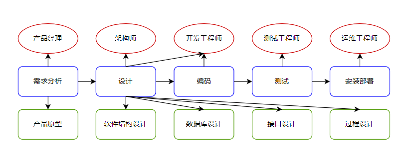

# Java Web

## Java Web介绍

什么是Java Web？

*   Web：全球互联网，也称为万维网（WWW），是用于浏览、发布和分享数据的应用。
*   JavaWeb：用Java技术来解决相关Web互联网领域的技术栈。
*   通过使用网页、JavaWeb程序和数据库，实现互联网应用。其中网页呈现数据，JavaWeb程序用于逻辑处理，数据库存储和管理数据。

## 数据库

数据库相关概念：

*   数据库（DataBase，简称DB）：存储数据的仓库，其中保存的数据是有组织的进行存储。
*   数据库管理系统（Database Management System，简称DBMS）：数据库的管理系统，负责数据库的创建、管理、维护。

MySQL数据模型：

*   关系型数据库：
    *   关系型数据库是建立关系模型基础上的数据库，简单来说，关系型数据库是由多张能互相连接的二维表组成的数据库。
    *   优点：
        1.  都是使用表结构，格式一致，易于维护。
        2.  使用通用的SQL语言操作，使用方便，可用于复杂查询。
        3.  数据存储在磁盘中，安全。
*   多个客户端通过JavaWeb程序访问数据库管理系统，数据库管理系统管理多个数据库，每个数据库管理多张表，每张表管理多行数据，每行数据管理多列数据。

结构化查询语言（Structured Query Language，简称SQL）：

*   一门操作关系型数据库的编程语言。
*   定义操作所有关系型数据库的统一标准。
*   对于同一需求，每一种数据库操作的方式可能存在一些不一样的地方，我们称为“方言”。即有的语法这个数据库可以执行，而其他数据库不能执行。

SQL语法：

*   SQL语句可以单行或多行书写，以分号结尾。
*   MySQL数据库的SQL语句不区分大小写，关键字建议使用大写。
*   注释：
    *   单行注释：`-- 注释内容`或`# 注释内容`（MySQL特有）。
    *   多行注释：`/* 注释内容 */`。
*   SQL中数据类型：
    *   整数：
        *   tinyint：1字节，范围-128~127或0~255，用于存储极小整数值。
        *   smallint：2字节，范围-32768~32767或0~65535，用于存储较小的整数值。
        *   mediumint：3字节，范围-8388608~8388607或0~16777215，用于存储中等的整数值。
        *   int/integer：4字节，范围-2147483648~2147483647或0~4294967295，用于存储较大的整数值，例如主键ID、数量、年龄等。
        *   bigint：8字节，用于存储超大的整数值，例如订单号、大数量统计。
    *   浮点数：
        *   float：4字节，用于存储单精度浮点数。
        *   double：8字节，用于存储双精度浮点数。
        *   decimal：用于存储高精度的十进制数，例如需要精确计算的银行、财务等场景。
    *   日期时间：
        *   date：3字节，用于存储日期，例如生日、活动日期等。
        *   time：3字节，用于存储时间。
        *   year：1字节，用于存储年份。
        *   datetime：8字节，用于存储日期和时间，例如订单时间、日志时间等。
        *   timestamp：4字节，时间戳，用于存储日期和时间，例如创建时间、最后修改时间等。
    *   字符串：
        *   char：0~255字符，用于存储固定长度的字符串，例如手机号、国家代码等。
        *   varchar：0~65535字符，用于存储可变长字符串，例如用户名、密码、地址等。
        *   text：最大65535字符，用于存储标准文本数据，例如文章、简介等。
        *   longtext：最大4294967295字符，用于存储超长文本数据。
    *   二进制：
        *   binary：0~255字节，用于存储固定长度二进制数据。
        *   varbinary：0~65535字节，用于存储可变长度进制数据。
        *   blob：最大65535字节，用于存储标准二进制大对象。
        *   longblob：最大4294967295字节，用于存储超大二进制对象。
    *   枚举：enum，用于存储枚举值，例如性别、状态等。
    *   集合：set，用于存储多个枚举值，例如颜色、权限等。
    *   JSON：JSON类型，用于存储JSON数据。
    *   注意：虽然MySQL中二进制类型可以存储图片、音频、视频等文件，但是性能很差，推荐使用varchar类型保存这些文件存储在文件系统中的路径，然后通过路径访问文件。
*   SQL分类：
    *   DDL（Data Definition Language）：数据定义语言，用来定义数据库对象，如：数据库、表、字段等。
        *   数据库的相关操作：

            ```sql
            # 查询所有数据库
            show databases;

            # 创建数据库
            create database database_name;
            create database if not exists database_name;

            # 删除数据库
            drop database database_name;
            drop database if exists database_name;

            # 使用数据库
            use database_name;

            # 查看当前正在使用的数据库
            select database();
            ```

        *   表的相关操作：

            ```sql
            # 查询当前数据库下的所有表
            show tables;

            # 查询表的结构
            desc table_name;

            # 创建表
            create table table_name (
              field_name1 field_type1 field_property1,
              field_name2 field_type2 field_property2,
              ...
              field_nameN field_typeN field_propertyN
            );

            # 创建表的示例
            create table students (
              id int primary key auto_increment,
              name varchar(20) not null,
              gender char(1),
              birthday date,
              score double(5, 2),  # 总长度为 5，保留 2 位小数，例如 345.67
              email varchar(64),
              tel varchar(15),
              status enum('在读', '毕业') default '在读',
              create_time timestamp default current_timestamp
            );

            # 删除表
            drop table table_name;
            drop table if exists table_name;

            # 修改表名
            alter table old_table_name rename to new_table_name;

            # 添加一列
            alter table table_name add column new_field_name new_field_type new_field_property;

            # 修改数据类型
            alter table table_name modify column field_name new_field_type new_field_property;

            # 修改列名和数据类型
            alter table table_name change column old_field_name new_field_name new_field_type new_field_property;

            # 删除一列
            alter table table_name drop column field_name;
            ```

    *   DML（Data Manipulation Language）：数据操作语言，用来对数据库中表的数据进行增删改（没有查）。
        *   添加数据：

            ```sql
            # 给指定列添加数据
            insert into table_name (field_name1, field_name2, ...) values (value1, value2, ...);

            # 给全部列添加数据
            insert into table_name values (value1, value2, ...);

            # 给指定的列批量添加数据
            insert into table_name (field_name1, field_name2, ...) values (value1, value2, ...), (value3, value4, ...), ...;

            # 给全部列批量添加数据
            insert into table_name values (value1, value2, ...), (value3, value4, ...), ...;
            ```

        *   修改数据：

            ```sql
            # 修改指定列的数据
            update table_name set field_name1 = value1, field_name2 = value2, ... where condition;

            # 修改全部列的数据
            update table_name set field_name1 = value1, field_name2 = value2, ...;
            ```

        *   删除数据：

            ```sql
            # 删除指定列的数据
            delete from table_name where condition;

            # 删除全部列的数据
            delete from table_name;
            ```

    *   DQL（Data Query Language）：数据查询语言，用来查询数据库中的表的数据。
        *   查询语法：

            ```sql
            select field_name1, field_name2, ... from table_name where condition group by field_name1, field_name2, ... having condition order by field_name1, field_name2, ... limit number;
            ```

        *   五大查询：
            *   基础查询：

                ```sql
                # 查询多个字段
                select field_name1, field_name2, ... from table_name;

                # 查询所有字段
                select * from table_name;

                # 查询多个字段并去除重复记录
                select distinct field_name1, field_name2, ... from table_name;

                # 使用 as 给字段起别名
                select field_name1 as alias_name1, field_name2 as alias_name2, ... from table_name;
                ```

            *   条件查询：
                *   条件查询语法：

                    ```sql
                    select field_name1, field_name2, ... from table_name where condition;
                    ```

                *   条件查询示例：

                    ```sql
                    # 查询年龄大于 20 岁的学生信息
                    select * from students where age > 20;

                    # 查询年龄大于等于 20 岁的学生信息
                    select * from students where age >= 20;

                    # 查询年龄大于等于 20 岁并且年龄小于等于 30 岁的学生信息
                    select * from students where age >= 20 and age <= 30;
                    select * from students where age between 20 and 30;

                    # 查询入学日期在 1998-09-01 到 1999-09-01 之间的学生信息
                    select * from students where hire_date between '1998-09-01' and '1999-09-01';

                    # 查询年龄等于 18 岁的学生信息
                    select * from students where age = 18;

                    # 查询年龄不等于 18 岁的学生信息
                    select * from students where age != 18;
                    select * from students where age <> 18;

                    # 查询年龄等于 18 岁或者年龄等于 20 岁或者年龄等于 22 岁的学生信息
                    select * from students where age = 18 or age = 20 or age = 22;
                    select * from students where age in (18, 20, 22);

                    # 查询英语成绩为 null 的学生信息
                    # 和 null 值进行比较需要使用 is 或者 is not
                    select * from students where english is null;

                    # 模糊查询使用 like 关键字
                    # 通配符：% 表示任意个数的字符，_ 表示任意一个字符
                    # 查询姓马的学生信息
                    select * from students where name like '马%';

                    # 查询姓名中第二个字是花的学生信息
                    select * from students where name like '_花%';

                    # 查询姓名中包含德的学生信息
                    select * from students where name like '%德%';
                    ```

            *   排序查询：
                *   排序查询语法：

                    ```sql
                    # asc 表示升序，desc 表示降序，默认采用升序
                    # 如果有多个排序条件，当前面的条件值一样时，才会根据第二条件进行排序
                    select field_name1, field_name2, ... from table_name order by field_name1 [asc|desc], field_name2 [asc|desc], ...;
                    ```

                *   排序查询示例：

                    ```sql
                    # 查询学生信息，按照年龄升序排序
                    select * from students order by age asc;

                    # 查询学生信息，按照数学成绩降序排序
                    select * from students order by math desc;

                    # 查询学生信息，按照数学成绩降序排序，如果数学成绩一样，再按照英语成绩升序排序
                    select * from students order by math desc, english asc;
                    ```

            *   分组查询：
                *   聚合函数：将一列数据作为一个整体，进行纵向计算。
                    *   聚合函数语法：

                        ```sql
                        # null 值不参与所有聚合函数的计算
                        select aggregate_function(column_name) from table_name;
                        ```

                    *   聚合函数使用示例：

                        ```sql
                        # 统计班级一共有多少个学生
                        select count(id) from students;

                        # 查询数学成绩的最高分
                        select max(math) from students;

                        # 查询数学成绩的最低分
                        select min(math) from students;

                        # 查询数学成绩的总和
                        select sum(math) from students;

                        # 查询数学成绩的平均分
                        select avg(math) from students;
                        ```

                *   分组查询语法：

                    ```sql
                    # 分组之后，查询的字段为聚合函数和分组字段，查询其他字段无任何意义
                    # where 是分组之前进行限定，不满足 where 条件的行不参与分组，而 having 是分组之后对结果进行过滤
                    # where 不能对聚合函数进行判断，having 可以对聚合函数进行判断
                    # 执行顺序：where -> aggregate_function -> having
                    select field_name1, field_name2, ... from table_name [where condition] group by field_name1, field_name2, ... [having condition];
                    ```

                *   分组查询示例：

                    ```sql
                    # 查询男同学和女同学各自的数学平均分
                    select gender, avg(math) from students group by gender;

                    # 查询男同学和女同学各自的数学平均分，以及各自人数
                    select gender, avg(math), count(*) from students group by gender;

                    # 查询男同学和女同学各自的数学平均分，以及各自人数，同时分数低于 70 分的不参与统计
                    select gender, avg(math), count(*) from students where math >= 70 group by gender;

                    # 查询男同学和女同学各自的数学平均分，以及各自人数，同时分数低于 70 分的不参与统计，并且分组之后人数大于 2 个
                    select gender, avg(math), count(*) from students where math >= 70 group by gender having count(*) > 2;
                    ```

            *   分页查询：
                *   分页查询语法：

                    ```sql
                    # 起始索引 start 从 0 开始
                    # 计算公式：起始索引 = (当前页码 - 1) * 每页显示的记录数
                    # limit 是 MySQL 数据库的方言，Oracle 数据库的分页查询使用 rownumber，SQL Server 数据库的分页查询使用 top
                    select field_name1, field_name2, ... from table_name limit start, count;
                    ```

                *   分页查询示例：

                    ```sql
                    # 从 0 开始，查询 3 条数据
                    select * from students limit 0, 3;

                    # 每页显示 3 条数据，查询第 1 页数据
                    select * from students limit 0, 3;

                    # 每页显示 3 条数据，查询第 2 页数据
                    select * from students limit 3, 3;

                    # 每页显示 3 条数据，查询第 3 页数据
                    select * from students limit 6, 3;
                    ```

    *   DCL（Data Control Language）：数据控制语言，用来对数据库中用户进行管理、权限进行控制。
        *   用户管理：
            *   用户管理语法：

                ```sql
                # 创建用户
                create user 'username'@'hostname' identified by 'password';

                # 修改用户密码
                alter user 'username'@'hostname' identified by 'new_password';

                # 删除用户
                drop user 'username'@'hostname';
                ```

            *   用户管理示例：

                ```sql
                # 创建本地访问用户
                create user 'dev_user'@'localhost' identified by 'dev_password';

                # 创建任意 IP 访问用户
                create user 'remote_user'@'%' identified by 'remote_password';

                # 修改用户密码
                alter user 'dev_user'@'localhost' identified by 'new_dev_password';

                # 删除用户
                drop user 'remote_user'@'%';
                ```

        *   权限控制：
            *   权限控制语法：

                ```sql
                # 授予权限
                grant permission_name1, permission_name2, ... on database_name.table_name to 'username'@'hostname';

                # 撤销权限
                revoke permission_name1, permission_name2, ... on database_name.table_name from 'username'@'hostname';

                # 查看权限
                show grants for 'username'@'hostname';
                ```

            *   常用权限类型：
                *   all privileges：所有权限（慎用）。
                *   select：查询数据。
                *   insert：插入数据。
                *   update：更新数据。
                *   delete：删除数据。
                *   create：创建数据库或表。
                *   drop：删除数据库或表。
                *   alter：修改表结构。
                *   index：创建或删除索引。
                *   execute：执行存储过程。
            *   权限控制示例：

                ```sql
                # 授予 school_db 所有表的查询权限
                grant select on school_db.* to 'report_user'@'localhost';

                # 授予 students 表的完整操作权限
                grant select, insert, update, delete on school_db.students to 'admin_user'@'%';

                # 撤销 students 表的删除权限
                revoke delete on school_db.students from 'admin_user'@'%';

                # 查看用户权限
                show grants for 'report_user'@'localhost';
                ```

约束：约束是作用于表中列上的规则，用于限制加入表中的数据；约束的存在保证了数据的正确性、有效性和完整性。

*   约束的分类：
    *   not null：非空约束，保证列中所有数据不能有null值。
    *   unique：唯一约束，保证列中所有数据都是唯一的，不能有重复值。
    *   primary key：主键约束，保证列中数据是唯一的，不能有重复值，并且不能为null。
    *   check：检查约束，保证列中的数据满足指定的条件。
    *   default：默认约束，保存数据时未指定值则采用默认值。
    *   foreign key：外键约束，外键用来让两个表的数据之间建立链接，保证数据的一致性和完整性。
    *   注意：MySQL中不支持检查约束。
*   约束使用示例：

    ```sql
    create table employees (
      id int primary key auto_increment,
      ename varchar(50) not null,
      joindate date not null,
      salary double(7, 2) not null,
      bonus double(7, 2) default 0.0,
      dept_id int not null,
      # 给 dept_id 和 departments.id 之间建立名为 fk_emp_dept 的外键约束
      constraint fk_emp_dept foreign key (dept_id) references departments(id)
    );

    create table departments (
      id int primary key auto_increment,
      dname varchar(50) not null unique,
      address varchar(100) not null
    );
    ```

数据库设计：

*   软件的研发步骤：需求分析、设计、编码、测试、安装部署。

    

*   数据库设计概念：
    *   数据库设计就是根据业务系统的具体需求，结合我们所选用的DBMS，为这个业务系统构造出最优的数据存储模型。
    *   建立数据库中的表结构以及表与表之间的关联关系的过程。
*   数据库设计的步骤：
    *   需求分析：需要设计哪些表，表中有哪些字段，表和表之间有哪些关系。
    *   逻辑分析：通过ER图对数据库进行逻辑建模，不需要考虑我们所选用的数据库管理系统。
    *   物理设计：根据数据库自身的特点把逻辑设计转换成物理设计。
    *   维护设计：对新的需求进行建表，对已建好的表进行优化。
*   表关系：
    *   一对一：在任意一方加入外键约束，关联另一方主键，同时设置外键唯一；一对一的关系多用于表拆分，将一个实体中经常使用的字段放一张表，不经常使用的字段放另一张表，用于提升查询性能。

        ```sql
        # 用户表和用户详情表
        create table users (
          id int primary key auto_increment,
          uname varchar(20) not null,
          age int not null,
          gender char(1) not null
        );

        create table user_details (
          id int primary key auto_increment,
          uid int not null unique,
          address varchar(50) not null,
          education varchar(20) not null,
          status varchar(20) not null,
          constraint fk_user_detail_user foreign key (uid) references users (id)
        );
        ```

    *   一对多（多对一）：通过外键约束建立一对多关系。

        ```sql
        # 一个部门有多个员工
        create table departments (
          id int primary key auto_increment,
          dname varchar(20) not null unique,
          address varchar(20) not null
        );

        create table employees (
          id int primary key auto_increment,
          ename varchar(20) not null,
          age int not null,
          dept_id int not null,
          constraint fk_employee_department foreign key (dept_id) references departments (id)
        );
        ```

    *   多对多：通过建立第三张中间表，中间表至少包含两个外键，分别关联两方主键，用来建立多对多关系。

        ```sql
        # 一个商品对应多个订单，一个订单包含多个商品
        create table products (
          id int primary key auto_increment,
          pname varchar(20) not null,
          price decimal(10,2) not null
        );

        # 如果表名为 order，那么需要使用反引号转义保留字，例如 `order`
        create table orders (
          id int primary key auto_increment,
          odate datetime not null,
          total decimal(10,2) not null,
          payment_type enum('微信', '支付宝') not null,
          status enum('待付款', '待发货', '待收货', '待评价', '已完成') not null
        );

        create table product_order (
          id int primary key auto_increment,
          product_id int not null,
          order_id int not null
          constraint fk_product_order_product foreign key (product_id) references products (id),
          constraint fk_product_order_order foreign key (order_id) references orders (id)
        );
        ```

多表查询：

*   笛卡尔积：取多表中所有行进行组合运算后的结果集。如果两个表的行数分别为M和N，则笛卡尔积的结果集行数为M*N。这种方式下，结果集可能非常庞大，且缺乏任何实际意义，不建议用于大规模数据查询，通常不会在实际生产环境中使用。

    ```txt
    商品表：products

    pid     pname       price
    1       Apple       150.00
    2       Banana      80.00
    3       Orange      120.00

    订单表：orders

    oid     odate           pid     quantity    total   
    101     2023-01-01      1       2           300.00
    102     2023-01-02      2       3           240.00
    103     2023-01-03      3       1           120.00
    104     2023-01-04      1       1           150.00
    ```

    ```sql
    # 例如现在有 3 个商品，4 个订单，最终会显示 12 行数据
    # 且大量数据没有很好的关联性，不建议直接用笛卡尔积进行查询
    select * from products, orders;
    ```

    ```txt
    结果集

    pid     pname       price       oid     odate           pid     quantity    total
    1       Apple       150.00      101     2023-01-01      1       2           300.00
    1       Apple       150.00      102     2023-01-02      2       3           240.00
    1       Apple       150.00      103     2023-01-03      3       1           120.00
    1       Apple       150.00      104     2023-01-04      1       1           150.00
    2       Banana      80.00       101     2023-01-01      1       2           300.00
    2       Banana      80.00       102     2023-01-02      2       3           240.00
    2       Banana      80.00       103     2023-01-03      3       1           120.00
    2       Banana      80.00       104     2023-01-04      1       1           150.00
    3       Orange      120.00      101     2023-01-01      1       2           300.00
    3       Orange      120.00      102     2023-01-02      2       3           240.00
    3       Orange      120.00      103     2023-01-03      3       1           120.00
    3       Orange      120.00      104     2023-01-04      1       1           150.00
    ```

*   连接查询：将多个表按特定条件（通常是某个列的相等性）连接起来，获取符合条件的记录。
    *   内连接：返回两个表中满足连接条件的记录。如果某一表中的记录在另一表中没有匹配项，则该记录不会出现在查询结果中。

        ```txt
        商品表：products

        pid     pname       price
        1       Apple       150.00
        2       Banana      80.00
        3       Orange      120.00

        订单表：orders

        oid     odate           pid     quantity    total  
        101     2023-01-01      1       2           300.00
        102     2023-01-02      2       3           240.00
        103     2023-01-03      3       1           120.00
        104     2023-01-04      1       1           150.00
        ```

        ```sql
        # 隐式内连接
        select * from products p, orders o where p.pid = o.pid;

        # 显式内连接
        select * from products p inner join orders o on p.pid = o.pid;
        ```

        ```txt
        结果集

        pid     pname       price       oid     odate           pid     quantity    total          
        1       Apple       150.00      101     2023-01-01      1       2           300.00
        2       Banana      80.00       102     2023-01-02      2       3           240.00
        3       Orange      120.00      103     2023-01-03      3       1           120.00
        1       Apple       150.00      104     2023-01-04      1       1           150.00
        ```

    *   外连接：返回符合连接条件的记录和不符合条件的记录，其中不符合条件的记录会使用null填充。
        *   左外连接：返回左表中的所有记录，即使右表中没有匹配的记录，右表对应列会返回null。

            ```txt
            商品表：products

            pid     pname       price
            1       Apple       150.00
            2       Banana      80.00
            3       Orange      120.00

            订单表：orders

            oid     odate           pid     quantity    total  
            101     2023-01-01      1       2           300.00
            102     2023-01-02      2       3           240.00
            103     2023-01-03      null    1           120.00
            104     2023-01-04      null    1           150.00
            ```

            ```sql
            select * from products p left join orders o on p.pid = o.pid;
            ```

            ```txt
            结果集

            pid     pname       price       oid     odate           pid     quantity    total          
            1       Apple       150.00      101     2023-01-01      1       2           300.00
            2       Banana      80.00       102     2023-01-02      2       3           240.00
            3       Orange      120.00      null    null            null    null        null
            ```

        *   右外连接：返回右表中的所有记录，即使左表中没有匹配的记录，左表对应列会返回null。

            ```txt
            商品表：products

            pid     pname       price
            1       Apple       150.00
            2       Banana      80.00
            3       Orange      120.00

            订单表：orders

            oid     odate           pid     quantity    total  
            101     2023-01-01      1       2           300.00
            102     2023-01-02      2       3           240.00
            103     2023-01-03      3       1           120.00
            104     2023-01-04      4       1           150.00
            ```

            ```sql
            select * from products p right join orders o on p.pid = o.pid;
            ```

            ```txt
            结果集

            pid     pname       price       oid     odate           pid     quantity    total
            1       Apple       150.00      101     2023-01-01      1       2           300.00
            2       Banana      80.00       102     2023-01-02      2       3           240.00
            3       Orange      120.00      103     2023-01-03      3       1           120.00
            null    null        null        104     2023-01-04      4       1           150.00
            ```

        *   全外连接：返回左表和右表中的所有记录，即使没有匹配的记录，对应列会返回null。

            ```txt
            商品表：products

            pid     pname       price
            1       Apple       150.00
            2       Banana      80.00
            3       Orange      120.00
            4       Grape       90.00

            订单表：orders

            oid     odate           pid     quantity    total  
            101     2023-01-01      1       2           300.00
            102     2023-01-02      2       3           240.00
            103     2023-01-03      3       1           120.00
            104     2023-01-04      null    1           150.00
            ```

            ```sql
            # MySQL 8.0 以前
            select * from products p left join orders o on p.pid = o.pid
            union
            select * from products p right join orders o on p.pid = o.pid;

            # MySQL 8.0 及以后
            select * from products p full outer join orders o on p.pid = o.pid;
            ```

            ```txt
            结果集

            pid     pname       price       oid     odate           pid     quantity    total
            1       Apple       150.00      101     2023-01-01      1       2           300.00
            2       Banana      80.00       102     2023-01-02      2       3           240.00
            3       Orange      120.00      103     2023-01-03      3       1           120.00
            4       Grape       90.00       null    null            null    null        null
            null    null        null        104     2023-01-04      null    1           150.00
            ```

*   子查询：也称为嵌套查询或内部查询，是指一个select语句嵌套在另一个SQL语句（select、insert、update、delete）内部的查询。
    *   数据库引擎会先执行子查询，得到一个中间结果集，然后这个中间结果集被递给外层查询使用。
    *   子查询根据查询结果不同、作用不同分为：
        *   单行单列：

            ```sql
            # 找出工资高于公司平均工资的所有员工
            # select avg(salary) from employees 返回的是一个确定的值
            select * from employees where salary > (select avg(salary) from employees);
            ```

        *   多行单列：

            ```sql
            # 找出部门在北京的所有员工
            # select id from departments where location = '北京' 返回的是多个值
            select * from employees where dept_id in (select id from departments where location = '北京');
            ```

        *   多行多列：主要用在from子句中，作为一个派生表。

            ```sql
            # 将部门表和员工表进行关联，找出每个员工及其所属部门
            # select id, name from departments 和 select id, name from employees 返回的都是
            select * from (select id, name from departments) as d, (select id, name from employees) as e where d.id = e.dept_id;
            ```

*   示例：
    *   表结构和原始数据：

        ```sql
        drop table if exists employees;
        drop table if exists departments;
        drop table if exists jobs;
        drop table if exists salarygrades;

        -- 部门表
        create table departments (
          id int primary key auto_increment,
          dname varchar(50) not null,
          location varchar(50) not null
        );

        -- 职位表
        create table jobs (
          id int primary key auto_increment,
          jname varchar(20) not null,
          description varchar(100) not null
        );

        -- 员工表
        create table employees (
          id int primary key auto_increment,
          ename varchar(20) not null,
          joindate date not null,
          salary decimal(10,2) not null,
          bonus decimal(10,2) default 0,
          dept_id int,
          job_id int,
          constraint fk_emp_dept foreign key (dept_id) references departments (id),
          constraint fk_emp_job foreign key (job_id) references jobs (id)
        );

        -- 导入部门数据
        INSERT INTO departments (dname, location) VALUES
        ('研发部', '北京'),
        ('销售部', '上海'),
        ('行政部', '广州'),
        ('财务部', '深圳');

        -- 导入职位数据
        INSERT INTO jobs (jname, description) VALUES
        ('技术总监', '负责技术团队管理和技术决策'),
        ('高级工程师', '负责核心模块开发和系统架构'),
        ('销售经理', '负责销售团队管理和客户关系维护'),
        ('销售代表', '负责产品销售和客户开发'),
        ('财务主管', '负责财务报表和预算管理'),
        ('行政专员', '负责日常行政事务和办公管理');

        -- 导入员工数据
        INSERT INTO employees (ename, joindate, salary, bonus, dept_id, job_id) VALUES
        -- 研发部
        ('张三', '2019-03-15', 25000.00, 20000.00, 1, 1),
        ('李四', '2020-07-22', 18000.00, 15000.00, 1, 2),
        ('王五', '2021-11-05', 15000.00, 12000.00, 1, 2),
        ('赵六', '2022-02-18', 12000.00, 8000.00, 1, 2),
        -- 销售部
        ('钱七', '2018-05-30', 22000.00, 30000.00, 2, 3),
        ('孙八', '2019-09-12', 16000.00, 25000.00, 2, 4),
        ('周九', '2020-12-03', 14000.00, 18000.00, 2, 4),
        ('吴十', '2021-04-25', 13000.00, 15000.00, 2, 4),
        ('郑十一', '2023-01-15', 11000.00, 10000.00, 2, 4),
        -- 行政部
        ('王芳', '2017-08-19', 16000.00, 5000.00, 3, 6),
        ('李娜', '2020-03-22', 13000.00, 3000.00, 3, 6),
        ('陈静', '2022-06-11', 10000.00, 2000.00, 3, 6),
        ('刘婷', '2023-03-08', 9000.00, 1500.00, 3, 6),
        -- 财务部
        ('杨明', '2018-11-07', 20000.00, 10000.00, 4, 5),
        ('黄伟', '2019-04-16', 17000.00, 8000.00, 4, 5),
        ('朱琳', '2021-08-29', 15000.00, 6000.00, 4, 5),
        ('徐强', '2022-10-12', 13000.00, 5000.00, 4, 5),
        ('高敏', '2023-02-28', 11000.00, 3000.00, 4, 5),
        ('林峰', '2021-05-17', 14000.00, 4000.00, 4, 5),
        ('罗娟', '2022-09-03', 12000.00, 3500.00, 4, 5);
        ```

    *   执行：

        ```sql
        -- 查询所有员工信息，包括员工编号、员工姓名、工资、职务名称和职务描述
        select e.id, e.ename, e.salary, j.jname, j.description from employees e, jobs j where e.job_id = j.id;

        -- 查询员工编号、员工姓名、工资、职务名称、职务描述、部门名称和部门位置
        select e.id, e.ename, e.salary, j.jname, j.description, d.dname, d.location from employees e, jobs j, departments d where e.job_id = j.id and e.dept_id = d.id;

        -- 查询部门编号、部门名称、部门位置和部门人数
        select d.id, d.dname, d.location, count(*) as num from employees e, departments d where e.dept_id = d.id group by d.id;
        ```

事务：

*   事务简介：
    *   数据库的事务是一种机制，一个操作序列，包含了一组数据库操作命令。
    *   事务把所有的命令作为一个整体一起向系统提交或撤销操作请求，即这一组数据库命令要么同时成功，要么同时失败。
    *   事务是一个不可分割的工作逻辑单元。
*   事务操作：开启事务、提交事务、回滚事务、查询事务。

    ```sql
    -- ========== 准备工作 ==========
    -- 1. 创建银行账户表
    drop table if exists bank_accounts;
    create table bank_accounts (
      account_id int primary key auto_increment,
      account_name varchar(50) not null,
      balance decimal(10,2) not null default 0.00,  -- 账户余额
      last_transaction timestamp null -- 最后一次交易时间
    );

    -- 2. 创建交易记录表
    drop table if exists transactions;
    create table transactions (
      transaction_id int primary key auto_increment,
      from_account int not null,
      to_account int not null,
      amount decimal(10,2) not null,  -- 交易金额
      transaction_time timestamp default current_timestamp,
      status enum('pending', 'completed', 'failed') default 'pending',  -- 交易状态：待处理、完成、失败
      foreign key (from_account) references bank_accounts(account_id),
      foreign key (to_account) references bank_accounts(account_id)
    );

    -- 3. 插入初始账户数据
    insert into bank_accounts (account_name, balance) values
    ('张三', 10000.00),
    ('李四', 5000.00),
    ('王五', 20000.00);

    -- 4. 查看初始数据
    select * from bank_accounts;

    -- ========== 事务演示开始 ==========
    -- 场景 1：成功转账事务
    select '===== 开始成功转账事务 =====' as log;

    -- 1. 开启事务
    start transaction;  -- 或者 begin;

    -- 2. 插入交易记录
    insert into transactions (from_account, to_account, amount, status)
    values (
      (select account_id from bank_accounts where account_name = '张三'),
      (select account_id from bank_accounts where account_name = '李四'),
      1000.00,
      'pending'
    );

    -- 3. 执行转账操作
    update bank_accounts set balance = balance - 1000.00 where account_name = '张三';
    update bank_accounts set balance = balance + 1000.00 where account_name = '李四';

    -- 4. 更新交易状态
    update transactions set status = 'completed' where status = 'pending'
    and from_account = (select account_id from bank_accounts where account_name = '张三');

    -- 5. 查询当前事务状态
    select '当前事务状态：' as info,
    (select count(*) from information_schema.innodb_trx
    where trx_mysql_thread_id = connection_id()) as active_transactions;

    -- 6. 查询事务中的临时数据
    select '事务内账户余额：' as info;
    select * from bank_accounts;

    select '事务内交易记录：' as info;
    select * from transactions;

    -- 7. 提交事务
    commit;

    select '===== 事务已提交 =====' as log;

    -- 场景 2：失败转账事务（余额不足）
    select '===== 开始失败转账事务 =====' as log;

    -- 1. 开启事务
    start transaction;

    -- 2. 插入交易记录
    insert into transactions (from_account, to_account, amount, status)
    values (
      (select account_id from bank_accounts where account_name = '李四'),
      (select account_id from bank_accounts where account_name = '王五'),
      10000.00,
      'pending' 
    );

    -- 3. 执行转账操作
    update bank_accounts set balance = balance - 10000.00 where account_name = '李四';

    -- 检查余额是否足够（在实际应用开发中，应在业务代码中检查）
    set @current_balance = (select balance from bank_accounts where account_name = '李四');

    select concat('转账后李四余额：', @current_balance) as balance_check;

    -- 4. 如果余额不足则回滚
    if @current_balance < 0 then
      select '余额不足，回滚事务' as action;
      rollback;

      -- 更新交易状态为失败
      update transactions set status = 'failed' where transaction_id = last_insert_id();
    else
      -- 继续转账
      update bank_accounts set balance = balance + 10000.00 where account_name = '王五';

      update transactions set status = 'completed' where transaction_id = last_insert_id();

      commit;
    end if;

    -- 5. 查看回滚后的数据
    select '回滚后账户余额：' as info;
    select * from bank_accounts;

    select '交易记录状态：' as info;
    select * from transactions;

    -- 场景 3：使用保存点
    select '===== 使用保存点示例 =====' as log;

    start transaction;

    -- 1. 初始操作：
    ```

*   事务四大特征：
    *   原子性：事务是不可分割的最小操作单位，要么同时成功，要么同时失败。
    *   一致性：事务完成后，必须使所有的数据都保持一致状态。
    *   隔离性：多个事务之间，操作的可见性。
    *   持久性：事务一旦提交或回滚，它对数据库中的数据的改变就是永久的。

JDBC：使用Java语言操作关系型数据库的一套API。

*   JDBC简介：
*   JDBC快速入门：
*   JDBC API详解：
*   数据库连接池：
