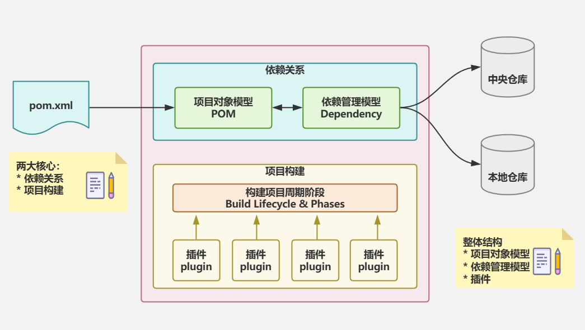

# Maven

## Maven基础

Maven简介：

*   Maven是什么：Maven的本质是一个项目管理工具，将项目开发和管理过程抽象成一个项目对象模型（POM，Project Object Model）。它通过一个核心配置文件（pom.xml）描述项目的元数据、依赖关系、构建配置、环境要求等，并提供了一套标准化的项目构建生命周期和插件机制。Maven的核心目标是简化构建流程、统一项目管理规范，并高效处理依赖关系。
    *   核心特性：
        *   标准化项目结构：Maven强制约定项目的目录布局（如src/main/java存放源代码，src/main/resources存放资源文件，src/test/java存放测试代码，src/test/resources存放测试资源文件），减少配置冗余，提升团队协作效率。
        *   依赖管理：
            *   自动从远程仓库（如Maven Central）下载项目所需的库（Jar文件）及其依赖性传递。
            *   通过坐标（GroupId、ArtifactId、Version）唯一标识依赖，避免版本冲突。
        *   构建生命周期：定义清晰的构建阶段（如compile、test、package、install等），用户可通过命令（如mvn package）触发预设的构建流程。
        *   插件系统：扩展性强，支持通过插件（如maven-compiler-plugin）定制编译、测试、部署等任务，覆盖从开发到部署的全过程。
    *   典型应用场景：
        *   Java项目构建：编译、打包Jar/War文件。
        *   多模块管理：通过父子POM管理复杂项目的模块依赖。
        *   持续集成：与Jenkins等工具集成，实现自动化构建、测试、部署。
*   Maven的作用：
    *   项目构建：
        *   标准化构建流程：Maven提供了一套预定义的构建生命周期（如clean、compile、test、package、install、deploy），开发者只需执行简单命令（如mvn package）即可完成整个构建过程，无需手动编写复杂的构建脚本。
        *   跨平台兼容：基于Java的Maven可以在Windows、Linux、macOS等不同操作系统上运行，确保构建环境的一致性。
    *   依赖管理：
        *   自动下载依赖：Maven通过pom.xml文件声明项目所需的第三方库（如Junit、Spring、Hibernate等），并自动从中央仓库（如Maven Central）或私有仓库（如Nexus、Artifactory）下载依赖，避免手动管理Jar文件的麻烦。
        *   依赖传递性：如果A依赖B，而B又依赖C，Maven会自动解析并下载所有间接依赖，减少版本冲突。
        *   依赖范围控制：通过scope标签（如compile、test、provided等）管理依赖的作用范围，优化构建和部署效率。
    *   项目标准化：
        *   统一目录结构：Maven强制约定项目目录布局（如src/main/java存放源代码，src/test/resources存放测试资源），使不同项目保持一致的代码组织结构，便于团队协作和工具集成。
        *   统一的构建配置：所有构建逻辑（如JDK版本、编码格式、打包方式）都定义在pom.xml中，便于维护和版本控制。
    *   多模块项目管理：
        *   模块化开发：大型项目可以拆分为多个子模块（如core、web、service），每个模块有独立的pom.xml，并通过modules和parent标签管理依赖关系，实现代码复用和分模块构建。
        *   聚合构建：通过父POM统一管理依赖版本和插件配置，避免重复定义。
    *   插件扩展：Maven的核心功能通过插件实现，开发者可以灵活扩展构建流程。
        *   编译插件（maven-compiler-plugin）：指定JDK版本。
        *   打包插件（maven-assembly-plugin）：生成可执行Jar或定制化分发包。
        *   部署插件（maven-deploy-plugin）：将构建产物发布到远程仓库。
        *   测试插件（maven-surefire-plugin）：运行单元测试并生成报告。
    *   项目文档与报告：
        *   自动生成文档：通过mvn site命令生成项目站点，包含API文档、测试覆盖率、代码质量分析等。
        *   集成报告工具：支持与Checkstyle、PMD、JaCoCo等工具集成，提供代码规范检查和测试覆盖率报告。
    *   持续集成支持：
        *   与CI/CD工具无缝集成：如Jenkins、GitLab CI等可以通过Maven命令（如mvn clean install）触发自动化构建、测试和部署流程。
        *   支持Docker和云部署：结合docket-maven-plugin和maven-cloud-plugin，实现容器化打包和云环境发布。

Maven基础概念：

*   仓库：用于存储资源，包括源代码、jar包、文档等。
    *   仓库分类：
        *   本地仓库：自己电脑上存储资源的仓库，连接远程仓库获取资源。
        *   远程仓库：非本机电脑上的仓库，为本地仓库提供资源。
            *   中央仓库：Maven团队维护，存储大量资源的仓库。
            *   私服仓库：部分或者公司范围内存储资源的仓库。
    *   私服的作用：
        *   保存具有版权的资源，包含购买或自主研发的Jar包。中央仓库中的Jar包都是开源的，不能存储具有版权的资源。
        *   一定范围内共享资源，仅对内部开放，不对外共享。
*   坐标：Maven中的坐标用于描述仓库中资源的位置。使用坐标作为唯一标识定位资源位置，通过该标识可以将资源的识别与下载工作交由机器完成。
    *   [Central Repository](https://repo1.maven.org/maven2/)
    *   Maven坐标主要组成：
        *   GroupId：定义当前Maven项目隶属组织名称，通常是域名倒序，例如org.apache。
        *   ArtifactId：定义当前Maven项目名称，通常是模块名称，例如CRM、SMS。
        *   Version：定义当前项目版本号。
        *   Packaging：定义该项目的打包方式。

Maven项目示例：

依赖管理：

生命周期与插件：
