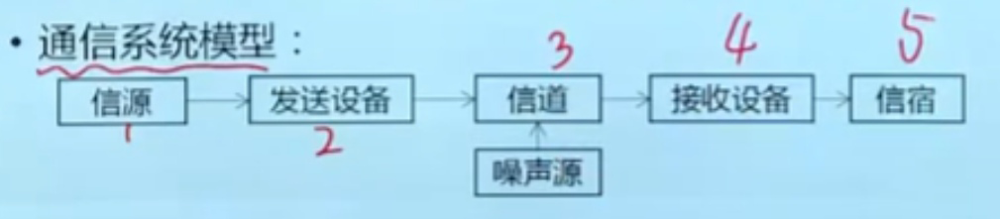
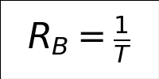
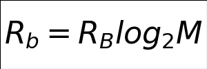
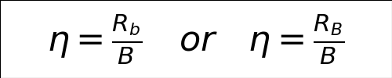
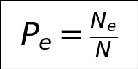
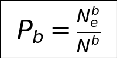
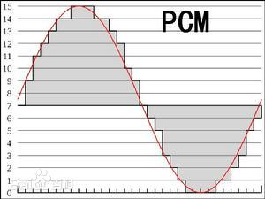
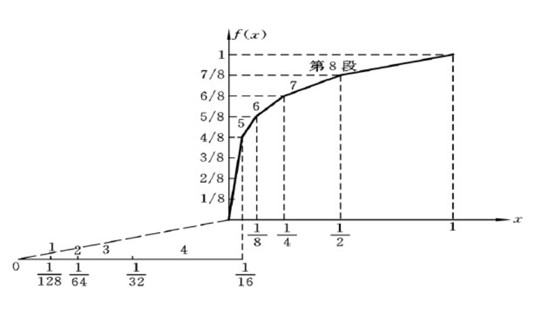

# 数据通信基础

1.  [数据通信的基本概念](#数据通信的基本概念)
2.  [数据传输方式](#数据传输方式)
3.  [数据通信系统性能](#数据通信系统性能)
4.  [传输信道](#传输信道)
5.  [数据通信中编码](#数据通信中编码)
6.  [复用技术](#复用技术)
7.  [差错控制技术](#差错控制技术)
8.  [交换技术](#交换技术)

## 数据通信的基本概念

基本概念：

*   消息：人类能够感知的描述，如声音、文字、图像、气味等。
*   信息：各种事物发出的有意义的消息，消息是信息的载体。
*   数据：对客观事物的性质状态及相互关系等进行记载的物理符号及其组合。数字、文字、图像或抽象的符号等。
*   信号：传递信息的载体称为信号，一般表现为电磁或光的形式，并通过电平、电流和频率的变化表示信息。

通信系统模型：

*   信源：将信息转换为电信号的设备，如计算机。
*   发送设备：将信源产生的信号进行变换，便于在信道中传输，变换的方式主要是编码和调制，如调制解调器Modem。
*   信道：信号传输媒介，分为有线和无线两大类。
*   噪声：自然界和通信设备中所固有的、会对通信信息产生干扰和影响的各种信号（无法避免）。
*   接收设备：完成发送设备的反变换，即译码和解码，还原原始的发送信号，如调制解调器Modem。
*   信宿：信号的终点，并将信号转换为人们所能识别的消息。
*   调制解调器：把数字信号翻译成模拟信号，经过传输到达接收端再解调还原成数字信号。信道中传递的是模拟信号。可同时收发（调制和解调）。
*   编解码器：把模拟信号翻译成数字信号，经过传输到达接收端再解码还原成为模拟信号。信道中传递的是数字信号。
*   

模拟通信和数字通信：

*   二者区别：信道中传输的是模拟信号还是数字信号。
*   模拟信号需要经过采样、量化和编码转换为数字信号。数字信号需要经过解码、平滑转换为模拟信号。

数据通信系统与数字通信系统的区别：

*   数字通信系统指信道中传递的信号是离散的数字信号。
*   数据通信系统指信源和信宿处理的是二进制数据（即信源和信宿可以是计算机、智能终端），信道中传递的既可以是模拟信号，也可以是数字信号。

## 数据传输方式

单向通信、双向交替通信和双向同时通信：

*   单向通信：又称单工通信，任何时间只能有一个方向的通信，如无线电广播。
*   双向交替通信：又称半双工通信，通信的双方都可以发送信息，但不能同时发送或接收，如无线电对讲机系统。
*   双向同时通信：又称全双工通信，通信双方都可以同时发送和接收信息，如电话网、计算机网络。

并行通信和串行通信：

*   计算机中处理数据时，是以字节（Byte）为单位的，一个字节由8个二进制位（bit）组成。
*   并行通信：为一个字节的每一个bit位设置一个传输通道，所有bit同时进行传输。
*   串行通信：信息传输通过一条通道，数据中的每一个字节中的每一个bit位依次在这条信道上传输，节省线路设备，速度慢，适用于长距离的数据传输。RS-232和USB接口属于串行通信。

异步通信和同步通信：

*   同步技术就是通信系统中实现收发两端动作统一，保持收发步调一致的过程。两种方式：异步式同步和同步式同步，区别在于收发双端的时钟是独立的还是同步的。
*   异步数据传输以字符为单位发送，一次传输一个字符，每个字符5～8bit表示，每个字符前有一个起始位，后面有1个或2个停止位。无字符发送时一直发送停止位。
*   异步数据传输的特点：无需收发两端传输时钟信号，传输简单，效率低，速度慢。
*   同步数据传输以数据块为单位进行发送，每个数据块包含多个字符，每个字符5～8bit。每个数据块前面加上起始标志，后面加上结束标志。
*   同步数据传输的特点：传输效率高，开销小，但需要双方建立同步时钟，实现复杂，适合高速传输。

基带传输和频带传输：

*   基带传输：计算机作为信源发出的原始数据信号称为基本频带信号（二进制，高低电平），用固定的高低电平表示二进制1或0，简称基带信号。直接在信道中传输基带信号，称为基带传输。如以太网，令牌环网。
*   频带传输：有些信道（电话线）不具有低通性，具有带通性，不适合直接传输基带信号，需要利用基带信号去调制与信道相匹配的载波信号。在信道中传送经过调制的载波信号实现将基带信号所携带的信息传送出去的方式称为频带传输。如电话线不适合传输基带信号，计算机利用电话线上网时，得调制成相应的频带信号传输。
*   调制方法：模拟信号传输的基础是载波，载波具有三大要素：幅度、频率和相位。数字调制的三种基本形式：调幅（AM）、调频（FM）、调相（PM）。

## 数据通信系统性能

数据通信系统的性能指标：

*   衡量数据通信系统有效性的指标：带宽、码元速率、信息速率频带利用率。
*   衡量数据通信系统可靠性的指标：信噪比、误码率。
*   模拟通信系统的有效性：带宽（信道带宽和信号传输带宽）。
*   模拟通信系统的可靠性：信噪比，接收端输出有用信号功率和噪声功率的比值。信噪比越高，可靠性越高。
*   数字通信系统的可靠性：传输速率（码元速率和信息速率）和频带利用率。
*   码元速率RB（波特率）：
    *   数字系统中，用时间间隔相同的符号表示一个离散值，这时间间隔内的信号称为码元，时间间隔称为码元长度。
    *   波特率：每秒传送的码元数目。
    *   T：码元长度，单位秒。
    *   
*   信息速率Rb（比特率）：
    *   比特率：每秒传送的二进制比特数，单位为bps。
    *   
*   码元和比特的关系：一个二进制码元含有1bit的信息量；一个四进制码元含有2bit的信息量（00，01，10，11）。一个M进制码元携带log2M比特的信息量。
*   频带利用率η：
    *   频带利用率：衡量数字通信系统的通信有效性，定义为每赫兹所实现的传输速率。
    *   B：数字通信系统的信号带宽。
    *   
*   误码率和误比特率：衡量数字通信系统的可靠性，一般小于10-9。
    *   Ne：错误码元数；N：总码元数。
    *   
    *   Nbe：错误比特数；Nb：总比特数。
    *   
*   信道极限信息传输速率，香农公式。
    *   C：信道极限信息传输速率；W：信道带宽Hz；S：信号平均功率；N：高斯噪声功率。
    *   quad(bps)%24.png)

习题：若某通信系统数字信号的码元长度为10-6s，采用八进制传输，试求出该系统的码元速率和信息速率。

$$
R_B = \frac{1}{T} = \frac{1}{10^-6} baud \\
R_b = R_Blog_{2}8 = 3 \times 10^6 bps
$$

## 传输信道

有线信道：架空明线，双绞线，同轴电缆和光纤。

*   架空明线：传输损耗低，易受天气和外界干扰，带宽有线。
*   双绞线
    *   两根绝缘的铜导线按一定密度互相绞合在一起。
    *   分为非屏蔽双绞线和屏蔽双绞线。
    *   计算机网络中最常用的是三类（10BASE-T，电话线）和五类（100BASE-T，以太网）非屏蔽双绞线。
    *   双绞线主要用于基带传输。
*   同轴电缆
    *   两个同心导体，而导体和屏蔽层又共用同一轴心的电缆。
    *   同轴电缆从用途上可分为基带同轴电缆（50Ω，传统以太网，总线型拓扑结构）和宽带同轴电缆（75Ω，有线电话）。
    *   早期的共享式局域网基本采用同轴电缆作为传输介质，现在被双绞线代替。
    *   同轴电缆的带宽可以高达1GHz，主要用做频带传输。
*   光纤
    *   光纤具有损耗低，频带宽，抗腐蚀，抗干扰等优点。
    *   由于纤芯的折射率大于包层的折射率，所以进入纤芯的光会在两层的边界产生全反射。
    *   阶跃型光纤：光波只在边界发生折射。
    *   梯度型光纤：折射率沿着半径增大的方向逐渐减少。
    *   多模光纤：采用发光二极管作为信源，传输带宽窄。
    *   单模光纤：采用激光器作为信源。

无线信道：

*   无线信道，利用电磁波在空间的传播来传输信号。
*   为了避免不同通信系统之间的相互干扰，国际电信联盟负责制定有关无线电频率使用的国际协议。

## 数据通信中编码

二进制数据要转变成合适的电磁波信号才能在信道中传输，这种转变过程称为数据编码。数据编码的方法：模拟数据编码和数字数据编码。

模拟数据编码：

*   为了利用电话线，可以将计算机的二进制数字信号转换适合电话网信道中传输的模拟信号。
*   在发送端将数字信号变换成模拟信号的过程称为调制。
*   在接收端将模拟信号变换成数字信号的过程称为解调。
*   能在模拟信道中传播的模拟信号称为载波。
*   振幅键控（ASK）
*   频移键控（FSK）
*   相移键控（PSK）

$$
y(t) = Asin(ωt + φ)
$$

数字数据编码：将原始二进制数据变换成数字脉冲序列实现基带传输的方式。

*   单极性不归零码（NRZ）：
    *   0：零电平；1：正电平（或负电平）。
    *   单极性：脉冲幅值是正电平或零电平，只有一个极性。
    *   不归零：脉冲持续期间，电平保持不变，结束时也不必回归零电平。
*   双极性不归零码：
    *   0：负电平；1：正电平。
    *   ITU-T的v.24接口和EIA的RS-232C接口标准采用双极性不归零码。
*   单极性归零码（RZ）：
    *   0：零电平；1：正电平，且在中间时刻由正电平回到零电平。
*   双极性归零码：
    *   0：负电平，且在中间时刻电平由负电平回到零电平；1：正电平，且在中间时刻由正电平回到零电平。
*   差分码：
    *   若用电平跳变来表示“1”，称为传号差分码（在电报通信中，常把“1”称为传号，把“0”称为空号）；若用电平跳变来表示“0”，称为空号差分码。
    *   0：相邻电平无跳变；1：相邻电平有跳变。
*   双相码，曼彻斯特编码：
    *   0：中间时刻，由负电平跳到正电平；1：中间时刻，由正电平跳到负电平。
*   差分双相码，差分曼彻斯特编码：
    *   每个比特中间都有跳变，用于同步。
    *   0：开始处无跳变；1：开始处有跳变。
*   多元码：将二进制数据映射为多进制信号。一般的，将k个二进制数字映射为M=2k个离散的脉冲幅值之一。

模拟信号的数字编码：

*   将模拟信号转换为数字信号，便于在数字通信系统中传输。
*   A/D转换：抽样，量化和编码。
*   抽样：以一定的时间间隔采集模拟数据的瞬间值。
*   量化：根据某种规则将采样得到的瞬间值用数值表示出来。
*   编码：将量化得到的数据变换成一组二进制码。
*   例如：对于模拟信号f(t)，在t=T,2T,3T...时刻采样，得到瞬间值f(t)=5.2，将其量化为5，对5进行3位二进制编码得到101。
*   抽样定理：低通抽样定理和带通抽样定理。
    *   区别：假设模拟信号的频率范围为fl~fh，则信号带宽B=fh-fl。若B>fl，则为低通信号；若B≤fl，则为带通信号。
    *   低通抽样定理：对于一个频率有线模拟信号f(t)，假设频带范围为(0, fh)，若以抽样频率fs≥2fh，则信号f(t)将被抽样值完全确定，即抽样后的离散信号包含了原模拟信号的全部信息，接收端能够恢复f(t)。
    *   带通信号抽样定理：fs=2B(1+k/n)，n为fh/B的整数部分，k为fh/B的小数部分。
*   脉冲编码调制PCM：
    *   PCM抽样：按照抽样定理把时间上连续的模拟信号转换为时间上离散的抽样信号。即指定有限个量化电平，把抽样值用最接近的电平表示。
    *   
    *   PCM在通信系统中完成将语音信号数字化功能。根据CCITT的建议，为改善小信号量化性能，采用压扩非均匀化，有两种方式，分别为A律和μ律，我国采用A律方式，由于A律压缩实现复杂，常使用13折线法编码。
    *   量化误差：
        *   量化信号与原信号之差的绝对值。
        *   根据量化间隔是否相等，分为均匀量化和非均匀量化：
            *   均匀量化：把模拟信号的取值域等间隔分割的量化称为均匀量化，ΔVi是固定值。量化电平qi取各区间的中点。量化误差ΔV/2。
            *   非均匀量化：指量化间隔随信号抽样值的不同而不同。抽样值小，量化间隔ΔV也小；抽样值大，量化间隔ΔV也大。y轴的抽样间隔Δy是等值的，x轴（即量化间隔）的抽样间隔Δx是不均匀的，随着x的增大而增大。
    *   对于电话信号，非均匀量化又分为A律压缩和μ律压缩：
        *   A律压缩，13折线法近似。
            *   对输入x和y首先进行归一化。
            *   对于x，在[0, 1]区间内非均匀分为8段，规则是每次以1/2对半划分，即1/2处对半划分，1/4处对半划分...1/128处对半划分。
            *   对于y，在[0, 1]区间采用等分的方法分为8段，每段间隔1/8。
            *   最后把x，y对应段的交点连接起来构成7段线（第1、2段线的斜率相同，算作一段）。
            *   语音信号是双极性信号（x，y可以取负值），在负方向上也有与正方向对称的一组折线，也是7根，但负方向的1、2段和正方向的1、2段的斜率相同，这4根算1根，故有13根折线。
            *   
        *   μ律压缩，15折线法近似。
    *   编码：
        *   采样信号经过量化得到有限个信号电平，将这些电平采用二进制码组表示的过程称为编码。
        *   在PCM中，若量化电平M=2N，则可用N位二进制编码。
        *   如量化电平数为8，可用3位二进制编码，000,001...111表示8个量化电平。
        *   常用的编码方式：自然二进制码，折叠二进制码和格雷二进制码。
        *   自然二进制码：利用二进制数和十进制数的关系表示相应的量化电平。
        *   折叠二进制码：
            *   沿中心电平上下对称，适用于表示正负对称的双极性信号。
            *   码的最高位表示信号的极性。
            *   其他位，若信号为正值，则与对应的二进制码各位相同；若为负值，则对应二进制码各位取反。

## 复用技术

数据通信系统中的多路复用技术：时分复用、频分复用、波分复用、码分复用。

*   频分多路复用FDM：在频域内将信号带宽分为多个子信道，利用载波调制技术，将原始信号调制到对应的子信道的载波信号中，整个物理信道内的频谱不重叠，从而公用一个信号。
*   时分多路复用TDM：将通信信道的传输信号在时域内划分为多个等长的时隙，每路信号占用不同的时隙，在时域互不重叠，共用一个信道。
    *   同步时分多路复用：按照固定的顺序把时隙分配给各路信号。
    *   异步时分多路复用：为了提高设备的利用效率，为有大量数据要发送的用户分配较多的时隙，为有少量数据要发送的用户分配相对较少的时隙，没有数据的用户就不分配时隙。
    *   比较典型的TDM，是时分多路电话通信系统，模拟语音信号进行数字化编码，然后将多个话路的PCM语音数据用TDM的方法组装成帧。每个时隙承载一路PCM信号。
    *   ITU分别针对同步数学体系PDH，分别制定了两个建议，分别是E体系和T系统。我国采用E体系。E1载波：2.048Mbps；T1载波：1.544Mbps。
*   波分多路复用WDM：本质也是频分复用，因为光波频率很高，通常用光的波长讨论。波分多路复用是指在一根光纤中传输多种不同波长的光信号，由于波长不同，所以不会相互干扰，最后再用波长解复用器将各路光载波分解出来。
*   码分多路复用CDM：在编码域上划分，利用更长的相互正交的码组分别编码各路原始信号的每个码元，使得编码后的信号在同一信道中传输，接收端利用码组的正交特性分离各路信号，实现信道共享。在码分系统中，每个通信站点分配一个唯一的码组Si，称为码片序列。每个站点在发送数据时，利用自己的码片序列对原始数据进行编码，当发送+1时，就发送码元序列；当发送-1时，就发送码元序列的反码。
*   在模拟传输的宽带网络中（电话线上网），常用的信道复用技术是频分复用。波分复用技术一般用在光纤传输中。

## 差错控制技术

典型的差错控制方式包括差错重发、向前纠错、反馈校验和检错丢弃四种基本方式。

检错重发，也称为自动请求重传方式ARQ。

*   对于出错的数据，接收端自动请求发送端发送该数据，直到收到正确数据为止。
*   典型的ARQ：停止-等待ARQ，回退N步，选择性重传ARQ。
    *   停止-等待ARQ：发送方每发送一包数据之后就必须停下来等待接收方确认，仅当发送方收到接收方正确接收后，再继续发送下一包数据，如果收到否定确认，则重发刚刚发送的数据包。特点是简单、所需要的缓冲存储空间小，但信道效率低。
    *   回退N步：发送方可以连续发送多个数据包，每个数据包要确保有唯一的编号。接收方在接收到数据包后利用差错编码进行差错检测，对于无差错的数据包进行正确接收，丢弃检测出错的数据包，并进行差错反馈，发送NAKn，n为发生错误数据包的编号。当发送NAKn后，接收方暂停接收后续的数据包，直到收到重新发送并正确到达的NAKn为止，再继续接收数据包。发送方在收到NAKn后，要重新发送n号数据包及其后续的数据包。
    *   选择性重传ARQ：在选择性重传ARQ中，发送方也可以连续发送多个数据包，每个数据包也要确保有唯一的编号。接收方对于按顺序正确到达（即无差错）的数据包进行正常接收，对于差错数据包进行丢弃并发送NAKn进行差错反馈，对于n号数据包之后正确到达的数据包进行缓存，直到收到重发的、正确的n号数据包，再依次顺序接收。发送方在收到NAKn时，只需重发n号数据包。

差错编码：

*   按照差错编码的检错/纠错能力划分，可为检错码和纠错码。
*   按照数据信息与差错编码冗余信息之间的构成关系，可分为线性码和非线性码。

奇偶校验码：奇校验和偶校验。

*   奇校验：在编码过程中，1位冗余比特的取值为0或1，使得编码后的码字中1的个数为奇数。
*   偶校验：在编码过程中，1位冗余比特的取值为0或1，使得编码后的码字中1的个数为偶数。

## 交换技术

交换方式：电路交换和存储转发（报文交换和分组交换）。

*   电路交换：通过中间交换结点在两个通讯设备之间建立一条专用的通信线路。包括建立电路、传输数据和拆除电路三个阶段。
*   报文交换：从源结点到目的结点采用“存储-转发”方式，转送报文时一个时刻仅占用一个通道。一个报文在每个节点的延迟时间，等于接受报文所需的时间加上向下一个节点转发所需的排队延迟时间之和。
*   分组交换：将报文分成若干个分组，每个分组独立的以“存储-转发”方式从源结点传送到目的结点。适用于交互式通信，如终端和主机通信。
    *   虚电路分组交换：先建立一条逻辑电路，每个分组除了包含数据之外还包含一个虚电路标识符，不再需要路由选择判定。分组在每个节点上仍然需要缓冲，并在线路上进行排队等待输出。
    *   数据报分组交换：每个分组被单独处理，每个数据报自身携带足够的地址信息，由不同传输路径通过通信子网，不能保证各个数据报按序到达。整个过程，没有虚电路建立，但要为每个数据报做路由选择。
