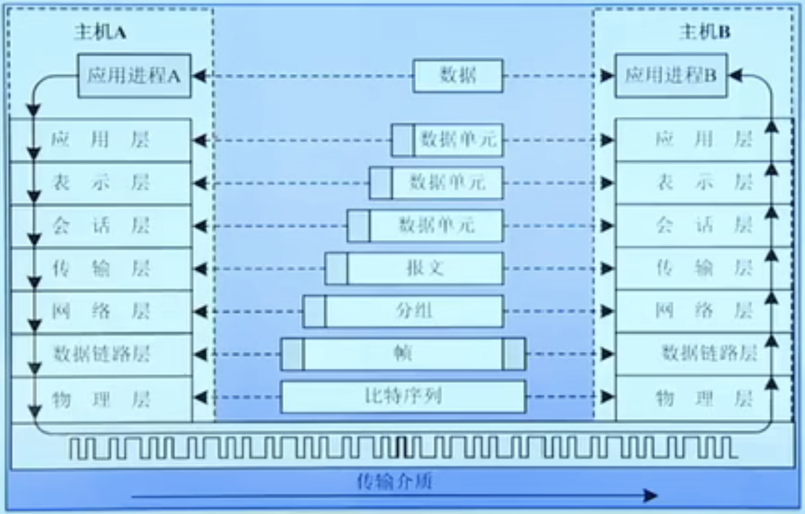
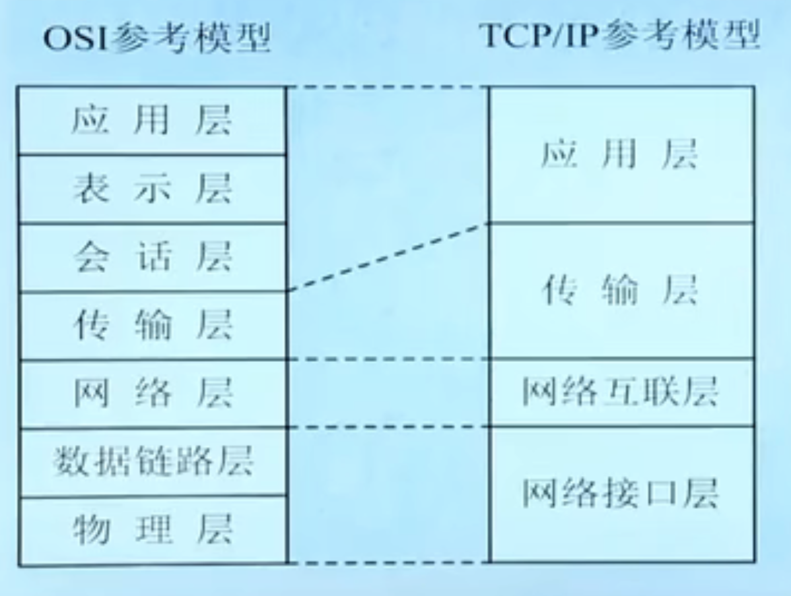
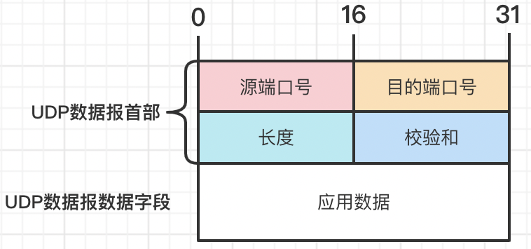
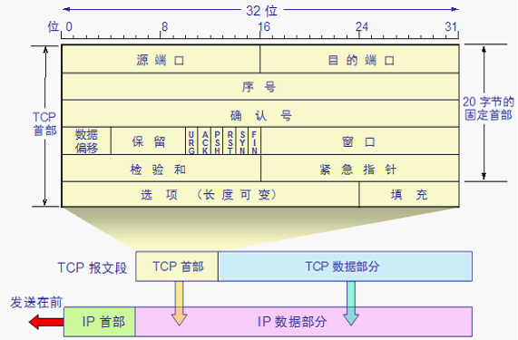
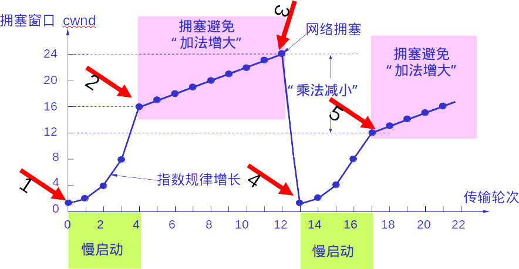

# 网络协议和体系结构

1.  [网络协议和体系结构概述](#网络协议和体系结构概述)
2.  [OSI参考模型](#osi参考模型)
3.  [TCP/IP参考模型](#tcpip参考模型)
4.  [TCP和UDP](#tcp和udp)

## 网络协议和体系结构概述

网络协议：通信双方必须遵守的规则和约定称为协议或规程。协议的要素包括语法、语义和时序。

分层：

*   分层的核心思想是上一层的功能建立在下一层的功能基础上，并且在每一层内均要遵循一定的通信规则。
*   分层的好处：各层次之间可相互独立；有较强的灵活性；分层的思想有利于标准化。

网络体系结构：

*   层次和协议的集合构成了网络的体系结构。
*   体系结构研究的是网络系统各部分的组成及其相互关系。
*   目前，典型的层次化体系结构有OSI参考模型和TCP/IP参考模型两种。

## OSI参考模型

1984年，负责制定国际标准的国际标准化组织ISO吸取了IBM的SNA和其他计算机厂商的网络体系结构，提出了开放系统互连参考模型（OSI/RM）。“开放”是指按照这个标准设计和建成的数据通信网中的设备都可以相互通信。

OSI参考模型采用分层结构化技术，将整个网络的通信功能分为7层，由低到高分别是：物理层、数据链路层、网络层、传输层、会话层、表示层和应用层。

*   资源子网中的计算机含有全部7层，其中网卡实现物理层和数据链路层，操作系统实现网络层、传输层、会话层和表示层，应用软件实现应用层。通信子网中的路由器实现3层，分别是物理层、数据链路层和网络层。
*   物理层：实现比特流传输，实现信号编码功能；规定数据终端设备（计算机）DTE与数据通信设备（调制解调器）DCE的接口特性。包括机械、电气、功能和规程四个方面。
*   数据链路层：传输以“帧”为单位的数据块，进行差错控制、连接管理等功能。
*   网络层：数据转发和路由、流量控制、寻址（IP地址）。
*   传输层：端到端通信（进程-进程）。
*   会话层：用户和用户的连接、通过在两台计算机间建立、管理和终止通信完成对话。实际应用中被应用层覆盖。
*   表示层：主要处理应用实体间交换数据的语法，解决格式和数据表示的差异，为应用层提供统一的数据格式。还可以实现压缩（解压缩），加密（解密），字符编码的转换功能。实际中，该层功能由应用层实现，不单独存在。
*   应用层：提供给用户相关的网络服务接口。
*   

OSI参考模型的有关术语：

*   数据单元：在层的实体之间传送的比特组称为数据单元。
*   协议数据单元PDU：在对等层之间传送数据单元是按照本层协议进行的，这时的数据单元称为协议数据单元。
*   PDU在不同层往往有不同的叫法：物理层中称为位流或比特流，数据链路层中称为帧，网络层中称为分组或包，传输层中称为数据段或报文段，应用层中称为报文。
*   服务访问点：相邻层间的服务是通过其接口面上的服务访问点SAP进行的，N层SAP就是N+1层可以访问N层的地方。每个SAP都有唯一的一个地址。
*   服务原语：OSI参考模型有四种原语。
    *   请求（Request）：上层向本层请求指定的服务。
    *   确认（Confirm）：本层响应上层的请求。
    *   指示（Indication）：本层发送给上层用来指示本层的某一个事件。
    *   响应（Response）：上层响应本层的指示。
*   面向连接和无连接：
    *   面向连接：需要请求建立连接、连接建立、传输数据和拆除链路的过程。如果接收方收到数据后予以确认，就是可靠传输；不确认，就是不可靠传输方式。
    *   无连接：没有链路建立和拆除的过程，也称为数据报服务。每个分组单独选择路径，无序、接收方需要重组分组。

## TCP/IP参考模型

TCP/IP参考模型将整个网络的通信功能分为4层，由低到高分别是：网络接口层、网络互联层、传输层和应用层。

*   
*   TCP/IP参考模型中，无论网络接口层采用什么类型的协议，只需要网络互联层采用IP协议，即可将异构的网络互联起来。
*   应用层：
    *   Internet上常见的应用大多在这一层，用户通过应用层来使用Internet提供的相应服务。
    *   TCP/IP应用层基本的协议主要有：
        *   远程登录协议（TELNET）。
        *   文件传输协议（FTP）。
        *   简单邮件传输协议（SMTP），POP3协议。
        *   超文本传输协议（HTTP）。
        *   域名服务（DNS）协议。
        *   简单网络管理协议（SNMP）。
        *   动态主机配置协议（DHCP）。
*   传输层：负责在会话进程之间建立和维护端-端（进程-进程）连接，实现网络环境中分布式进程通信。传输层主要包括面向连接、提供可靠数据流传输的传输控制协议（TCP）和无连接、不提供可靠数据传输的用户数据报协议（UDP）。TCP协议提供比较完善的流量控制和拥塞控制。
*   网络互联层：
    *   该层协议主要是IP协议，一种不可靠、无连接的数据报传送服务协议。本层的协议数据单元是IP分组。该层设备是路由器，负责路由转发和IP分组寻址。
    *   网络互联层还包括互联网控制报文协议（ICMP）、互联网多播组管理协议（IGMP），地址转换协议（ARP），反向地址转换协议（RARP）以及路由协议，如BGP，OSPF和RIP等。
*   网络接口层：本层的具体实现方法随着网络类型不同而不同，允许使用广域网、局域网与城域网的各种协议。只要遵循网络互联层的IP协议即可。
*   在实际的数据通信过程中，用户的数据在应用层以报文的形式开始向下一层进行封装，形成报文、报文段、分组、帧，最后以比特流的形式在不同的传输介质上进行传输。

TCP/IP参考模型和OSI参考模型的相似之处：都是按照层的思想对计算机网络进行模块化设计，形成了一组自上而下的单向依赖关系的协议栈。

TCP/IP参考模型和OSI参考模型的区别：层次划分不同；面向连接和面向无连接的通信不同；与具体协议的配合程度。

## TCP和UDP

TCP/IP参考模型中的传输层：

*   为应用进程提供端到端的通信。
*   TCP/IP中规定了两种不同的传输层协议：面向连接的传输控制协议（TCP）和无连接的用户数据报协议（UDP）。

端口：

*   传输层使用协议端口号，简称为端口（PORT）进行统一寻址。
*   端口号是一个16位的二进制整数，根据端口号的大小，端口可以分为熟知端口、注册端口和客户端口等。
    *   端口号0～1023是熟知端口，如ftp（20，21），smtp（25），http（80）。
    *   1024～49151为登记端口，49152～65535为客户端口号。

UDP：

*   
*   用户数据报协议，是一种无连接的传输层协议。
*   源端口号：在需要对方回信时选用，不需要时可用全0。
*   目的端口号：这在终点交付报文时必须要使用到。
*   长度：UDP用户数据报的长度，其最小值是8个字节（仅有首部）。
*   检验和：检测UDP用户数据报在传输中是否有错，有错就丢弃。校验算法为二进制反码求和校验。
*   UDP的工作机制主要包括以下几个方面：
    *   UDP是一个无连接协议，传输数据之前源端和终端不建立连接。
    *   一台服务机可同时向多个客户机传输相同的消息。
    *   UDP数据报的首部很短，只有8个字节。
    *   吞吐量不受拥塞控制算法的调节。
    *   UDP使用最大能力交付，即不保证可靠交付。
    *   UDP是面向报文的，对报文不拆分、不合并。适用于实时性要求高的场合。

TCP：

*   
*   传输控制协议是一种面向连接的、可靠的、基于字节流的传输层通信协议。
*   在TCP/IP参考模型中，TCP位于网络互联层之上，应用层之下。由于IP层不提供可靠的通信服务，因此主机之间要实现可靠的数据传输，需要使用TCP的传输控制。
*   TCP会把数据流分成一定长度的报文（注：长度受数据链路层的最大传输单元MTU限制，以太网的MTU是1500字节）。
*   源端口和目的端口：各占2个字节。端口是传输层和应用层的服务接口。
*   序号：占4个字节。TCP连接中传送的数据流中的每一个字节都编上一个序号。序号字段的值指的是本报文段所发送的数据段的第一个字节的序号。
*   确认号：占4个字节。是期望收到对方的下一个报文段的数据的第一个字节的序号。
*   数据偏移（首部长度）：占4个bit。它指出TCP报文段的数据起始处距离TCP报文段的起始处有多远。数据偏移的单位是4字节，4bit可以表示0～15，所以首部长度最多15×4Byte=60Byte。
*   保留字段：占6bit。保留为今后使用，但目前应置为0。
*   紧急比特URG：当URG=1时，表明紧急指针字段有效。它告诉系统此报文段中有紧急数据，应尽快传送（相当于高优先级的数据）。
*   确认比特ACK：只有当ACK=1时确认号字段才有效。当ACK=0时，确认号无效。
*   推送比特PSH：接收TCP收到推送比特置1的报文段，就尽快地交付给接收应用进程，而不再等到整个缓存都填满了后再向上交付。
*   复位比特RST：当RST=1时，表明TCP连接中出现严重差错（如由于主机崩溃或其他原因），必须释放连接，然后再重新建立运输连接。
*   同步比特SYN：当SYN=1时，就表示这是一个连接请求或连接接受报文。（三次握手中使用）。
*   终止比特FIN：用来释放一个连接。当FIN=1时，表明此报文段的发送端的数据已发送完毕，并要求释放运输连接。
*   窗口：占2个字节。窗口字段用来控制对方发送的数据量，单位为字节。TCP连接的一端根据设置的缓存空间大小确定自己的接收窗口大小，然后通知对方以确定对方的发送窗口的上限。
*   检验和：占2个字节。检验和字段检验的范围包括首部和数据这两部分。
*   紧急指针字段：占2个字节。紧急指针指出本报文段中的紧急数据的最后一个字节的序号。（紧急数据放在数据部分的开始）。
*   选项字段：长度可变。TCP只规定了一种选项，即最大报文段长度MSS（Maximum Segment Size）。MSS告诉对方TCP，我的缓存所能接受的报文段的数据字段的最大长度是MSS个字节，不包含TCP首部。
*   填充：这是为了使整个首部长度是4字节的整数倍，取值全0。
*   TCP的工作机制：
    *   分割数据报，产生报文段。
    *   发出报文段后，启动定时器，超时没有收到确认，则重发。
    *   TCP首部中设有检验和字段，用于检测数据在传输过程中是否发生变化。若有错误，则丢弃，发送方会因为收不到确认而超时重发。
    *   失序的报文段会重新排序。
    *   重复的报文段会丢弃。
    *   TCP提供流量控制。

TCP的“三次握手”建立连接过程：

*   A的TCP向B发出连接请求报文段，其首部中的同步位SYN=1，并选择初始序号seq=x，表明传送数据的第一个字节的序号是x。（第一次握手）。
*   B的TCP收到连接请求报文段后，如同意，则发回确认。B在确认报文段中应使用SYN=1，ACK=1，其确认序号ack_seq=x+1，自己选择的初始序号seq=y。（第二次握手）。
*   A收到此确认报文段后向B给出确认，其中ACK=1，SYN=0，seq=x+1，ack_seq=y+1。（第三次握手）。

TCP的“四次握手”拆除连接过程：

*   假如拆除连接由A发起，则A向B发送释放连接控制报文段，并停止再发送数据，FIN=1，序号seq=u。
*   B收到A发送的释放连接控制报文段后，立即向A发送确认报文段ACK=1，ack_seq=u+1，seq=v。
*   如果B已经没有要向A发送的数据，则B向A发送释放连接控制报文段，FIN=1，seq=w，ack_seq=u+1。
*   A收到B的释放连接控制报文段后，要向B发送确认报文段，ACK=1，seq=u+1，ack_seq=w+1。

流量控制：流量控制的目的是使发送端的数据发送速率不要太快，确保接收端能够来得及接收，即接收端的数据缓存不会溢出。通过“窗口机制”进行流量控制。

拥塞控制：TCP的拥塞控制是从端到端的角度推测网络是否发送拥塞，如果推断发生拥塞，立即将数据发送速率降下来，以缓解网络拥塞。通过“窗口机制”进行拥塞控制。

滑动窗口：

*   TCP采用大小可变的滑动窗口进行流量控制，窗口大小的单位是字节。在TCP报文段首部的窗口字段写入的数值就是当前给对方设置的发送窗口数值的上限。发送窗口在连接建立时由双方商定，但在通信的过程中，接收端可根据自己的资源情况，随时动态地调整对方的发送窗口上下限值。
*   接收端窗口rwnd：这是接收端根据目前的接收缓存大小所许诺的最新的窗口值，是来自接收端的流量控制。接收端将此窗口值放在TCP报文的首部中的窗口字段，传送给发送端。
*   拥塞窗口cwnd：是发送端根据自己估计的网络拥塞程度而设置的窗口值，是来自发送端的流量控制。

慢启动和拥塞避免：

*   慢启动原理：在主机刚刚开始发送报文段时可先将拥塞窗口cwnd设置为一个最大报文段MSS的数值。在每收到一个对新的报文段的确认后，将拥塞窗口增加最多一个MSS的值。用这样的方式逐步增大发送端的拥塞窗口cwnd，可以使分组注入网络的速率更加合理。
*   
*   慢启动和拥塞避免是1988年提出的拥塞控制算法。
*   当TCP连接进行初始化时，将拥塞窗口设置为1。图中的窗口单位不使用字节而使用报文段。慢启动门限的初始值设置为16个报文段，即ssthresh=16。
*   在执行慢启动算法时，拥塞窗口cwnd的初始值为1，发送第一个报文段M0。
*   发送端收到ACK1（确认M0，期望收到M1）后，将cwnd从1增大到2，于是发送端可以发送M1和M2两个报文段。
*   接收端发回ACK2和ACK3。发送端每收到一个对新报文段的确认ACK，就把发送端的拥塞窗口加1，现在发送端的cwnd从2增大到4，并可发送M3～M6共4个报文段。
*   当拥塞窗口cwnd增长到慢启动门限值ssthresh时（即当cwnd=16时），就改为执行拥塞避免算法，拥塞窗口按线性规律增长。
*   假定拥塞窗口的数值增长到24时，网络出现超时（表明网络拥塞）。
*   更新后的ssthresh值变为12（即发送窗口数值24的一半），拥塞窗口重新设置为1，并执行慢启动算法。
*   当cwnd=12时改为执行拥塞避免算法，拥塞窗口按线性规律增长，每经过一个往返时延就增加一个MSS的大小。

快速重传和快速恢复：

*   1990年在此基础上又增加了快速重传和快速恢复两个算法。
*   快重传算法规定，发送端只要一连收到三个重复的ACK即可断定有分组丢失了，就应立即重传丢失的报文段而不必继续等待为该报文段设置的重传计时器超时。
*   快重传并非取消重传计时器，而是在某种情况下可更早地重传丢失的报文段。
*   两次duplicated ACK时可能是乱序造成的，三次duplicated ACK时很可能是丢包造成的，四次及以上更更更可能是丢包造成的。
*   快恢复算法规定，当发送端收到连续三个重复的ACK时，就重新设置慢启动门限ssthresh减半，为了预防网络产生拥塞，当拥塞窗口cwnd为减半后的ssthresh值时，执行拥塞避免算法继续发送报文段，使得cwnd缓慢的加性增大。

加性增大和乘性减少：

*   “加性增大”是指执行拥塞避免算法后，当收到对所有报文段的确认就将拥塞窗口cwnd增加一个MSS大小，使拥塞窗口缓慢增大，以防止网络过早出现拥塞。
*   “乘性减少”是指不论在慢启动还是拥塞避免阶段，只要出现一次超时，就把慢启动门限值ssthresh设置为当前的拥塞窗口值乘以0.5。当网络频繁出现拥塞时，ssthresh值就下降得很快，以大大减少注入到网络中的分组数。
