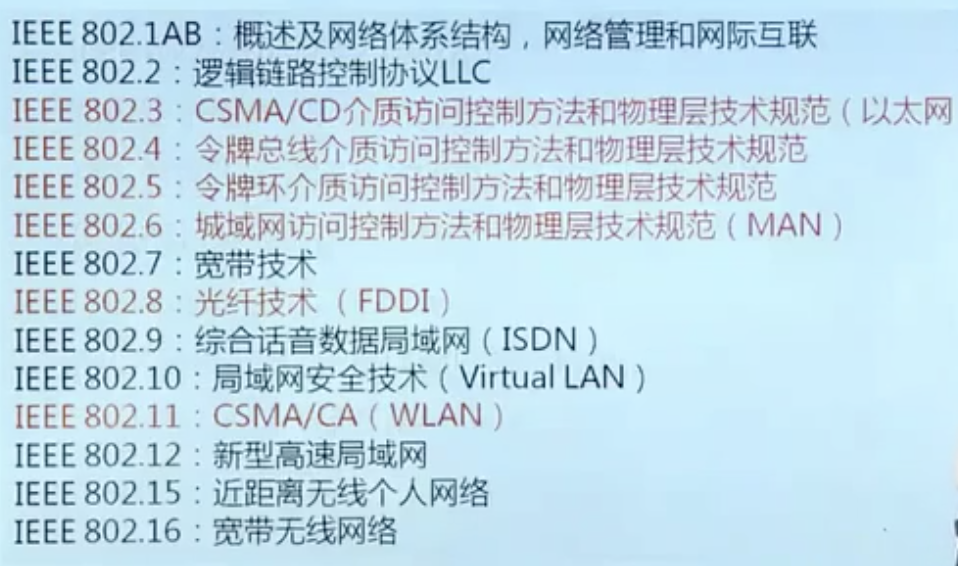
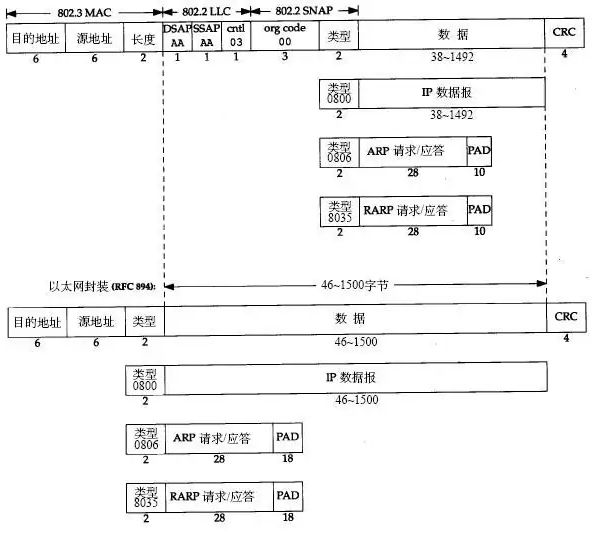
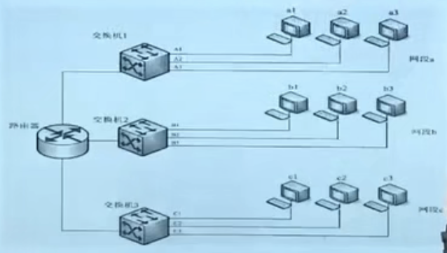
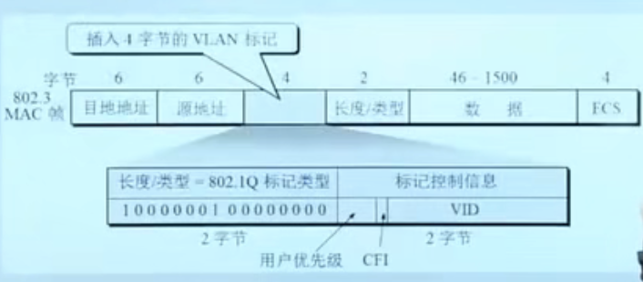

# 局域网技术

1.  [局域网概述](#局域网概述)
2.  [以太网技术](#以太网技术)
3.  [虚拟局域网](#虚拟局域网)
4.  [无线局域网](#无线局域网)

## 局域网概述

局域网概念：

*   局域网是计算机网络的一种具体应用形式，也是互联网的重要组成部分。
*   局域网可以将范围在几十米到几千米内的计算机设备连接起来实现数据的高速通信。
*   可以实现文件管理、应用软件共享、打印共享和电子邮件等功能。
*   网络中的用户可以通过局域网接入Internet。

局域网标准：

*   1980年，DEC公司、Intel公司和施乐公司联合提出了以太网标准DIX Ethernet V1，1982年提出了DIX Ethernet V2。过去局域网技术主要有以太网、令牌环网和令牌总线网三种。现在局域网技术主要是以太网。
*   为了解决局域网技术标准化的问题，美国电气和电子工程师协会在1980年成立局域网标准委员会，简称IEEE 802委员会，专门从事局域网标准工作，IEEE 802标准主要研究的是局域网内部的数据传输与控制。对应OSI参考模型的数据链路层和物理层两个层次。数据链路层用于信息帧的传送与控制，物理层负责物理连接和实现比特流的传输。
*   IEEE802参考模型的范围：逻辑链路控制LLC、介质访问控制MAC和物理层。对应OSI参考模型的数据链路层和物理层两个层次。数据链路层用于信息帧的传送与控制，物理层负责物理连接和实现比特流的传输。
*   IEEE802委员会提出将数据链路层划分为两个子层逻辑链路控制子层和介质访问控制子层。接入各种传输介质有关的内容都放在MAC子层，包括将上层数据封装成帧进行发送、寻址和比特差错检测等。LLC层负责与介质介入无关的内容，包括建立和释放数据链路层的逻辑连接、提供帧序号、提供高层接口和差错控制等。不同的局域网在MAC子层和物理层可以采用不同的技术和协议，但在LLC层必须采用相同的技术和协议。
*   

## 以太网技术

以太网的基本原理：

*   传统的以太网，采用总线型拓扑结构，所有结点共享一条总线，每一个结点以广播的方式发送数据，为了避免冲突，要使用介质访问控制协议CSMA/CD。
*   CSMA/CD（载波监听多路访问/冲突检测）：
    *   基本思想：每一个在发送数据之前首先要检测总线上是否有其他结点发送数据，如果有，则暂时不发送数据，要等到信道变成空闲状态后再发送数据，边发送边监听，当发现总线有冲突时立即停止发送，等待一段时间，再发送。
    *   CSMA/CD的介质访问控制基本思想概括：“先监听，再发送；边发送，边监听”。

以太网的硬件网址：

*   IEEE802委员会为局域网设定了一套标识规则，即用一个48bit二进制作为局域网的全球地址，标识每一块局域网适配器（网卡），MAC地址或物理地址。
*   MAC地址由IEEE全球统一分配；顺序编号，和使用MAC的计算机所在的地理位置无关；48bit，前24bit厂商编号，后24bit厂商定义的产品编号。

以太网的MAC帧格式：

*   
*   以太网帧长64～1518B；数据长度46～1500B；最大传输单元MTU为1500字节；以太网中凡是出现帧长小于64的帧，都是由于碰撞而产生的无效帧。

以太网的产品类型：

*   粗缆以太网10BASE-5：传输介质50Ω粗缆，带宽10Mbps，基带传输，单电缆长度500米，最多4个中继器，一条干线最多100个工作站。
*   细缆以太网10BASE-2：传输介质50Ω细缆，带宽10Mbps，基带传输，单电缆长度200米，最多4个中继器，一条干线最多30个工作站。
*   双绞线以太网10BASE-T：非屏蔽双绞线，100米，最多4个集线器。
*   快速以太网100BASE-T：帧格式不变，CSMA/CD。
*   千兆以太网：帧格式不变，CSMA/CD。
*   万兆以太网：帧格式不变，不支持CSMA/CD，只支持全双工传输方式。

以太网的扩展：

*   中继器和集线器：
    *   中继器：常用于连接两个以太网网段，对衰减信号进行整形放大，保持与原数据相同。
    *   集线器（Hub）：一种特殊形式的中继器，内部工作方式仍然为总线结构，对物理信号进行放大和转发（向其他所有端口）。可以通过多个集线器之间的级联，形成更大范围的以太网。
    *   中继器和集线器只是对物理信号整形放大，是物理层上的设备。
    *   多级集线器构成的以太网仍然采用CSMA/CD协议，因此会在整个以太网范围内形成一个很大的碰撞域（冲突域），即在这个冲突域中，任意时刻只能有一个主机可以发送数据，否则就会发生碰撞。
*   网桥：
    *   工作在数据链路层的以太网扩展设备，用于连接少量的以太网网段（网桥一般设有2～4个接口），它根据MAC帧中的目的地址对收到的帧进行转发和过滤。
    *   网桥通过接口不同的以太网网段，其内部维护着一个用于转发MAC帧的数据库，称为转发表。当网桥收到一个帧时，并不是向所有接口（与集线器比较）转发此帧，而是对该帧进行读取，检查其目的地址，根据转发表将该帧转发到合适的接口，或者将其丢弃。
    *   网桥建立转发表的流程：网桥在收到一个帧后先进行自学习。查找转发表中与收到的帧源地址有无匹配的项目。如果没有，就在转发表中增加一个项目（源地址、进入的接口和时间）；如果有，则把原有的项目进行更新。然后执行转发帧。查找转发表中与收到帧的目的地址有无匹配的项目。如果没有，则通过所有其他接口进行转发；如果有，则按转发表中给出的接口进行转发。但应该注意，若转发表中给出的接口就是该帧的进入网桥的接口，则应该丢弃。
*   以太网交换机：以太网交换机也是工作在数据链路层的以太网扩展设备，也被称为第二层交换机。

## 虚拟局域网

虚拟局域网的基本概念：
  
*   IEEE802.1Q中虚拟局域网（VLAN）的定义：VLAN是由一些局域网段构成的与物理位置无关的逻辑组，而这些网段具有某些共同的需求。每一个VLAN帧都有一个明确的标识符，可以指明发送这个帧的主机属于哪一个VLAN。
*   
*   在虚拟局域网中的每一个主机都可以收到同一虚拟局域网内的其他主机所发出的广播。当一个主机向虚拟局域网内的其他主机发送数据时，该虚拟局域网外的其他主机不会收到其所发出的广播信息。抑制“广播风暴”。

划分虚拟局域网的方法：基于交换机端口的划分；基于MAC地址的划分；基于上层协议类型或地址的划分。

虚拟局域网的帧格式：

*   IEEE802.1Q标准定义了以太网的帧格式，即在一般的以太网的帧格式中插入4B的标识符，称为VLAN标记，用来指明发送该帧的主机属于哪一个虚拟局域网。
*   

## 无线局域网

WLAN是局域网发展的一种新形式，在家庭、办公室、工厂、学校、商场和餐厅等场所，通过无线方式在各种便携式的计算机设备之间建立数据连接，从而实现各种网络服务和功能。

无线局域网根据网络结构可以分为两大类：有固定基础设施的无线局域网和无固定基础设施的无线局域网。

*   有固定基础设施的无线局域网：指网络中已经预先存在了一批固定的数据处理和转发设备。
*   无固定基础设施的无线局域网：指网络中的每个成员都是对等的可移动设备。

IEEE802.11在MAC层使用CSMA/CA协议：采用“停止-等待”的可靠传输方式。采用“虚拟载波监听”机制。在信道从忙态转为空闲时，各个站点要执行“退避算法”，等待一个随机的时间段后再发送数据，减少碰撞的概率。

对于有固定基础设施的无线局域网，IEEE802.11协议标准规定了WLAN的最小单元为基本服务集BSS，其中包括一个AP和多个移动设备。在一个BSS内，各个移动设备之间可以通信。但如果要和本BSS之外的设备进行通信，则必须经过BSS内的AP。

对于无固定基础设施的无线局域网，也称自组网络，没有上述基本服务集中的接入点AP，而是有一些处于平等的移动站之间相互通信组成的临时网络。
