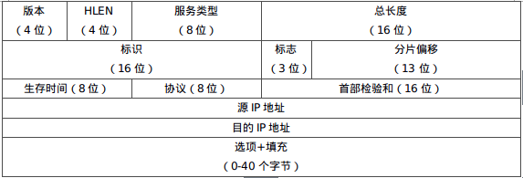

# 网络互联技术

1.  [网络互联概述](#网络互联概述)
2.  [网际协议](#网际协议)
3.  [IP地址](#ip地址)
4.  [IP路由概述](#ip路由概述)
5.  [IP中的其他协议](#ip中的其他协议)
6.  [IPv6协议](#ipv6协议)

## 网络互联概述

网络互联技术是所有能在物理上和逻辑上实现不同网络相互连接的技术的总称，对应于ISO/OSI参考模型的各个层次。

“互联”和“互连”具有不同的含义：“网络互连”仅指将网络通过有线或无线传输介质在物理上连接在一起，而“网络互联”的含义还包括不同的网络之间在功能和应用上能够看起来像一个完整的网络一样，自由顺畅地运行。

采用不同通信技术和运行协议的网络通常称为异构网络。

## 网际协议

IP概述：

*   网络层协议：ICMP，IGMP，ARP，IP。
*   IP网络采用路由器（Router）作为网络互联的中间设备，将不同的计算机网络互联起来，在网络层实现数据的路由和转发。
*   IP的特点：IP是面向无连接的，不可靠的分组传输协议。IP屏蔽了数据链路层和物理层的差异，使得数据的传输和转发更加方便。IP是点对点式网络通信协议。

IPv4协议报文格式：

*   IPv4式第四版IP协议，IP协议是Internet的主要协议之一。
*   
*   版本：定义了IP协议的版本。
*   首部长度：4bit的字段定义了分组的首部长度，最多15，单位4B，所以最长60B。
*   服务类型：定义了一组区分服务用于表示分组的优先级。当路由器需要丢弃一些数据时，优先级低的将会首先被丢弃。
*   总长度：16bit。故IPv4分组总长度的上限值是65536位。
*   标识：确定了分组的唯一性。这样使得分组被分片后，在到达终点时能够根据标识号将同一个分组的分片重新组装成一个分组。
*   
    *   第一位保留（未用），第二位表示不分片，第三位表示还有分片。
*   分片偏移：13bit。表示该分片在原始分组中的偏移量，以8B为单位。
*   生存时间：控制分组所经过的最大跳数（路由器），每经过一个路由器，这个字段数值都减1，当值为0时，路由器就丢弃这个分组。
*   协议：8bit。定义了使用IPv4服务的高层协议。1表示ICMP，2表示IGMP，6表示TCP，17表示UDP，89表示OSPF。
*   检验和：检验IP分组首部。
*   源地址：32bit。源点的IP地址。
*   目的地址：32bit。终点的IP地址。

二进制反码求和校验算法：

*   
*   在发送数据时：把校验和字段设置为0；把首部的数据看成以16位为单位的数字组成，依次进行二进制反码求和；把得到的结果存入校验和字段中。
*   在接收数据时：把首部的数据看成以16位为单位的数字组成，依次进行二进制反码求和，包括校验和字段；检查计算出的校验和的结果是否为0，如果是，说明校验和正确，如果不是，协议栈要抛弃这个分组。

## IP地址

目前普遍使用的IP地址是IPv4，用32位二进制表示。32bit分为4组，每组转化为十进制，用“.”隔开，这种表示方法称为点分十进制法。

```txt
// 某 IP 地址用二进制数表示为
11001010 11000010 00010100 10001010

// 用点分十进制数可以写成
202.194.20.138
```

分类的IP地址：IP地址::={<网络号>, <主机号>}。

*   
*   不同的网络号和主机号的设置决定了IP地址的分类，包括了A、B、C、D和E共五种类别。
*   A类地址：
    *   其网络号字段占据1个字节且第1位固定为0，则有7位可以使用，所以可指派的网络号个数2<sup>7</sup>-2=126个，减去2的原因在于IP地址全0是保留地址，表示本地网络，网络号为127，即01111111用于回环测试。
    *   主机号占3个字节，因此每个A类网络的最大主机数为2<sup>24</sup>-2=16777214个，减2的原因在于全0的主机号代表这个网络段本身，称之为网络号，这个地址是不可以分配给主机的，常用在路由表中。假设当你添加一条指向192.168.128.0的路由，就代表了这个网络中的所有地址192.168.128.1～192.168.128.254的数据都可由上面路由指定的路由网关转发。主机号全1的地址是广播地址，你给这个地址发数据包，这个网络中的所有主机都能收到。
*   B类地址：其网络号字段占据2个字节，其前两位固定为10，则可分配的网络号2<sup>14</sup>-1=16383，减1的原因是IP规定128.0.0.0这个B类地址不可以指派。B类地址的每一个网络上的最大主机数是2<sup>16</sup>-2=65534个。
*   C类地址：其网络号字段占据3个字节，且最前面的3位固定为110，同时192.0.0.0这个地址也不可指派，所以其可以分配的网络号个数为2<sup>21</sup>-1=2097151个。C类地址的每一个网络的最大主机数是2<sup>8</sup>-2=254个。
*   D类地址：不分网络号和主机号，它的第1个字节的前4位固定为1110。地址范围224.0.0.1～239.255.255.254。用于组播。
*   E类地址：不分网络号和主机号，它的第1个字节的前5位固定为11110。地址范围240.0.0.1～255.255.255.254。保留为以后使用。

子网划分：IP地址::={<网络号>, <子网号>, <主机号>}。

*   划分子网纯属一个单位内部的事情。单位对外仍然表现为没划分子网的网络。
*   从主机号借用若干比特作为子网号subnet-id，而主机号host-id也就相应减少了若干个比特。
*   子网划分的好处：避免IP资源浪费；增加灵活性。
*   某单位拥有一个C类地址，其网络地址为202.194.20.0（网络号为202.194.20），则所有目的IP地址为202.194.20.x的IP数据报都会被发送到与这个网络相连的路由器R上。假设该单位将其主机号中的3位作为子网号使用，剩下的5位作为主机号，则可以最多在其单位内部划分出8个子网。
    *   202.194.20.<font color="#f07d71">xxx</font>xxxxx
    *   子网号：000，001，010，011，...，111
    *   主机号：以000子网为例是00000～11111
*   子网掩码：
    *   采用子网划分方法的一个最核心问题是如何使得路由器能够正确地将IP数据报发送给网络内部不同的子网，采用”子网掩码“的方式。
    *   子网掩码也是一个32位的二进制数，由一串1和跟随的一串0组成，形如11111111 11111000 00000000 00000000，与IP地址一样，也可以用4个点分十进制数来表示。子网掩码中的1对应IP地址中的网络号和子网号字段，0对应于主机号字段。

例题：某单位分配到一个地址块138.24.13.64/26（26为掩码），现在需要进一步划分为8个一样大的子网，则每个子网的网络前缀为多少位，每个子网有多少个IP地址，每个子网的地址块是什么？

*   子网网络前缀（子网掩码）：26 + log<sub>2</sub>8 = 29
*   每个子网IP地址数：2<sup>32 - 29</sup> = 8
*   每个地址块138.24.13.64/29，138.24.13.72/29，138.24.13.80/29，138.24.13.88/29，138.24.13.96/29，138.24.13.104/29，138.24.13.112/29，138.24.13.120/29

## IP路由概述

当Internet中的每一个参与通信的设备都被赋予有效的IP地址（公网IP）之后，IP数据报就可以按照IP地址进行发送和接收，而在整个网络中为IP数据报寻找合适的通信路径并且将其转发出去的过程称为IP路由，是由路由器实现的。

路由器的结构及功能：

*   路由器是一种具有多个输入端口和多个输出端口的专用计算机。其主要任务是获取与维护路由信息及转发分组。
*   路由器从功能结构角度可以分为：输入端口、输出端口、交换结构与路由处理器。

路由表与路由转发：

*   “路由“与”转发“是路由器最重要的两项基本功能。通过静态（人工方式）或者动态（运行路由协议）获取的路由信息被保存在路由表中，供数据转发时使用。
*   路由表的基本结构：目的网络、子网掩码、下一跳和接口。
*   路由器的工作过程：收到IP分组，查找路由表，转发IP分组。
*   默认路由是没有规定的网络去向用的，特定主机路由是明确走向的。
*   
*   

路由算法：分为静态路由与动态路由。

*   静态路由：人工配置的路由。
*   动态路由：根据某种路由算法得到的路由信息。
    *   距离向量路由算法：周期性的向邻居通告本路由信息，邻居根据通告更新自己的路由表信息并与其相邻的邻居交换路由信息。
    *   链路状态路由算法：每个路由器根据其链路状态，依据Dijkstra算法求出到达每个网络的最短路径。

路由协议：

*   自治系统（Autonomous system，AS）：自治系统是统一技术管理下的一组路由器。
*   层次路由：AS内部采用相同的路由协议，AS之间采用自治系统间路由协议。
*   域内路由与域间路由：
    *   内部网关协议IGP：RIP，OSPF。
    *   外部网关协议EGP：BGP4。
*   RIP路由协议：距离向量的IGP，直连网络的跳数为1，每经过一个路由器跳数+1，最大跳数15跳（16跳表示网络不可达）。
*   OSPF路由协议：开放最短路径优先协议。
*   BGP协议：不同自治系统的路由器交换路由信息的协议。

## IP中的其他协议

地址解析协议：实现局域网内IP地址转MAP地址。

*   ARP的基本思想是在每一台主机内设置专用内存区域，称为ARP高速缓存，里面有该主机所在局域网中各个主机和路由器的IP地址与硬件地址的映射表，并且这个映射表要经常更新。
*   假设某局域网内主机A要向局域网内的另一个主机B发送IP数据报，主机A首先查找其ARP高速缓存内的映射表中是否有主机B的IP地址，如果有，则查找出对应的硬件地址，并将该硬件地址写入MAC帧，通过局域网将该MAC帧发送给主机B。如果ARP高速缓存中没有主机B的IP地址，则运行ARP，找出主机B的硬件地址。

动态主机配置协议：应用层协议。

*   DHCP采用的是客户机/服务器模式。
*   在一个网络内部设置一台DHCP服务器，其中保存和管理着该网络所管辖的IP地址及其他配置信息。当一台计算机新接入该网络时，还没有配置IP地址，它在开机启动后向该网络广播发送一个DHCP发现报文。DHCP服务器在收到DHCP发现报文后，从自己所保存的IP地址数据库中取出一个IP，与其他配置信息一起，通过DHCP提供报文发送给这台计算机，从而为这台计算机分配一个新的IP地址及其他配置。

网际控制报文协议：应用层协议。

*   数据报在传输过程中出现延迟、丢失等异常情况，如果通信的双方能够知道这些异常情况，就可以及时地进行调整和控制，提高网络传输的效率和成功率。网际控制报文协议ICMP就是用来完成这一功能的机制。
*   ICMP报文有两种类型：差错报告报文和询问报文。
    *   差错报告报文：终点不可达、源点抑制、时间超时和参数问题。
    *   询问报文：回送请求和回答（ping）和时间戳请求和回答。

网际组管理协议：网络层协议。

*   IGMP用于对IP多播提供管理服务。IP多播（Multicast）也称为IP组播，是针对Internet上许多由一个源点向多个终点发送数据的业务而设计的一种服务比如新闻发布、视频点播和视频会议等业务，都是由一个信息源向多个用户传递信息的Internet应用。
*   利用多播IP地址标识一个多播组，当向一个多播IP地址发送IP分组时，该多播组内的所有成员都会收到该IP分组。

## IPv6协议

IPv6采用了新的IP首部格式，包括基本首部和多个可选的拓展首部，基本首部为固定的40B长度。

IPv6中将IP地址设置为128位。

IPv6地址用冒号十六进制数表示，如45EE:0000:78AC:FFFF:2A9B:0000:FFFF:62F4。

冒号十六进制表示法可以采用压缩方法，对于连续的多部分0，可以利用连续的“::”代替，但在一个IPv6地址中只能用一次。如某IPv6地址为BC83:0000:0000:0000:0000:315A:0000:0000，可以采用压缩方式将其写成BC83::315A:0000:0000。

IPv6地址包括单播地址，组播地址和任播地址。
