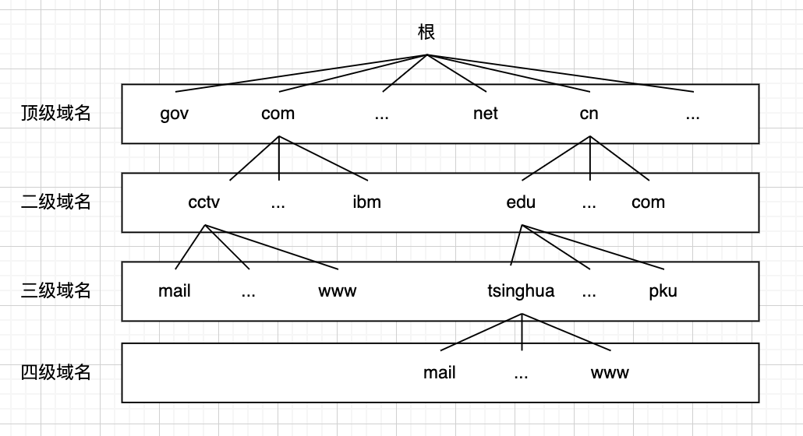
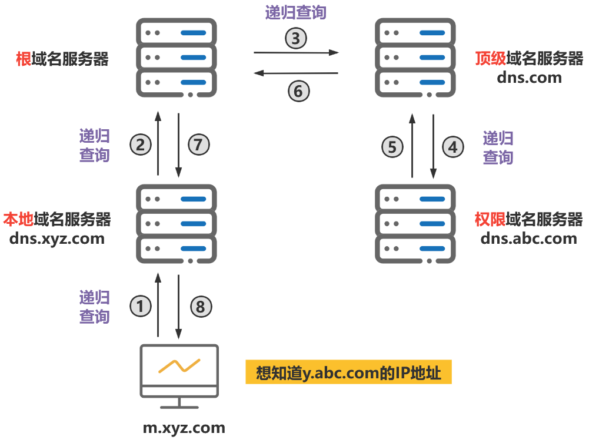
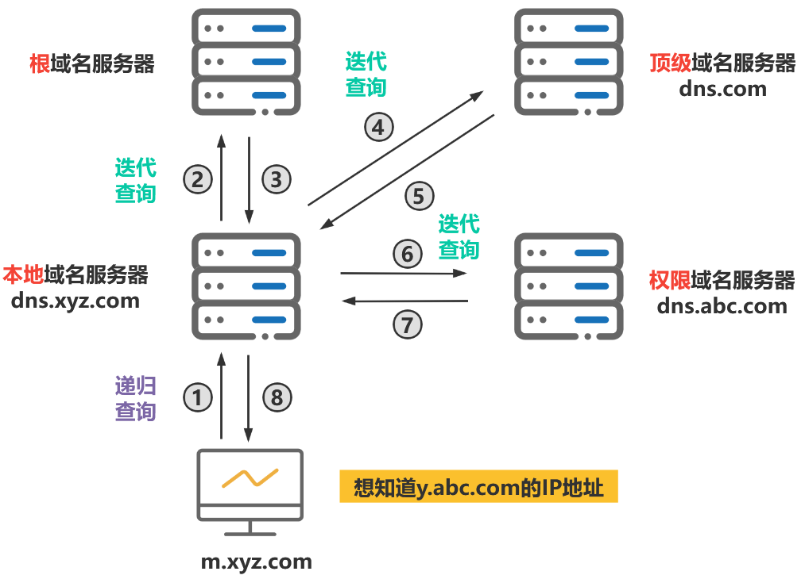

# 网络应用技术

1.  [网络应用概述](#网络应用概述)
2.  [Internet域名系统](#internet域名系统)
3.  [文件传输协议](#文件传输协议)
4.  [电子邮件](#电子邮件)
5.  [万维网](#万维网)
6.  [电子商务应用](#电子商务应用)

## 网络应用概述

网络应用是直接面向计算机网络的用户，遵循相应的网络应用协议，为用户提供某个特定的网络服务或实现特定的网络功能的一套完整的软件系统。

工作模式分为客户机/服务器模式和P2P模式：

*   客户机/服务器模式（浏览器/服务器模式）：客户端发出请求，服务器等待响应。
*   P2P模式：通信双方皆可以请求服务，也可以提供服务。

## Internet域名系统

域名系统简述：

*   数字形式的IP地址，不便于记忆，人们习惯用字符表示Internet上的主机，如www.163.com，这样用户使用域名访问网络服务，而数据包在传输过程中采用IP地址进行路由和转发。
*   在Internet中，提供将主机域名转换成IP地址服务的网络应用，称为域名系统DNS，当一个应用程序遇到某个域名时，可以通过DNS将该域名对应的IP地址找到，并在通信过程中使用IP地址进行数据的传输。

层次域名空间：...标号3（三级域名）.标号2（二级域名）.标号1（顶级域名）。

*   举例：山东大学的域名为sdu.edu.cn，其中cn标号是顶级域名，edu是二级域名，sdu是三级域名。标号使用英文字符，数字和'-'组成，每一个标号不超过63字符，整个域名不超过255字符。

顶级域名分为：国家顶级域名、通用顶级域名和基础结构域名。

*   国家顶级域名nTLD，如.cn表示中国，.us表示美国。
*   通用顶级域名gTLD，.com（公司和企业），.net（网络服务机构），.org（非盈利性组织），.edu（美国专用的教育机构），.gov（美国专用的政府部分）。
*   基础结构域名arpa，用于反向域名解析，又称反向域名。

整个域名空间可以用一棵倒置的树来表示：各个国家负责自己国家所在顶级域名下的二级域名的制定和分配。我国的域名为cn，在cn域名下，将耳机域名划分为类别域名和行政域名两大类，由CNNIC统一管理。



域名服务器：

*   一个服务器所负责管辖的（或有权限的）范围叫做区（Zone）。
*   各单位划分自己管辖范围的区，但在一个区中的所有节点必须是能够连通的。
*   每一个区设置相应的权限域名服务器，用来保存该区中的所有主机的域名到IP地址的映射。
*   DNS服务器的管辖范围不是以“域”为单位，而是以“区”为单位。
*   DNS域名服务器包括：根域名服务器，顶级域名服务器，权限域名服务器，本地域名服务器。
    *   根域名服务器：是最重要的服务器，所有的根域名服务器都知道所有的顶级域名服务器的域名和IP地址。在因特网上共有13个不同IP地址的根域名服务器，它们的名字是用一个英文字母命名，从a到m（前13个字母），分别是a.rootservers.net~m.rootservers.net。
    *   本地域名服务器：当一个主机发出DNS查询请求时，这个查询请求报文就发送给本地域名服务器。每一个因特网服务提供者ISP，或一个大学，甚至一个大学里面的系，都可以拥有一个本地域名服务器。

域名解析：递归解析和迭代解析。

*   主机向本地域名服务器的查询一般都是采用递归查询，如果主机所询问的本地域名服务器不知道被查询的域名的IP地址，那么本地域名服务器以DNS客户的身份，向其他根域名服务器继续发出请求报文。
*   本地域名服务器向根域名服务器的查询通常采用迭代查询。当根域名服务器收到本地域名服务器的迭代查询请求报文时，要么给出所要查询的IP地址，要么告诉本地域名服务器：“你下一步应当向哪一个域名服务器进行查询”，然后让本地域名服务器进行后续的查询。
*   
*   

## 文件传输协议

文件传输协议简述：

*   文件传输协议FTP，用于用户在两台主机之间进行远距离文件传输。FTP提供交互式的访问，允许客户指明文件的类型和格式，并允许文件具有存取权限，FTP屏蔽了各计算机系统的细节，因而适用于在异构网络中的任意计算机之间传送文件。
*   FTP采用客户机/服务器模式，服务器和客户机之间通过下载和上传来实现文件的传输。
*   FTP使用TCP提供的可靠的传输服务。

FTP工作步骤：

*   打开熟知端口21，使客户进程能够连接上。
*   等待客户进程发出连接请求。
*   启动从属进程来处理客户进程发出的请求，从属进程对客户进程的请求处理完毕后即终止，但从属进程在运行期间根据需要还可能创建其他一些子进程。
*   回到等待状态，继续接受其他客户进程发出的请求。主进程与从属进程是并发进行的。服务器传输数据时使用熟知端口20与客户端进程所提供的端口号建立数据连接。

FTP服务使用端口号21等待连接，数据传输时使用20端口号。

## 电子邮件

电子邮件的基本概念：

*   电子邮件E-mail是Internet中使用最为广泛的一种应用服务，除了文字信息外，电子邮件还可以以附件的形式传送文档、图像、音频和视频文件。
*   Internet中的电子邮件系统主要由3部分构成：用户代理（电子邮件客户端软件）、邮件服务器和邮件发送/读取协议（SMTP和POP3）。
*   在TCP/IP体系下的电子邮件地址格式是：邮箱名@邮箱所在服务器的域名。

SMTP、POP3、IMAP协议的基本机制：

*   电子邮件从用户代理发送到邮件服务器采用的是SMTP协议（端口25），邮件服务器接收邮件到用户代理采用的协议是POP3或IMAP
*   SMTP协议规定在两个相互通信的SMTP进程之间应如何交换信息。
*   邮局协议POP是邮件读取协议，现在使用第三版本POP3。
*   另外一种功能更丰富的邮件接收协议是网际报文存取协议IMAP，都使用客户机/服务器工作方式。

基于Web的电子邮件系统，发件人客户端与发送服务器之间，接收客户端与接收邮件服务器之间采用http进行通信。

## 万维网

万维网的概念和构成：

*   万维网WWW由成千上万个万维网站点（简称网站）组成的一个联机信息存储系统，网站上以网页（Page）的形式存储各种文档，其中包含了文字、图片、声音和视频等各种信息。各个网站以链接（link）的方式联系在一起，用户可以从一个网站转到另一个网站进行访问。
*   万维网的核心内容：统一资源定位、超文本传输协议和超文本标记语言。

统一资源定位：

*   为了给Internet上的每一个文档进行标识，万维网采用统一资源定位URL的方法。URL为Internet上的每一个万维网页分配一个唯一的标识符。
*   URL的一般格式如下：<协议>://<主机>:<端口>/<路径>。

    ```txt
    http://www.163.com:80/index.html
    ```

超文本传输协议：

*   超文本传输协议HTTP负责用户访问万维网文档，万维网文档之间的链接，以及将万维网文档中的数据传送到用户计算机。HTTP是一个应用层协议，使用TCP连接进行可靠的传送，能够在万维网上进行文本、声音、图像和视频等各种信息的交换。
*   HTTP也是工作在客户机/服务器模式下，分为HTTP客户端和HTTP服务器两部分，双方每次进行交互，都是由客户端发出请求和服务器发出响应组成。
*   使用浏览器访问万维网的过程可以总结为以下几个步骤：
    *   用户在浏览器中输入需要访问网页的URL或者单击某个网页中的链接。
    *   浏览器根据URL中的域名，通过DNS解析出目标网页的IP地址。
    *   浏览器与网页所在服务器建立TCP连接。
    *   浏览器发送HTTP请求报文，获取目标网页的文件。
    *   服务器发送HTTP响应报文，将目标网页文件发送给浏览器。
    *   释放TCP连接。
    *   浏览器将网页的内容（包括文本、图像和声音等）显示呈现在用户屏幕上。
*   HTTP报文格式：
    *   HTTP请求报文由请求行、请求头部行、空行和请求数据4部分构成。
    *   HTTP响应也由4部分组成，分别是状态行、消息头部、空行和响应正文。

Cookie机制和Session机制：

*   Cookie是由W3C组织首先提出的一种技术，已经成为万维网的标准，所有的主流服务器都支持Cookie，服务器通过Cookie可以识别、限制和跟踪用户。
*   Cookie的标准定义是：Cookie是万维网服务器在客户端保存的一段文本，用于保存用户访问服务器的相关信息。Cookie中保存的信息在用户每次访问服务器的过程中被服务器进行检索，以此来对用户进行识别和跟踪。
*   Cookie最常见的用途有以下几个：网站可以利用Cookie的ID来准确统计网站的实际访问人数，新访问者和重复访问者的人数对比，以及访问者的访问率等数据；网站可以利用Cookie限制某些特定的用户的访问；网站可以存储用户访问过程中的操作习惯和偏好；纪律用户登陆网站使用的用户名、密码等信息。
*   Session是另外一种万维网服务器记录用户访问状态的机制。Session和Cookie的最根本不同是Cookie机制中的用户信息文件被保存在客户端，而Session是在服务器端将用户信息进行保存。
*   用户使用浏览器访问网站时，服务器将用户的信息记录在服务器上，称为Session，当用户再次访问时可以在Session中查找该用户的状态信息。

超文本标记语言：

*   超文本标记语言HTML是一种描述和表示万维网网页的标准语言。
*   HTML是一种描述文件格式的计算机程序语言，通过各种标记（Tag）指示浏览器以何种方式显示网页中的文本信息，HTNL标记和文本构成了网页的原始文件，而图像、声音、动画和视频等非文本元素需要用其他软件制作，再通过HTML的标记编排在原始文件中，最后通过浏览器解读，并在屏幕上展示效果。

## 电子商务应用

按照交易对象分类：B2C、B2B、C2C、O2O。

按照商务活动内容分为：间接电子商务和直接电子商务。

电子商务的主要功能：企业业务组织、信息发布与广告宣传、咨询洽谈、在线选购、网上支付、交易管理和数据统计与挖掘。
