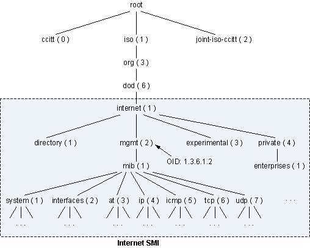
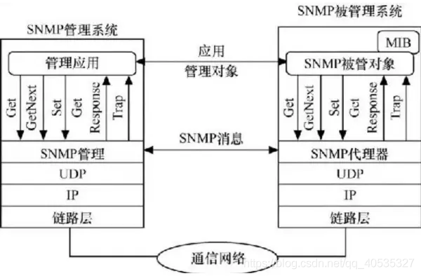

# 网络管理技术

1.  [网络管理概述](#网络管理概述)
2.  [网络管理的体系结构与模式](#网络管理的体系结构与模式)
3.  [网络管理的功能](#网络管理的功能)
4.  [简单网络管理协议](#简单网络管理协议)
5.  [网络管理系统](#网络管理系统)

## 网络管理概述

网络管理的发展历史：

*   网络管理理论和技术是随着计算机、通信等学科的理论和工程技术的发展而发展的。一方面网络管理技术适应了现有网络的管理需求；另一方面，网络的发展又反过来促进了网络管理技术的研究和技术的发展。
*   网络管理的主要任务有两个：一是对网络的状态进行监测；二是对网络的运行进行控制。

网络管理的目标：最大限度地满足网络管理者和网络用户对计算机网络的有效性、可靠性、开放性、综合性、安全性和经济性的要求。

网络管理的对象和标准：

*   网络管理的对象根据对象的形式可以分为两大类：硬件资源和软件资源。
    *   硬件资源是指物理介质、计算机设备和网络互连设备。
    *   软件资源主要包括操作系统、应用软件和通信软件。
*   被管对象的集合称为管理信息库MIB，网络管理系统的实现主要依靠MIB作为基础。

## 网络管理的体系结构与模式

网络管理的体系结构：

*   ISO提出基于远程监控的管理框架是现代网络管理体系结构的核心。
*   在远程监控的管理框架下，OSI参考模型提出以一对相互通信的系统管理实体为核心，使管理进程与一个远程系统相互作用，实现对远程资源进行控制的网络管理系统体系结构。
*   一个完整的网络管理系统主要包括了4部分：网络管理站（或管理进程）、管理代理（或代理）、网络管理协议NMP和管理信息库MIB。
    *   网络管理站和管理代理通过交换管理信息来进行工作，信息分别驻留在被管设备和管理站的管理信息库中，信息交换通过网络管理协议来实现，具体的交换过程是通过协议数据单元进行的。
    *   管理代理具有两个基本功能：一是从管理信息库MIB中读取各种变量值，二是从MIB中修改各种变量值。
    *   最为广泛的网络管理协议是基于TCP/IP模型的简单网络管理协议SNMP和基于OSI模型的公共管理信息服务/公共管理信息协议CMIS/CMIP。其中SNMP应用最多，称为事实上的工业标准。
    *   管理信息库MIB是一个信息存储库，用来存放与被管对象相关的网络信息。MIB中的对象按照层次进行分类和命名，整体表示为一种树形结构。
    *   
        *   MIB以树状结构进行存储，树的叶子节点表示管理对象，它可以通过从根节点开始的一条唯一路径来识别，这也就是OID（Object Identifier）。
        *   OID是由一些系列非负整数组成，用于唯一标识管理对象在MIB树中的位置。由SMI来保证OID不会冲突。
        *   MIB文件一旦发布，OID就和被定义的对象绑定，不能修改。MIB节点不能被删除，只能将它的状态置为“obsolete”，表明该节点已经被废除。
        *   在树形结构中，mgmt对象可以标识为：{ iso(1) org(3) dod(6) internet(1) mgmt(2) }，简单标记为：1.3.6.1.2，这种标识就叫做OID。

网络管理的模式：集中式网络管理模式、分布式网络管理模式和混合管理模式。

*   集中式网络管理模式：目前使用最普遍的一种模式。容易产生拥塞现象、功能固定不灵活。
*   分布式网络管理模式：将管理信息合理地分布在网络各处，使管理变得更加自动化，在最靠近问题源的地方能够做出基本的决策。
*   混合管理模式：是集中式管理模式和分布式管理模式相结合的产物。

## 网络管理的功能

ISO对网络管理功能给出了定义，并被各个网络管理软件制造商所接受，主要包括5个方面的功能：故障管理、配置管理、安全管理、性能管理（性能检测和网络控制）和计费管理。

## 简单网络管理协议

SNMP是一系列网络管理规范的集合，包括SNMP协议、管理信息数据库MIB和管理信息结构SMI共三部分。

*   SNMP协议规定了管理站和代理间交换网络管理信息的报文格式，报文中包含了代理中的对象及其状态。
*   MIB是被管对象的集合。
*   SMI定义了SNMP所用信息的组织、组成和标识，规定了MIB中被管对象的数据类型及其表示和命名方法。

SNMP的基本工作原理：

*   SNMP采用管理站-管理代理模型。
*   
    *   SNMP管理站和管理代理之间的操作主要有Get、Set和Trap。
    *   SNMP为应用层协议，使用传输层的UDP协议传输。
    *   每个代理管理若干对象，并与管理代理建立共同体关系，共同体名是全局标识符，作为认证手段。
    *   代理设备和管理站必须实现TCP/IP协议。

管理信息结构SMI：

*   SMI的主要功能：规定了被管对象的命名法则；所有被管的对象都在对象命名树上；mib-2子树是SNMP网管对象。
*   从树根到树叶的编号串联起来，用“.”分隔，形成被管对象的全局标识。
*   规定了被管对象的数据类型：ASN.1。数据类型分为简单类型（INTEGER，Unsigned，OCTET STRING等）和结构化类型（SEQUENCE等）。
*   规定了被管对象数据的编码方法：采用ASN.1制定的基本编码规则，对被管对象进行数据编码，编码后就可以在网络中传输。
*   
    *   T字段：数据类型。类别段（2bit）+格式段（1bit）+编号码（5bit）。
    *   L字段：表示V字段的长度。当为一个字节时，最高位为0，后7bit表示V字段数据长度。当为多字节时，最高位为1，最后7bit表示后续字节数目。
    *   V字段：数据的取值。

管理信息库MIB：在基于TCP/IP参考模型的管理系统中，包含有关被管理资源及元素信息的数据库，被称为管理信息库MIB。管理信息库保存和维护着可供管理程序读写的控制和状态信息。管理程序通过对MIB中的信息进行读取和重置实现对网络的管理。只有MIB中的对象才能被SNMP协议所管理。

SNMP协议报文：由版本号、首部、安全参数和SNMP报文数据4部分组成。

## 网络管理系统

网络管理系统是实现管理网络功能，保障网络正常运行的软、硬件组成的综合系统。由网络管理系统软件和网络设备组成。

网络管理系统应当具备的特点：具有全面监控网络性能的能力；具有主动和预警管理的功能；支持全网联动；具有对资源进行有效管理的功能；具有服务质量管理功能。
