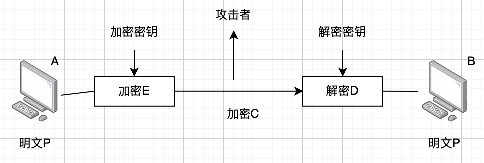
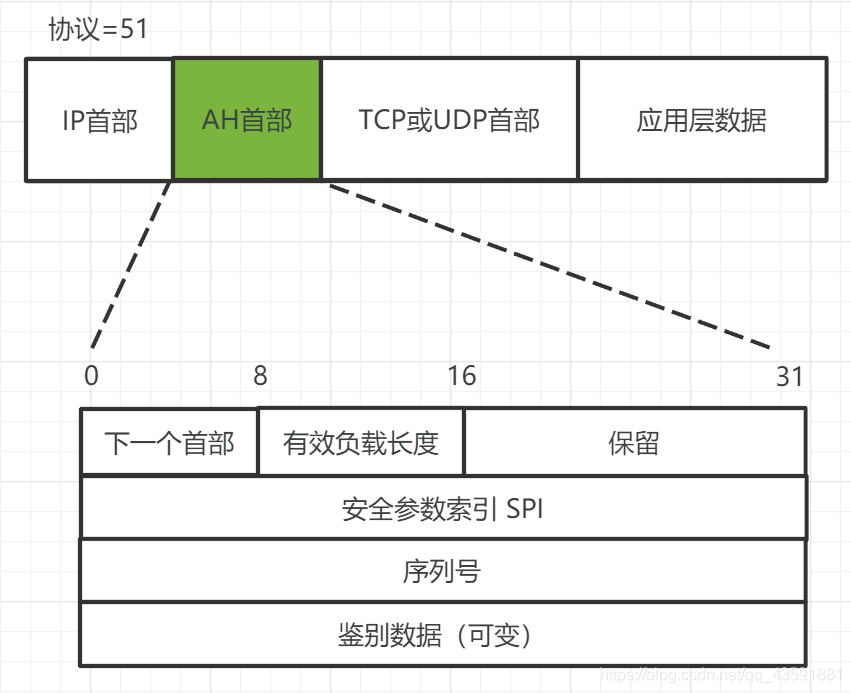
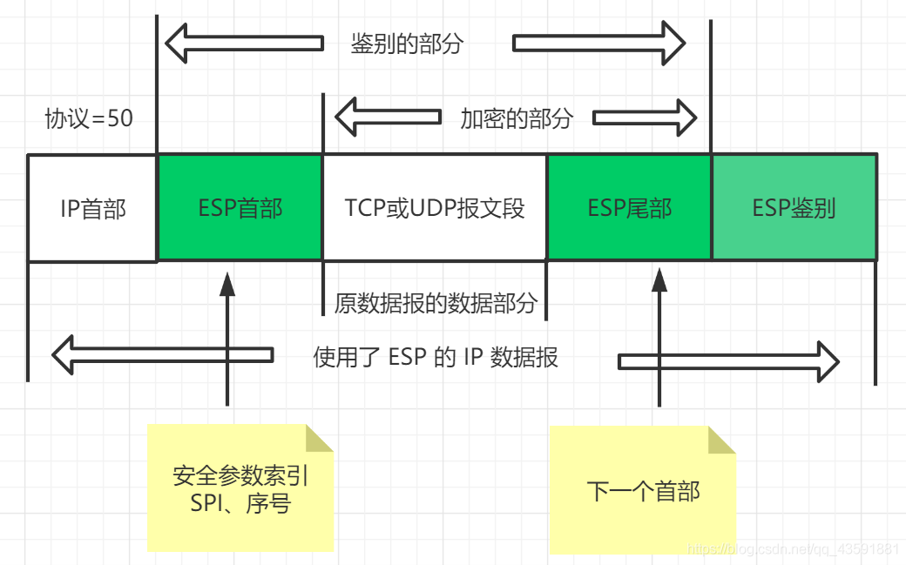

# 计算机网络安全

1.  [计算机网络安全概论](#计算机网络安全概论)
2.  [信息加密技术](#信息加密技术)
3.  [Internet中的安全协议](#internet中的安全协议)
4.  [防火墙技术](#防火墙技术)
5.  [计算机病毒和恶意代码的防范](#计算机病毒和恶意代码的防范)
6.  [保障网络安全的非技术手段](#保障网络安全的非技术手段)

## 计算机网络安全概论

计算机网络面临的威胁：

*   计算机网络实体面临的威胁：计算机设备和网络设备的损坏和故障，都会影响网络的正常运行。
*   计算机网络系统面临的威胁：由于网络本身存在的缺陷，某些用户出于恶意或者非恶意的动机对某个网络系统或其他用户进行入侵、攻击、窃取和篡改等非法和破坏性操作。如窃听、重传、伪造、篡改、非授权访问、拒绝服务攻击、行为否认、电磁截获和人员疏忽等。
*   恶意程序的威胁：恶意程序也称恶意代码，指以危害信息安全等不良意图为目的的程序，它们一般潜伏在受害计算机系统中实施破坏或窃取信息。在计算机网络环境中，恶意程序包括计算机病毒、网络蠕虫、特洛伊木马和逻辑炸弹等类型。

计算机网络安全的基本概念：

*   计算机网络安全是一门涉及计算机科学、通信技术、密码技术、应用数学和信息论等多门类知识的综合性学科。
*   网络安全是指利用管理控制和技术措施，保证在计算机网络环境中，数据信息的机密性、完整性和可用性受到保护。

计算机网络安全的层次及内容：

*   物理安全：计算机网络设备和设施进行安全防护。
*   逻辑安全：对计算机系统的操作，在逻辑上设计和制定行为规则时，要考虑安全因素。
*   操作系统安全：操作系统安全包括用户权限控制和安全漏洞修复。
*   联网安全：通过设置访问控制策略，保护计算机和网络资源不受非授权用户的使用，通过加密、解密和纠错技术保证数据在通信过程中的机密性、完整性和不可抵赖性。

常用的计算机网络安全措施：物理隔离，逻辑隔离（防火墙），加密通信，病毒防御，身份验证等。

## 信息加密技术

信息加密的概念：

*   信息加密是计算机网络安全中一项重要的技术，是利用密码学原理和方法对数据传输提供保护的手段。
*   

密码体制的分类：

*   对称密钥密码体制：指加密密钥和解密密钥相同的密码体制，加密和解密算法是公开的。如DES，IDEA等。
*   非对称密钥密码体制：指加密密钥和解密密钥不同，而且难以从一个推出另一个。每次生成密钥时都生成一对不同的密钥，其中一个是加密密钥，是向公众公开的，称为公钥；另一个是解密密钥，是对公众保密的，称为私钥。加密算法和解密算法也是公开的。如RSA等。

密钥的分配：

*   对称密钥的分配：Kerberos对称密钥分配协议。
*   非对称密钥的分配：PKI公钥基础设施。

信息加密：

*   链路加密：对于网络中两个相邻结点之间传输的数据进行加密保护。
*   结点加密：在网络结点采用不同的密钥对明文进行加密保存。
*   端到端加密：在信息的源点进行加密，在信息的终点进行解密。

数字签名：在计算机网络中传送的文件数据要证明其真实性，需要用到数字签名技术。

## Internet中的安全协议

IPsec协议：

*   IPsec是工作在网络层的安全通信机制。
*   IPsec包含多个协议，IPsec的主要功能是对IP数据报进行加密，确保目的站点收到IP数据报能够确信是从该IP数据报的源IP地址主机发送过来的。
*   IPsec体系设置了两种安全控制机制：鉴别首部（AH）协议和封装安全有效载荷（ESP）协议。
*   工作模式：传输模式（保护IP数据报的上层协议数据）和隧道模式（对整个IP数据包进行保护）。
*   鉴别首部协议（AH）：
    *   鉴别首部协议提供源站点的鉴别和数据完整性服务，不能进行数据加密。AH协议利用报文摘要对IP数据报进行验证，从而使得对IP数据报的篡改可以被检测出来。
    *   
*   封装安全有效载荷协议（ESP）：
    *   
    *   将ESP尾部添加到IP数据报后面，对有效载荷和ESP尾部进行加密。在已经加密的报文部分前面添加ESP首部。按照SA指明的鉴别算法和密钥，对ESP首部、有效载荷和ESP尾部一起进行报文摘要运算，生成报文鉴别码MAC，并将其添加到ESP尾部后面。

安全套接字层协议/传输层安全协议：

*   传输层安全协议-安全套接字层协议SSL和传输层安全协议TLS。
*   提供的安全目标有以下几个方面：借助数字证书认证服务器端和客户端身份，防止身份伪造；借助加密技术，防止第三方窃听；借助消息认证码保证数据完整性，防止被篡改；通过使用隐式序列号防止重放攻击。
*   用户在使用浏览器访问万维网网页时，可以选择使用SSL/TLS安全协议，对HTTP报文进行加密传输。使用后，浏览器地址栏中输入的http会变成“https”，表示http security。
*   SSL/TLS基本思想：采用非对称密钥密码体制。

## 防火墙技术

防火墙的基本概念：

*   防火墙技术是应用最为广泛的一种计算机网络安全技术，其基本思想是将内部网络和外部网络进行有目的的隔离和控制，保护内部网络不受外部网络的攻击。
*   防火墙位于被保护网络或主机与外部网络之间，执行访问控制策略的一组系统，包括硬件和软件，通过控制和监测网络之间的信息交换和访问行为来实现对网络安全的有效管理。

防火墙技术的分类：

*   包过滤技术：通过访问控制列表ACL，对IP数据包进行过滤。
*   代理服务技术：代表客户端处理连接请求的某种程序。
*   状态监测技术：采用抽取通过的数据的方法对网络通信的各个层次进行检测，并且将抽取的状态信息动态的保存起来作为执行安全策略的参考。
*   NAT技术：使得外网中的入侵者不能通过指定IP地址的方式直接对内网中的任何一台特定计算机发起攻击。

## 计算机病毒和恶意代码的防范

计算机病毒指编制或者在计算机程序中插入的破坏计算机功能或者毁坏数据，影响计算机使用，并能自我复制的一组计算机指令或程序代码。

木马或特洛伊木马，一组具有恶意的代码，通过将自身伪装成其他正常软件来吸引用户下载并执行，计算机被植入木马程序后，黑客就可以利用木马的远程控制功能对被植入木马的计算机进行控制和信息窃取。

网络蠕虫，一种可以自我复制的完全独立的程序，传播过程不需要借助被感染主机中的其他程序。网络蠕虫通过利用系统中的安全漏洞和设置缺陷进行自动传播。

病毒防范：安装和使用杀毒软件。

## 保障网络安全的非技术手段

及时安装系统补丁。

及时进行数据备份：本地备份和异地备份。

学习并遵守互联网安全的相关法律法规。
