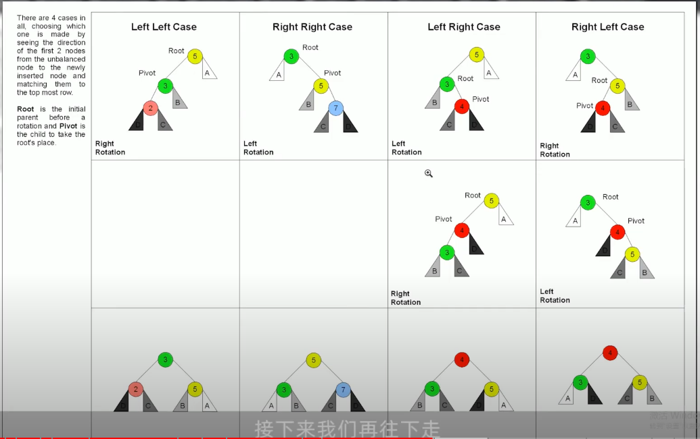
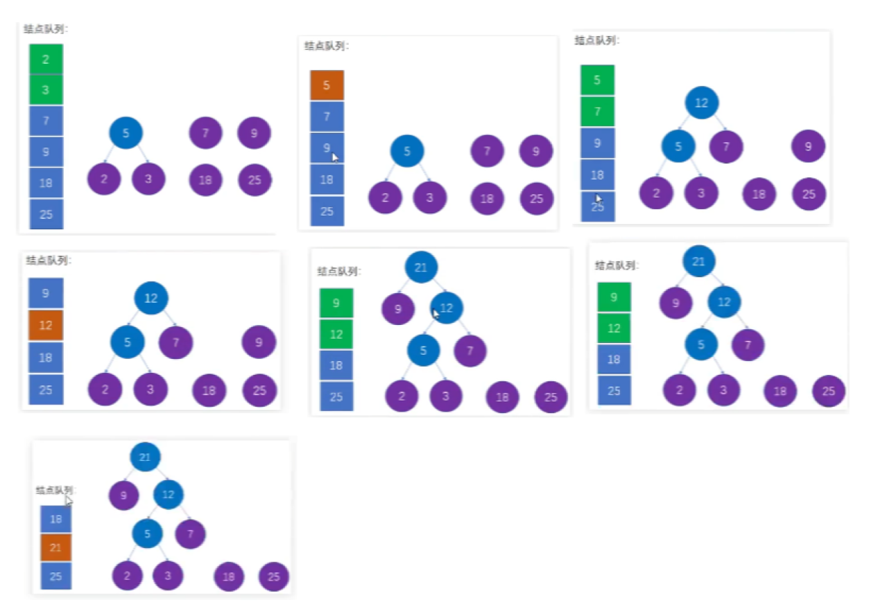
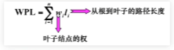
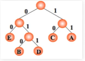

# 树

1.  [树的基本概念](#树的基本概念)
2.  [二叉树的定义及其主要特征](#二叉树的定义及其主要特征)
3.  [二叉树的顺序存储结构和链式存储结构](#二叉树的顺序存储结构和链式存储结构)
4.  [二叉树的遍历](#二叉树的遍历)
5.  [线索二叉树的基本概念和构造](#线索二叉树的基本概念和构造)
6.  [树的存储结构](#树的存储结构)
7.  [树、森林与二叉树的转换](#树森林与二叉树的转换)
8.  [树和森林的遍历](#树和森林的遍历)
9.  [树的应用](#树的应用)

## 树的基本概念

树：

*   树是n个结点的有限集。n=0时称为空树。在任意一棵非空树中：有且仅有一个特定的称为根的结点。当n>1时，其余结点可分为m个互不相交的有限集（T1，T2，...），其中每个集合本身又是一棵树，并且称为根的子树。
*   树中有一个称为根（Root）的特殊结点，用r表示。
*   除了根结点外，每个结点有且仅有一个父结点。
*   一棵N个结点的树有N-1条边。

树结点个数的特性：

*   树中结点为N，则树中各结点的度之和为N-1。
*   假设树的度为4，设度为i(0, 1, 2, 3, 4)的结点个数为Ni，则`N = 1 + N1 + 2N2 + 3N3 + 4N4 = N0 + N1 + N2 + N3 + N4`。

|    树的基本术语    |                                                                             |
| :----------------: | :-------------------------------------------------------------------------: |
| 结点的度（Degree） |                               结点的子树个数                                |
|       树的度       |                          树的所有结点中最大的度数                           |
|       叶节点       |                                 度为0的结点                                 |
|       父结点       |                    有子树的结点是其子树的根结点的父结点                     |
|       子结点       |              若A结点是B结点的父结点，则称B结点是A结点的子结点               |
|      兄弟结点      |                   具有同一父结点的各个结点彼此是兄弟结点                    |
|   路径和路径长度   | 从结点n1到nk的路径为一个结点序列n1, n2, ..., nk，路径所包含的个数为路径长度 |
|      祖先结点      |          沿树根到某一个结点路径上的所有结点都是这个结点的祖先结点           |
|      子孙结点      |                某一个结点的子树中的所有结点是这个结点的子孙                 |
|     结点的层次     |           规定根结点在1层，其他任意结点的层数是其父结点的层数加1            |
|      树的深度      |                   树中所有结点中的最大层次是这棵树的深度                    |

## 二叉树的定义及其主要特征

二叉树：

*   二叉树是一种特殊的树形结构，其特点是每个结点至多只有两棵子树，并且二叉树的子树有左右之分，次序不能颠倒。
*   二叉树是n个结点的有限集合：其或者为空二叉树（n=0），或者由一个根结点和两个互不相交的被称为根的左子树和右子树组成。左子树和右子树又分别是一棵二叉树。
*   二叉树是有序树，若将其左右子树颠倒，则称为另一棵不同的二叉树。即使树中结点只有一棵子树，也要区分左子树还是右子树。

二叉树与度为2的有序树的区别：

*   度为2的树至少有三个结点，而二叉树可以为空。
*   度为2的有序树的孩子结点的左右次序是相对于另一个孩子结点而言，若某个结点只有一个孩子结点，则这个孩子结点无需分左右。但二叉树左右孩子是确定的。

几个特殊的二叉树：

*   满二叉树：
    *   一棵高度为h，且含有2<sup>h</sup>-1个结点的二叉树称为满二叉树。
    *   满二叉树的叶子结点都集中在二叉树的最下层，并且除叶子结点之外的每个结点度数均为2。自上而下，自左至右对满二叉树编号，对于编号为i的结点，若有双亲，其双亲为(i/2)，若有左孩子，则左孩子为2i；若有右孩子，则右孩子为2i+1。
*   完全二叉树：
    *   设一个高度为h，有n个结点的二叉树，当且仅当其每个结点都与高度为h的满二叉树中编号为1～n的结点一一对应时，称为完全二叉树。
    *   如下特点：
        *   若i<(n/2)，则结点i为分支结点，否则为叶子结点。
        *   叶子结点只可能在层次最大的两层上出现。对于最大层次中的叶子结点，都依次排序在该层最左边的位置上。
        *   若有度为1的结点，则只可能有一个，且该结点只有左孩子而无右孩子。
        *   按层序编号后，一旦出现某结点（编号为i）为叶子结点或只有左孩子，则编号大于i的结点均为叶子结点。
        *   若n为奇数，则每个分支结点都有左孩子和右孩子。若n为偶数，则编号最大的分支结点只有左孩子，没有右孩子，其余分支结点左孩子右孩子都有。
*   二叉排序树：一棵二叉树或者空二叉树，或者是具有如下性质的二叉树：左子树上所有结点的关键字均小于根结点的关键字；右子树上的所有结点的关键字均大于根结点的关键字。左子树和右子树又各是一棵二叉排序树。
*   平衡二叉树：树上任一结点的左子树和右子树深度之差不超过1。
*   红黑树：红黑树是一种自平衡二叉查找树。

## 二叉树的顺序存储结构和链式存储结构

二叉树的存储结构有两种，分别是顺序存储和链式存储。

二叉树的存储结构，指的是使用顺序表（数组）存储二叉树。需要注意的是，顺序存储只适用于完全二叉树。

二叉树的链式存储，利用指针我们便可以完美存储非完全二叉树。

```c
typedef ElemType SqBinTree[MaxSize];
```

```c
typedef struct TNode {
  ElemType data;
  struct TNode *lchild, rchild;
} *LinkBinTree;
```

## 二叉树的遍历

二叉树的遍历是指二叉树的根结点出发，按照某种次序依次访问二叉树中所有结点，使得每个结点被访问一次，且仅被访问一次。

二叉树的访问次序可以分为四种：

*   先序遍历：根 - 左 - 右。
*   中序遍历：左 - 根 - 右。
*   后序遍历：左 - 右 - 根。
*   层序遍历：一层一层访问。

仅仅通过一种遍历方式所得的序列无法确定二叉树。通过两种遍历方式，必须是先序和中序或中序和后序得到的序列，才能确定二叉树。

## 线索二叉树的基本概念和构造

线索化：

*   现将某结点的空指针域指向该结点的前驱后继，定义如下规则：
    *   若结点的左子树为空，则该结点的左孩子指针指向其前驱结点。
    *   若结点的右子树为空，则该结点的右孩子指针指向其后继结点。
*   这种指向前驱和后继的指针称为线索。将一棵普通的二叉树以某种次序遍历，并添加线索的过程称为线索化。

线索化带来的问题：如何区分左指针是指向左孩子还是前驱结点？（中序遍历）

*   设置标志，如果tag为0，则指向左孩子；如果tag为1，则指向前驱结点。

```c
typedef enum PointerTag { Link, Thread };
typedef struct ThrBinNode {
  ElemType data;
  struct ThrBinNode *lchild, *rchild;
  enum PonterTag ltag, rtag;
} *ThrBinTree;
```

带头结点的线索二叉树（只针对中序遍历）：

*   头结点左指针指向根结点，头结点右指针指向中序遍历的最后一个结点。
*   线索化后，第一个结点的左孩子指针指向头结点，最后一个结点的右孩子指针指向头结点。

## 树的存储结构

双亲表示法：

*   推荐顺序存储。根结点的parent为-1，除根结点外的所有结点的parent为双亲结点的下标。
*   从下找上简单，从上找下复杂。

```c
#define MAX_TREE_SIZE 100
typedef struct PTNode {
  ElemType data;
  int parent;
} PTNode;
typedef struct {
  PTNode nodes[MAX_TREE_SIZE];
  int root;
  int size;
} PTree;
```

孩子表示法：由于每个结点可能有多个子树（无法确定子树个数），可以考虑使用多重链表实现。

```c
#define MAX_TREE_SIZE 100
#define MAX_NODE_SIZE 10
typedef struct CTNode {
  ElemType data;
  int childs[MAX_NODE_SIZE];
} CTNode;
typedef struct {
  CTNode nodes[MAX_TREE_SIZE];
  int root;
  int size;
} CTree;
```

孩子兄弟表示法：

```c
typedef struct CSTNode {
  ElemType data;
  struct CSTNode *child, *sib;
} CSTree;
```

## 树、森林与二叉树的转换

树转换为二叉树：

*   加线。在所有兄弟结点之间加一条连线。
*   去线。树中的每个结点，只保留它与第一个孩子结点的连线，删除它与其他孩子结点之间的连线。
*   层次调整。以树的根结点为轴心，将整棵树顺时针旋转一定角度，使之层次分明。

森林转换为二叉树：

*   把每棵树转换为二叉树。
*   第一棵二叉树不动，从第二课二叉树开始，依次把后一棵二叉树的根结点作为前一棵二叉树的根结点的右孩子，用线连接起来。

二叉树转换为树：

*   加线。若某结点X的左孩子结点Y存在，则将这个Y的右孩子结点、Y的右孩子的右孩子结点、Y的右孩子的右孩子的右孩子结点...，都作为结点X的孩子。将结点X与这些右孩子结点用线连接起来。
*   去线。删除原二叉树中所有结点与其右孩子结点的连线。
*   层次调整。以树的根结点为轴心，将整棵树逆时针旋转一定角度，使之层次分明。

二叉树转换为森林：

*   从根结点开始，若右孩子存在，则把与右孩子结点的连线删除。在查看分离后的二叉树，若其根结点的右孩子存在，则连线删除...。直到所有这些根结点与右孩子的连线都删除为止。
*   将每棵分离后的二叉树转换为树。

## 树和森林的遍历

树的遍历：

*   先根遍历：
    *   若树非空，则先访问根结点，在按照从左到右的顺序遍历根结点的每一棵子树。
    *   这个访问次序与这棵树对应的二叉树的先序遍历顺序相同。
*   后根遍历：
    *   若树非空，则按照从左到右的顺序遍历根结点的每一棵子树，之后再访问根结点。
    *   这个访问次序与这棵树对应的二叉树的中序遍历顺序相同。

森林的遍历：

*   先序遍历：依次先根遍历每一棵树。
*   中序遍历：将森林化为二叉树后，对二叉树的中序遍历。
*   后序遍历：依次后根遍历每一棵树。

## 树的应用

并查集：双亲表示法。

二叉排序树：

*   二叉排序树（binary sort tree），又称二叉查找树（binary search tree），也称二叉搜索树。
*   二叉排序树可以是一棵空树，或者具有下列性质：
    *   若左子树不空，则左子树上所有结点的值均小于（或等于）它的根结点的值。
    *   若左子树不空，则右子树上所有结点的值均大于（或等于）它的根结点的值。
    *   左、右子树也分别为二叉排序树。

平衡二叉树：

*   平衡树也加AVL树，它或者是一棵空树，或者具有以下性质的二叉排序树：
    *   它的左子树和右子树的高度之差（平衡因子）的绝对值不超过1。
    *   它的左子树和右子树也是平衡二叉树。
*   平衡因子的绝对值大于1：
    *   左左型，右右型，左右型，右左型。
    *   

哈夫曼树（Huffman Tree）和哈夫曼编码：

*   树的带权路径长度（WPL）：权重 x 路径长度。
*   哈夫曼树：在叶子结点和权重确定的情况下，带权路径长度最小的二叉树，又被称为最优二叉树。
    *   
*   同样叶子结点所构成的哈夫曼树可能不止一个。
*   哈夫曼编码：
    *   哈夫曼树的应用很广，哈夫曼编码就是其在电讯通信中的应用之一。
    *   
    *   
