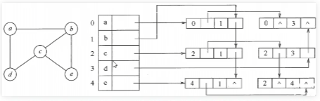
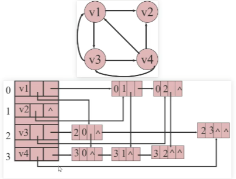
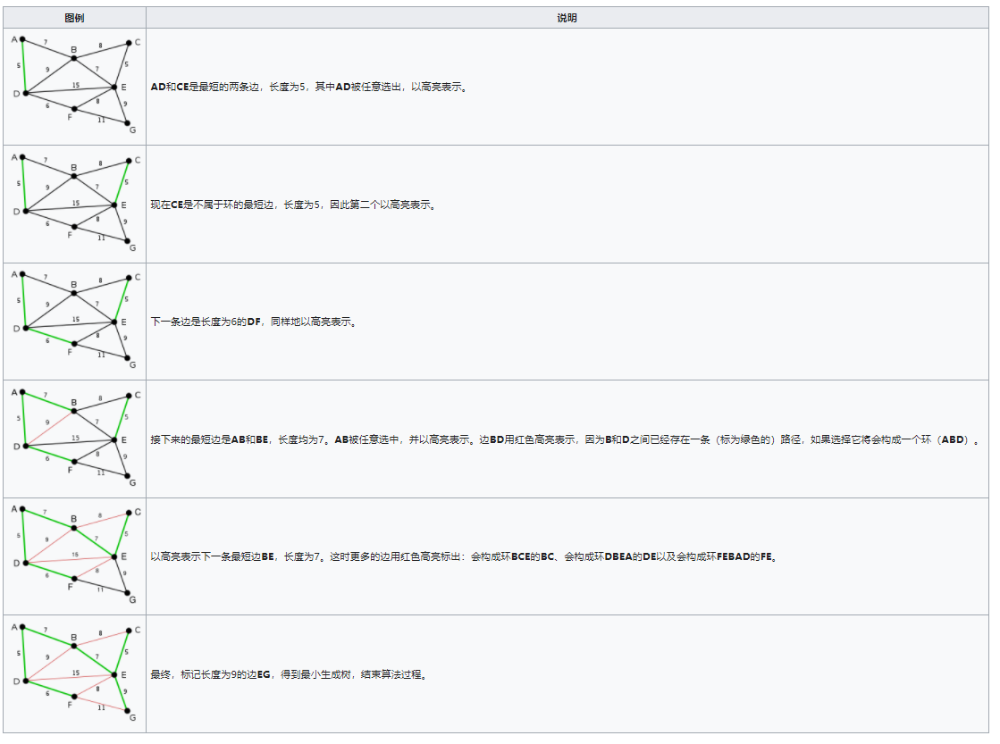
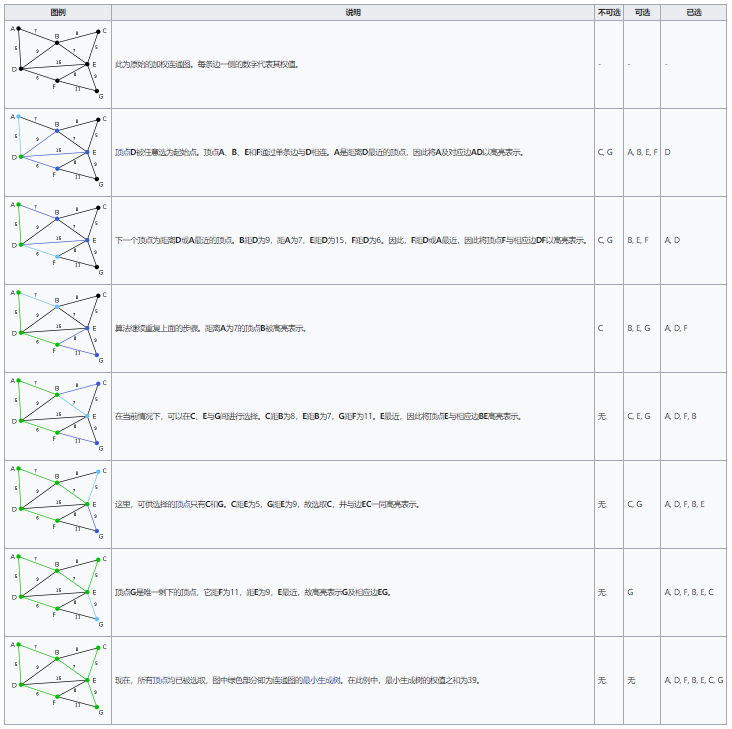

# 图

1.  [图的基本概念](#图的基本概念)
2.  [图的存储](#图的存储)
3.  [图的遍历](#图的遍历)
4.  [最小生成树](#最小生成树)
5.  [最短路径算法](#最短路径算法)
6.  [拓扑排序](#拓扑排序)
7.  [关键路径](#关键路径)

## 图的基本概念

顶点（vertex）：表示某个事物或对象。由于图的术语没有标准化，因此，称顶点为点、节点、结点、端点等都是可以的。

边（edge）：表示事物与事物之间的关系。

同构（Isomorphism）：在图中，顶点和边指的是事物和事物的逻辑关系。当两个图中的所有的顶点和边都能一一对应时，称两个图同构，也就是一个相同的图。

有向/无向图（Directed Graph/Undirected Graph）：

*   有向/无向图是一种数据结构，用来表示对象之间的连接关系。
*   有向图是指图中的边有方向，用箭头表示。
*   无向图是指图中的边没有方向，用线段表示。

权重（weight）：边的权重，即每条边都有与之对应的值。

路径/最短路径（path/shortest path）：

*   路径是指从一个顶点到另一个顶点经过的一系列边。
*   最短路径是指路径中边的权值之和最小的路径。

环（loop）：在路径的终点添加一条指向起点的边，就构成了一条环路。

连通图/连通分量（connected graph/connected component）：

*   连通图：图中任意两个顶点之间都存在路径。
*   连通子图：图中某一部分的任意两个顶点之间都存在路径，那么这一部分称为连通子图。
*   连通分量：图的最大连通子图。
*   连通网：在连通图中，若图的边具有一定的意义，每一条边都对应着一个数，称为权，则这样的连通图称为连通网。

有向图/无向图的度数：

*   对于无向图：每个顶点的度数就是它的连接边的数量。
*   对于有向图：入度，就是有向图中某个顶点作为终点的次数和；出度，就是有向图中某个顶点作为起点的次数和。

简单图：不存在重复边，不存在顶点到自身的边，则称改图为简单图。

多重图：图中两个结点之间的边数多于一条，又允许顶点通过同一条边和自己关联，则该图为多重图。多重图的定义和简单图是相对的。

完全图（也称完全简单图）：

*   对于无向图：|E|的取值范围是0到n(n-1)/2，有n(n-1)/2条边的无向图称为完全图，在完全图中任意两个顶点之间都存在边。
*   对于有向图：|E|的取值范围是0到n(n-1)，有n(n-1)条边的有向图称为完全图，在完全图中任意两个顶点之间都存在边。

强连通图/强连通分量（针对有向图）：

*   强连通：有向图中，若从顶点v到顶点w和从顶点w到顶点v之间都有路径，则称这两个顶点是强连通的。
*   强连通图：若有向图中任意一对顶点都是强连通的，则称此图为强连通图。
*   强连通分量：有向图的最大强连通子图称为有向图的强连通分量。

稠密图和稀疏图：边数很少的图是稀疏图，反之称为稠密图。稀疏图和稠密图本身是模糊的概念。

距离：从顶点v到顶点w的最短路径若存在，则此路径的长度称为v到w的路径。

有向树：一个顶点的入度为0、其余顶点的入度为1的有向图，称为有向树。

## 图的存储

邻接矩阵：

```c
#define MAX_SIZE 100
typedef struct {
  ElemType vertex[MAX_SIZE];
  int arc[MAX_SIZE][MAX_SIZE];
  int vertex_num;
  int arc_num;
} MGraph;
```

邻接表：

```c
#define MAX_SIZE 100
typedef struct ArcNode {
  int adjvex;
  struct ArcNode *next;
} ArcNode;
typedef struct VertexNode {
  ElemType vertex;
  ArcNode *first_edge;
} VertexNode;
typedef struct {
  VertexNode adjlist[MAX_SIZE];
  int vertex_num;
  int arc_num;
} ALGraph;
```

邻接矩阵和邻接表的区别：对于稀疏图，使用邻接表；对于稠密图，使用邻接矩阵。

对于无向图和有向图，邻接表都存在缺陷，所以产生了邻接多重表和十字链表：

*   邻接多重表：
    *   针对无向图。
    *   如果用邻接表存储无向图，每条边的两个结点分别在以改边所依附的两个顶点为头结点的链表中，这给图的某些操作带来不便。例如，对已访问过的边做标记，或者要删除图中某一条边等，都需要找到表示同一条边的两个结点。
    *   

    ```c
    #define MAX_SIZE 100
    typedef enum {unvisited, visited} VisitIf;
    typedef struct EdgeBox {
      VisitIf mark;
      int ivex, jvex;
      struct EdgeBox *ilink, *jlink;
      InfoType *info;
    } EdgeBox;
    typedef struct VertexBox {
      ElemType data;
      EdgeBox *firstedge;
    } VertexBox;
    typedef struct {
      VertexBox adjmulist[MAX_SIZE];
      int vertex_num;
      int arc_num;
    } AMLGraph;
    ```

*   十字链表：
    *   针对有向图。
    *   如果用邻接表存储有向图，出度问题好解决，入度的问题就要遍历整个图才能知道。反之，逆邻接表解决了入度的情况。把邻接表和逆邻接表结合起来，即有向图的一种存储方法十字链表。
    *   

    ```c
    #define MAX_SIZE 100
    typedef struct ArcBox {
      int tailvex, headvex;
      struct ArcBox *hlink, *tlink;
      InfoType *info;
    } ArcBox;
    typedef struct VertexNode {
      ElemType data;
      ArcBox *firstin, *firstout;
    } VertexNode;
    typedef struct {
      VertexNode olist[MAX_SIZE];
      int vertex_num;
      int arc_num;
    } OLGraph;
    ```

## 图的遍历

深度优先搜索（Depth First Search）：

*   首先以一个未被访问过的顶点作为起始顶点，沿当前顶点的边走到未访问过的顶点。
*   当没有未访问过的顶点时，则回到上一个顶点，继续试探别的顶点，直至所有的顶点都被访问过。

广度优先搜索（Breadth First Search）：类似树的层序遍历。

## 最小生成树

生成树：一个连通图的生成树是指一个连通子图，它含有图中全部n个顶点，但只有足以构成一棵树的n-1条边。一颗有n个顶点的生成树有且仅有n-1条边，如果生成树中在添加一条边，则必定成环。

最小生成树：

*   在连通图的所有生成树中，所有边的权值的总和最小的生成树，称为最小生成树。
*   算法：
    *   最小生成树算法很多，都是用MST性质（假设N=(V, {E})是一个连通网，U是顶点集V的一个非空子集，如果(u, v)是一条具有最小权值的边，其中u属于U，v属于V，则必定存在一棵包含边(u, v)的最小生成树）。
    *   克鲁斯卡尔（Kruskal）算法：
        *   原图为G1，新建图G2，G2中拥有原图G1中相同的节点，但没有边。
        *   将原图G1中所有的边按权值从小到大排序。
        *   从权值最小的边开始，如果这条边连接的两个节点于图G2中不在一个连通分量中，则添加这条边到图G2中。
        *   重复上一步，直至图G2中所有的结点都在同一个连通分量中。
    *   
    *   普里姆（Prim）算法：
        *   输入：一个加权连通图，其中顶点集合为V，边集合为E。
        *   初始化：V<sub>new</sub> = {x}，其中x为集合V中任意结点，E<sub>new</sub> = {}。
        *   重复下列步骤：直到V<sub>new</sub> = V：
            *   在集合E中选取权值最小的(u, v)，其中u为集合V<sub>new</sub>中的元素，而v则是V中没有加入V<sub>new</sub>的顶点。
            *   将v加入集合V<sub>new</sub>中，将(u, v)加入集合E<sub>new</sub>中。
        *   输出：使用集合V<sub>new</sub>和E<sub>new</sub>来描述所得的最小生成树。
    *   

## 最短路径算法

最短路径算法：图中求两点（或多点）之间的最短路径。

*   戴克斯特拉（Dijkstra）算法：只能用于边权为正的图中，时间复杂度为O(n<sup>2</sup>)。
    *   设G=(V, E)是一个带权的连通图，把图中顶点的集合V分成两组，第一组为已求出最短路径的顶点集合（用S表示），第二组为其余未确定最短路径的顶点集合（用U表示）。
    *   初始时，S中只包含起点s，U包含除s以外的其余顶点，且U中顶点的距离为起点s到该顶点的距离。
    *   从U中选出距离最短的顶点k，并将顶点k加入到S中，同时从U中移除顶点k。
    *   更新U中各个顶点到起点s的距离，取(s, v)和(s, k) + (k, v)中的较小者。
    *   重复上面两部，直到遍历完所有顶点。
*   
*   弗洛伊德（Floyd）算法：可以用于有负边权的图，如果图中有负环，算法也可以检测出来，可以求任意点的最短路径，有向图和无向图的最小环和最大环，时间复杂度为O(n<sup>3</sup>)。
*   
*   贝尔曼-福特（Bellman-ford）算法：可以用于有负边权的图，如果图中有负环，算法也可以检测出来，时间复杂度为O(VE)。

```伪代码
// floyd algorithm
for (k = 0; k < G.vex_num; k++) {
  for (i = 0; i < G.vex_num; i++) {
    for (j = 0; j < G.vex_num; j++) {
      tmp = (dist[i][k] == INF || dist[k][j] == INF) ? INF : (dist[i][k] + dist[k][j]);
      if (dist[i][j] > tmp) {
        dist[i][j] = tmp;
        path[i][j] = k;
      }
    }
  }
}
```

## 拓扑排序

有向无环图：如果一个有向图不存在环，也就是任意结点都无法通过一些有向边回到自身，那么称这个有向图为有向无环图。

AOV网络：在有向图中，用顶点表示活动，用有向边<vi, vj>表示活动i是活动j的必须条件。这种有向图称为用顶点表示活动的网络，称为Activity on Vertex Network。

拓扑排序：检测有向图是否有环可以通过对AOV网络进行拓扑排序，该过程将各个顶点排列成一个线性有序的序列，使得AOV网络中所有前驱和后继的关系都能得到满足。

*   算法描述（针对有向无环图）：
    *   统计所有结点的入度，对于入度为0的结点就可以分离出来，然后把这个结点指向所有的结点的入度-1。
    *   重复上一步，直到所有的结点都被分离出来，拓扑排序结束。
    *   如果最后不存在入度为0的结点，那就说明有环，无解。

## 关键路径

AOE网络：用边表示活动的网络，是个带权有向图，Activity on Edge Network。

关键路径：从起点到终点具有最长路径，在关键路径上的活动称为关键活动。也就是AOE网中权值和最大的路径。在AOE网中关键路径可能有多条。

发生时间（对于<i, j>）：

*   事件的最早发生时间：`t[j] = max(t[i1] + t[<i1, j>], t[i2] + t[<i2, j>])`。
*   事件的最迟发生时间：`t[i] = min(t[j1] - t[<i, j1>], t[j2] - t[<i, j2>])`。
*   活动的最早发生时间：`t'[<i, j>] = t[i]`。
*   活动的最迟发生时间：`t'[<i, j>] = t[j] - t[<i, j>]`。
