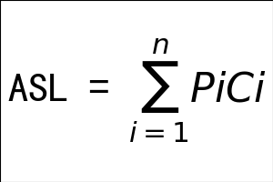

# 算法

1.  [查找](#查找)
2.  [排序](#排序)

## 查找

查找（Searching）：就是在由一组记录组成的集合中寻找关键字值等于给定值的某个记录，或是寻找属性值符合特定条件的某些记录。

查找表（Search Table）：是一种以同一类型的记录构成的集合为逻辑结构，以查找为核心运算的数据结构。

查找表的分类：

*   静态查找表（Static Search Table）：只做查找操作的查找表。
    *   顺序查找。
    *   二分查找。
    *   插值查找。
    *   斐波那契查找。
    *   线性索引查找。
*   动态查找表（Dynamic Search Table）：动态表的特点是表结构本身是在查找过程中动态生成的。同时在查找过程中同时插入查找表中不存在的数据元素，或者从查找表中删除已经存在的某个数据元素。
    *   二叉排序树。
    *   平衡二叉树。
    *   B树。
    *   三列表。

平均查找长度（ASL）：在查找的过程中，一次查找的长度是指需要比较的关键字的次数，而平均查找长度则是所有查找过程中进行关键字的比较的次数的平均值。



顺序查找：从第一个元素开始，按索引顺序遍历待查找序列，直到查找出给定目标或者查找失败。

分块查找：也叫索引顺序查找，算法实现除了需要查找表本身之外，还需要根据查找表建立一个索引值。

二分查找：也称折半查找，该算法的使用的前提是静态查找表中的数据必须是有序的。

```c
int BinarySearch(int arr[], int len, int k) {
  int low = 0, mid, high = len - 1;
  while (low <= high) {
    mid = (low + high) / 2;
    if (arr[mid] == key)
      return mid;
    else if (arr[mid] > key)
      high = mid - 1;
    else
      low = mid + 1;
  }
  return -1;
}
```

B/B+树：两种多路平衡查找树，常用于数据库和文件系统的索引。B树和B+树的区别主要有以下几点：

*   B树的每个节点都存储了键值和数据，而B+树的非叶子节点只存储了键值，数据都存储在叶子节点中。
*   B树的每个节点的子节点数目等于该节点的键值数目，而B+树的每个节点的子节点数目等于该节点的键值数目加一。
*   B树的叶子节点之间没有连接，而B+树的叶子节点之间有指针连接，形成一个有序链表。
*   B树可以在非叶子节点结束查找，而B+树只能在叶子节点结束查找。

哈希表（Hash Table）：

*   根据关键码值（Key Value）而直接进行访问的数据结构。
*   不能够保证每一个元素的关键字与函数值一一对应，会产生冲突。
*   哈希函数构造方法：
    *   直接定址法。
    *   数字分析法。
    *   平方取中法。
    *   除留余数法。
*   处理哈希冲突的方法：
    *   开放定址法。
    *   拉链法。

## 排序


用于排序算法的交换函数和比较函数：

```c
void Swap(int *a, int *b) {
  int temp = *a;
  *a = *b;
  *b = temp;
}

int Min(int x, int y) {
  return x < y ? x : y;
}
```

冒泡排序：

```c
void BubbleSort(int arr[], int len) {
  for (int i = 0; i < len - 1; i++) {
    for (int j = 0; j < len - 1 - i; j++) {
      if (arr[j] > arr[j + 1]) {
        Swap(&arr[j], &arr[j + 1])
      }
    }
  }
}
```

选择排序：

```c
void SelectionSort(int arr[], int len) {
  for (int i = 0; i < len - 1; i++) {
    int min = i;
    for (int j = i + 1; i < len; j++) {
      if (arr[j] < arr[min]) {
        min = j;
      }
    }
    Swap(&arr[i], &arr[min]);
  }
}
```

插入排序：

```c
void InsertionSort(int arr[], int len) {
  for (int i = 1; i < len; i++) {
    key = arr[i];
    int j = i - 1;
    while ((j > 0) && (arr[j] > key)) {
      arr[j + 1] = arr[j];
      j--;
    }
    arr[j + 1] = key;
  }
}
```

希尔排序：

```c
void ShellSort(int arr[], int len) {
  for (int gap = len >> 1; gap > 0; gap >>= 1) {
    for (int i = gap; i < len; i++) {
      int temp = arr[i];
      for (int j = i - gap; j >= 0 && arr[j] > temp; j -= gap) {
        arr[j + gap] = arr[j];
      }
      arr[j + gap] = temp;
    }
  }
}
```

归并排序：

```c
void MergeSort(int arr[], int len) {
  int *a = arr;
  int *b = (int *)malloc(len * sizeof(int));
  for (int seg = 1; sen < len; seg += seg) {
    for (int start = 0; start < len; start += seg * 2) {
      int low = start, mid = min(start + seg, len), high = min(start + seg * 2, len);
      int k = low;
      int start1 = low, end1 = mid;
      int start2 = mid, end2 = high;
      while (start1 < end1 && start2 < end2)
        b[k++] = a[start1] < a[start2] ? a[start1++] : a[start2++];
      while (start1 < end1)
        b[k++] = a[start1++];
      while (start2 < end2)
        b[k++] = a[start2++];
    }
    int *temp = a;
    a = b;
    b = temp;
  }
  if (a != arr) {
    for (int i = 0; i< len; i++)
      b[i] = a[i];
    b = a;
  }
  free(b);
}
```

快速排序：

```c
int Partition(int arr[], int low, int high) {
  int pivot = arr[low];
  while (low < high) {
    while (low < high && arr[high] >= pivot) {
      --high;
    }
    arr[low] = arr[high];
    while (low < high && arr[low] <= pivot) {
      ++low;
    }
    arr[high] = arr[low];
  }
  arr[low] = pivot;
  return low;
}

void QuickSort(int arr[], int low, int high) {
  if (low < high) {
    int pivot = Partition(arr, low, high);
    QuickSort(arr, low, pivot - 1);
    QuickSort(arr, pivot + 1, high);
  }
}
```

堆排序：

```c
void MaxHeapify(int arr[], int start, int end) {
  int dad = start;
  int son = dad * 2 + 1;
  while (son <= end) {
    if (son + 1 <= end && arr[son] < arr[son + 1])
      son++;
    if (arr[dad] > arr[son])
      return;
    else {
      swap(&arr[dad], &arr[son]);
      dad = son;
      son = dad * 2 + 1;
    }
  }
}

void HeapSort(int arr[], int len) {
  for (int i = len / 2 - 1; i >= 0; i--)
    MaxHeapify(arr, i, len - 1);
  for (int i = len - 1; i > 0; i--) {
    Swap(&a[0], &a[i]);
    MaxHeapify(arr, 0, i - 1);
  }
}
```

计数排序：每个桶只存储单一键值。

```c
#define MAX_SIZE 100
void CountingSort(int ini_arr[], int sorted_arr[], int n) {
  int *count_arr = (int *)malloc(sizeof(int) * MAX_SIZE);
  for (int k = 0; k < MAX_SIZE; k++) {
    count_arr[k] = 0;
  }
  for (int i = 0; i < n; i++) {
    count_arr[ini_arr[i]]++;
  }
  for (int k = 1; k < 100; k++) {
    count_arr[k] += count_arr[k - 1];
  }
  for (int j = n; j > 0; j--) {
    sorted_arr[--count_arr[ini_arr[j - 1]]] = ini_arr[j - 1];
  }
  free(sorted_arr);
}
```

桶排序：每个桶存储一定范围的数值。

基数排序：根据键值的每位数字来分配桶。
