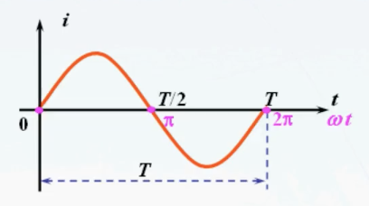
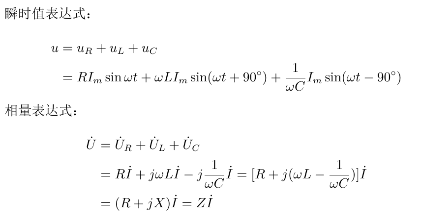

# 电路分析基础

*   

1.  [电路的基本概念](#电路的基本概念)
2.  [电阻、电感和电容](#电阻电感和电容)
3.  [电源元件](#电源元件)
4.  [串联电路和并联电路](#串联电路与并联电路)
5.  [直流电路分析与计算](#直流电路分析与计算)
6.  [正弦交流电路](#正弦交流电路)

## 电路的基本概念

电路和电路模型：

*   电路：为了某种需要由若干电工设备或元件按一定方式组成的总体，是电流的通路。
*   电路一般由电源、负载及中间环节三部分组成。
*   电路的作用：实现电能的输送和变换；实现信号的传递和处理。
*   电路模型：我们需将实际元件理想化（或称为模型化），即在一定条件下突出其主要的电磁性质，忽略其次要的因素，把它近似地看作理想电路元件。因此，理想电路元件也就是具有某种确定的电磁性质的假想元件，它是一种理想化的模型并具有精确的数学定义。
*   理想电路元件包括理想无源元件和理想有源元件。前者包括理想电阻、理想电感和理想电容元件；后者包括理想独立电源和理想受控电源元件。这些元件分别由相应的符号和参数来表证。

直流电与交流电：

*   直流电：把方向不随时间变化的电压（或电流）都称为直流电压（或电流）。如果电压（或电流）的大小和方向都不随时间变化，则称为恒定直流电压（或电流）。仅是大小变化而方向不改变的电压（或电流），则称为脉动直流电压（或电流）。
*   交流电：指大小和方向都随时间变化的电压或电流。随时间按正弦规律变化的电压和电流称为正弦交流电。通常所说的交流电也就指的是正弦交流电。

模拟信号与数字信号：

*   现代电子技术是由模拟电子技术和数字电子技术两大部分组成的。
*   模拟信号：随时间连续变化的电压或电流信号，如正弦信号就是一种最为典型的模拟信号。
*   模拟电路：处理模拟信号的电子线路。
*   数字信号：随时间断续变化的电压或电流信号，如方波信号就是一种最为典型的数字信号。
*   数字电路：处理数字信号的电子线路。
*   在实际电路中，模拟电路与数字电路往往密不可分，如我们常用的555定时器电路就是模拟与数字混合的集成电路产品。

电路的基本物理量及其参考方向：

*   电流及其参考方向：
    *   电流表明了电荷在单位时间内通过导体的数量。

        

    *   在国际单位制中，Q为电荷量，其单位为库仑（C）；t为时间，其单位为秒（s）；I是电流，其单位为安培，简称安（A）。
    *   电流的参考方向：任意假定。
    *   所选的电流参考方向并不一定与实际方向相同。如果相同，这时电流的值为正，否则为负；只有当参考方向选定以后，电流才可称为一个代数量，这时讨论电流的正负才有意义，而后根据电流的正负就可以确定电流的实际方向。
*   电压、电动势及其参考方向：
    *   电压表明了电场力对电荷做功的能力。

        

    *   在国际单位制中，W为电势能（能量），其单位为焦耳（J）；Q为电荷量，其单位为库仑（C）；U是电压，其单位为伏特，简称伏（V）。
    *   规定电场力对单位正电荷从电场内的a点移动到无限远处所做的功称为a点的电位Va，因为在无限远处的电场为零，故其电位也为零。可见，a、b两点间的电压也就是a、b两点间的电位差。

        

    *   电动势E用来衡量电源力（非电场力）对电荷做功的能力，在电源力的作用下，电源不断地把其他形式的能量转换为电能以维持电路的持续工作。
    *   电压的实际方向：由高电位端指向低电位端。电动势的实际方向：由低电位端指向高电位端。
    *   电压的参考方向：任意假定。
*   关联参考方向：
    *   在电路分析中，对一个元件既要假设通过它的电流参考方向，又要假设它两端的电压参考极性（参考方向），两个都可任意假定，而且独立无关。
    *   为方便起见，引入关联参考方向，即电流由高电位流向低电位。这样电流参考方向与电压参考极性一致。
    *   
*   功率和能量：
    *   在dt时间内由a点转移到b点的正电荷为dq，且由a到b为电压降u，失去的能量dw满足下述表达式。

        

    *   %3Dfrac%7Bdw%7D%7Bdt%7D%3Dfrac%7Bdw%7D%7Bdq%7Dcdotfrac%7Bdq%7D%7Bdt%7D%3Dutimesi%24.png)
    *   当电压和电流是关联方向时：P(t)>0吸收功率（消耗功率），P(t)<0放出功率（提供功率）；当电压和电流是非关联方向时：P(t)<0吸收功率（消耗功率），P(t)>0放出功率（提供功率）。
    *   若电压的单位为伏特（V），电流的单位为安培（A），则功率的单位为瓦特（W）。
    *   
    *   对于发电设备（电源）来说，功率是单位时间内所产生的电能；对于用电设备（负载）来说，功率是单位时间内所消耗的电能。
    *   若功率的单位为瓦特（W），时间的单位为秒（s），则电能的单位是焦耳（J）。
*   电路基本物理量的额定值：
    *   额定值是设计和制造单位为了使产品在给定的工作条件下正常运行而规定的正常允许值，是对产品的使用规定。只有按照额定值使用的电器设备才能保证该设备安全可靠、经济合理地运行。
    *   额定值通常以下标N表示，如额定电流IN、额定电压UN、额定功率PN等等。

电路中产生电压的过程：

*   从源头来说是电池在整个电路中形成了电场，电场形成电压。电池就是形成电势差的地方。
*   当电池与外部电路连接后，整个微观上：电池内部的非电场力（化学反应做功）使得电池正负极两端分别积聚正电荷和负电荷，从而在整个电路（包括电池内部）瞬间形成电场，电荷在整个电场的作用下进行定向移动，形成电流。
*   电池电势差的形成包括两方面的作用：非电场力作用促进电势差的形成和电荷积聚效应产生的电场阻碍电势差形成。因为非电场力作用大于电荷积聚的副作用，所以形成电势差。
*   电子在电场力的作用下在闭合电路中定向移动，移动到用电设备的时候，用电设备的电阻作用使得这些电子不易通过该设备，在设备的两端又用了电荷积聚，这时设备两端就有了电压差。
*   电流从插头的一极流入，流经用电器，转化成机械能、内能或其他形式的能量，再从插头的另一极留出。这过程中用电器实际消耗的是电势能。自由电荷在电势的作用下，从高电势流向低电势处形成电流，电流流经用电器，消耗部分电势能，带动用电器工作。

关于电源的理解：

*   电源是个统称，对负载来说，可以理解为电能的源头。按照输出类型分，有电压源和电流源；按照输出波形分，有直流源和交流源；还有独立源和受控源分法；理想源和现实源分法。还可以组合，比如理想直流独立电压源。
*   电压源：保持输出电压不变（电压源两端电压为定值）。
*   电流源：保持输出电流不变（电流源流出电流为定值）。
*   直流电源：指大小和方向都不随时间而变化的电源。
*   交流电源：指大小和方向都随时间而变化的电源。
*   独立电源：电压源的电压或电流源的电流不受外电路的控制而独立存在的电源。
*   受控电源：电压源的电压或电流源的电流是受电路中其它部分的电压或电流控制的。一般来说，一只支路的电压或电流受本支路以外的其他因素控制时统称为受控源。受控源由两条支路组成，其第一条支路是控制支路，呈开路（电阻无穷大）或短路（电阻为零）状态；第二条支路是受控支路，它是一个电压源或电流源，其电压或电流的量值受第一条支路电压或电流的控制。当控制源的电压或电流消失或等于零时，受控源的电压或电流为零。

## 电阻、电感和电容

电阻：导体对电流的阻碍作用就叫该导体的电阻。电阻是一个物理量，在物理学中表示导体对电流阻碍作用的大小。导体的电阻越大，表示导体对电流的阻碍作用越大。不同的导体，电阻一般不同，电阻是导体本身的一种性质。

*   特性曲线：如果一个二端元件在任一瞬间其端电压和电流之间的关系，可由U-I平面上的一条曲线所决定，则此二端元件称为电阻。

    

*   电阻可分为线性和非线性，时变和非时变，还可以组合，比如线性非时变电阻（常用电阻）。
    *   线性电阻：电阻值不随其两端所加电压和通过的电流而变化的电阻。
    *   非线性电阻：电阻值随其两端所加电压和通过的电流而变化的电阻。
    *   时变电阻：电阻值会随时间的变化产生变化。
    *   非时变电阻：电阻值不会随时间的变化产生变化。
*   电阻元件的功率：

    

*   电阻元件上电压电流的真实方向总是一致的，所以P总是大于零的，电阻是耗能元件。

电感：是闭合电路的一种属性，是一个物理量。当电流通过线圈后，在线圈中形成磁场感应，感应磁场又会产生感应电流来抵制通过线圈中的电流。

*   电感元件的自感磁通链ψ与元件中电流i之间存在下述关系。

    

*   磁通链ψ的单位是韦伯（Wb），电感（自感）L的单位是亨利（H）。
*   当通过电感元件的电流发生变化时，穿过电感元件的磁通也就相应发生变化，根据楞次感应定律，在电感元件两端产生的感应电压u满足下述关系。它表明某一时刻电感元件两端的电压只取决于该时刻电流的变化率，而与该时刻电流的大小无关，电流变化越快，则其两端的感应电压也就越大，从最基本的物理概念出发，电感元件的感应电压具有阻碍电流变化的性质。

    

*   在任何时刻t，电感中电流i是与其初始电流值i(0)以及从0到t的所有电压值u有关的，由此可见，电感元件也是一种“记忆元件”。

    %2Bfrac%7B1%7D%7BL%7Dint_%7B0%7D%5E%7Bt%7Dudt%24.png)

*   当u和i取关联参考方向时，电感元件吸收的功率pL满足下述表达式。

    

*   从0到t时间内，电感元件吸收的电能WL满足下述表达式。

    %7D%5E%7Bi(t)%7Didi%3Dfrac%7B1%7D%7B2%7DLi%5E2(t)-frac%7B1%7D%7B2%7DLi%5E2(0)%24.png)

*   下述表达式说明，电感元件储存的磁场能量与其通过的电流有关。当电流增高时，储存的磁场能量增加，电感元件从电源吸收电能且转换成磁场能力进行储存；当电流减小时，储存的磁场能力减少，电感元件释放能量。

    %24.png)

*   理想电感元件只有储存和释放磁场能量的性质而不消耗能量，故称它是一种储能元件；另外，电感元件释放的能量不可能多于它所储存的能量，所以它又可称为一种无源元件。
*   电感元件中电流的变化具有连续性，一般不能发生跃变。如果电感电流发生跃变，则两端电压必然为无穷大，这显然也是不可能的，因为电路元件两端电压总要受到基尔霍夫定律及其他相关元件的制约。

电容：亦称为“电容量”，是指在给定电位差下自由电荷的储藏量。一般来说，电荷在电场中会受力而移动，当导体之间有了介质，则阻碍了电荷移动而使得电荷累积在导体上，造成电荷的累积储存，储存的电荷量则称为电容。

*   电容器：能聚集电荷，贮存电能的器件。
*   理想电容元件：只贮存电场能量，无损耗。
*   特性曲线：如果一个二端元件在任一瞬间其存储的电荷和其两端电压之间的关系，可由Q-U平面上的一条曲线所决定，则此二端元件称为电容。

    

*   电容可分为线性和非线性，时变和非时变，还可以组合，比如线性非时变电容。
*   %7D%7Bu(t)%7D%24.png)
*   电容C的单位是法拉（F）。
*   下述表达式说明：i(t)与电容电压的变化率成正比，而与电容两端电压值无关；i(t)为有限值，则du/dt为有限值，就是说电容电压不能跃变。

    %3Dfrac%7Bdq%7D%7Bdt%7D%3Dfrac%7BdCu%7D%7Bdt%7D%3DCfrac%7Bdu%7D%7Bdt%7D%24.png)

*   在任何时刻t，电容中电压u是与其初始电压值u(0)以及从0到t的所有电流值i有关的，由此可见，电容元件也是一种“记忆元件”。

    %2Bfrac%7B1%7D%7BC%7Dint_%7B0%7D%5E%7Bt%7Didt%24.png)

## 电源元件

电源元件包括独立电源和受控电源两大类：

*   独立电源包括电压源和电流源，它们在电路中起激励作用，由它们来引起电路中其它元件的电流或电压，所以说独立电源是任何一个完整电路中不可缺少的组成部分。
*   受控电源在电路中则不起激励作用，它们的电流和电压要受到电路中另外某个支路电压或电流的控制，受控电源在电路中，尤其是电子电路中同样起着十分重要的作用。

电压源：

*   理想电压源：两端的电压与通过它的电流无关，其电压总保持为某给定的时间函数。
    *   电压u(t)的函数是固定的，不会因它所连接的外电路的不同而改变（当然负载不能短路）。如果电压源没有接外电路，这时电压源处于开路状态，i为零值，电压源两端的电压此时被称为开路电压。
    *   电压源的电流随之连接的外电路的不同而不同，也就是说电压源的电流随负载的大小而改变。
    *   理想电压源的内阻为零，一个端电压为零的电压源仅相当于一条短路线。
    *   在功率允许范围内，相同频率的电压源串联时可等效为一个同频率的电压源。
*   实际电压源：内部总存在一定的内电阻，所以一个实际电压源的模型可以用一个理想电压源和一个电阻串联来表示。

电流源：

*   理想电流源：与其两端的电压无关，其电流总保持为某给定的时间函数。
    *   输出电流始终保持定值或者是一定的时间函数，与负载的情况无关（当然负载不能开路）。
    *   电流源两端电压的大小由负载确定。
    *   理想电流源的内阻为无穷大，因此，输出电流为零的电流源就相当于开路。
    *   对于多个电流源的并联，我们可以用一个等效的电流源来代替；而对于多个电流源一般是不允许串联的。
*   实际电流源：内部总存在一定的内电阻，所以一个实际电流源的模型可以用一个理想电流源和一个电阻并联来表示。

## 串联电路与并联电路

电阻的串联：电路中两个或多个电阻顺序相连，称为电阻的串联。

电阻的并联：电路中有两个或多个电阻连接在两个公共的节点之间，称为电阻的并联。

## 直流电路分析与计算

欧姆定律：通常流过电阻的电流与电阻两端的电压成正比。

基尔霍夫定律：

*   电路所遵循的基本规律主要体现在两个方面（元件约束和拓扑约束）：
    *   各电路元件本身的特性，如R、L、C元件各自的电压与电流之间的关系。
    *   电路整体的规律，它表明电路整体必须服从的约束关系，这种关系与元件的具体性质无关，而是与电路中各元件的连接情况有关。
*   基本概念：
    *   把电路中的每一分支称为支路，一条支路流过一个电流，称为支路电流。
    *   电路中三条或三条以上支路的汇接点称为节点。
    *   回路是由一条或多条支路所组成的闭合电路。
*   基尔霍夫定律就是用来描述电路整体所必须遵循的规律。它包括基尔霍夫电流定律KCL和基尔霍夫电压定律KVL，前者应用于电路中的节点，而后者应用于电路中的回路。
    *   基尔霍夫电流定律（KCL）：
        *   对于电路中任一节点，在任一时刻，流入该节点的电流之和恒等于流出该节点的电流之和，或者说电路中任一节点上电流的代数和恒等于零。
        *   它反映了节点处各电流的相互约束关系，是电流连续性和电荷守恒的体现。其适用范围取决于电路的拓扑结构，与电路元件性质无关，并可推广于广义节点（闭合面）。
    *   基尔霍夫电压定律（KVL）：
        *   对于电路中任一回路，在任一时刻，沿某闭合回路的电压降之和等于电压升之和，或者说沿某闭合回路所有元件上电压的代数和恒等于零。

叠加原理：

*   叠加原理是分析线性电路的一个重要定理，它反映了线性电路普遍具有的基本性质。应用叠加原理来分析电路，可以把一个复杂的电路简化成几个简单的电路来处理。
*   叠加原理可表述为：任何线性网络中，若含有多个独立电源，则网络中任一支路中的响应电流（或电压）等于电路中各个独立电源单独作用时在该支路中产生的电流（或电压）的代数和。
*   应用叠加原理时的注意事项：
    *   叠加原理仅适用于线性电路中电压、电流的叠加，在叠加时要注意各电压、电流的参考方向。
    *   从数学概念上说，叠加就是线性方程的可加性，因此叠加原理不适用于非线性电路。
    *   电路中的功率不能叠加，因为功率与电压或电流的平方有关，不具有线性关系。
    *   在叠加过程中，不能改变电路的结构。也就是说，对于暂不起作用的电源，其内阻应继续保留在电路内，因为这些内阻对作用者的电源来说仍是它们的负载。
    *   当某电源暂不起作用时，是将该电源置为零。对于独立电压源暂不起作用时将其两端短接；而对于独立电流源是将其两端开路，对于这一点且不能混淆。
*   

## 正弦交流电路

正弦交流电的基本概念：

*   正弦交流电概述：
    *   正弦交流电本身存在着独有的一些优良特性，这是因为在所有做周期性变化的函数中正弦函数为简谐函数，同频率的正弦量通过加、减、积分、微分等运算后，其结果仍为同一频率的正弦函数，这样就使得电路的计算变得简单。
    *   正弦交流电通常可分为单相和三相两种。单相电路中的一些基本概念、基本规律和基本分析方法同样适用于三相电路。
    *   如果在电路中含有一个或几个频率相同并按正弦规律变化的交流电源，我们就称这样电路为正弦交流电路。
*   正弦交流电的方向：
    *   当正弦电压或电流的瞬时值U或I大于零时，正弦波形处于正半周，否则就处于负半周。
    *   U或I的参考方向即代表正半周时的方向，在正半周，由于U、I的值为正，所以参考方向与实际方向相同；在负半周、由于其值为负，所以参考方向与实际方向相反。

正弦交流电的基本参数：

*   
*   正弦量的瞬时值、幅值和有效值：
    *   正弦电压或电流在每一个瞬时的数值称为瞬时值，用小写字母u或i表示。
    *   瞬时值中的最大值称为幅值，它用有下标m的大写字母Um或Im表示。
    *   有效值是从电流的热效应（P=UI）来规定的，当交流电流在电阻上产生的热效应与某一直流电在这个电阻上产生的热效应相同时，则称此直流电流为这个交流电流的有效值，有效值用大写字母U或I表示。
        *   
        *   平时所说的220V就是有效值。
*   正弦量的频率和周期：
    *   
    *   周期T的单位为秒，频率f的单位为Hz，角频率ω的单位为rad/s。
    *   
    *   我国和大多数国家的电力标准频率是50Hz，周期为0.02s，角频率为314rad/s。
*   正弦量的初相和相位差：
    *   
    *   正弦量所取计时起点不同，其初始值（t=0）时的值及达到幅值或某一特定时刻的值就不同。
    *   ωt和(ωt+ψ)称为正弦量的相位角或相位，它表明正弦量的进程。t=0时的相位角称为初相位角或初相位。
    *   若所取计时时刻不同，则正弦量的初相位不同。
    *   

正弦交流电的相量表示法：

*   正弦量的表示方法：三角函数解析式、波形图和相量表示法。
*   
*   指数式或极坐标式中的r等于有效值。
*   可以使用复数来表示正弦量。为了与一般的复数相区别，我们把表示正弦量的复数称为相量，并在大写字母上打“.”以示区别。

    

*   相量图及相量运算：
    *   相量图：
        *   相量用有向线段表示在复平面上就构成了相量图。有向线段的长度表示该相量的模，而它与实轴的夹角就等于该向量的辐角。如果有几个同频率的相量画在同一复平面中，则各有向线段的长度必须和它们的模成比例。
        *   只有正弦量才能用相量表示法；只有同频率的正弦量才能画在同一相量图上，否则无法做比较。
    *   相量的四则运算：相量图标示了各相量之间的大小和相位关系，在一定程度上能帮助我们定性的分析较复杂的问题，但从相量图中有时很难“看”出精确的结果，因此我们在作定量分析时大多采用相量分析法，即相量的四则运算。

        

    *   j的物理意义：
        *   
        *   任意一个相量乘以+j后即逆时针（向前）旋转了90°；乘以-j后即顺时针（向后）旋转90°；所以j就称为一个旋转90°的因子。

正弦交流电路的简单分析与计算：

*   基尔霍夫定律的相量形式：

    

*   R、L、C单一元件的正弦交流电路：
    *   电阻元件：
        *   电压与电流的相量关系：
            *   在电阻元件交流电路中u和i是两个同频率的正弦量，在数值上它们间的关系满足欧姆定律，而在相位上u与i是同相的。
            *   
        *   瞬时功率：
            *   在任意瞬间，把某元件的电压瞬时值和电流瞬时值的乘积称为该元件的瞬时功率，一般用小写字母p表示。对于线性电阻R，它在任意时刻消耗的瞬时功率满足下述表达式。
            *   %3DUI(1-cos2omegat)%24.png)
            *   瞬时功率p由UI和(1-cos2ωt)组成，其中UI为常数，(1-cos2ωt)恒大于0，所以瞬时功率p恒大于0。这说明电阻元件R在任何瞬间都是从电源吸收电能的，并将电能转换为热能，这种转换时不可逆的能量转换过程，它与电阻R中某瞬间的电流方向无关。
        *   平均功率：
            *   瞬时功率能够充分表明电阻元件在交流电路中的物理特性，但由于它是一个随时间而变化的量，计算起来仍有不变，因此我们在进行计算时常取瞬时功率在一个周期内的平均值来表示电功率的大小，我们称之为平均功率并用大写字母P表示，如下述表达式。
            *   
            *   由于平均功率就是实际消耗的功率，我们有时又称为有功功率，单位是瓦或千瓦，它反映了一个周期内电路消耗电能的平均速率。
    *   电感元件：
        *   电压与电流的相量关系：
            *   
            *   
            *   XL称为电感元件的感抗，它同样具有电阻的量纲即其单位也是欧姆，其大小与频率f及电感量L成正比。频率越高或者是电感量越大则感抗XL就越大，它对电流的阻碍作用也就越大，所以在高频电路中XL趋于很大，电感元件L可看作开路；而对于直流电路来说由于f=0，感抗XL=0，此时电感元件相当于短路。

                

        *   功率：
            *   
            *   电感元件虽不消耗能量，但作为一种理想的电路元件，它在电路中要体现出自己本身的物理属性，这一属性就是表现在它与电源要进行能量的交换。为了衡量这种能量交换的规模或程度，我们引入“无功功率”这一概念，规定无功功率等于瞬时功率的幅值，用符号Q来表示无功功率，无功功率的单位为乏（Var）或千乏（KVar），电感元件的无功功率满足下述表达式。

                

    *   电容元件：
        *   电压与电流的相量关系：
            *   
            *   
            *   XC称为电容元件的容抗，其单位同样是欧姆，其大小与频率f及电容C成反比。当电压一定时，频率f越高、电容越大，则容抗XC就越小，它对电流的阻碍作用就越小，即电流越大。所以在高频电路中XC趋于零，电容元件可视为短路；而对直流电路来说，由于f=0，XC=∞，此时电容元件就可视为开路，因此电容元件可以起到传输交流、隔离直流的作用。
            *   XC与f、C成反比，这是因为f越高时电容器的充电和放电进行得越快，在同样电压作用下单位时间内电荷的移动量就越多，因而电流越大，也就是对应于XC越小；当电容C越大时，在同样电压下电容器所能容纳的电荷量就越多，因而电流越大。
            *   
        *   功率：
            *   
            *   电容元件虽不消耗能量，但作为一种理想的电路元件，它在电路中要体现出自己本身的物理属性，这一属性就是表现在它与电源要进行能量的交换。电容元件的无功功率QC表明了电容器与电源之间能量交换的规模和程度，它仍定义为瞬时功率的幅值，但为了与电感元件相区分，取电容元件的无功功率为负值。无功功率的单位为乏（Var）或千乏（KVar），电容元件的无功功率满足下述表达式。

                

*   RLC串联交流电路：
    *   
    *   
    *   Z是复数而不是正弦量。因为Z是阻抗的复数形式，故又称为复阻抗。其实部就是电阻部分，表达了阻抗的耗能性质（即R），其虚部就是电抗部分，表达了阻抗的储能与交换性质（即XL-XC）。

        

    *   |Z|、R、X三者之间的关系可用一个直角三角形即阻抗三角形来表示，如下图所示。

        

    *   当XL>XC时，φ>0，此时感抗大于容抗，整个串联电路呈感性；当XL<XC时，φ<0，电路呈容性；当XL=XC时，φ=0，此时阻抗最小，电路呈电阻性，这时称电路发生了串联谐振。
*   复阻抗电路：
    *   阻抗的串联：

        

    *   阻抗的并联：

        

*   正弦交流电路的功率：
    *   
    *   cosφ是功率因数。
    *   瞬时功率是随时间变化的。当瞬时功率为正时，表示负载从电源吸收功率；为负时表示从负载中的储能元件（L或C）释放出能量送回到电源。
    *   平均功率等于电源端电压有效值U和流过负载的电流有效值I的乘积再乘以cosφ。
    *   一个二端网络所消耗的无功功率就等于该二端网络的端电压有效值与端口电流的有效值的乘积再乘以相位差φ的正弦。
    *   对于一个二端网络，它的视在功率等于其端电压有效值U和电流有效值I的乘积，习惯上以大写字母S表示视在功率，单位是伏安（VA）或千伏安（KVA）。

        

    *   S和P、Q之间的关系也呈现一个直角三角形的关系，我们称之为功率三角形。它和先前所述的阻抗三角形和电压三角形如果是针对同一电路，这几个三角形是相似三角形。

        

    *   视在功率的实际意义在于它表明了交流电气设备能够提供或取用功率的能力。交流电气设备的能力是按照预先设计的额定电压和额定电流来确定的，我们有时称之为容量。
*   电路中的串联谐振：
    *   在具有电感和电容元件的电路中，电路两端的总电压与电路中的电流一般是不同相的，当调节电感、电容或者调节电源的频率使总电压相量与电流相量同相时，电路中就产生了谐振现象。产生谐振现象的电路被称为谐振电路。
    *   按照发生谐振的电路不同，谐振可分为串联谐振和并联谐振。
        *   XL=XC，φ=0，此时阻抗最小，电路呈电阻性，这时称电路发生了串联谐振。
        *   串联谐振的特点：
            *   谐振时，电路阻抗为Z=R+j(XL-XC)=R。
            *   在电源电压不变的情况下，因阻抗值最小，故这时电流值达到最大。
            *   由于XL=XC，所以电感两端与电容两端的电压有效值大小相等，相位相反，这时总体对外呈抵消状态，故此时电源电压满足下述表达式。
                *   
                *   若XL=XC>>R，则UL=UC>>U，即出现了电路中部分电压远大于电源电压的现象，基于此我们有时又将串联谐振称为电压谐振。
                *   注意，此时电感或电容上产生的电压可能会导致线圈和电容的绝缘被击穿，将危及设备或人身安全。
            *   因谐振时电流与总电压同相，故功率满足下述表达式。
                *   
                *   串联谐振时电源供给的能量全部是有功功率及被电阻所消耗，电源与电路之间不发生能量的互换，能量的互换仅发生在电感线圈与电容器之间。
            *   发生串联谐振时，电感电压或电容电压的有效值与总电压有效值之比等于电路的品质因数Q，满足下述表达式。
                *   
                *   品质因数表明在串联谐振时，电感或电容元件上的电压是总电压的Q倍。
                *   LC回路的品质因数Q的物理意义：它表示LC回路在一个周期中消耗能量的快慢程度，其值为回路储存的总能量与一个周期内消耗的能量之比。
*   正弦交流电路的稳态分析：
    *   电路中的有关电流相量和电压相量都应遵守相应的KCL和KVL的相量形式，并且每个元件的端电压相量和电流相量之间也必须遵守元件约束关系的相量形式。
    *   所以前面所阐述的电路分析方法同样可以用来对正弦交流电路进行分析与计算，但是必须注意的是，电压和电流应以相量表示，各种元件参数要用复数阻抗来表示。
