# 放大器原理

## 半导体器件

半导体基本知识：

*   导体分类：自然界的物质按其导电性能的强弱分为绝缘体、导体和半导体。
*   电导率：

    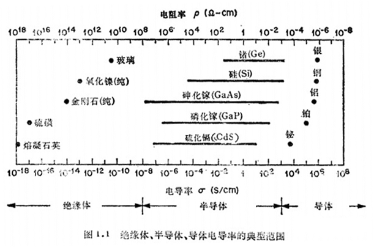

*   常见半导体材料：硅（Si）和锗（Ge）。

半导体的特性：

*   热敏特性：半导体的导电随温度升高而迅速增强，而金属的电阻率的温度系数是负的；半导体的电阻率随温度变化很大，而金属的电阻率变化很小，比如纯净的硅温度升高10度，电阻率减小一半，而铜温度升高100度，电阻率增加不到一半。
*   掺杂特性：半导体的导电能力随所含杂质而发生显著的变化，例如纯净的硅在室温下电阻率为2.14×104Ωcm，若惨入百万分之一的杂质原子，电阻率下降为0.2Ωcm，几乎只有原来的百万分之一。
*   光敏特性：半导体的导电能力随光照而发生显著变化，此外还随电场、磁场的作用而发生变化。

硅原子原子结构：2-8-4，有四个价电子。

本征半导体（Intrinsic Semiconductor）：

*   纯净的半导体称为本征半导体。
*   以硅原子为例，相邻的两个硅原子各提供一个电子供两个原子公有，这样外层电子不仅为自身所有，也为相邻原子所共有，形成共价键。具有的共价键结构使本征半导体处于相对稳定的状态。

    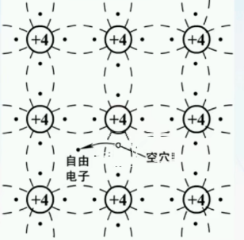

*   本征半导体在一定温度下，原子最外层电子有可能脱离共价键的束缚，从而成为自由电子，留下一个原来束缚电子的地方，叫空穴。电子带负电荷，空穴带正电荷。
*   脱离束缚的电子（自由电子）的移动可以导电，空穴周围的价电子（注意是价电子，不是脱离束缚的自由电子）填补空穴，又会形成空穴的移动（价电子移动，空穴向相反方向移动），所以本征半导体中自由电子和空穴都是带电荷的可移动的粒子，称为载流子（所谓载流子就是在外加电场下能做定向运动的粒子，也就是说有载流子的物质才能导电）。上述产生电子空穴对的过程叫本征激发，自由电子与空穴重新结合称为载流子的复合。当本征激发与载流子复合的速率达到动态平衡时，本征半导体内载流子浓度就固定不变。
*   本征激发与温度有关，温度越高（或光照激励），价电子获得能量越大，就越可能脱离共价键束缚，本征激发就越强，载流子浓度就越高，导电性就越好，而在低温时，本征激发弱，载流子浓度低，所以可以将本征半导体看成绝缘体。本征激发受温度影响很大，而且本征半导体本身的导电性就不强，所以实际中的半导体都不是本征半导体，而是掺杂半导体。

掺杂（杂质）半导体：

*   通过温度来控制本征半导体的导电能力（载流子浓度越高、导电能力越强）很困难，所以在本征半导体中掺入适当的某种其他元素改变其内部载流子的浓度，就可形成所谓的掺杂半导体。
*   P型半导体：在纯净的硅晶体中掺入三价元素（如硼），使之取代晶格中硅原子的位置，就形成P型半导体。在P型半导体中，空穴为多子，自由电子为少子，主要靠空穴导电。由于P型半导体中正电荷量与负电荷量相等，故P型半导体呈电中性。空穴主要由杂质原子提供，自由电子由热激发（本征激发）形成。
*   N型半导体：在纯净的硅晶体中掺入五价元素（如磷），使之取代晶格中硅原子的位置，就形成N型半导体。在N型半导体中，自由电子为多子，空穴为少子，主要靠自由电子导电。由于N型半导体中正电荷量与负电荷量相等，故N型半导体呈电中性。自由电子主要由杂质原子提供，空穴由热激发（本征激发）形成。
*   PN结：在一块半导体单晶片上，一侧掺杂成N型，另一侧掺杂成P型，则在P区与N区之间的交界面附近，将形成一个很薄的空间电荷层，称之为PN结。
    *   扩散运动：载流子从浓度高的地方向浓度低的地方运动，称为扩散运动。由扩散运动产生的电流称为扩散电流。
    *   漂移运动：载流子在电场作用下形成的定向运动，称为漂移运动。由漂移运动产生的电流称为漂移电流。
    *   扩散运动和漂移运动的作用：在一块本征半导体的晶体切片的两侧分别掺入不同的杂质，形成P型半导体和N型半导体两个区域，由于两个区域交界面附近会存在电子和空穴的浓度差，此时N区的自由电子会越过交界面向P区扩散，填补P区的空穴，使N区失掉自由电子产生正离子，而P区得到自由电子产生负离子。随着载流子运动的进行，在P区和N区的交界面两侧分别留下不能移动的正负离子，呈现出一个空间电荷区，这个空间电荷区就称为PN结，并形成一个内电场，其方向从N区指向P区，内电场的出现，会进一步阻止多数载流子的扩散运动，当然也会利于少数载流子的漂移运动，当扩散运动和漂移运动达到动态平衡时，PN结的宽度就稳定下来。

        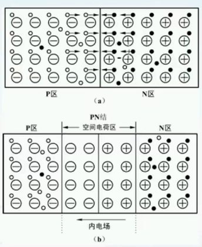

    *   PN结的正向导通特性：PN结两端加上正向偏置电压，简称PN结正偏，即P区接电源的正极，N区接电源的负极，如下图所示，图中R为限流电阻（起保护作用）。由于外加电源在PN结形成的外电场与PN结内电场方向相反，削弱了内电场的作用，破坏了原来载流子的动态平衡，使多数载流子的扩散运动加强，相当于PN结的阻挡层变窄，PN结呈现低阻状态，形成较大的正向电流，称为PN结的正向导通特性。

        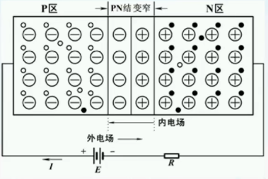

    *   PN结的反向截止特性：由于外加电源在PN结形成的外电场与PN结内电场方向相同，加强了内电场的作用，也将破坏原来载流子的动态平衡，但会阻止多数载流子的扩散运动，相当于PN结的阻挡层变宽，PN结呈现高阻状态，此时，少数载流子的漂移运动有所加强，由于少数载流子数量有限，形成的反向电流很小且基本不变。理论分析时，反向电流可忽略不计，这时称PN结为反向截止状态。

        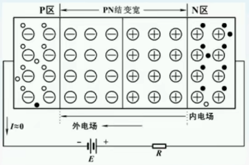

    *   在正向偏置中，多子的扩散运动增强，电流较大，在反向偏置中，少子的漂移运动增强，电流较小，可以忽略不计，导致正向偏置PN结电流远远大于反向偏置PN结电流（电流数量级不同）。在正向偏置中，外电场电压增强，PN结中运动的是多子，所以正向电流增强；在反向偏置中，外电场电压增强，PN结中运动的是少子，所以反向电流基本不变忽略不计（也成为反向饱和电流）。
    *   PN结的单向导电特性：PN结加正向电压时出现较大的正向电流，加反向电压时反向电流很小，接近于零。

晶体二极管：

*   从PN结的两端分别引出两根电极，然后加上外壳封装就构成了最基本的普通半导体二极管，P区的引出线称为阳极（正极），N区的引出线称为阴极（负极）。
*   二极管符号中的箭头表示正向偏置时电流的方向，正向电流从二极管阳极流入，阴极流出，具有单向导电特性。

    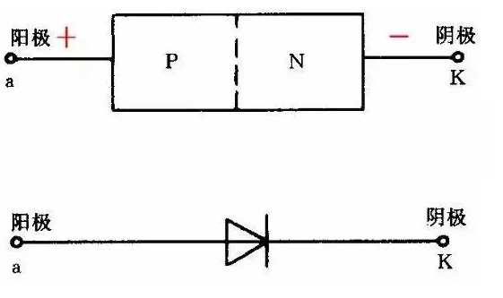

*   二极管的分类：按PN结的面积大小，可分为点接触型和面接触型。点接触型二极管由于PN结面积小，允许通过的正向电流较小，但PN结电容也很小，工作频率较高，通常用于高频电路作为检波器件或开关器件。面接触型二极管的PN结面积较大，允许通过较大的正向电流，一般在较低的频率下运行。通常用于整流、限幅、箝位等电路中。按所用半导体材料，可分为硅管和锗管。
*   二极管的伏安特性：
    *   正向特性：二极管两端外加正向偏置电压时，当正向偏置电压很小，还不足以克服内电场作用时，二极管不导通，不出现正向电流，故二极管存在一段死区，一般硅二极管的死区电压约为0.5V，锗二极管的死区电压约为0.2V。如果继续加大正偏电压达到抵消PN结内电场时，二极管正向电流随正偏电压急剧加大，二极管正向电阻很小，呈现导通状态，此时正向导通压降UF基本维持不变，一般硅管的UF约为0.7V，锗管的UF约为0.3V。
    *   反向特性：二极管两端外加的反向电压在一定值范围内时，使PN结电荷区加宽，由于少数载流子的漂移运动形成很微弱的反向电流IR，一般硅管的IR为几微安以下，锗管的IR为几十到几百微安。继续加大反向电压超出一定值时，外加反向电压会破坏半导体材料的共价键结构，使内部载流子数量急剧加大，反向电流迅速增大，造成二极管的反向击穿，破坏二极管的单向导电性能。
    *   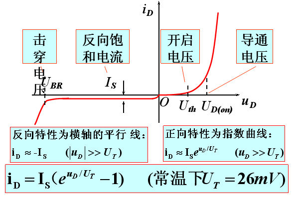

二极管的应用举例：

*   箝位电路：是利用二极管正向导通压降很小的特性，使电路输出端某点电位在数值上维持一个不变数值的电路。如下图所示，设VA=0V时，二极管D会正向导通，其正向压降为0.7V，因此VF=0.7V，所以F点的电位被钳制在0.7V不变。

    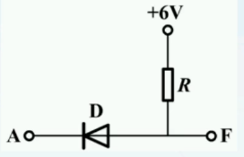

*   限幅电路：在计算机、电视机等许多电子线路中，往往要求对某个输入信号的幅度加以限制。此时可利用二极管组成各种限幅电路，使输出电压的幅度限制在某值以内。如下图所示，设二极管D为理想元件（忽略其正向导通压降及反向电流不计），当ui < E时，二极管D反向截止，呈关断状态，二极管D的阴极没有电流流出，uo的高电位处也没有电流，所以没有电流经过电阻R，故电阻R没有压降，所以uo=E；当ui > E时，二极管正向偏置呈导通状态，此时ui=uo。限幅电路的组成可根据实际需要而定。

    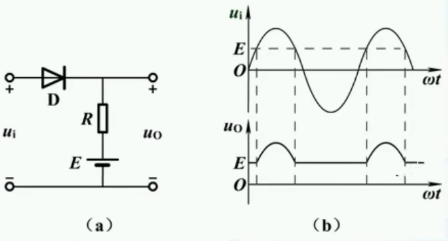

*   稳压二极管：
    *   稳压二极管实为一种特殊的面接触型硅二极管，工作在反向击穿时，流过它的反向电流在一定范围内变化时，管子两端电压几乎不变，具有稳压的性能。
    *   稳压二极管的正向特性曲线与普通二极管类似，但反向击穿特性更为陡峭，正常运行时，工作在反向击穿特性上，反向电流在较大范围内变化时，其两端电压变化很小，呈现出电压稳定的特性。
    *   只要反向电流不超过最大容许值就不会产生热击穿而损坏。
    *   只要反向电流不太小就不会引起电压较大变化。
*   光电二极管：
    *   与普通二极管一样，其基本结构为一个面接触型的PN结，管壳上有一个嵌着玻璃的窗口，便于光线射入，是一种将光信号转换为电信号的特殊二极管，所以又称为光敏二极管。光电二极管工作在反向偏置下。无光照时，与普通二极管一样，反向电流很小，反向电阻可达几十兆欧。有光照时，激发电子和空穴对，在反向电压作用下，电子和空穴对参与导电形成较大的反向光电流，此时反向电阻下降至几千欧~几十千欧。光电流与光照强度成正比。如果外接负载，便可获得随光照强弱而变化的电信号。
    *   光电二极管一般作为光电检测部件，广泛用于光的测量、光电自动控制、光纤通信等光接收机中。
*   发光二极管：
    *   发光二极管是一种将电能转换成光能的固体部件，与普通二极管相似，也是由一个PN结组成，承受反向电压时不导通，也不发光。当承受正向电压时，多数载流子的扩散运动加强，大量的电子和空穴在空间电荷区复合时释放的能量，发生一定波长的可见光。
    *   发光二极管的发光颜色主要取决于所用的半导体材料，常见的有红、黄等可见光，也可发出看不见的红外光。
    *   发光二极管具有驱动电压低、工作电流小、抗冲击能力较强、体积小、耗电省和寿命长等优点，广泛用于信号显示等电路中。

晶体三极管（晶体管，双极性晶体管）：

*   为什么引入晶体三极管：晶体二极管中PN结具有单向导电特性，但是无法放大电信号，所以引入晶体三极管。
*   晶体三极管的划分：从结构（类型）上区分，分为NPN型和PNP型；从材料上区分，分为硅管和锗管；从频率上区分，分为低频管和高频管；从功率上区分，分为小功率管、中功率管和大功率管。
*   NPN型晶体管和PNP型晶体管：
    *   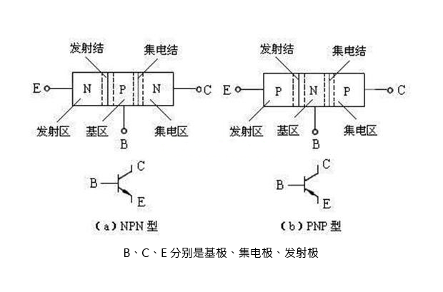
    *   晶体三极管有两个pn结：发射结和收集结；分为3个区：发射区、基区和集电区；对应引出的3个电极分别称为发射极、基极和集电极；基区在制作上要比其他两区薄得多，发射区的掺杂要比基区重得多。
*   晶体管工作在放大状态的必要条件：发射结正偏，集电结反偏。
    *   对于NPN型晶体管：发射结正偏，应将基区（P区）接高电压，发射区（N区）接低电压，即UB>UE。集电结反偏，应将基区（P区）接低电压，集电区（N区）接高电压，即UC>UB。综上所述UC>UB>UE。
    *   对于PNP型晶体管：发射结正偏，应将发射区（P区）接高电压，基区（N区）接低电压，即UE>UB。集电结反偏，应将集电区（P区）接低电压，基区（N区）接高电压，即UB>UC。综上所述UE>UB>UC。
*   晶体管工作在放大状态（放大区）下的原理（以NPN为例）：
    *   发射区向基区发射电子：发射结正偏，发射区的多数载流子（自由电子）不断地越过发射结进入基区，形成发射极电流Ie。同时基区多数载流子也向发射区扩散，但由于基区载流子浓度远低于发射区载流子浓度，可以不考虑这个电流，因此可以认为发射结主要是电子流。
    *   基区中电子的扩散与复合：电子进入基区后，先在靠近发射结的附近密集，渐渐形成电子浓度差，在浓度差的作用下，促使电子流在基区中向集电结扩散，被集电结电场拉入集电区形成集电极电流Ic。也有很小一部分电子（因为基区很薄）与基区的空穴复合，扩散的电子流（Ic）与复合电子流（Ib）之比例决定了三极管的放大能力（β）。
    *   集电区收集电子：由于集电结外加反向电压很大，这个反向电压产生的电场力将阻止集电区电子向基区扩散，同时将扩散到集电结附近的电子拉入集电区从而形成集电极主电流Icn。另外集电区的少数载流子（空穴）也会产生漂移运动，流向基区形成反向饱和电流，用Icbo来表示，其数值很小，但对温度却异常敏感。
    *   综上所述：注入到基区的大部分电子不会被复合（因基区掺杂浓度低得多）经扩散和漂移抵达集电结被反向偏置的集电极吸收成为集电极电流，因此集电极电流Ic比基极电流Ib大得多，这就是晶体管作用（放大）的基础。

场效应三极管：

*   晶体三极管用很小的基极电流Ib控制较大的集电极电流Ic（共发射极接法），作为放大元件使用时，三极管需要一定的输入电流，故称为电流控制电流的元件。
*   场效应三极管则用一定的输入电压控制较大的输出电流，作为放大元件使用时，场效应三极管只需要一定的输入电压，不需要输入电流，故称为电压控制电流元件。
*   场效应三极管具有输入电阻高（最高可达1015Ω）、噪声低、热稳定性好、抗辐射能力强等特点，且耗能少、制作工艺简便、易于集成等优点，因此得到广泛的应用。
*   场效应三极管的划分：从结构上区分，分为结型和绝缘栅型（MOS管）；按导电沟道的不同区分，分为P沟道和N沟道；按导电沟道形成的不同区分，分为增强型和耗尽型。
*   绝缘栅N沟道增强型场效应三极管的结构与工作原理：
    *   下图为绝缘栅N沟道增强型场效应管的结构，它是用一块掺杂浓度较低的P型硅片做衬底，采用扩散的方法在P型硅片中生成两个高掺杂的N区（形成两个PN结，也就是下图的耗尽层，也称阻挡层），然后在P型硅的表面覆盖一层很薄的SiO2绝缘层，并在其上及两个N区表面分别接出三个电极。一个电极称为栅极G，二个N区接出的电极分别称为源极S和漏极D。由于栅极和其他电极、硅片之间绝缘的，所以称绝缘栅型场效应管，简称MOS管。

        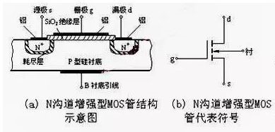

    *   目的：通过栅极G的电压控制漏极D到源极S的电流（电压控制电流）。
    *   N沟道增强型MOS场效应管导电沟道的形成过程：
        *   当源极S和衬底引线B互连，并给栅极G和源极S一个电压，栅极G和P型硅片相当于以二氧化硅为介质的平行板电容器，P型硅片中空穴受电场力作用向下移动，同时自由电子受正电荷吸引向上运动复合掉P型半导体中的空穴，形成空间电荷区。随着UGS增大超过UGS(th)后自由电子浓度大于空穴浓度，形成N型层（反型层）。
        *   在形成N型层后，给漏极D和源极S之间一个电压，形成电流ID。如果UGS越大，导电沟道越厚，硅片电阻越小，ID越小，反之亦然。
        *   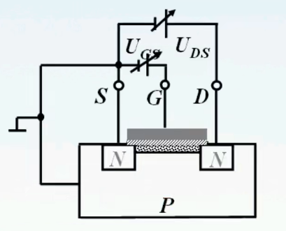
    *   N沟道增强型MOS场效应管导电沟道的形成过程的总结：
        *   当UGS等于零时，D、S之间不存在导通沟道，这时候两个PN结均为反向偏置，漏极电流ID=0。
        *   当UGS增大但较小时，在栅极电压UGS的作用下，SiO2层中会产生指向P型衬底的且垂直衬底的正电场，这个电场吸引P型衬底层中的少数载流子自由电子，同时排斥多数载流子空穴。由于UGS较小，吸引自由电子的数量不多，D、S之间无导电沟道，漏极电流ID=0。
        *   随着UGS的继续加大，则吸引到SiO2层下面的自由电子增多，将D、S连通，使D、S之间出现N型导电沟道，形成反型层。在漏极电压的作用下，产生漏极电流ID。
        *   将开始形成导电沟道时的栅源电压称为开启电压UGS(th)，它约为几伏，随着UGS的增大，沟道变宽，沟道电阻变小，漏极电流增大。
    *   UDS对漏极电流ID的影响：
        *   随着UGS的增大，使D、S之间形成反型层，沟道厚度均匀。之后在漏极D和源极S之间加上一个电压UDS，导致漏极电位高于源极电位，因此漏极和P型衬底之间的反偏效果比源极和P型衬底之间的反偏效果强，所以靠近漏极的PN结比源极宽（即UDS使沟道内产生电位梯度从而使沟道的厚度不均匀）。
        *   随着UDS不断增大，当UDS增加到UGS-UGS(th)时，近D段反型层消失，称为预夹断。
        *   继续增大UDS，夹断点向源极S延伸，夹断点和源极S的电压不变，漏极电流ID也不随着UDS的变化而变化。
        *   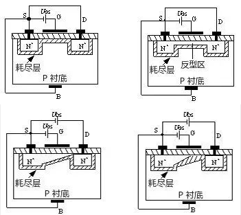
    *   N沟道增强型MOS管的特性曲线：
        *   该特性曲线反映了当UGS不变、UDS变化时，漏极电流ID的变化情况。随着UDS增大，产生预夹断之后，ID基本不变，进入恒流区。
        *   特性曲线分为四个区：
            *   可变电阻区（也称非饱和区）：此时UGS≥UGS(th)，UDS < UGS-UGS(th)。为下图中预夹断轨迹左边的区域，这时漏极与源极之间相当于一个受电压UGS控制的可变电阻。
            *   恒流区（也称饱和区，放大区）：此时UGS≥UGS(th)，UDS≥UGS-UGS(th)。为下图中预夹断轨迹右边、但尚未击穿的区域。当UGS一定时，ID几乎不随UDS的变化而变化，呈恒流特性。场效应管用于放大电路时，一般就工作在该区域，所以也称为放大区。
            *   夹断区（也称截止区）：此时UGS < UGS(th)。为下图中靠近横轴的区域，其沟道被全部夹断，称为全夹断，ID=0，场效应管不工作。
            *   击穿区：击穿区位于下图中右边的区域。随着UDS不断增大，PN结承受太大的反向电压而击穿，ID急剧增加。工作时应避免场效应管工作在击穿区。
        *   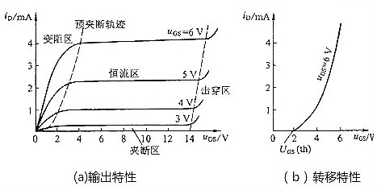
    *   工作在恒流区下漏极电流的值：

        

## 基本放大器工作原理

放大器的定义：

*   放大器是构成各种电子线路的基本单元电路。
*   所谓“放大”，就是将输入的微弱信号（微弱变化的电压或电流等）去控制直流电源提供的能量，并使输出按照输入的小信号变化规律而变化的过程。
*   在放大的过程中，要做到四两拨千斤，即用小信号控制大信号。同时要保证输出信号不失真，即输出信号的变化规律要反映输入信号的变化规律。
*   放大器的本质是能量转换器。

构成放大电路的核心是线性或准线性的电子器件（晶体管/场效应管/集成电路）。

组成放大电路的基本点：有合适的直流通路（偏置正确，合适的静态工作点），有合适的交流通路（输入信号能加入电路同时被负载取出来）。

注意：本章中讨论的都是变化的信号，对于不变的信号不是讨论的范围。

放大电路的基本要求：

*   外接直流电源必须使晶体三极管的发射结正偏、集电结反偏，使其工作在放大区。
*   选择电路参数使晶体三极管有一个合适的静态工作点Q。
*   输入电压信号UI作用在三极管的输入回路中，并能转换为输入信号电流UB，以控制集电极电流IC（以共射电路为例）。
*   输出信号电流IO尽可能地转换为输出电压信号UO。

放大电路的主要性能指标：

*   放大倍数：放大倍数可分为电压放大倍数、电流放大倍数和功率放大倍数等，用来衡量放大电路信号放大能力的指标。通常情况下，我们说的放大倍数一般指的是电压放大倍数。

    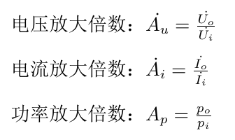

*   输入电阻：当输入信号加到放大器的输入端时，放大器就相当于信号源的负载电阻，这个负载电阻也就是放大器本身的输入电阻。输入电阻的大小影响到实际加在放大器输入端信号的大小。输入电阻越大，信号源提供的信号电流越小，从信号源吸取的能量就越少，所以在实际应用时要求放大器的输入电阻大一些。
*   输出电阻：放大器的输出回路可看成是一个具有一定内阻Ro的“电源”，这个内阻就是放大器的输出电阻。显然输出电阻越小，放大器带负载的能力越强，也就是说，当负载变化时对放大器的输出影响很小，所以在实际应用时要求输出电阻小一些。
*   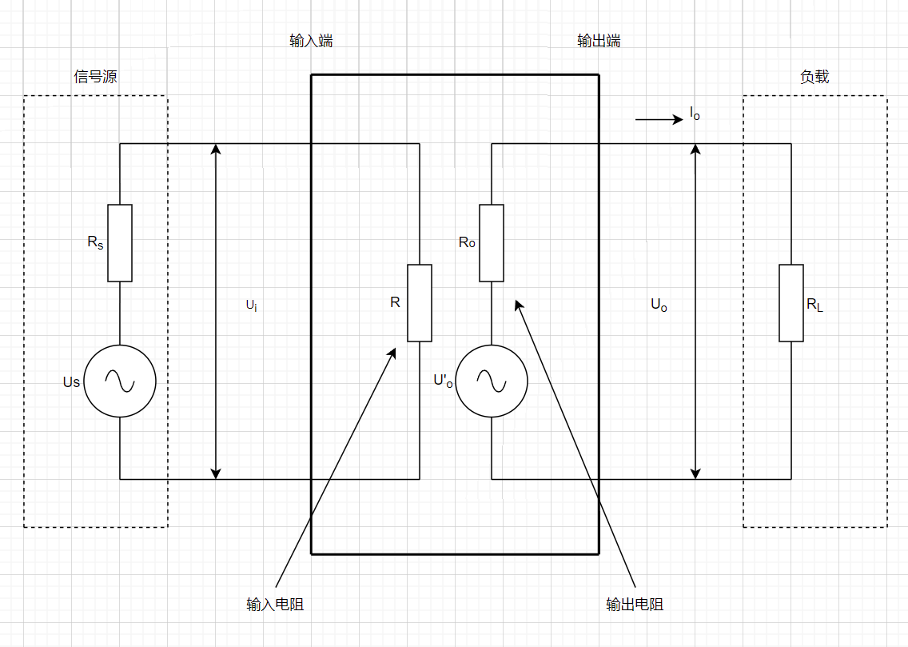

晶体管放大电路的三种接法分别是共射接法、共基接法和共集接法，它们的区别是：

*   基极和发射极构成输入回路，集电极和发射极构成输出回路，为共射。共射电路既能放大电流又能放大电压，输入输出电阻居三种电路之中，输出电阻较大，频带较窄。常用作为低频电压放大电路的单元电路。

    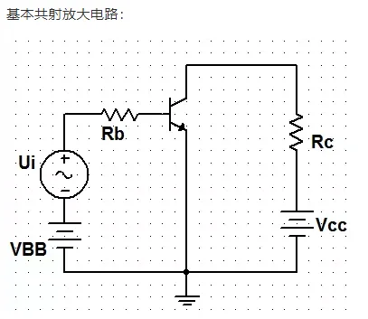

*   发射极和基极构成输入回路，集电极和基极构成输出回路，为共基。共基电路只能放大电压不能放大电流，输出电阻小，电压放大倍数、输出电阻与共射电路相当，是三种接法中高频特性最好的电路。常作为宽频带放大电路。

    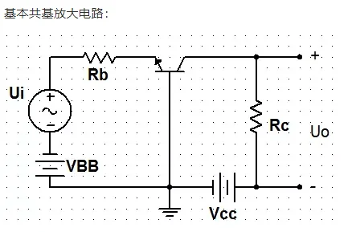

*   基极和集电极构成输入回路，发射极和集电极构成输出回路，为共集。共集电路只能放大电流不能放大电压，是三种接法中输入电阻最大、输出电阻最小的电路，具有电压跟随的特点，常用于电压放大电路的输入和输出级。

    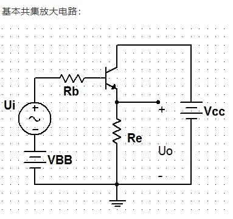

*   判断晶体管放大电路共哪个极：
    *   看哪个极交流接地。
    *   输入信号在哪两个极之间，输出信号在哪两个极之间，共同存在的极就是共哪个极。

两种形式的共射放大电路基本电路特性：

*   固定偏置放大电路：
    *   电路元件：电路中VCC是直流电源，使三极管发射结正偏，集电结反偏，同时为信号放大提供能源；C1和C2是耦合电容，同时隔直通交；RB为基极偏置电阻，调整其阻值的大小可改变基极偏置电流IB的大小，以得到合适的静态工作点；RC为集电极负载电阻，除保证三极管有合适的静态偏置外，还可将三极管输出的电流信号转换成输出电压信号。

        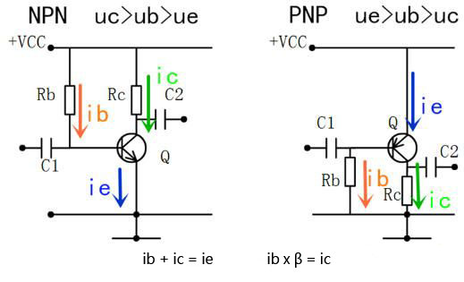

    *   电流关系：
        *   接通电源后，电流从VCC经电阻RB流入三极管基极，再通过三极管发射结从发射极流出到地，三极管发射结导通，引起三极管集电结导通，电流从VCC经电阻RC流入三极管的集电极，从三极管的发射极流出到地。
        *   
    *   电压关系：
        *   接通电源后，电源为三极管各个极提供电压，电源VCC经电阻RC降压后为三极管提供集电极电压UC，经电阻RB降压后为三极管提供基极电压UB，三极管的发射极直接接地，发射极电压为UE。
        *   电路中RB的阻值比RC大很多，所以三极管的三个极的电压关系分别是UC>UB>UE。
    *   静态工作点：在放大电路中，三极管的IBQ、ICQ和UCEQ称为静态工作点。
    *   固定偏置共发射极电路中电压、电流关系：

        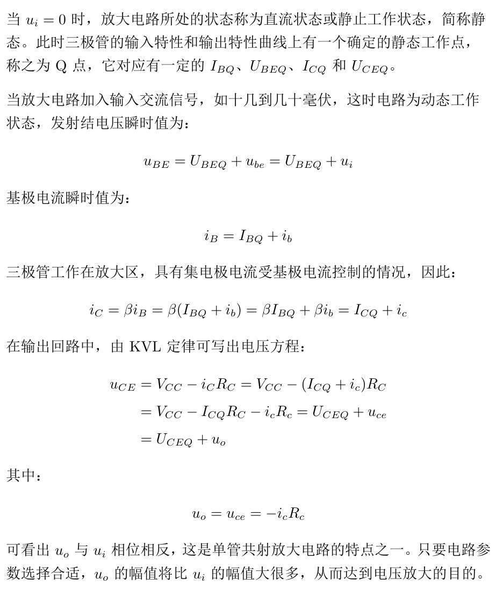

    *   静态分析和动态分析：
        *   静态分析：
            *   用工程估算法确定静态工作点：
                *   静态工作点由放大电路的直流通路进行分析。放大电路的直流通路是将所有耦合电容，旁路电容视为开路，只有直流电源作用时的电路。
                *   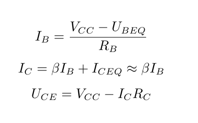
                *   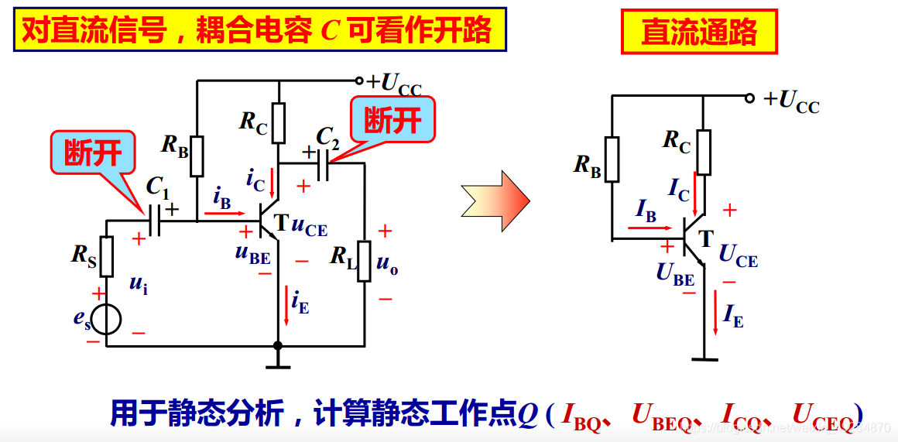
            *   用图解法确定静态工作点。
        *   动态分析：
            *   交流通路和交流负载线：
                *   外接输入信号后，电路处于动态工作方式，可由放大电路的交流通路进行分析。此时认为所有耦合电容、旁路电容视为短路；直流电源对交流信号视为短接。
                *   将整个工作状态下的电路运用叠加定理区分为直流通路和交流通路。此时注意到叠加定理需要运用在线性电路中，电阻、电容均为线性元件，工作在放大区的三极管可视为线性元件，所以可以使用叠加定理。
                *   R%5E%7B'%7D_%7BL%7D%24.png)
                *   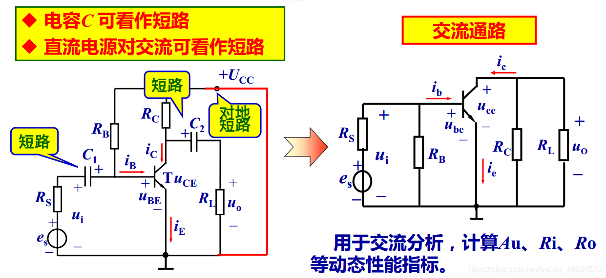
            *   图解动态分析：
                *   设放大电路的静态工作点Q位置适当，外加输入信号为辐值较小的正弦信号。该信号叠加在静态UBEQ上使电路工作在输入特性曲线的线性段，引起基极电流的变化量ib叠加在静态IBQ上随ui的变化规律而变化。
                *   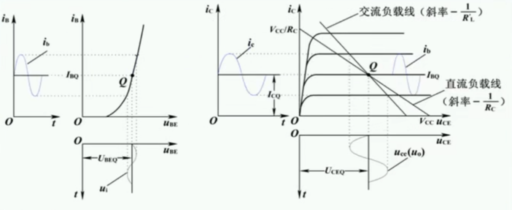
            *   静态工作点对输出波形的影响：
                *   截止失真：如果静态工作点Q设置偏低，当输入信号加入时，其负半周的部分波形会进入截止区而不被放大，造成输出波形相应的部分产生截止失真。解决截止失真的办法是减小基极偏置电阻RB值，使Q点上移。
                *   饱和失真：如果静态工作点Q设置偏高，当输入信号加入时，其正半周的部分波形会进入饱和区，也会造成输出波形相应部分产生饱和失真。解决饱和失真的办法是增大基极偏置电阻RB值，使Q点下移。
                *   双向失真：如果静态工作点Q适当，但输入信号电压幅值较大，正、负半周的部分波形分别进入饱和区、截止区，可引起输出电压波形的严重失真，该失真现象也称为截顶失真。解决双向失真的办法是减小输入信号的幅值。
                *   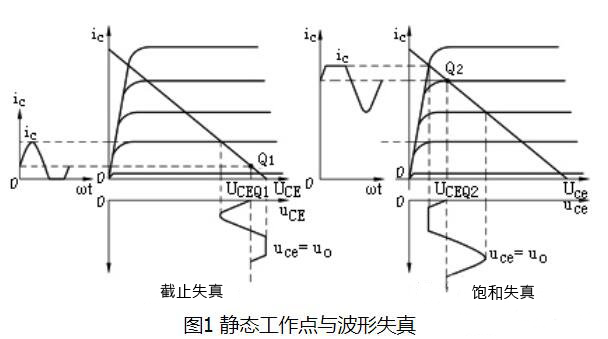
            *   微变等效电路分析法（分别从输入特性和输出特性讨论）：
                *   晶体三极管输入特性虽然是非线性，但在小信号作用情况下，静态工作点附近的工作区域可近似认为是线性，因此三极管B、E之间可用一个交流线性等效电阻rbe来代替。
                    *   
                    *   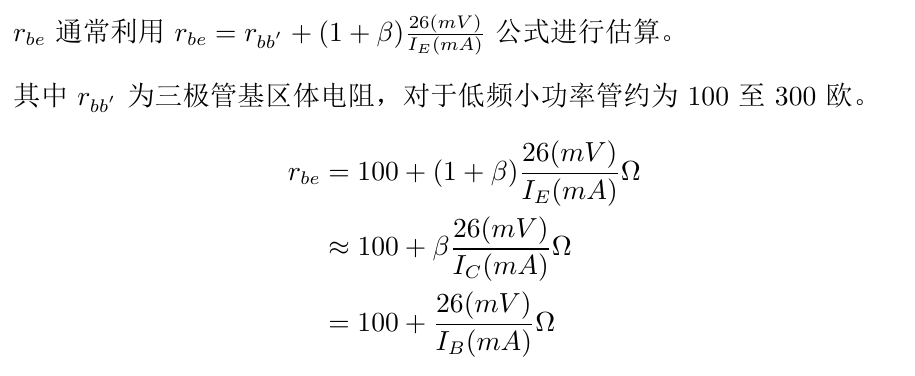
                *   晶体三极管工作在放大区时，输出特性曲线是一组近似与横轴平行且等间隔的直线，说明电压uCE在一定范围内变化时，电流iC几乎不变，具有恒流特性。因此晶体三极管C、E之间可用一个受基极电流控制的电流源来代替。

                    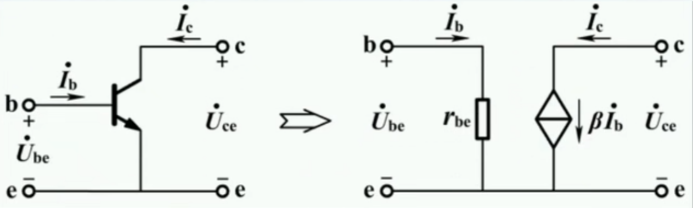

                *   注意该模型需要满足两个条件：输入信号比较小（微变）；工作频率不能太高也不能太低。
            *   微变等效电路的应用：
                *   微变等效电阻分析法的一般步骤：
                    *   画出原电路的交流通路。
                    *   将交流通路中的晶体管用适当的小信号模型取代。
                    *   根据实际情况简化电路。
                    *   列电路方程，求出电路的性能指标。
                *   画出交流通路、用小信号模型取代、根据实际情况简化电路：

                    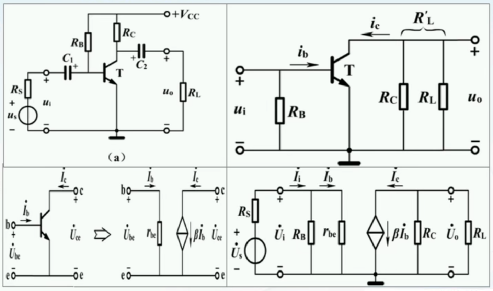

                *   求出性能指标：
                    *   电压放大倍数：

                        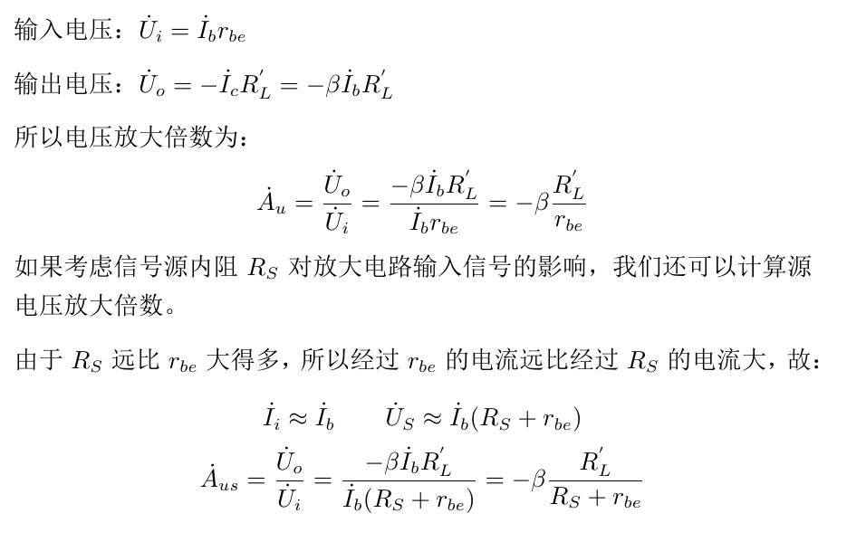  

                    *   输入电阻：

                        

                    *   输出电阻（满足RL去掉，电源US短接，受控电流源为0下的情况）：

                        

                *   由性能指标可知：共射单管放大电路的特点是电压放大倍数较大、输入电压与输出电压反相位变化、输入电阻较小、输出电阻较大。
            *   微变等效电路的例题：

                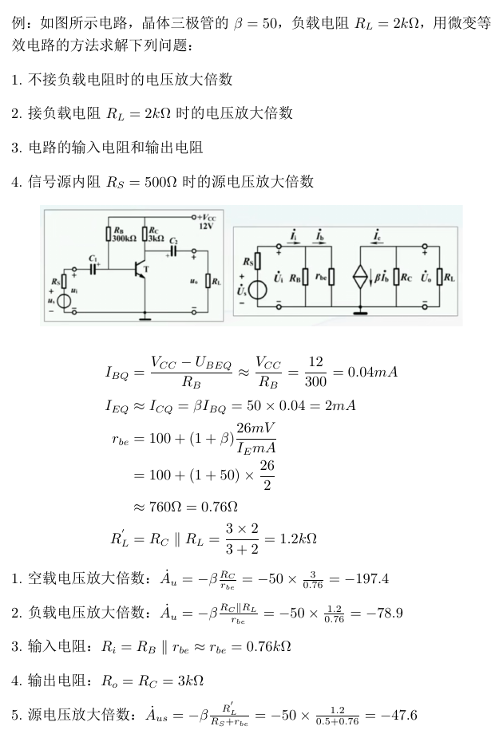

*   分压式偏置放大电路：
    *   引入分压式偏置放大电路的原因：固定偏置放大电路结构简单，当温度发生变化后影响β、UBE、ICBO，电路无法自动调整使静态工作点恢复正常，从而使三极管工作不稳定。
    *   电路元件：电路中VCC是直流电源；C1和C2是耦合电容，CE是交流旁路电容；RB1是三极管的上偏置电阻，RB2是三极管的下偏置电阻，RC是集电极负载电阻，RE是发射极反馈电阻。
        *   RE越大稳定性越好，但太大将使动态范围减小，电源利用率降低。为使发射极反馈电阻不影响交流分量的放大，而引入发射极旁路电容CE。
        *   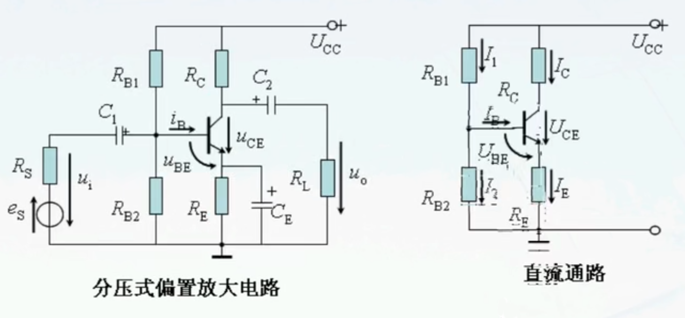
    *   电流关系：
        *   VCC经R1、R2到地，R1和R2分压为三极管基极提供了一个合适的偏置电压。这个电压经过三极管发射结通过R4到地，这个电流就是三极管的IB，三极管发射结导通引起集电结导通。VCC经R3到集电极，经过三极管集电结，经过R4到地，这就是三极管的IC。
        *   
    *   电压关系：UC>UB>UE。
    *   静态工作点的稳定：

        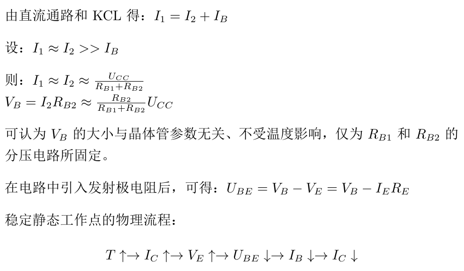

    *   静态分析和动态分析：
        *   静态分析：

            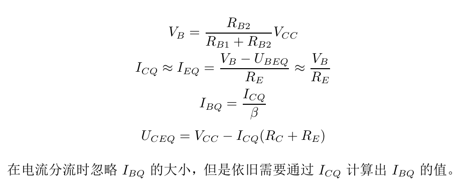

        *   动态分析:
            *   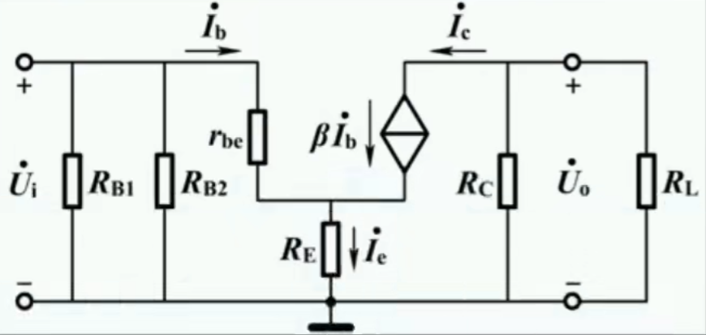
            *   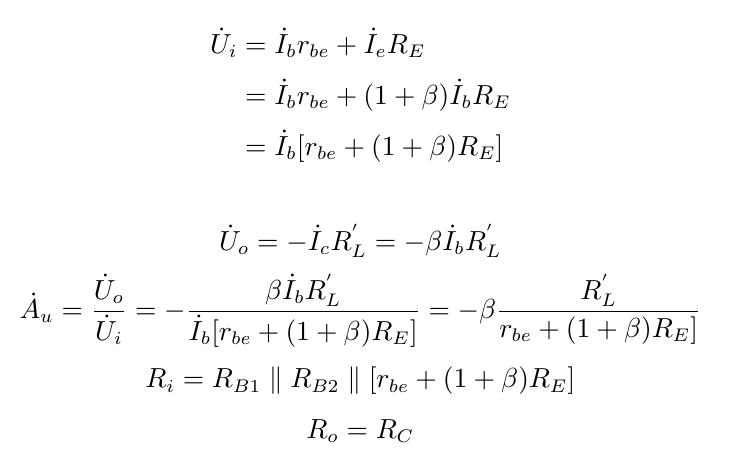

固定偏置共集放大电路基本电路特性：
