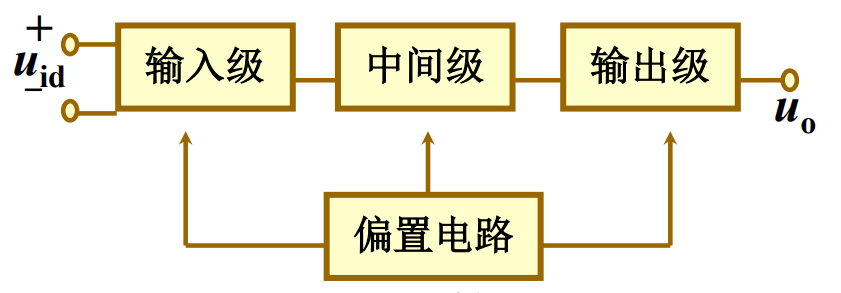
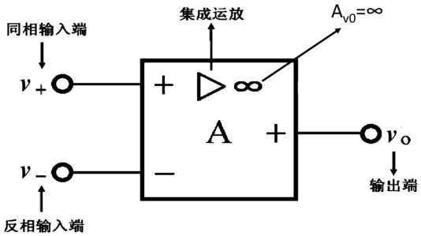

# 集成运算放大器及其应用

## 集成运算放大器概述

集成运算放大器（简称集成运放）概念：

*   集成电路：
    *   集成电路是20世纪60年代初发展起来的一种新型电子器件。它采用半导体制造工艺，将晶体三极管、二极管、电阻等元件及连线全部集中制造在同一小块半导体基片上，成为一个完整的固体电路，实现了元件、电路和功能的三结合。
    *   集成电路按功能不同可分为模拟集成电路和数字集成电路两大类。模拟集成电路的种类很多，包括集成运算放大器、集成稳压器、集成功率放大器、集成模拟乘法器以及各种专用集成电路等，它是用来产生、放大、处理各种模拟信号的集成电路。数字集成电路则是用来产生和处理各种数宇信号的集成电路。
*   集成运放的分类：集成运放按其指标、特点和应用范围，可分为通用型和专用型两大类。
    *   通用型的指标比较均衡全面，适用于一般电子电路。
    *   专用型的指标中，大都有一项指标是为满足某些专门的需要而设计的。
    *   通用型又分为低增益（Ⅰ型）、中增益（Ⅱ型）和高增益（Ⅲ型）等几种。
    *   专用型也有高阻抗、高速、高压、低功耗、大功率、低漂移之分。
*   集成运算放大电路是具有很高开环电压放大倍数的直接耦合放大器，最初多用于各种模拟信号的运算。现广泛用于模拟信号的产生及处理电路中。性能价格比优越，在绝大多数情况下已取代了分立元件放大电路。
*   集成运算放大电路的其他特性：
    *   因大电容不便集成，均采用直接耦合方式。
    *   因大电阻不便集成，常用有源器件（BJT、FET）取代电阻。
*   集成运算放大器内部电路方框图如下图所示，一般由以下四部分组成：
    *   输入级：输入级通常由具有恒流源的差动放大电路组成，以获得尽可能低的零点漂移、尽可能高的共模抑制比和尽可能好的输入特性。输入级的好坏对提高集成运算放大器的整体质量至关重要。
    *   中间级：中间级的主要作用是为整个放大电路提供足够高的电压放大倍数，所以一般采用多级直接耦合共射放大电路。
    *   输出级：输出级的作用是给负载提供一定幅度的输出电压和输出电流，故此级大多采用射极输出器或互补对称功率放大电路，以降低输出电阻、提高带负载能力。另外，输出级还应有过载保护。
    *   偏置电路：偏置电路的主要作用是向各级放大电路提供稳定的偏置电流，以保证各级放大电路具有合适而稳定的静态工作点。

    

*   运算放大器的电路符号如下图所示：
    *   两个输入端：`+`号表示同相输入端，意思是集成运放的输出信号与该端所加信号极性相同；`-`号表示反相输入端，意思是集成运放的输出信号与该端所加信号极性相反。
    *   输出端只有一个。
    *   图中三角形符号`▷`表示信号的传输方向。
    *   `∞`表示理想条件下。
    *   大多数集成运放需要两个直流电源供电。

    

理想集成运算放大器的特点：

*   理想运算放大器应具备的条件：
    1.  开环电压放大倍数：<code>Aud→∞</code>。
    2.  差模输入电阻：<code>Rid→∞</code>。
    3.  输出电阻：<code>Ro→0</code>。
    4.  共模抑制比：<code>KCMR→∞</code>。
    5.  带宽：<code>BW→∞</code>。
    6.  失调及漂移均趋于零。
*   理想运算放大器的基本特点：
    1.  集成运算放大器工作在线性区时，输出端对地电压uo与两个输入端对地电压u+和u-之间的关系如下：<code>uo=Aud(u--u+)</code>，<code>u-=u+</code>。理想运算放大器的两个输入端之间可以看成短路，但又不是真正的短路（即在实际应用时不能用一根导线把同相输入端和反相输入端短接起来），故称为虚假短路。
    2.  集成运算放大器工作在非线性区时：

## 集成运算放大器组成的基本运算电路

## 集成运算放大器应用
