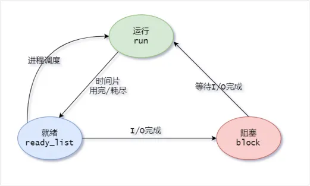
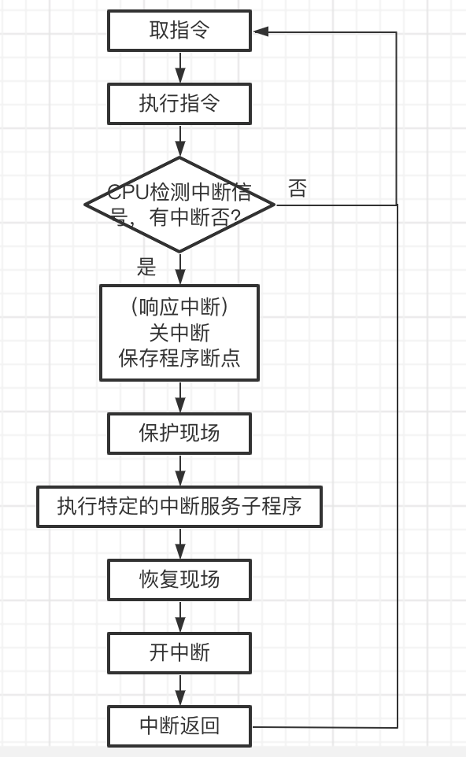

# 进程管理

1.  [进程的描述](#进程的描述)
2.  [进程的控制](#进程的控制)
3.  [操作系统内核](#操作系统内核)
4.  [进程同步](#进程同步)
5.  [进程通信](#进程通信)
6.  [线程](#线程)

## 进程的描述

程序的顺序执行：早期的计算机，程序的执行方式都是顺序执行。拥有顺序性、封闭性和可再现性。

*   顺序性：严格按照程序所规定的顺序执行，即只有前一操作结束后，才能执行后继操作。
*   封闭性：程序在运行后独占全机资源，各资源的状态只有本程序才能改变。
*   可再现性：只要程序执行时的环境和初始条件相同，当程序重复执行时，其执行结果相同。

程序的并发执行：指在同一时间间隔内运行多个程序，一个程序执行结束之前，可以运行其他程序。对用户而言，看到的是计算机同时运行多个程序。实际上，任意时刻一个CPU上只有一个程序在执行。拥有间断性、失去封闭性和不可再现性。

*   间断性：资源的有限使并发执行的程序呈现出执行过程的间断性。当请求某种资源的程序数量大于被请求的资源数量时，就必须有申请不到资源而暂停执行的程序。当其他程序释放资源后，该程序才能继续执行。
*   失去封闭性：程序在并发执行后，由于它们共享资源或者合作完成同一任务，系统的状态不再是只有正在执行的某一个程序可以改变。

进程的概念：

*   并发执行的程序可能是同一个程序在不同的数据集合上的执行，也可能是不同的程序在不同的数据集合上的执行，它们共享系统资源。
*   进程：进程是允许并发执行的程序在某个数据集合上的运行过程。进程由正文段、用户数据段和进程控制块共同组成的执行环境。
*   正文段存放被执行的机器指令，用户数据段存放进程在执行时直接进行操作的用户数据，进程控制块存放程序的运行环境。
*   程序装入内存后即可运行，根据程序计数器PC的值，不断将指令从内存取到CPU的指令寄存器IR中，经译码后完成各种操作。
*   进程控制块的动态变化表征程序的运行，一个进程对应了一个这样的环境。进程代表了程序的执行过程，是一个动态的实体，它随着程序中指令的执行而不断变化。

进程的特征：

*   并发性：多个进程实体能在一段时间间隔内同时运行。
*   动态性：进程是程序实体的执行过程。
*   独立性：在没有引入线程概念的操作系统中，进程是独立运行和资源调度的基本单位。
*   异步性：进程的执行时断时续。
*   结构特征：进程实体包括正文段、用户数据段和进程控制块。

进程和程序的比较：

*   进程和程序的区别：
    *   程序是静态的，进程是动态的。程序是存储在某种介质上的二进制代码，进程对应了程序执行的过程。
    *   程序是永久的，进程是暂时存在的。进程因程序的执行而被创建，因程序执行的结束而被撤销。
*   进程和程序的联系：
    *   进程是程序的一次执行，进程总是对应至少一个特定的程序，执行程序的代码。
    *   一个程序可以对应多个进程。同一程序可以在不同的数据集合上运行，构成若干不同的进程。

进程控制块：

*   进程实体存在的标志是操作系统管理进程所使用的数据结构--进程控制块。
*   什么是进程控制块（PCB）：进程控制块是进程实体中的一部分，是操作系统中最重要的数据结构。
*   操作系统在创建进程时，首先要为进程创建进程控制块，即生成一个进程控制块类型的变量，以存储所创建进程的描述信息。
*   每个进程有唯一的进程控制块，进程控制块是操作系统感知进程存在的唯一标志。

进程控制块中的信息：

*   进程标志符信息：用于标识进程的独一无二。
*   处理机状态信息：通用寄存器、程序计数器、程序状态字PSW（标志寄存器）和用户栈指针（进程系统栈相关指针）等。
*   进程调度信息：包括进程状态信息、进程优先级和进程调度所需的其他信息。
*   进程控制信息：包括程序和数据的地址、进程同步和通信机制、资源清单，以及链接指针。

本书中的数据结构是指为程序的需要而定义的简单类型或复杂类型的变量，变量用来存放随着程序的执行不断发生变化的数据。进程控制块是复杂类型的变量。

进程的状态：

*   进程控制块的状态字段描述了进程当前所处的状态。
*   进程的三种基本状态：
    *   就绪态：进程获得CPU就可以运行的状态。在多任务系统中，可以有多个处于就绪态的进程，这些进程被组织成一个或多个就绪队列。
    *   执行态：进程获得CPU后正在运行的状态。
    *   阻塞态：进程由于等待资源或某个事件的发生而暂停执行的状态。
*   进程状态的转换：新创建进程的状态为就绪态。就绪态进程获得CPU变成执行态。执行态进程时间片用完即变为就绪态。执行态进程需申请某种资源或等待某事件的发生变为阻塞态。阻塞态获得资源或等待的事件到来变为就绪态。
*   

进程的组织：

*   操作系统任意时刻都可能存在很多进程，每个进程对应一个进程控制块，操作系统组织和管理进程是通过组织和管理进程控制块实现的。
*   组织和管理的方式：
    *   链接方式：把系统中具有相同状态的进程的进程控制块链接成一个队列。
    *   索引方式：系统根据所有进程的状态，建立几张索引表，索引表的每一个表项指向一个PCB的物理块。
*   进程队列：利用链接方式，将系统中多个进程组成成队列，具有相同状态的进程放在一个队列中。处于就绪态的进程构成就绪队列，处于阻塞态的进程构成阻塞队列。

## 进程的控制

创建新进程包括为进程分配必要的资源，建立操作系统用于管理进程的数据结构（如进程控制块）等操作。

进程的创建：

*   在Linux中，除了0号进程外的其他进程都是由父进程创建的。操作系统正常工作后，系统中的已有进程在执行过程中可以通过系统调用创建新进程。被创建的新进程称为创建它的进程的子进程，创建它的进程为父进程。由同一个父进程创建的多个进程间的关系为兄弟进程。
*   通常下列情况创建新进程；用户登录；作业调度；提供服务；应用请求。
*   子进程可以从操作系统直接获得资源，也可从父进程那获得资源。
    *   当新进程被创建后，有两种执行可能：父进程与子进程并发执行；父进程等待，直到某个或全部子进程执行完毕。
    *   新进程的地址空间也有两种可能：子进程共享父进程的地址空间；子进程拥有独立地址空间。
*   调用创建新进程的系统调用来创建进程的一般步骤：申请空白PCB；为新进程分配资源；初始化进程控制块，将新进程插入就绪队列。

进程的阻塞：

*   操作系统在下列情况下可能引起进程的阻塞：请求系统服务；启动某种操作；新数据尚未到达；无新工作可做。
*   完成进程阻塞的简化过程：将进程的状态改为阻塞态；将进程插入相应的阻塞队列；转进程调度程序，从就绪进程中选择进程为其分配CPU。

进程的唤醒：操作系统通过下列过程将阻塞态进程唤醒为就绪态：将进程从阻塞队列中移除；将进程状态由阻塞态改为就绪态；将进程插入就绪队列。

进程的终止：

*   进程的终止也称进程的撤销，在下列情况，进程会终止：
    *   当进程正常执行完毕，调用终止进程的系统调用，请求操作系统删除进程。
    *   一个进程调用适当的系统调用，终止另外一个进程。
*   父进程终止子进程的原因：子进程使用了超过分配给它的资源；分配给子进程的任务已不再需要；父进程退出。
*   操作系统通过系统调用完成进程终止的一般过程：从进程PCB中读进程状态；若进程正常执行，则终止进程的执行；若进程有子孙进程，多数情况下需要终止子孙进程；释放资源；将终止进程的PCB移出。

操作系统的启动和系统中进程的出现：

*   打开计算机电源后，计算机先加电自检，然后寻找启动盘。如果是硬盘启动，计算机会检查硬盘的0柱面0磁道1扇区。当硬盘被划分为多个分区，同时安装了多个操作系统，每个分区都有自己的引导扇区，但整个硬盘有一个主引导扇区（0柱面0磁道1扇区）。
*   通过执行主引导扇区代码，判断当前被激活的分区，然后加载被激活分区的引导扇区，通过该引导扇区代码的执行加载该激活分区的操作系统。

## 操作系统内核

操作系统内核是计算机硬件的第一次扩充，一般操作系统内核包括下列功能：

*   支撑功能：包括中断处理、时钟管理和原语操作（也称原子操作，是一组在执行过程中不能被中断的操作）。
*   资源管理功能：包括进程管理、存储器管理和设备管理等。

中断：

*   什么是中断：中断是改变处理器执行指令顺序的一种事件。计算机在执行程序的过程中，当遇到中断时，计算机停止现行程序的运行，转向对这些中断事件的处理，处理结束后再返回到现行程序的间断处。
*   为什么引入中断：引入中断机制后，使CPU可以和其他设备并行工作，能够提高CPU的利用率，改善系统性能，支持系统的异步性。
*   中断分为同步中断（内部中断）和异步中断（外部中断）两种：
    *   内部中断：当CPU执行时由CPU控制单元产生，称为同步时因为只有在一条指令终止执行后CPU才会发生中断。
    *   外部中断：由其他硬件设备随机产生。外部中断又分为外部可屏蔽中断和不可屏蔽中断。
        *   可屏蔽中断：由I/O设备产生的中断，有两种方式可以屏蔽中断，一是将标志位寄存器的IF位置0（关中断），二是可以对可编程中断控制程序编程来禁止中断请求。
        *   不可屏蔽中断：由紧急事件引起，如硬件故障。
*   引起中断的原因：人为设置中断；程序性事故，如除数为0；硬件故障；I/O设备被启动后，一旦其准备就绪或完成一次输入/输出，便向CPU发出中断请求；通过键盘和鼠标来中断现行程序。
*   中断响应：
    *   中断响应的条件：对于可屏蔽中断，开中断是响应中断的前提（IF位置1）。
    *   响应中断的时机：对于外部中断，CPU每执行完一条指令都会检测是否有外部中断信号的到来。若有，则转中断处理过程。
*   单重中断的处理过程：CPU在执行指令的过程中，每执行完一条指令，都会检测是否有外部中断信号的到来。若有，则转中断处理过程。
    *   系统关闭中断，保护断点：把当前要执行的下一条指令的地址保存到内存中，以便中断返回时，能够把这个地址恢复到程序计数器PC中，使被中断的程序从断点处开始继续执行。
    *   转中断处理程序：在中断处理程序中完成保护现场的过程，就是把相关的硬件上下文信息保存到内存中。
    *   保护完现场后，根据中断向量到中断向量表中找到中断处理子程序入口地址相关信息，得到中断处理子程序的入口地址，以执行中断处理子程序，完成本次中断处理的特定处理工作。
    *   恢复现场，开中断：CPU返回断点处继续执行被中断的程序。
    *   
*   如何找到中断服务子程序：
    *   中断向量：中断向量是对不同中断源到来的信号编号，该编号是一个0～255的无符号整数，称为中断向量。
    *   中断描述符表：是一个系统表，每一个中断或异常与向量相联系。每一个向量在表中有唯一对应的表项，其中存有与中断或异常处理子程序入口地址相关信息。
    *   当中断发生时，CPU根据中断号获取中断向量值，再根据中断描述符表的起始地址和中断向量值，得到形成中断服务子程序入口地址的相关信息。

时钟管理：

*   时钟的重要性：操作系统利用时钟机制限制一个用户进程在CPU上连续执行的时间。
*   计算机系统中有两个时钟源：实时时钟和系统时钟。
    *   实时时钟（RTC）也称CMOS时钟，是一块时钟芯片，靠电池供电，为计算机提供计时标准，是最原始、最底层的数据。
    *   系统时钟产生于PC主板上的定时/计数芯片，在开机时有效，由操作系统控制。
*   操作系统内核需要完成两种主要的定时测量：一是保存当前的日期和时间；二是维持定时器。
*   操作系统依靠时钟硬件（可编程间隔定时器）和时钟驱动程序完成上述两种定时测量功能。
*   每产生一次时钟中断信号，操作系统内核要执行时钟驱动程序，时钟驱动程序完成下列功能：
    *   维护日期和时间。
    *   递减当前进程在一个时间片内的剩余执行时间，并检查是否为零，防止进程运行超时。
    *   对CPU的使用情况记账。
    *   递减报警计数器。

系统调用：

*   什么是系统调用：系统调用是预先定义好的模块提供一条管道，让应用程序或一般用户能由此得到核心程序的服务。系统调用是系统程序与用户程序之间的接口。
*   系统调用和一般函数的区别：
    *   用户态执行：一个用户进程不能访问其他进程的用户空间，只有系统程序才能访问其他用户空间。当CPU执行用户空间的代码时，称该进程在用户态执行。
    *   系统态执行：系统空间是指含有一切系统核心代码的地址空间，当CPU执行系统核心代码时，称进程处于系统态执行。
    *   系统调用运行在系统态（内核态），而一般函数运行在用户态。
    *   两者执行过程不同。系统调用执行时，当前程序被中断，由系统找相应系统调用子程序，并在系统态下执行，执行结果返回进程。
    *   系统调用要进行“中断处理”。
*   系统调用的类型：
    *   进程控制类系统调用。创建、撤销进程；获得、改变进程属性。
    *   文件操作类系统调用。创建、删除、打开、关闭和读/写文件。
    *   设备管理类系统调用。请求、释放设备。
    *   通信类系统调用。打开、关闭链接，交换信息。
    *   信息维护类系统调用。返回系统当前日期、时间、版本号、用户数、空闲内存和磁盘空间大小等信息。

## 进程同步

多任务操作系统支持多个进程并发执行，并发执行的进程共享系统的软件和硬件资源。操作系统同步机制的主要任务就是要保证在多任务共享资源的情况下，程序执行能得到正确的结果。有些进程之间具有相互合作关系，同步机制需要解决这些进程执行的协调问题。

进程同步的基本概念：

*   进程同步有两个任务：一是具有资源共享关系的进程，保证诸进程以互斥的方式访问临界资源。临界资源是必须以互斥方式访问的共享资源。二是对具有相互合作关系的进程，保证相互合作的诸进程协调执行。（相互合作的进程可能同时存在资源共享的关系）。
*   如果PIN和POUT互斥地访问count，即PIN访问count时，POUT就必须等待PIN对count的访问结束，再开始对count的访问，反之亦然。这样就不会出现计算结果的错误了。像count这样必须以互斥方式访问的共享资源称为临界资源。
*   临界区是进程中访问临界资源的那段代码。访问临界资源是通过执行临界区代码实现的，如果能使程序以互斥的方式进入临界区，就能够实现对临界资源的互斥访问。可以通过在临界区前面加进入区代码，在临界区后面加退出区代码来实现。
*   进入区代码是临界区代码之前执行，检查进程是否可以进入临界区并对临界区“加锁”。退出区代码在临界区代码之后执行，完成释放临界区访问权的功能。

```txt
// PIN
Process PIN
R1:integer;
Begin
R1:=count;
R1:=R1+1;
count:=R1;
End
// POUT
Process POUT
R2:integer;
Begin
R2:=count;
R2:R2-1;
count:=R2;
End
```

同步机制应遵循的准则：

*   同步机制应遵循的准则可以提供判断、选择和评价同步技术的参考依据。
*   空闲让进：当没有进程处于临界区时，表明临界资源处于空间状态，应允许一个请求进入临界区的进程立即进入自己的临界区，以有效地利用临界资源。
*   忙则等待：当已有进程进入临界区时，表明临界资源正在被访问，因而其他试图进入临界区的进程必须等待，以确保对临界区资源的互斥访问。
*   有限等待：对要求访问临界资源的进程，应保证在有限时间内能进入自己的临界区，以免进程陷入无限等待的状态。
*   让权等待：当进程申请不到共享资源的访问权时，应立即释放处理机，以免进程陷入“忙等”状态，浪费CPU资源。

信号量机制：

*   在信号量机制中，用信号量的取值来表示资源的状态，或某种事件是否发生，以此为基础实现进程访问。对不同的共享资源设置被称为信号量的变量，信号量的取值来表示资源的使用状况，或某种事件。
*   整形信号量机制：
    *   整形信号量机制：如果整形量>0，说明有可用资源；如果整形量≤0，说明资源忙，进程必须等待。对于一次只允许一个进程访问的临界资源，可定义一个用于互斥的整形信号量，并将其初始化为1。
    *   整形信号量的值只能通过两个特定的原子操作wait和signal来改变。
    *   用整形信号量实现进程互斥：为互斥访问的临界资源定义一个互斥信号量mutex，将初值设置为1，然后将临界资源放入wait(mutex)和signal(mutex)之间。
    *   对整形信号量机制的总结：整形信号量的值只能由wait和signal操作改变；wait和signal操作都是原子操作，即在这两个操作中对信号量的访问是不能被中断的；原子操作可以通过关中断实现；不同的资源对应不同的信号量，并不是系统中所有的资源都用同一个信号量表示。
*   记录型信号量机制：
    *   当s.value≥0时，s.value的值表示资源数量。当s.value<0时，s.value的绝对值等于某资源的等待队列中阻塞进程的数量。
    *   每次wait(s)操作，意味着进程请求一个单位的资源，描述为s.value=s.value-1。当s.value<0时，表示资源已经分配完毕。因此，进程调用block原语，进行自我阻塞，放弃处理机，其进程控制块插入到阻塞队列s.l中。
    *   每次signal(s)操作，意味着进程释放一个资源，描述为s.value=s.value+1表示系统可用的资源数目加1，若加1后s.value≤0，则表示在该信号量的阻塞队列中，仍有等待该资源的进程被阻塞，故还应该调用wakeup原语，唤醒s.l队列中的一个阻塞进程。
    *   如果s.value的初值为1，表示只允许一个进程访问临界资源，此时的信号量转化为互斥信号量。
    *   记录型信号量机制的优点是不存在“忙等”，采取了“让权等待”的策略。
*   AND型信号量机制：基本思想是将进程在整个运行过程中所需要的资源一次性地全部分配给进程，待该进程使用完后再一次释放。只要还有一个资源不能分配给该进程，其他所有可能为之分配的资源也不分配给它。

```txt
// wait 用于申请资源
wait(s) {
  while s<= 0 do no-op;  // s<=0 时循环执行空操作
  s = s - 1;
}
// signal 用于释放资源
signal(s) {
  s = s + 1;
}
// 改进版 PIN
Process PIN
R1:integer;
Begin
wait(mutex);
R1:=count;
R1:=R1+1;
count:=R1;
signal(mutex);
End
// 改进版 POUT
Process POUT
R2:integer;
Begin
wait(mutex);
R2:=count;
R2:R2-1;
count:=R2;
signal(mutex);
End
// semaphore
Type semaphore = record
                 Value:integer;      // 资源数量
                 L:list of process;  // 阻塞队列
End
// 记录型 wait
Procedure wait(s)
  var s:semaphore;
  begin
    s.Value=s.Value-1;
    if s.Value<0 then block(s.L);
  end
// 记录型 signal
Procedure signal(s)
  var s:semaphore;
  begin
    s.Value=s.Value+1;
    if s.Value<=0 then wakeup(s.L);
  end
```

经典的进程同步问题（生产者-消费者问题）：

*   问题描述：
    *   生产者进程生存消息，并将消息提供给消费者进程消费。
    *   在生产者进程和消费者进程之间设置了一个具有n个缓冲区的缓冲池，生产者进程可以将它所产生的消息放入缓冲池的一个缓冲区中，消费者进程可以从一个缓冲区中取得一个消息消费。
    *   任意两个进程必须以互斥的方式访问公共缓冲池。
    *   当缓冲池空，没有可供消费的消息时，消费者进程必须阻塞等待。
    *   当缓冲池装满消息，没有空闲缓冲区时，生产者进程必须阻塞等待。
*   需要解决的问题：
    *   实现任意两个进程对缓冲池的互斥访问。
    *   实现对生产者进程和消费者进程的“协调”：即缓冲池中有消息时消费者进程才能执行取消息的操作；无消息时，阻塞消费者进程。缓冲池中有空闲缓冲区时，生产者进程才能执行放消息的操作；无空闲缓冲区时，阻塞生产者进程。
*   信号量设置：
    *   设置一个互斥信号量mutex，用于实现对公共缓冲池的互斥访问，初始值为1。
    *   设置两个资源信号量，分别表示可用资源数：empty，表示缓冲池中的空缓冲区数，初值为n；full，表示装有消息的缓冲区数，初值为0。（一个缓冲区放一个消息）。
*   说明：
    *   wait和signal操作必须成对出现。
    *   wait操作的顺序不能颠倒。必须先对资源信号量（即empty和full）进行wait操作，然后再对互斥信号量进行wait操作。

```txt
// 利用记录型信号量解决生产者-消费者问题
var mutex,empty,full:semaphore:=1,n,0;  // 定义三个信号量
buffer:array[0,...,n-1] of item;  // 定义缓冲池，容量为 n
in,out:integer:=0,0;
begin
  parbegin
    proceducer:  // 生产者
      begin
        repeat
        producer an item nextp;  // 生产一个产品
        wait(empty);             // 申请一个空缓冲区
        wait(mutex);             // 申请缓冲池的使用权
        buffer(in):=nextp;       // 将产品放入缓冲池中
        in:=(in+1) mod n;        // 下一个空缓冲区地址
        signal(mutex);           // 释放缓冲池使用权
        signal(full);            // 释放一个满缓冲区
        until false;
      end
    consumer:   // 消费者
      begin
        repeat
        wait(full);              // 申请一个满缓冲区
        wait(mutex);             // 申请缓冲池的使用权
        nextc:=buffer(out);      // 从缓冲池中取出产品
        out:=(out+1) mod n;      // 下一个满缓冲区的地址
        signal(mutex);           // 释放缓冲池使用权
        signal(empty);           // 释放一个空缓冲区
        consumer the item in nextc;  // 消费一个产品
        until false;
      end
  parend
end
```

管程：

*   管程的定义：管程是描述共享资源的数据结构和在数据结构上的共享资源管理程序的集合。其中包括变量的定义、变量的初始化代码、以及管理共享资源的过程。
*   对管程的说明：
    *   管程是可供程序员调用的软件包。是一个由过程、变量及数据结构等组成的集合，它们组成一个特殊的模块或软件包。进程可以在任何需要的时候调用管程中的过程，但是他们不能在管程之外声明的过程中直接访问管程内的数据结构。
    *   每次只有一个进程调用管程执行，任意时刻管程中只能有一个活跃进程。
    *   管程是一种编程语言的构件。

## 进程通信

操作系统提供进程通信功能，以支持进程之间的信息交换。

共享存储器系统：

*   在共享存储器系统中，相互通信的进程共享某些数据结构或共享存储区，进程之间能够通过这些空间进行通信。
*   共享存储器系统可分为两种类型：
    *   基于共享数据结构的通信方式。要求诸进程公用某些数据结构，以实现进程间的信息交换。
    *   基于共享存储区的通信方式。进程通过对共享存储区中的数据的读或写来实现通信。

消息传递系统：

*   直接通信方式。操作系统利用发送程序直接把消息发送给目标程序。
*   间接通信方式。进程之间的通信需要通过用于暂存消息的共享数据结构来实现，如信箱。该方式可以实现实时通信，也可以实现非实时通信。

消息缓冲队列：

*   用于本地进程之间的通信，包括数据结构、发送原语和接收原语。
*   发送进程发送消息时，先申请一个消息缓冲区，将要发送的消息从发送进程的发送区放入消息缓冲区。然后，调用发送原语将消息发送给接收进程，发送原语将发送缓冲区插入接收进程的消息缓冲队列。
*   接收消息的进程通过调用接收原语将该进程消息缓冲队列中的消息复制到自己的消息接收区。
*   消息缓冲区是一个结构型数据结构。消息缓冲队列需要被当作临界资源，在发送原语和接收原语中对消息缓冲队列的访问需要进行互斥与同步。

## 线程

为了进一步提高程序的并发性，减少系统开销，在操作系统中引入了线程的概念。

引入线程作为独立调度和分派的单位，不独立拥有资源，而与其他线程共享同一进程的资源，减少了系统的时空开销。线程的实质是把进程的任务划分成更小，具有独立功能的单位，以线程的形式来并发执行，以提高程序并发执行的程度。

线程的描述：

*   线程是进程中的一个实体，是被系统独立调度和分配的基本单位。一个线程可以创建和撤销另一个线程。同一进程中的多个线程可以并发执行。
*   线程的分类：用户级线程和内核级线程。

线程的三种基本状态：就绪态，运行态和阻塞态。

线程控制块：每个线程都由一个数据结构表示，包括它的基本状态、标识及记账信息，这个数据结构就是线程控制块。线程控制块记录了操作系统所需的，用于描述线程情况及控制线程运行所需的全部信息。线程控制块采用链接方式来组织，把同一进程中具有相同状态的TCB用指针链接成队列。

线程和进程的关系：

*   资源和调度。线程是程序执行的基本单位，进程是拥有资源的基本单位。
*   地址空间资源。不同进程的地址空间是相互独立的，而同一进程中的各线程共享同一地址空间。
*   通信关系。进程之间的通信必须使用操作系统提供的进程间通信机制，而同一进程中的各线程间可以通过直接读或写全局变量来进行通信，甚至无需操作系统的参与。
*   并发性。多进程之间可以并发执行，多线程之间也可以并发执行，同一进程中的多个线程之间也可以并发执行。
*   系统开销。创建或撤销进程时，系统都要为之分配或回收资源，系统开销大。

线程的控制：

*   线程控制包括创建新线程、终止线程、线程调度和线程切换，以及线程由于等待某个事件的发生而被阻塞与该事件发生后线程被唤醒。
*   用户线程的创建通过调用线程库中的实用程序完成。
*   内核线程的创建由内核完成。
*   如果进程中的一个用户线程被阻塞，则整个进程必须等待。
*   当被阻塞的线程所等待的事件发生时，则由有关进程唤醒原语将该线程所属的进程唤醒，然后由有关线程唤醒原语将该线程唤醒。
*   如果进程中的一个内核线程被阻塞，内核可以调度同一个进程中的另一个内核线程运行。

线程的同步：

*   一个进程中的所有线程共享同一个地址空间和诸如打开的文件之类的其他资源。
*   一个线程对资源的任何修改都会影响同一个进程中其他线程的环境。
*   因此，需要对各种线程的活动进行同步，保证诸线程以互斥的方式访问临界资源，以使它们互不干扰且不破坏数据结构。

线程通信：

*   同一进程中线程间共享内存和文件资源，各线程间可通过直接读写全局变量进行通信。
*   对于不同进程的线程间通信，则必须使用操作系统提供的线程间通信机制。
