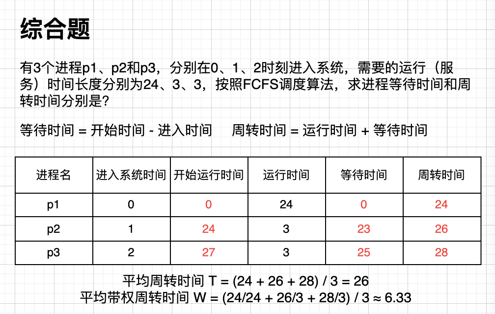
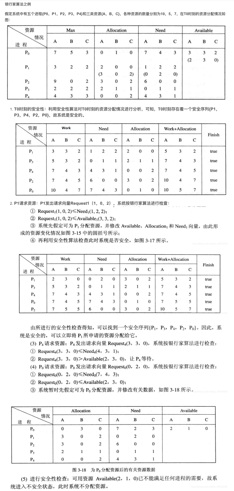
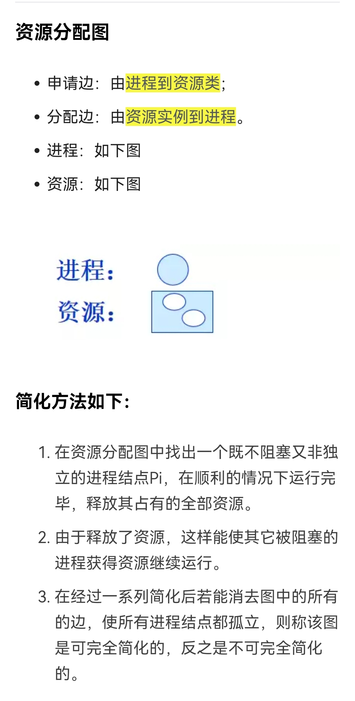

# 进程调度与死锁

1.  [进程调度的功能与时机](#进程调度的功能与时机)
2.  [进程调度算法](#进程调度算法)
3.  [实时系统中的调度](#实时系统中的调度)
4.  [进程切换](#进程切换)
5.  [多处理器调度](#多处理器调度)
6.  [死锁](#死锁)

## 进程调度的功能与时机

进程调度的功能：

*   进程调度功能由操作系统内核的进程调度程序完成。
*   进程调度的功能是按照某种策略和算法从就绪态进程中为当前空闲的CPU选择在其上运行的新进程。

进程调度的时机：当一个进程运行结束、进程阻塞、中断返回、在支持抢占式调度的系统中有比当前运行进程优先级更高的进程到来、当前运行进程的时间片用完，系统都会通过执行进程调度程序重新进行进程调度。

## 进程调度算法

进程调度算法：指从就绪态进程中选择一个进程为其分配CPU，使其进入执行态的算法。也就是说进程调度算法要“决定”把CPU分配给就绪队列中的哪个进程。

选择调度方式和算法的若干准则：周转时间短、响应时间快、截止时间的保证，系统吞吐量高和处理机利用率高。

*   周转时间是指从作业被提交给系统开始，到作业完成为止的这段时间间隔。包括作业在外存后背队列上等待调度的时间；进程从就绪队列上等待进程调度的时间；进程在CPU上执行的时间；进程等待I/O操作完成的时间。
*   如果系统中有n个作业，系统的平均周转时间等于n个作业的周转时间之和除以n。
*   作业的周转时间T与系统为它提供的服务时间Ts之比为W，W称为带权周转时间。
*   响应时间是指从用户提交一个请求开始直到系统首次产生响应的时间为止的一段时间。包括输入设备信息传送到处理机的时间、处理机对请求信息进行处理的时间，以及将所形成的响应信息回送到终端显示器的时间。
*   对于交互式系统，响应时间是衡量系统时间性能的重要指标。
*   截止时间是指某个任务必须开始执行的最迟时间，或必须完成的最迟时间，是评价实时系统性能的重要指标。
*   吞吐量是指单位时间内完成的作业数。
*   CPU是计算机系统中影响时间性能的最重要的硬件资源。在多任务系统中，进程调度算法对CPU的利用率有很大影响。因此，在选择和设计进程调度算法时应该考虑使CPU的利用率尽可能高。

调度算法：

*   先来先服务调度算法（First-Come，First-Serverd，FCFS）：
    *   在进程调度中，FCFS就是从就绪队列的队首选择最先到达就绪队列的进程，为该进程分配CPU。
    *   FCFS适合长进程，有利于繁忙的进程。
    *   
*   短进程优先调度算法（Shortest-Process-First，SPF）：
    *   短进程优先的调度算法是从就绪队列中选择估计运行时间最短的进程，将CPU分配给它，使它立即执行并一直执行完成，或发生某事件而被阻塞放弃处理机时，再重新调度。
    *   与FCFS算法相比，SPF算法能有效降低进程的平均等待时间，提高系统的吞吐量。
    *   对长进程不利，如果系统中不断有短进程到来，长进程可能长时间得不到调度。不能保证紧迫进程的及时处理，因本算法不考虑进程的紧迫程度。进程的长度由用户估计而定，可能有偏差。
*   优先权调度算法：
    *   在使用优先权调度的系统中，每个进程都有一个与之关联的优先权。当使用优先权调度算法进行进程调度时，系统将CPU分配给就绪队列中优先权值最高的进程。
    *   优先权调度算法：非抢占式优先权调度算法和抢占式优先权调度算法。
        *   非抢占式优先权调度算法：高优先权进程一旦得到处理机，便一直运行下去，直到完成或由于某事件使该进程主动放弃处理机。即使更高优先权进程到来，也不能剥夺当前进程CPU使用权，只能在就绪队列中等待。
        *   抢占式优先权调度算法：新到达的就绪进程与正在运行进程的优先权相比较，若新到达进程的优先权高于当前正在运行进程的优先权，则系统会抢占CPU，分配给新到达的进程，正在执行的进程暂停执行。
        *   抢占式优先权调度算法分为基于时钟中断的抢占和立即抢占：
            *   基于时钟中断的抢占式优先权调度算法：在高优先权的进程达到后，虽然该进程的优先权大于正在执行的进程，系统并不立即抢占当前进程的处理机，而是等到最近的一次时钟中断到来时，系统才剥夺当前进程的CPU，将CPU分配给新到来的优先权更高的进程。
            *   立即抢占的抢占式优先权调度算法：在这种调度策略中，一旦接收到触发进程运行的信号，通常是一个外部中断信号，系统立即剥夺当前进程的CPU，把它分配给新进程。这种算法比基于时钟中断的算法响应速度更快。
    *   优先权类型：静态优先权和动态优先权。
        *   静态优先权：在创建时确定，在进程的整个运行期间不变。
        *   动态优先权：在进程创建时被赋予的优先权，随进程的推进或随其等待时间的增加而改变。动态优先权调度算法可以使系统获得更好的调度性能。
    *   优先权调度算法存在的问题和解决方案：
        *   问题：无穷阻塞或称饥饿问题，指就绪态进程因得不到CPU而等待的状态。优先权调度算法可能使某个低优先权进程无穷等待。
        *   解决方案：老化（Aging）技术，逐渐增加在系统中等待时间很长进程的优先权。
*   时间片轮转调度算法：
    *   时间片轮转调度算法在现代分时系统中广泛使用，UNIX、Linux、Windows操作系统都采用基于时间片轮转、支持优先权和抢占式调度的混合式进程调度算法。
    *   时间片是一个较小的时间单位，通常为10～100ms。每当进程在CPU上连续运行的时间等于一个时间片长度时，操作系统在时钟中断处理过程中会抢占CPU，进行进程切换，用新的就绪进程替代当前进程，被替换的当前进程重新回到就绪队列中。
    *   时间片太长，可使多数进程在一个时间片内处理完，可降低进程的周转时间，但可能造成交互用户的响应时间过长。时间片太短，一个进程需要经过多次调度才能执行完，会增加进程切换和调度的开销，系统的平均周转时间也较长。
    *   设系统响应时间为T，进程数目为N，时间片为q，则有T=Nq。
    *   时间片大小的确定：系统对响应时间的要求，若要求响应时间越短，则时间片取值应该越小；在设定了系统的最长响应时间值后，时间片的大小就与系统允许的最大进程数成反比；必须保证系统支持的基本命令能在一个时间片内执行完。
    *   时间片轮转调度算法的性能评价：性能依赖于时间片的大小。时间片很大，与先来先服务算法一样；时间片很小，会增加CPU用于进程切换和进程调度的开销。
*   多级队列调度：根据进程不同的特点，系统中的就绪队列往往不止一个，系统通常根据不同进程对响应时间要求的不同，采用多级队列调度算法。算法会根据进程占用内存的大小、优先权或进程类型，将就绪队列分成多个独立队列，进程被永久地分配到一个队列，每个队列有自己的调度算法。
*   多级反馈队列调度：
    *   采用多级队列调度，降低了进程调度的开销，但对低优先权进程会存在无穷阻塞（饥饿）的问题，多级反馈队列调度算法可以弥补这些不足。
    *   在采用该算法的系统中建立了多个优先权不同的就绪队列，，为每个队列赋予大小不同的时间片。
    *   有一种反馈策略规定：队列优先权越高，时间片越短。新进程被创建后，先插入优先权最高的队列。仅当高优先权队列空时，才调度优先权次之的队列。同一队列中，采用时间片轮转调度算法。使用CPU时间过多的进程会被移到优先权较低的队列中，在较低优先权队列中等待时间过长的进程会被移到较高优先权队列中。

## 实时系统中的调度

实现实时调度的基本条件（主要满足对截止时间的要求）：

*   提供必要的调度信息：就绪时间、开始截止时间和完成截止时间、处理时间、资源要求和优先权。
*   需要系统处理能力强。在实时系统中，通常有多个实时进程，若处理机的处理能力不够强，处理速度不够快，导致某些实时进程不能及时得到处理，可能发生难以预料的后果。可通过提高处理机的处理能力或增加处理机的数量来提高系统的处理能力。
*   采用抢占式调度机制。
*   具有快速切换机制：对外部中断的快速响应能力；快速的进程切换能力。

常用的几种实时调度算法：

*   最早截止时间优先算法（EDF）：根据进程的开始截止时间确定进程的优先级，截止时间越早，进程的优先级越高，越优先获得处理机。
*   最低松弛度优先算法（LLF）：
    *   松弛度用来表示一个实时进程的紧迫程序。如果一个进程的完成截止时间为T，当前时间为Tc，处理完该任务还需要的时间为Ts，则松弛度L的计算公式为L=T-Tc-Ts。
    *   调度时，每次选择松弛度最小的进程。该算法按松弛度排序，让松弛度最小的进程排在就绪队列对首。

## 进程切换

当进程调度程序选择到一个新的进程后，要进行进程切换，用新选择的进程替换原来的进行进程，也就是把CPU的控制权交给由调度程序所选择的进程。

进程切换使当前正在执行的进程称为被替换的进程，出让其所使用的CPU，以运行被进程调度程序选中的新进程。

进程切换包括的步骤如下：

*   保存程序计数器和其他寄存器CPU上下文环境。
*   更新被替换进程的进程控制块。
*   修改进程状态，把执行态改为就绪态或阻塞态。
*   将被替换进程的进程控制块移到就绪队列或阻塞队列。
*   执行通过进程调度程序选择的新进程，并更新该进程的进程控制块。
*   更新内存管理的数据结构。
*   恢复被调度程序选中的进程的硬件上下文。

## 多处理器调度

多处理器系统的类型：

*   根据处理器的耦合程度，分为紧密耦合和松弛耦合：
    *   紧密耦合：在这个系统中，处理器共享内存模块；具有内存冲突；具有高数据速率；昂贵；通常出现在并行处理系统中。
    *   松弛耦合：在这个系统中，每个处理器都有自己的内存模块；不存在内存冲突；具有低数据速率；便宜；通常出现在分布式计算系统中。
*   根据处理器的结构，分为对称和非对称：
    *   对称：使用两个或多个共享公共内存空间的自调度处理器。所有处理器的优先级相同；操作系统任务可以由任何处理器完成；对称多处理的实现成本较高；对称多处理的设计很复杂。
    *   非对称：使用由一个主处理器处理的两个或多个处理器。所有处理器的优先级都不相同；操作系统任务由主处理器完成；非对称多处理的实现成本较低；非对称多处理的设计较简单。

多处理器系统中的进程分配方式：

*   对称多处理器系统中的进程分配方式分为静态分配和动态分配：
    *   静态分配：操作系统为每个处理器建立一个专门的就绪队列。
    *   动态分配：每个进程经过多次调度，每次获得的不一定是同一个处理器。
*   非对称处理器系统中的进程分配方式：采用主-从式操作系统，操作系统的核心部分驻留在一台主机上，而从机上只运行用户程序，只有主机执行调度程序，所有从机的进程都是由主机分配的。

进程（线程）的调度方式：

*   自调度：采用自调度的系统中设置了一个公共的就绪队列，任何一个空闲的处理器都可以自行从该就绪队列中选取一个进程或者一个线程运行。
*   成组调度：系统将一组相互合作的进程或线程同时分配到一组处理器上运行，进程或线程与处理器一一对应。

## 死锁

产生死锁的原因和必要条件：

*   在多道程序系统中，多个进程可能竞争数量有限的资源。若一个进程所申请的资源被其他处于阻塞状态的进程占有，该进程就会因为不能获得所申请的资源而被阻塞。若此时该进程恰好又占有了前述其他进程所需要的资源，那么这一组进程就可能因为等待释放自己所需要但被其他进程已占有的资源而无法向前推动。这种由于多个进程竞争共享资源而引起的进程不能向前推进的僵持状态称为死锁。
*   进程访问资源是通过执行程序实现的。一般进程按照申请、访问和释放资源的顺序使用资源。
*   产生死锁的原因：竞争共享资源且分配资源的顺序不当。
*   产生死锁的必要条件：
    *   互斥条件：指一个进程在访问资源的过程中，其他进程不能访问该资源。
    *   请求和保持条件：进程已经保持了至少一个资源，又提出了新的资源要求，而新请求的资源已经被其他进程占有，此时进程阻塞，但又对已经获得的资源保持不放，使得其他进程无法使用被保持的资源。
    *   不剥夺条件：进程已经获得的资源不能被剥夺，只能由进程自己释放。
    *   环路等待条件：在发生死锁时，必然存在一个进程申请资源的环形链。
    *   注意：只有上述4个条件同时满足时才会发生死锁。

处理死锁的基本方法：

*   处理死锁的基本方法有预防死锁、避免死锁、检测并解除死锁和忽略死锁问题（即假定死锁不可能在系统内发生而忽略死锁）。为确保不发生死锁，操作系统可以采用死锁预防或死锁避免方案。
*   死锁的预防：通过保证至少其中一个条件不成立来达到预防发生死锁的目的。有些共享资源必须被定义为临界资源，对于这些资源的访问必须是互斥的。因此互斥条件不能摒弃预防死锁可以通过摒弃下列三个必要条件之一来实现：
    *   摒弃请求和保持条件：系统要求所有进程执行前要一次性地申请在整个运行过程中所需要的全部资源，只要有一个资源申请不成功，其他所有资源也不分配给该进程，并阻塞该进程。
    *   摒弃不剥夺条件：一个已保持了某些资源的进程，当它再提出新的资源要求而不能立即得到满足时，必须释放它已经保持的所有资源。
    *   摒弃环路等待条件：进程必须按规定的顺序申请资源。对所有不同类型的资源排序，要求每个进程按规定的顺序申请资源。
*   死锁的避免：避免死锁的方法是把系统的资源分配状态分为安全状态和不安全状态。系统在资源分配之前，先计算资源分配的安全性。只要资源分配使系统资源分配状态处于安全状态，死锁就不会发生；若处于不安全状态，便拒绝进程的资源请求，并将进程阻塞起来。在避免死锁的方法中，允许进程动态地申请资源。
    *   系统的安全状态：当系统能找到一个进程执行序列，使系统只要按此序列为每个进程分配资源，就可以保证进程的资源分配和执行顺利完成，不会发生死锁时，称系统处于安全状态。若系统不存在这样的安全序列，则称系统处于不安全状态。
    *   系统的安全状态和死锁的关系：不安全状态不一定是死锁状态，但当系统进入不安全状态之后，便可能进入死锁状态，反之，只要系统处于安全状态，系统可避免进入死锁状态。因此，避免进程死锁的实质在于使系统处于安全状态。

银行家算法：

*   Dijkstra提出的一种能够避免死锁的资源分配算法。其基本思想是一个进程提出资源请求后，系统先进行资源的试分配。然后检测本次的试分配是否使系统处于安全状态，若安全则按试分配方案分配资源，否则不分配资源。
*   银行家算法的由来是银行家贷款给客户这一问题。银行家（操作系统）把一定数量的资金（资源）供多个用户（进程）周转使用。当顾客对资金的最大申请量不超过银行家现金时就可接纳一个新顾客。银行可以对顾客的借款推迟支付，但一定使顾客总能在有限的时间内得到借款；当顾客得到全部资金后，他一定能在有限的时间里归还（回收）所有资金（资源）。
*   银行家算法中的数据结构：用m表示系统中资源的种类数，n表示系统中的进程数。
    *   available[]是一个含有m个元素的一维数组，其中的每一个元素代表一类可利用的资源数目，其初始值是系统中所配置的该类全部可用资源的数目，其数值随该类资源的分配和回收而动态地改变。如果Available[j]=K，则表示系统中现有Rj类资源K个。
    *   max[]是一个n行m列的二维数组，它定义了系统中n个进程中的每个进程对m类资源的最大需求。如果Max[i,j]=K，则表示进程i需要Rj类资源的最大数目为K。
    *   allocation[]是一个n行m列的二维数组，它定义了系统中每一类资源当前已分配给每一进程的资源数。如果Allocation[i,j]=K，则表示进程i当前已分得Rj类资源的数目为K。
    *   need[]是一个n行m列的二维数组，用以表示每一个进程尚需的各类资源数。如果Need[i,j]=K，则表示进程i还需要Rj类资源K个方能完成其任务。
    *   上述三个二维数组（矩阵）存在以下关系：Need[i,j]=Max[i,j]-Allocation[i,j]。
*   银行家算法的具体过程：一是进程资源试分配的过程；二是对试分配后系统的状态做安全性检测的过程。
    *   进程资源试分配：设Requesti是进程Pi的请求向量，如果Requesti[j]=K，表示进程Pi需要K个Rj类型的资源。当Pi发出资源请求后，系统按下述步骤进行检查：
        *   1.如果Requesti[j] ≤ Need[i,j]便转向步骤2，否则认为出错，因为它所需要的资源数已经超过它所宣布的最大值。
        *   2.如果Requesti[j] ≤ Available[j]便转向步骤3，否则表示尚无足够资源，Pi需要等待。
        *   3.系统试探着把资源分配给进程Pi，并修改下面数据结构中的数值。Available[j] = Available[j] - Requesti[j];Allocation[i,j] = Allocation[i,j] + Requesti[j];Need[i,j] = Need[i,j] - Requesti[j]。
        *   系统执行安全性算法，检查此次资源分配后系统是否处于安全状态。若安全，才正式将资源分配给进程Pi，以完成本次分配；否则，将本次的试探分配作废，恢复原来的资源分配状态，让进程Pi等待。
    *   安全性检测：设Work是工作向量，它表示系统可提供给进程继续运行所需的各类资源数目，它含有m个元素，在执行安全算法开始时，Work = Available。设Finish是完成向量，它表示系统是否有足够的资源分配给进程，使之运行完成。开始时先做Finish[i] = false，当有足够资源分配给进程时，再令Finish[i] = true。
        *   1.从进程集合中找到一个能满足下述条件的进程：Finish[i] = false;Need[i,j] ≤ Work[j]。若找到执行步骤2，否则执行步骤3。
        *   2.当进程Pi获得资源后，可顺利执行，直至完成，并释放出分配给它的资源，故应执行：Work[j] = Work[j] + Allocation[i,j];Finish[i] = true;go to step 1。
        *   3.如果所有进程的Finish[i] = true都满足，则表示系统处于安全状态；否则，系统处于不安全状态。
*   

死锁的检测和解除：

*   操作系统可以不采取事先预防和避免的方法来解决死锁问题，而是检测是否有死锁发生。如果检测到系统中有死锁的进程，则解除死锁。
*   死锁定理（用于检测系统所处的资源分配状态是否为死锁状态）：死锁状态的充分条件是当且仅当资源分配状态是不可完全简化的。
*   
*   解除死锁的两个途径：一是终止处于死锁状态的进程；二是抢占死锁进程占有的资源。

例题：某系统中有n（n为大于1的整数）个并发进程，每个进程需要同类资源m（m为大于0的整数）个，该系统不会发生死锁的最少资源数是n*(m-1)+1。
