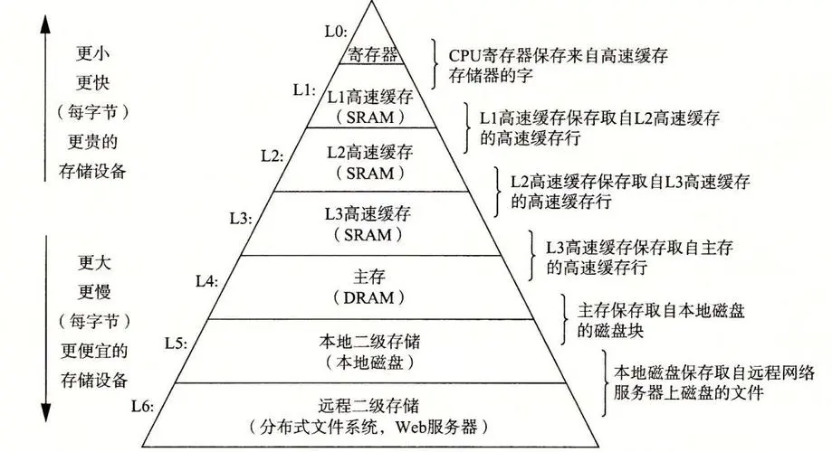
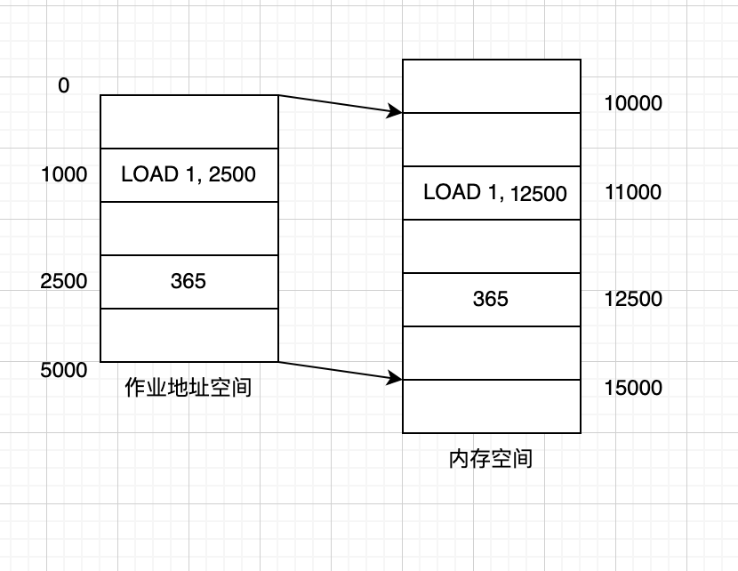
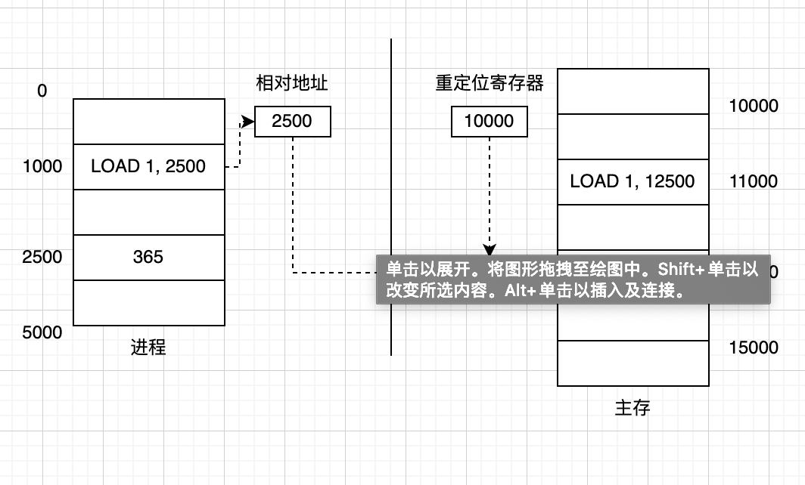
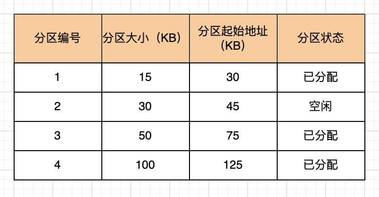
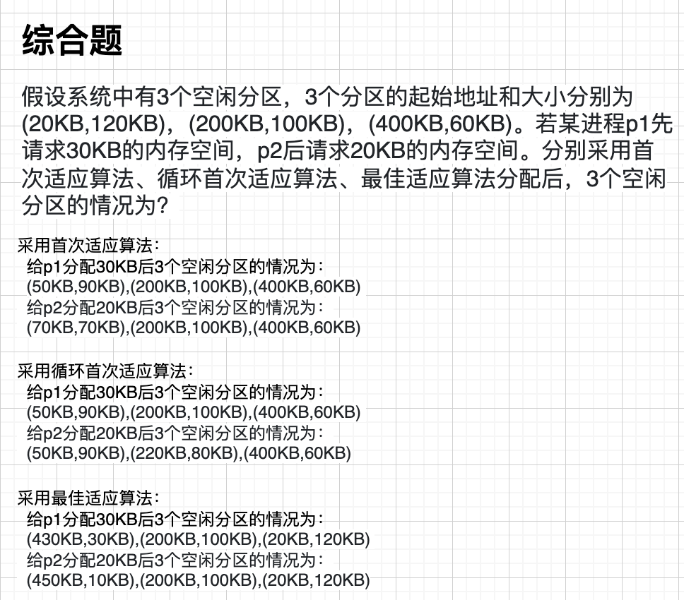
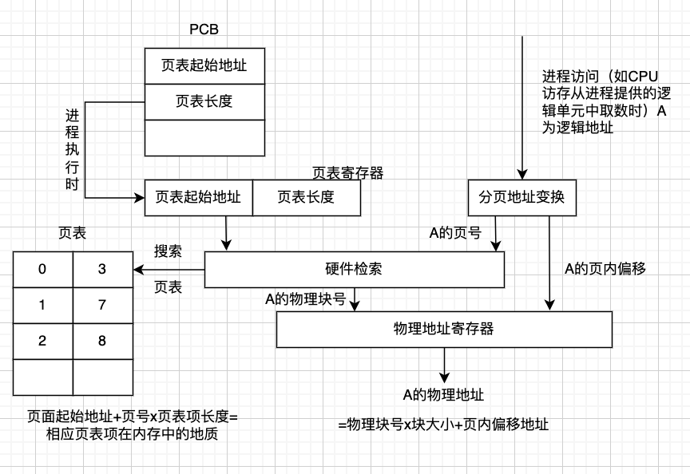
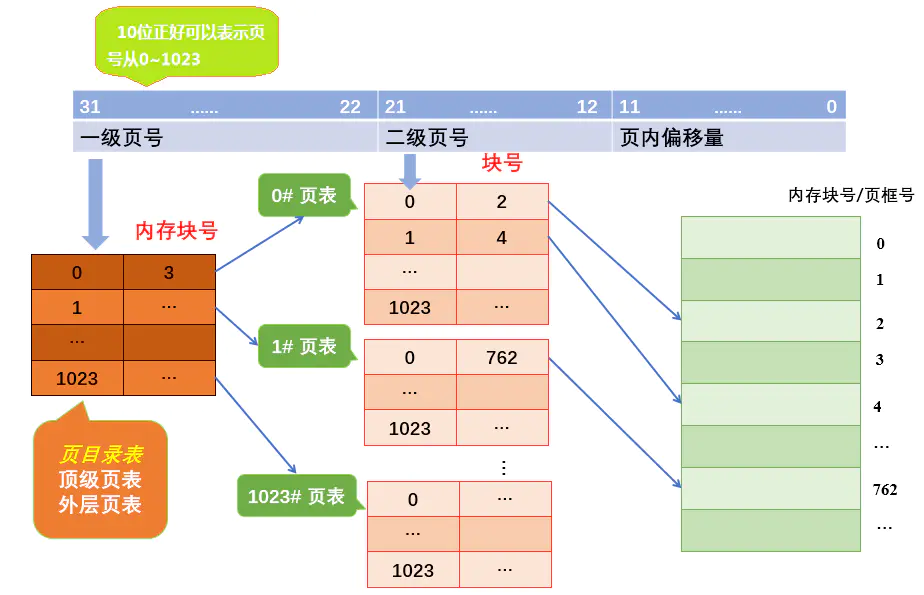
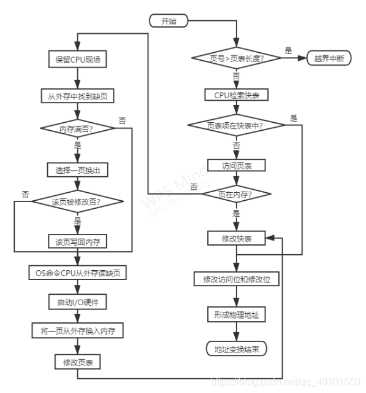
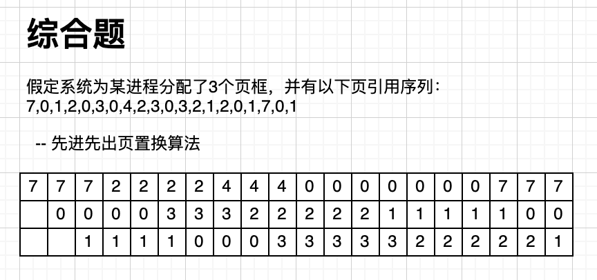

# 内存管理

1.  [存储器的层次结构](#存储器的层次结构)
2.  [程序的链接和装入](#程序的链接和装入)
3.  [连续分配存储管理方式](#连续分配存储管理方式)
4.  [基本分页存储管理](#基本分页存储管理)
5.  [基于分页的虚拟存储系统](#基于分页的虚拟存储系统)
6.  [分段存储管理](#分段存储管理)

## 存储器的层次结构

存储器系统是一个具有不同容量、成本和访问时间的存储设备的层次结构。

在这个层次系统中，共分为六层（L0～L6），L0为最高层，L6为最底层。在最高层（L0层），是少量的快速CPU寄存器，CPU可以在一个时钟周期内访问它们。L1、L2、L3层是一个或多个小型或中型的基于SRAM的高速缓存存储器，可以在几个CPU时钟周期内访问它们。L4层是一个大的基于DRAM的主存，可以在几十或几百个时钟周期内访问它们。L5层是慢速但容量很大的本地磁盘，可能需要两千万个时钟周期来访问它们。L6层表示有些系统可能还包括一层附加的远程服务器上的磁盘，需要通过网络来访问。

CPU中寄存器保存最常用的少量数据，靠近CPU的容量小、速度快的高速缓存存储器作为速度相对较慢（相对于寄存器而言）、容量较大的主存中数据和指令子集的缓冲区。

在编写程序、设计算法时尽可能把最近将要访问的指令或数据存储在层次较高的地方，以便让CPU更快地访问到它们。

局部性原理：

*   程序在执行时呈现出局部性规律，即在一段较短的时间内，程序的执行仅局限于某个部分，相应地，它所访问的存储空间也局限于某个区域。
    *   程序在执行时，除了少部分的转移和过程调用指令，大多数情况下是顺序执行。
    *   过程调用将会使程序的执行轨迹由一部分内存区域转移到另一部分内存区域。
    *   程序中存在很多循环结构，它们虽然由少数指令构成，但多次执行。
    *   程序中往往包括许多对数据结构的处理，如对数组的操作，它们往往都局限在很小的范围内。
*   时间局部性和空间局部性：
    *   时间局部性：如果程序中的某条指令一旦执行，则不久后该指令可能再次执行。
    *   空间局部性：一旦程序访问了某个单元，不久后，其附近的存储单元也将被访问。

## 程序的链接和装入

高级语言程序必须经过编译、链接才能成为可执行程序。

程序的链接：链接程序要解决的问题是将编译后的目标模块装配成一个可执行的程序。根据链接进行的时间和实现方式的不同，可以把链接分为静态链接和动态链接。

*   静态链接：在程序运行前，用链接程序将目标模块链接成一个完整的装入模块。静态链接程序运行速度快，但占用内、外存空间大。
*   动态链接：可将某些目标模块的链接推迟到这些模块中的函数被调用执行时才进行。即在程序执行时，若发现一个被调用模块尚未链接，再把它链接到调用者模块上。采用动态链接节省内、外存空间，方便了程序开发，但速度变慢。

将一个用户源程序变为一个可在内存中执行的程序，须经过编译、链接和装入3个阶段。

程序的装入：可执行程序以二进制可执行文件的形式存储在磁盘上，为执行程序，操作系统需要把程序调入内存。程序装入内存的方式分为绝对装入方式、可重定位装入方式（静态重定位）和动态运行时装入方式（动态重定位）。

*   绝对装入方式：编译程序事先已知程序在内存中的驻留位置，编译时产生物理地址的目标代码，绝对装入程序按照装入模块的物理地址将程序和数据装入内存。只适用于单道程序的运行环境（单道批处理那时候没有操作系统，所以就是编译程序来干转换地址的事情）。
*   可重定位装入方式（静态重定位）：如果编译时不知道目标程序将驻留在内存的什么位置，则编译时就必须生成可重定位的代码，其中的地址都是逻辑地址，在程序被装入内存时，再把这些逻辑地址映射为物理地址。在程序装入时对目标程序中的指令和数据地址的修改过程称为重定位。
    *   如程序在逻辑地址（相对地址）为1000的单元中有一条指令LOAD 1,2500。该指令的含义是将逻辑地址为2500处的内容取出装入1号寄存器，逻辑地址2500的单元中装有数据365，若采用重定位方式将该指令装入内存实际物理地址从10000开始的内存单元，就必须修改用户程序在物理内存中的实际地址。
    *   
*   动态运行时装入方式：进程在装入内存后，还可能从内存的一个区域移动到另一个区域，这种情况可能发生在支持虚拟存储的系统中。一个进程在被换出之前所在的内存位置与后来被从外存重新调入时内存位置不同。
    *   在采用动态运行时装入方式的系统中，在进程运行访存的过程中才进行地址转换，需要重定位寄存器的支持。当进程获得CPU时，系统把该进程在内存的起始地址存入重定位寄存器，进程在运行过程中访存时，通过重定位寄存器与被访问单元的逻辑地址计算出物理地址。
    *   

## 连续分配存储管理方式

连续分配是指操作系统分配内存时，为每个进程分配一块物理地址连续的内存空间，连续分配方式有3种类型：单一连续区分配方式、固定分区分配方式和动态分区分配方式。

*   单一连续区分配方式：内存中只有一个用户区，任意时刻内存中只能装入一道程序，这种分配方式只适用于单用户、单任务系统。
*   固定分区分配方式：将内存用户区划分成若干个固定大小的区域，每个区域中驻留一道程序。
*   动态分区分配方式：系统动态地对内存进行划分，根据进程需要的空间大小分配内存。内存中分区的大小和数量是变化的。动态分区方式比固定分区方式显著地提高了内存利用率。

单一连续分配：

*   适用于单用户、单任务的操作系统，把内存分为系统区和用户区。系统区仅供操作系统使用，用户区供用户使用。系统区用于驻留操作系统，用户区用于分配给用户进程使用。
*   为了防止用户程序对操作系统的破坏，保证系统的安全、可靠，在操作系统中设置存储保护机制。在单用户、单任务操作系统中较常用的方法是设置一个基址寄存器和一个界限寄存器。基址寄存器中存放程序在物理内存中的最小地址，界限寄存器中存放装入用户区程序的地址范围。在CPU访问内存时，检查CPU要访问的内存单元的地址是否大于界限寄存器的值，如果大于，则是非法地址，表示用户进程访存越界，程序执行会被中断。

固定分区分配：

*   将用户内存空间划分为若干个固定大小的区域，在每个用户区中可以装入一道用户程序。内存的用户区域划分成几个分区，便允许几个进程并发执行。当有一个空闲分区时，可从外存的后备队列中选择一个大小适当的作业装入该分区。当该作业结束时，释放所占用的分区，系统又可从后备作业队列中找出另一个作业调入该分区。
*   固定分区分配的用户分区数量是固定的，每个分区的大小也是固定的。但是每个分区的大小可以相等，也可以不相等。
    *   分区大小相等：把用户区划分成大小相等的若干个分区，缺点是内存利用率比较低。当程序太小时，该程序所占用的分区有很大一部分空间是空闲的。而程序较大时，可能找不到一个分区足以装下该程序。
    *   分区大小不相等：为了更好地利用内存，可以将用户区划分成大小不同、数量固定的若干个分区。为用户进程分配空间时，把大小最接近进程大小的空闲分区分配给申请内存空间的进程。使小进程占小分区，大进程占大分区，减少内存浪费。
*   

动态分区分配：

*   动态分区分配时根据进程的实际需要，为进程分配大小合适的内存区域。系统中用户分区的数量和大小都是动态变化的。
*   动态分区分配原理：系统初始只有一个大空闲区，当进程请求空间时，由系统根据进程需要的空间大小划分出一片空闲区分配给进程。系统运行一段时间后，内存的空闲区可能散布在不连续的区域。系统维护一个记录当前空闲分区情况的数据结构，当进程请求内存时，系统从所有空闲区中找到大小合适的空闲分区进行分配。系统中分区的大小和数量都是变化的，空闲区的大小和数量也是变化的。
*   动态分区分配中的数据结构：空闲分区表和空闲分区链。
    *   空闲分区表：系统在空闲分区表中为每一个空闲分区建立一个表项，每个表项中包含分区编号、大小和起始地址。使用空闲分区表的缺点是，若设置太多表项，会浪费内存空间；设置太少的表项，当空闲分区较多时，无法记录所有空闲分区的情况。在实现时，结构体的大小不容易确定。
    *   空闲分区链：可以动态地为每一个空闲分区建立一个结点，每个结点包括分区大小、分区起始地址、指向前一个空闲分区结点的指针，以及指向后一个空闲分区结点的指针。空闲分区链中的每个结点占用的内存可以动态分配，动态回收。
*   动态分区分配算法：当进程需要内存空间时，操作系统通过执行动态分区分配算法从多个空闲分区中选定一个合适的分区分配给进程。
    *   首次适应算法FF（First Fit）：要求空闲分区链以地址递增的顺序链接。在进行内存分配时，从链首开始顺序查找，直至找到一个能满足进程大小要求的空闲分区为止。然后，再按照进程请求内存的大小，从该分区中划出一块内存空间分配给请求者，余下的空闲分区仍留在空闲链中。该算法先分配低地址部分的内存空间，容易使低地址部分留下小分区，而高地址部分大空闲区较多。当进程请求大空间时，要找到合适的空闲分区，时间开销大。而低地址部分的空闲分区反复被划分，可能留下许多难以利用的很小的空闲分区，这种小空闲区被称为外部碎片或外碎片。分配给进程的分区若大于进程请求的分区，分区内会存在一部分不被利用的空间，这部分被浪费的空间称为内部碎片或内碎片。
    *   循环首次适应算法NF（Next Fit）：为进程分配内存空间时，不再每次从链首开始查找，而是从上次找到的空闲分区的下一个空闲分区开始查找，直到找到第一个能满足要求的空闲分区，并从中划出一块与请求的大小相等的内存空间分配给进程。为实现该算法，应设置一个起始查找指针，以指示下一次起始查找的空闲分区，并采用循环查找方式。循环首次适应算法的优点是空闲区分布均匀，查找开销较小。缺点是容易使系统缺乏大空闲区。
    *   最佳适应算法BF（Best Fit）：该算法每次为作业分配内存，总是把大小与进程所请求的内存空间大小最接近的空闲分区分配给进程，避免了“大材小用”。为了加速寻找，该算法要求将所有的空闲区按分区大小递增顺序形成一个空闲区链。
    *   
*   动态分区分配的流程：采取动态分区分配的内存管理方式，内存分配功能由内存分配程序完成，内存分配程序采用某种内存分配算法为进程分配内存。内存不再被应用程序需要时，由系统调用内存回收程序回收原来被占用的内存分区。
    *   内存分配流程：如果进程申请的内存空间大小为u.size，当前结点对应的空闲分区大小为m.size，size是系统规定的一个域值。当系统接收到申请内存的请求后，检索空闲分区链，找到满足条件m.size ≥ u.size的空闲区。如果m.size - u.size ≤ size，则直接把该空闲分区分配给进程。否则，从m.size中划分大小为u.size的空间分配给进程，把剩余的大小为m.size-u.size的空闲空间作为新的空闲分区。然后将分配给进程的分区起始地址返回给内存分配程序的调用者，修改空闲分区链表。
    *   内存回收流程：释放一块连续的内存区域。如果被释放区域与其他空闲区相邻，合并空闲区。修改空闲分区链。
        *   如果被释放的内存区域与其他任何的空闲区都不相邻，则为该回收区建立一个空闲区链的结点。使新建结点的起始地址字段等于回收区起始地址，空闲分区大小字段等于回收区大小。根据内存分配程序使用的算法要求，把新建结点插入空闲分区链的适当位置。
        *   如果被释放区域与其他空闲区相邻，需要进行合并，分为三种情况：仅回收区的前面有相邻空闲分区R1，把回收区与R1合并成一个空闲分区，将R1的起始地址作为新分区的起始地址，分区大小修改为R1与回收区大小之和；仅回收区的后面有相邻空闲分区R2，把回收区与R2合并成一个空闲分区，将回收区的起始地址作为新分区的起始地址，分区大小修改为R2与回收区大小之和；仅回收区的前、后有相邻空闲分区R1、R2，把回收区与R1、R2合并成一个空闲分区，将R1的起始地址作为新分区的起始地址，分区大小修改为R1、R2与回收区三者大小之和，删除与R2分区对应的空闲分区结点。

## 基本分页存储管理

把进程离散地存储在内存中物理地址不连续的区域中，这种内存管理方式称为离散内存管理方式。根据离散内存管理分配内存空间的基本单位不同，分为3种管理方式：分页存储管理、分段存储管理和段页式存储管理。

分页存储管理的基本原理：

*   基本概念：
    *   页（Page）：将一个进程的逻辑地址空间分成若干个大小相等的片，称为页。
    *   页框：将物理内存空间分成与页大小相同的若干个存储块称为页框或页帧。
    *   分页存储：在为进程分配内存时，以页框为单位将进程中的若干页分别装入多个可以不相邻的页框中。
    *   页内碎片：进程的最后一页一般装不满一个页框，形成了不可利用的碎片，称为“页内碎片”。
    *   页表：页表是系统为进程建立的数据结构，页表的作用是实现从页号到页框号的映射。即记录了相应页在内存中对应的页框号。在基本的分页机制中，每个进程有一个页表，进程的每一个页在页表中有一个对应的页表项。页表在内存中连续存放。
*   基本分页存储管理方式中的地址结构：
    *   基本分页的逻辑地址结构包含两部分：页号P和页内偏移量W。若用m位表示逻辑地址，页大小为2n字节，则用低n位表示页内偏移量W，用高m-n位表示页号P。
    *   以32位地址为例：可用0～11位表示页内偏移，n=12，页大小=页框大小=4KB。12~31位（20位）表示页号，共可有220个页即1M个页。这种地址结构可以表示4G的逻辑地址空间。
    *   若A位逻辑地址，L为页大小，P为页号，W为页内偏移量，则有如下计算关系P=INT(A/L)，W=MOD(A/L)。
    *   示例：已知逻辑地址A为0x503200A0，页大小为4KB，请问该逻辑地址对应的页号和页内偏移地址？逻辑地址A为0x503200A0为十六进制，其对应的二进制为0101 0000 0011 0010 0000 0000 1010 0000B，高20位0101 0000 0011 0010 0000为页号，低12位0000 1010 0000为页内偏移地址。
*   分页地址变换：为了能将用户地址空间中的逻辑地址变换为内存空间中的物理地址，在系统中必须设置地址变换机构，该机构的基本任务是实现逻辑地址到物理地址的变换。
    *   进程执行时，PCB中页表起始地址和页表长度送CPU的页表寄存器。CPU访问逻辑单元A。由分页地址变换硬件自动将A分为页号和页内偏移两部分。由硬件检索页表，得到A所在的页对应的页框号。页框号和页内偏移地址送物理地址寄存器，计算物理地址。
    *   
*   页大小的选择：在分页系统中，页的大小是由机器的体系结构和操作系统共同决定的。若页较小，页表较长，页表需要占的内存空间较大，而且页换入、换出频繁；若页较大，页内碎片会增大。一般页的大小为2的整数次幂，目前的计算机系统中，大多选择4KB大小的页。

快表：

*   现在的计算机系统基本上都把页表存放在内存中，CPU要访问内存读写数据或读取指令，必须访问两次内存。第一次访问内存，从内存页表中获取访存单元所在的页框号，以形成访存单元的物理地址。第二次访存是根据计算出的物理地址实现对内存单元的访问，读写数据或读取指令。为了减少CPU在有效访存上的时间开销，提高访存速度，在硬件上引入了快表机制。
*   快表也称转换后援缓冲（TLB），是为了提高CPU访存速度而采用的专用缓存，用来存放最近被访问过的页表项。
*   引入快表之后的地址变换过程：CPU产生分页的逻辑地址页号和页内偏移后，将该逻辑地址的页号提交给快表。查找快表，如果找到页号，则把该页所在的页框号用于形成物理地址。否则（快表失效）查找内存页表，从内存页表中找到相应的页表项，读取页所在的页框号，以形成物理地址。如果所查找的页表项不在快表中，在访问完内存页表后，要把找到的页表项中的页号和页框号写到快表中。如果快表中的条目已满，系统会根据某种策略（如最近最少使用替换）选择一个快表中的条目，用刚访问的页表信息替换选中的这个快表条目。
*   引入快表的性能分析：在快表中找到某一个页号对应的页表项的百分比称为快表命中率。当能在快表找到所需要的页表项时，有效访存时间等于一次访问快表的时间加上一次访问内存的时间，当没有在快表中找到所需要的页表项时，访存时间等于一个访问快表时间加上两次访问内存的时间。
*   示例：若CPU访问内存的速度为120ns，访问快表的速度为20ns，快表的命中率为90%，试比较有快表和无快表系统的平均有效访问时间？有快表系统：(120+120+20)x10%+(120+20)x90%=152ns；无快表系统：120+120=240ns。

二级和多级页表：

*   二级页表：将页表再进行分页，使每个页表分页的大小与内存页框的大小相同，并为它们编号。将这些页表分页分别放入不同的、不一定相邻的页框中，为离散分配的页表再建立一张外层页表，本书称之为页目录表，页目录表中的每个表项中记录了页表分页所在的页框号。
*   
*   逻辑地址 = 页目录号 + 页号 + 页内偏移地址。

反置页表：现代系统中可能存在大量进程，每个进程都允许很大的逻辑地址空间，因而进程可能拥有一个很大的页表，这些页表会占用大量的物理内存空间。为了解决这个问题，可以使用反置页表，为每一个页框设一个表项，表项中存放进程号和页号。系统只维护一张反置页表即可。由于物理存储空间小于逻辑存储空间，所以使用反置页表减少了页表占用的内存空间。

空闲页框的管理：操作系统需要跟踪和记录空闲页框的信息，管理空闲页框的方式有如下两种。

*   位图：使用位图管理空闲页框时，使位图中的每一位对应一个页框，具有N个页框的内存需要至少有N个二进制位的位图。当某个二进制位对应的页框被占用时，将该位置1。当该页框空闲时，该位置0。当操作系统为进程分配页框时，检索位图，找对应位为0的页框分配给进程。
*   链表：使用空闲页框链表时，系统维护记录空闲页框信息的链表。空闲页框链表可以按地址递增的顺序排序，每个结点中包含页框的地址信息、指向后面结点的指针和指向前面结点的指针。

## 基于分页的虚拟存储系统

虚拟存储器是指具有请求调入功能和置换功能，能从逻辑上对内存容量进行扩充的一种存储器系统。

在虚拟存储器系统中，进程无需全部装入，只要装入一部分即可运行。

虚拟存储技术实现的思想是，只把进程的一部分装入内存。进程执行过程中，CPU访问内存时如果发现所访问的内容不在内存中，则通过异常处理将所需要的内容从外存调入内存。即先将进程的一部分装入内存，其余的部分需要的时候再请求系统装入，这就是请求调入。如果请求调入时，没有足够的内存，则由操作系统选择一部分内存中的内容换到外存，这就是置换。

虚拟存储系统具有以下几个主要特征：

*   离散性：指进程可以分散地存储在物理内存中。分页、分段和段页式存储都属于离散的内存管理方式。离散性是实现虚拟存储管理的基础。
*   多次性：指不必把进程一次性全部装入内存，可分多次装入。
*   对换性：指在内存中的进程可以换出，以腾出内存空间换入外存中的进程。
*   虚拟性：指虚拟存储系统为用户提供了比实际物理内存大的逻辑内存空间，程序员不必在编程时受物理内存空间大小的限制。虚拟性是实现虚拟存储系统的最重要目标。

请求分页系统：

*   请求分页系统是最基本、最常用的虚拟存储系统的实现方式。其基本原理是，把进程的逻辑地址空间分成大小相同的页，操作系统创建进程时只把进程的一部分页调入内存。进程运行过程中访问内存、若发现所访问的页不在内存中，则产生一个缺页异常信号，系统响应缺页异常，请求调入缺页。若调入缺页时内存已满，则需要先从内存中选择一个或若干个页换出到外存空间，以腾出内存空间容纳请求调入的缺页。
*   请求分页中的硬件支持：为了实现请求分页，需要特殊的页表（相对基本分页而言)、缺页异常机构和支持请求分页的地址变换机构。
    *   页表：是支持请求分页系统最重要的数据结构，其作用是记录描述页的各种数据，包括在实现逻辑地址到物理地址映射时需要的页号与页框号的对应关系。
        *   除了页号和页框号之外，页表中增加了请求调入和页置换时需要的数据。
        *   一般包含以下基本字段：页框号（存放页所在的页框号）；状态位P（标识页是否在内存中，可规定0不在，1在）；访问字段A（用于记录页最近被访问的情况，系统总是希望根据A的值把最近、最久未访问的页换出到外存）；修改位M（标识页最近是否被修改过）；保护位（标识页的访问权限，如1表示可读可写，0表示只读）。
    *   缺页异常机构：主要作用是在访问内存过程中发现缺页时产生缺页异常信息，使CPU中断当前控制流的执行，转去执行操作系统的缺页异常处理程序，完成请求调页。
    *   地址变换：由分页地址变换机构从逻辑地址中分离出页号和页内偏移地址；以页号为索引查找快表，若快表中有该页的页表项，则读出页框号，计算物理地址；若快表中无该页信息，转到内存页表中查找。若页表中的状态位P显示该页已调入内存，则从相应的页表项读出页所在的页框号，并计算物理地址，然后把该页表项写入快表；若该页尚未调入内存，则产生缺页异常，请求操作系统从外存中把该页调入内存，然后修改页表，重新执行被中断的指令。
    *   
*   页分配策略：
    *   最少页框数：指能保证进程正常运行所需要的最少的页框数。为了保证进程顺利执行，操作系统为进程分配的初始页数应该大于或等于最少页框数。
    *   何时调入页：大多数系统都采用预先调入页的策略，将预计不久之后会被访问的页预先调入内存，而不是缺哪一页时再调入该页。在实际系统中，通常是在调入缺页时，把与所缺页相邻的若干页也调入内存。
    *   从何处调入页：当系统拥有足够的对换空间时，若发生缺页请求，则从对换区调入页。从对换区调入页比从文件区调入页的速度快。对换区中的页是进程运行前从文件区复制到对换区的。
*   页置换算法：是从内存中选择换出页的算法。
    *   最佳置换算法：选择以后永远不会被访问的页或者在未来最长时间内不再被访问的页作为换出页。该算法主要用于理论研究。
    *   先进先出页置换算法：为每个页记录该页调入内存的时间，当选择换出页时，选择进入内存时间最早的页。实现简单，但效率低，会导致较高的缺页率，有的页刚被换出，可能又要立即被访问。
    *   最近最久未使用LRU置换算法：选择最近最久未使用的页换出。同样的页引用序列，LRU算法置换次数较先进先出算法少，性能较好。
    *   其他置换算法：附加引用位算法、简单Clock置换算法、改进型Clock算法、最少使用置换算法。
    *   
*   性能分析：请求调入和置换技术都是以时间换空间的技术。
    *   缺页率对有效访问时间的影响：进程执行中访存发生缺页时，需要请求从外存调入缺页。如果内存中没有空闲页框，还需要进行页置换，调入缺页后，指令需要重新执行。因此，一旦发生缺页，进程会存在因为访存而带来的时间延迟。有效访问时间正比于缺页率。
    *   工作集：引入工作集机制是为了能有效降低缺页率，从而提高访存的时间效率。程序运行时对页的访问是不均匀的，往往在某段时间内集中于访问某些页。若能将某段时间间隔内要访问的页提前调入内存，将会大大降低缺页率，从而减少置换次数，提高CPU的利用率。工作集就是在某段时间间隔内，进程实际要访问的页的集合。
    *   抖动产生的原因：多道程序度太高，使运行进程的大部分时间都用于进行页的换入、换出，而几乎不能完成任何有效工作的状态称为抖动。引起抖动的原因是系统中的进程数量太多，每个进程能分配到的页框太少，以至于进程运行过程中频繁请求调页。
    *   抖动的预防：采取局部置换策略，仅在进程自己的内存空间范围内置换页；在CPU调度程序中引入工作集算法；挂起若干进程，腾出进程占用的空间。

## 分段存储管理

分段机制的引入：

*   在分页存储管理方式中，逻辑地址是一维的，一个进程的逻辑地址形成一个地址空间。这种逻辑空间的使用方式对于程序员来说很不方便，分段能为进程提供多个地址空间，把逻辑上关联的部分放在一个地址空间中，逻辑上没有关联也没有共同特征的部分放在不同的地址空间中。这样不仅方便用户编程，而且能很好地解决部分存储空间动态增长、信息共享和信息保护问题。
*   把分别存放逻辑上相关的信息、相互独立的逻辑地址空间称为一个段，每个段由一个从0到最大线性地址的逻辑地址空间构成。各个段的长度可以是0到最大值之间的任何一个值，不同段的长度可以不相同，段的长度在进程运行期间可以改变。
*   在使用分段存储管理的系统中，程序员使用二维的逻辑地址，一个数用来表示段，另一个数用来表示段内偏移。段是一个逻辑实体，程序员可以通过使用二维地址来访问不同的逻辑段。一个段可能包括一个过程，或者一个数组、一个堆栈、一些数值变量，但是一般不会同时包含多种不同的内容。

分段系统的基本原理：

*   分段：在分段的存储管理方式中，进程的地址空间被划分成若干个段。每个段定义了一组逻辑信息，每个段的大小由相应的逻辑信息组的长度确定，段的大小不一样，每个段的逻辑地址从0开始，采用一段连续的地址空间。系统为每个段分配一个连续的物理内存区域，各个不同的段可以离散地放入物理内存不同的区域。系统为每个进程建立一张段表，段表的每一个表项记录的信息包括段号、段长和该段的基址，段表存放在内存中。
*   分段的逻辑地址结构：分段机制的逻辑地址是二维的，由段号和段内地址组成。
*   段表：段表是由操作系统维护的用于支持分段存储管理地址映射的数据结构。通常，每个进程有一个段表，段表由段表项构成。每个段表项包含段号、段基址（段的起始地址）和段长（段大小）3个部分。一个进程可能包含若干个段，每一个段在段表中有一个段表项与之对应。根据段表可以知道一个段在物理内存中的位置。
*   分段系统的地址变换：
    *   逻辑地址由段号s和段内偏移d构成，已知逻辑单元的地址为s:d，求物理地址的步骤为：以s为索引，从段表中找到段号为s的段表项；从找到的段表项中读出s段的基地址和段大小；如果d≤段大小，则将段基址与段内偏移d相加，得到与逻辑单元s:d对应的物理单元地址。
*   分页和分段的主要区别：
    *   页是按物理单位划分的，分页的引入是为了提高内存的利用率和支持虚拟存储。而段是按逻辑单位划分的，一个段含有一组意义相对完整的信息。引入分段的目的是为了方便程序员编程。
    *   页的大小是固定的，而段的大小不固定，取决于用户编写的程序和编译器。
    *   分页的地址空间是一维的，程序员给出的地址只是一个助记符，已知的逻辑地址是一个整数。分段的地址空间是二维的，程序员在标识一个逻辑地址时需要给出两个数：一个是段号，一个是段内偏移。

段页式存储管理：

*   为了使存储系统既具有分段系统便于编程、分段共享、易于保护及可动态链接等一系列优点，又能像分页系统那样很好地解决内存的外部碎片问题，以及可为各个分段离散地分配内存等问题，引入了”段页式系统“。
*   段页式存储管理的基本原理：在段页式存储管理系统中，将用户进程的逻辑空间先划分成若干个段，每个段再划分成若干个页。进程以页为单位在物理内存中离散存放，每个段中被离散存放的页具有逻辑相关性。为了实现段页式存储管理的地址映射，操作系统为每个进程建立一个段表，为进程的每个段建立一个页表。进程段表的每一个段表项存放某个段的页表起始地址和页表长度。
*   地址变换过程：在段页式存储管理系统中，逻辑地址与分段系统的逻辑地址相同，由段号s和段内地址d构成。
    *   以段号s作索引，找到段s的段表项，得到该段页表的起始地址。
    *   通过分页机制从段内偏移d中分离出页号P和页内偏移W。
    *   以段内页号P作索引，从段s的页表中搜索页号P对应的页表项。
    *   从页表项中得到页所在的页框号。
    *   由页框号与页内偏移W得到某逻辑地址对应的物理地址。
