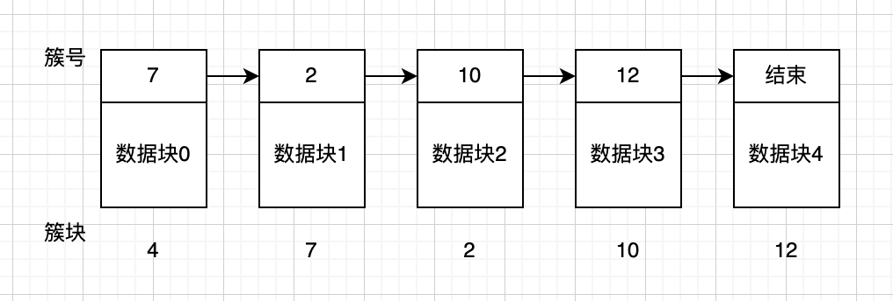
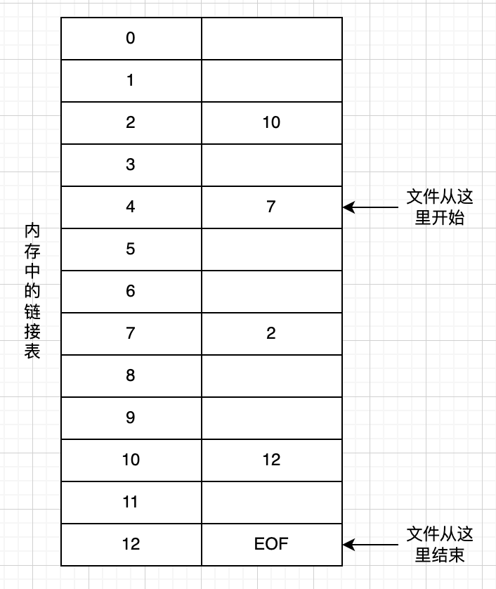

# 文件系统

文件系统管理是操作系统的重要功能之一，它为用户提供了在计算机系统中对数据信息进行长期、大量存储和访问的功能。文件的结构，以及文件的命名、访问、存储、保护和实现方法都是文件系统设计的主要内容。操作系统中处理文件的部分称为文件系统，文件系统包括了文件及管理文件的软件集合。

1.  [文件](#文件)
2.  [目录](#目录)
3.  [文件系统的实现](#文件系统的实现)

## 文件

文件命名：

*   文件名向用户提供了简单、直观的文件访问方式。
*   按名存取：用户访问文件时，只需给出要访问的文件名。在创建一个进程时，进程给出文件名。进程终止后，文件仍然存在。其他进程使用该文件名可以对该文件进行存取。
*   所有操作系统都支持1~8个字母组成的字符串作为文件名。一般情况下，文件名中也允许有数字和一些特殊字符。许多操作系统支持长达255个字符的文件名。UNIX文件系统区分大小写，MS-DOS系统不区分。如hello.c，圆点后面为扩展名，用于表示文件的类型。

文件结构：

*   无结构字节序列：也称为流式文件，如程序。
*   固定长度记录序列：构成文件的基本单位是具有固定长度的记录。
*   树形结构：文件由一棵记录树构成，记录长度不固定，在记录的固定位置包含一个关键字域，记录树按该域排序。

文件类型：ASCII文件和二进制文件。

*   ASCII文件：由多行正文组成，各行的长度不必相同。可以显示和打印，也可以用通常的文本编辑器进行编辑。
*   二进制文件：具有一定的内部结构，如可执行的exe文件。用通常的文本编辑器不能直接显示和打印。

文件存取：用户通过对文件的存取来完成对文件的各种操作，常用的文件存取方式分为顺序存取和随机存取。

*   顺序存取：进程从文件开始处读取文件中的所有字节或记录，不能跳过某些内容。如磁带。
*   随机存取：又称直接存取，可以任意顺序读取文件中的字节或记录。如磁盘。

文件属性：文件的创建日期、文件大小和修改时间等，这些附加信息称为文件属性。

文件操作：

*   CREATE：创建文件，并设置文件的一些属性。
*   DELETE：删除文件并释放磁盘空间。
*   OPEN：使用文件之前，必须先打开文件。
*   CLOSE：存取结束后，关闭文件以释放内存空间。
*   READ：从文件中读取数据。
*   WRITE：往文件中写数据。
*   APPEND：在文件尾部添加数据。
*   SEEK：对于随机存取文件，要指定从何处开始取数据。
*   GETATTRIBUTES：用于获取文件的属性。
*   SETATTRIBUTES：用于修改文件的属性。
*   RENAME：修改已有文件的文件名。

## 目录

文件系统通常提供目录或文件夹用于记录文件，很多系统中目录本身也是文件，目录是文件系统中实现按名访问文件的重要数据结构。

目录结构：

*   单层目录：也被称为根目录，在整个系统中设置一张线性目录表，表中包括了所有文件的描述信息。
*   两级目录：在两级目录结构中，目录被分成两级，第一级称为主目录，给出了用户名和用户子目录所在的物理位置。第二级称为用户目录，给出了该用户所有文件的文件控制块。两级目录解决了文件重名和共享问题。
*   树形目录：也称为多级目录，最高层为根目录，最底层为文件，用户可以创建任意数量的子目录。便于文件的分类，层次结构清晰，便于管理和保护，解决了重名文件，查找速度快。

路径名：用目录树组织文件系统时，需要有某种方法指明文件名。常用的方法有两种有绝对路径名和相对路径名。

*   绝对路径名：由从根目录到文件的路径组成。绝对路径名总是从根目录开始，并且是唯一的。在Windows系统中，路径各部分之间用“\”分隔，如C:\program\practice\test。
*   相对路径名：当一个文件系统的目录包含很多级时，可以允许用户指定一个目录作为当前的工作目录。所有的不从根目录开始的路径名都是相对于工作目录的。如practice\test。
*   两个特殊的目录项“.”和“..”，分别表示当前目录和当前目录的父目录。

## 文件系统的实现

前面讨论的文件系统，主要是从用户的角度探讨问题。用户关心的是文件怎样命名，可以进行哪些操作、目录树是什么样的等问题。而系统解决文件和目录怎样存储，文件的存储空间怎样管理，以及怎样使系统有效而可靠地工作。

实现文件：

*   将分配给文件的连续扇区构成的磁盘块称为簇。
*   连续分配：把每个文件作为一连串连续数据块存储在磁盘上。每个文件都从新的簇开始存放。
    *   优点：实现简单，记录每个文件用到的簇仅需存储两个数字，第一块的磁盘地址和文件的块数；读操作性能好。
    *   缺点：随着时间的推移，磁盘会变得零碎。删除文件所释放的簇形成”空洞“。这些”空洞“再次利用比较困难。
*   使用磁盘的链接表分配：
    *   该方法为每个文件构造簇的链接表，每个簇开始的几个字节用于存放下一个簇的簇号，簇的其他部分存放数据，每个文件可以存放在不连续的簇中。在目录项中只需存放第一个数据块的磁盘地址，文件的其他块可以根据这个地址来查找。
    *   优点：可以充分利用每个簇，不会因为磁盘碎片而浪费存储空间，管理也比较简单。
    *   缺点：随机存取相当缓慢，要获取文件的第n块，每一次都要从头开始读取前面的n-1块。
    *   
*   使用内存的链接表分配：
    *   该方法是将文件所在的磁盘的簇号存放在内存的表中。访问文件时，只需从内存文件分配表中顺着某种链接关系查找簇的簇号，根据簇号查找文件的所有块。
    *   缺点：必须把整个表都放在内存中，不适合大容量的磁盘。
    *   
*   i-结点：
    *   该方法为每个文件赋予一个被称为i结点的数据结构，其中列出了文件属性和文件块的磁盘地址。给定一个文件的i结点，就有可能找到文件的所有块。当访问文件时，系统先根据文件名搜索文件所在的目录文件，从该文件对应的目录项中找到文件的i结点号，根据i结点号从磁盘中将i结点信息读入内存，文件在磁盘中的地址信息都存放在i结点中。

实现目录：系统在读文件前，必须先打开文件。打开文件时，操作系统利用用户给出的路径名找到相应的目录项，目录项中提供了查找文件簇所需要的信息。

磁盘空间管理：

*   磁盘空间管理是文件系统的重要功能，包括记录空闲磁盘信息，设计文件的存储方式，以及规定文件系统的簇大小等内容。
*   簇大小：文件系统为文件分配磁盘空间是以簇为单位的。一般簇的大小是2的整数次幂个连续的扇区。如1个扇区是512个字节，连续两个扇区大小为1KB；连续4个扇区，大小为2KB。
*   示例：将分配给文件的连续扇区构成的磁盘块称为簇，文件系统为文件分配磁盘空间是以簇为单位的。
*   记录空闲块：
    *   空闲簇链接表：用一些空闲簇存放空闲簇的簇号。一个簇存放尽可能多的空闲簇的簇号，并专门留出最后几个字节放指向下一个存放空闲簇的指针。
    *   位图：用n位位图对应磁盘的n个簇，在位图中，空闲簇用1表示，已分配簇用0表示。每个簇只用一个二进制位标识，所需空间少。
