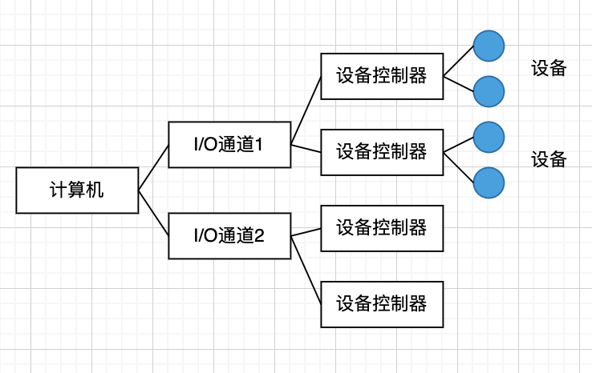
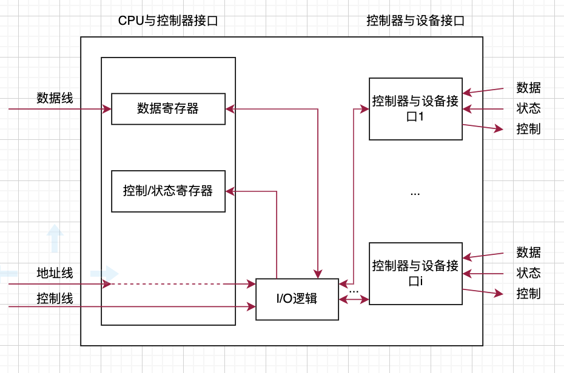
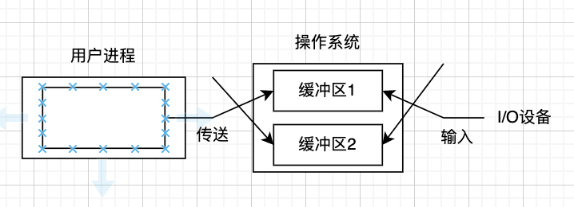
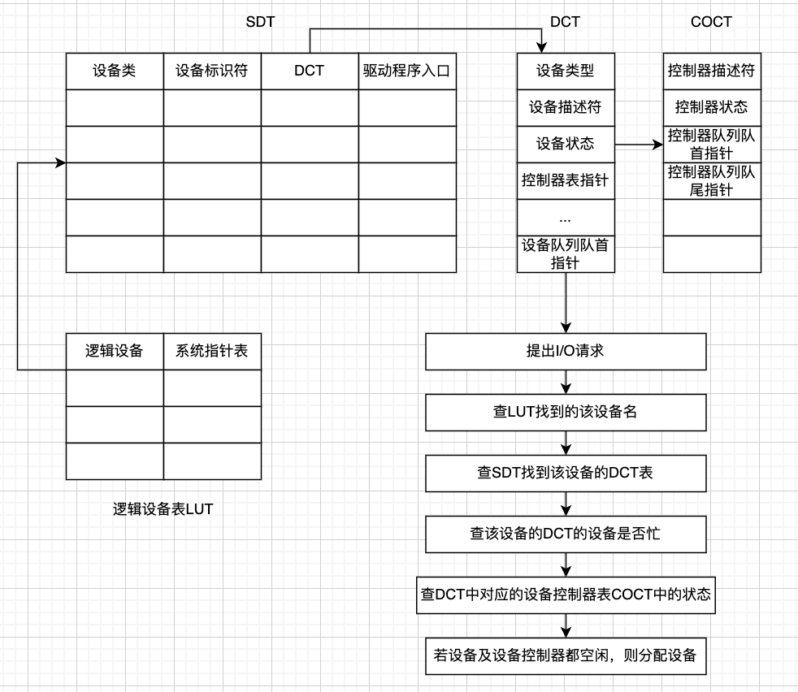
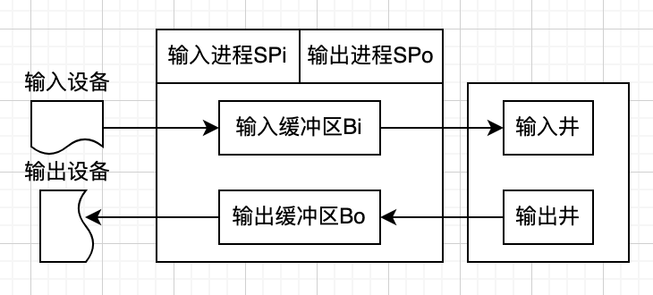
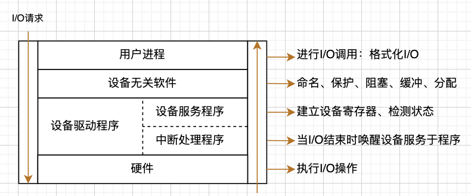
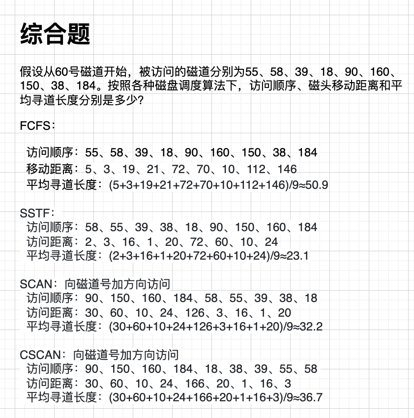

# I/O设备管理

1.  [I/O系统的组成](#io系统的组成)
2.  [I/O控制方式](#io控制方式)
3.  [缓冲管理](#缓冲管理)
4.  [设备分配](#设备分配)
5.  [I/O软件管理](#io软件管理)
6.  [磁盘管理](#磁盘管理)

## I/O系统的组成

I/O系统的组成的概述：I/O系统不仅包括各种I/O设备，还包括与设备相连的设备控制器，有些系统还配备了专门用于输入/输出控制的专用计算机，即通道。此外，I/O系统要通过总线与CPU、内存相连。

I/O系统的结构：

*   微机I/O系统：CPU与内存之间可以直接进行信息交换，但不能与设备直接进行信息交换，必须经过设备控制器。
*   主机I/O系统：I/O系统可能采用四级结构：主机、通道、控制器和设备。一个通道可以控制多个设备控制器，一个设备控制器也可以控制多个设备。
*   

I/O设备的分类：

*   按传输速率分类：低速设备，如键盘和鼠标；中速设备，如打印机；高速设备，如磁带机、磁盘机、光盘机。
*   按信息交换的单位分类：
    *   块设备：数据的存取以数据块为单位，如磁盘。块设备在块中保存信息，块的大小通常是固定的，一次只传送一块，通过块号访问数据。
    *   字符设备：传送字节流。打印机、鼠标等都是字符设备。
*   按设备的共享属性分类：
    *   独占设备：必须作为临界资源以互斥方式访问的设备。在一个进程没有使用完之前，其他进程不能访问，直到设备被释放，如打印机。
    *   共享设备：允许多个进程共同访问的设备，如磁盘。但同一时刻只能有一个进程对磁盘进行读写。
    *   虚拟设备：通过某种技术将一台物理设备虚拟成若干逻辑设备。

设备控制器：

*   设备控制器是CPU与I/O设备之间的接口，接收I/O的命令并控制设备完成I/O工作。设备控制器可编址，连接多个设备时可有多个设备地址。控制器可直接做在主板上，也可以做成插卡插在主板上。目前有些设备的控制器嵌入在设备中，如激光打印机。
*   设备控制器的功能：
    *   接收和识别命令：接收CPU的命令和参数存放在控制器的控制寄存器中，并对命令和地址译码。
    *   数据交换：通过数据寄存器进行数据交换。将驱动器中的比特流汇集在控制器的缓冲区中以形成字节块。实现CPU到控制器、控制器到CPU的双向数据传送。将控制器对设备的控制命令传送给设备控制器。
    *   设备状态的了解和报告：CPU通过读取设备状态寄存器的信息了解设备的当前状态。
    *   地址识别：设备控制器能够识别它所控制的每个设备的地址。设备控制器中的寄存器本身应该有唯一的地址，以使CPU能向寄存器中读/写数据。将CPU要访问的外设地址送入控制器，由控制器的地址译码器译码后选中目标设备。
    *   数据缓存：在设备控制器中可以存储数据，作为CPU和I/O之间的缓冲。
    *   差错控制：设备控制器需要具有差错检测功能，当通过数据校验发现数据传输出错时，可以向CPU报告，放弃错误数据，重新启动一次数据传输。
*   

I/O通道：通道用于大型主机系统控制I/O设备，与控制设备结合，用来代替微机、小型机中的设备控制器，实现大型主机系统的I/O设备控制功能，提供操作系统与I/O设备间的接口。I/O通道是一种特殊的处理机，具有执行I/O指令的能力，并通过执行通道程序来控制I/O操作。

## I/O控制方式

I/O控制方式的概述：在输入/输出控制方式的发展中始终追求的目标是尽量减少主机对输入/输出控制的干预，提高主机与输入/输出的并行程度，以提高整个系统的性能。

轮询：

*   早期的计算机系统，没有中断机制，处理器对输入/输出的控制采取轮询方式。
*   采用轮询方式，主机发送I/O控制命令之前，先反复检测设备控制器状态寄存器的忙/闲标志，若设备”忙“，主机继续检测该标志位，直到该位为“空闲”，主机发送I/O指令。在主机发送完I/O指令后，设备控制器把状态寄存器的忙/闲标志位再置成“忙”，主机再次进入轮询状态，以检测本次输入/输出是否结束。
*   这种控制方式使CPU经常处于由于输入/输出而造成的循环测试状态，造成CPU的极大浪费，影响整个系统的吞吐量。

中断：

*   现代计算机系统广泛采用中断控制方式完成对I/O的控制。
*   采用中断模式是CPU执行过程中，发出输入/输出请求，若此时I/O设备忙，则进程阻塞等待。当处于“忙”状态的设备工作完毕，通过中断控制器发出中断请求信号，CPU响应中断，执行对应该设备的中断处理程序，然后唤醒因等待该设备而被阻塞的进程。
*   CPU继续执行这个进程时，向设备控制器发送I/O指令，然后CPU被调度程序分配给某个进程，继续执行某个程序。自此，在设备控制器控制设备完成本次I/O的过程中，I/O与CPU并行工作。当本次I/O结束后，设备控制器通过向CPU发送中断请求信号告知CPU本次数据传输结束。
*   中断控制的工作方式能使CPU与I/O设备在某些时间段上并行工作，提高CPU的利用率和系统的吞吐量。

DMA控制方式：

*   对于磁盘驱动器这类设备，每次数据传输量较大，若采用中断控制方式，传输一个数据块就需要进行多次中断处理，因此不适合用中断方式。为了进一步提高I/O的速度和CPU与I/O的并行程度，采用DMA方式。
*   DMA控制器的逻辑组成包括3部分：主机与DMA的接口、DMA与设备的接口、以及I/O控制逻辑。
*   为了实现主机与设备控制器之间成块数据的传送，在DMA控制器中设计了4类寄存器：命令/状态寄存器CR、内存地址寄存器MAR、数据计数器DC和数据寄存器DR。
    *   命令/状态寄存器CR：用于接收从CPU发来的I/O命令或有关控制信息、设备状态。
    *   内存地址寄存器MAR：存放内存地址，在输出数据时，存放输出数据在内存的起始地址，指示DMA应该从内存的什么地方读取输出数据。在输入数据时，存放输入数据将要被放入内存的起始地址，指示DMA应该把输入数据放到内存的什么地方。
    *   数据计数器DC：指示DMA，本次向CPU发中断信号要读或写数据的次数。
    *   数据寄存器DR：用于暂存DMA传输中要输入或输出的数据。
*   通过DMA从磁盘读数据的过程：
    *   当CPU要从磁盘读入一个数据块时，便向磁盘控制器发送一条读命令，该命令被送到命令寄存器CR中。同时，CPU将本次读入数据将要放在内存中的起始地址送内存地址寄存器MAR，将本次要读的字节数送DC。
    *   然后，启动DMA控制器进行数据传送。在DMA控制输入的过程中，CPU可以执行其他的进程。当本次读入的数据全部传送完毕后，DMA向CPU发送中断请求。
    *   在DMA控制磁盘读入数据的过程中，每读入一个字（节），便将该字（节）送到当前MAR指示的内存单元中，然后MAR的值递增，指向下一个内存单元。DC减1，若DC递减后的值不为0，说明本次数据传送没有结束，继续在DMA控制下传送下一个字节；若DC减1后变为0，说明本次数据传输结束，由DMA向CPU发中断请求。

## 缓冲管理

缓冲管理的概述：缓冲区是用来保存两个设备之间或设备与应用程序之间传输数据的内存区域，由于CPU的速度远高于I/O设备，为了尽可能使CPU与设备并行工作，提高系统的性能，通常需要操作系统在设备管理软件中提供缓冲区管理功能。

缓冲的引入：

*   引入缓冲区的原因主要有一下两点：处理数据流的生产者与消费者之间的速度差异；协调传输数据大小不一致的设备。
*   引入缓冲区除了可以缓和CPU与I/O设备之间速度不匹配的矛盾，还能降低对CPU中断频率的要求，放宽对中断响应时间的限制，提高CPU和I/O设备之间的并行性。

缓冲的区分：

*   单缓冲：当一个用户进程发出I/O请求时，操作系统为该操作分配一个位于主存的缓冲区。对于面向块的设备，采用单缓冲，输入设备不是把数据直接送给用户进程，而是把数据送入到所设置的缓冲区中，用户进程总是从缓冲区中去取所需要的数据。
*   双缓冲：是对单缓冲方案的改进。当一个进程往一个缓冲区中传送数据（或从这个缓冲区中读取数据）时，操作系统正在清空（或填充）另一个缓冲区，称为双缓冲，或缓冲交换技术。双缓冲性能比单缓冲有所提高，但这种提高是以增加复杂性为代价的。
*   
*   循环缓冲：在数据的输入和输出速度差异很大时，需要增加缓冲区的数量，可引入循环缓冲。
    *   循环缓冲的组成：
        *   多个缓冲区。如空缓冲区R，生产者进程下一个可用的空缓冲区；已装满数据的缓冲区G，用于指示消费者进程下一个可用的装有产品的缓冲区；现行工作缓冲区C，消费者进程正在使用的工作缓冲区。
        *   多个指针：NextG，用于指示消费者进程下一个可用的装有数据的缓冲区；NextI，用于指示生产者进程下一个可用的空缓冲区；Current，用于指示进程正在使用的工作缓冲区。
    *   循环缓冲的工作方式：使用缓冲可以使生产者和消费者进程并行执行。循环缓冲的多个缓冲区构成一个环，指针NextI和指针NextG不断地沿顺时针方向移动。当NextI指针追上NextG指针，即生产者进程速度大于消费者进程速度，没有空缓冲区，全部缓冲区已满。此时，需要阻塞生产者进程，等待消费者进程为生产者进程释放空缓冲区R。当NextG指针追上NextI指针，消费者进程速度大于生产者进程速度，全部缓冲区已空。此时，需要阻塞消费者进程，等待生产者进程为消费者进程释放装有数据的缓冲区G。
*   缓冲池：公共缓冲池是被广泛应用的一种缓冲管理技术，公共缓冲池中设置多个可供若干进程共享的缓冲区，这种方式能提高缓冲区的利用率。
    *   缓冲池的组成：公共缓冲池既可用于输入，又可用于输出，其中至少包含3种类型的缓冲区、3种缓冲队列和4种工作缓冲区。
    *   三种类型的缓冲区：空缓冲区、装满输入数据的缓冲区和装满输出数据的缓冲区。
    *   三种队列：空缓冲队列、输入队列和输出队列。
    *   四种工作缓冲区：
        *   收容输入数据的缓冲区：收容完输入数据后，缓冲区被插入输入队列中。
        *   提取输入数据的缓冲区：存在于输入队列中，进程需要输入数据时，先从输入队列中获取这种缓冲区。
        *   收容输出数据的缓冲区：收容完输出数据后，缓冲区被插入输出队列中。
        *   提取输出数据的缓冲区：存在于输出队列中，进程需要输出数据时，先从输出队列中获取这种缓冲区。

## 设备分配

设备分配的概述：在多道程序环境下，系统中的设备不允许用户自行使用，须由系统分配。每当进程向系统提出I/O请求时，设备分配程序便按照一定的策略，把设备分配给用户。设备分配功能的完成，需要记录设备情况的数据结构和设备分配算法。

设备分配中的数据结构：支持设备分配的数据结构需要记录设备的状态（忙或空闲)、设备类型等基本信息。设备分配方案包括设备控制表、控制器控制表、通道控制表和系统设备表。

*   设备控制表DCT（Device Control Table）：
    *   系统为每个设备建立一张设备控制表，多台设备的设备控制表构成设备控制表集合。
    *   每张设备控制表包含以下信息：设备类型；设备标志符；设备状态（忙/闲）；指向控制器表的指针；重复执行的次数或时间；请求设备队列的对首指针。
*   控制器控制表COCT（Controller Control Table）：
    *   系统为每个控制器设置一张用于记录该控制器信息的控制器控制表。
    *   每张控制器控制表包含以下信息：控制器标识符；控制器状态；与控制器相连接的通道表指针；控制器队列的队首指针；控制器队列的队尾指针。
*   通道控制表CHCT（Channel Control Table）：
    *   在一些主机系统中还有通道设备，系统会为每个通道设备设置一张通道控制表。
    *   每张通道控制表包含以下信息：通道标识符；通道状态；与通道相连的控制器表指针；通道队列的队首指针；通道队列的队尾指针。
*   系统设备表SDT（System Device Table）：记录了系统中全部设备的情况。每个设备占一个表目，其中包括设备类型、设备标识符、设备控制表及设备驱动程序的入口地址。
*   

设备分配：为使系统有条不紊地工作，系统在分配设备时应该考虑设备的固有属性、设备分配算法和设备分配时的安全性。

*   设备的固有属性：独占性、共享性和可虚拟性。

设备独立性：

*   设备独立性的概念：也称为设备无关性，提高了操作系统的可适应性和可扩展性。其含义是应用程序独立于具体使用的物理设备。为了实现设备独立性，引入了逻辑设备和物理设备这两个概念。在应用程序中，使用逻辑设备名称来请求使用某类设备，而系统在实际执行时，还必须使用物理设备名称。因此，系统必须具有将逻辑设备名称转换为物理设备名称的功能。
*   实现设备独立性带来的好处：应用程序与物理设备无关；易于处理输入/输出设备的故障；提高了系统的可靠性。
*   设备独立软件：执行所有设备的公有操作。包括独占设备的分配与回收、将逻辑设备名称映射为物理设备名、对设备进行保护、缓冲管理和差错控制。
*   为了实现逻辑设备名到物理设备名到转化，可以利用称为逻辑设备表LUT的数据结构。在该表中的每个表目中都包含逻辑设备名、物理设备名。LUT的设置可采用两种方式：为整个系统设置一张LUT或为每个用户设置一张LUT。

独占设备的分配程序：对于具有I/O通道的系统，在进程提出I/O请求后，系统的设备分配程序可按下列步骤进行设备分配。

*   分配设备：根据用户请求的设备的物理名，查找系统设备表，从中找出该设备的设备控制表，检查设备控制表中的设备状态字。若设备忙，则将进程阻塞在该设备的阻塞队列中；若设备空闲，则根据设备分配算法将设备分配给进程。
*   分配控制器：若系统为进程分配了其请求的设备，就到该设备的控制表中找出与该设备连接的控制器的COCT，即设备控制器控制表，检查其中的状态字段。若该控制器忙，则将请求I/O的进程阻塞在该设备控制器的阻塞队列中；若控制器空闲，则将它分配给进程。
*   分配通道：在有通道的系统中，还需要从相应的设备控制器控制表中找到与该控制器连接的通道控制表，检查表中的通道状态字段。若通道忙，则将进程阻塞在该通道的阻塞队列上；若通道空闲，则将该通道分配给进程。当进程获得了设备、设备控制器或者获得了设备、设备控制器和通道时（在有通道的系统中），系统的本次设备分配才算成功，系统可以启动进程的I/O。

SPOOLing技术：

*   联机输入/输出是指作业的I/O是联机的，也就是作业从输入机到磁带，由磁带调入内存，以至于结果的输出和打印都是由中央处理机直接控制的。而脱机输入/输出是指外设不由中央处理机直接控制，主要由外围计算机与外设打交道。
*   在多道程序环境下，利用一道程序来模拟脱机输入时的外围控制机的功能，把低速I/O设备上的数据传送到高速输出磁盘上，再利用另一道程序来模拟脱机输出时外围控制机的功能，把数据从磁盘传送到低速输出设备上。这种在联机情况下实现的同时外围操作称为SPOOLing。
*   SPOOLing系统的组成：
    *   输入井和输出井。是位于磁盘上的两个分别存放输入数据和输出数据的存储区域，作为大量输入或输出数据的缓存。
    *   输入缓存区和输出缓冲区。输入缓冲区用来暂存由输入设备送来的输入数据，输出缓冲区用来存放从输出井送来的输出数据，以后再传给输出设备。
    *   输入进程和输出进程。输入进程把输入设备送来的数据送入输入缓存，再把缓存中的数据送入输入井。当消费者进程需要输入数据时，再从输入井把输入数据读入内存。输出进程把要输出的数据从内存送入输出井，当需要输出数据时，再从输出井把数据读到输出缓存，数据从输出缓存送往输出设备。
    *   请求I/O队列。请求输入或输出的进程提交的输入/输出任务组成的队列。
*   
*   利用SPOOLing技术实现共享打印机：
    *   当用户进程提出打印请求时，SPOOLing系统先为用户做下列两件事：由输出进程在输出井中申请空闲盘块区，并将要打印的数据送入其中；输出进程再为用户申请并填写一张用户请求打印表，将该表挂到请求打印队列上。
    *   当打印机空闲时，输出进程完成以下动作：
        1.  从请求打印队列队首取一张请求打印表。
        2.  将打印数据从输出井送到打印机缓存区（输出缓存区）。
        3.  打印。
        4.  打印完毕，若打印队列不为空，则转第1步。
*   特点：提高I/O速度；将独占设备改造成为共享设备；实现了虚拟设备功能。

## I/O软件管理

I/O软件的总体目标是将软件组织成一种层次结构，低层软件用来屏蔽硬件的具体细节，高层软件则主要是为用户提供一个简洁、规范的界面。

设备管理软件分4个层次：用户层软件、与设备无关的软件层、设备服务程序和中断处理程序。

设备管理软件与硬件关系最密切的是设备驱动程序，包括设备服务程序和中断处理程序。设备驱动程序上层是设备无关软件，通常完成设备命名、设备分配、设备独立性和缓冲管理等功能。最上层的用户进程向系统发送I/O请求，显示I/O操作的结果，提供用户与设备的接口。

设备管理软件的功能：

*   实现I/O设备的独立性：I/O设备发生变化，应用程序的代码不需要修改。
*   错误处理：错误应该在尽可能接近硬件的地方处理，只有在低层软件处理不了的情况下才通知高层软件。
*   异步传输：CPU启动传输操作后便转向其他工作，直到中断到达。
*   缓冲管理：由于设备之间的速度差异，必须提供缓冲管理。为所有的块设备和字符设备提供缓冲管理功能，并向高层软件屏蔽由于设备差异带来的缓冲管理实现的具体细节。
*   设备的分配和释放：对共享设备和互斥设备采取不同的方式为用户请求分配设备。设备使用完毕，要完成对设备的释放。
*   实现I/O控制方式：针对不同的设备提供不同的I/O控制方式。如打印机、键盘等字符设备实现中断控制。对磁盘这样的块设备既可以采用中断、也可以采用DMA方式，鉴于磁盘传输的特点，一般采用DMA控制方式。

中断处理程序：I/O中断处理程序的作用是将发出I/O请求而被阻塞的进程唤醒。用户进程在发出I/O请求后，由于等待I/O的完成而被阻塞。CPU转去执行其他任务，当I/O任务完成，控制器向CPU发中断请求信号，CPU转去执行中断处理程序，由中断处理程序唤醒被阻塞的设备用户进程。

设备驱动程序：

*   设备驱动程序是I/O进程与设备控制器之间的通信程序，其主要任务是接受上层软件发来的抽象的I/O请求，如read或write命令，把他们转换为具体要求后，发送给设备控制器，启动设备去执行。此外，它也将由设备控制器发来的信号传送给上层软件。每个设备驱动程序只处理一种设备，或者一类紧密相关的设备。
*   磁盘驱动程序工作如下：计算出所请求块的物理地址；检查驱动器电机是否正在运转；检查磁头臂是否定位在正确的柱面；确定需要哪些控制器命令及命令的执行顺序；向设备控制器的设备寄存器中写入命令；I/O完成后，向上层软件传送数据。
*   设备驱动程序属于操作系统的内核程序，但是一般由设备生产厂商开发，销售硬件设备时附送给用户，并不是由操作系统厂商提供。设备驱动程序要遵循操作系统提供的内核与设备驱动的接口标准。

与硬件无关的I/O软件实现的功能：设备命名（将设备名映射到相应的驱动程序）；设备保护（为设备设置合理的访问权限）；提供独立于设备的块大小；为块设备和字符设备提供必要的缓冲技术；块设备的存储分配；分配和释放独立设备；错误处理。

## 磁盘管理

磁盘存储器容量大，存取速度快，可以实现随机存取，是存放大量程序和数据的设备。现代计算机系统以磁盘存储器为主用于存放文件。计算机系统中对文件的操作，基本上都涉及对磁盘的访问。磁盘I/O速度的高低和磁盘系统的可靠性，都将直接影响系统性能。磁盘管理的重要目标是提高磁盘空间利用率和磁盘访问速度。

磁盘结构：

*   数据的组织和格式：
    *   磁盘设备可包括一个或多个物理盘片，每个磁盘片分一个或两个存储面。每个盘面被组织成若干个同心环，这种环称为磁道。在每条磁道上存储相同数目的二进制位。磁盘密度是内层磁道的密度高于外层。每条磁道又被划分成若干个扇区。一个物理记录存储在一个扇区上，磁盘上存储的物理记录数目是由扇区数、磁道数及磁盘面数决定的。为了在磁盘中存储数据，必须先将磁盘低级格式化。磁盘格式化完成后，一般要对磁盘分区。
    *   每个扇区包括两个字段：标志符字段和数据字段。
        *   标志符字段：利用磁头号、磁道号及扇区号三者来标识一个扇区。
        *   数据字段：其中可存放512个字节的数据。
*   磁盘的类型：固定头磁盘和移动头磁盘。
    *   固定头磁盘：每条磁道上都有读/写磁头，所有的磁头都被装在一个刚性磁臂中。通过这些磁头可访问各磁道且进行并行读/写，有效地提高了磁盘的I/O速度。这种结构的磁盘主要用于大容量磁盘上。
    *   移动头磁盘：每一个盘面仅配有一个磁头，也被装入磁臂中。为了能访问该盘面的所有磁道，该磁头必须能移动并进行寻道。移动磁头仅能以串行方式读/写，致使磁盘读写速度较慢，但由于其结构简单，故仍广泛应用于中小型磁盘设备中。
*   磁盘的访问时间：寻道时间、旋转延迟时间和传输时间。
    *   寻道时间：把磁臂（磁头）移动到指定磁道上所经历的时间。该时间是启动磁臂的时间与磁头移动条磁道所花费的时间之和。
    *   旋转延迟时间：指将指定扇区移动到磁头下面所经历的时间。
    *   传输时间：指把数据从磁盘读出或向磁盘写入数据时所经历的时间。

磁盘调度：磁盘是可供多个进程共享的设备，当有多个进程都要求访问磁盘时，应采用一种最佳调度算法，以使各个进程对磁盘的平均访问时间最短。

*   先来先服务（First Come First Served）：最简单的磁盘调度算法。根据进程请求访问磁盘的先后顺序进行调度。此算法平均寻道时间较长，寻道距离较大，适用于进程数目较少的场合。
*   最短寻道时间优先（Shortest Seek Time First）：该算法选择进程时要求访问的磁道与当前磁头所在的磁道距离最近，以使每次的寻道时间最短。但不能保证平均寻道时间最短。
*   扫描（SCAN）算法：SSTF最短寻道时间优先算法虽然能获得较好的寻道性能，但却可能导致某个进程发生“饥饿”现象。因为如果不断有新进程到达，总是访问与磁头所在磁道距离较近的磁道，较远的磁道可能总不能被调度。SCAN算法不仅考虑要访问的磁道与当前磁道的距离，更优先考虑磁头当前的移动方向。
*   循环扫描（CSCAN）算法：SCAN算法存在这样的问题，当磁头从里向外移动而越过了某一磁道时，恰好又有一进程请求访问此磁道，这时该进程需要等待很长的时间，待磁头继续自里向外，然后再自外向里扫描完所有要访问的磁道后，才处理该进程的请求，为了减少这种延迟，循环扫描（CSCAN）算法规定磁头单向移动，即只向里或向外移动。
*   
*   NStepSCAN和FSCAN算法：
    *   在前面几种算法中，可能会出现磁盘臂停留在某处不动的情况。如有一个或多个进程对某一磁道有较高的访问频率，从而垄断了整个磁盘设备。把这一现象称为“磁臂粘着”，在高密度磁盘上容易出现此情况。
    *   NStepSCAN算法将磁盘请求队列分成若干个长度为N的子队列，按FCFS算法依次调度这些子队列，在队列内部按SCAN算法，对一个队列处理完后，再处理其他队列。当正在处理某子队列时，如果又出现新的磁盘I/O请求，便将新请求进程放入其他队列，这样可避免磁臂粘着现象。
    *   FSCAN算法是NStepSCAN算法的简化，只将磁盘请求队列分成两个子队列。一个是由当前所请求磁盘I/O的进程形成的队列，由SCAN算法进行处理。在扫描期间，将新出现的所有请求磁盘I/O的进程，放入另一个等待处理的请求队列。这样，所有的新请求都将被推迟到下一次扫描时处理。

提高磁盘I/O速度的方法：磁盘的I/O速度远低于内存的访问速度，通常要低4~6个数量级。

*   提前读：系统根据现在用户请求读的内容，把预计最近不久可能要读的内容与现在请求读的内容一起提前读入内存。
*   延迟写：在支持请求分页的虚拟存储管理中，对修改过的换出页，在把页标记为换出页时并不马上把页的内容写入磁盘，而是暂时保留在内存中，直到这些页所在的页框要被使用，导致页的内容将被覆盖前才启动磁盘操作，把修改过的一个或若干页写入磁盘，这种延迟写的策略减少了写磁盘的次数。
*   优化物理块的分布：寻道时间和磁盘旋转延迟时间通常占据了磁盘I/O所耗费时间中的主要部分，所以适当地集中数据在磁盘上存放的位置，可以减少磁臂移动距离，有利于提高传输速率。为了达到这一目的，可以采取优化文件物理块分布的方法。原则就是尽可能地把一个文件存放在同一个磁道或者相邻的磁道上。实现这个原则的技术一是以连续的几个扇区即一个簇作为磁盘块的分配单位，另一个技术是把磁盘分成块组，一个块组中的不同簇都在相邻的磁道上，一个文件尽可能地放在同一个块组中。
*   虚拟盘：指利用内存空间去仿真磁盘，又称RAM盘。虚拟盘可以接受所有标准的磁盘操作，但这些操作的执行不是在磁盘上，而是在内存中。对虚拟盘的访问比对磁盘的访问速度快，虚拟盘用于存放临时性文件，如编译程序所产生的目标程序等。
*   磁盘高速缓存：指内存的一块存储空间，用来暂存从磁盘中读出的一系列盘块中的信息。因此，高速缓存是一组逻辑上属于磁盘，而物理上是驻留在内存中的盘块。
