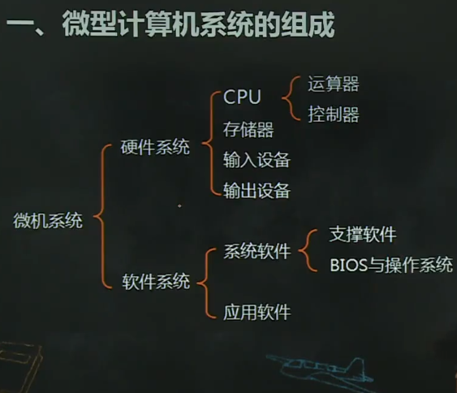
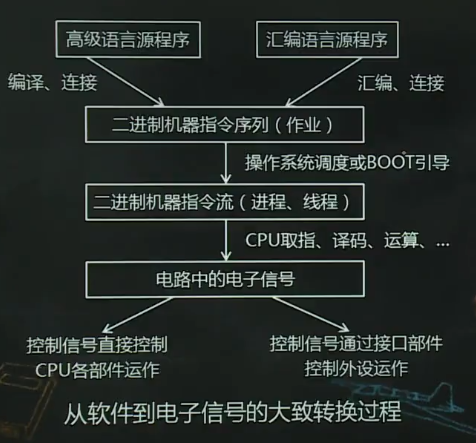

# 微型计算机系统概述

1.  [微型计算机系统的组成](#微型计算机系统的组成)
2.  [微型计算机系统的工作过程](#微型计算机系统的工作过程)
3.  [微型计算机的组成结构](#微型计算机的组成结构)

## 微型计算机系统的组成

微型计算机系统主要性能指标：

*   字长：指微型计算机系统中CPU一次能处理的二进制位数。8086：16，inter i5：64。
*   主频：CPU工作时，其节拍由计算机的主时钟控制。主频即主时钟的频率。8086：5MHz。
*   速度：运行速度即每秒所能执行的指令条数。
*   主存容量：微型计算机内部存储器能存放数据的最大字节数。
*   存取时间：主存完成一次读/写所需要的时间称为主存储器的存取时间。
*   兼容性：指同一个软件不加修改就可以在两台机器上运行。

## 微型计算机系统的工作过程

微型计算机系统的工作原理：

*   硬件结构：冯·诺依曼结构。
*   特点：程序和数据都以二进制形式存放在存储器中。
*   工作原理：存储程序，程序控制。

微型计算机系统的工作过程：指逐条执行进入到内存中的二进制机器指令流的过程。（取指令，执行指令）。

## 微型计算机的组成结构

8086：16位；80386：32位；Core：64位。

微型计算机硬件系统；主板（CPU，存储器，系统芯片，I/O接口插槽），I/O接口卡（显示卡，声卡，视频卡...）。微机系统内的各部件通过总线连接，可分为三类：CPU总线，系统总线，通信总线。

现代计算机的3芯片平台架构：CPU，北桥芯片，南桥芯片。

芯片组由一组单功能或多功能的系统芯片组成：

*   支持和协调整个系统有条不紊地工作。
*   决定存储器类型和接口类型。
*   决定总线类型，并对总线进行控制。
*   控制微处理器和外设之间的数据传送。
*   为功能扩展提供接口和总线插槽。
